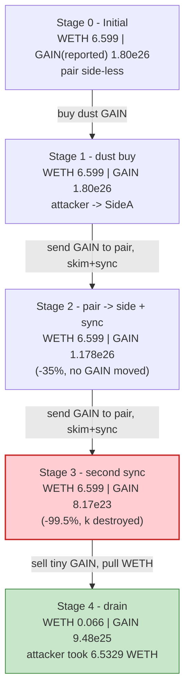
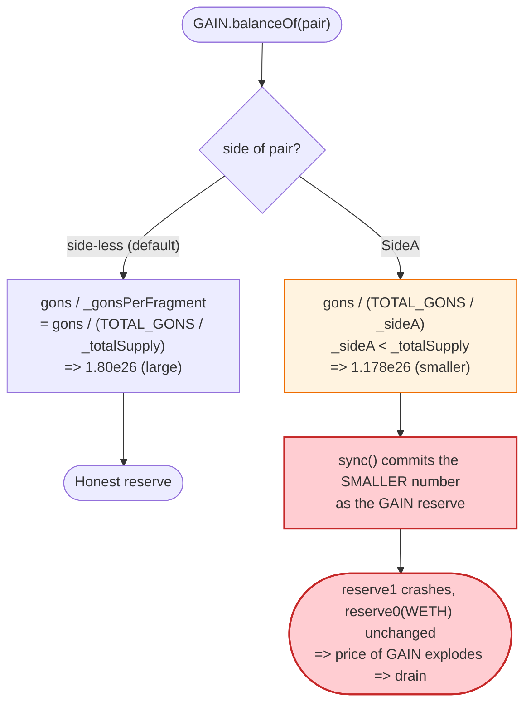

# GAIN (GainOS) Exploit — Path-Dependent `balanceOf` Rebase Bug Drains the AMM Reserve

> **Vulnerability classes:** vuln/logic/state-update · vuln/logic/incorrect-state-transition

> **Reproduction:** the PoC compiles & runs in an isolated Foundry project at
> [this project folder](.) (the umbrella DeFiHackLabs repo contains many unrelated
> PoCs that do not whole-compile, so this one was extracted standalone).
> Full verbose trace: [output.txt](output.txt).
> Verified vulnerable source: [GAIN.sol](sources/GAIN_dE59b8/GAIN.sol) ·
> victim AMM: [UniswapV2Pair.sol](sources/UniswapV2Pair_31d80E/UniswapV2Pair.sol).

---

## Key info

| | |
|---|---|
| **Loss** | ~**6.4329 WETH** (≈ 18 ETH per the PoC header / SlowMist; the on-chain fork drains the single GAIN/WETH pool of **6.433 of its 6.599 WETH**) |
| **Vulnerable contract** | `GAIN` (GainOS) — [`0xdE59b88abEFA5e6C8aA6D742EeE0f887Dab136ac`](https://etherscan.io/address/0xdE59b88abEFA5e6C8aA6D742EeE0f887Dab136ac#code) |
| **Victim pool** | GAIN/WETH Uniswap V2 pair — [`0x31d80EA33271891986D873B397d849A92EF49255`](https://etherscan.io/address/0x31d80EA33271891986D873B397d849A92EF49255) |
| **Flash-loan source** | Uniswap V3 USDT/WETH pool — [`0xc7bBeC68d12a0d1830360F8Ec58fA599bA1b0e9b`](https://etherscan.io/address/0xc7bBeC68d12a0d1830360F8Ec58fA599bA1b0e9b) |
| **Attacker EOA** | [`0x0000000f95c09138dfea7d9bcf3478fc2e13dcab`](https://etherscan.io/address/0x0000000f95c09138dfea7d9bcf3478fc2e13dcab) |
| **Attacker contract** | [`0x9a4b9fd32054bfe2099f2a0db24932a4d5f38d0f`](https://etherscan.io/address/0x9a4b9fd32054bfe2099f2a0db24932a4d5f38d0f) |
| **Attack tx** | [`0x7acc896b8d82874c67127ff3359d7437a15fdb4229ed83da00da1f4d8370764e`](https://etherscan.io/tx/0x7acc896b8d82874c67127ff3359d7437a15fdb4229ed83da00da1f4d8370764e) |
| **Chain / fork block / date** | Ethereum mainnet / forked at 19,277,619 (tx in 19,277,620) / Feb 2024 |
| **Compiler** | GAIN: Solidity v0.8.7, optimizer 200 runs · Pair: v0.5.16 |
| **Bug class** | Broken AMM invariant via a token whose `balanceOf` is **path-dependent / manipulable** (rebase "side" accounting) combined with permissionless `skim()`/`sync()` |

---

## TL;DR

`GAIN` is a "gamified rebasoor." Every holder is secretly placed on one of two teams — `SideA`
or `SideB` — and a holder's **reported balance is computed with a different divisor depending on
which side they are on**:

```solidity
// GAIN.sol:758-768
function balanceOf(address who) public view override returns (uint256) {
    if (... _children_of_gainos[who] == sideA) return _gonBalances[who].div(TOTAL_GONS.div(_sideA));
    else if (... _children_of_gainos[who] == sideB) return _gonBalances[who].div(TOTAL_GONS.div(_sideB));
    else return _gonBalances[who].div(_gonsPerFragment);   // default divisor
}
```

The three divisors are **not equal**. `_sideA` and `_sideB` are initialized to the original
`INITIAL_FRAGMENTS_SUPPLY` and only ever grow by the per-side reward yield, while the default
divisor `_gonsPerFragment = TOTAL_GONS / _totalSupply` tracks the (much larger, rebased)
`_totalSupply`. At the fork block `_sideA / _totalSupply ≈ 0.654`, so **the same gon balance reports
~35 % less when the account is on `SideA` than when it is side-less.**

The fatal part: an account's side is assigned **the first time it receives GAIN while not fee-exempt**
([GAIN.sol:898-908](sources/GAIN_dE59b8/GAIN.sol#L898-L908)). Nothing exempts the AMM pair. So an
attacker can **force the pair onto a side by simply sending it dust GAIN**, instantly shrinking
`balanceOf(pair)` — without any GAIN actually leaving the pool. They then call the pair's
permissionless **`skim()` + `sync()`** to commit that fake, smaller balance as the pool's new GAIN
reserve. The constant product `k` collapses and the marginal price of GAIN explodes; the attacker
sells a trivial amount of GAIN and walks away with almost the entire WETH reserve.

The whole thing is wrapped in a `0.1 WETH` Uniswap-V3 flash loan, so the attacker risks ~nothing.

---

## Background — what GAIN does

`GAIN` ([source](sources/GAIN_dE59b8/GAIN.sol)) is an Ampleforth-style rebase ("gons") token with a
gamification layer:

- **Gons accounting.** Internally every account holds `_gonBalances[who]` (a huge fixed integer).
  The public balance is `gons / divisor`. `TOTAL_GONS` is the fixed `MAX_UINT256 - (MAX_UINT256 %
  INITIAL_FRAGMENTS_SUPPLY)` ([:600](sources/GAIN_dE59b8/GAIN.sol#L600)).
- **Rebase ("snap").** `snap()` periodically inflates `_totalSupply` and recomputes
  `_gonsPerFragment = TOTAL_GONS / _totalSupply` ([:723](sources/GAIN_dE59b8/GAIN.sol#L723)). Over the
  token's life `_totalSupply` had rebased far above the initial `INITIAL_FRAGMENTS_SUPPLY`.
- **Two "sides".** Each new, non-exempt holder is deterministically toggled onto `SideA` or `SideB`
  via the `_rejoice` flag on their first inbound transfer
  ([:898-908](sources/GAIN_dE59b8/GAIN.sol#L898-L908)). `_sideA` and `_sideB` are **separate**
  circulating-supply counters, each initialized to `_totalSupply` at construction
  ([:673-674](sources/GAIN_dE59b8/GAIN.sol#L673-L674)) and grown only by `snap()`.

The pool at the fork block (read from the trace's `getReserves`/`balanceOf` calls):

| Quantity | Value |
|---|---|
| Pair `token0` | **WETH** (`reserve0`) |
| Pair `token1` | **GAIN** (`reserve1`) |
| Pool WETH reserve (`reserve0`) | **6,598,936,314,221,857,031** wei ≈ **6.5989 WETH** ← the prize |
| Pool GAIN reserve, side-less (`balanceOf(pair)`) | 180,049,177,796,806,821,424,078,518 ≈ 1.80e26 |
| `_sideA / _totalSupply` (implied by the trace) | ≈ **0.6544** |

The single fact that makes this exploitable: **`balanceOf(pair)` is not anchored to anything the
pair controls** — it depends on a divisor the attacker can change for free by changing the pair's
"side".

---

## The vulnerable code

### 1. `balanceOf` divisor is path-dependent

```solidity
// GAIN.sol:758-768
function balanceOf(address who) public view override returns (uint256) {
    if (keccak256(abi.encodePacked(_children_of_gainos[who])) == keccak256(abi.encodePacked(sideA)))
    {
        return _gonBalances[who].div(TOTAL_GONS.div(_sideA));   // divisor A
    } else if (keccak256(abi.encodePacked(_children_of_gainos[who])) == keccak256(abi.encodePacked(sideB))) {
        return _gonBalances[who].div(TOTAL_GONS.div(_sideB));   // divisor B
    } else {
        return _gonBalances[who].div(_gonsPerFragment);         // default divisor
    }
}
```

`_gonsPerFragment = TOTAL_GONS / _totalSupply`. Divisor A is `TOTAL_GONS / _sideA`. Because
`_sideA < _totalSupply`, divisor A **>** the default divisor, so the **same** `_gonBalances[who]`
reports a **smaller** balance once `who` is on `SideA`. The reported balance of the pair therefore
*changes the instant the pair is moved onto a side* — even though the pair's gon balance has not
changed.

### 2. Side assignment is automatic on inbound transfer — and the pair is not exempt

```solidity
// GAIN.sol:898-908  (inside _transferFrom, after balances are updated)
if (keccak256(abi.encodePacked(_children_of_gainos[recipient])) != keccak256(abi.encodePacked(sideA)) &&
    keccak256(abi.encodePacked(_children_of_gainos[recipient])) != keccak256(abi.encodePacked(sideB)) && !_isFeeExempt[recipient])
{
    if (_rejoice == true) { _children_of_gainos[recipient] = sideA; _rejoice = false; }
    else                  { _children_of_gainos[recipient] = sideB; _rejoice = true;  }
}
```

The **pair address is a normal, non-exempt `recipient`.** Sending it any GAIN assigns it a side. In
the live trace the side-assignment write is visible as the storage value
`0x53696465410000…0a` ("SideA", short-string length 5) at
[output.txt:1616](output.txt) for the first non-exempt recipient.

### 3. The pair commits the fake balance with permissionless `skim()` + `sync()`

The Uniswap-V2 pair reads `balanceOf(pair)` at face value and writes it straight into its reserves:

```solidity
// UniswapV2Pair.sol:484-495
function skim(address to) external lock {                 // pushes (balance - reserve) out — here 0 for GAIN
    _safeTransfer(_token0, to, IERC20(_token0).balanceOf(address(this)).sub(reserve0));
    _safeTransfer(_token1, to, IERC20(_token1).balanceOf(address(this)).sub(reserve1));
}
function sync() external lock {                           // FORCES reserves := current balances
    _update(IERC20(token0).balanceOf(address(this)), IERC20(token1).balanceOf(address(this)), reserve0, reserve1);
}
```

`sync()` blindly trusts whatever `GAIN.balanceOf(pair)` now returns. Since GAIN's `balanceOf` just
shrank (the pair is on a "side"), `sync()` writes a **much smaller GAIN reserve** while the WETH
reserve is untouched. The pair's own K-guard in `swap()`
([UniswapV2Pair.sol:474-478](sources/UniswapV2Pair_31d80E/UniswapV2Pair.sol#L474-L478)) only
protects *the swap that calls it* — it cannot defend against `sync()` rewriting reserves out from
under it.

---

## Root cause — why it was possible

A Uniswap-V2 pair assumes one thing about its tokens: **`balanceOf` is a faithful, monotone record
of tokens actually held.** GAIN breaks that assumption in the most dangerous way:

> `GAIN.balanceOf(account)` is **not a function of how many tokens the account holds** — it is a
> function of how many *gons* it holds **divided by a divisor that the caller can change for free**
> by flipping the account's "side". No tokens move; the number just gets smaller.

Concretely, four design decisions compose into a critical bug:

1. **Path-dependent balance.** Three different divisors (`_gonsPerFragment`, `TOTAL_GONS/_sideA`,
   `TOTAL_GONS/_sideB`) for the *same* gon balance. They diverged because `_sideA`/`_sideB` were
   seeded at the tiny initial supply while `_totalSupply` rebased upward — so being on a side
   *reduces* your reported balance by ~35 %+.
2. **Free, attacker-controlled side assignment.** Any inbound GAIN transfer assigns a side to a
   side-less, non-exempt recipient. The AMM pair is neither side-locked nor fee-exempt, so the
   attacker assigns the **pair** a side by sending it dust.
3. **Permissionless `skim()`/`sync()`.** Anyone can force the pair to re-read and commit
   `balanceOf(pair)`. The attacker calls them right after shrinking the pair's reported balance,
   locking the fake (smaller) reserve in. (`sync()` is also wrapped inside the token itself via
   `manualSync()` / the snap path, but the standard pair entry points suffice.)
4. **No oracle / no balance sanity check.** The pair's reserve update has no TWAP, no bound on
   single-step reserve change, and trusts the token's `balanceOf` implicitly.

The intended "gamification" math (assigning sides, separate side supplies) was never meant to feed an
AMM, but because the pair holds GAIN like any other holder, the side machinery silently corrupts the
pool's accounting.

---

## Preconditions

- A GAIN/WETH Uniswap-V2 pool exists and holds real WETH liquidity (6.599 WETH at the fork block).
- `_sideA`/`_sideB` have diverged from `_totalSupply` (true after any rebase history) so that being
  on a side meaningfully shrinks the reported balance. (If all three divisors were equal the trick
  would be a no-op.)
- The pair is **not** fee-exempt and has not yet been assigned a side — true for the live pair.
- Tiny working capital to seed the manipulation and pay the flash-loan fee. The PoC borrows just
  **0.1 WETH** from a Uniswap-V3 flash and repays `0.1 WETH + 0.0001 WETH` fee, netting **6.4329 WETH**.

---

## Attack walkthrough (with on-chain numbers from the trace)

The pair is `token0 = WETH (reserve0)`, `token1 = GAIN (reserve1)`. All figures are taken directly
from the `Sync`/`Swap` events and `balanceOf` static-calls in
[output.txt](output.txt). The exploit body is
[`exploitGAIN()`](test/GAIN_exp.sol#L51-L63), invoked inside the flash callback
[`uniswapV3FlashCallback`](test/GAIN_exp.sol#L45-L49).

| # | Step (trace ref) | Pool WETH reserve | `balanceOf(pair)` GAIN | Effect |
|---|------------------|------------------:|-----------------------:|--------|
| 0 | **Initial** ([:1593-1622](output.txt)) | 6.5989e18 | 1.8005e26 (side-less) | Honest pool. |
| 1 | **Flash-borrow 0.1 WETH** from V3, transfer to pair, `swap(0, 100000)` buy 100,000 GAIN to attacker ([:1604-1629](output.txt)) | 6.5989e18 *(unchanged: WETH was donated, not swapped out)* | 1.8005e26 | Attacker gets dust GAIN; attacker assigned `SideA` (storage write at [:1616](output.txt)). |
| 2 | **Send 100 GAIN to pair** → pair assigned a side; **`skim` + `sync`** ([:1630-1663](output.txt)) | 6.5989e18 | **1.1782e26** (−35 %) | Pair now on a side → `balanceOf(pair)` divided by the larger side-divisor; `sync()` writes the shrunken reserve. **No GAIN left the pool.** |
| 3 | **Send 188 GAIN to pair** + a router micro-sell + **`skim` + `sync`** ([:1664-1741](output.txt)) | 6.5989e18 | **8.1688e23** (−99.5 %) | Reported GAIN reserve collapses to ~0.45 % of original; WETH reserve still intact. **Invariant destroyed.** |
| 4 | **Sell 1.3e14 GAIN** via router, then final raw `swap(6.5329e18 WETH out, 0)` ([:1742-1815](output.txt)) | **6.5989e16** | 9.481e25 | One trivial GAIN sell against the degenerate pool buys **6.5329 WETH** (≈ 99 % of the WETH side). |
| 5 | **Repay flash** `0.1 + 0.0001 WETH` to the V3 pool ([:1816-1827](output.txt)) | — | — | Loan + fee returned. |

**Why step 4 drains the pool.** After `sync()` the pair believes its reserves are
`reserve0 = 6.5989e18 WETH`, `reserve1 ≈ 8.17e23 GAIN`. The marginal price of GAIN (WETH per GAIN) is
now astronomically higher than reality, because `reserve1` was slashed while `reserve0` was untouched.
A modest GAIN input therefore satisfies the pair's K-check
([UniswapV2Pair.sol:477](sources/UniswapV2Pair_31d80E/UniswapV2Pair.sol#L477)) while pulling almost
the entire WETH reserve out. The final swap takes `amount0Out = 6,532,946,950,955,627,431` wei of
WETH ([:1800-1812](output.txt)), leaving the pool with only `6.5989e16` wei (1 % dust).

### Profit accounting (WETH)

| Direction | Amount (wei) | WETH |
|---|---:|---:|
| Flash-borrowed | 100,000,000,000,000,000 | 0.1 |
| Final WETH extracted from pool | 6,532,946,950,955,627,431 | 6.5329 |
| Flash repayment (principal + fee) | 100,010,000,000,000,000 | 0.10001 |
| **Net profit** (`balanceOf(attacker)` at end, [:1831-1834](output.txt)) | **6,432,936,950,955,627,431** | **≈ 6.4329** |

The attacker started with 0 WETH, borrowed 0.1, and ended holding **6.4329 WETH** — essentially the
pool's entire honest WETH liquidity, minus the dust left behind and the flash fee. PoC console
output: `Attack Exploit: 6.432936950955627431 ETH`.

---

## Diagrams

### Sequence of the attack

```mermaid
sequenceDiagram
    autonumber
    actor A as "Attacker contract"
    participant V3 as "Uniswap V3 USDT pool (flash)"
    participant R as "UniswapV2 Router"
    participant P as "GAIN/WETH Pair"
    participant T as "GAIN token"

    Note over P: "Initial: 6.599 WETH / 1.80e26 GAIN(reported)"

    A->>V3: "flash(0.1 WETH)"
    V3-->>A: "0.1 WETH"

    rect rgb(255,243,224)
    Note over A,T: "Step 1 — seed: buy dust GAIN"
    A->>P: "transfer 0.1 WETH (donation)"
    A->>P: "swap(0, 100000) -> 100,000 GAIN to attacker"
    T->>T: "assign attacker -> SideA"
    end

    rect rgb(227,242,253)
    Note over A,T: "Step 2 — force the PAIR onto a side"
    A->>T: "transfer 100 GAIN to pair"
    T->>T: "_children_of_gainos[pair] := SideA"
    A->>P: "skim(attacker)  (GAIN excess = 0)"
    A->>P: "sync()"
    Note over P: "balanceOf(pair) shrinks 1.80e26 -> 1.178e26<br/>reserve committed; NO GAIN moved"
    end

    rect rgb(255,235,238)
    Note over A,T: "Step 3 — collapse the reported reserve"
    A->>T: "transfer 188 GAIN to pair (+ micro router sell)"
    A->>P: "skim(attacker); sync()"
    Note over P: "balanceOf(pair) -> 8.17e23 (-99.5%)<br/>invariant k destroyed, WETH untouched"
    end

    rect rgb(232,245,233)
    Note over A,T: "Step 4 — drain WETH"
    A->>T: "transfer 1.3e14 GAIN to pair"
    A->>P: "swap(6.5329 WETH out, 0) -> attacker"
    P-->>A: "6.5329 WETH"
    end

    A->>V3: "repay 0.10001 WETH"
    Note over A: "Net +6.4329 WETH"
```

### Pool / reported-balance evolution



### Why the burn-free shrink is theft: the divisor swap inside `balanceOf`



---

## Why each magic number

- **Flash 0.1 WETH** ([test:22,39](test/GAIN_exp.sol#L22)): just enough to (a) donate to the pair to
  buy dust GAIN and (b) prove the attack needs essentially no capital. It is repaid with the V3 fee
  (`0.0001 WETH`).
- **`swap(0, 100000)`** ([test:53](test/GAIN_exp.sol#L53)): buys 100,000 GAIN units for the attacker
  and triggers the attacker's own side assignment (incidental).
- **`transfer(pair, 100)` then `transfer(pair, 188)`** ([test:54,57](test/GAIN_exp.sol#L54)): the
  decisive moves — each sends dust GAIN to the **pair** so the pair is assigned a side, after which
  `skim()`+`sync()` recommit the now-shrunken `balanceOf(pair)`. Two rounds compound the shrink down
  to ~0.45 % of the original GAIN reserve.
- **`skim()` before `sync()`** ([test:55-56,58-59](test/GAIN_exp.sol#L55)): `skim` pushes out any
  *excess* balance over reserves (≈ 0 for GAIN here) so that `sync` writes the reduced balance
  cleanly as the new reserve.
- **`transfer(pair, 130_000_000_000_000)`** ([test:60](test/GAIN_exp.sol#L60)): the GAIN "input" for
  the final extraction swap against the degenerate pool.
- **`leave_dust = WETHbal - WETHbal/100`** ([test:61-62](test/GAIN_exp.sol#L61)): the attacker pulls
  99 % of the pool's WETH (`amount0Out = 6.5329e18`), deliberately leaving 1 % so the optimistic
  transfer + K-check inside `swap()` does not revert on a fully-drained reserve.

---

## Remediation

1. **Make `balanceOf` a pure function of tokens held.** A token's `balanceOf` must never depend on
   mutable, caller-influenceable state like a "side". If different cohorts must see different
   *display* values, expose that via a separate view; the canonical `balanceOf` used by AMMs and
   integrators must be path-independent and monotone w.r.t. the holder's actual balance.
2. **Never let an external party reassign an account's balance basis.** The auto side-assignment on
   inbound transfer ([:898-908](sources/GAIN_dE59b8/GAIN.sol#L898-L908)) lets *anyone* change the
   pair's reported balance by sending it dust. Side assignment must be opt-in by the account itself,
   and the AMM pair (and any contract) should never be silently re-bucketed.
3. **Exempt the liquidity pair from gamification entirely.** Treat the pair like a fee-exempt,
   side-less, rebase-neutral address whose `balanceOf` always uses one fixed divisor.
4. **Do not pair manipulable-`balanceOf` tokens with raw Uniswap-V2.** V2 `sync()` blindly trusts
   `balanceOf`; a token whose `balanceOf` can be moved for free turns `sync()` into a free reserve
   rewrite. Either use a price oracle/TWAP-gated pool or forbid such tokens.
5. **Bound single-step reserve changes.** Any reserve update (incl. `sync`) that drops a reserve by
   more than a small percentage in one step should revert or require governance — a 99.5 % reserve
   collapse with zero matching outflow is the signature of this class of attack.

---

## How to reproduce

The PoC was extracted into a standalone Foundry project (the umbrella DeFiHackLabs repo has many
unrelated PoCs that fail to compile under a whole-project `forge build`):

```bash
_shared/run_poc.sh 2024-02-GAIN_exp -vvvvv
```

- RPC: a **mainnet archive** endpoint is required (the fork pins block `19_277_619`).
- Result: `[PASS] testExploit()` with `Attack Exploit: 6.432936950955627431 ETH`.

Expected tail:

```
Ran 1 test for test/GAIN_exp.sol:ContractTest
[PASS] testExploit() (gas: 563035)
Logs:
  Before Start: 0 ETH
  Attack Exploit: 6.432936950955627431 ETH

Suite result: ok. 1 passed; 0 failed; 0 skipped; finished in 14.83s
```

---

*Reference: DeFiHackLabs PoC header (Total Lost ~18 ETH). GainOS — "the first gamified rebasoor."*
