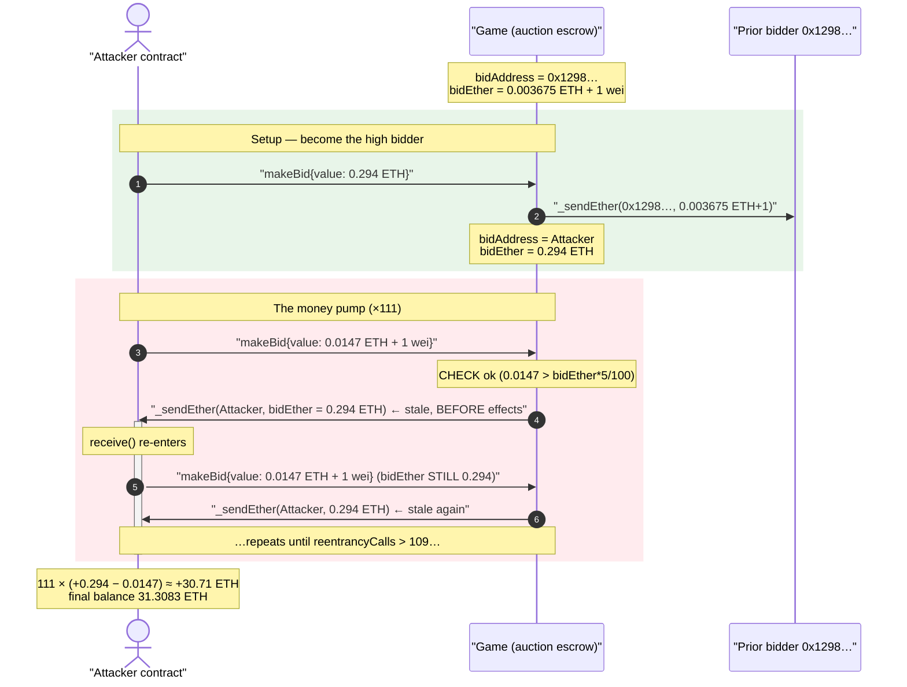
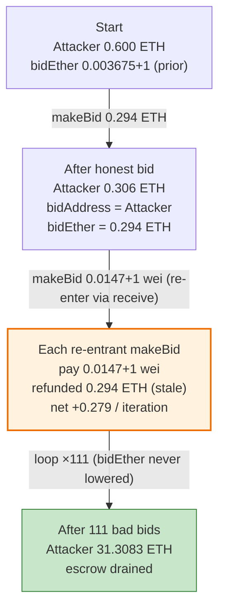
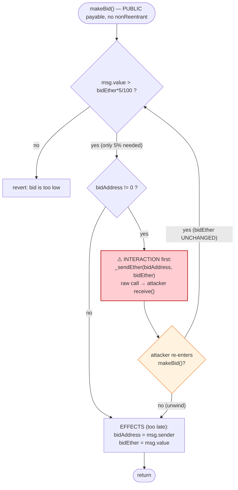
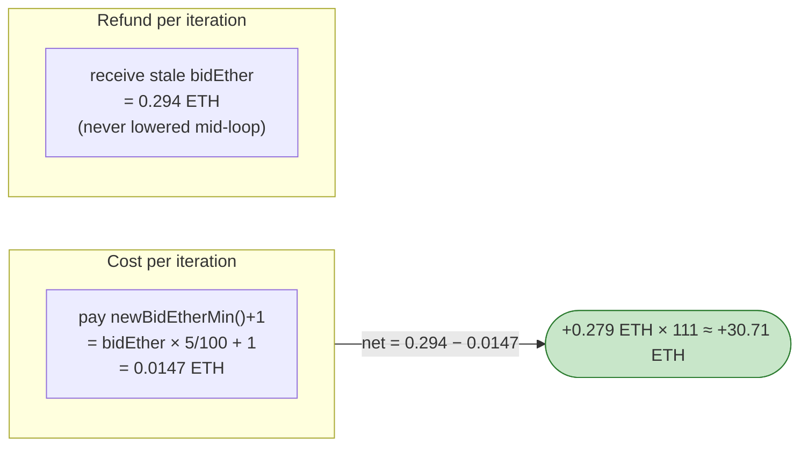

# Game (TheGame / Anciliainc) Exploit — Reentrancy + Stale `bidEther` Refund in `makeBid()`

> **Vulnerability classes:** vuln/reentrancy/single-function · vuln/logic/incorrect-order-of-operations

> **Reproduction:** the PoC compiles & runs in an isolated Foundry project at
> [this project folder](.) (the umbrella DeFiHackLabs repo contains many
> unrelated PoCs that do not whole-compile, so this one was extracted).
> Full verbose trace: [output.txt](output.txt).
> Verified vulnerable source: [contracts_game_Game.sol](sources/Game_52d69c/contracts_game_Game.sol).

---

## Key info

| | |
|---|---|
| **Loss** | ~20 ETH (on-chain). The extracted PoC scales the seed capital to 0.6 ETH and turns it into **31.308 ETH** (≈ **+30.71 ETH** intra-tx) by looping the same bug. |
| **Vulnerable contract** | `Game` — [`0x52d69c67536f55EfEfe02941868e5e762538dBD6`](https://etherscan.io/address/0x52d69c67536f55efefe02941868e5e762538dbd6#code) |
| **Victim** | The `Game` auction escrow (holds bidders' ETH) |
| **Attacker EOA** | [`0x145766a51ae96e69810fe76f6f68fd0e95675a0b`](https://etherscan.io/address/0x145766a51ae96e69810fe76f6f68fd0e95675a0b) |
| **Attacker contract** | [`0x8d4de2bc1a566b266bd4b387f62c21e15474d12a`](https://etherscan.io/address/0x8d4de2bc1a566b266bd4b387f62c21e15474d12a) |
| **Attack tx** | [`0x0eb8f8d148508e752d9643ccf49ac4cb0c21cbad346b5bbcf2d06974d31bd5c4`](https://app.blocksec.com/explorer/tx/eth/0x0eb8f8d148508e752d9643ccf49ac4cb0c21cbad346b5bbcf2d06974d31bd5c4) |
| **Chain / block / date** | Ethereum mainnet / fork 19,213,946 / February 13, 2024 |
| **Compiler** | Solidity v0.8.23 (`commit.f704f362`), optimizer **200 runs** |
| **Bug class** | Reentrancy with stale state (checks → interaction → effects), enabling repeated over-refund of a stale `bidEther` |
| **Analysis** | https://twitter.com/AnciliaInc/status/1757533144033739116 |

---

## TL;DR

`Game`'s auction lets anyone outbid the current high bid via `makeBid()`. When a new bid arrives,
the contract first **refunds the previous high bidder their full `bidEther`** and only *afterwards*
records the new `bidAddress`/`bidEther`
([contracts_game_Game.sol:232-242](sources/Game_52d69c/contracts_game_Game.sol#L232-L242)).
The refund is a raw `call`, so it hands control to the recipient *before* `bidEther` has been
updated to the new (tiny) value.

Two flaws compose into a money pump:

1. **Stale-state reentrancy.** The refund `_sendEther(bidAddress, bidEther)` runs *before* the
   state update `bidEther = msg.value`. A malicious previous bidder re-enters `makeBid()` from its
   `receive()` and is refunded the **old, large `bidEther` again** — the value never shrinks during
   the re-entrant chain.
2. **Trivially-cheap minimum bid.** The required minimum to outbid is
   `newBidEtherMin() = bidEther * 5 / 100` ([:228-230](sources/Game_52d69c/contracts_game_Game.sol#L228-L230)),
   i.e. only **5% of the current bid**. So each re-entrant outbid costs ~5% of `bidEther` but triggers
   a refund of the **full** `bidEther` — a ~20× net inflow per loop iteration.

The attacker seeds itself as the high bidder once (refund target = itself), then re-enters
`makeBid()` ~110 times. Each iteration pays ≈ 0.0147 ETH and receives back 0.294 ETH, draining the
escrow that held other users' bids.

---

## Background — what `Game` does

`Game` ([source](sources/Game_52d69c/contracts_game_Game.sol)) is a pixel-canvas game ("place a
chunk, pay tokens") whose endgame is an **ETH auction** for the canvas NFT. The auction half lives
in the `Auction` base contract:

- Anyone can bid via `makeBid()` while the auction is live.
- A new bid must beat `newBidEtherMin()`, which is **only 5% of the current high bid**
  (`bidEther * auctionBidStepShare / auctionBidStepPrecesion`, with `auctionBidStepShare = 5`,
  `auctionBidStepPrecesion = 100` — [:199-200](sources/Game_52d69c/contracts_game_Game.sol#L199-L200)).
- When a higher bid arrives, the **previous** high bidder is refunded their **entire** prior
  `bidEther` via `_sendEther(...)` (a raw `call`).
- `bidEther` starts at `1e16 - 1` (0.01 ETH − 1 wei — [:202](sources/Game_52d69c/contracts_game_Game.sol#L202)).

The escrow therefore holds the accumulated ETH of the active auction (current high bid plus
whatever has not yet been refunded). The bug lets the high bidder pull ETH out of that escrow far
in excess of what they put in.

State at the fork block (from the trace):

| Parameter | Value |
|---|---|
| `auctionBidStepShare / auctionBidStepPrecesion` | 5 / 100 → **min bid = 5% of current** |
| Prior high bidder `bidAddress` | `0x1298EF04e9e878DaE51e605816ce3E6A99aD9B80` |
| Prior `bidEther` (refunded once to `0x1298…`) | `0.003675 ETH + 1 wei` |
| Attacker seed capital (PoC) | **0.6 ETH** |

---

## The vulnerable code

### 1. `makeBid()` refunds the old bid **before** updating state

```solidity
function makeBid() external payable {
    require(msg.value > newBidEtherMin(), "bid is too low");   // ① CHECK: only 5% of current bid
    if (bidAddress != address(0)) {
        _sendEther(bidAddress, bidEther);                      // ② INTERACTION: refund OLD bidEther (raw call ⇒ reentry)
    }
    bidAddress = msg.sender;                                   // ③ EFFECT (too late)
    bidEther = msg.value;                                      // ③ EFFECT (too late) — bidEther only shrinks AFTER the call
    if (auctionEndTime == 0)
        auctionEndTime = block.timestamp + auctionStartTimer;
    else auctionEndTime += auctionBidAddsTimer;
}
```
[contracts_game_Game.sol:232-242](sources/Game_52d69c/contracts_game_Game.sol#L232-L242)

The ordering is **Checks → Interaction → Effects**, the textbook reentrancy anti-pattern. Because
the refund (②) sends control to `bidAddress` *before* `bidEther` is lowered (③), every re-entrant
call inside the same chain reads the same large `bidEther`, gets refunded the same large amount, and
only needs to clear the same tiny `newBidEtherMin()`.

### 2. The minimum to outbid is only 5% of the current bid

```solidity
function newBidEtherMin() public view returns (uint256) {
    return (bidEther * auctionBidStepShare) / auctionBidStepPrecesion;   // bidEther * 5 / 100
}
```
[contracts_game_Game.sol:228-230](sources/Game_52d69c/contracts_game_Game.sol#L228-L230)

With `bidEther = 0.294 ETH`, the minimum next bid is `0.294 * 5/100 = 0.0147 ETH`. So an attacker
who is the current high bidder can re-bid for `0.0147 ETH + 1 wei` and be refunded the full
`0.294 ETH` — pocketing ~0.279 ETH per iteration. (The PoC comment in
[test/Game_exp.sol:54-58](test/Game_exp.sol#L54-L58) frames this as a "logic error" in
`newBidEtherMin()`; mechanically the profit comes from the *refund of the stale `bidEther`*, which
the 5% step makes hugely positive-EV.)

### 3. The refund is a raw `call` that hands over control

```solidity
function _sendEther(address to, uint256 count) internal {
    (bool sentFee, ) = payable(to).call{value: count}("");   // ⚠️ external call to attacker → re-enters makeBid()
    require(sentFee, "sent fee error: ether is not sent");
}
```
[contracts_game_Game.sol:244-247](sources/Game_52d69c/contracts_game_Game.sol#L244-L247)

There is **no `nonReentrant` guard** anywhere in `makeBid()` / `_sendEther()`, and the call target
is fully attacker-controlled (it is the previous bidder, which the attacker arranged to be its own
contract).

---

## Root cause — why it was possible

A correct auction must lower the recorded high bid (`bidEther`) **before** refunding the displaced
bidder, or must guard re-entry. `Game` does neither:

> `makeBid()` refunds `bidEther` to the previous bidder via a raw `call`, and only *after* that call
> returns does it set `bidEther = msg.value`. Inside that call the previous bidder (the attacker)
> re-enters `makeBid()`. Because `bidEther` is still the old, large value, the require `msg.value >
> bidEther*5/100` is cheap to satisfy and the refund of `bidEther` is large — so each re-entrant bid
> is massively net-positive for the attacker, at the expense of the ETH escrowed from honest bidders.

Three composing design decisions:

1. **Checks-Interactions-Effects violated.** The state that bounds the refund (`bidEther`) is
   updated *after* the refund call, so re-entry observes stale, attacker-favorable state.
2. **Permissionless re-entry target.** The refund goes to `bidAddress`, which is just "whoever bid
   last." The attacker makes itself the last bidder, so the refund call is a hook into its own
   `receive()`.
3. **5% bid step.** `newBidEtherMin()` requires only 5% of the current bid, so the cost to keep
   re-bidding (≈ 0.0147 ETH) is ~1/20 of the refund received (0.294 ETH). The loop is ~20× positive
   per turn, so it pays to recurse as deep as gas allows.

---

## Preconditions

- The auction is live (`isAuction()` true) so `makeBid()` does not revert. In the live attack this
  held; the PoC forks the exact block where it was live.
- The attacker can be / become the current high bidder so the refund call targets its own contract.
  The PoC does this with one honest bid (`Game.makeBid{value: 0.294 ETH}`,
  [test/Game_exp.sol:37-38](test/Game_exp.sol#L37-L38)).
- Seed capital ≥ one bid (PoC seeds 0.6 ETH via `deal`,
  [test/Game_exp.sol:33](test/Game_exp.sol#L33)). Because every iteration nets positive ETH and the
  escrow already holds other bidders' funds, the whole drain is intra-transaction (flash-loanable in
  principle).
- Enough call-stack/gas headroom for the re-entrant chain. The PoC self-limits to
  `reentrancyCalls <= 109` ([test/Game_exp.sol:45-52](test/Game_exp.sol#L45-L52)), giving 110
  re-entrant iterations + the 1 initial bad bid = **111** bad bids.

---

## Attack walkthrough (with on-chain numbers from the trace)

All figures are taken directly from [output.txt](output.txt).

| # | Step | `msg.value` | What happens | Attacker ETH delta |
|---|------|------------:|--------------|-------------------:|
| 0 | **Seed** — `deal(this, 0.6 ETH)` | — | Attacker funded | start = 0.600 |
| 1 | **Honest bid** — `makeBid{value: 0.294 ETH}` ([trace L1579](output.txt)) | 0.294 | Refunds prior bidder `0x1298…` their stale `0.003675 ETH + 1 wei`; sets `bidAddress = attacker`, `bidEther = 0.294` | −0.294 |
| 2 | **Read min** — `newBidEtherMin()` ⇒ `0.0147 ETH` ([trace L1587-1588](output.txt)) | — | Min next bid = `bidEther * 5/100` = 0.0147 | — |
| 3 | **Bad bid #1** — `makeBid{value: 0.0147 ETH + 1 wei}` ([trace L1589](output.txt)) | 0.0147+1wei | Refunds `bidEther = 0.294` to attacker → enters attacker `receive{value: 0.294}` **before** `bidEther` is lowered | −0.0147 then +0.294 |
| 4 | **Re-entry loop** — inside each `receive()`, call `makeBid{value: 0.0147 ETH + 1 wei}` again ([trace L1590-1593, …](output.txt)) | 0.0147+1wei | `bidEther` is *still 0.294* every level → each re-entrant bid refunds 0.294 again | each iter: −0.0147 +0.294 ≈ **+0.279** |
| 5 | **Unwind** — loop stops at `reentrancyCalls > 109`; the nested `makeBid`/`receive` frames return ([trace L2696](output.txt)) | — | 111 total bad bids executed | — |
| 6 | **Final** | — | Attacker balance = **31.3083 ETH** | end = 31.30830 |

Per the trace, `makeBid{value: 14700000000000001}` (0.0147 ETH + 1 wei) appears **111 times** and
`receive{value: 294000000000000000}` (0.294 ETH refund) appears **111 times** — the stale `bidEther`
never changes across the whole re-entrant chain.

### Profit accounting (ETH, wei-exact against the trace)

| Direction | Per item | Count | Total |
|---|---:|---:|---:|
| Out — honest bid | 0.294000000000000000 | 1 | −0.294000000000000000 |
| Out — bad bids | 0.014700000000000001 | 111 | −1.631700000000000111 |
| In — refunds of stale `bidEther` | 0.294000000000000000 | 111 | +32.634000000000000000 |
| **Net change** | | | **+30.708299999999999889** |

`0.600000000000000000 + 30.708299999999999889 = 31.308299999999999889 ETH`, matching the trace's
final balance **`31308299999999999889` wei** to the wei. Net profit ≈ **+30.71 ETH** from a 0.6 ETH
seed in the PoC; the live on-chain incident drained ~20 ETH from the auction escrow.

> Note: the refund to the *first* real prior bidder `0x1298…` was their own stale `bidEther`
> (`0.003675 ETH + 1 wei`, [trace L1580](output.txt)). Every refund after that goes to the attacker
> at the inflated `0.294 ETH`, because the attacker captured the `bidAddress` slot with its honest
> bid and then never let `bidEther` shrink during the loop.

---

## Diagrams

### Sequence of the attack



### Pool/escrow value flow



### The flaw inside `makeBid()` (control vs. state order)



### Why each loop is ~20× profitable



---

## Remediation

1. **Apply Checks-Effects-Interactions.** Update `bidAddress` and `bidEther` to the new bid
   **before** refunding the displaced bidder. Then re-entry observes the new (small) `bidEther` and
   the refund cannot be replayed at the stale value.
2. **Add a reentrancy guard.** Mark `makeBid()` (and any function that performs an external value
   transfer) `nonReentrant`. This alone closes the loop even if the ordering were left wrong.
3. **Use pull-over-push refunds.** Credit the displaced bidder to a `pendingWithdrawals[bidder]`
   ledger and let them `withdraw()` separately, eliminating the inline external call entirely.
4. **Re-examine the 5% bid step.** A 5%-of-current minimum increment combined with full refunds is
   only safe if refunds are sound. With pull payments it is fine; with push refunds it is what makes
   the bug ~20× positive-EV. Consider a fixed/absolute minimum increment as well.
5. **Bound trust on the refund target.** The refund recipient is arbitrary (last bidder). Treat it
   as untrusted: forward a fixed gas stipend, ignore the call's side-effects on contract state, and
   never read mutable state after it returns within the same function.

---

## How to reproduce

The PoC was extracted into a standalone Foundry project (the umbrella DeFiHackLabs repo has many
unrelated PoCs that fail to compile under a whole-project `forge build`):

```bash
_shared/run_poc.sh 2024-02-Game_exp --mt testExploit -vvvvv
```

- RPC: an **Ethereum mainnet archive** endpoint is required (fork block 19,213,946,
  February 2024). `foundry.toml` aliases `mainnet` to an Infura endpoint that serves historical
  state at that block; most pruned public RPCs will fail with `header not found` / `missing trie
  node`.
- Result: `[PASS] testExploit()`. Balance goes from 0.6 ETH to 31.3083 ETH.

Expected tail:

```
Ran 1 test for test/Game_exp.sol:ContractTest
[PASS] testExploit() (gas: 2025109)
  Exploiter ETH balance before attack: 0.600000000000000000
  Exploiter ETH balance after attack: 31.308299999999999889
Suite result: ok. 1 passed; 0 failed; 0 skipped
```

---

*Reference: Ancilia analysis — https://twitter.com/AnciliaInc/status/1757533144033739116
(TheGame, Ethereum, ~20 ETH).*
