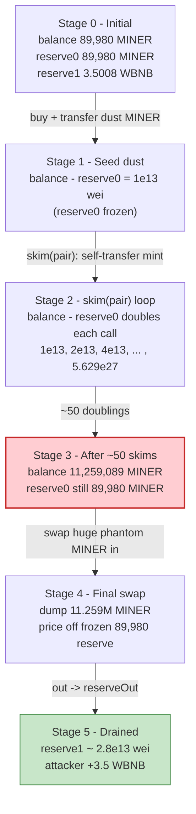
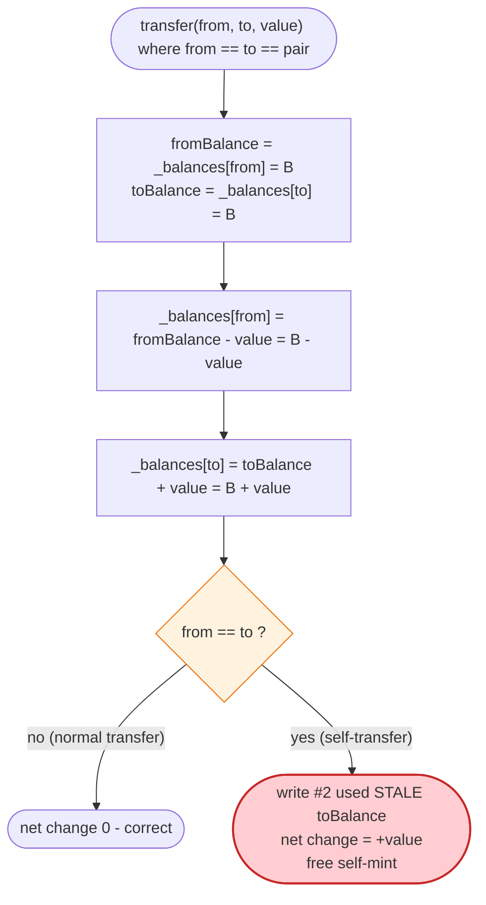
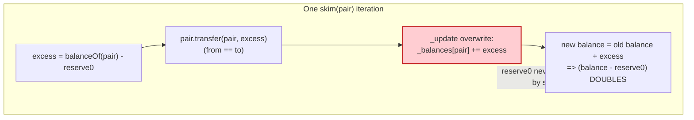

# MINER (ERC404) Exploit — Self-Transfer Balance Inflation via `skim()`

> **Vulnerability classes:** vuln/logic/state-update · vuln/arithmetic/precision-loss

> **Reproduction:** the PoC compiles & runs in an isolated Foundry project at
> [this project folder](.) (the umbrella DeFiHackLabs repo contains many
> unrelated PoCs that do not whole-compile, so this one was extracted).
> Full verbose trace: [output.txt](output.txt).
> Verified vulnerable source: [ERC_X.sol](sources/ERC_X_7C0BFb/ERC_X.sol).

---

## Key info

| | |
|---|---|
| **Loss** | ~3.5 WBNB (≈ the entire WBNB side of the MINER/WBNB pool) |
| **Vulnerable contract** | `MINER` / `ERC_X` (ERC404-style NFT+ERC20 hybrid) — [`0x7C0BFb9fF0aF660D76fb2bd8865E9b49ff033045`](https://bscscan.com/address/0x7C0BFb9fF0aF660D76fb2bd8865E9b49ff033045#code) |
| **Victim pool** | MINER/WBNB PancakePair — [`0x2BA9d4a8C41C60B71ff7Df2c3F54B008644b954e`](https://bscscan.com/address/0x2BA9d4a8C41C60B71ff7Df2c3F54B008644b954e) |
| **Attacker EOA** | [`0x031958a8137745350549fd95055398dd536a07c7`](https://bscscan.com/address/0x031958a8137745350549fd95055398dd536a07c7) |
| **Attacker contract** | [`0xc9716ec1b0503316233e3bcc50853f0df6befd43`](https://bscscan.com/address/0xc9716ec1b0503316233e3bcc50853f0df6befd43) |
| **Attack tx** | [`0x15ab671c9bf918fa4b6a9eed9ccb527f32aca40e926ede2aec2c84dfa9c30512`](https://bscscan.com/tx/0x15ab671c9bf918fa4b6a9eed9ccb527f32aca40e926ede2aec2c84dfa9c30512) |
| **Chain / fork block / date** | BSC / 36,111,182 (`36_111_183 - 1`) / Feb 13, 2024 |
| **Compiler** | Solidity v0.8.24, optimizer **200 runs** (per [`_meta.json`](sources/ERC_X_7C0BFb/_meta.json)) |
| **Bug class** | Cached-balance self-transfer inflation in an ERC404 token, weaponized through PancakePair `skim()` |

---

## TL;DR

`MINER` is an "ERC404"-style hybrid that keeps both an ERC20 ledger (`_balances`)
and an ERC1155/721 NFT ledger, minting/burning NFTs as a holder's ERC20 balance
crosses whole-token boundaries. Its `_update` function
([ERC_X.sol:1940-1979](sources/ERC_X_7C0BFb/ERC_X.sol#L1940-L1979)) caches both the
sender's and the receiver's balance **before** writing either:

```solidity
uint256 fromBalance = _balances[from];   // cached
uint256 toBalance   = _balances[to];     // cached (== fromBalance when from==to)
...
_balances[from] = fromBalance - value;   // write #1
_balances[to]   = toBalance   + value;   // write #2 — OVERWRITES write #1 when from==to
```

When `from == to`, write #2 overwrites write #1, so a self-transfer of `value`
**increases** the address's balance by `value` out of thin air instead of being a
no-op. The token never reverts on `from == to`.

The attacker turns this into free money using PancakeSwap's `skim()`. `skim`
sends the pair's *excess* token balance (`balance − reserve`) **to any address you
name** — and the attacker names the **pair itself**. So `skim(pair)` makes the
MINER token execute `transfer(pair → pair, excess)`, which (via the bug above)
**adds `excess` to the pair's MINER balance**. Each `skim` call therefore *doubles*
the pair's stored MINER balance while `reserve0` stays frozen (skim never syncs
reserves). After ~50 skims the pair "holds" 11.26M MINER on its ERC20 ledger but
its reserve still reads ~89,980 MINER, so the attacker swaps that entire phantom
MINER balance for the pool's entire WBNB reserve.

Funded by a 10-WBNB DODO flash loan (repaid in full), net profit ≈ **3.5 WBNB** —
the whole honest WBNB side of the pool.

---

## Background — what MINER / ERC404 does

`ERC_X` ([source](sources/ERC_X_7C0BFb/ERC_X.sol)) is a dual-ledger token:

- **ERC20 ledger** — `_balances[addr]` and `totalSupply` (immutable, 100,000 × 1e18).
  `balanceOf(addr)` returns `_balances[addr]`
  ([ERC_X.sol:1201-1203](sources/ERC_X_7C0BFb/ERC_X.sol#L1201-L1203)).
- **NFT ledger** — a packed bitmap `_owned[addr]`; one NFT per `tokensPerNFT`
  (= `1 × 1e18`) of ERC20 balance.
- **Auto mint/burn** — on every "ERC20-mode" transfer, `_update` burns NFTs from the
  sender and mints NFTs to the receiver so the NFT count tracks the whole-token part
  of each balance ([ERC_X.sol:1957-1978](sources/ERC_X_7C0BFb/ERC_X.sol#L1957-L1978)).
- **Whitelist** — addresses on `whitelist` skip the NFT mint/burn machinery (intended
  for the LP pair, routers, etc.) ([ERC_X.sol:1959-1977](sources/ERC_X_7C0BFb/ERC_X.sol#L1959-L1977)).

On-chain parameters at the fork block (`token0 = MINER`, `token1 = WBNB`):

| Parameter | Value |
|---|---|
| `totalSupply` | 100,000 × 1e18 MINER |
| `tokensPerNFT` | 1 × 1e18 |
| Pool MINER reserve (`reserve0`) | **89,979,999,999,999,999,986,862** (~89,980 MINER) |
| Pool WBNB reserve (`reserve1`) | **3,500,779,900,515,321,108** (~3.50 WBNB) ← the prize |
| Pair on `whitelist`? | **No** — the pair runs the buggy NFT mint path on receipt |

The pair NOT being whitelisted is what makes `skim`-into-itself trigger the bug.
A whitelisted address would take the `wlf`/`whitelist[to]` short-circuit and skip
the mint/burn — but it would *still* hit the same balance overwrite, so the
whitelist is not actually a defense against the core flaw (see Root cause).

---

## The vulnerable code

### 1. The cached-balance self-transfer overwrite (the root cause)

[ERC_X.sol:1940-1979](sources/ERC_X_7C0BFb/ERC_X.sol#L1940-L1979):

```solidity
function _update(address from, address to, uint256 value, bool mint) internal virtual {
    uint256 fromBalance = _balances[from];   // ← cached
    uint256 toBalance   = _balances[to];     // ← cached (== fromBalance if from == to)
    if (fromBalance < value) {
        revert ERC20InsufficientBalance(from, fromBalance, value);
    }

    unchecked {
        _balances[from] = fromBalance - value;   // write #1
        _balances[to]   = toBalance   + value;   // write #2  ⚠️ clobbers write #1 when from == to
    }

    emit Transfer(from, to, value);
    ...
}
```

There is no `require(from != to)` and no read-after-write. With `from == to`, the
second assignment uses the **stale** `toBalance` (the value *before* the subtraction),
so the net effect is `_balances[to] = balance + value` — a free `+value` mint.

### 2. `_transfer` allows `from == to`

[ERC_X.sol:1930-1938](sources/ERC_X_7C0BFb/ERC_X.sol#L1930-L1938) only rejects the
zero address; equal `from`/`to` flows straight into `_update`:

```solidity
function _transfer(address from, address to, uint256 value, bool mint) internal {
    if (from == address(0)) revert ERC20InvalidSender(address(0));
    if (to   == address(0)) revert ERC20InvalidReceiver(address(0));
    _update(from, to, value, mint);          // ← no from != to guard
}
```

### 3. PancakePair `skim()` lets the caller pick the recipient

[PancakePair.sol:483-488](sources/PancakePair_2BA9d4/PancakePair.sol#L483-L488):

```solidity
function skim(address to) external lock {
    address _token0 = token0;
    address _token1 = token1;
    _safeTransfer(_token0, to, IERC20(_token0).balanceOf(address(this)).sub(reserve0));
    _safeTransfer(_token1, to, IERC20(_token1).balanceOf(address(this)).sub(reserve1));
}
```

`skim` computes `excess = balanceOf(pair) − reserve0` and `transfer`s it to `to`.
Passing `to == pair` makes the MINER token run `transfer(pair → pair, excess)`,
hitting the bug. Critically, `skim` **never updates `reserve0`** (only `swap`,
`mint`, `burn`, `sync` call `_update`/`_safeTransfer`-with-sync). So `reserve0`
stays frozen at ~89,980 MINER while the pair's *balance* runs away.

---

## Root cause — why it was possible

The deflationary "auto mint/burn" code was bolted onto a standard ERC20 `_update`
that reads `_balances[from]` and `_balances[to]` into local variables up front and
writes them back afterwards. This is a safe idiom **only if `from != to`**. The
authors never added the `from == to` guard, so any self-transfer is a self-mint.

The flaw compounds with two PancakePair facts:

1. **`skim(to)` lets the caller choose the recipient**, and that recipient can be the
   pair itself — turning a pool-maintenance helper into a balance pump.
2. **`skim` does not resync reserves.** It moves "excess" tokens but leaves `reserve0`
   unchanged, so the pricing curve keeps using the stale (small) reserve even after
   the pair's real balance has been inflated 100,000×.

So the attacker repeatedly calls `skim(pair)`:

> each call transfers `excess = balance − reserve0` from the pair to the pair; the
> buggy self-transfer turns that into `balance += excess`, i.e. `balance − reserve0`
> **doubles** every iteration, while `reserve0` is frozen.

After ~50 doublings the pair's MINER balance is astronomically larger than its
reserve. A final `swap()` quotes price off the tiny frozen `reserve0`, so dumping the
huge phantom balance buys out essentially the entire WBNB reserve.

The MINER NFT mint/burn (`_burnBatch`/`_mintWithoutCheck`) only touches the NFT
bitmap, not `_balances`, so it is incidental to the money flow — the inflation lives
entirely in the ERC20 ledger overwrite. (In the trace each self-transfer also mints
NFTs to the pair, but that does not affect the exploit's economics.)

---

## Preconditions

- A MINER/WBNB PancakePair exists with a non-trivial WBNB reserve (the target).
- The pair is **not** whitelisted, so `skim`-into-pair runs the standard
  `_update` path (any path reaching the overwrite would do, but this is the one used).
- The attacker can seed the pair with a small positive *excess* MINER balance so the
  first `skim` has something to double. The PoC does this by buying a dust amount of
  MINER and pushing it into the pair.
- A flash-loan source of WBNB to (a) buy the dust MINER and (b) be present as working
  capital. DODO's `DPP` is used; **10 WBNB** is borrowed and fully repaid in the same
  tx ([MINER_bsc_exp.sol:40,63](test/MINER_bsc_exp.sol#L40)).

No timing, no admin keys, no governance — fully permissionless and atomic.

---

## Attack walkthrough (with on-chain numbers from the trace)

All figures are taken directly from [output.txt](output.txt). `token0 = MINER`
(18 dec), `token1 = WBNB`. `reserve0` is frozen at
`89,979,999,989,999,999,986,862` for the whole skim loop (the post-swap sync value).

| # | Step | Pair MINER **balance** | Pair WBNB **reserve** | Effect |
|---|------|-----------------------:|----------------------:|--------|
| 0 | **Initial reserves** (`getReserves`) | 89,980.0 (89,979,999,999,999,999,986,862) | 3.5007799 WBNB | Honest pool. |
| 1 | **Flash loan** 10 WBNB from DODO ([:40](test/MINER_bsc_exp.sol#L40)) | — | — | Working capital. |
| 2 | **Buy dust MINER** — `swapTokensForExactTokens(1e13 MINER, …)` paying 390,037,096 wei WBNB | 89,979,999,989,999,999,986,862 (−1e13 out) | reserve synced to 3.50078 | Attacker gets 1e13 MINER (0.00001 MINER). |
| 3 | **Seed the pair** — `transfer(pair, 1e13)` | 89,979,999,999,999,999,986,862 | (reserve unchanged) | Pair excess over reserve0 = **1e13**. |
| 4 | **`skim(pair)` #1** — transfers excess 1e13 pair→pair (self-mint) | excess now **2e13** | frozen | Doubling begins. |
| 5 | **`skim(pair)` #2 … #50** — excess doubles every call: 2e13, 4e13, 8e13, … | grows ×2 each call | frozen | See doubling ladder below. |
| 6 | **`skim(pair)` final** — excess 5.629e27 transferred pair→pair | **11,259,089,048,426,229,999,999,986,862** (≈ 11.26M MINER) | frozen | Pair "balance" ≈ 125,000× its reserve. |
| 7 | **`swap(0, 3,500,751,853,374,879,579, attacker, "")`** — dump the phantom MINER | reserve0 now 1.125e28, reserve1 → 28,047,530,478,625 (~2.8e13 wei) | **drained** | `amount0In` = 1.12589e28 MINER buys out the WBNB side. |
| 8 | **Repay** 10 WBNB to DODO ([:63](test/MINER_bsc_exp.sol#L63)) | — | — | Flash loan closed. |

### The doubling ladder (selected `skim` `excess` amounts, pair→pair self-transfers)

From the MINER `transfer(pair, …)` calls inside each `skim`
([output.txt](output.txt)):

```
1e13, 2e13, 4e13, 8e13, 1.6e14, 3.2e14, 6.4e14, 1.28e15, 2.56e15, 5.12e15,
... (each = 2× previous) ...
1.407e27, 2.814e27, 5.629e27
```

Correspondingly the pair's MINER `balanceOf` climbs:

```
89,980.0  →  89,985.2  →  90,000.97  →  90,651.09  →  95,348.71  →  111,454.84
→ 261,778.69 → 777,174.77 → 2,838,759.07 → 11,085,096.28 → 22,080,212.56
→ 44,070,445.11 → 88,050,910.22 → ... → 11,259,089.05 MINER (final, ×1e18 wei)
```

(`balance_{n+1} − reserve0 = 2 × (balance_n − reserve0)` — exact geometric doubling.)

### Why the final swap takes the whole WBNB reserve

PancakeSwap `getAmountOut` is `out = (in·9975·reserveOut) / (reserveIn·10000 + in·9975)`.
The swap's `amount0In` (MINER) is `11,258,999,068,426,240,000,000,000,000`
(≈ 11.259M MINER) while the curve's `reserveIn` is the frozen
`89,979,999,989,999,999,986,862` (≈ 89,980 MINER). The input is ~125,000× the
reserve, so `out → reserveOut`, draining nearly the entire WBNB reserve:
`amount1Out = 3,500,751,853,374,879,579` ≈ **3.50 WBNB** of the 3.5008 WBNB present.

---

## Profit / loss accounting (WBNB)

| Direction | Amount (WBNB) |
|---|---:|
| Borrowed from DODO (flash loan) | 10.0 |
| Spent buying dust MINER (`amount1In`) | 0.00000000039 (390,037,096 wei) |
| Received from final `swap` | 3.500751853374879579 |
| Repaid to DODO | 10.0 |
| **Net attacker WBNB after exploit** | **3.500751852984842483** (≈ **+3.5 WBNB**) |

Final attacker WBNB balance read from the trace:
`3,500,751,852,984,842,483` wei. The pool's original WBNB reserve was
`3,500,779,900,515,321,108` wei (~3.50078 WBNB); the attacker walked off with
essentially all of it (the small remainder is the 0.25% swap fee left in the pool).
The flash loan was repaid in full, so the loss falls on the pool's LPs.

---

## Diagrams

### Sequence of the attack

```mermaid
sequenceDiagram
    autonumber
    actor A as "Attacker contract"
    participant D as "DODO DPP"
    participant R as "PancakeRouter"
    participant P as "MINER/WBNB Pair"
    participant T as "MINER (ERC404)"

    Note over P: "Initial reserves<br/>89,980 MINER / 3.5008 WBNB<br/>pair NOT whitelisted"

    A->>D: "flashLoan(10 WBNB)"
    activate D
    D->>A: "DPPFlashLoanCall(...)"

    rect rgb(255,243,224)
    Note over A,T: "Step A - seed pair with dust excess"
    A->>R: "swapTokensForExactTokens(1e13 MINER out)"
    R->>P: "swap()"
    P-->>A: "1e13 MINER"
    A->>T: "transfer(pair, 1e13)"
    Note over P: "pair excess over reserve0 = 1e13"
    end

    rect rgb(255,235,238)
    Note over A,T: "Step B - the exploit: ~50x skim(pair)"
    loop "51 times"
        A->>P: "skim(pair)"
        P->>T: "transfer(pair, excess)  (from == to)"
        Note over T: "_update overwrite:<br/>balance += excess (self-mint)"
        Note over P: "excess doubles; reserve0 FROZEN"
    end
    Note over P: "pair MINER balance = 11.26M<br/>reserve0 still = 89,980"
    end

    rect rgb(232,245,233)
    Note over A,T: "Step C - drain"
    A->>P: "swap(0, 3.5007 WBNB, attacker)"
    P-->>A: "3.5008 WBNB (whole reserve)"
    end

    A->>D: "repay 10 WBNB"
    deactivate D
    Note over A: "Net +3.5 WBNB (all honest liquidity)"
```

### Pair MINER-balance vs. frozen reserve



### The flaw inside `_update` (self-transfer overwrite)



### Why each doubling step grows: `skim` + self-mint



---

## Why the numbers line up

- **Dust seed = 1e13 wei MINER:** any positive excess works; 1e13 (0.00001 MINER) is
  the smallest practical amount that survives the router quote. It sets the geometric
  series' first term.
- **~50 `skim` calls (51 total in the trace):** doubling from 1e13 reaches ~5.6e27 in
  ~49 steps; the loop runs until the pair "holds" enough phantom MINER (11.26M) that
  the final swap quote rounds to the whole WBNB reserve. The PoC bounds it at 50
  iterations ([MINER_bsc_exp.sol:54](test/MINER_bsc_exp.sol#L54)).
- **Final swap requests `3,500,751,853,374,879,579` WBNB out:** this is essentially
  the entire WBNB reserve minus rounding/fee; the colossal MINER input makes it
  feasible against the frozen 89,980-MINER reserve.
- **10 WBNB flash loan:** mere working capital for the dust buy and to satisfy DODO's
  interface; it is repaid in full, so it does not enter the profit.

---

## Remediation

1. **Guard self-transfers in `_update`.** The minimal, decisive fix:
   ```solidity
   if (from == to) return;            // or revert; a self-transfer must be a no-op
   ```
   or re-read after write / use `unchecked { _balances[to] += value; }` patterns that
   are correct for `from == to`. OpenZeppelin's modern `_update` increments `_balances[to]`
   from the *current* (post-decrement) value precisely to be self-transfer-safe; this
   token reintroduced the bug by caching both balances up front.
2. **Never cache both endpoints' balances before writing both.** Compute and apply the
   subtraction, then read the (possibly same) slot fresh for the addition.
3. **Treat `skim(to)`/`sync()` reachability as adversarial.** Tokens with transfer-time
   side effects must be safe when `skim` directs a transfer into the pair itself, into
   the token, or into the router. Add invariant tests for `transfer(x, x)` and for
   `skim(pair)` loops.
4. **Whitelist is not a safety boundary.** Whitelisting the pair would have skipped the
   NFT mint/burn but **not** the balance overwrite; do not rely on whitelist flags to
   contain accounting bugs — fix the accounting.
5. **Add a supply invariant.** Assert `sum(_balances) == totalSupply` (or that no single
   transfer increases `totalSupply`-equivalent accounting); a self-mint violates it and
   would have been caught by a single property test.

---

## How to reproduce

The PoC was extracted into a standalone Foundry project (the umbrella DeFiHackLabs
repo has many unrelated PoCs that fail under a whole-project `forge build`):

```bash
_shared/run_poc.sh 2024-02-MINER_bsc_exp -vvvvv
```

- RPC: a **BSC archive** endpoint is required (fork block `36_111_182`).
  `foundry.toml` uses `https://bsc-mainnet.public.blastapi.io`; most pruning RPCs
  fail historical state reads at this block.
- Result: `[PASS] testExploit()` with the attacker holding ~3.5 WBNB at the end.

Expected tail (see [output.txt](output.txt)):

```
    ├─ emit log_named_decimal_uint(key: "[End] Attacker WBNB balance after exploit", val: 3500751852984842483 [3.5e18], decimals: 18)
    └─ ← [Stop]

Suite result: ok. 1 passed; 0 failed; 0 skipped; finished in 8.47s
Ran 1 test suite ...: 1 tests passed, 0 failed, 0 skipped (1 total tests)
```

---

*Reference: DeFiHackLabs MINER (ERC404) incident, BSC, Feb 2024. ERC404 hybrids
that auto mint/burn on transfer are recurrently vulnerable to self-transfer and
`skim`/`sync` reserve-desync abuse.*
