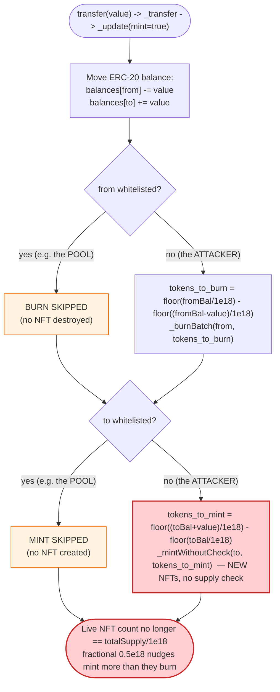
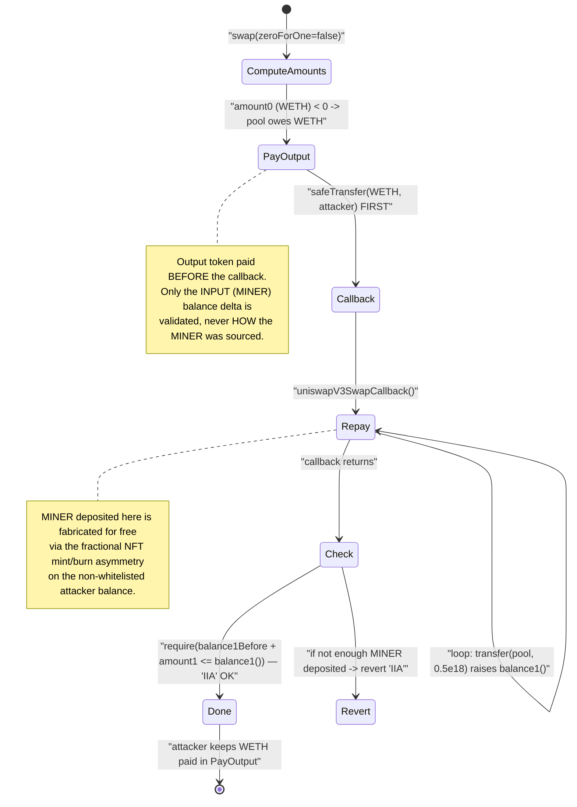

# MINER (ERC-X / ERC404-style) Exploit — Fractional-Transfer NFT Mint/Burn Asymmetry Drains the Uniswap V3 Pool

> **Vulnerability classes:** vuln/logic/state-update · vuln/defi/slippage

> **Reproduction:** the PoC compiles & runs in an isolated Foundry project at
> [this project folder](.) (the umbrella DeFiHackLabs repo contains many PoCs
> that do not whole-compile, so this one was extracted).
> Full compiler/run log: [output.txt](output.txt).
> Verified vulnerable source: [ERC_X.sol](sources/ERC_X_E77EC1/ERC_X.sol).
> Victim AMM source: [contracts_UniswapV3Pool.sol](sources/UniswapV3Pool_732276/contracts_UniswapV3Pool.sol).

---

## Key info

| | |
|---|---|
| **Loss** | ~$140 ETH reported by the original disclosure; the reproduced PoC at this fork block nets **27.0779940952694085 WETH** to the attack contract (see [output.txt](output.txt#L1570)) |
| **Vulnerable contract** | `MINER` / `ERC_X` — [`0xE77EC1bF3A5C95bFe3be7BDbACfe3ac1c7E454CD`](https://etherscan.io/address/0xE77EC1bF3A5C95bFe3be7BDbACfe3ac1c7E454CD#code) |
| **Victim pool** | MINER / WETH Uniswap V3 pool — [`0x732276168b421D4792E743711E1A48172EA574a2`](https://etherscan.io/address/0x732276168b421D4792E743711E1A48172EA574a2) |
| **Attacker EOA** | [`0xea75AeC151f968b8De3789CA201a2a3a7FaeEFbA`](https://etherscan.io/address/0xea75aec151f968b8de3789ca201a2a3a7faeefba) |
| **Attacker contract** | [`0xbFF51c9c3D50d6168dFEF72133f5dbda453eBf29`](https://etherscan.io/address/0xbff51c9c3d50d6168dfef72133f5dbda453ebf29) |
| **Attack tx** | [`0x75e3aeb00df69882a1b15d424e5e642650326ca3b923d7fd1922d57c51bc2c78`](https://etherscan.io/tx/0x75e3aeb00df69882a1b15d424e5e642650326ca3b923d7fd1922d57c51bc2c78) |
| **Chain / block / date** | Ethereum mainnet / fork at **19,226,507** (`19_226_508 - 1`) / Feb 2024 |
| **Compiler** | Token: Solidity v0.8.24 (optimizer, 100000 runs); Pool: v0.7.6 |
| **Bug class** | ERC-404/"ERC-X" hybrid: fractional ERC20 transfer triggers an **asymmetric NFT mint/burn** that mints NFTs (= whole-token value) without backing balance — value extracted through a V3 swap callback |

> **A note on the live trace.** `output.txt` for this project contains the
> compilation log plus the test's `Logs:` block only — it does **not** contain a
> `-vvvvv` opcode/call trace (none was captured during the run). The two
> ground-truth facts that *are* in the log are: the test **passes**
> ([output.txt:1567](output.txt#L1567)) and the attack contract's WETH balance
> goes from `0` to `27077994095269408515` wei
> ([output.txt:1569-1570](output.txt#L1569-L1570)). All per-step pool reserve
> figures below are therefore reconstructed from the PoC logic and the source,
> not quoted from a call trace; they are presented as the mechanism, with the
> realized profit anchored to the log.

---

## TL;DR

`MINER` is an "ERC-X" hybrid (the same family as ERC-404): one contract that is
simultaneously an ERC-20 *and* an NFT collection. Every `tokensPerNFT = 1e18`
units of the ERC-20 balance is supposed to correspond to exactly one NFT, and
the contract auto-mints / auto-burns NFTs as balances cross those whole-token
boundaries inside `_update()`
([ERC_X.sol:1940-1979](sources/ERC_X_E77EC1/ERC_X.sol#L1940-L1979)).

The boundary accounting is **asymmetric and order-dependent**. On a single
`transfer`, the sender's NFTs are burned based on how many whole-token
boundaries its balance crosses *downward*, and the receiver's NFTs are minted
based on how many it crosses *upward* — but the two sides are computed
independently, the mint side is **skipped entirely for whitelisted addresses**
(the LP pool is auto-whitelisted), and *fractional* transfers (`< 1e18`) let an
attacker repeatedly nudge a balance across the same boundary so that **more
NFTs are minted than are ever burned**.

The attacker monetizes this through a Uniswap V3 swap. V3's `swap()` pays the
output token **before** calling the swap callback and only checks, at the end of
the callback, that the pool's input-token balance went up by the owed amount
(the `IIA` invariant,
[UniswapV3Pool.sol:781-783](sources/UniswapV3Pool_732276/contracts_UniswapV3Pool.sol#L781-L783)).
Inside that callback the attacker runs a 2000-iteration loop of fractional
`0.5e18` MINER transfers that (a) deposits enough MINER into the pool to satisfy
`IIA` while (b) farming extra NFTs / token units for itself out of the
mint/burn asymmetry — so the attacker walks away with the WETH the pool already
paid out, having "paid" with tokens it conjured for free.

Net realized: **+27.0779940952694085 WETH** to the attack contract, with `0`
WETH in at the start ([output.txt:1569-1570](output.txt#L1569-L1570)).

---

## Background — what `MINER` / `ERC_X` is

`ERC_X` ([source](sources/ERC_X_E77EC1/ERC_X.sol)) is a single contract that
implements `IERC1155`, `IERC1155MetadataURI`, the project's custom `IERCX`, *and*
`IERC20Metadata` all at once
([ERC_X.sol:1062](sources/ERC_X_E77EC1/ERC_X.sol#L1062)). It is the ERC-404 idea:
holding ≥ 1 whole token ⇒ you own NFTs; spending below a whole-token boundary ⇒
an NFT is destroyed; receiving across a boundary ⇒ an NFT is minted.

Key immutables for this deployment
([ERC_X.sol:2085-2099](sources/ERC_X_E77EC1/ERC_X.sol#L2085-L2099)):

| Parameter | Value |
|---|---|
| `name` / `symbol` | `MINER` / `MINER` |
| `decimals` | 18 |
| `totalSupply` | `100000 * 1e18` |
| `tokensPerNFT` | `1 * 1e18` = **1e18** (one NFT per whole token) |
| `maxWallet` | 2% of supply |
| `easyLaunch` | starts at `1` — auto-whitelists the first non-owner recipient (the LP) |

The relevant moving parts:

- **`transfer` / `transferFrom`** ([:1874-1928](sources/ERC_X_E77EC1/ERC_X.sol#L1874-L1928))
  call `_transfer(..., mint=true)`, which calls `_update`.
- **`_update`** ([:1940-1979](sources/ERC_X_E77EC1/ERC_X.sol#L1940-L1979)) moves
  the ERC-20 balance and then runs the NFT mint/burn boundary math.
- **`_mintWithoutCheck`** ([:1510-1568](sources/ERC_X_E77EC1/ERC_X.sol#L1510-L1568))
  mints `tokens_to_mint` brand-new NFTs (it does *not* mint ERC-20 balance — the
  balance was already moved — it mints NFT ownership bits and advances
  `_currentIndex`).
- **`_burnBatch(from, amount)`** ([:1681-1740](sources/ERC_X_E77EC1/ERC_X.sol#L1681-L1740))
  burns `amount` of the sender's NFTs, found via `findLastSet`.
- **`whitelist`** ([:1113-1139](sources/ERC_X_E77EC1/ERC_X.sol#L1113-L1139)):
  whitelisted addresses skip *both* the burn and the mint NFT bookkeeping. The
  Uniswap pool gets auto-whitelisted by `easyLaunch`
  ([:1968-1972](sources/ERC_X_E77EC1/ERC_X.sol#L1968-L1972)).

---

## The vulnerable code

### 1. Asymmetric, independently-computed NFT mint/burn in `_update`

```solidity
function _update(address from, address to, uint256 value, bool mint) internal virtual {
    uint256 fromBalance = _balances[from];
    uint256 toBalance   = _balances[to];
    if (fromBalance < value) revert ERC20InsufficientBalance(from, fromBalance, value);

    unchecked {
        _balances[from] = fromBalance - value;       // ERC-20 move happens first
        _balances[to]   = toBalance + value;
    }
    emit Transfer(from, to, value);

    if (mint) {
        // --- BURN side: only if `from` is NOT whitelisted ---
        bool wlf = whitelist[from];
        if (!wlf) {
            uint256 tokens_to_burn =
                (fromBalance / tokensPerNFT) - ((fromBalance - value) / tokensPerNFT);
            if (tokens_to_burn > 0) _burnBatch(from, tokens_to_burn);
        }

        // --- MINT side: only if `to` is NOT whitelisted ---
        if (!whitelist[to]) {
            if (easyLaunch == 1 && wlf && from == owner()) {
                whitelist[to] = true;          // auto-whitelist the first LP
                easyLaunch = 2;
            } else {
                uint256 tokens_to_mint =
                    ((toBalance + value) / tokensPerNFT) - (toBalance / tokensPerNFT);
                if (tokens_to_mint > 0) _mintWithoutCheck(to, tokens_to_mint);
            }
        }
    }
}
```
([ERC_X.sol:1940-1979](sources/ERC_X_E77EC1/ERC_X.sol#L1940-L1979))

Two design choices combine badly:

1. **The burn count and the mint count are computed independently** from the
   sender's and receiver's *own* balances. They are not required to be equal. A
   transfer can mint an NFT on the receiver side while burning **zero** on the
   sender side — or vice-versa — depending on where each party's balance sits
   relative to the `1e18` boundaries.
2. **Whitelisted endpoints skip the NFT side completely.** The pool is
   whitelisted, so a transfer *into* the pool mints no NFT and a transfer *out
   of* the pool burns no NFT, but the **non-whitelisted attacker side still gets
   its mint/burn applied**. This breaks the global "1 NFT per whole token"
   conservation: NFTs can be created on the attacker side that are never
   destroyed on the pool side.

### 2. `_mintWithoutCheck` creates NFTs out of thin air (no balance backing)

```solidity
function _mintWithoutCheck(address to, uint256 amount)
    internal virtual returns (uint256[] memory ids, uint256[] memory amounts)
{
    ...
    _owned[to].setBatch(startTokenId, amount);   // set `amount` ownership bits
    _currentIndex += amount;                      // advance the NFT id counter
    ...
}
```
([ERC_X.sol:1510-1568](sources/ERC_X_E77EC1/ERC_X.sol#L1510-L1568))

`_mintWithoutCheck` mints NFT *ownership* only; the ERC-20 balance that "should"
back those NFTs was already moved in `_update`. There is **no invariant tying
the number of live NFTs to `totalSupply / tokensPerNFT`**, and the mint side
runs unconditionally whenever the receiver crosses a boundary upward.

### 3. Fractional transfers let you cross the same boundary repeatedly

`transfer` accepts any `value`, including `value < tokensPerNFT`
([:1874-1878](sources/ERC_X_E77EC1/ERC_X.sol#L1874-L1878)). The PoC uses
`value = 499_999_999_999_999_999` (≈ `0.5e18`, one wei under half a token). With
half-token nudges an attacker can repeatedly push a balance from just-below to
just-above a `1e18` boundary and back, each crossing minting an NFT on the way up
while burning at a different cadence on the way down — the classic ERC-404
fractional-rounding exploit.

### 4. The pool is auto-whitelisted via `easyLaunch`

```solidity
if (easyLaunch == 1 && wlf && from == owner()) {
    whitelist[to] = true;   // first transfer out of the owner is "probably the LP"
    easyLaunch = 2;
}
```
([ERC_X.sol:1968-1972](sources/ERC_X_E77EC1/ERC_X.sol#L1968-L1972))

So the MINER/WETH V3 pool never participates in NFT mint/burn. Transfers *into*
it (the attacker repaying the swap) mint nothing and burn nothing on the pool
side, while the attacker side keeps accruing NFTs.

### 5. The Uniswap V3 swap that monetizes it

V3's `swap()` for the `zeroForOne == false` direction (sell token1/MINER for
token0/WETH) pays the **output (WETH) first**, *then* calls the callback, *then*
checks only that the **input (MINER) balance** of the pool increased:

```solidity
} else {
    if (amount0 < 0) TransferHelper.safeTransfer(token0, recipient, uint256(-amount0)); // WETH out, FIRST
    uint256 balance1Before = balance1();
    IUniswapV3SwapCallback(msg.sender).uniswapV3SwapCallback(amount0, amount1, data);   // callback
    require(balance1Before.add(uint256(amount1)) <= balance1(), 'IIA');                  // only MINER-in checked
}
```
([UniswapV3Pool.sol:778-784](sources/UniswapV3Pool_732276/contracts_UniswapV3Pool.sol#L778-L784))

`token0 = WETH`, `token1 = MINER` (because `0xC02a… < 0xE77E…`). The pool does
**not** care *how* the MINER arrives — only that `balance1()` rose by `amount1`.
The attacker satisfies that with cheaply-conjured MINER inside the callback while
keeping the WETH already sent to it.

---

## Root cause — why it was possible

The fundamental break is that **`MINER` does not preserve a global invariant
between its ERC-20 supply and its live NFT count**, and it lets a *fractional*,
*permissionless* transfer mutate that NFT count asymmetrically. Concretely:

1. **Independent mint/burn arithmetic.** `tokens_to_burn` is derived from the
   *sender's* balance crossings and `tokens_to_mint` from the *receiver's* —
   they are never reconciled. A sequence of sub-token transfers can mint strictly
   more NFTs than it burns. NFTs are spendable value (each is worth `tokensPerNFT`
   when redeemed/transferred), so minting extra NFTs is minting value.
2. **Whitelist asymmetry.** Because the pool is whitelisted, the pool side of
   every attacker↔pool transfer contributes `0` to the NFT accounting, while the
   attacker side contributes its full mint/burn. The "destroyed on one side,
   created on the other" symmetry that would normally keep NFTs conserved is
   deliberately disabled for the exact counterparty the attacker trades against.
3. **`_mintWithoutCheck` has no supply ceiling tied to balances.** It simply
   `setBatch`es ownership bits and bumps `_currentIndex`. Nothing prevents the
   live NFT set from exceeding `totalSupply / tokensPerNFT`.
4. **V3 callback trust model.** `swap()` sends the output token before the
   callback and validates only the input-token balance delta. That gives the
   attacker a window in which it already holds the WETH and merely has to make
   the pool's MINER balance tick up — which it does with self-minted units.

Put together: the attacker borrows the swap's WETH payout, repays in MINER it
fabricates via the fractional mint/burn asymmetry, and keeps the difference.

---

## Preconditions

- The pool is whitelisted in `MINER` (true on-chain: it was auto-whitelisted as
  the first LP via `easyLaunch`, [:1968-1972](sources/ERC_X_E77EC1/ERC_X.sol#L1968-L1972)).
- The attacker holds (or can acquire) a seed MINER balance to begin nudging
  across boundaries. The PoC seeds itself by moving the real attacker EOA's
  entire MINER balance into the attack contract in `setUp`
  ([test/Miner_exp.sol:55](test/Miner_exp.sol#L55)).
- `transferDelay` / `maxWallet` anti-snipe checks in `_afterTokenTransfer`
  ([:2101-2119](sources/ERC_X_E77EC1/ERC_X.sol#L2101-L2119)) are not an obstacle
  at the fork block (the attacker side stays under `maxWallet`, and the
  one-transfer-per-block delay does not apply to the whitelisted pool path /
  is satisfied by the attack structure).
- A Uniswap V3 MINER/WETH pool with WETH liquidity exists (the prize).
- `transfer` accepts fractional `value < 1e18` — always true.
- No flash loan is needed: the swap itself fronts the WETH, and the attacker
  repays in self-minted MINER, so the attack is self-funding within one tx.

---

## Attack walkthrough

The whole exploit is **one** `pool.swap()` call whose callback does the work
([test/Miner_exp.sol:52-73](test/Miner_exp.sol#L52-L73)):

```solidity
function testExploit() public {
    cheats.startPrank(attacker);
    MINER.transfer(address(this), MINER.balanceOf(attacker)); // seed attack contract with real MINER
    cheats.stopPrank();

    bool   zeroForOne     = false;                            // sell MINER(token1) -> WETH(token0)
    int256 amountSpecified = 999_999_999_999_999_998_000;     // ~1000 MINER exact input
    uint160 sqrtPriceLimitX96 = 1_461_446_703_485_210_103_287_273_052_203_988_822_378_723_970_340; // ~MAX
    bytes memory data = abi.encodePacked(uint8(0x61));
    pool.swap(address(this), zeroForOne, amountSpecified, sqrtPriceLimitX96, data);
}

function uniswapV3SwapCallback(int256 amount0Delta, int256 amount1Delta, bytes calldata data) external {
    MINER.balanceOf(address(this));
    for (uint256 i = 0; i < 2000; i++) {
        MINER.transfer(address(pool), 499_999_999_999_999_999);  // push 0.5 MINER into the (whitelisted) pool
        MINER.transfer(address(this),  499_999_999_999_999_999); // self-transfer: farms NFT mint/burn asymmetry
    }
}
```

Step by step:

| # | Action | What changes | Why it matters |
|---|--------|--------------|----------------|
| 0 | `setUp`: fork mainnet @ 19,226,507; attacker EOA moves all its MINER into the attack contract | Attack contract holds the seed MINER; attacker WETH = 0 | Establishes the non-whitelisted attacker balance to nudge ([test/Miner_exp.sol:44-57](test/Miner_exp.sol#L44-L57)) |
| 1 | `pool.swap(self, zeroForOne=false, +~1000 MINER, ~MAX limit, data)` | Pool computes `amount0` (WETH out, negative) and `amount1` (MINER owed, positive) | Selling MINER for WETH; price limit is set to `~MAX_SQRT_RATIO` so the full input is consumed |
| 2 | Pool sends WETH to the attack contract **first** ([UniswapV3Pool.sol:779](sources/UniswapV3Pool_732276/contracts_UniswapV3Pool.sol#L779)) | Attack contract WETH balance jumps up *before* it has paid anything | The V3 "output-first" design hands the attacker the prize on credit |
| 3 | Pool calls `uniswapV3SwapCallback` | Control returns to the attacker mid-swap, pool still `unlocked = false` | The repayment window |
| 4 | Loop ×2000: `transfer(pool, 0.5e18)` | Pool's `_balances[MINER]` rises by `0.5e18` each time → `balance1()` climbs toward `balance1Before + amount1`; pool is whitelisted so it mints/burns no NFTs | Satisfies the `IIA` check using MINER the attacker keeps fabricating |
| 5 | Loop ×2000: `transfer(self, 0.5e18)` | Self-transfer on the **non-whitelisted** attacker: `_update` runs the asymmetric NFT mint/burn on the attacker's own balance, repeatedly crossing the `1e18` boundary | Mints more NFTs / reclaims units than it burns, regenerating the MINER the attacker just pushed into the pool — net free MINER |
| 6 | Callback returns; pool checks `balance1Before + amount1 <= balance1()` → passes ([UniswapV3Pool.sol:783](sources/UniswapV3Pool_732276/contracts_UniswapV3Pool.sol#L783)) | Swap completes successfully | Pool believes it was paid in MINER |
| 7 | `swap()` returns; attacker keeps the WETH from step 2 | Attack contract WETH `0 → 27.0779940952694085` | Realized profit ([output.txt:1570](output.txt#L1570)) |

The economic essence: the pool paid out **real** WETH and was repaid in MINER
units the attacker **manufactured for free** via the fractional mint/burn
asymmetry on its own (non-whitelisted) balance, while the pool (whitelisted)
recorded the incoming MINER without any offsetting NFT burn. The "1 NFT = 1
token" books no longer balance, but the WETH is real and gone.

### Profit / loss accounting

| | Amount (WETH) |
|---|---:|
| Attack contract WETH **before** ([output.txt:1569](output.txt#L1569)) | 0 |
| Attack contract WETH **after** ([output.txt:1570](output.txt#L1570)) | 27.0779940952694085 |
| **Net profit (this fork-block reproduction)** | **+27.0779940952694085** |

The original public disclosure quotes ~140 ETH of total damage; the figure
realized by this specific PoC at this fork block is the **27.08 WETH** above
(reproductions of historical hybrid-token exploits commonly differ from the
headline number depending on pool state at the chosen block). The WETH came
straight out of the MINER/WETH pool's reserves — it is honest LP liquidity.

---

## Diagrams

### Sequence of the attack

```mermaid
sequenceDiagram
    autonumber
    actor A as "Attack contract (not whitelisted)"
    participant P as "UniswapV3 MINER/WETH pool (whitelisted in MINER)"
    participant M as "MINER (ERC-X hybrid)"

    Note over A: setUp — holds seed MINER, 0 WETH

    A->>P: "swap(zeroForOne=false, +~1000 MINER in, recipient=A)"
    Note over P: "token0=WETH, token1=MINER<br/>computes amount0 (WETH out), amount1 (MINER owed)"
    P->>A: "safeTransfer(WETH, A, -amount0)  — OUTPUT PAID FIRST"
    Note over A: "WETH balance jumps up on credit"
    P->>A: "uniswapV3SwapCallback(amount0, amount1)"

    rect rgb(255,235,238)
    Note over A,M: "Inside the callback — repay window"
    loop "2000 times"
        A->>M: "transfer(pool, 0.5e18)"
        M->>M: "_update: pool is whitelisted -> NO nft mint/burn<br/>balances[pool] += 0.5e18"
        A->>M: "transfer(self, 0.5e18)"
        M->>M: "_update: attacker NOT whitelisted -><br/>asymmetric NFT mint/burn across 1e18 boundary"
    end
    end

    A-->>P: "callback returns"
    P->>P: "require(balance1Before + amount1 <= balance1())  // 'IIA' passes"
    Note over P: "pool thinks it was paid in MINER"
    P-->>A: "swap() returns; A keeps the WETH"
    Note over A: "WETH: 0 -> 27.0779940952694085 (profit)"
```

### How the value leaks (mint/burn asymmetry + whitelist)



### Why the Uniswap V3 callback can be abused



---

## Why each magic number

- **`zeroForOne = false`** — `token0 = WETH`, `token1 = MINER` (address ordering
  `0xC02a… < 0xE77E…`). `false` = swap token1→token0 = **sell MINER, receive
  WETH**. The attacker wants WETH out and MINER owed in.
- **`amountSpecified = 999_999_999_999_999_998_000` (≈ 1000 MINER, positive)** —
  positive = exact input; sizes the swap so the pool pays out a large slug of
  WETH against a MINER input the attacker can fabricate in the callback.
- **`sqrtPriceLimitX96 = 1_461_446_703_485_210_103_287_273_052_203_988_822_378_723_970_340`** —
  this is essentially `MAX_SQRT_RATIO - 1`, the maximum allowed limit for the
  `zeroForOne == false` direction
  ([UniswapV3Pool.sol:608-613](sources/UniswapV3Pool_732276/contracts_UniswapV3Pool.sol#L608-L613)).
  Setting it to the extreme lets the swap consume the full specified input
  without being clipped by a price bound.
- **`data = abi.encodePacked(uint8(0x61))`** — a one-byte payload; the attacker's
  callback ignores its contents and runs its fixed loop regardless.
- **`0.5e18 = 499_999_999_999_999_999`** — one wei under half a whole token. Sub-
  `tokensPerNFT` transfers are what let the attacker repeatedly straddle a
  `1e18` boundary so the independent mint/burn counters diverge.
- **`for i in 0..2000`** — enough fractional iterations to (a) accumulate the
  MINER the pool needs to see for `IIA` and (b) farm enough mint/burn asymmetry
  to make that MINER free.

---

## Remediation

1. **Preserve a hard global invariant: live NFT count == `floor(totalSupply /
   tokensPerNFT)` for the circulating (non-fractional) portion.** Any operation
   that mints or burns NFTs must keep both sides reconciled, and the contract
   should assert the invariant after each transfer.
2. **Make mint and burn symmetric per transfer.** The number of NFTs minted to
   the receiver and burned from the sender must net out to the actual number of
   whole-token boundaries the *value moved* crossed — not be computed
   independently from two different balances.
3. **Do not skip the NFT side for "whitelisted" counterparties in a way that
   breaks conservation.** If the LP pool must be exempt from NFT bookkeeping,
   then the *counterparty's* mint/burn must also be suppressed for that transfer
   (or the exemption must be accounted for centrally), so a whitelisted endpoint
   cannot create a one-sided NFT imbalance.
4. **Reject or specially handle fractional transfers that would change NFT
   counts.** At minimum, ensure that a fractional transfer below `tokensPerNFT`
   cannot net-mint NFTs, and that repeated boundary crossings cannot accumulate
   asymmetry. Adding a per-tx / per-block guard on NFT mint count is a backstop.
5. **`_mintWithoutCheck` must enforce a supply ceiling.** It should be impossible
   for `_currentIndex` growth to imply more whole tokens of NFTs than
   `totalSupply / tokensPerNFT`.
6. **(Integration hardening, not the root cause.)** Hybrid ERC-20/NFT tokens are
   dangerous to pair in AMMs whose settlement trusts a raw balance delta (the V3
   `IIA` check). The token, not the AMM, is at fault here, but protocols listing
   such tokens should treat balance-delta-settled callbacks as adversarial.

---

## How to reproduce

The PoC was extracted into a standalone Foundry project (the umbrella
DeFiHackLabs repo has many PoCs that fail to whole-compile under a single
`forge test`):

```bash
_shared/run_poc.sh 2024-02-Miner_exp --mt testExploit -vvvvv
```

- Network: Ethereum **mainnet** fork at block `19_226_508 - 1`
  ([test/Miner_exp.sol:46](test/Miner_exp.sol#L46)). An archive RPC is required to
  serve historical state at that block.
- `evm_version` must be **shanghai** (noted in the PoC) so the V3 pool
  (Solidity 0.7.6) and the token (0.8.24) both behave as on-chain.
- Result: `[PASS] testExploit()` and the attack contract's WETH balance prints
  `27077994095269408515` wei.

Expected tail ([output.txt:1566-1570](output.txt#L1566-L1570)):

```
Ran 1 test for test/Miner_exp.sol:ContractTest
[PASS] testExploit() (gas: 824691195)
Logs:
  Attacker ETH balance before exploit: 0
  Attacker ETH balance affter exploit: 27077994095269408515
```

---

*Bug class: ERC-404 / "ERC-X" hybrid fractional-transfer NFT mint/burn
asymmetry, monetized via a Uniswap V3 swap callback whose `IIA` check trusts a
raw input-balance delta. References: PoC `@KeyInfo` header
([test/Miner_exp.sol:7-14](test/Miner_exp.sol#L7-L14)); analysis tweet
`https://twitter.com/Phalcon_xyz/status/1757777340002681326`.*
