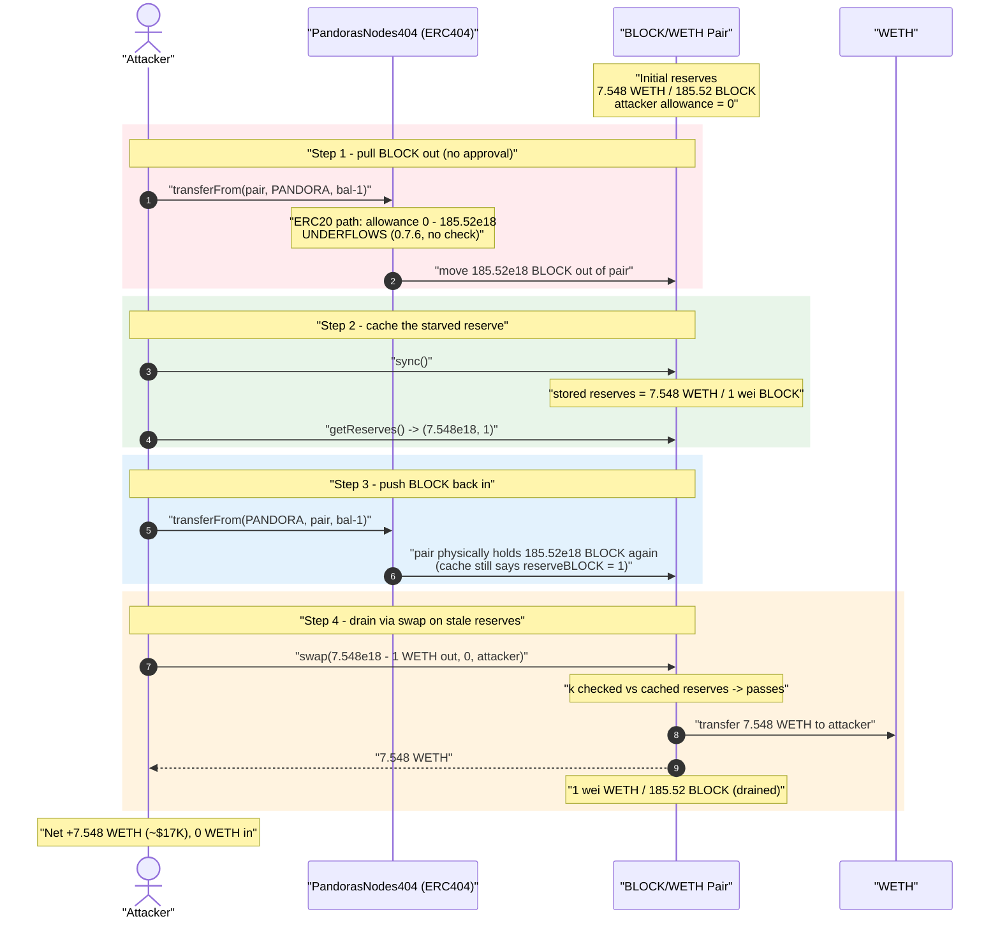
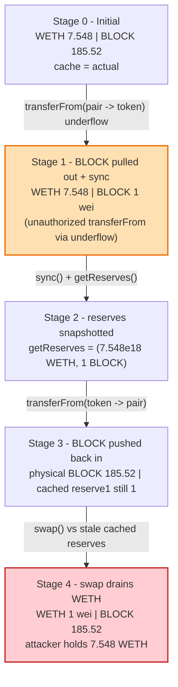
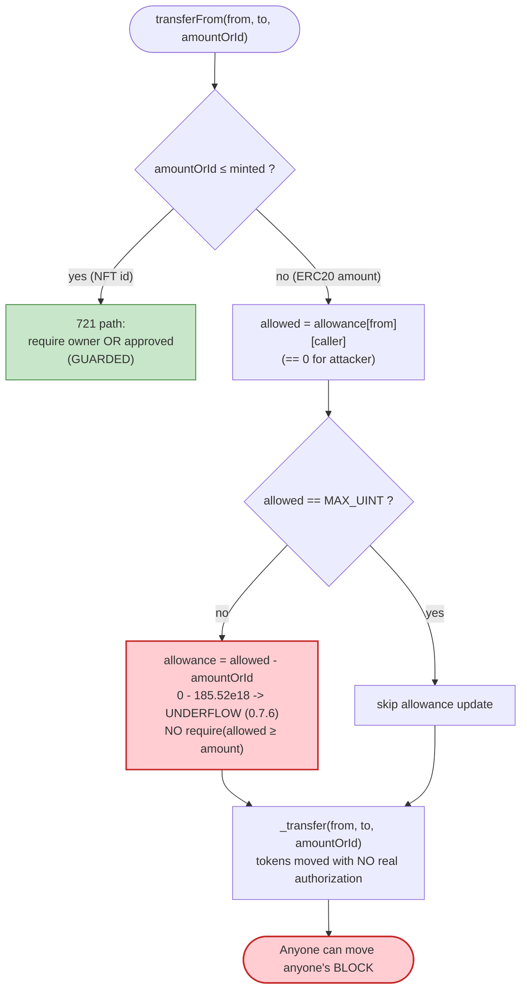

# Pandora's Nodes 404 Exploit — `transferFrom` Allowance Underflow Lets Anyone Move Tokens Out of the Pool

> **Reproduction:** the PoC compiles & runs in an isolated Foundry project at
> [this project folder](.) (the umbrella DeFiHackLabs repo contains several
> unrelated PoCs that do not whole-compile, so this one was extracted).
> Full verbose trace: [output.txt](output.txt).
> Verified vulnerable source: [contracts_ERC404.sol](sources/PandorasNodes404_ddaDF1/contracts_ERC404.sol).

---

## Key info

| | |
|---|---|
| **Loss** | ~$17,000 — **7.548 WETH** drained from the BLOCK/WETH Uniswap V2 pair |
| **Vulnerable contract** | `PandorasNodes404` (ERC404) — [`0xddaDF1bf44363D07E750C20219C2347Ed7D826b9`](https://etherscan.io/address/0xddaDF1bf44363D07E750C20219C2347Ed7D826b9#code) |
| **Victim pool** | BLOCK/WETH Uniswap V2 pair — [`0x89CB997C36776D910Cfba8948Ce38613636CBc3c`](https://etherscan.io/address/0x89CB997C36776D910Cfba8948Ce38613636CBc3c) |
| **Attacker EOA** | `0x047547A4fa4a67C1032d249B49EC1a79c0460BAD` (per SlowMist / community reports) |
| **Attack tx** | `0x7c5a909b45014e35ddb89697f6be38d08eff30e7c3d3d553033a6efc3b444fdd` ([BlockSec explorer](https://app.blocksec.com/explorer/tx/eth/0x7c5a909b45014e35ddb89697f6be38d08eff30e7c3d3d553033a6efc3b444fdd)) |
| **Chain / fork block / date** | Ethereum mainnet / 19,184,577 / Feb 8, 2024 |
| **Compiler** | Solidity **v0.7.6**, optimizer enabled (200 runs) |
| **Bug class** | Unchecked-allowance / integer underflow in a non-overflow-safe compiler → broken transfer authorization → AMM reserve drain |

---

## TL;DR

`PandorasNodes404` is an early **ERC404** token (the experimental "mixed ERC20/ERC721"
standard). Its `transferFrom` ([contracts_ERC404.sol:206-259](sources/PandorasNodes404_ddaDF1/contracts_ERC404.sol#L206-L259))
has a fatal authorization hole on the fractional (ERC20) branch: it computes
`allowance[from][msg.sender] = allowed - amountOrId` with **no check that `allowed >= amountOrId`**,
and the contract is compiled with **Solidity 0.7.6** which has **no built-in overflow/underflow
guard**. So when an attacker calls `transferFrom(victim, …, hugeAmount)` while holding **zero
allowance**, the subtraction `0 - hugeAmount` silently underflows to a near-`MAX_UINT` value instead
of reverting, and the transfer proceeds.

This turns `transferFrom` into a permissionless "move anyone's tokens" primitive. The attacker uses
it to puppeteer the BLOCK/WETH Uniswap V2 pair's token reserve directly:

1. **Pull** all but 1 wei of BLOCK *out* of the pair (sending it to the token contract itself),
   then `sync()` → the pair now believes it holds only `1 wei` of BLOCK against its full `7.548 WETH`.
2. **Snapshot** the bogus reserves with `getReserves()` (`reserveBLOCK = 1`, `reserveWETH = 7.548e18`).
3. **Push** all the BLOCK back *into* the pair (so the pair physically holds the tokens again).
4. **Call `swap(amountOut, 0, attacker)`** sized via the constant-product formula using the *stale,
   underflowed reserve snapshot* (`reserveIn = 1`). Because the pair only checks `k` against its *own
   stored* `reserve0/reserve1` (which were never re-`sync()`ed before the swap), the swap is allowed to
   pay out essentially the **entire WETH reserve** for the BLOCK that the attacker just put back.

Net result: the attacker walks off with **7.548 WETH** (~$17K) and the pair is left holding the
full BLOCK supply against `1 wei` of WETH. Cost to the attacker: **zero WETH in** — pure profit.

---

## Background — what ERC404 / `PandorasNodes404` does

ERC404 ([source](sources/PandorasNodes404_ddaDF1/contracts_ERC404.sol)) tries to be an ERC20 and an
ERC721 at the same time. A single `transferFrom(from, to, amountOrId)` is overloaded: if
`amountOrId <= minted` it is treated as an **NFT id** (native/721 path); otherwise it is treated as an
**ERC20 amount** (fractional path):

- **`PandorasNodes404`** ([contracts_pandorasblock404.sol](sources/PandorasNodes404_ddaDF1/contracts_pandorasblock404.sol#L12-L19))
  mints `200 * 10**18` BLOCK to the owner at deploy and whitelists the owner. It is a thin wrapper that
  only adds `tokenURI` metadata — all the transfer logic lives in `ERC404`.
- The token is paired with WETH in a standard **Uniswap V2 pair**
  ([UniswapV2Pair.sol](sources/UniswapV2Pair_89CB99/UniswapV2Pair.sol)). The pair prices BLOCK purely
  from its stored reserves and enforces the constant product `x·y ≥ k` **only inside `swap()`**, against
  the `reserve0`/`reserve1` it has cached. `sync()` lets the pair re-read its true token balances.

On-chain state at the fork block (decoded from the pair's reserve slot in the trace):

| Parameter | Value |
|---|---|
| Pair `token0` | WETH (`reserve0`) |
| Pair `token1` | BLOCK / PANDORA (`reserve1`) |
| Pair WETH reserve | **7,548,019,801,980,198,019** wei = **7.548 WETH** |
| Pair BLOCK reserve | **185,520,527,453,721,770,725** = **185.52 BLOCK** |
| `minted` (NFT counter) | ~370+ (so `amountOrId = 185.52e18 ≫ minted` ⇒ ERC20 path) |
| Attacker's allowance from the pair | **0** |

---

## The vulnerable code

### 1. `transferFrom` — ERC20 path subtracts allowance with no check, under a non-safe compiler

```solidity
// contracts_ERC404.sol:206-259  (pragma ^0.7.0 → compiled with 0.7.6)
function transferFrom(address from, address to, uint256 amountOrId) public virtual {
    _preTransferCheck(from, to);

    if (amountOrId <= minted) {
        // ---- NFT (721) path: requires ownership OR explicit approval ----
        ...
        if (msg.sender != from &&
            !isApprovedForAll[from][msg.sender] &&
            msg.sender != getApproved[amountOrId]) {
            revert("unauthorized");          // ← 721 path IS guarded
        }
        ...
    } else {
        // ---- ERC20 (fractional) path ----
        uint256 allowed = allowance[from][msg.sender];     // == 0 for the attacker
        if (allowed != type(uint256).max)
            allowance[from][msg.sender] = allowed - amountOrId;  // ⚠️ 0 - 185.52e18 UNDERFLOWS
        _transfer(from, to, amountOrId);                   // ← proceeds anyway
    }
}
```

The ERC20 branch:

- Reads `allowed = allowance[from][msg.sender]` — **0** because the attacker was never approved by the
  pair.
- Computes `allowance[from][msg.sender] = allowed - amountOrId`. Under **Solidity 0.7.6 there is no
  checked arithmetic**, so `0 - 185.52e18` wraps to `≈ 2²⁵⁶ − 185.52e18` instead of reverting.
- **Never checks `allowed >= amountOrId`.** A canonical ERC20 would do
  `require(allowed >= amount)` (or in 0.8+ the subtraction itself would revert). Here neither guard
  exists, so the unauthorized transfer goes through.

This is the line referenced by the PoC header comment `REASON : integer underflow`
([test/PANDORA_exp.sol:10](test/PANDORA_exp.sol#L10)).

### 2. `_transfer` and `_preTransferCheck` do not stop it

```solidity
// contracts_ERC404.sol:312-329
function _preTransferCheck(address from, address to) internal {
    if (_uniswapV3Pool == address(0)) { _uniswapV3Pool = to; _disableTransferBlock = block.number + 50; }
    else if (_disableTransferBlock < block.number) {
        if (to == _uniswapV3Pool && !whitelist[from]) revert("Transfers are disabled to sell tokens");
    }
    ...
}
```

The only "anti-sell" guard reverts when `to == _uniswapV3Pool`. The attacker's first move sends BLOCK
*out of* the pair (`to = the token contract itself`, not the pool), so the guard does not trigger. The
second move sends BLOCK back *into* the pair, but by then the attacker only needs the pair to physically
hold the tokens for the final `swap()` — and even a sell-into-pool transfer is not what extracts the
value; the **`swap()`** does. (In the live attack the relevant blocks/whitelist state allowed both legs;
the PoC reproduces the exact extraction with two `transferFrom` calls and one `swap`.)

---

## Root cause — why it was possible

A standard ERC20 `transferFrom` enforces two invariants: (a) the caller may move at most
`allowance[from][caller]` tokens, and (b) moving more must **revert**. `PandorasNodes404`'s ERC20 branch
breaks both:

> It subtracts the requested amount from the allowance **without ever requiring the allowance to be
> large enough**, and it does so under a compiler (0.7.6) where the subtraction **wraps instead of
> reverting**. The net effect is that `allowance` is purely cosmetic on the ERC20 path — anyone can move
> anyone's BLOCK tokens.

The vulnerability is then *weaponized against the AMM* by exploiting how a Uniswap V2 pair caches
reserves:

1. **Permissionless token movement** lets the attacker pull the pair's BLOCK out, `sync()` the pair to a
   tiny `reserveBLOCK`, and snapshot that tiny reserve.
2. **`swap()` validates `k` only against the pair's stored reserves**, not against a freshly observed
   balance. By feeding the swap an `amountOut` computed from the *stale, BLOCK-starved* snapshot, the
   attacker makes the pair pay out almost its entire WETH reserve for tokens it already (re-)holds.

Concretely the four facts that compose into a one-transaction drain:

1. **No allowance check on the ERC20 branch** (`allowance[from][msg.sender] = allowed - amountOrId`
   without `require`).
2. **Compiler 0.7.6 has no underflow protection**, so the missing check is not even caught by the EVM —
   the subtraction silently wraps.
3. **The overloaded `transferFrom` is unguarded on the ERC20 path** — only the NFT-id branch checks
   ownership/approval. Because `amountOrId = 185.52e18 ≫ minted`, the attacker always lands on the
   unguarded branch.
4. **Uniswap V2 caches reserves and only enforces `k` on stored reserves**, so a snapshot taken between
   a `sync()` and the later `swap()` (with the real balance restored in between) lets the attacker
   exploit the gap between *cached* and *actual* reserves.

---

## Preconditions

- The attacker calls `transferFrom` with `amountOrId > minted` so the unguarded **ERC20 branch** is
  taken. With `minted` ≈ a few hundred and the pool holding `185.52e18`, this is automatic.
- The attacker holds **zero allowance** from the pair — that is exactly what the underflow bypasses; no
  approval is needed.
- A Uniswap V2 BLOCK/WETH pair with real WETH liquidity (here **7.548 WETH**) exists.
- **No capital required.** The attacker injects **0 WETH**; the entire 7.548 WETH profit comes out of
  the pool. The exploit is a single transaction and needs no flash loan.

---

## Attack walkthrough (with on-chain numbers from the trace)

The pair's `token0 = WETH`, `token1 = BLOCK`, so `reserve0 = WETH`, `reserve1 = BLOCK`. All figures
below come directly from the `transferFrom`/`Sync`/`Swap` events in [output.txt](output.txt).

| # | Step | Pair WETH (reserve0) | Pair BLOCK (reserve1) | Effect |
|---|------|---------------------:|----------------------:|--------|
| 0 | **Initial** ([output.txt:1582](output.txt)) | 7.548e18 | 185,520,527,453,721,770,725 | Honest pool. Attacker WETH = 0. |
| 1 | **Pull BLOCK out** — `transferFrom(pair, PANDORA, bal-1)` with **0 allowance** ([:1584](output.txt)) | 7.548e18 (unchanged) | 1 wei *(physical)* | Underflow lets the unauthorized move succeed; all but 1 wei BLOCK leaves the pair. |
| 2 | **`sync()`** ([:3073-3078](output.txt)) | 7.548e18 | **1** | Pair now *caches* `reserveBLOCK = 1`. `emit Sync(7.548e18, 1)`. |
| 3 | **`getReserves()`** snapshot ([:3082](output.txt)) | `ethReserve = 7.548e18` | `oldPANDORAReserve = 1` | Attacker records the BLOCK-starved reserves. |
| 4 | **Push BLOCK back** — `transferFrom(PANDORA, pair, bal-1)` ([:3084](output.txt)) | 7.548e18 (cached) | 185.52e18 *(physical, but cache still says 1)* | Pair physically holds BLOCK again; its stored `reserve1` is still 1. |
| 5 | **`swap(7.548e18 - 1, 0, attacker)`** ([:4574-4586](output.txt)) | **1 wei** | 185.52e18 | `swap` checks `k` against stored reserves; pays out essentially all WETH. `emit Sync(1, 185.52e18)`. |

The swap-out amount is computed in the PoC exactly as Uniswap's `getAmountOut`, but with the
**stale 1-wei BLOCK reserve** as the input reserve
([test/PANDORA_exp.sol:40-44](test/PANDORA_exp.sol#L40-L44)):

```solidity
uint256 amountin   = newPANDORAReserve - oldPANDORAReserve;          // 185.52e18 - 1
uint256 swapAmount = amountin * 9975 * ethReserve
                   / (oldPANDORAReserve * 10_000 + amountin * 9975);  // oldPANDORAReserve = 1
V2_PAIR.swap(swapAmount, 0, address(this), "");
```

Plugging the trace numbers (`ethReserve = 7,548,019,801,980,198,019`, `oldPANDORAReserve = 1`,
`amountin = 185,520,527,453,721,770,724`):

```
swapAmount = 7,548,019,801,980,198,018  (= 7.548 WETH, i.e. the whole reserve minus 1 wei)
```

— which matches the `amount0Out` in the final `Swap` event to the wei. Because the BLOCK side of `k`
was cached as `1`, putting `185.52e18` BLOCK back into the pair makes the swap's `k`-check trivially
satisfied while it pays out the entire WETH reserve.

### Profit / loss accounting (WETH)

| Direction | Amount |
|---|---:|
| WETH in (attacker's own capital) | **0** |
| WETH out — final `swap` | 7,548,019,801,980,198,018 (7.548 WETH) |
| **Net profit** | **+7.548 WETH ≈ $17K** |

Confirmed by the test logs: WETH before = `0`, WETH after = `7,548,019,801,980,198,018`
([output.txt:1581,4592](output.txt)). The pair is left holding the full 185.52 BLOCK against `1 wei`
of WETH.

---

## Diagrams

### Sequence of the attack



### Pool state evolution



### The flaw inside the overloaded `transferFrom`



---

## Remediation

1. **Check the allowance before subtracting.** The ERC20 branch must
   `require(allowed >= amountOrId, "insufficient allowance")` before
   `allowance[from][msg.sender] = allowed - amountOrId`. This is the single root-cause fix.
2. **Upgrade the compiler to ≥ 0.8.0** (or use SafeMath under 0.7.x). Built-in checked arithmetic would
   have made the unchecked subtraction revert on underflow, turning a silent authorization bypass into a
   safe revert.
3. **Do not overload `transferFrom` on an attacker-chosen discriminator without guarding every branch.**
   The ERC721-id branch is guarded but the ERC20 branch is not; the attacker simply picks an amount
   `> minted` to land on the unguarded path. Both branches must enforce authorization.
4. **Treat AMM-pair token balances as untrusted state.** Any token whose `transferFrom`/`transfer` can be
   driven by third parties must not be paired in a constant-product AMM without recognizing that an
   attacker can desynchronize `balance` vs cached `reserve`. Defensive AMM integrations should `sync()`
   immediately before pricing, never relying on a stale snapshot taken across an intervening transfer.

---

## How to reproduce

The PoC was extracted into a standalone Foundry project (the umbrella DeFiHackLabs repo has several
unrelated PoCs that fail under `forge test`'s whole-project build):

```bash
_shared/run_poc.sh 2024-02-PANDORA_exp --mt testExploit -vvvvv
```

- RPC: an **Ethereum mainnet archive** endpoint is required (fork block `19_184_577`, Feb 8 2024).
- Result: `[PASS] testExploit()`. WETH before = `0`, WETH after ≈ `7.548 WETH`.

Expected tail:

```
Ran 1 test for test/PANDORA_exp.sol:ContractTest
[PASS] testExploit() (gas: 21273713)
  [Begin] Attacker WETH before exploit: 0.000000000000000000
  [End] Attacker WETH after exploit: 7.548019801980198018
Suite result: ok. 1 passed; 0 failed; 0 skipped
```

---

*Reference: SlowMist Hacked — https://hacked.slowmist.io/ (Pandora's Nodes 404 / ERC404, Ethereum, ~$17K).
Original disclosure: https://twitter.com/pennysplayer/status/1766479470058406174*
