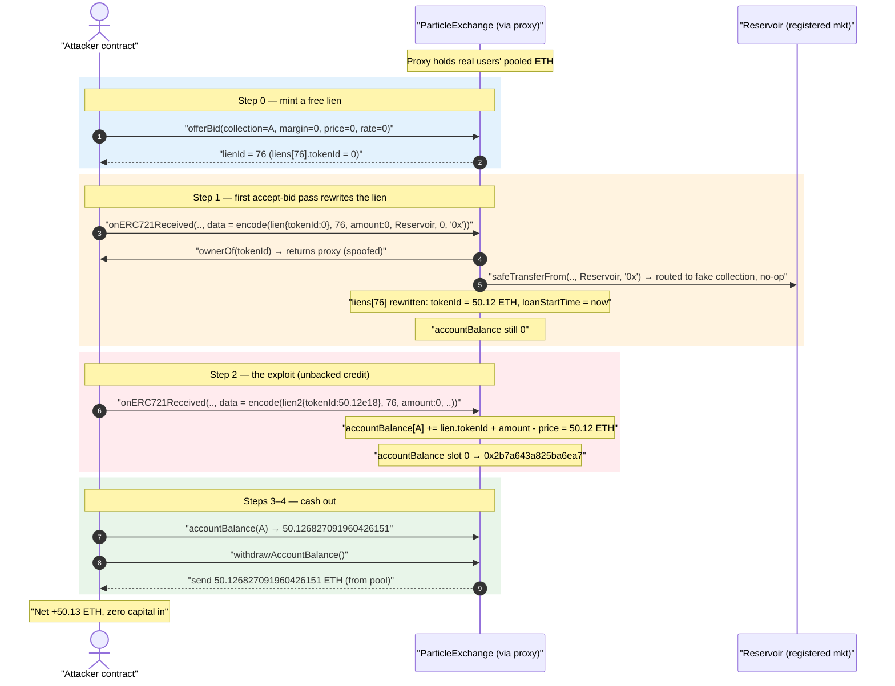
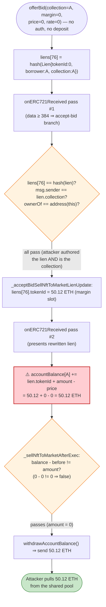

# Particle Trade Exploit — Forged-Lien `accountBalance` Mint via `onERC721Received`

> **Vulnerability classes:** vuln/reentrancy/single-function · vuln/logic/missing-validation

> **Reproduction:** the PoC compiles & runs in an isolated Foundry project at
> [this project folder](.) (the umbrella DeFiHackLabs repo
> contains many unrelated PoCs that do not whole-compile, so this one was extracted).
> Full verbose trace: [output.txt](output.txt).
> Verified vulnerable source: [contracts_protocol_ParticleExchange.sol](sources/ParticleExchange_E4764f/contracts_protocol_ParticleExchange.sol).

---

## Key info

| | |
|---|---|
| **Loss** | ~50.1 ETH per draining lien (PoC withdraws **50.126827091960426151 ETH**); the live incident repeated the trick to drain the contract's full ETH balance (~$50K reported) |
| **Vulnerable contract** | `ParticleExchange` (logic) — [`0xE4764f9cd8ECc9659d3abf35259638B20ac536E4`](https://etherscan.io/address/0xe4764f9cd8ecc9659d3abf35259638b20ac536e4#code) |
| **Proxy (entry point)** | ERC1967Proxy — [`0x7c5C9AfEcf4013c43217Fb6A626A4687381f080D`](https://etherscan.io/address/0x7c5C9AfEcf4013c43217Fb6A626A4687381f080D) |
| **Victim** | The pooled ETH held by the proxy on behalf of real lenders/borrowers |
| **Attacker EOA** | [`0x2c903f97ea69b393ea03e7fab8d64d722b3f5559`](https://etherscan.io/address/0x2c903f97ea69b393ea03e7fab8d64d722b3f5559) |
| **Attacker contract** | [`0xe55607b2967ddbe5fa9a6a921991545b8277ef8f`](https://etherscan.io/address/0xe55607b2967ddbe5fa9a6a921991545b8277ef8f) |
| **Attack tx** | [`0xd9b3e229acc755881890394cc76fde0d7b83b1abd4d046b0f69c1fd9fd495ff6`](https://etherscan.io/tx/0xd9b3e229acc755881890394cc76fde0d7b83b1abd4d046b0f69c1fd9fd495ff6) |
| **Chain / block / date** | Ethereum mainnet / fork at 19,231,445 / Feb 15, 2024 |
| **Compiler** | Solidity 0.8.x (PoC built with solc 0.8.34); UUPS upgradeable proxy |
| **Bug class** | Spoofable callback (`onERC721Received`) + unbacked credit to `accountBalance` (accounting created from attacker-controlled input) |

---

## TL;DR

`ParticleExchange` is an NFT margin-trading / lending protocol. To save users a separate
`setApprovalForAll`, it overrides `onERC721Received` so that an NFT transfer can *piggy-back* an
entire protocol action in its `data` bytes ("push-based" supply / repay / accept-bid)
([:977-1061](sources/ParticleExchange_E4764f/contracts_protocol_ParticleExchange.sol#L977-L1061)).

The accept-bid path credits the bidder's surplus to an internal ledger:

```solidity
// _acceptBidSellNftToMarketCheck
accountBalance[lien.borrower] += lien.tokenId + amount - lien.price;   // L792
```

Here `lien.tokenId` is *re-purposed to store the bid's margin* (an ETH amount), and `lien.borrower`,
`lien.price`, and `amount` are **all taken from the caller's `data`**. The only integrity check is
that the supplied `lien` struct hashes to a stored `liens[lienId]` entry — but the attacker can
**create that entry themselves** for free via `offerBid(...)` and can set the "collection" to a
contract they control, defeating every `msg.sender == lien.collection` / `ownerOf(...)` guard.

By:

1. `offerBid(collection = attacker, margin = 0, price = 0, rate = 0)` → creates `liens[76]` for free,
2. feeding a forged `lien` (with `tokenId` = **50.12 ETH** of "margin") into the push-based accept-bid
   branch of `onERC721Received`, where the attacker's own contract impersonates the NFT collection,

the attacker writes `accountBalance[attacker] += 50.126827091960426151 ETH` **out of thin air** — no
ETH ever deposited, no NFT ever sold — then calls `withdrawAccountBalance()` to pull that ETH from
the proxy's pooled funds. Net mint per loop: **50.126827091960426151 ETH** (the PoC profit).

---

## Background — what ParticleExchange does

`ParticleExchange`
([source](sources/ParticleExchange_E4764f/contracts_protocol_ParticleExchange.sol)) lets a borrower
post ETH margin and "bid" to buy an NFT on credit, with a lender supplying the NFT. State is tracked
by a single mapping `liens[lienId] => keccak256(abi.encode(Lien))` plus a per-user ETH ledger
`accountBalance[account]`. ETH owed to users accumulates in this ledger and is paid out by
`withdrawAccountBalance()` ([:1068-1074](sources/ParticleExchange_E4764f/contracts_protocol_ParticleExchange.sol#L1068-L1074)).

The `Lien` struct overloads its `tokenId` field: for an *active loan* it is the NFT id, but for a
*bid* (no NFT yet) it is used to **store the borrower's margin** (an ETH amount):

```solidity
// offerBid
Lien memory lien = Lien({
    lender: address(0),
    borrower: msg.sender,
    collection: collection,
    tokenId: margin,   /// @dev: use tokenId for margin storage   <-- L663
    price: price, rate: rate, loanStartTime: 0, auctionStartTime: 0
});
```
([:659-668](sources/ParticleExchange_E4764f/contracts_protocol_ParticleExchange.sol#L659-L668))

To improve UX, the protocol also lets *anyone* drive these flows by simply `safeTransferFrom`-ing an
NFT into the contract with the action encoded in `data`. The receiver branches on `data.length`:
64 bytes = supply, 288 bytes = repay/auction, ≥384 bytes = accept-bid-and-market-sell
([:993-1060](sources/ParticleExchange_E4764f/contracts_protocol_ParticleExchange.sol#L993-L1060)).

---

## The vulnerable code

### 1. Unbacked credit driven entirely by caller input

```solidity
function _acceptBidSellNftToMarketCheck(Lien memory lien, uint256 amount) internal {
    if (lien.lender != address(0)) {
        revert Errors.BidTaken();
    }
    // transfer the surplus to the borrower
    /// @dev: lien.tokenId stores the margin
    /// @dev: revert if margin + sold amount can't cover lien.price, i.e., no overspend
    accountBalance[lien.borrower] += lien.tokenId + amount - lien.price;   // ⚠️ L792
}
```
([:782-793](sources/ParticleExchange_E4764f/contracts_protocol_ParticleExchange.sol#L782-L793))

The comment assumes `lien.tokenId` (margin) is real ETH the borrower already deposited. But for a bid
created with `margin = 0` and zero `msg.value`, **no ETH backs this credit** — and after the lien is
rewritten in step 1 of the attack, `lien.tokenId` becomes an arbitrary 50-ETH value the attacker
chose, with `amount = 0` and `price = 0`. The line evaluates to `+= 50.12 ETH` of pure mint.

### 2. The spoofable "NFT received" guard

```solidity
function _pushBasedNftSupply(address from, uint256 tokenId, bytes calldata data) internal nonReentrant {
    /// @dev ... we need to check the NFT is indeed received
    if (IERC721(msg.sender).ownerOf(tokenId) != address(this)) {   // ⚠️ msg.sender is attacker
        revert Errors.NFTNotReceived();
    }
    ...
    } else if (data.length >= 384) {
        ( Lien memory lien, uint256 lienId, uint256 amount,
          address marketplace, address puller, bytes memory tradeData
        ) = abi.decode(data, (Lien, uint256, uint256, address, address, bytes));
        if (liens[lienId] != keccak256(abi.encode(lien))) revert Errors.InvalidLien();
        if (msg.sender != lien.collection) revert Errors.UnmatchedCollections();   // ⚠️ attacker == collection
        if (puller == address(0)) {
            _acceptBidSellNftToMarketCheck(lien, amount);              // ⚠️ mints accountBalance
            _acceptBidSellNftToMarketLienUpdate(lien, lienId, tokenId, amount, from);
            _execSellNftToMarketPush(lien, tokenId, amount, marketplace, tradeData);
        } ...
    }
}
```
([:987-1057](sources/ParticleExchange_E4764f/contracts_protocol_ParticleExchange.sol#L987-L1057))

`onERC721Received` is just an `external` function. The contract never verifies the *real* NFT
collection. Both `ownerOf(...)` and the `msg.sender == lien.collection` check resolve against
**`msg.sender`**, which here is the *attacker's own contract* (it calls `onERC721Received` directly).
The attacker simply makes its fake `ownerOf` return the proxy address, and sets
`lien.collection = address(attacker)`, so every guard passes.

### 3. The "did the NFT really sell?" guard is a no-op when `amount == 0`

```solidity
function _sellNftToMarketAfterExec(Lien memory lien, uint256 tokenId, uint256 amount, uint256 balanceBefore) internal {
    uint256 wethAfter = weth.balanceOf(address(this));
    if (wethAfter > 0) { weth.withdraw(wethAfter); }
    if (
        IERC721(lien.collection).ownerOf(tokenId) == address(this) ||      // attacker returns 0 → false
        address(this).balance - balanceBefore != amount                    // 0 - 0 != 0 → false
    ) {
        revert Errors.InvalidNFTSell();
    }
}
```
([:294-313](sources/ParticleExchange_E4764f/contracts_protocol_ParticleExchange.sol#L294-L313))

With `amount = 0`, `balanceBefore == balanceAfter`, so `balance - balanceBefore == 0 == amount`. And
the attacker's fake `ownerOf` returns `address(0)` after its no-op `safeTransferFrom`, so
`ownerOf != address(this)`. The "sell verification" therefore passes **without any real trade**. The
`Reservoir` marketplace is only required to be in `registeredMarketplaces` (it is) — the actual
`safeTransferFrom(address(this), Reservoir, tokenId, "0x")` is routed to the attacker's fake
collection contract, which does nothing
([_execSellNftToMarketPush :275-289](sources/ParticleExchange_E4764f/contracts_protocol_ParticleExchange.sol#L275-L289)).

---

## Root cause — why it was possible

The protocol treats `accountBalance` as a trustworthy ETH ledger but lets a **single attacker-supplied
`Lien` struct** decide how much to credit, validated only by a self-hash that the attacker can mint
for free. Concretely, four design flaws compose:

1. **Free, self-controlled lien creation.** `offerBid` requires no real margin (`margin = 0`,
   `msg.value = 0`) and lets the caller choose `collection`
   ([:645-676](sources/ParticleExchange_E4764f/contracts_protocol_ParticleExchange.sol#L645-L676)).
   So `liens[lienId] = keccak256(abi.encode(lien))` becomes an attacker-authored record, and the
   `validateLien`/inline-hash check ([:1105-1110](sources/ParticleExchange_E4764f/contracts_protocol_ParticleExchange.sol#L1105-L1110))
   provides zero security — it only proves "this struct equals the struct I stored."
2. **Spoofable collection identity.** Because `collection` is attacker-chosen and equals the
   `msg.sender` of the `onERC721Received` call, `IERC721(msg.sender).ownerOf` and
   `msg.sender == lien.collection` are both controlled by the attacker. The protocol never anchors the
   collection to a real, independent ERC-721.
3. **Margin overloaded into `tokenId` with no deposit invariant.** `_acceptBidSellNftToMarketCheck`
   credits `lien.tokenId + amount - lien.price` assuming margin was deposited, but nothing ties that
   number to actual ETH inflow. The credit is unbacked.
4. **Sell-verification trivially satisfiable with `amount = 0`.** The "balance increased by `amount`"
   and "NFT no longer owned" checks both pass for a zero-amount fake sale, so the credit lands with no
   trade and no NFT movement.

The result is a classic **mint-from-nothing**: attacker-authored accounting → ledger write → ETH
withdrawal from the shared pool.

> Note on the lien rewrite: after the *first* `onERC721Received` call, `_acceptBidSellNftToMarketLienUpdate`
> rewrites `liens[76]` setting `tokenId = <stolen amount>` and `loanStartTime = block.timestamp`. The
> *second* call presents exactly that rewritten struct (so its hash matches) and finally executes the
> 50-ETH credit. This is why two `onERC721Received` calls appear in the trace.

---

## Preconditions

- The proxy holds pooled ETH (real users' margins/paybacks) — the source of the stolen funds. In the
  PoC the credited 50.12 ETH is withdrawn from the proxy's fork balance.
- `Reservoir` (`0xC2c862…`) is in `registeredMarketplaces` so `_sellNftToMarketBeforeExec` does not
  revert ([:237-243](sources/ParticleExchange_E4764f/contracts_protocol_ParticleExchange.sol#L237-L243)).
  This was true on-chain.
- No capital required: `offerBid` is called with `margin = 0` / `msg.value = 0`. The exploit is fully
  permissionless and self-financing (mints first, withdraws second).

---

## Attack walkthrough (with on-chain values from the trace)

All values are taken directly from [output.txt](output.txt). The proxy delegatecalls into
`ParticleExchange`; `accountBalance[attacker]` lives at storage slot
`0x575f78df93eb84e00764fcde5a40c5b2b6dd9839d61c9debadc662a736c271b3`.

| # | Call | Key effect | Storage / event evidence |
|---|------|-----------|--------------------------|
| 0 | `offerBid(attacker, 0, 0, 0)` | Creates `liens[76]` for free with `tokenId(margin)=0`, `borrower=collection=attacker` | `emit OfferBid(lienId: 76, …, margin: 0, price: 0, rate: 0)`; slot `…889a111` set; `_nextLienId 76 → 77` |
| 1 | `onERC721Received(0,0, tokenId=50.12e18, data=encode(lien{tokenId:0}, 76, amount:0, Reservoir, 0, "0x"))` | First accept-bid pass: credit `0+0-0`; then `_acceptBidSellNftToMarketLienUpdate` **rewrites** `liens[76]` to `tokenId=50.126827091960426151`, `loanStartTime=now` | `emit AcceptBid(lienId: 76, …, tokenId: 50126827091960426151, soldAmount: 0)`; fake `ownerOf` → proxy; fake `safeTransferFrom` → Reservoir; `WETH.balanceOf(proxy)=0`; lien-hash slot `…889a111` updated; **accountBalance slot still 0** |
| 2 | `onERC721Received(0,0, tokenId=19231446, data=encode(lien2{tokenId:50.12e18, loanStartTime:1707977315}, 76, amount:0, Reservoir, 0, "0x"))` | Second accept-bid pass: forged `lien.tokenId = 50.12 ETH`, `amount = 0`, `price = 0` ⇒ `accountBalance[attacker] += 50.126827091960426151` | `emit AcceptBid(lienId: 76, …, tokenId: 19231446, soldAmount: 0)`; **accountBalance slot `0 → 0x2b7a643a825ba6ea7`** (= 50.126827091960426151e18) |
| 3 | `accountBalance(attacker)` | Reads the freshly minted credit | returns `50126827091960426151` |
| 4 | `withdrawAccountBalance()` | Pays out the minted ETH from the proxy's pooled funds; zeroes the slot | `receive{value: 50126827091960426151}`; `emit WithdrawAccountBalance(amount: 50126827091960426151)`; accountBalance slot `→ 0` |

Final log: `Attacker Eth balance after attack:: 50.126827091960426151` (from `0` before).

### Why two `onERC721Received` calls

The first call's `lien` must hash-match `liens[76]` as written by `offerBid` (`tokenId = 0`). That call
both passes the cheap checks **and** rewrites `liens[76]` to carry the large `tokenId` margin. The
second call then presents that rewritten struct — now with `tokenId = 50.12 ETH` — which both
hash-matches and triggers the unbacked credit at line 792.

### Profit / loss accounting (ETH)

| Direction | Amount |
|---|---:|
| Deposited / spent by attacker | **0** (margin = 0, msg.value = 0, gas only) |
| Minted into `accountBalance` | 50.126827091960426151 |
| Withdrawn from proxy pool | 50.126827091960426151 |
| **Net profit per loop** | **+50.126827091960426151 ETH** |

The PoC demonstrates a single 50.12-ETH draining lien; the live attacker repeated the pattern to sweep
the contract's full pooled ETH (~$50K at the time). The stolen ETH belonged to honest protocol users.

---

## Diagrams

### Sequence of the attack



### Accounting flow — credit created from attacker input



### Where the trust boundary breaks

```mermaid
stateDiagram-v2
    direction LR
    [*] --> Untrusted
    state "Attacker-controlled inputs" as Untrusted {
        I1: "Lien struct (lender, borrower,<br/>collection, tokenId=margin, price)"
        I2: "msg.sender of onERC721Received<br/>(== the 'collection')"
        I3: "ownerOf() / safeTransferFrom()<br/>responses"
    }
    state "ParticleExchange checks" as Checks {
        C1: "liens[id] == hash(lien)  ✗ (self-minted)"
        C2: "msg.sender == lien.collection  ✗ (== attacker)"
        C3: "ownerOf == this  ✗ (spoofed)"
        C4: "balance - before == amount  ✗ (0 == 0)"
    }
    state "Trusted ledger" as Trusted {
        L1: "accountBalance[attacker] += 50.12 ETH"
        L2: "withdrawAccountBalance() pays from pool"
    }
    Untrusted --> Checks
    Checks --> Trusted: "every guard satisfied by<br/>attacker-supplied data"
```



---

## Remediation

1. **Never derive credit from a self-minted, self-described record.** A bid's margin must be backed by
   ETH the protocol actually received (`msg.value` / a pull). Track deposited margin in a value the
   caller cannot forge — not in an overloaded `Lien.tokenId` that any `offerBid` can set for free with
   zero deposit. The credit at
   [:792](sources/ParticleExchange_E4764f/contracts_protocol_ParticleExchange.sol#L792) must be bounded
   by funds genuinely escrowed for that lien.
2. **Authenticate the NFT collection independently.** Do not trust `msg.sender` in `onERC721Received`
   as the collection, and do not let `offerBid` accept an arbitrary `collection`. Maintain an allow-list
   of real ERC-721 collections, and verify the *received* NFT against that registry — not against an
   address embedded in attacker `data`
   ([:990](sources/ParticleExchange_E4764f/contracts_protocol_ParticleExchange.sol#L990),
   [:1044](sources/ParticleExchange_E4764f/contracts_protocol_ParticleExchange.sol#L1044)).
3. **Reject zero-amount / no-op "sells."** `_sellNftToMarketAfterExec` must require a *real* balance
   increase and a *real* ownership change; `amount == 0` should never satisfy the post-trade invariant
   ([:307-312](sources/ParticleExchange_E4764f/contracts_protocol_ParticleExchange.sol#L307-L312)).
4. **Stop overloading struct fields.** Using `Lien.tokenId` to mean both "NFT id" and "ETH margin" is
   what lets an NFT-shaped record carry a 50-ETH payout. Separate the fields so a value can never be
   reinterpreted across contexts.
5. **Validate by content, not by self-consistency.** A `keccak256(abi.encode(lien)) == liens[id]`
   check proves nothing when the attacker authored `liens[id]`. Bind sensitive accounting to
   protocol-verified state (escrowed ETH, registry-confirmed collection ownership), not to a hash of
   user input.

---

## How to reproduce

The PoC was extracted into a standalone Foundry project (the umbrella DeFiHackLabs repo has many
unrelated PoCs that fail to compile under `forge test`'s whole-project build):

```bash
_shared/run_poc.sh 2024-02-ParticleTrade_exp -vvvvv
```

- RPC: a mainnet **archive** endpoint is required (`createSelectFork("mainnet", 19231445)`); most
  pruned public RPCs will fail to serve historical state at that block.
- Result: `[PASS] testExploit()` with attacker ETH going from `0` to `50.126827091960426151`.

Expected tail:

```
Ran 1 test for test/ParticleTrade_exp.sol:ContractTest
[PASS] testExploit() (gas: 125436)
Logs:
  Attacker Eth balance before attack:: 0.000000000000000000
  Attacker Eth balance after attack:: 50.126827091960426151

Suite result: ok. 1 passed; 0 failed; 0 skipped
```

---

*Reference: PeckShield / Phalcon analysis — https://twitter.com/Phalcon_xyz/status/1758028270770250134 (Particle Trade, Ethereum, ~$50K).*
