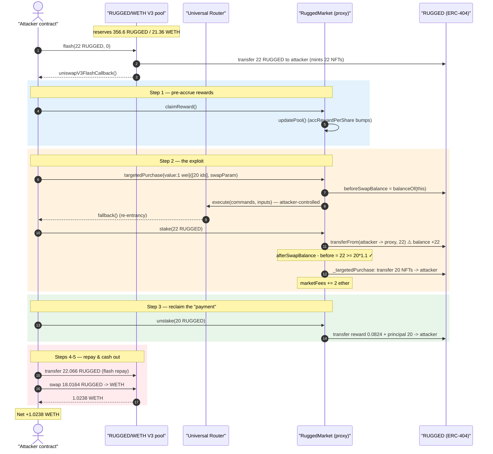
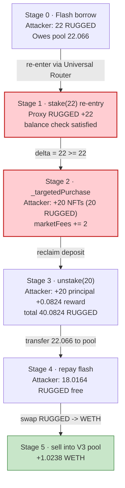
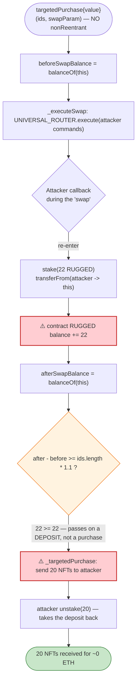

# RuggedArt (RuggedMarket) Exploit — Reentrant `targetedPurchase` Buys NFTs With Self-Staked Collateral

> **Vulnerability classes:** vuln/reentrancy/single-function

> **Reproduction:** the PoC compiles & runs in an isolated Foundry project at
> [this project folder](.) (the umbrella DeFiHackLabs repo contains many unrelated
> PoCs that do not whole-compile, so this one was extracted).
> Full verbose trace: [output.txt](output.txt).
> Verified vulnerable source: [src_Market.sol](sources/RuggedMarket_Fe380f/src_Market.sol),
> [src_Rugged.sol](sources/Rugged_bE33F5/src_Rugged.sol).

---

## Key info

| | |
|---|---|
| **Loss** | ~**1.024 WETH** (≈ $3.5K at the time) drained from the RUGGED/WETH Uniswap V3 pool |
| **Vulnerable contract** | `RuggedMarket` impl [`0x85495e3b410b4bd395ef25b2d7a76e7e3ea9304c`](https://etherscan.io/address/0x85495e3b410b4bd395ef25b2d7a76e7e3ea9304c#code) behind ERC1967 proxy [`0x2648f5592c09a260C601ACde44e7f8f2944944Fb`](https://etherscan.io/address/0x2648f5592c09a260C601ACde44e7f8f2944944Fb#code) |
| **Token (ERC-404)** | `Rugged` — [`0xbE33F57f41a20b2f00DEc91DcC1169597f36221F`](https://etherscan.io/address/0xbE33F57f41a20b2f00DEc91DcC1169597f36221F#code) |
| **Victim pool** | RUGGED/WETH Uniswap V3 pool — [`0x99147452078fa5C6642D3E5F7efD51113A9527a5`](https://etherscan.io/address/0x99147452078fa5C6642D3E5F7efD51113A9527a5) (`token0 = RUGGED`, `token1 = WETH`) |
| **Attacker EOA** | [`0x9733303117504c146a4e22261f2685ddb79780ef`](https://etherscan.io/address/0x9733303117504c146a4e22261f2685ddb79780ef) |
| **Attacker contract** | [`0x9bb0ca1e54025232e18f3874f972a851a910e9cb`](https://etherscan.io/address/0x9bb0ca1e54025232e18f3874f972a851a910e9cb) |
| **Attack tx** | [`0x5a63da39b5b83fccdd825fed0226f330f802e995b8e49e19fbdd246876c67e1f`](https://etherscan.io/tx/0x5a63da39b5b83fccdd825fed0226f330f802e995b8e49e19fbdd246876c67e1f) |
| **Chain / block / date** | Ethereum mainnet / 19,262,234 (PoC forks `19262234 − 1`) / Feb 19, 2024 |
| **Compiler** | RuggedMarket `v0.8.20`, Rugged token `v0.8.22`, optimizer **1** (`evm_version = shanghai`) |
| **Bug class** | Reentrancy + balance-delta accounting confusion (a "free purchase" via self-funded balance check) |

---

## TL;DR

`RuggedMarket.targetedPurchase(tokenIds, swapParam)`
([src_Market.sol:277-289](sources/RuggedMarket_Fe380f/src_Market.sol#L277-L289))
is meant to: take ETH from the caller, swap it for RUGGED via the Uniswap Universal Router,
and — *only if the swap actually delivered enough RUGGED* — hand out `tokenIds.length` NFTs
to the caller. It enforces "enough RUGGED arrived" by measuring the contract's own RUGGED
balance **before and after** the external swap:

```solidity
uint256 beforeSwapBalance = ruggedToken.balanceOf(address(this));
_executeSwap(swapParam);                       // ← external call, attacker-controlled
uint256 afterSwapBalance = ruggedToken.balanceOf(address(this));
uint256 totalAmount = afterSwapBalance - beforeSwapBalance;
if (totalAmount < _tokenIds.length * 1.1 ether) revert InvalidAmount();
_targetedPurchase(_tokenIds);                  // ← ships out the NFTs
```

The fatal flaw: `_executeSwap` calls into the **Universal Router with attacker-supplied
commands/inputs**. The attacker points that call back into their own contract, and from
there re-enters the *same* `RuggedMarket` proxy via `stake()`. `stake()` pulls the
attacker's RUGGED into the contract and bumps `afterSwapBalance` — so the balance-delta
check is satisfied **by the attacker's own staked deposit, not by any real purchase**. The
attacker then receives 20 NFTs (20 RUGGED of value) for a payment of **1 wei of ETH**, and
immediately `unstake()`s the same RUGGED back out.

With a single 22-RUGGED flash loan, the attacker walks away with **18.016 RUGGED of free
tokens** (20 free NFTs + a small staking-reward bonus, minus the flash fee), dumps them into
the RUGGED/WETH V3 pool, and nets **+1.024 WETH**.

---

## Background — what RUGGED / RuggedMarket are

**`Rugged`** ([src_Rugged.sol](sources/Rugged_bE33F5/src_Rugged.sol)) is an **ERC-404**
("Flippies") token — a hybrid ERC20/ERC721 where every whole unit (`10**decimals = 1 ether`)
of the ERC20 balance is backed by one NFT. Crossing a whole-unit boundary on a `transfer`
mints/burns NFTs automatically
([src_Rugged.sol:333-369](sources/Rugged_bE33F5/src_Rugged.sol#L333-L369)). Token IDs `≤ erc721totalSupply`
(10,000) are treated as NFT ids in `transferFrom`; larger values are treated as ERC20 amounts
([src_Rugged.sol:246-295](sources/Rugged_bE33F5/src_Rugged.sol#L246-L295)).

**`RuggedMarket`** ([src_Market.sol](sources/RuggedMarket_Fe380f/src_Market.sol)) is a
UUPS-upgradeable staking + NFT-marketplace contract for RUGGED:

- **Staking with rewards** — `stake` / `unstake` / `claimReward` distribute time-based
  `Incentive` rewards plus accumulated `marketFees` to stakers using the standard
  `accRewardPerShare` / `rewardDebt` pattern
  ([src_Market.sol:121-234](sources/RuggedMarket_Fe380f/src_Market.sol#L121-L234)).
- **Targeted NFT purchase** — two overloads of `targetedPurchase`. One takes RUGGED directly
  ([src_Market.sol:244-251](sources/RuggedMarket_Fe380f/src_Market.sol#L244-L251)); the other
  ([src_Market.sol:277-289](sources/RuggedMarket_Fe380f/src_Market.sol#L277-L289)) lets the
  caller pay in **ETH**, which the contract swaps to RUGGED through the Uniswap **Universal
  Router** and then verifies via a balance delta. Each NFT bought accrues a `0.1 ether`
  market fee ([src_Market.sol:253-262](sources/RuggedMarket_Fe380f/src_Market.sol#L253-L262)).

On-chain state at the fork block (read from the trace):

| Parameter | Value |
|---|---|
| RUGGED held by the V3 pool (`reserve0`) | 356.566 RUGGED ([output.txt:39](output.txt#L39)) |
| WETH held by the V3 pool (`reserve1`) | 21.357 WETH ([output.txt:41](output.txt#L41)) |
| RUGGED held by the `RuggedMarket` proxy (before attack) | 511.847 RUGGED ([output.txt:215](output.txt#L215)) |
| `ERC721_TOTAL_SUPPLY` | 10,000 |
| Per-NFT purchase price required | `1.1 ether` RUGGED each |
| Per-NFT market fee | `0.1 ether` |

---

## The vulnerable code

### 1. The ETH-paying `targetedPurchase` trusts a self-measured balance delta

```solidity
function targetedPurchase(
    uint256[] memory _tokenIds,
    UniversalRouterExecute calldata swapParam
) public payable {
    uint256 beforeSwapBalance = ruggedToken.balanceOf(address(this));
    _executeSwap(swapParam);                               // ⚠️ external, attacker-controlled
    uint256 afterSwapBalance = ruggedToken.balanceOf(address(this));
    uint256 totalAmount = afterSwapBalance - beforeSwapBalance;
    if (totalAmount < _tokenIds.length * 1.1 ether) {      // ⚠️ delta can be faked
        revert InvalidAmount();
    }
    _targetedPurchase(_tokenIds);                          // ⚠️ ships NFTs out
}
```

[src_Market.sol:277-289](sources/RuggedMarket_Fe380f/src_Market.sol#L277-L289)

`_executeSwap` forwards `msg.value` and the attacker's raw `commands`/`inputs` to the
Universal Router:

```solidity
function _executeSwap(UniversalRouterExecute calldata swapParam) private {
    if (msg.value > 0) {
        UNIVERSAL_ROUTER.execute{value: msg.value}(
            swapParam.commands, swapParam.inputs, swapParam.deadline
        );
    } else { revert InvalidParameter(); }
}
```

[src_Market.sol:264-275](sources/RuggedMarket_Fe380f/src_Market.sol#L264-L275)

### 2. `_targetedPurchase` hands out NFTs and accrues fees

```solidity
function _targetedPurchase(uint256[] memory _tokenIds) private {
    for (uint256 i = 0; i < _tokenIds.length; i++) {
        if (_tokenIds[i] > ERC721_TOTAL_SUPPLY) revert InvalidAmount();
        ruggedToken.transferFrom(address(this), msg.sender, _tokenIds[i]);  // NFT id → caller
    }
    marketFees += _tokenIds.length * 0.1 ether;
}
```

[src_Market.sol:253-262](sources/RuggedMarket_Fe380f/src_Market.sol#L253-L262)

### 3. The reentrancy guard does NOT cover this path

`stake` / `unstake` / `claimReward` are all `nonReentrant`
([src_Market.sol:155](sources/RuggedMarket_Fe380f/src_Market.sol#L155),
[:201](sources/RuggedMarket_Fe380f/src_Market.sol#L201),
[:220](sources/RuggedMarket_Fe380f/src_Market.sol#L220)) — **but the ETH `targetedPurchase`
overload is NOT** ([src_Market.sol:277](sources/RuggedMarket_Fe380f/src_Market.sol#L277)).
So nothing prevents `targetedPurchase` → (external swap) → `stake` from running while
`targetedPurchase` is still on the stack. (Even a guard would not have fully fixed it — see
Root cause.)

---

## Root cause — why it was possible

`targetedPurchase` confuses **"the contract's RUGGED balance went up by X"** with **"the
caller paid X for a purchase."** Those are only equivalent if the *only* thing that can change
the contract's balance during the call is the swap. They are not:

1. **The check measures the contract's balance, not the swap's output.** The intended
   semantics — "the Universal Router swap produced ≥ `1.1 ether` of RUGGED per NFT" — is
   approximated by `afterSwapBalance − beforeSwapBalance`. Any RUGGED that arrives at the
   contract *for any reason* during the window counts toward the purchase price.

2. **The "swap" is an arbitrary attacker-controlled external call.** `_executeSwap` passes the
   attacker's own `commands`/`inputs` to `UNIVERSAL_ROUTER.execute`. The attacker encodes a
   command that calls back into their own contract (the Universal Router invokes the
   attacker's `fallback`), turning the "swap" into attacker code execution **mid-function**.

3. **The attacker re-enters and self-funds the balance.** From that callback the attacker calls
   `RuggedMarket.stake(22 ether)`. `stake` does `ruggedToken.transferFrom(attacker, this, 22e18)`
   ([src_Market.sol:160](sources/RuggedMarket_Fe380f/src_Market.sol#L160)), so the contract's
   RUGGED balance rises by 22 — comfortably above the `20 × 1.1 = 22 ether` required for 20
   NFTs. The check passes with **zero real purchase**.

4. **The staked RUGGED is immediately recoverable.** After receiving the 20 NFTs, the attacker
   `unstake(20 ether)` pulls the principal back out plus the inflated staking reward. The
   "payment" was never spent — it was a loan to the contract that the attacker takes back.

5. **No reentrancy guard on the purchase path.** `targetedPurchase` is not `nonReentrant`, so
   the re-entrant `stake` succeeds. (A guard alone is insufficient: the design of validating a
   purchase by self-balance delta is unsound regardless, because a depositing function and a
   purchase function share the same balance.)

The result: **the contract gives away NFTs in exchange for a deposit it will return.** The 20
NFTs (20 RUGGED of intrinsic value, since each NFT == 1 ERC20 unit) are pure profit.

---

## Preconditions

- The `RuggedMarket` proxy holds enough NFTs to fulfil `_targetedPurchase`. Here the proxy held
  511.8 RUGGED ([output.txt:215](output.txt#L215)); the attacker's re-entrant `stake(22)` also
  *mints 22 fresh NFTs into the proxy* (ERC-404 minting on the inbound transfer,
  [output.txt:250-271](output.txt#L250-L271)), so 20 NFTs are available.
- Working capital of 22 RUGGED to seed the flow — obtained via a **Uniswap V3 flash loan** from
  the RUGGED/WETH pool itself ([test/RuggedArt_exp.sol:74](test/RuggedArt_exp.sol#L74)), repaid
  in the same transaction (22 + 0.066 fee). Fully flash-loanable; no attacker capital at risk.
- An on-chain RUGGED/WETH pool to convert the free RUGGED into WETH profit.

---

## Attack walkthrough (with on-chain numbers from the trace)

The PoC drives everything from a Uniswap V3 `flash` callback. All figures are taken directly
from [output.txt](output.txt).

| # | Step | Trace | Effect |
|---|------|-------|--------|
| 0 | **Flash-borrow 22 RUGGED** from the V3 pool (`flash(22e18, 0)`) | [output.txt:37-42](output.txt#L37-L42) | Attacker holds 22 RUGGED (and the 22 NFTs minted to it). Owed back: 22.066 RUGGED. |
| 1 | **`claimReward()`** (attacker not yet staked) | [output.txt:204-211](output.txt#L204-L211) | `updatePool()` accrues elapsed `Incentive` time into `accRewardPerShare`; returns 0. Pre-positions the reward accumulator. |
| 2 | **`targetedPurchase{value:1}([20 ids], swapParam)`** | [output.txt:212-216](output.txt#L212-L216) | `beforeSwapBalance` snapshot taken, then the attacker-controlled Universal Router `execute` runs. |
| 2a | ↳ Universal Router calls back into attacker `fallback`, which approves & calls **`stake(22e18)`** | [output.txt:217-226](output.txt#L217-L226) | `transferFrom(attacker → proxy, 22e18)` raises the proxy's RUGGED balance by 22; ERC-404 **burns the attacker's 22 NFTs and mints 22 new NFTs to the proxy** ([output.txt:228-271](output.txt#L228-L271)); `totalStaked = 22e18`, attacker `amountStaked = 22e18` (slot 5 → `2e18`-scaled accounting, [output.txt:788](output.txt#L788)). |
| 2b | ↳ Back in `targetedPurchase`: `afterSwapBalance − beforeSwapBalance = 22 ≥ 20×1.1 = 22` ✓ | check passes | The deposit *is* the "payment". |
| 2c | ↳ `_targetedPurchase` transfers **20 NFTs (20 RUGGED) to attacker**; `marketFees += 2 ether` | [output.txt:283-289](sources/RuggedMarket_Fe380f/src_Market.sol#L283-L289) (logic), trace NFT transfers proxy→attacker | Attacker balance: 0 → 20 RUGGED. Fee accrual will boost the next reward. |
| 3 | **`unstake(20e18)`** | [output.txt:793-801](output.txt#L793-L801) | `updatePool()` folds `marketFees` into rewards; attacker (sole/dominant staker) gets pendingReward **0.0824 RUGGED** ([output.txt:795](output.txt#L795)) + **20 RUGGED principal** ([output.txt:801](output.txt#L801)). Attacker balance: 20 → **40.0824 RUGGED**. |
| 4 | **Repay flash loan** — `transfer(pool, 22.066e18)` | [output.txt:1038](output.txt#L1038) | Attacker balance: 40.0824 → **18.0164 RUGGED** of pure profit (all NFT-backed). |
| 5 | **Dump 18.0164 RUGGED into the V3 pool** (`swap`, zeroForOne) | [output.txt:1189-1190](output.txt#L1189-L1190) | Pool pays out **1.0238 WETH** ([output.txt:1190](output.txt#L1190), [Swap event :1319](output.txt#L1319)). |
| 6 | **Done** — attacker WETH balance 0 → **1.0238 WETH** | [output.txt:1325-1327](output.txt#L1325-L1327) | Net profit. |

### Why the balance check was satisfied for free

The required payment for 20 NFTs is `20 × 1.1 ether = 22 ether` of RUGGED. The attacker's
re-entrant `stake(22 ether)` raises the contract's RUGGED balance by exactly 22 — so
`totalAmount = 22 ≥ 22` passes. But that 22 RUGGED is a **stake deposit**, fully reclaimable via
`unstake`. The contract therefore parts with 20 NFTs (and a reward) while its net RUGGED holdings
return to baseline.

### Profit accounting (RUGGED, then WETH)

| Item | RUGGED |
|---|---:|
| Flash-borrowed | +22.000 |
| Staked into proxy (step 2a) | −22.000 |
| 20 free NFTs received (step 2c) | +20.000 |
| Unstaked principal (step 3) | +20.000 |
| Staking reward (step 3) | +0.0824 |
| Flash repayment incl. 0.3% fee (step 4) | −22.066 |
| **Net free RUGGED** | **+18.0164** |

| Item | WETH |
|---|---:|
| Sold 18.0164 RUGGED into RUGGED/WETH V3 pool | +1.0238 |
| **Net profit** | **+1.0238 WETH** |

The 18.0164 free RUGGED ≈ the 20 free NFTs + 0.0824 reward − 2.066 (flash fee + the
0.066-RUGGED net of stake/unstake mechanics) — i.e., the attacker monetized NFTs it never paid
for.

---

## Diagrams

### Sequence of the attack



### Pool / balance state evolution



### The flaw inside `targetedPurchase`



---

## Why each magic number

- **Flash loan = 22 RUGGED:** exactly `20 × 1.1 ether`, the minimum RUGGED that must appear in
  the contract for 20 NFTs. The attacker stakes precisely this amount so the delta check passes
  with no surplus wasted.
- **20 NFTs purchased:** chosen so the free RUGGED (≈18) maximally moves the relatively thin
  RUGGED/WETH pool (356.6 RUGGED / 21.36 WETH) without excessive slippage.
- **`msg.value = 1 wei`:** the `targetedPurchase` ETH path only requires `msg.value > 0`
  ([src_Market.sol:266](sources/RuggedMarket_Fe380f/src_Market.sol#L266)); the actual purchase
  cost is faked by the staked balance, so a single wei satisfies the guard.
- **`unstake(20)` not `unstake(22)`:** the attacker staked 22 but only needs to reclaim enough
  to be net-positive after repaying the 22.066 flash debt; the difference plus the 20 free NFTs
  plus reward equals the 18.0164 RUGGED profit.

---

## Remediation

1. **Never validate a payment with a self-measured balance delta around an attacker-controlled
   external call.** Either (a) take the RUGGED payment *directly* from the caller with
   `transferFrom` of a known amount (as the RUGGED-paying overload does at
   [src_Market.sol:244-251](sources/RuggedMarket_Fe380f/src_Market.sol#L244-L251)), or (b) read
   the Universal Router's reported swap output, not the contract's aggregate balance.
2. **Add `nonReentrant` to every state-mutating external entry point**, including the ETH
   `targetedPurchase` overload ([src_Market.sol:277](sources/RuggedMarket_Fe380f/src_Market.sol#L277)).
   The deposit functions are already guarded; the purchase function must share the same lock so a
   re-entrant `stake` cannot run mid-purchase.
3. **Do not let one function's accounting (staking deposits) leak into another's invariant
   (purchase payment).** Track "RUGGED received for purchases" in a dedicated variable updated
   only by the swap path, rather than inferring it from `balanceOf(this)`, which staking also
   moves.
4. **Constrain the swap call.** `_executeSwap` forwards arbitrary `commands`/`inputs` to the
   Universal Router. Restrict the allowed commands to a fixed "swap ETH→RUGGED to this contract"
   template, eliminating the attacker's ability to insert a callback.
5. **Follow checks-effects-interactions and snapshot after settlement.** Compute and lock in the
   credited purchase amount only from values that cannot be influenced by reentrant deposits.

---

## How to reproduce

The PoC was extracted into a standalone Foundry project (the umbrella DeFiHackLabs repo has many
unrelated PoCs that fail to whole-compile under `forge test`):

```bash
_shared/run_poc.sh 2024-02-RuggedArt_exp --mt testExploit -vvvvv
```

- RPC: a **mainnet archive** endpoint is required (the fork pins block `19262234 − 1`).
- `evm_version` must be `shanghai` (set in `foundry.toml`), per the PoC header note
  ([test/RuggedArt_exp.sol:60](test/RuggedArt_exp.sol#L60)).
- Result: `[PASS] testExploit()` with the attacker WETH balance rising from 0 to ~1.0238 WETH.

Expected tail:

```
Ran 1 test for test/RuggedArt_exp.sol:ContractTest
[PASS] testExploit() (gas: 7102116)
Logs:
  Attacker Eth balance before attack:: 0
  Attacker Eth balance after attack:: 1023851896415447765

Suite result: ok. 1 passed; 0 failed; 0 skipped; finished in 168.35s
```

(`1023851896415447765` wei = 1.0238 WETH — the drained pool liquidity.)

---

*References: DeFiHackLabs PoC header ([test/RuggedArt_exp.sol:7-11](test/RuggedArt_exp.sol#L7-L11)); SlowMist Hacked / RuggedArt incident, Ethereum, Feb 2024.*
