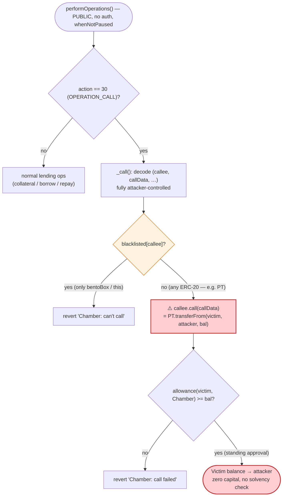
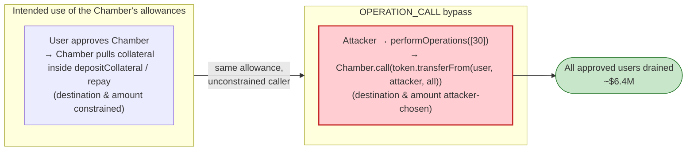

# Seneca Protocol Exploit — Arbitrary External Call Abuses User Approvals

> **Vulnerability classes:** vuln/dependency/unsafe-external-call

> **Reproduction:** the PoC compiles & runs in an isolated Foundry project at
> [this project folder](.) (the umbrella DeFiHackLabs repo does not whole-compile, so this
> PoC was extracted into a standalone project).
> Full verbose trace: [output.txt](output.txt).
> Verified vulnerable source: [contracts_Chamber2.sol](sources/Chamber_65c210/contracts_Chamber2.sol).

---

## Key info

| | |
|---|---|
| **Loss** | ~$6.4M total (all users who had approved a Seneca `Chamber`). PoC drains **one** victim: **1,385.238431763437306795 PT** (Pendle Principal Token) |
| **Vulnerable contract** | `Chamber` — [`0x65c210c59B43EB68112b7a4f75C8393C36491F06`](https://etherscan.io/address/0x65c210c59b43eb68112b7a4f75c8393c36491f06#code) (master); exploited clone `0x45e15d1e4F92f28A916F4f2971Ad9adc278e148B` |
| **Victim (PoC)** | `0x9CBF099ff424979439dFBa03F00B5961784c06ce` — held 1,385.24 PT and had approved the Chamber |
| **Stolen token (PoC)** | `PendlePrincipalToken` — [`0xB05cABCd99cf9a73b19805edefC5f67CA5d1895E`](https://etherscan.io/address/0xB05cABCd99cf9a73b19805edefC5f67CA5d1895E#code) |
| **Attacker EOA** | `0x94641c01a4937f2c8ef930580cf396142a2942dc` |
| **Attack tx** | `0x23fcf9d4517f7cc39815b09b0a80c023ab2c8196c826c93b4100f2e26b701286` |
| **Chain / block / date** | Ethereum mainnet / fork **19,325,936** / Feb 28, 2024 |
| **Compiler** | Chamber: Solidity v0.8.19, optimizer 1000 runs |
| **Bug class** | Arbitrary external call (`callee.call(callData)`) with insufficient target allow-listing → abuse of pre-existing ERC-20 allowances |

---

## TL;DR

Seneca's `Chamber` lending contract exposes a generic batch executor,
`performOperations(actions, values, datas)`
([contracts_Chamber2.sol:408-485](sources/Chamber_65c210/contracts_Chamber2.sol#L408-L485)).
One of the supported actions, `OPERATION_CALL` (`action == 30`), routes into the internal
`_call(...)`
([:370-392](sources/Chamber_65c210/contracts_Chamber2.sol#L370-L392)),
which performs a **fully attacker-controlled low-level call**:

```solidity
(bool success, bytes memory returnData) = callee.call{value: value}(callData);
require(success, "Chamber: call failed");
```

The only guard is `require(!blacklisted[callee], "Chamber: can't call")`, and the blacklist
contains nothing but the `bentoBox` and the contract itself. Any other `callee`/`callData` pair is
permitted — including `transferFrom(victim, attacker, amount)` on any ERC-20.

Because Seneca users had granted the `Chamber` (clone) an **unlimited allowance** so it could pull
their collateral, the attacker simply asked the Chamber to call
`PendlePrincipalToken.transferFrom(victim, attacker, victimBalance)` *on its own behalf*. The token
sees the Chamber as `msg.sender`, the allowance is satisfied, and the victim's entire balance is
swept out. There is **no access control** on `performOperations` — anyone can call it for any
victim, looping over every approved user/token pair.

The PoC reproduces a single victim:

```
Exploiter PendlePrincipalToken balance before attack: 0.000000000000000000
Exploiter PendlePrincipalToken balance after attack:  1385.238431763437306795
```

---

## Background — what the Chamber does

`Chamber`
([source](sources/Chamber_65c210/contracts_Chamber2.sol)) is Seneca's Abracadabra/Cauldron-style
isolated-lending market. Users deposit collateral and borrow `senUSD`. It is deployed as a
**master contract + clones** (`IMasterContract`,
[contracts_interfaces_IMasterContract.sol](sources/Chamber_65c210/contracts_interfaces_IMasterContract.sol));
each market is a clone initialised via `init`. The router/master entry the PoC calls
(`0x65c210...`) **delegatecalls** into the live market clone
(`0x45e15d1e...`) — visible in the trace at
[output.txt:1588](output.txt) (`... [delegatecall]`).

Like Abracadabra, the Chamber offers a **"cook"-style** batch API, `performOperations`, that lets a
user compose several actions in one transaction: add/remove collateral, borrow, repay, deposit to /
withdraw from `bentoBox`, update price — and a catch-all `OPERATION_CALL` meant for plugging into
external helpers (swappers, leverage routers, etc.). To make any of this work, users must approve
the Chamber to move their tokens. **That standing approval is exactly what `OPERATION_CALL` lets the
attacker weaponise.**

The relevant on-chain facts at the fork block:

| Fact | Value |
|---|---|
| `OPERATION_CALL` action id | **30** ([Constants.sol:39](sources/Chamber_65c210/contracts_Constants.sol#L39)) |
| `blacklisted` set | only `bentoBox` and `address(this)` ([:108-110](sources/Chamber_65c210/contracts_Chamber2.sol#L108-L110)) |
| Access control on `performOperations` | **none** — `external payable`, `whenNotPaused` only ([:408-412](sources/Chamber_65c210/contracts_Chamber2.sol#L408-L412)) |
| Victim PT balance | **1,385.238431763437306795 PT** (read live in the PoC) |
| Victim → Chamber PT allowance | sufficient (the `transferFrom` succeeds in the trace) |

---

## The vulnerable code

### 1. `OPERATION_CALL` decodes a fully attacker-supplied `(callee, callData)`

```solidity
function _call(
    uint256 value,
    bytes memory data,
    uint256 value1,
    uint256 value2
) whenNotPaused internal returns (bytes memory, uint8) {
    (address callee, bytes memory callData, bool useValue1, bool useValue2, uint8 returnValues) =
        abi.decode(data, (address, bytes, bool, bool, uint8));

    // ... (value1/value2 splicing, irrelevant here) ...

    require(!blacklisted[callee], "Chamber: can't call");   // ← only guard

    (bool success, bytes memory returnData) = callee.call{value: value}(callData);
    require(success, "Chamber: call failed");
    return (returnData, returnValues);
}
```
[contracts_Chamber2.sol:370-392](sources/Chamber_65c210/contracts_Chamber2.sol#L370-L392)

The dev comment two lines above is telling:

> *"Calls to `bentoBox` are not allowed for obvious security reasons. This also means that calls made from this contract shall **not** be trusted."*
> [:368-369](sources/Chamber_65c210/contracts_Chamber2.sol#L368-L369)

The author recognised the call is untrusted — but only blacklisted the `bentoBox` (to stop a caller
moving *bentoBox* deposits). They did not consider that the Chamber **also holds ERC-20 allowances
from every user**, which a `transferFrom` against an arbitrary `callee` can drain.

### 2. The dispatcher exposes it permissionlessly

```solidity
function performOperations(
    uint8[] calldata actions,
    uint256[] calldata values,
    bytes[] calldata datas
) whenNotPaused external payable returns (uint256 value1, uint256 value2) {
    // ...
    } else if (action == Constants.OPERATION_CALL) {       // action == 30
        (bytes memory returnData, uint8 returnValues) = _call(values[i], datas[i], value1, value2);
        // ...
    }
    // ...
    if (status.needsSolvencyCheck) { /* only set by remove-collateral / borrow */ }
}
```
[contracts_Chamber2.sol:408-485](sources/Chamber_65c210/contracts_Chamber2.sol#L408-L485)

There is **no `onlyOwner`, no per-user authorization, and no solvency check** on the `OPERATION_CALL`
path (`needsSolvencyCheck` is only set by `OPERATION_REMOVE_COLLATERAL` / `OPERATION_BORROW`). So a
single `actions = [30]` array with a crafted `datas[0]` is all that is required.

---

## Root cause — why it was possible

A token approval is a delegation of authority: "this contract may move my tokens." The Chamber is
trusted by users to do that **only inside its own accounting logic** (`depositCollateral`,
`_addTokens`, `repay`, …), where the destination and amount are constrained by the protocol.

`OPERATION_CALL` punches a hole through that contract: it lets *any* external party direct the
Chamber to make *any* call to *any* (non-blacklisted) address. Combined with the standing user
allowances, this collapses to:

> "Anyone can make the Chamber call `token.transferFrom(anyApprovedUser, attacker, theirWholeBalance)`."

Three design decisions compose into the critical bug:

1. **Insufficient target allow-listing.** The guard is a *deny-list* (`blacklisted[callee]`)
   containing only `bentoBox` + `this`. A safe design needs an *allow-list* (only known, vetted
   swapper/router targets), or — better — must never call a token the contract holds allowances for.
   A deny-list can never enumerate every dangerous target (every ERC-20 the protocol is approved on).
2. **No access control on the batch executor.** `performOperations` is fully public, so the attacker
   chooses the victim and the call. Even a self-only restriction would not fully fix it (a victim
   could be tricked), but combined with #1 it is fatal.
3. **Standing unlimited approvals.** Like its Abracadabra lineage, the Chamber relies on users
   pre-approving it. Every approval is a live attack-asset the moment an arbitrary-call primitive
   exists. The blast radius is **every user × every token they approved** — hence the ~$6.4M
   aggregate, not just one victim.

The exploit is not a math/oracle bug at all; it is a **confused-deputy** attack: the privileged
deputy (Chamber, holder of allowances) is induced to act for the attacker.

---

## Preconditions

- A deployed, **non-paused** Chamber market (`whenNotPaused` is the only modifier). ✓ at the fork
  block.
- At least one user holding a token and having an **outstanding allowance** to the Chamber clone
  (`callee` token allowance ≥ amount). The victim `0x9CBF…06ce` had 1,385.24 PT approved. ✓
- The target token is **not** in `blacklisted` — true for every ERC-20 except `bentoBox`. ✓
- No capital required. The attacker spends only gas; the value is pulled straight from victims into
  the attacker's address. (PoC: `ContractTest` receives the tokens directly.)

---

## Attack walkthrough (with on-chain numbers from the trace)

The PoC builds one action — `OPERATION_CALL` (30) — whose payload is the ABI-encoded
`(callee, callData, useValue1, useValue2, returnValues)` tuple where:

- `callee   = 0xB05cABCd99cf9a73b19805edefC5f67CA5d1895E` (PendlePrincipalToken)
- `callData = transferFrom(0x9CBF…06ce, 0x7FA9…1496, 1385238431763437306795)`
- `useValue1 = useValue2 = false`, `returnValues = 0`

(`0x7FA9385bE102ac3EAc297483Dd6233D62b3e1496` is the PoC test contract = "attacker" recipient.)

All figures below come from [output.txt](output.txt) lines 1579-1602.

| # | Step | Call | Result |
|---|------|------|--------|
| 0 | **Read victim balance** | `PendlePrincipalToken.balanceOf(victim)` | `1,385.238431763437306795 PT` ([:1580-1581](output.txt)) |
| 1 | **Attacker balance before** | `balanceOf(attacker)` | `0` ([:1582-1583](output.txt)) |
| 2 | **Single exploit call** | `Chamber.performOperations([30],[0],[data])` | enters master `0x65c2…` ([:1587](output.txt)) |
| 3 | **Delegatecall to clone** | `0x45e15d1e…::performOperations(...)` `[delegatecall]` | clone runs `_call` ([:1588](output.txt)) |
| 4 | **Arbitrary call fires** | `PendlePrincipalToken.transferFrom(victim, attacker, 1.385e21)` | `Transfer(victim → attacker, 1.385e21)` ([:1589-1590](output.txt)) |
| 5 | — storage | victim slot `…ba2098: 0x4b18…c3ab → 0` ; attacker slot `…a1bb03: 0 → 0x4b18…c3ab` | victim emptied, attacker credited ([:1591-1593](output.txt)) |
| 6 | **Attacker balance after** | `balanceOf(attacker)` | `1,385.238431763437306795 PT` ([:1597-1598](output.txt)) |

Note `0x4b180b86618eddc3ab` (hex) = `1385238431763437306795` (dec) — the entire victim balance moved
in one `transferFrom`, no remainder.

### Why it succeeds with zero capital

`transferFrom` pulls from the victim using the **Chamber clone's allowance**. Inside the
delegatecall, `msg.sender` seen by the token is the Chamber (the address users approved), so the
allowance check passes and the tokens flow to the attacker-chosen `to`. The attacker never had to
hold or risk any funds.

### Profit / loss accounting (PoC scope)

| Direction | Amount |
|---|---:|
| Attacker PT before | 0 |
| Attacker PT after | 1,385.238431763437306795 PT |
| **Net to attacker** | **+1,385.24 PT** (= 100% of victim's balance) |
| Victim PT after | 0 |

In the real incident the attacker repeated this `OPERATION_CALL` once per `(user, token)` pair across
all Seneca markets and all approved users, aggregating to **~$6.4M** in PT, WETH, USDC, and other
collateral tokens. The PoC demonstrates the mechanism on one representative victim/token.

---

## Diagrams

### Sequence of the attack

```mermaid
sequenceDiagram
    autonumber
    actor A as "Attacker EOA / contract"
    participant CM as "Chamber master (0x65c2…)"
    participant CL as "Chamber clone (0x45e1…) [delegatecall]"
    participant T as "PendlePrincipalToken (0xB05c…)"
    actor V as "Victim (0x9CBF…)"

    Note over V,CL: Pre-state — victim approved the Chamber<br/>allowance(victim, Chamber) >= 1,385.24 PT

    A->>CM: "performOperations([30],[0],[data])"
    Note right of A: "data = (PT, transferFrom(victim, attacker, 1385.24), false,false,0)"
    CM->>CL: "performOperations(...) [delegatecall]"
    CL->>CL: "_call(): require(!blacklisted[PT]) — passes"
    CL->>T: "PT.call( transferFrom(victim, attacker, 1385.24) )"
    Note over T: "msg.sender == Chamber<br/>allowance satisfied"
    T-->>V: "debit 1,385.24 PT"
    T-->>A: "credit 1,385.24 PT"
    T-->>CL: "Transfer(victim → attacker); return true"
    CL-->>CM: "return (0,0)"
    CM-->>A: "return (0,0)"
    Note over A: "Attacker now holds the victim's entire PT balance<br/>(repeat per user/token → ~$6.4M)"
```

### How the confused-deputy primitive works



### Trust model: intended vs. abused authority



---

## Remediation

1. **Remove the arbitrary-call primitive, or restrict its targets to a strict allow-list.**
   Replace the deny-list (`blacklisted[callee]`) with an explicit allow-list of vetted helper
   contracts (specific swappers/leverage routers). A contract that holds user allowances must never
   expose a generic `callee.call(callData)`.
2. **Never let the protocol's own allowances be reachable via a generic call.** If external calls
   are required, route them through a dedicated, allowance-less executor contract that does not hold
   any user approvals, and have the Chamber transfer exact amounts to it per operation.
3. **Forbid token addresses as `callee`.** At minimum, block calls whose `callee` is any token the
   protocol is approved on, and block 4-byte selectors `transferFrom` / `transfer` / `approve` /
   `permit` in the generic call path.
4. **Add caller authorization to the batch executor.** `OPERATION_CALL` should only ever act for
   `msg.sender`'s own positions; combined with #1 this removes the cross-user blast radius.
5. **Prefer `permit`/pull-on-demand over standing unlimited approvals.** Reducing the size and
   lifetime of approvals shrinks the value at risk if any call primitive is ever mis-scoped.

---

## How to reproduce

The PoC was extracted into a standalone Foundry project (the umbrella DeFiHackLabs repo does not
whole-compile under `forge test`):

```bash
_shared/run_poc.sh 2024-02-Seneca_exp -vvvvv
```

- RPC: an Ethereum **archive** endpoint is required (fork block 19,325,936, Feb 2024). The project's
  `foundry.toml` `mainnet` alias must point at an archive node that serves historical state at that
  block.
- Result: `[PASS] testExploit()` — the attacker's PT balance goes from `0` to `1385.238431763437306795`.

Expected tail:

```
Ran 1 test for test/Seneca_exp.sol:ContractTest
[PASS] testExploit() (gas: 63142)
Logs:
  Exploiter PendlePrincipalToken balance before attack: 0.000000000000000000
  Exploiter PendlePrincipalToken balance after attack: 1385.238431763437306795

Suite result: ok. 1 passed; 0 failed; 0 skipped; finished in 3.87s
```

---

*References: PoC header — Attacker `0x94641c01a4937f2c8ef930580cf396142a2942dc`, vuln contract
`0x65c210c59b43eb68112b7a4f75c8393c36491f06`, attack tx
`0x23fcf9d4517f7cc39815b09b0a80c023ab2c8196c826c93b4100f2e26b701286`; analysis
[@Phalcon_xyz](https://twitter.com/Phalcon_xyz/status/1763045563040411876). Total loss ~$6M (Seneca,
Ethereum, Feb 2024).*
