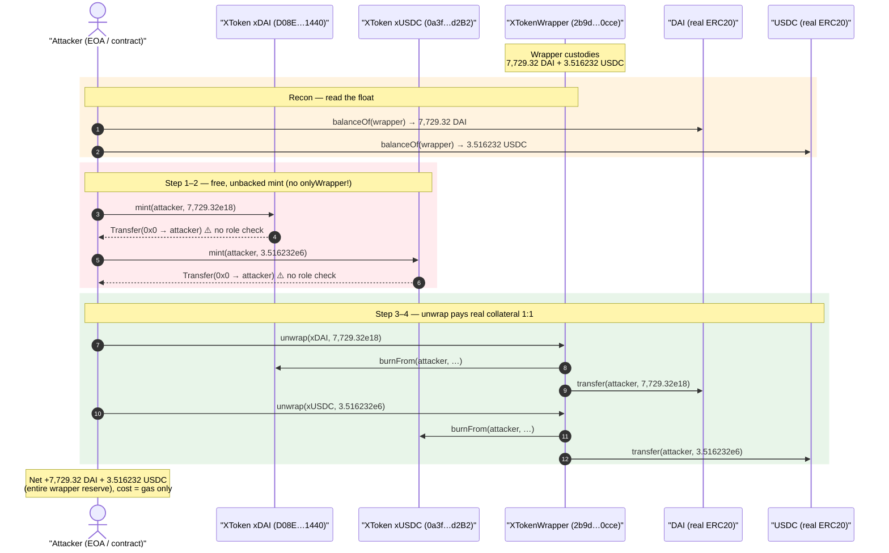
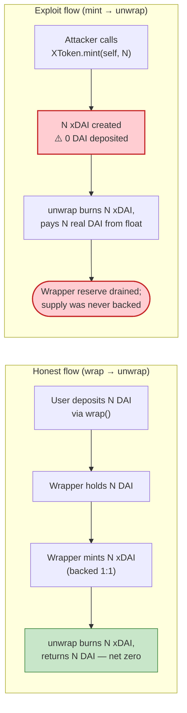
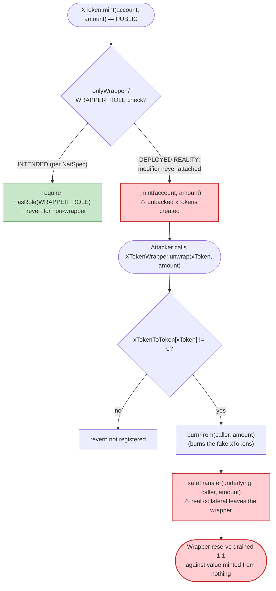

# Swarm Markets (XToken) Exploit — Public `mint()` / `burnFrom()` Mint-and-Unwrap Drain

> **Reproduction:** the PoC compiles & runs in an isolated Foundry project at
> [this project folder](.) (the umbrella DeFiHackLabs repo contains many unrelated
> PoCs that do not whole-compile, so this one was extracted).
> Full verbose trace: [output.txt](output.txt).
> Verified vulnerable sources: [XToken.sol](sources/XToken_D08E24/XToken.sol) and
> [XTokenWrapper.sol](sources/XTokenWrapper_2b9dc6/contracts_token_XTokenWrapper.sol).

---

## Key info

| | |
|---|---|
| **Loss** | ~$7,733 — **7,729.32 DAI** + **3.516232 USDC** drained from the `XTokenWrapper` |
| **Vulnerable contract** | `XToken` (xSMT-DAI) — [`0xD08E245Fdb3f1504aea4056e2C71615DA7001440`](https://etherscan.io/address/0xD08E245Fdb3f1504aea4056e2C71615DA7001440#code) and `XToken` (xSMT-USDC) — [`0x0a3fbF5B4cF80DB51fCAe21efe63f6a36D45d2B2`](https://etherscan.io/address/0x0a3fbF5B4cF80DB51fCAe21efe63f6a36D45d2B2#code) |
| **Drained vault** | `XTokenWrapper` — [`0x2b9dc65253c035Eb21778cB3898eab5A0AdA0cCe`](https://etherscan.io/address/0x2b9dc65253c035Eb21778cB3898eab5A0AdA0cCe#code) (held the underlying DAI/USDC reserves) |
| **Attacker EOA** | [`0x38f68f119243adbca187e1ef64344ed475a8c69c`](https://etherscan.io/address/0x38f68f119243adbca187e1ef64344ed475a8c69c) |
| **Attacker contract** | [`0x3aa228a80f50763045bdfc45012da124bd0a6809`](https://etherscan.io/address/0x3aa228a80f50763045bdfc45012da124bd0a6809) |
| **Attack tx** | [`0xa4d7ee2ddb9db06961a17e2a5ae71743a266bcb720be138670f4a10e8dfc13e9`](https://app.blocksec.com/explorer/tx/eth/0xa4d7ee2ddb9db06961a17e2a5ae71743a266bcb720be138670f4a10e8dfc13e9) |
| **Chain / block / date** | Ethereum mainnet / fork at 19,286,456 (tx in block 19,286,457) / Feb 2024 |
| **Compiler** | `XToken` v0.7.0 (optimizer off); `XTokenWrapper` v0.7.4 (optimizer 1 run) |
| **Bug class** | Broken access control — mint/burn entry points missing their `onlyWrapper` modifier (free, unbacked mint → unwrap for real collateral) |

---

## TL;DR

Swarm Markets wraps real ERC20 collateral (DAI, USDC) into 1:1 "xTokens" through an
[`XTokenWrapper`](sources/XTokenWrapper_2b9dc6/contracts_token_XTokenWrapper.sol). The wrapper is the
sole intended minter: `wrap()` pulls in the underlying and mints xTokens; `unwrap()` burns xTokens and
returns the underlying. The xToken's `mint`/`burnFrom` are documented as `onlyWrapper`-gated.

But the deployed `XToken` contract **ships those two functions with no modifier at all**
([XToken.sol:1478](sources/XToken_D08E24/XToken.sol#L1478) and
[:1497](sources/XToken_D08E24/XToken.sol#L1497)) — the NatSpec promises "the caller must have
WRAPPER_ROLE", but the code calls `_mint`/`_burn` directly with zero authorization check. So **anyone
can mint themselves arbitrary xTokens for free.**

The collateral is then trivially extracted because `XTokenWrapper.unwrap()`
([:122](sources/XTokenWrapper_2b9dc6/contracts_token_XTokenWrapper.sol#L122)) does **not** verify
that the caller's xTokens were backed by a real prior `wrap()` — it just burns the xTokens it is told
to and pays out the matching underlying from the wrapper's own balance.

The attacker:

1. **Mints** unbacked xDAI/xUSDC to itself, in an amount exactly equal to the DAI/USDC sitting in the
   wrapper (read live with `balanceOf(wrapper)`).
2. **Unwraps** them — the wrapper burns the fake xTokens and hands over **all** of its real DAI and USDC.

No flash loan, no price manipulation, no capital. The "mint" is free; the "unwrap" pays in real money.
Net theft: **7,729.32 DAI + 3.516232 USDC**, equal to the wrapper's entire reserve of those two assets.

---

## Background — what the XToken system does

Swarm Markets is a regulated/permissioned DeFi venue. Real assets are tokenised into "xTokens" so they
can move through the protocol's permissioned pools while preserving a 1:1 redemption guarantee against
the underlying ERC20.

- **`XTokenWrapper`** — the gateway contract. It keeps two registries
  ([:28-33](sources/XTokenWrapper_2b9dc6/contracts_token_XTokenWrapper.sol#L28-L33)),
  `tokenToXToken` and `xTokenToToken`, populated by a `REGISTRY_MANAGER_ROLE` via `registerToken()`.
  - `wrap(token, amount)` — `safeTransferFrom`s the underlying into the wrapper, then mints the xToken to the user.
  - `unwrap(xToken, amount)` — `burnFrom`s the xToken from the user, then `safeTransfer`s the underlying back.
  The wrapper therefore **custodies the entire underlying float** for every registered asset.
- **`XToken`** — an `ERC20Pausable` with `mint(account, amount)` and `burnFrom(account, amount)` that are
  *supposed* to be callable only by the wrapper. The contract even defines the role and modifier:
  - `WRAPPER_ROLE = keccak256("MINTER_ROLE")` ([XToken.sol:1343](sources/XToken_D08E24/XToken.sol#L1343))
  - `modifier onlyWrapper()` ([:1384-1387](sources/XToken_D08E24/XToken.sol#L1384-L1387))
  - `setWrapper(account)` to grant it ([:1396-1398](sources/XToken_D08E24/XToken.sol#L1396-L1398))

The whole 1:1 backing invariant rests on a single assumption: **xToken supply is created only when the
wrapper has first received an equal amount of the underlying.** If `mint` can be called without the
wrapper having taken in any collateral, the invariant is broken and the wrapper becomes a free ATM.

On-chain state at the fork block (`balanceOf(wrapper)` from the trace):

| Asset (held by wrapper) | Decimals | Balance | xToken |
|---|---|---:|---|
| DAI `0x6B17…1d0F` | 18 | **7,729.322331047062319597 DAI** | xDAI `0xD08E…1440` |
| USDC `0xA0b8…eB48` | 6 | **3.516232 USDC** | xUSDC `0x0a3f…d2B2` |

These two balances are exactly what the attacker walked away with.

---

## The vulnerable code

### 1. `XToken.mint` / `XToken.burnFrom` — modifiers missing

```solidity
// sources/XToken_D08E24/XToken.sol
bytes32 public constant WRAPPER_ROLE = keccak256("MINTER_ROLE");   // L1343

modifier onlyWrapper() {                                            // L1384-1387
    require(hasRole(WRAPPER_ROLE, _msgSender()), "must have wrapper role");
    _;
}

/* @dev ... Requirements: - the caller must have WRAPPER_ROLE.  ←  NatSpec claim */
function mint(address account, uint256 amount) external {          // L1478  ⚠️ NO onlyWrapper
    _mint(account, amount);
}

/* @dev ... Requirements: - the caller must have WRAPPER_ROLE.  ←  NatSpec claim */
function burnFrom(address account, uint256 amount) external {      // L1497  ⚠️ NO onlyWrapper
    _burn(account, amount);
}
```

The `onlyWrapper` modifier is **defined but never applied**. Both functions are plain `external` with no
access control, no `onlyAuthorized`, no allowance check on `burnFrom`. Any address can mint unlimited
xTokens to anyone, and burn anyone's xTokens. (`burnFrom` is also not actually used by the attacker for
self-harm — the wrapper calls it on the attacker's own freshly-minted balance.)

### 2. `XTokenWrapper.unwrap` — pays out collateral on trust

```solidity
// sources/XTokenWrapper_2b9dc6/contracts_token_XTokenWrapper.sol  L122-138
function unwrap(address _xToken, uint256 _amount) external returns (bool) {
    address tokenAddress = xTokenToToken[_xToken];
    require(tokenAddress != address(0), "xToken is not registered");   // only checks registration
    require(_amount > 0, "amount to wrap should be positive");

    IXToken(_xToken).burnFrom(_msgSender(), _amount);                  // burns caller's xTokens

    if (tokenAddress != ETH_TOKEN_ADDRESS) {
        IERC20(tokenAddress).safeTransfer(_msgSender(), _amount);      // ⚠️ pays real underlying 1:1
    } else {
        (bool sent, ) = msg.sender.call{ value: _amount }("");
        require(sent, "Failed to send Ether");
    }
    return true;
}
```

`unwrap` is permissionless by design — that is correct *as long as the xTokens being burned were
genuinely backed*. It has no defense of its own (and needs none) against fake xTokens: that protection
was supposed to live entirely in `XToken.mint`'s access control. With that control missing, `unwrap`
faithfully pays out the wrapper's collateral against tokens that were conjured from nothing.

---

## Root cause — why it was possible

The single root cause is the **missing `onlyWrapper` (or any) access-control modifier on
`XToken.mint` and `XToken.burnFrom`.**

The intended design is sound: a 1:1 wrapper where the wrapper is the only minter and unwrap is the only
redeemer. The protocol authors clearly intended this — they wrote `WRAPPER_ROLE`, the `onlyWrapper`
modifier, `setWrapper()`, and the NatSpec that explicitly states "the caller must have WRAPPER_ROLE" on
both `mint` and `burnFrom`. **They simply never attached the modifier to the function bodies.**

That one omission collapses the entire backing invariant:

1. **Free minting.** `mint(self, X)` creates X xTokens with no collateral, no role, no cost. The fake
   xTokens are indistinguishable from legitimately-wrapped ones — same balance, same `xTokenToToken`
   registry entry.
2. **Permissionless redemption pays real value.** `unwrap` burns those fake xTokens and `safeTransfer`s
   the underlying 1:1 from the wrapper's pooled reserve. The wrapper has no idea — and no way to know —
   that the supply being redeemed was never backed.
3. **The amount is bounded only by the wrapper's float.** The attacker reads `balanceOf(wrapper)` live
   and mints *exactly* that, so a single mint+unwrap per asset empties the reserve completely.

Note this is the inverse of the BYToken case (where a permissionless entry point destroyed pool reserves
to break an AMM). Here the permissionless entry point *creates* unbacked claims that a separate, honest
redemption function then settles in real collateral. Same family — an unguarded mutating entry point that
should have been role-gated — different mechanism.

---

## Preconditions

- The `XToken`'s `mint`/`burnFrom` are publicly callable (the deployed bug). ✓
- The two xTokens are registered in the wrapper (`xTokenToToken[xToken] != 0`), which they are for the
  protocol's live assets. ✓
- The `XTokenWrapper` holds a non-zero underlying balance for the targeted asset — this is the entire
  prize and it is what bounds the loss. At the fork block: 7,729.32 DAI and 3.516232 USDC.
- **No capital, no flash loan, no role, no timing window.** The mint is free; the attack is a pure 2-call
  sequence per asset and is fully atomic.

---

## Attack walkthrough (with on-chain numbers from the trace)

All figures are taken directly from the call trace in [output.txt](output.txt) (lines 640–711). The PoC
([test/SwarmMarkets_exp.sol](test/SwarmMarkets_exp.sol)) performs the attack for both assets in one
transaction.

| # | Step | Call (from trace) | Effect |
|---|------|-------------------|--------|
| 0 | **Read wrapper float** | `DAI.balanceOf(wrapper) = 7,729.322331… DAI`; `USDC.balanceOf(wrapper) = 3.516232 USDC` | Determine exactly how much to mint. |
| 1 | **Free-mint xDAI** | `XTOKEN.mint(attacker, 7729322331047062319597)` → `Transfer(0x0 → attacker, 7.729e21)` | 7,729.32 xDAI created from nothing; **no role check fired**. |
| 2 | **Free-mint xUSDC** | `XTOKEN2.mint(attacker, 3516232)` → `Transfer(0x0 → attacker, 3.516e6)` | 3.516232 xUSDC created from nothing. |
| 3 | **Unwrap xDAI** | `wrapper.unwrap(XTOKEN, 7729322331047062319597)` → inner `XTOKEN.burnFrom(attacker, …)` then `DAI.transfer(wrapper → attacker, 7.729e21)` | Fake xDAI burned; **7,729.32 real DAI** sent to attacker. |
| 4 | **Unwrap xUSDC** | `wrapper.unwrap(XTOKEN2, 3516232)` → inner `XTOKEN2.burnFrom(attacker, …)` then `USDC.transfer(wrapper → attacker, 3.516e6)` | Fake xUSDC burned; **3.516232 real USDC** sent to attacker. |
| 5 | **Done** | Attacker DAI balance: `0 → 7,729.322331047062319597` | Wrapper's DAI + USDC reserves fully drained. |

### Profit / loss accounting

| Asset | Wrapper before | Wrapper after | Attacker gain |
|---|---:|---:|---:|
| DAI | 7,729.322331047062319597 | 0 | **+7,729.322331047062319597 DAI** |
| USDC | 3.516232 | 0 | **+3.516232 USDC** |

Attacker cost: **0** (plus gas). Total trace cost was `gas: 157799` for the whole exploit call.

> **Note on the PoC log labels:** the PoC mislabels its USDC log line — both
> [SwarmMarkets_exp.sol:45-46](test/SwarmMarkets_exp.sol#L45-L46) and
> [:51-52](test/SwarmMarkets_exp.sol#L51-L52) print `DAI.balanceOf(this)`, so the trace shows
> "Attacker USDC balance after attack: 7729.32…" — that figure is actually the DAI balance. The genuine
> USDC drained is the `3516232` (3.516232 USDC, 6 decimals) seen in the `XTOKEN2.mint` /
> `USDC.transfer` calls. The DeFiHackLabs `@KeyInfo` header (`~7729 $DAI $USDC`) reflects DAI as the dominant loss.

---

## Diagrams

### Sequence of the attack



### Backing invariant — before vs. after



### The flaw inside `XToken.mint` / `XTokenWrapper.unwrap`



---

## Remediation

1. **Attach the access-control modifier that already exists.** The fix is one keyword per function:
   ```diff
   - function mint(address account, uint256 amount) external {
   + function mint(address account, uint256 amount) external onlyWrapper {
         _mint(account, amount);
     }
   - function burnFrom(address account, uint256 amount) external {
   + function burnFrom(address account, uint256 amount) external onlyWrapper {
         _burn(account, amount);
     }
   ```
   …and ensure `setWrapper(wrapperAddress)` was actually called so the wrapper holds `WRAPPER_ROLE`.
   (`burnFrom` should additionally enforce an allowance / be restricted so it cannot burn arbitrary
   third-party balances.)
2. **Test the negative case.** A unit test asserting that `mint`/`burnFrom` revert when called by a
   non-wrapper address would have caught this immediately. "Modifier defined but never applied" is a
   classic gap that access-control unit tests and a linter (e.g. flagging unused modifiers) detect.
3. **Defense in depth at the wrapper.** Although the wrapper is correctly permissionless by design,
   consider tracking per-asset wrapped collateral and asserting `underlyingBalance >= xTokenSupply` as an
   invariant, so a backing breach reverts unwrap rather than silently paying out.
4. **Verify role wiring at deploy time.** Add a post-deploy check (or constructor assertion) that every
   registered `XToken` has granted `WRAPPER_ROLE` exclusively to the wrapper and to no other account.

---

## How to reproduce

The PoC was extracted into a standalone Foundry project (the umbrella DeFiHackLabs repo has many
unrelated PoCs that fail to whole-compile under `forge test`):

```bash
_shared/run_poc.sh 2024-02-SwarmMarkets_exp -vvvvv
```

- RPC: an Ethereum **archive** endpoint is required (the fork is pinned at block `19,286,456`).
- Result: `[PASS] testExploit()`; the attacker's DAI balance goes from `0` to `7,729.322331047062319597`.

Expected tail:

```
Ran 1 test for test/SwarmMarkets_exp.sol:ContractTest
[PASS] testExploit() (gas: 157799)

  Attacker DAI balance before attack:: 0.000000000000000000
  Attacker USDC balance before attack:: 0.000000000000000000
  Attacker DAI balance after attack:: 7729.322331047062319597
  Attacker USDC balance after attack:: 7729.322331047062319597

Suite result: ok. 1 passed; 0 failed; 0 skipped
```

(The two "USDC" log lines are mislabeled in the PoC and actually print the DAI balance; the real USDC
drained is `3.516232` USDC, visible in the `XTOKEN2.mint` / `USDC.transfer` trace calls.)

---

*Reference: SlowMist / DeFiHackLabs — Swarm Markets (XToken) access-control exploit, Ethereum, Feb 2024, ~$7.7K.*
