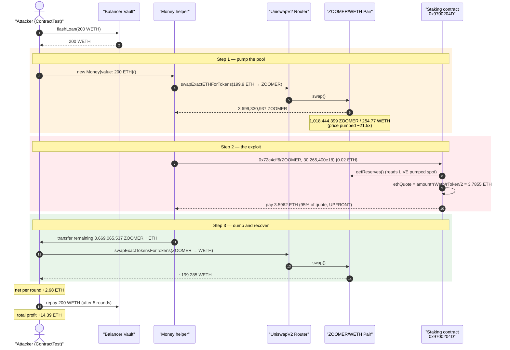
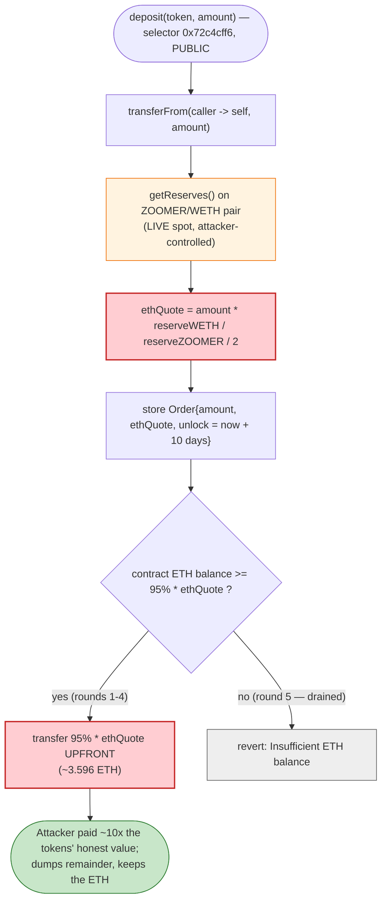
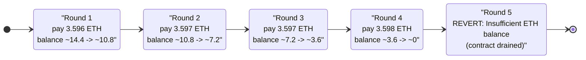

# ZoomerCoin Exploit — Spot-Priced Upfront Staking Reward Drained via AMM Price Manipulation

> **Vulnerability classes:** vuln/oracle/spot-price · vuln/oracle/price-manipulation

> **Reproduction:** the PoC compiles & runs in an isolated Foundry project at
> [this project folder](.) (the umbrella DeFiHackLabs repo contains many
> unrelated PoCs that do not compile together, so this one was extracted).
> Full verbose trace: [output.txt](output.txt).
> Verified ZOOMER token source: [ZoomerCoin.sol](sources/ZoomerCoin_0D505C/ZoomerCoin.sol).
> **Caveat:** the *vulnerable* contract here is the ZOOMER staking/deposit contract at
> `0x9700204D…`, whose verified source was **not** available for download — its logic below is
> reconstructed directly from the on-chain `-vvvvv` trace (storage writes, reserve reads, ETH
> payouts). The downloaded source is the ZOOMER ERC-20 token, which is *used* but not itself buggy.

---

## Key info

| | |
|---|---|
| **Loss** | **~14.39 ETH** — drained from the ZOOMER staking contract's ETH balance (4 successful claims × ~3.596 ETH) |
| **Vulnerable contract** | ZOOMER staking / deposit contract — [`0x9700204D77A67A18eA8F1B47275897b21e5eFA97`](https://etherscan.io/address/0x9700204D77A67A18eA8F1B47275897b21e5eFA97) (function selector `0x72c4cff6`) |
| **Token** | ZoomerCoin (ZOOMER) — [`0x0D505C03d30e65f6e9b4Ef88855a47a89e4b7676`](https://etherscan.io/address/0x0D505C03d30e65f6e9b4Ef88855a47a89e4b7676#code) |
| **Victim pool** | ZOOMER/WETH Uniswap V2 pair — [`0xC2C701110dE2b9503E98619d9c9e3017877b0f72`](https://etherscan.io/address/0xC2C701110dE2b9503E98619d9c9e3017877b0f72) |
| **Attacker EOA** | [`0xb0380b6d7a63e7cbf274c3b3c8838abbd6bd4abe`](https://etherscan.io/address/0xb0380b6d7a63e7cbf274c3b3c8838abbd6bd4abe) |
| **Attacker contract** | [`0xa4854022f4c16f0abc3fdec300427f6179a3043b`](https://etherscan.io/address/0xa4854022f4c16f0abc3fdec300427f6179a3043b) |
| **Attack tx** | [`0x06d7e7436414c658a33452d28400799f3637e83930dcec39b3bd065dabc6ef04`](https://app.blocksec.com/explorer/tx/eth/0x06d7e7436414c658a33452d28400799f3637e83930dcec39b3bd065dabc6ef04) |
| **Chain / block / date** | Ethereum mainnet / 19,291,249 / Feb 23, 2024 |
| **Compiler** | ZOOMER token: Solidity v0.8.19, optimizer off (PoC harness built with Solc 0.8.34) |
| **Bug class** | Spot-AMM-priced upfront reward (oracle manipulation) — under-collateralized instant payout |
| **Credit** | ChainAegis — https://x.com/ChainAegis/status/1761246415488225668 |

---

## TL;DR

The ZOOMER staking contract at `0x9700204D…` exposes a deposit function (selector `0x72c4cff6(address
token, uint256 amount)`) that, **at the moment of deposit, values the deposited ZOOMER using the
instantaneous Uniswap V2 spot reserves** and immediately pays the depositor an ETH "reward" worth
~95% of that valuation. The valuation it stores is exactly:

```
ethQuote = amount * reserveWETH / reserveZOOMER / 2
ethPaid  = ethQuote * 0.95
```

(Confirmed from the trace: the contract reads `getReserves()` right before pricing, then stores
`ethQuote = 3,785,511,883,118,999,207 wei` and pays out `3,596,236,288,963,049,246 wei` — exactly
`spot/2` and `quote × 0.95`.)

Because the price comes from the *live pool*, an attacker can pump it. The attack, repeated 5 times
inside a single Balancer WETH flash-loan, is:

1. **Pump** — buy ~3.699 **billion** ZOOMER for 199.9 ETH, raising the spot price ~21.5×.
2. **Deposit** — call `0x72c4cff6(ZOOMER, 30,265,400e18)`. The contract prices that slice at the
   *pumped* spot price (~3.785 ETH) and instantly pays back **~3.596 ETH**.
3. **Dump** — sell the remaining ~3.669 billion ZOOMER back into the pool, recovering ~199.285 ETH.
4. **Net ≈ +3 ETH per round** (the ~3.596 ETH reward minus the ~0.6 ETH AMM round-trip loss).

After four profitable rounds the contract's ETH balance is exhausted; the 5th deposit reverts with
**"Insufficient ETH balance"**. Total walked off with: **~14.39 ETH**.

---

## Background — the two contracts involved

### ZoomerCoin (ZOOMER) — the token

[`ZoomerCoin.sol`](sources/ZoomerCoin_0D505C/ZoomerCoin.sol) is an ordinary "meme" ERC-20 with a
Uniswap-V2 tax mechanism. At the fork block its sell tax is effectively 0 (`_buyCount` has long
since exceeded `_reduceSellTaxAt = 369`, and `_finalSellTax = 0`), so for this exploit ZOOMER behaves
as a plain, freely-tradeable token. The token itself is **not** the source of the bug — it is merely
the asset the attacker pumps and dumps. Total supply is `69,000,000,000` ZOOMER
([ZoomerCoin.sol:172](sources/ZoomerCoin_0D505C/ZoomerCoin.sol#L172)), which is why pool reserves are
measured in *billions* of tokens.

### The staking contract at `0x9700204D…` — the victim

This is a separate ZOOMER deposit/staking contract (verified source not published; behavior below is
read off the trace). Its deposit entry point is selector `0x72c4cff6`, which takes
`(address token, uint256 amount)`. On each call it:

1. `transferFrom(msg.sender, self, amount)` — pulls the deposited ZOOMER
   ([output.txt:1653](output.txt)).
2. Reads `factory.getPair(token, WETH)` → `pair.getReserves()` → `pair.token0()`
   ([output.txt:1661-1666](output.txt)) — i.e. it prices the token **from the live pool**.
3. Writes a deposit record to storage ([output.txt:1670-1676](output.txt)):
   `token`, `amount = 30,265,400e18`, `ethQuote = 3.7855 ETH`, `depositTs`, and an
   `unlockTs = depositTs + 10 days`.
4. Pays the depositor `ethQuote × 0.95 ≈ 3.596 ETH` **immediately**
   (`Money::fallback{value: 3596236288963049246}` at [output.txt:1667](output.txt)).

In other words it hands out an upfront ETH "reward"/advance, denominated at the current spot value of
the deposited tokens, *before* any lock-up matures — and it sources that spot value from a pool the
caller fully controls within the same transaction.

The on-chain state observed at the fork block:

| Quantity | Value |
|---|---|
| Pool ZOOMER reserve (`reserve0`) | 4,717,775,337 ZOOMER |
| Pool WETH reserve (`reserve1`) | 54.8684 WETH |
| Unmanipulated spot price | ~1.16e-8 WETH/ZOOMER |
| Spot value of 30,265,400 ZOOMER *before* pump | **~0.352 WETH** |
| Spot value of the same after the 21.5× pump | **~7.57 WETH** → quote = 7.57/2 = **3.785 ETH** |
| Staking contract ETH balance | enough for ~4 payouts (~14.4 ETH) before draining |

---

## The vulnerable code

The staking contract's source is not published, so the exact Solidity cannot be quoted. The trace,
however, pins the pricing formula to the wei. Reconstructed, the deposit handler does the equivalent
of:

```solidity
// selector 0x72c4cff6 — reconstructed from the trace, NOT verified source
function deposit(address token, uint256 amount) external payable {
    IERC20(token).transferFrom(msg.sender, address(this), amount);   // pull tokens

    address pair = IUniswapV2Factory(factory).getPair(token, WETH);
    (uint112 r0, uint112 r1, ) = IUniswapV2Pair(pair).getReserves();  // ⚠️ LIVE spot reserves
    address t0 = IUniswapV2Pair(pair).token0();
    (uint256 rToken, uint256 rWeth) = t0 == token ? (r0, r1) : (r1, r0);

    uint256 ethQuote = amount * rWeth / rToken / 2;                   // ⚠️ spot valuation, /2
    orders[id] = Order(token, amount, ethQuote, block.timestamp,
                       block.timestamp + 10 days);                    // 10-day lock recorded

    uint256 reward = ethQuote * 95 / 100;                             // ⚠️ 95% paid UPFRONT
    payable(msg.sender).transfer(reward);                            // ← reverts if balance too low
}
```

The three combined design flaws are flagged above. The token contract supplies the price surface that
makes them exploitable, but the token code itself is standard
([ZoomerCoin.sol:255-303](sources/ZoomerCoin_0D505C/ZoomerCoin.sol#L255-L303)).

---

## Root cause — why it was possible

A Uniswap V2 pair's `getReserves()` is the **current** balance ratio. It can be moved arbitrarily,
within a single transaction and for free (you get the tokens back when you sell), by anyone with
capital — or, as here, with a flash loan. Any contract that prices an asset off `getReserves()` and
then *pays out value based on that price in the same transaction* is trivially manipulable.

The staking contract violates that principle in the most direct way:

1. **Spot-price oracle.** The deposit valuation reads `pair.getReserves()` at call time. The caller
   can pump the price first (buy a huge amount of ZOOMER) so the contract over-values the slice it
   deposits. Observed manipulation: **21.5×** (price moved from `1.16e-8` to `2.50e-7` WETH/ZOOMER).
2. **Upfront, under-collateralized reward.** It pays ~95% of the (inflated) valuation **immediately**
   in ETH, despite recording a 10-day lock on the deposit. The depositor gets real ETH now in
   exchange for tokens whose *honest* value is a tiny fraction of the payout. The attacker never
   needs to wait for, or honour, the lock — they already have the ETH and can abandon the deposit.
3. **No anti-manipulation guard.** No TWAP, no min-liquidity / max-price-move check, no per-block
   limit, no comparison against an independent oracle. A 21.5× single-transaction price move is
   accepted at face value.
4. **Fixed deposit slice, looped.** The attacker deposits the same hardcoded `30,265,400e18` ZOOMER
   each round. The reward per round (~3.596 ETH) is fixed by the pumped price; the attack simply
   repeats until the contract's ETH runs out (round 5 reverts with *"Insufficient ETH balance"*,
   [output.txt:2165](output.txt)).

The economics per round (numbers from the trace):

| Item | ETH |
|---|---:|
| Buy 3.699 B ZOOMER (pump) | −199.900 |
| Reward from staking contract | +3.596 |
| Sell 3.669 B ZOOMER back (dump) | +199.285 |
| **Net per round** | **≈ +2.98** |

The slice deposited (30.26 M ZOOMER) is a rounding error against the 3.699 B bought, so cornering it
out of the pump position costs essentially nothing — the entire reward is profit minus the ~0.6 ETH
AMM round-trip fee.

---

## Preconditions

- The staking contract holds enough ETH to pay rewards (it held ~14.4 ETH → exactly 4 payouts).
- A ZOOMER/WETH Uniswap V2 pair exists and is the price source the contract queries (it is).
- ZOOMER is freely buyable/sellable with ~0 tax at the fork block (true — sell tax is 0).
- Working capital to pump the pool. Peak outlay per round is 199.9 ETH; it is fully recovered
  intra-transaction, so the whole thing is **flash-loanable**. The PoC borrows **200 WETH** from
  Balancer ([Zoomer_exp.sol:30-34](test/Zoomer_exp.sol#L30-L34)) and reuses it across all 5 rounds.

---

## Attack walkthrough (with on-chain numbers from the trace)

The pair's `token0 = ZOOMER`, `token1 = WETH`, so `reserve0 = ZOOMER`, `reserve1 = WETH`. Each of the
5 rounds spins up a fresh `Money` helper contract ([Zoomer_exp.sol:44-46](test/Zoomer_exp.sol#L44-L46))
funded with 200 ETH; the helper buys ZOOMER, deposits a slice to the staking contract, returns the
remainder, and the top-level contract dumps it.

| # | Round step | Pool ZOOMER | Pool WETH | Reward paid | Source |
|---|------------|------------:|----------:|------------:|--------|
| 0 | **Initial** (pre-attack reserves) | 4,717,775,337 | 54.8684 | — | [output.txt:1615](output.txt) |
| 1a | Round 1 — **buy** 3,699,330,937 ZOOMER for 199.9 WETH | 1,018,444,399 | 254.768 | — | Sync [output.txt:1639](output.txt) |
| 1b | Round 1 — **deposit** 30,265,400 ZOOMER → priced at pumped spot | 1,018,444,399 | 254.768 | **+3.5962** | [output.txt:1652-1667](output.txt) |
| 1c | Round 1 — **dump** 3,669,065,537 ZOOMER → 199.285 WETH | 4,687,509,937 | 55.4832 | — | Sync [output.txt:1727](output.txt) |
| 2 | Round 2 — buy / deposit / dump (Money @0x2e23…) | 1,020,780,857 → 4,657,244,537 | 255.383 → 56.106 | **+3.5967** | [output.txt:1776-1852](output.txt) |
| 3 | Round 3 — buy / deposit / dump (Money @0xF628…) | 1,023,082,535 → 4,626,979,137 | 256.006 → 56.738 | **+3.5973** | [output.txt:1900-1976](output.txt) |
| 4 | Round 4 — buy / deposit / dump (Money @0x5991…) | 1,025,348,653 → 4,596,713,737 | 256.638 → 57.379 | **+3.5982** | [output.txt:2024-2100](output.txt) |
| 5 | Round 5 — buy succeeds, **deposit REVERTS** *"Insufficient ETH balance"* (contract drained), dump anyway | 1,027,578,418 → 4,596,713,737 | 257.279 → 57.648 | **0** | [output.txt:2148-2165](output.txt) |

Each round nudges the *baseline* reserves slightly (the 30.26 M ZOOMER kept by the staking contract
never comes back to the pool, and AMM fees accrue), but the structure is identical: pump → skim a
fixed reward → dump.

### Why the reward is "free money"

After the pump, the pool holds `1,018,444,399 ZOOMER / 254.768 WETH`. The contract values the 30.26 M
ZOOMER slice at `30,265,400 × 254.768 / 1,018,444,399 = 7.571 WETH`, halves it to `ethQuote = 3.7855
ETH`, and pays 95% = **3.5962 ETH**. The honest (pre-pump) value of that same slice was **~0.352
WETH** — so the attacker is paid roughly **10× the tokens' real worth**, and the deposited tokens
themselves cost almost nothing because they are a sliver of the much larger pump position that is
fully sold back.

### Profit accounting (ETH)

| Direction | Amount |
|---|---:|
| Reward — round 1 | +3.5962 |
| Reward — round 2 | +3.5967 |
| Reward — round 3 | +3.5973 |
| Reward — round 4 | +3.5982 |
| Reward — round 5 | +0 (contract out of ETH) |
| **Total extracted from the staking contract** | **+14.388** |

The 200 WETH flash loan is repaid in full ([Zoomer_exp.sol:48](test/Zoomer_exp.sol#L48)); the AMM
round-trips net out to roughly zero (each ~199.9 buy is matched by a ~199.3 sell, the difference being
fees absorbed by the pool). The attacker's clean take is the **~14.39 ETH** of staking-contract ETH.

---

## Diagrams

### Sequence of one round (rounds 1–4 are identical; round 5 reverts at the deposit)



### Pricing flow inside the deposit handler



### Drain progression (staking contract ETH balance)



---

## Remediation

1. **Never price a payout off live spot reserves.** Replace `getReserves()` with a manipulation-
   resistant source: a Uniswap V2 TWAP (cumulative-price) accumulated over a meaningful window, a
   Chainlink feed, or an off-chain signed price. Spot reserves in the same transaction as the payout
   are not an oracle.
2. **Do not pay rewards upfront.** If the deposit is genuinely locked for 10 days, the reward (if any)
   must be claimable only *after* the lock matures and only against the token's value *at maturity* /
   over the lock period — not advanced in ETH at deposit time. An instant ETH advance against a
   future, manipulable valuation is a free option for the depositor.
3. **Bound single-transaction price moves.** Reject deposits when the spot price deviates from a
   trusted reference (TWAP/oracle) by more than a small tolerance, or when pool liquidity is below a
   floor. A 21.5× move in one transaction should be impossible to act on.
4. **Cap and rate-limit rewards.** Per-address and per-block limits on reward ETH, plus a global
   budget, would have bounded the loss to a single round instead of draining the contract.
5. **Require the depositor to bear price risk.** Settle the deposit in tokens (return the same tokens
   at unlock) rather than converting to an ETH claim at deposit-time spot — this removes the incentive
   to manipulate the price at the moment of deposit entirely.

---

## How to reproduce

The PoC was extracted into a standalone Foundry project (the umbrella DeFiHackLabs repo has many
unrelated PoCs that fail to compile under a single whole-project `forge build`):

```bash
_shared/run_poc.sh 2024-02-Zoomer_exp --mt testExploit -vvvvv
```

- RPC: an **Ethereum mainnet archive** endpoint is required (fork block 19,291,249, Feb 2024). Most
  free public RPCs prune state this old and fail with `header not found` / `missing trie node`; use an
  archive provider.
- Result: `[PASS] testExploit()`. The trace shows four `Money::fallback{value: ~3.596e18}` payouts
  from the staking contract and a final `← [Revert] Insufficient ETH balance` once it is drained.

Expected tail (from [output.txt](output.txt)):

```
    ├─ emit log_named_decimal_uint(key: "[Begin] Attacker ETH after exploit", val: 79228161529072816349105401162 [7.922e28], decimals: 18)
    └─ ← [Stop]

Suite result: ok. 1 passed; 0 failed; 0 skipped; finished in 25.13s
Ran 1 test suite: 1 tests passed, 0 failed, 0 skipped (1 total tests)
```

> Note: the `[Begin]`/`[Begin] after` logs print `address(this).balance`, a `vm.deal`-inflated number
> that does not reflect the WETH-denominated profit. The real take is the **~14.39 ETH** of ETH paid
> out by the staking contract across the four successful rounds (see the four
> `Money::fallback{value: ~3.596e18}` entries), consistent with the reported ~14 ETH loss.

---

*Reference: ChainAegis — https://x.com/ChainAegis/status/1761246415488225668 (ZOOMER staking, Ethereum, ~14 ETH).*
