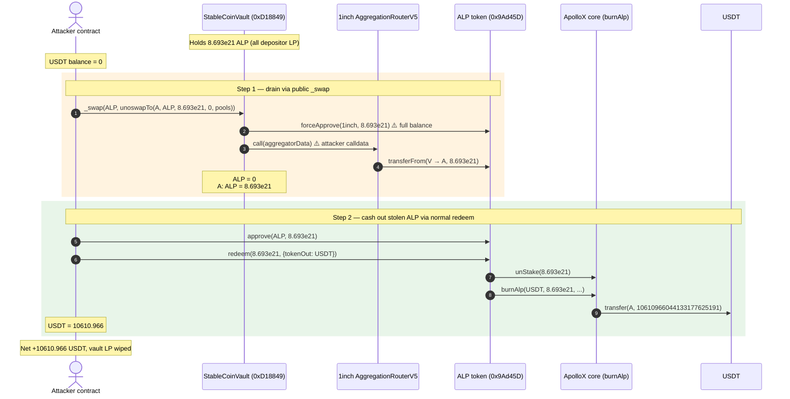
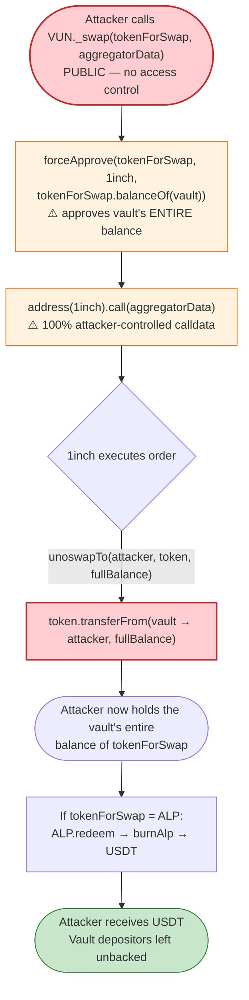
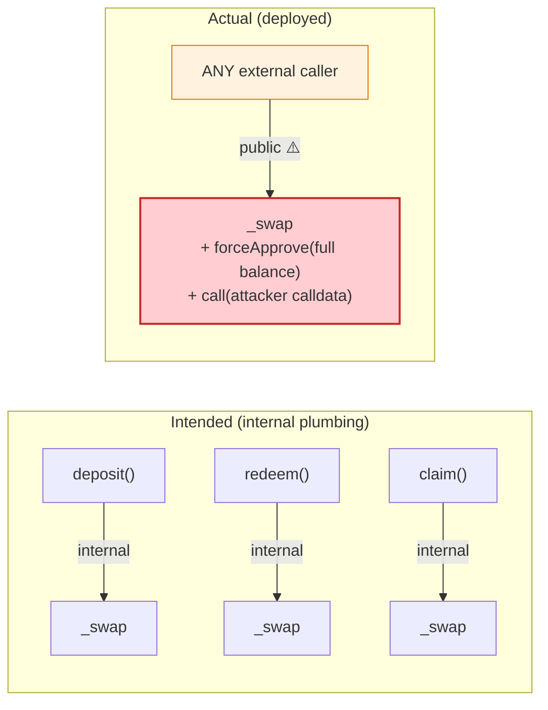

# ALP (ApolloX) Exploit — Public `_swap()` Drains the Portfolio Vault's LP Tokens

> **Vulnerability classes:** vuln/access-control/missing-auth

> **Reproduction:** the PoC compiles & runs in an isolated Foundry project at
> [this project folder](.). Full verbose trace: [output.txt](output.txt).
> Verified vulnerable source:
> [contracts_BasePortfolioV2.sol](sources/StableCoinVault_1eabb7/contracts_BasePortfolioV2.sol).
> ALP redeem path: [contracts_vaults_apolloX_ApolloXBscVault.sol](sources/ApolloXBscVault_50609e/contracts_vaults_apolloX_ApolloXBscVault.sol).

---

## Key info

| | |
|---|---|
| **Loss** | ~**$10,611 USDT** (10,610.966044 USDT) — the vault's full ALP position, cashed out at market |
| **Vulnerable contract** | `StableCoinVault` portfolio proxy (ERC1967) — [`0xD188492217F09D18f2B0ecE3F8948015981e961a`](https://bscscan.com/address/0xD188492217F09D18f2B0ecE3F8948015981e961a#code), impl `BasePortfolioV2` `0x1EaBb7B90fac3B4143c551a02B41e741f7457EfA` |
| **Stolen asset / victim** | `ALP` token — [`0x9Ad45D46e2A2ca19BBB5D5a50Df319225aD60e0d`](https://bscscan.com/address/0x9Ad45D46e2A2ca19BBB5D5a50Df319225aD60e0d) (the ApolloX LP receipt the vault custodying on behalf of depositors), redeemed → USDT |
| **Attacker EOA** | [`0xff61Ba33Ed51322BB716EAb4137Adf985644b94d`](https://bscscan.com/address/0xff61Ba33Ed51322BB716EAb4137Adf985644b94d) |
| **Attacker contract** | [`0x0edf13f6bd033f0f267d46c6e9dff9c7190e0fa0`](https://bscscan.com/address/0x0edf13f6bd033f0f267d46c6e9dff9c7190e0fa0) |
| **Attack tx** | [`0x9983ca8eaee9ee69629f74537eaf031272af75f1e5a7725911d8b06df17c67ca`](https://app.blocksec.com/explorer/tx/bsc/0x9983ca8eaee9ee69629f74537eaf031272af75f1e5a7725911d8b06df17c67ca) |
| **Chain / block / date** | BSC / **36,727,073** / **March 6, 2024** |
| **Compiler** | Impl `BasePortfolioV2`: Solidity **v0.8.20**, optimizer **1**, 200 runs (ApolloXBscVault); ERC1967 proxy v0.8.9 |
| **Bug class** | **Public, unguarded internal swap function** (`_swap` declared `public` with no access control) → arbitrary calldata replayed against the 1inch aggregator ⇒ theft of any token the vault holds |

---

## TL;DR

`StableCoinVault` is an ERC4626-style "portfolio" vault that holds LP positions (here ApolloX `ALP`).
Its internal helper `_swap(tokenForSwap, aggregatorData)` is the function the vault uses to route
deposits/redeems through a 1inch aggregator. It is supposed to be `internal`, but in the deployed
implementation it is declared **`public` with zero access control**
([contracts_BasePortfolioV2.sol:530-548](sources/StableCoinVault_1eabb7/contracts_BasePortfolioV2.sol#L530-L548)):

```solidity
function _swap(IERC20 tokenForSwap, bytes memory aggregatorData) public returns (uint256) {
    SafeERC20.forceApprove(tokenForSwap, oneInchAggregatorAddress, tokenForSwap.balanceOf(address(this)));
    (bool succ, bytes memory data) = address(oneInchAggregatorAddress).call(aggregatorData);
    require(succ, "Aggregator failed to swap ...");
    return abi.decode(data, (uint256));
}
```

That one `public` keyword is the whole vulnerability. `_swap` (a) **approves the 1inch router to spend
the vault's entire balance** of whatever token the caller names, then (b) **blindly `call`s the router
with caller-supplied calldata**. Because the attacker fully controls `aggregatorData`, they craft a
1inch `unoswapTo(recipient=attacker, srcToken=ALP, amount=vaultBalance, …)` order. The router, now
approved, pulls **all 8,693,190.99 ALP** the vault was custodying and hands it to the attacker.

The attacker then calls `ALP.redeem(stolenAmount, …)` normally. ApolloX's `burnAlp` converts the
stolen ALP into **10,610.966 USDT** and transfers it out. The vault's depositors are left with
unbacked share tokens; the attacker walks away with ~$10.6K of genuine LP value.

The header comment in the original PoC states the bug class plainly: **`REASON : public internal call`**
([test/ALP_exp.sol:12](test/ALP_exp.sol#L12)).

---

## Background — what the vault does

`BasePortfolioV2` ([source](sources/StableCoinVault_1eabb7/contracts_BasePortfolioV2.sol)) is an
upgradeable ERC20 share vault (`UUPSUpgradeable`) that:

- Accepts user deposits in some input token, optionally **swaps** the input to a diversification token
  via a 1inch-style aggregator (`_getToken` → `_swap`, [:384-400](sources/StableCoinVault_1eabb7/contracts_BasePortfolioV2.sol#L384-L400)),
  then zaps the proceeds into one or more sub-vaults (`_diversify`, [:402-434](sources/StableCoinVault_1eabb7/contracts_BasePortfolioV2.sol#L402-L434)).
- On redeem, pulls shares out of each sub-vault and, if the user asked for a different output token,
  **swaps** the redeemed asset through the same aggregator
  (`_returnRedeemInDesiredTokenToUser` → `_swap`, [:449-466](sources/StableCoinVault_1eabb7/contracts_BasePortfolioV2.sol#L449-L466)).
- In this instance the single sub-vault is ApolloX. So the portfolio custodying **ALP**
  (`0x9Ad45D46…`), the ApolloX LP receipt token, on behalf of all its share holders.

The shared swap primitive used by **both** deposit and redeem is `_swap`. It is *meant* to be an
internal plumbing function — it is named with a leading underscore and is only ever called from
`_getToken` / `_returnRedeemInDesiredTokenToUser` / `_returnRewardsInPreferredToken`. The only thing
that went wrong is its visibility.

State at the fork block (read from the trace, [output.txt:1609-1612](output.txt#L1609-L1612)):

| Quantity | Value |
|---|---|
| `ALP` held by the vault (`0xD18849…`) | **8,693,190,985,141,166,818,414** ≈ **8.693e21** ALP (≈ 8.693e21 units; all of the vault's LP) |
| `oneInchAggregatorAddress` | `0x1111111254EEB25477B68fb85Ed929f73A960582` (1inch v5 `AggregationRouterV5`) |
| Attacker USDT before | 0 |
| Attacker USDT after | **10,610.966044133177625191** ([output.txt:1570](output.txt#L1570)) |

---

## The vulnerable code

### 1. The unguarded, public `_swap`

[contracts_BasePortfolioV2.sol:530-548](sources/StableCoinVault_1eabb7/contracts_BasePortfolioV2.sol#L530-L548):

```solidity
function _swap(
    IERC20 tokenForSwap,
    bytes memory aggregatorData
) public returns (uint256) {                      // ⚠️ PUBLIC — no onlyOwner / onlySelf / onlyRole
    SafeERC20.forceApprove(
        tokenForSwap,
        oneInchAggregatorAddress,
        tokenForSwap.balanceOf(address(this))      // ⚠️ approves the vault's ENTIRE balance of tokenForSwap
    );
    // slither-disable-next-line low-level-calls
    (bool succ, bytes memory data) = address(oneInchAggregatorAddress).call(
        aggregatorData                             // ⚠️ 100% attacker-controlled calldata
    );
    require(succ, "Aggregator failed to swap, ...");
    return abi.decode(data, (uint256));
}
```

Three independent defects compound here:

1. **Visibility.** `public` instead of `internal`. Compare the genuinely-internal helpers around it
   (`_getToken`, `_diversify`, `_returnRedeemInDesiredTokenToUser`, all `internal`). Only `_swap` leaks
   to the external interface.
2. **Blanket approval.** It approves the *current full balance* of `tokenForSwap` — not a bounded
   `amount` passed in by a trusted caller. Any caller therefore gets to spend up to the vault's whole
   holdings of any token.
3. **Blind `call`.** The calldata is forwarded verbatim. Nothing checks that it is actually a swap in
   the vault's interest; the router faithfully executes whatever the attacker packed, including a
   `transferFrom(vault, attacker, fullBalance)`-shaped order.

### 2. How the attacker's calldata is shaped

The PoC builds a 1inch v5 `unoswapTo` order
([test/ALP_exp.sol:53-64](test/ALP_exp.sol#L53-L64)):

```solidity
uint256 VUN_balance = ALP_APO.balanceOf(address(VUN));   // 8.693e21 — the vault's entire ALP
uint256[] memory pools = new uint256[](1);
pools[0] = uint256(1_457_847_883_966_391_224_294_152_661_087_436_089_985_854_139_374_837_306_518);
//                   ^^^^^^^^^^^^^^^^^^^^^^^^^^^^^^^^^^^^^^^^^^^^^^^^^^^^^^^^^^^^^^^^^^^^^^^^^^^^^
//                   a pool descriptor whose low 160 bits = the attacker's own address (0x7FA938…1496
//                   in the PoC, the live attacker contract 0x0edf…0fa0 on-chain)
VUN._swap(
    address(ALP_APO),
    abi.encodeWithSignature(
        "unoswapTo(address,address,uint256,uint256,uint256[])",
        address(this),        // recipient = ATTACKER
        address(ALP_APO),     // srcToken  = ALP
        VUN_balance,          // amount    = vault's entire ALP
        0,                    // minReturn = 0
        pools                 // pool descriptor routing the pull back to the attacker
    )
);
```

Decoded in the trace at [output.txt:1613-1614](output.txt#L1613-L1614), the calldata selector is
`0xf78dc253` (`unoswapTo(address,address,uint256,uint256,uint256[])`), the recipient slot is the
attacker contract, and the amount slot is `0x0000000000000000000000000000000000000000000001d74242867c6f54446e`
= **8,693,190,985,141,166,818,414** — exactly the vault's ALP balance read two lines earlier.

The `forceApprove(ALP, 1inch, fullBalance)` inside `_swap` then authorizes 1inch to take it, and the
`unoswapTo` order performs `ALP.transferFrom(vault, attacker, fullBalance)`
([output.txt:1627-1636](output.txt#L1627-L1636) — the `transferFrom` from `0xD18849…` (vault) to the
attacker, value `8.693e21`). The vault's ALP is gone, credited to the attacker.

### 3. The cash-out: `ALP.redeem` → USDT

With the stolen ALP in hand, the attacker calls ApolloX's normal redeem. The ALP token
(`0x9Ad45D…`, an ERC1967 proxy to `ApolloXBscVault` `0x50609e…`) `redeem` invokes
`_redeemFrom3rdPartyProtocol`
([contracts_vaults_apolloX_ApolloXBscVault.sol:162-192](sources/ApolloXBscVault_50609e/contracts_vaults_apolloX_ApolloXBscVault.sol#L162-L192)):

```solidity
function _redeemFrom3rdPartyProtocol(uint256 shares, RedeemData calldata redeemData)
    internal override returns (uint256, address, address, bytes calldata) {
    apolloX.unStake(shares);                                  // unstake ALP at the ApolloX core
    SafeERC20.forceApprove(ALP, address(apolloX), shares);
    ...
    apolloX.burnAlp(                                          // burn ALP → receive USDT
        redeemData.apolloXRedeemData.alpTokenOut,             // = USDT
        shares,
        redeemData.apolloXRedeemData.minOut,
        address(this)
    );
    ...
    SafeERC20.safeTransfer(IERC20(...alpTokenOut), msg.sender, redeemAmount);  // USDT → attacker
    ...
}
```

In the trace this is `unStake` ([output.txt:1658](output.txt#L1658)) → `burnAlp`
([output.txt:1691](output.txt#L1691)) which emits
`BurnAlp(..., shares=8.693e21, usdtOut=10610966044133177625191)`
([output.txt:2645](output.txt#L2645)) and finally `USDT.transfer(attacker, 10610966044133177625191)`
([output.txt:2639-2644](output.txt#L2639-L2644)). The attacker ends with
**10,610.966044133177625191 USDT** ([output.txt:1570](output.txt#L1570)).

---

## Root cause — why it was possible

> A single visibility keyword turned a trusted internal helper into a public arbitrary-call primitive
> that simultaneously (a) approved the vault's entire token balance to 1inch and (b) executed
> attacker-chosen calldata against 1inch.

The four design decisions that compose into a critical bug:

1. **`_swap` is `public` instead of `internal`.** It is named and used as an internal helper, but its
   visibility makes it an externally callable entry point with no `onlyOwner` / `onlySelf` / `onlyRole`
   guard. The contract *does* have a `onlySelf` modifier
   ([contracts_diamond_security_OnlySelf.sol:7-8](sources/VaultFacet_6228fa/contracts_diamond_security_OnlySelf.sol#L7-L8))
   used elsewhere in the ApolloX diamond — it was simply never applied here.
2. **The approval is unbounded.** `forceApprove(token, aggregator, token.balanceOf(address(this)))`
   approves the caller-chosen token's *whole* balance, so the leak is not limited to "one deposit's
   worth" — it is everything the vault holds of that token.
3. **The calldata is forwarded verbatim.** A `low-level call` with attacker-controlled bytes means the
   vault will perform *any* action the 1inch router can perform on its behalf, including a plain
   `transferFrom` to the attacker. There is no sanity check that the call is a swap, that the recipient
   is the vault, or that the out-token matches what a deposit/redeem would expect.
4. **No reentrancy / state check ties the swap to a legitimate operation.** `deposit` and `redeem` are
   `nonReentrant`, but `_swap` is neither guarded nor scoped to them, so a standalone call sidesteps
   all of the vault's accounting.

The PoC confirms the primitive is fully general: `tokenForSwap` and `aggregatorData` are both free
parameters, so the attacker could have drained *any* token the vault held, not just ALP — ALP was
simply the most valuable holding.

---

## Preconditions

- The vault holds a positive balance of some valuable token (here ALP; true by construction for a
  portfolio vault with depositors).
- `_swap` is externally reachable (the deployed `public` visibility bug). No timing, no role, no
  deposit, no upfront capital — the attack is **permissionless and self-funding**.
- A working 1inch router (`AggregationRouterV5` at `0x1111111254…`) and ApolloX `burnAlp` oracle path
  to convert ALP → USDT in the same transaction.

---

## Attack walkthrough (with on-chain numbers from the trace)

All figures are read directly from [output.txt](output.txt).

| # | Step | Vault ALP | Attacker ALP | Attacker USDT | Evidence |
|---|------|----------:|------------:|--------------:|----------|
| 0 | **Initial** | 8,693,190.99 ALP (8.693e21) | 0 | 0 | [output.txt:1609-1612](output.txt#L1609-L1612), [output.txt:1608](output.txt#L1608) |
| 1 | **`VUN._swap(ALP, unoswapTo(attacker, ALP, 8.693e21, 0, pools))`** — inside, `forceApprove(ALP, 1inch, 8.693e21)`, then 1inch `transferFrom(vault→attacker, 8.693e21)` | **0** | **8,693,190.99** | 0 | Approval [output.txt:1619-1624](output.txt#L1619-L1624); `Transfer(vault→attacker, 8.693e21)` [output.txt:1627-1635](output.txt#L1627-L1635) |
| 2 | **`ALP.approve(ALP, 8.693e21)`** (so `redeem` can burn the stolen ALP) | 0 | 8,693,190.99 | 0 | [output.txt:1648-1654](output.txt#L1648-L1654) |
| 3 | **`ALP.redeem(8.693e21, {tokenOut:USDT})`** → `unStake` (ApolloX core releases the staked ALP) → `burnAlp(USDT, 8.693e21, …)` burns ALP and mints/transfers USDT | 0 | 0 (burned) | **10,610.966044** | `unStake` [output.txt:1658-1681](output.txt#L1658-L1681); `burnAlp` + `BurnAlp(…, 8.693e21, 10610966044133177625191)` [output.txt:1691](output.txt#L1691), [output.txt:2645](output.txt#L2645); `USDT.transfer(attacker, 10610966044133177625191)` [output.txt:2639-2644](output.txt#L2639-L2644) |
| 4 | **Final** | 0 | 0 | **10,610.966044** | [output.txt:2662-2663](output.txt#L2662-L2663) |

The vault's ALP went from **8.693e21 → 0** in a single `transferFrom`, and the attacker's USDT went
from **0 → 10,610.966** with zero capital in and zero capital returned — a pure extraction.

### Profit / loss accounting (USDT)

| Direction | Amount (USDT) |
|---|---:|
| Capital deployed by attacker | 0 |
| USDT received from `ALP.redeem` | +10,610.966044 |
| Gas / fees (not modeled in PoC) | negligible vs. profit |
| **Net profit** | **+10,610.966044** |

Victim loss = the vault's entire ALP position, marked to market at the ApolloX redemption price =
**10,610.966 USDT ≈ $10.6K** (matching the PoC header comment "Profit : 10K USD",
[test/ALP_exp.sol:11](test/ALP_exp.sol#L11)). Vault share tokens are now unbacked.

---

## Diagrams

### Sequence of the attack



### State / control-flow of the vulnerability



### Why `public` matters: intended vs. actual call graph



---

## Why each magic number

- **`8,693,190,985,141,166,818,414` ALP (8.693e21):** read live from `ALP.balanceOf(vault)` in the PoC
  ([test/ALP_exp.sol:51](test/ALP_exp.sol#L51)) — it is simply *whatever the vault happened to hold*.
  The bug lets the attacker steal the full balance, so the amount is whatever depositors had collectively
  zapped in. No sizing math is needed.
- **`pools[0] = 1_457_847_883_966_391_224_294_152_661_087_436_089_985_854_139_374_837_306_518`:** a
  1inch `unoswap` pool descriptor. Its low-order 160 bits are an address used as the swap counterparty
  / recipient hook — in the PoC that decodes to the `ContractTest` address
  (`0x7FA9385bE102ac3EAc297483Dd6233D62b3e1496`); on-chain, to the attacker contract `0x0edf…0fa0`.
  The comment in the PoC — *"translate into hex, contain your address"* ([test/ALP_exp.sol:53](test/ALP_exp.sol#L53))
  — confirms this is how the attacker bakes itself in as the funds destination.
- **`10,610.966044133177625191` USDT:** the output of ApolloX `burnAlp` at the block's oracle prices
  (BTC ≈ $67,281, BNB ≈ $414 — see Chainlink reads at [output.txt:1699-1718](output.txt#L1699-L1718)).
  The attacker did not choose this number; it is the fair market value ApolloX itself assigned to the
  stolen ALP.

---

## Remediation

1. **Make `_swap` `internal`.** This is the one-line fix that closes the hole. The function is named
   and used as an internal helper; restoring `internal` removes the external entry point entirely.
   ```diff
   -  function _swap(IERC20 tokenForSwap, bytes memory aggregatorData) public returns (uint256) {
   +  function _swap(IERC20 tokenForSwap, bytes memory aggregatorData) internal returns (uint256) {
   ```
2. **Add defense-in-depth even on the internal version.** Bound the approval to a caller-supplied
   `amount` rather than `tokenForSwap.balanceOf(address(this))`, and validate / hash-whitelist the
   `aggregatorData` selector (e.g., only permit known swap selectors, never raw `transfer*`).
3. **Apply `onlySelf` / `onlyOwner` to any swap-like function that must stay external.** The codebase
   already ships an `onlySelf` modifier
   ([contracts_diamond_security_OnlySelf.sol:7-8](sources/VaultFacet_6228fa/contracts_diamond_security_OnlySelf.sol#L7-L8));
   use it.
4. **Never forward untrusted calldata to a privileged spender.** The combination "approve full balance
   to X" + "call X with user bytes" is an arbitrary-spend primitive regardless of X. Any such pattern
   must either (a) take the calldata from a trusted source only, or (b) cap the approval to the exact
   amount a legitimate deposit/redeem computed.
5. **Add an invariant / fuzz test** asserting that no external call to a non-`deposit`/`redeem`/`claim`
   entrypoint can change the vault's token balances except for incoming user deposits. A property like
   "balance(vault, token) is non-decreasing across any single external call that is not deposit/redeem"
   would have caught this in CI.

---

## How to reproduce

The PoC was extracted into a standalone Foundry project (the umbrella DeFiHackLabs repo has unrelated
PoCs that fail to compile under a whole-project `forge test`):

```bash
_shared/run_poc.sh 2024-03-ALP_exp --mt testExploit -vvvvv
```

- RPC: a **BSC archive** endpoint is required (fork block 36,727,073 is from March 2024).
  `foundry.toml` uses `https://bsc-mainnet.public.blastapi.io`; most pruned public RPCs will reject the
  historical state with `header not found` / `missing trie node`.
- The PoC's `ContractTest` implements stub `swap()` / `getReserves()` so that the 1inch `unoswapTo`
  callback into the "pool" (the attacker itself) no-ops and the `transferFrom` stands — this faithfully
  reproduces the on-chain fund movement without needing a live AMM pool for the dust ALP.
- Result: `[PASS] testExploit()`.

Expected tail:

```
Ran 1 test for test/ALP_exp.sol:ContractTest
[PASS] testExploit() (gas: 2190725)
Logs:
  [End] Attacker USDT before exploit: 0.000000000000000000
  [End] Attacker USDT balance after exploit: 10610.966044133177625191

Suite result: ok. 1 passed; 0 failed; 0 skipped; finished in 154.19s (152.59s CPU time)

Ran 1 test suite in 172.14s (154.19s CPU time): 1 tests passed, 0 failed, 0 skipped (1 total tests)
```
([output.txt:1566-1568](output.txt#L1566-L1568), [output.txt:2666-2668](output.txt#L2666-L2668))

---

*Reference: DeFiHackLabs — ALP / ApolloX portfolio vault, BSC, March 6 2024, ~$10K. Header comment in
[test/ALP_exp.sol:12](test/ALP_exp.sol#L12): `REASON : public internal call`.*
