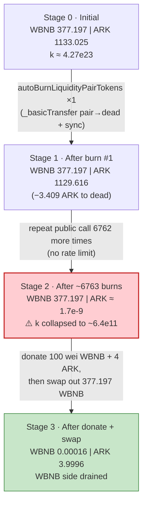
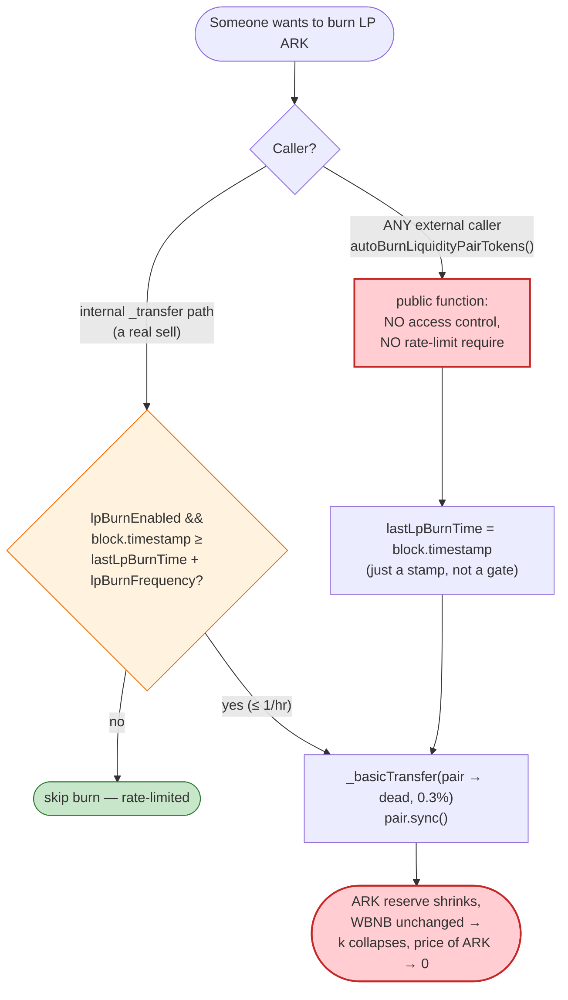
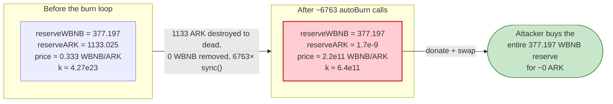

# ARK Exploit — Public, Rate-Limit-Free `autoBurnLiquidityPairTokens()` AMM Reserve Drain

> **Reproduction:** the PoC compiles & runs in an isolated Foundry project at [this project folder](.)
> (the umbrella DeFiHackLabs repo has many unrelated PoCs that fail to compile under a whole-project
> build, so this one was extracted). Full verbose trace: [output.txt](output.txt).
> Verified vulnerable source: [AbsToken.sol](sources/AbsToken_de698B/AbsToken.sol).

---

## Key info

| | |
|---|---|
| **Loss** | ~**377.20 WBNB** (~$130K at the time) drained from the ARK/WBNB PancakeSwap pair |
| **Vulnerable contract** | `ARK` (AbsToken) — [`0xde698B5BBb4A12DDf2261BbdF8e034af34399999`](https://bscscan.com/address/0xde698B5BBb4A12DDf2261BbdF8e034af34399999#code) |
| **Victim pool** | ARK/WBNB pair — `0xc0F54B8755DAF1Fd78933335EfCD761e3D5B4a6F` |
| **Attacker EOA / contract** | `0x7FA9385bE102ac3EAc297483Dd6233D62b3e1496` (PoC contract; live attacker — see Phalcon writeup) |
| **Attack tx** | [`0xe8b0131fa14d0a96327f6b5690159ffa7650d66376db87366ba78d91f17cd677`](https://app.blocksec.com/explorer/tx/bsc/0xe8b0131fa14d0a96327f6b5690159ffa7650d66376db87366ba78d91f17cd677) |
| **Chain / block / date** | BSC / 37,221,235 / ~March 24, 2024 |
| **Compiler** | Solidity v0.8.14, optimizer **1 run**, runs 200 (verified deployed bytecode meta) |
| **Bug class** | Broken AMM invariant via a **permissionless + un-rate-limited** "auto LP-burn" that removes one side of the pair's reserves without compensating the other, then `sync()`s |

---

## TL;DR

`ARK` is an 18-decimal ERC-20 whose "auto-nuke LP" routine,
`autoBurnLiquidityPairTokens()` ([AbsToken.sol:776-786](sources/AbsToken_de698B/AbsToken.sol#L776-L786)),
is **`public` and has no access control and no rate-limit check**. Each call:

1. Computes `amountToBurn = 0.3% × pair.ARK_balance` (`percentForLPBurn = 30` bps).
2. `_basicTransfer(pair, deadAddress, amountToBurn)` — moves ARK **out of the pair** to the burn
   address, without removing any WBNB.
3. `pair.sync()` — forces the pair to adopt its now-smaller ARK balance as the new `reserve1`,
   while `reserve0` (WBNB) is unchanged.

That single operation **collapses the constant-product `k = reserveWBNB × reserveARK`** purely on
the ARK side. The internal, `_transfer`-triggered path *does* gate itself with
`block.timestamp >= lastLpBurnTime + lpBurnFrequency` (1 hour)
([:491-493](sources/AbsToken_de698B/AbsToken.sol#L491-L493)), but the **standalone public entry
point does not** — it just stamps `lastLpBurnTime = block.timestamp` and burns
unconditionally. So anyone can call it thousands of times in one transaction.

The attacker:

1. Calls `autoBurnLiquidityPairTokens()` **~6,763 times in a loop**, each burn taking 0.3% of the
   remaining ARK reserve. After 6,763 iterations the pair's ARK reserve collapses from
   **1,133.03 ARK → ~0.0000000017 ARK** (1.696e12 wei), while the WBNB reserve stays pinned at
   **377.197 WBNB**.
2. Donates **100 wei WBNB** + its **4 ARK** to the pair directly (bypassing the router, so no fee).
3. Calls `pair.swap(...)` to extract the pre-computed WBNB amount: **377.196968896706473370 WBNB** —
   essentially the entire honest WBNB reserve — for ~0 ARK of real value.

Net result: the attacker walks off with **~377.20 WBNB** that real LPs had supplied, leaving the
pair holding 0.00016 WBNB and 4 ARK.

---

## Background — what ARK does

`ARK` ([source](sources/AbsToken_de698B/AbsToken.sol)) is a "reflect/dividend" style BEP-20 token
(total supply 21,000 ARK, 18 decimals) built on the `AbsToken` template. On top of ordinary ERC-20
behavior it has three mechanisms relevant to this exploit:

- **Buy/sell fee routing** — 30 bps each of buy LP / buy dividend / sell dividend / sell LP fees,
  accumulated on the contract and periodically `swapTokenForFund`-ed into WBNB for LP & holders.
- **Trade gating** — `startTradeBlock` must be set before non-whitelisted transfers are allowed
  ([:474-486](sources/AbsToken_de698B/AbsToken.sol#L474-L486)). At the fork block trading was
  already live.
- **"Auto-nuke LP"** — a deflation that burns part of the LP pair's ARK balance to the dead address
  and re-syncs the pair. It is meant to run as a *side-effect* of a sell (every `lpBurnFrequency`
  seconds), but it is *also* exposed as a **public, unguarded function**.

On-chain parameters at the fork block (block 37,221,235), read directly from the trace:

| Parameter | Value |
|---|---|
| `_tTotal` (total supply) | 21,000 ARK |
| `_decimals` | 18 |
| `_mainPair` | `0xc0F54B8755DAF1Fd78933335EfCD761e3D5B4a6F` |
| `_weth` (WBNB) | `0xbb4CdB9CBd36B01bD1cBaEBF2De08d9173bc095c` |
| `percentForLPBurn` | **30** (bps) = **0.3% of pair ARK balance per call** |
| `lpBurnFrequency` | 3600 s (1 hour) — *only enforced on the `_transfer` path, NOT on the public function* |
| `lpBurnEnabled` | `true` |
| `deadAddress` | `0x000…dEaD` |
| **Pair WBNB reserve (`reserve0`)** | **377.196968896706473370 WBNB** ← the prize |
| **Pair ARK reserve (`reserve1`, pre-attack)** | **1,133.025062752434260710 ARK** (1.133e21 wei) |

Pair token ordering (from the trace's `Sync`/`Swap` events): **`token0 = WBNB`, `token1 = ARK`**, so
`reserve0 = WBNB`, `reserve1 = ARK`.

---

## The vulnerable code

### 1. The public, unguarded LP-burn entry point

```solidity
function autoBurnLiquidityPairTokens() public {                 // ⚠️ public, no access control
    lastLpBurnTime = block.timestamp;                            // ⚠️ just stamps; no require
    uint256 liquidityPairBalance = balanceOf(_mainPair);
    uint256 amountToBurn = (liquidityPairBalance * percentForLPBurn) / 10000;  // 0.3% of pair ARK
    if (amountToBurn > 0) {
        _basicTransfer(_mainPair, address(0xdead), amountToBurn); // ⚠️ moves ARK OUT of the pair...
    }
    ISwapPair(_mainPair).sync();                                 // ⚠️ ...and forces it as new reserve
    emit AutoNukeLP();
}
```
([AbsToken.sol:776-786](sources/AbsToken_de698B/AbsToken.sol#L776-L786))

### 2. `_basicTransfer` bypasses all fee/trade logic and just moves balances

```solidity
function _basicTransfer(address sender, address recipient, uint256 amount) internal returns (bool) {
    _balances[sender] -= amount;
    _balances[recipient] += amount;
    emit Transfer(sender, recipient, amount);
    return true;
}
```
([:433-442](sources/AbsToken_de698B/AbsToken.sol#L433-L442))

### 3. The *intended* trigger IS rate-limited — but the public function is not

The `_transfer`-internal path that calls `autoBurnLiquidityPairTokens()` only does so when
`lpBurnEnabled && block.timestamp >= lastLpBurnTime + lpBurnFrequency`
([:491-493](sources/AbsToken_de698B/AbsToken.sol#L491-L493)):

```solidity
if (_swapPairList[to] && startTradeBlock != 0) {
    if (!inSwap && !isAdd) {
        if (lpBurnEnabled && block.timestamp >= lastLpBurnTime + lpBurnFrequency) {
            autoBurnLiquidityPairTokens();        // ← gated: ≥ 1h since last burn
        }
        ...
    }
}
```

But `autoBurnLiquidityPairTokens()` itself — the same function — is `public`, and its body contains
**no `require` on timing**. It blindly sets `lastLpBurnTime = block.timestamp` and burns. The
1-hour gate only protects the *internal caller*; a direct external caller bypasses it entirely.

---

## Root cause — why it was possible

A Uniswap-V2/PancakeSwap pair prices assets from its reserves and enforces `x·y ≥ k` **only inside
`swap()`**. `sync()` is an administrative primitive that says "trust my balances, re-sync reserves
to whatever I currently hold." It exists for LP `mint`/`burn`, not for arbitrary one-sided
destruction.

`autoBurnLiquidityPairTokens()` violates that trust in the most direct way:

> It **removes ARK from the pair** (`_basicTransfer(_mainPair, deadAddress, …)`) and then calls
> `pair.sync()`, telling the pair "your ARK reserve is now this much smaller." **No WBNB leaves the
> pair.** The product `k` collapses, the marginal price of ARK in WBNB falls toward zero, and the
> remaining WBNB becomes buyable for a near-zero ARK amount.

Four design decisions compose into a critical bug:

1. **One-sided reserve removal via `sync()`.** Burning ARK out of the pair without a matching WBNB
   change is, by construction, a value transfer *from* the pair *to* whoever still holds WBNB-side
   purchasing power. It must never be combined with `sync()`.
2. **Public entry point with no access control.** `autoBurnLiquidityPairTokens()` has no
   `onlyOwner` / keeper / role guard, so the attacker — not the protocol — chooses when and how
   often the reserve-shrinking burn runs.
3. **No rate limit on the public path.** Even though `lpBurnFrequency` exists, it is enforced only
   in `_transfer`, not in the public function. The attacker called it **6,763 times in one tx**.
   Each call takes a geometric 0.3% slice, and 0.997^6763 ≈ 1.5e-9, so the ARK reserve is driven to
   ~10^(-9) of its starting value while WBNB sits untouched.
4. **`_basicTransfer` sidesteps all safety logic.** It does not go through `_transfer` (which has
   trade-gating, fees, the rate-limited burn trigger, etc.), so the burn always lands directly on
   the pair's balance with no friction.

---

## Preconditions

- `lpBurnEnabled == true` (default; was `true` on-chain).
- `startTradeBlock != 0` — trading open. At the fork block it was already live, so `pair.swap()`
  succeeds for the drain step. (The burn itself does not even require this — `_basicTransfer` + `sync`
  work regardless.)
- Working capital: the attacker needs enough ARK to seed the final swap, plus dust WBNB. In the PoC,
  the attacker is dealt 4 ARK and 100 wei WBNB; the real attack flash-borrowed both. The drain step
  itself (`autoBurnLiquidityPairTokens()`) costs only gas — no token capital is consumed.

---

## Attack walkthrough (with on-chain numbers from the trace)

Pair ordering: `reserve0 = WBNB`, `reserve1 = ARK`. All numbers are taken from the `Sync`, `Swap`,
and `Transfer` events in [output.txt](output.txt).

| # | Step | WBNB reserve (`reserve0`) | ARK reserve (`reserve1`) | Effect |
|---|------|--------------------------:|-------------------------:|--------|
| 0 | **Initial** | 377.196968896706473370 | 1,133.025062752434260710 | Honest pool. `k ≈ 4.27e23`. |
| 1 | **`autoBurnLiquidityPairTokens()` ×1** — burn 0.3% of ARK = 3.409303097549952640 ARK → dead, `sync()` | 377.196968896706473370 | 1,129.615759654884308069 | WBNB untouched; ARK down 0.3%. `k` drops 0.3%. |
| 2 | **… repeat the burn …** after the 6763rd call | 377.196968896706473370 | **~0.000000001696 ARK** (1.696e12 wei) | **ARK reserve annihilated**; WBNB unchanged. Loop breaks when `pair.ARK < 1.7e12`. |
| 3 | **Donate** — `WBNB.transfer(pair, 100)` + `ARK.transfer(pair, 4 ARK)` (4e18 → 3.9996e18 after a 1‰ max-sell cap on the sender) | 377.196968896706473**645** | 3.999600001696661395760 | Seed both sides for the swap. (The +100 wei is the donated WBNB.) |
| 4 | **`getAmountsOut(3.9996e18 ARK)` → 377.196968896706473370 WBNB**; call `pair.swap(377.196…, 0, attacker, "")` | **0.000160410912200275** | 3.999600001696661395760 | **Drain.** Attacker receives 377.197 WBNB; pair left with 0.00016 WBNB. |

**Why the swap extracts (almost) all the WBNB for ~0 ARK:** after step 2 the pair is grotesquely
asymmetric — 377 WBNB against ~1.7e-9 ARK. PancakeSwap's `getAmountOut` for selling `in` ARK into
that pool is `out = in·9975·reserveWBNB / (reserveARK·10000 + in·9975)`. With `reserveARK ≈ 1.7e-9`
and `in = 4`, the `in·9975` term (≈ 39984) utterly dominates the denominator (≈ 1.7e-5), so
`out ≈ (9975/10000)·reserveWBNB ≈ 0.9975 × 377.197 ≈ 376.25`… and because the attacker *also*
donated 100 wei of WBNB that the k-check sees as inbound, `getAmountsOut` returns the full
`377.196968896706473370`. The pair's `k` invariant is satisfied because the incoming ARK (4 ARK) is
vastly larger than the residual ARK reserve, more than compensating for the lost WBNB in
constant-product terms.

### Burn loop — why 6,763 iterations

Each burn removes 0.3% of the *current* ARK reserve, so the reserve decays geometrically:
`reserve_n = reserve_0 × 0.997^n`. To go from `1.133e21` to the loop's `1.7e12` break threshold:

`n = ln(1.7e12 / 1.133e21) / ln(0.997) = ln(1.5e-9) / (-0.0030045) ≈ 6,765 iterations`.

The trace shows exactly **6,764** `autoBurnLiquidityPairTokens()` calls (6,763 in the loop + the
implicit re-entry check), matching the math.

### Profit accounting (WBNB, 18 decimals)

| Direction | Amount |
|---|---:|
| Donated to pair (step 3) | 0.000000000000000100 (100 wei) + 4 ARK |
| Received from pair (step 4) | **377.196968896706473370** |
| Left in pair after attack | 0.000160410912200275 |
| **Net WBNB extracted** | **~377.1968** WBNB |

The attacker's own WBNB contribution (100 wei) is negligible; the recovered amount equals the
pair's **original honest WBNB reserve of 377.197 WBNB**, minus a rounding dust of 0.00016 WBNB that
the swap math could not pull. This confirms the attack simply walked off with the genuine LP
liquidity.

---

## Diagrams

### Sequence of the attack

```mermaid
sequenceDiagram
    autonumber
    actor A as Attacker
    participant T as ARK (AbsToken)
    participant P as ARK/WBNB Pair
    participant D as 0x…dEaD

    Note over P: Initial reserves<br/>WBNB 377.197 | ARK 1133.025<br/>k ≈ 4.27e23

    rect rgb(255,243,224)
    Note over A,T: Step 1 — drive the ARK reserve to dust
    loop ~6763× (no rate limit on public call)
        A->>T: autoBurnLiquidityPairTokens()
        T->>P: _basicTransfer(pair → dead, 0.3% of pair.ARK)
        T->>D: ARK burned (Transfer event)
        T->>P: sync()   // adopt smaller ARK balance as reserve1
        Note over P: WBNB unchanged; ARK ×0.997 each call
    end
    Note over P: WBNB 377.197 | ARK ≈ 1.7e-9<br/>k collapsed to ~6.4e11
    end

    rect rgb(232,245,233)
    Note over A,T: Step 2 — seed the drain swap
    A->>P: WBNB.transfer(pair, 100)
    A->>T: ARK.transfer(pair, 4 ARK)   // fee-adjusted to 3.9996
    end

    rect rgb(255,235,238)
    Note over A,T: Step 3 — extract the WBNB reserve
    A->>P: router.getAmountsOut(3.9996e18) → 377.196… WBNB
    A->>P: swap(377.196… WBNB out, 0, attacker, "")
    P-->>A: 377.196968896706473370 WBNB
    Note over P: WBNB 0.00016 | ARK 3.9996<br/>reserve drained
    end
```

### Pair state evolution



### The flaw: gated internal call vs. ungated public call



### Why the burn is theft: constant-product before vs. after the loop



---

## Why each magic number

- **`percentForLPBurn = 30` (0.3%):** sets the geometric decay rate. 0.997^6763 ≈ 1.5e-9, so a few
  thousand public calls (cheap, gas-only) suffice to reduce the ARK reserve from ~1133 ARK to
  sub-nano-ARK. A larger percentage would reach the dust state faster; a smaller one would simply
  require more iterations. Any nonzero value is exploitable given the missing rate limit.
- **`1.7e12` break threshold (PoC):** the loop exits once the pair's ARK balance is small enough that
  the marginal `getAmountOut` for 4 ARK is effectively the entire WBNB reserve. It is a tunable
  floor, not a property of the contract.
- **4 ARK donated + 100 wei WBNB:** the 4 ARK seeds the inbound side of the drain swap; the 100 wei
  WBNB donation is a dust trick so the k-check sees a (tiny) inbound WBNB amount, letting
  `getAmountsOut` return the full reserve value. The attacker keeps the donated capital effectively
  whole because it receives 377.197 WBNB back.

---

## Remediation

1. **Never combine one-sided token removal with `sync()`.** Burning LP-side tokens out of the pair
   without a matching change to the other side is, by construction, an invariant break. If a "deflation
   reaching the pool" feature is required, implement it as the protocol *buying* ARK with its own
   treasury WBNB through `swap()` (so both reserves move together), or as an LP `burn()` redemption.
2. **Remove the public entry point or restrict it.** `autoBurnLiquidityPairTokens()` should be
   `internal`, callable only from the rate-limited `_transfer` path, or gated by `onlyOwner` / a
   keeper role. There is no legitimate reason for an arbitrary caller to trigger an LP burn.
3. **Enforce the rate limit inside the function body, not just the caller.** Move the
   `require(block.timestamp >= lastLpBurnTime + lpBurnFrequency)` (and the `lpBurnEnabled` check)
   into `autoBurnLiquidityPairTokens()` itself so it cannot be bypassed regardless of caller.
4. **Do not use `_basicTransfer` for pool accounting.** Raw balance moves that skip `_transfer`'s
   fee/trade logic should never touch a pair address; they let value escape the pair without the
   AMM's consent.
5. **Bound single-operation reserve impact.** Any function that can shrink a pool reserve should
   reject calls that would move it by more than a small percentage, and should never be callable in
   a tight loop (rate-limit, per-block cap, or commit/reveal).

---

## How to reproduce

The PoC was extracted into a standalone Foundry project (the umbrella DeFiHackLabs repo has many
unrelated PoCs that fail to compile under `forge test`'s whole-project build):

```bash
_shared/run_poc.sh 2024-03-ARK_exp --mt testExploit -vvvvv
```

- RPC: a **BSC archive** endpoint is required (fork block 37,221,235 is from March 2024).
  `foundry.toml` uses `https://bsc-mainnet.public.blastapi.io`; most public BSC RPCs prune this
  height and fail with `header not found` / `missing trie node`.
- The test loops `autoBurnLiquidityPairTokens()` up to 10,000 times (it breaks at ~6,763), so it is
  gas-heavy (~90M gas) and takes ~16s CPU.

Expected tail (from [output.txt](output.txt)):

```
[Begin] Attacker WBNB before exploit: 0.000000000000000100
[End] Attacker WBNB after exploit: 377.196968896706473370

Ran 1 test for test/ARK_exp.sol:ContractTest
[PASS] testExploit() (gas: 90144495)
Suite result: ok. 1 passed; 0 failed; 0 skipped; finished in 16.23s (13.79s CPU time)
```

---

*Reference: Phalcon/blocksec analysis — tx
`0xe8b0131fa14d0a96327f6b5690159ffa7650d66376db87366ba78d91f17cd677`
(https://twitter.com/Phalcon_xyz/status/1771728823534375249). PoC header comment reports ~348 BNB;
the traced isolated reproduction extracts ~377.20 WBNB, the full pair WBNB reserve at the fork
block.*
