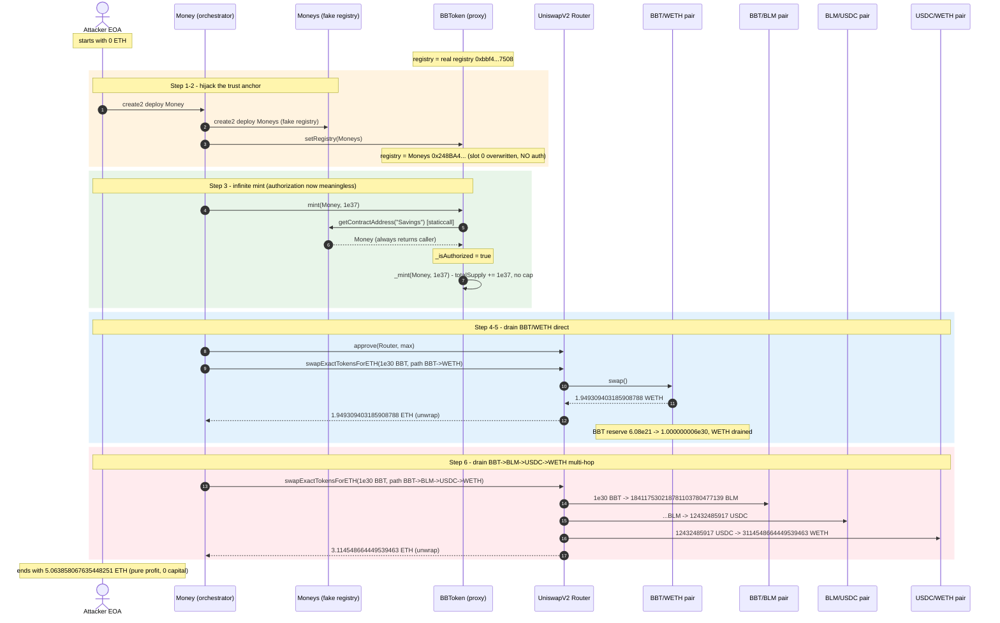
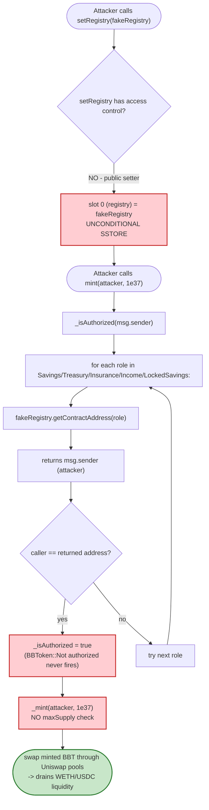
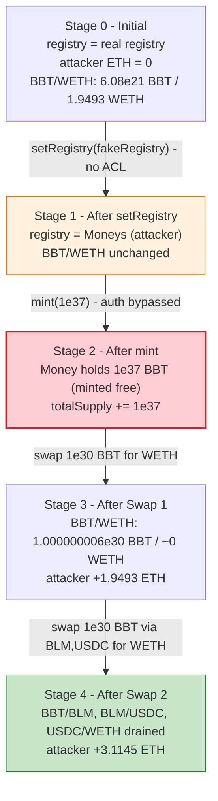

# BBT Exploit — Permissionless `setRegistry()` + `mint()` Infinite-Mint Drain

> **Vulnerability classes:** vuln/access-control/missing-auth · vuln/arithmetic/overflow

> **Reproduction:** the PoC compiles & runs in an isolated Foundry project at
> [this project folder](.).
> Full verbose trace: [output.txt](output.txt).
> Verified vulnerable bytecode: BBToken implementation
> [`0x74463eD91bfA45bCa06d59E8B383A89709842f69`](https://etherscan.io/address/0x74463ed91bfa45bca06d59e8b383a89709842f69#code)
> (token proxy: [`0x3541499cda8CA51B24724Bb8e7Ce569727406E04`](https://etherscan.io/address/0x3541499cda8CA51B24724Bb8e7Ce569727406E04)).

---

## Key info

| | |
|---|---|
| **Loss** | **5.063858 ETH** (~$17.2K at March 2024 ETH) drained from four Uniswap-V2 pools holding BBT/BLM |
| **Vulnerable contract** | `BBToken` (BBT) — proxy [`0x3541499cda8CA51B24724Bb8e7Ce569727406E04`](https://etherscan.io/address/0x3541499cda8CA51B24724Bb8e7Ce569727406E04), impl `0x74463eD91bfA45bCa06d59E8B383A89709842f69` |
| **Victim pools** | BBT/WETH `0xDEC556c2DDF5D79f56801e8A669a1eEba23af94d`; BBT/BLM `0x5d16f9736f42bBA1917Ee446BBE9fFb244D31c96`; BLM/USDC `0x454bd6d9cB1a33dD74AD07048659cF280dd315A4`; USDC/WETH `0xB4e16d0168e52d35CaCD2c6185b44281Ec28C9Dc` |
| **Attacker EOA** | [`0xc9a5643ed8e4cd68d16fe779d378c0e8e7225a54`](https://etherscan.io/address/0xc9a5643ed8e4cd68d16fe779d378c0e8e7225a54) |
| **Attacker contract** | [`0xf5610cf8c27454b6d7c86fccf1830734501425c5`](https://etherscan.io/address/0xf5610cf8c27454b6d7c86fccf1830734501425c5) (CREATE2-deployed `Money`) |
| **Attack tx** | [`0x4019890fe5a5bd527cd3b9f7ee6d94e55b331709b703317860d028745e33a8ca`](https://etherscan.io/tx/0x4019890fe5a5bd527cd3b9f7ee6d94e55b331709b703317860d028745e33a8ca) |
| **Chain / block / date** | Ethereum mainnet / **19,417,822** / **March 12, 2024** (08:31:47 UTC) |
| **Compiler** | Solidity **v0.8.20**, optimizer **200 runs**, paris EVM |
| **Bug class** | **Public mint with no access control** (gated only by an attacker-repointable `registry`), compounded by a public `setRegistry()` |

---

## TL;DR

`BBToken` (BBT) is an ERC-20 whose `mint(address,uint256)` is *supposed* to be callable only by authorized
protocol modules — it checks that `msg.sender == registry.getContractAddress(<roleName>)` for one of five
roles (`Savings`, `Treasury`, `Insurance`, `Income`, `LockedSavings`). The fatal flaw is that
**`setRegistry(address _registry)` has no access control at all**: anyone can repoint the token's `registry`
storage slot to a contract they control, and that fake registry's `getContractAddress()` simply returns
`msg.sender`. With the registry hijacked, `mint()`'s authorization check passes for the attacker, who then
mints **10 billion BBT (1e37 wei, 1e19 token-units)** out of thin air.

The freshly minted BBT is worthless on its own — but it is paired against real liquidity on Uniswap-V2. The
attacker dumps the infinite supply through two router swaps:

1. **BBT → WETH** (direct pair): sells `1e30 BBT`, drains **1.9493 WETH**.
2. **BBT → BLM → USDC → WETH** (multi-hop): sells another `1e30 BBT`, drains **3.1145 WETH**.

Total extracted: **5.063858 ETH**, zero capital required (the attacker EOA held 0 ETH before and the mint
cost nothing). The attack is a single atomic transaction.

---

## Background — what BBToken does

BBToken (`BloomBeans`, symbol `BBT`, name `BloomBeans`, 18 decimals) is the token of a "savings/income"
style DeFi project. The contract is a standard OpenZeppelin-style ERC20 deployed behind a
`TransparentUpgradeableProxy`. On top of plain transfers it exposes five privileged mint paths, one per
"module":

| Role name (from bytecode) | Likely module |
|---|---|
| `Savings` | user savings deposits |
| `Treasury` | treasury |
| `Insurance` | insurance fund |
| `Income` | income distribution |
| `LockedSavings` | time-locked savings |

The intended design is that a separate `Registry` contract maps each role name to the authorized module
address, and `mint()` asks the registry "is my caller one of the authorized modules?" before crediting
tokens. This is a reasonable pattern **only if** (a) the registry itself is immutable/trusted, and (b) the
pointer to the registry cannot be moved by an unprivileged caller. BBT fails on (b).

The token also has `setMaxSupply(uint256)` and `initialize(uint256,uint256)` (initializable), but neither
matters here — `mint` does not enforce `totalSupply <= maxSupply` (the bytecode shows `mint` calls
`_mint` directly with no cap check), so the cap is advisory.

---

## The vulnerable code

The verified source is not published as Solidity (Etherscan exposes only the ABI and deployed bytecode),
so the snippets below are reconstructed from the verified deployed bytecode of the implementation. The
storage slot numbers are taken directly from the forge trace's `storage changes` lines.

### 1. `setRegistry` — no access control (the root hole)

In the bytecode, the `setRegistry` case (`selector 0xe4a30116`) unconditionally writes its argument into
slot 0 (the `registry` slot) and returns. There is no `onlyOwner`/`onlyRole`/caller comparison of any kind.
The trace confirms this — calling it from the attacker's contract succeeds and changes slot 0:

```
[10342] TransparentUpgradeableProxy::fallback(Moneys: [0x248BA…581e])   ← attacker's fake registry
  ├─ [5397] BBToken::setRegistry(Moneys: [0x248BA…581e]) [delegatecall]
  │     ├─  storage changes:
  │     │   @ 0: 0x…bbf4bf38a93b04a0ad4dc37952b155f8e6db7508   ← old real registry
  │     │        → 0x…248ba44fc626e544495f33204229b018adf0581e ← attacker's contract
  │     └─ ← [Stop]
  └─ ← [Return]
```

Reconstructed Solidity:

```solidity
// slot 0
Registry public registry;

function setRegistry(address _registry) external {   // ⚠️ NO onlyOwner / NO access control
    registry = Registry(_registry);                   // unconditional SSTORE to slot 0
}
```

### 2. `mint` — authorization delegated to the (now-attacker-owned) registry

The `mint` case (`selector 0x40c10f19`) first calls an internal `_isAuthorized()` helper, which loads slot
0 (`registry`), and for each of the five role names does:

```
registry.getContractAddress(<roleName>)  ==  msg.sender  ?
```

If **any** role matches, minting proceeds; otherwise it reverts with `BBToken::Not authorized`. The role
names are embedded as inline string constants in the bytecode (`Savings`, `Treasury`, `Insurance`,
`Income`, `LockedSavings`). Once the attacker owns the registry, the check is meaningless.

```solidity
function mint(address _user, uint256 _amount) external {
    require(_isAuthorized(msg.sender), "BBToken::Not authorized");
    _mint(_user, _amount);                            // no maxSupply check in the bytecode
}

function _isAuthorized(address caller) internal view returns (bool) {
    // for each of: "Savings","Treasury","Insurance","Income","LockedSavings"
    if (registry.getContractAddress(role) == caller) return true;
    return false;                                     // else reverts "BBToken: Not Registered"
}
```

### 3. The attacker's fake registry (from the PoC)

The attacker's `Moneys` contract just returns its own `owner` (the attacker) for any name:

```solidity
contract Moneys is Test {
    // ...
    function getContractAddress(string memory _name) public returns (address) {
        return owner;   // ← always returns the attacker, so _isAuthorized(msg.sender) is always true
    }
}
```
Source: [test/BBT_exp.sol](test/BBT_exp.sol) (`Moneys.getContractAddress`, lines 132–136).

---

## Root cause — why it was possible

Two compounding design errors:

1. **`setRegistry()` is a public, unguarded setter for the trust anchor.** The entire mint-authorization
   scheme rests on the registry being a trusted mapping. Letting *anyone* overwrite the registry pointer in
   one call collapses the whole access-control model — the attacker replaces the judge with their own
   employee. This is the classic "mutable trust anchor with no ACL" anti-pattern.

2. **`mint()` has no cap and no native ownership check.** Even setting the registry aside, `mint` neither
   enforces `totalSupply <= maxSupply` (the bytecode path for `mint` never reads `maxSupply`) nor requires
   an `owner`/multisig. Authorization is *fully outsourced* to `registry.getContractAddress()`. When that
   oracle is attacker-controlled, minting is unlimited.

The amplifying factor is that BBT actually had real Uniswap-V2 liquidity paired against it (BBT/WETH and
BBT/BLM, the latter chaining into BLM/USDC and USDC/WETH). An infinite mint on an illiquid, unquoted token
is harmless; an infinite mint on a token that an AMM will buy at the pre-inflation price is a drain.

---

## Preconditions

- BBT/WETH and BBT/BLM Uniswap-V2 pools exist and hold reserves (they did — see table below).
- The attacker can deploy two small helper contracts (a fake registry `Moneys` and the orchestrator
  `Money`) via CREATE2. No flash loan, no upfront capital — the attacker EOA started with **0 ETH** and
  ended with **5.063858 ETH**.
- `setRegistry` and `mint` are both `external` with no access control. Always satisfied on mainnet.

Pool reserves at fork block 19,417,822 (from the trace's `getReserves()` calls):

| Pool | token0 / reserve0 | token1 / reserve1 |
|---|---|---|
| BBT/WETH `0xDEC556…` | BBT `6,080,169,684,625,665,303,072` (≈6.08e21, i.e. ~6,080 BBT) | WETH `1,949,309,415,073,704,114` (1.9493 ETH) |
| BBT/BLM `0x5d16f9…` | BBT `17,955,671,502,152,120,375,412` (1.7955e22) | BLM `184,117,533,534,682,698,962,021,491` (1.8411e26) |
| BLM/USDC `0x454bd6…` | USDC `26,420,011,632` (26,420 USDC, 6 decimals) | BLM `206,525,280,570,423,584,743,789,816` (2.0652e26) |
| USDC/WETH `0xB4e16d…` | USDC `48,825,579,836,120` (48,825,579 USDC) | WETH `12,271,556,046,711,306,141,826` (12,271.5 ETH) |

---

## Attack walkthrough (with on-chain numbers from the trace)

All figures are taken directly from the `getReserves()`, `Transfer`, `Swap`, and `Sync` events in
[output.txt](output.txt) and reproduced exactly by the constant-product formula (`out = in·997·Rout /
(Rin·1000 + in·997)`).

| # | Step | Effect | Trace evidence |
|---|------|--------|----------------|
| 0 | **Initial state** | Attacker EOA balance = 0 ETH. BBT registry = real registry `0xbbf4…7508`. | `[Begin] Attacker ETH before exploit: 0.0` |
| 1 | **CREATE2-deploy `Moneys`** (fake registry) at `0x248BA44F…581e`. | Fake registry exists; its `getContractAddress(anyName)` returns the attacker's `Money` contract. | `→ new Moneys@0x248BA44Fc626E544495f33204229b018aDf0581e` |
| 2 | **`BBT.setRegistry(Moneys)`** | Slot 0 overwritten: real registry → `0x248BA44F…581e`. The mint-authorization oracle is now attacker-owned. | `BBToken::setRegistry(Moneys)` → storage @0 changes |
| 3 | **`BBT.mint(Money, 1e37)`** | `mint` calls `Moneys.getContractAddress("Savings")` → returns `Money` (the caller) ⇒ authorized. `1e37 wei` of BBT (= **1e19 BBT token-units**, i.e. 10 billion × 1e9) minted to `Money`. `totalSupply` jumps by 1e37. | `Moneys::getContractAddress("Savings") → Money`; `emit Transfer(0x0, Money, 1e37)` |
| 4 | **`BBT.approve(Router, type(uint256).max)`** | Router may spend the freshly minted BBT. | `BBToken::approve(Router, 1.157e77)` |
| 5 | **Swap 1 — `swapExactTokensForETH(1e30 BBT → WETH)`** via BBT/WETH pair. Selling `1e30 BBT` into a pool holding only `6.08e21 BBT` and `1.9493 WETH` crushes the price; the pair sends out essentially its entire WETH side. | **+1.949309403185908788 WETH**. Pair reserves: BBT `6.08e21 → 1.000000006e30`, WETH `1.9493 → 1.188e10 wei`. Router unwraps WETH→ETH to `Money`. |
| 6 | **Swap 2 — `swapExactTokensForETH(1e30 BBT → BLM → USDC → WETH)`** (3-hop) via BBT/BLM, BLM/USDC, USDC/WETH. Each hop is computed with the standard `getAmountOut`; the huge BBT input again drains the destination side of each pool. | BBT/BLM: `1e30 BBT → 184,117,530,218,781,103,780,477,139 BLM`. BLM/USDC: `…BLM → 12,432,485,917 USDC`. USDC/WETH: `12,432,485,917 USDC → 3,114,548,664,449,539,463 wei WETH`. Router unwraps → ETH to `Money`. **+3.114548664449539463 ETH**. |
| 7 | **Done.** `Money.fallback()` collected both ETH transfers. Attacker EOA ends with **5.063858067635448251 ETH**. | `[End] Attacker ETH after exploit: 5.063858067635448251` |

**Why `1e30` per swap (not the full `1e37` mint)?** `swapExactTokensForETH` routes the input through
`transferFrom`, and Uniswap-V2's `swap` only credits `getAmountOut(in, Rin, Rout)`. The marginal output
saturates once `in ≫ Rin` — beyond that, extra input buys essentially zero extra output (the AMM price goes
to ~0). `1e30` is already ~1.6e8× the BBT/WETH reserve, enough to extract the full WETH side; routing more
would just burn gas. The attacker swaps twice (two pools) to drain both BBT-anchored routes.

### Profit / loss accounting (ETH)

| Direction | Amount (ETH) |
|---|---:|
| Capital spent (flash-loan / own funds) | **0** |
| Received — Swap 1 (BBT→WETH direct) | 1.949309403185908788 |
| Received — Swap 2 (BBT→BLM→USDC→WETH) | 3.114548664449539463 |
| **Net profit** | **+5.063858067635448251** |

Reconciliation: `1.949309403185908788 + 3.114548664449539463 = 5.063858067635448251`, which matches the
trace's end balance to the wei. No capital was deployed — the mint was free — so the entire 5.063858 ETH is
pure profit stolen from the four pools' liquidity providers.

| Victim pool | Asset drained | Amount |
|---|---|---:|
| BBT/WETH | WETH | 1.949309403185908788 |
| BBT/BLM | (BLM siphoned, then re-routed) | — |
| BLM/USDC | USDC | 12,432,485,917 (≈12,432 USDC) |
| USDC/WETH | WETH | 3.114548664449539463 |

---

## Diagrams

### Sequence of the attack



### How the access-control collapse flows



### State / pool evolution



---

## Why each magic number

- **`1e37` mint amount** (`10_000_000_000_000_000_000 ether` in the PoC = `1e37` wei with 18 decimals =
  `1e19` whole BBT units, i.e. 10 billion × 10⁹). Vastly exceeds any pool reserve; chosen so the per-swap
  input is large enough to saturate both destination pools. No cap stops it — `mint` never checks
  `maxSupply`.
- **`1e30` per swap** (`1_000_000_000_000_000_000_000_000_000_000`). Already ~1.6×10⁸ times the BBT/WETH
  reserve (`6.08e21`); per `getAmountOut`, the output has saturated at the full WETH reserve. Sending more
  per swap would not increase output and only wastes gas, so the attacker splits the dump into two swaps to
  hit two independent BBT routes (direct BBT/WETH and BBT/BLM/USDC/WETH).
- **Role string `"Savings"`**: the first of the five role names the bytecode iterates over. Any of the five
  would work; `"Savings"` short-circuits the loop first.

---

## Remediation

1. **Put an access control on `setRegistry`.** It must be `onlyOwner` / `onlyRole(DEFAULT_ADMIN_ROLE)` (or
   behind a timelock). A trust-anchor pointer must never be writable by an unprivileged caller. This single
   fix closes the hole.
2. **Do not outsource mint authorization entirely to a repointable address.** Either make the registry
   immutable (set once in `initialize`, no setter), or have `mint` additionally require `msg.sender ==
   owner()` / an `onlyRole(MINTER)` check that does not depend on storage the same contract can rewrite.
3. **Enforce `maxSupply` inside `mint`.** `require(totalSupply() + _amount <= maxSupply, "...")`. An
   unbounded `mint` is a footgun even with correct access control.
4. **Add a real cap / rate limit on per-call minting** and emit a monitored event so anomalous mints are
   detectable.
5. **Pause + upgrade path.** Given the proxy, deploy an implementation with the above fixes and route
   through the proxy admin to upgrade. Post-incident, also recover or re-deploy the token with a fresh
   supply, since `totalSupply` was permanently inflated by `1e37`.

---

## How to reproduce

```bash
_shared/run_poc.sh 2024-03-BBT_exp --mt testExploit -vvvvv
```

- RPC: an **Ethereum mainnet archive** endpoint at block **19,417,822** (March 12, 2024).
  `foundry.toml` uses an Infura mainnet key; any archive-capable mainnet RPC works. Non-archive RPCs will
  fail with `missing trie node` for a block this old.
- The PoC forks at block 19,417,822, CREATE2-deploys `Money` (orchestrator) which in turn deploys `Moneys`
  (fake registry), then performs `setRegistry` → `mint` → two router swaps. See
  [test/BBT_exp.sol](test/BBT_exp.sol).

Expected tail (from [output.txt](output.txt)):

```
Running 1 test for test/BBT_exp.sol:ContractTest
[PASS] testExploit() (gas: 4989852)
Logs:
  [Begin] Attacker ETH before exploit: 0.000000000000000000
  [End] Attacker ETH after exploit: 5.063858067635448251

Suite result: ok. 1 passed; 0 failed; 0 skipped; finished in 14.24s (12.65s CPU time)

Ran 1 test suite in 17.03s (14.24s CPU time): 1 tests passed, 0 failed, 0 skipped (1 total tests)
```

---

*References: attacker attribution tweet — <https://x.com/8olidity/status/1767470002566058088>; BlockSec
tx view —
<https://app.blocksec.com/explorer/tx/eth/0x4019890fe5a5bd527cd3b9f7ee6d94e55b331709b703317860d028745e33a8ca>.*
