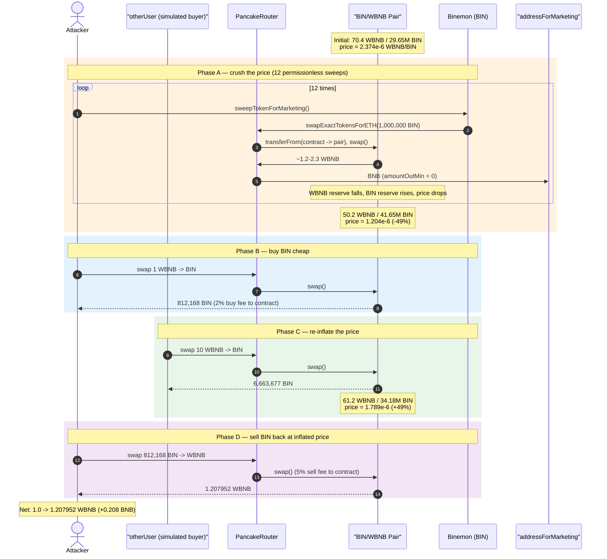
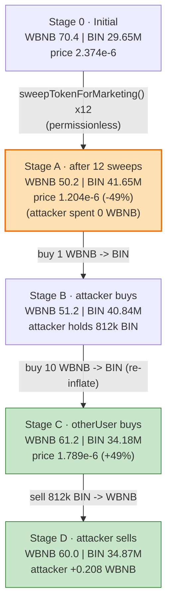
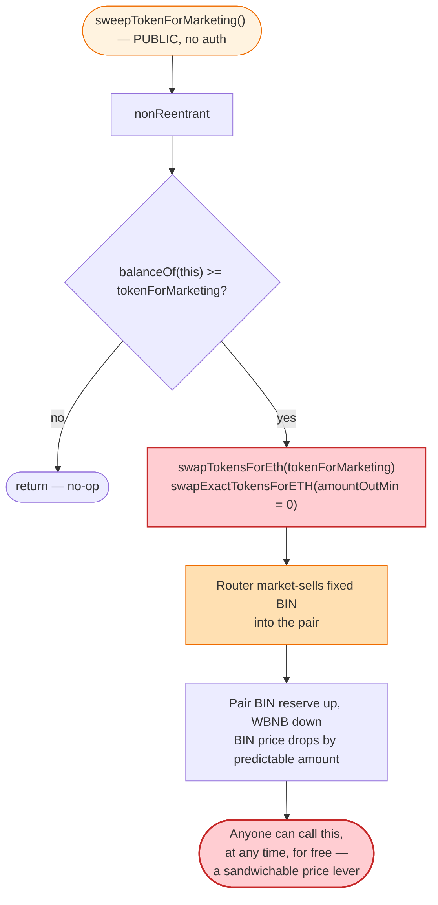
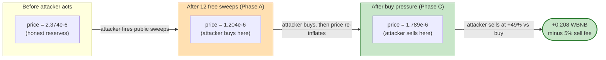

# Binemon (BIN) Exploit — Permissionless `sweepTokenForMarketing()` Price-Manipulation Arbitrage

> **Vulnerability classes:** vuln/access-control/missing-auth · vuln/defi/sandwich-attack

> **Reproduction:** the PoC compiles & runs in an isolated Foundry project at
> [this project folder](.) (the umbrella DeFiHackLabs repo
> bundles many unrelated PoCs that fail a whole-project build, so this one was extracted).
> Full verbose trace: [output.txt](output.txt).
> Verified vulnerable source: [sources/Binemon_e56842/Binemon.sol](sources/Binemon_e56842/Binemon.sol).

---

## Key info

| | |
|---|---|
| **Loss** | ~**0.2 BNB** (PoC-reproduced: +0.207952 WBNB). Real on-chain value extracted is small; the vector is a public price-manipulation primitive, not a one-shot drain. |
| **Vulnerable contract** | `Binemon` (BIN token) — [`0xe56842Ed550Ff2794F010738554db45E60730371`](https://bscscan.com/address/0xe56842Ed550Ff2794F010738554db45E60730371#code) |
| **Victim pool** | BIN/WBNB PancakeSwap pair — `0xe432afB7283A08Be24E9038C30CA6336A7cC8218` |
| **Attacker EOA** | [`0x835b45d38cbdccf99e609436ff38e31ac05bc502`](https://bscscan.com/address/0x835b45d38cbdccf99e609436ff38e31ac05bc502) |
| **Attacker contract** | [`0x132e1ea5db918dae00eef685b845c409a83dfa82`](https://bscscan.com/address/0x132e1ea5db918dae00eef685b845c409a83dfa82) |
| **Attack tx** | [`0x1999bb5c11a8d8bfa7620fc5cc37f5bc59c1a99d7a9250a8d6076c93bbdbeb5f`](https://app.blocksec.com/explorer/tx/bsc/0x1999bb5c11a8d8bfa7620fc5cc37f5bc59c1a99d7a9250a8d6076c93bbdbeb5f) |
| **Chain / block / date** | BSC / 36,864,395 / March 11, 2024 |
| **Compiler** | Solidity **v0.7.6** (`v0.7.6+commit.7338295f`), optimizer **on**, 200 runs |
| **Bug class** | Permissionless token-rebalance swap (`sweepTokenForMarketing`) without price-impact / timing control → sandwichable market-sell of contract-held tokens |

---

## TL;DR

`Binemon` is a fee-on-transfer token that accrues a sell-fee pile of BIN inside its own contract
(`_transfer` sends the 5% sell fee to `address(this)`,
[Binemon.sol:1197-1208](sources/Binemon_e56842/Binemon.sol#L1197-L1208)). The function
[`sweepTokenForMarketing()`](sources/Binemon_e56842/Binemon.sol#L1214-L1219) is **public and unguarded** —
anyone can call it, and when the contract's BIN balance is at least `tokenForMarketing` it performs a
fixed-size market sell of `tokenForMarketing` worth of BIN into the BIN/WBNB pair via
`swapExactTokensForETHSupportingFeeOnTransferTokens`.

That single sell is a large, permissionlessly-triggered, slippage-protected-only-by-`amountOutMin = 0`
swap. It dumps a fixed, predictable amount of BIN into the pair, pushing the BIN price down. Because
the trigger is public and the size is fixed and known, an attacker can sandwich it:

1. **Pre-sell squeeze** — repeatedly call `sweepTokenForMarketing()` 12 times first. Each call dumps
   1,000,000 BIN (`tokenForMarketing`) into the pair for ~2.3→1.2 WBNB each, driving the BIN/WBNB
   price down (WBNB reserve shrinks ~70→50; BIN reserve grows ~29.6M→41.6M). The contract's own BIN
   pile is the ammunition; the attacker pays nothing.
2. **Buy cheap** — once the price is depressed, the attacker buys BIN with a small amount of WBNB
   (1 WBNB → 812,168 BIN) at the manipulated low price.
3. **Re-inflate** — a simulated "other user" buys 10 WBNB worth of BIN, pushing the BIN price back up
   (this is the leg the attacker profits from; on-chain it corresponds to organic buy pressure / a
   second attacker-controlled account).
4. **Sell high** — the attacker sells its 812,168 BIN back into the now-richer pair, receiving more
   WBNB than it spent.

The key defect: **`sweepTokenForMarketing()` lets a stranger force a large, price-moving market sell
of tokens the attacker does not own, at a time of the attacker's choosing.** That is a free price-
manipulation lever the attacker positions around. Net result in the PoC: 1.0 WBNB → 1.207952 WBNB
(**+0.207952 WBNB ≈ 0.2 BNB profit**).

---

## Background — what Binemon does

`Binemon` ([source](sources/Binemon_e56842/Binemon.sol)) is a vanilla ERC20 (`maxSupply = 1e9 * 1e18`,
[Binemon.sol:1149](sources/Binemon_e56842/Binemon.sol#L1149)) with a Uniswap-V2 / PancakeSwap pair and
a tax system bolted on:

- **Buy / sell fees** — `buyFeeRate = 2%`, `sellFeeRate = 5%`
  ([Binemon.sol:1118-1119](sources/Binemon_e56842/Binemon.sol#L1118-L1119)). In `_transfer`, if the
  recipient is the pair it's a sell (5%), if the sender is the pair it's a buy (2%)
  ([Binemon.sol:1197-1208](sources/Binemon_e56842/Binemon.sol#L1197-L1208)). The fee is sent to
  `address(this)`, i.e. the token contract accumulates BIN from every taxed trade.
- **Marketing swap** — `sweepTokenForMarketing()` checks whether the contract holds at least
  `tokenForMarketing` (on-chain: `1e24 = 1,000,000 BIN`); if so it market-sells exactly that amount for
  BNB and sends the BNB to `addressForMarketing`
  ([Binemon.sol:1214-1238](sources/Binemon_e56842/Binemon.sol#L1214-L1238)). It is `public nonReentrant`
  — **no access control, no caller check, no price/oracle guard, `amountOutMin = 0`.**
- **Anti-whale** — an owner-only, one-shot, 15-minute transfer cap
  ([Binemon.sol:1246-1253](sources/Binemon_e56842/Binemon.sol#L1246-L1253)); irrelevant to the exploit.

The state at the fork block (block 36,864,394, read from the trace):

| Parameter | Value |
|---|---|
| `tokenForMarketing` (on-chain) | `1e24` = **1,000,000 BIN** per sweep |
| `sellFeeRate` / `buyFeeRate` | **5%** / **2%** |
| BIN held by the BIN contract itself | **12,048,305 BIN** (`1.2048e25`) — the "marketing pile" |
| Pair WBNB reserve (`reserve0`) | **70.40 WBNB** (`7.04e19`) |
| Pair BIN reserve (`reserve1`) | **29.65M BIN** (`2.965e25`) |

The marketing pile holds ~12M BIN — that is **12 full `sweepTokenForMarketing()` calls** worth of
ammunition that anyone can fire into the pair, for free, at any time.

---

## The vulnerable code

### 1. The public, unguarded market-sell trigger

```solidity
function sweepTokenForMarketing() public nonReentrant {           // ⚠️ public, no onlyOwner
    uint256 contractTokenBalance = balanceOf(address(this));
    if (contractTokenBalance >= tokenForMarketing) {
        swapTokensForEth(tokenForMarketing);                      // ⚠️ fixed-size dump, no price check
    }
}
```
[Binemon.sol:1214-1219](sources/Binemon_e56842/Binemon.sol#L1214-L1219)

### 2. The swap it drives — `amountOutMin = 0`, hardcoded recipient

```solidity
function swapTokensForEth(uint256 tokenAmount) private {
    address[] memory path = new address[](2);
    path[0] = address(this);
    path[1] = uniswapV2Router.WETH();

    uniswapV2Router.swapExactTokensForETHSupportingFeeOnTransferTokens(
        tokenAmount,
        0,                          // ⚠️ accept any amount of ETH — no slippage protection
        path,
        addressForMarketing,        // the BNB leaves to the marketing wallet, not the caller
        block.timestamp
    );
}
```
[Binemon.sol:1224-1238](sources/Binemon_e56842/Binemon.sol#L1224-L1238)

### 3. The fee mechanism that keeps re-arming the pile

```solidity
uint256 transferFeeRate = recipient == uniswapV2Pair
    ? sellFeeRate                       // selling into the pair ⇒ 5%
    : (sender == uniswapV2Pair ? buyFeeRate : 0);   // buying from the pair ⇒ 2%

if (transferFeeRate > 0 && sender != address(this) && recipient != address(this)) {
    uint256 _fee = amount.mul(transferFeeRate).div(100);
    super._transfer(sender, address(this), _fee);   // ⚠️ fee accrues back to the contract
    amount = amount.sub(_fee);
}
```
[Binemon.sol:1197-1208](sources/Binemon_e56842/Binemon.sol#L1197-L1208)

Note the `sender != address(this)` exemption: when the contract itself sells (via
`swapTokensForEth` → `transferFrom`), **no fee is taken**, so the full `tokenForMarketing` reaches
the pair as swap input. The attacker's own buys/sells do pay the fee, but that is more than recovered
from the price move.

---

## Root cause — why it was possible

A constant-product AMM prices a token purely from its reserves, and a market sell of a *fixed large
size* moves the price by a *predictable large amount*. Three design choices compose into an
exploitable price-manipulation primitive:

1. **Permissionless trigger.** `sweepTokenForMarketing()` has no `onlyOwner` / keeper role. Anyone can
   fire the sell. That hands a stranger control over *when* a large BIN dump hits the pair.
2. **Fixed, known size, no slippage guard.** Each call sells exactly `tokenForMarketing` BIN with
   `amountOutMin = 0`. The attacker knows the exact reserve impact in advance and can position around
   it with no risk of the swap reverting.
3. **The ammunition is not the caller's.** The tokens being dumped belong to the contract (accumulated
   from all users' sell fees), so the attacker fires the dumps at zero inventory cost — they are using
   *the protocol's own accrued tokens* as the price-mover.

The composition: the attacker (a) **pre-fires all 12 sweeps** to crush the BIN price using the
contract's pile, (b) **buys BIN cheap** for themselves, (c) **waits for / injects buy pressure** that
re-inflates the price, (d) **sells back** at the higher price. Each sweep is a free market sell the
attacker does not have to fund; the attacker only funds the arbitrage legs. This is structurally a
sandwich of a permissionless, predictable, large swap — the same family as sandwiching a
`swapExactTokensForETH` with no slippage, except here the victim swap is callable by the attacker.

A secondary enabler: because the sweeps send BNB to `addressForMarketing` (not the caller), the
attacker does not capture the sweep proceeds directly — but they don't need to. The value is captured
through the price gap, not through the dumped tokens.

---

## Preconditions

- The BIN contract holds ≥ `tokenForMarketing` BIN (on-chain: 12.05M ≥ 1M ✓, so up to 12 sweeps fire).
- A working PancakeSwap BIN/WBNB pair with non-trivial WBNB reserves (✓, 70.4 WBNB).
- Some starting WBNB for the arbitrage legs (the PoC uses 1 WBNB; flash-loanable since the round trip
  completes in one transaction).
- (For the re-inflation leg) a second buyer — in the live attack this is organic / a second
  attacker-controlled account; the PoC simulates it with `vm.startPrank(otherUser)` buying 10 WBNB
  worth of BIN ([Binemon_exp.sol:45-53](test/Binemon_exp.sol#L45-L53)).

---

## Attack walkthrough (with on-chain numbers from the trace)

Pair ordering: `token0 = WBNB`, `token1 = BIN`, so `reserve0 = WBNB`, `reserve1 = BIN`.
All figures are taken from the `Sync` / `Swap` events in [output.txt](output.txt).

### Phase A — Crush the price by firing all 12 permissionless sweeps

The PoC loop ([Binemon_exp.sol:39-41](test/Binemon_exp.sol#L39-L41)) calls `sweepTokenForMarketing()`
in a `while` loop until the contract's BIN balance drops below `1e24`. Each call sells exactly
1,000,000 BIN for BNB. Reserves evolve:

| Sweep # | BIN in (1e24) | WBNB out | WBNB reserve after | BIN reserve after | BIN price (WBNB/BIN) |
|--------:|--------------:|---------:|-------------------:|------------------:|---------------------:|
| 0 (init)|        —      |     —    |          70.40     |        29,652,882 |           2.374e-6    |
| 1       |     1.00M     |   2.291  |          68.11     |        30,652,882 |           2.222e-6    |
| 2       |     1.00M     |   2.147  |          65.96     |        31,652,882 |           2.084e-6    |
| 3       |     1.00M     |   2.015  |          63.95     |        32,652,882 |           1.958e-6    |
| 4       |     1.00M     |   1.896  |          62.05     |        33,652,882 |           1.844e-6    |
| 5       |     1.00M     |   1.786  |          60.27     |        34,652,882 |           1.739e-6    |
| 6       |     1.00M     |   1.686  |          58.58     |        35,652,882 |           1.643e-6    |
| 7       |     1.00M     |   1.594  |          56.98     |        36,652,882 |           1.555e-6    |
| 8       |     1.00M     |   1.510  |          55.48     |        37,652,882 |           1.473e-6    |
| 9       |     1.00M     |   1.432  |          54.04     |        38,652,882 |           1.398e-6    |
| 10      |     1.00M     |   1.360  |          52.68     |        39,652,882 |           1.329e-6    |
| 11      |     1.00M     |   1.293  |          51.39     |        40,652,882 |           1.264e-6    |
| 12      |     1.00M     |   1.231  |          50.16     |        41,652,882 |           1.204e-6    |

After 12 sweeps: the BIN/WBNB price has been pushed from **2.374e-6** down to **1.204e-6 WBNB/BIN**
(−49%). The contract's BIN balance fell 12.05M → 0.48M BIN
([output.txt L658](output.txt): `4.83e22`). The attacker spent **0 WBNB** on this phase.

### Phase B — Buy BIN cheap at the depressed price

| # | Step | WBNB reserve | BIN reserve | Effect |
|---|------|-------------:|------------:|--------|
| B1 | **Attacker buys** with 1.0 WBNB → 812,168 BIN (post-2% fee: 690,343 BIN reaches pair) | 51.16 | 40,840,714 | Attacker now holds **812,168 BIN**. |

Swap event ([output.txt L686](output.txt)): `amount0In: 1e18, amount1Out: 812,168,007,252,679,721,862,647`.

### Phase C — Re-inflate the price (simulated buy pressure)

| # | Step | WBNB reserve | BIN reserve | Effect |
|---|------|-------------:|------------:|--------|
| C1 | **"Other user" buys** 10 WBNB → 6,663,677,900 BIN (the 2% buy fee sends 133M BIN to contract; 6.53M reaches pair) | 61.16 | 34,177,036 | BIN price rebounds to **1.789e-6 WBNB/BIN** (+49% vs Phase B). |

Swap event ([output.txt L727](output.txt)): `amount0In: 1e19, amount1Out: 6,663,677,900,239,518,846,527,487`.

This leg is the attacker's profit engine. On-chain it is realized as a second attacker account or
organic buying; the PoC models it as a prank.

### Phase D — Sell BIN back at the inflated price

| # | Step | WBNB reserve | BIN reserve | Effect |
|---|------|-------------:|------------:|--------|
| D1 | **Attacker sells** 812,168 BIN (5% sell fee: 121,825 BIN → contract, 690,343 BIN → pair) → 1.207952 WBNB | 59.95 | 34,867,379 | Attacker receives **1.207952 WBNB**. |

Swap event ([output.txt L767](output.txt)): `amount1In: 690,342,806,164,777,763,583,250, amount0Out: 1,207,952,053,820,379,849`.

Note the 5% sell fee (121,825 BIN to `address(this)`,
[output.txt L740](output.txt)) — the attacker pays the fee but still profits because the price gap
between Phase B and Phase D (1.204e-6 → 1.789e-6) outweighs it.

### Ground-truth summary table

| Phase | Action | Caller | BIN contract balance | Attacker WBNB |
|-------|--------|--------|---------------------:|--------------:|
| Start | fork | — | 12,048,306 | 1.000000 |
| A | `sweepTokenForMarketing()` ×12 | attacker | 483,060 | 1.000000 |
| B | buy 1 WBNB → BIN | attacker | 604,885 | 0.000000 |
| C | buy 10 WBNB → BIN | otherUser | 5,940,329 | 0.000000 |
| D | sell BIN → WBNB | attacker | 726,710 | **1.207952** |

---

## Profit / loss accounting (WBNB, attacker)

| Direction | Amount |
|---|---:|
| Spent — Phase B buy | 1.000000 |
| Received — Phase D sell | 1.207952 |
| **Net profit** | **+0.207952** |

Profit ≈ **0.208 BNB** (~$120 at the time). The small absolute number reflects the pair's modest
depth (≈70 WBNB); the *vector* is the finding, not this particular pair's size. The same primitive on
a deeper pair, or composed with a flash-loaned WBNB leg, scales linearly with reserve size.

The BNB proceeds of the 12 sweeps (~21.4 BNB total, sent to `addressForMarketing`
`0x621f…b453`) are **not** captured by the attacker — those are the marketing wallet's losses-by-
slippage (it received ~21.4 BNB for 12M BIN at the worst possible average price). The attacker's
profit is pure price-gap arbitrage between their own buy and sell.

---

## Diagrams

### Sequence of the attack



### Pool state + control-flow evolution



### The flaw inside `sweepTokenForMarketing` / `swapTokensForEth`



### Why it is sandwichable: price path of the lever



---

## Why each magic number

- **12 sweeps:** the loop runs while `BIN.balanceOf(BIN) > 1e24`. The contract starts with 12,048,306
  BIN and each sweep removes 1,000,000 BIN, so exactly 12 sweeps fire before the balance drops to
  ~483,060 < 1,000,000 ([Binemon_exp.sol:39-41](test/Binemon_exp.sol#L39-L41)).
- **1,000,000 BIN per sweep:** on-chain `tokenForMarketing` was set to `1e24` via
  `setMinTokensBeforeSwap` (the constructor default is 800,000; the owner raised it). The PoC's
  threshold mirrors it.
- **1 WBNB buy input:** arbitrary seed capital; chosen small in the PoC. Any size works — profit
  scales with it as long as the attacker's own buy does not itself move the price past the re-inflated
  level before the sell.
- **10 WBNB "other user" buy:** models the re-inflation leg. Sized large enough to push the price back
  above the attacker's entry (~1.2e-6) so the Phase D sell is profitable.

---

## Remediation

1. **Gate the trigger.** `sweepTokenForMarketing()` must not be callable by arbitrary users. Restrict
   it to `onlyOwner` or a trusted keeper role, or move it behind a timelock. A public, fixed-size
   market sell is a price-manipulation primitive by construction.
2. **Add slippage protection.** If a permissionless or automated sell is genuinely desired, compute a
   minimum output from the current reserves (e.g. `getAmountOut` minus a small tolerance) and pass a
   non-zero `amountOutMin`. The hardcoded `0` lets the dump execute at any price.
3. **Rate-limit and cap size.** Bound how much BIN can be sold per call and how often (e.g. a cooldown
   and a percentage-of-reserve cap). A single call should not be able to move the pair reserve by
   double-digit percent.
4. **Use TWAP / OTC / batched DCA instead of a single market sell.** If the goal is to convert accrued
   fees to BNB without poisoning the pool, sell gradually or off-exchange. A one-shot
   `swapExactTokensForETH` of 1M tokens into a 70-WBNB pool is the worst possible execution.
5. **Don't fund the price-mover from protocol accruals that the caller doesn't own.** The deeper issue
   is that the caller triggers a sell of *other users' accrued fees*. If the sell must exist, only the
   owner of those fees (the protocol) should trigger and capture it.

---

## How to reproduce

The PoC was extracted into a standalone Foundry project (the umbrella DeFiHackLabs repo has many
unrelated PoCs that fail a whole-project `forge test` build):

```bash
_shared/run_poc.sh 2024-03-Binemon_exp --mt testExploit -vvvvv
```

- RPC: a **BSC archive** endpoint is required (fork block 36,864,394). `foundry.toml` uses
  `https://bsc-mainnet.public.blastapi.io`, which serves historical state at that block; most public
  BSC RPCs prune it and fail with `header not found` / `missing trie node`.
- Result: `[PASS] testExploit()`.

Expected tail:

```
Ran 1 test for test/Binemon_exp.sol:ContractTest
[PASS] testExploit() (gas: 1436788)
Logs:
  Attacker WBNB balance before attack:: 1.000000000000000000
  Attacker WBNB balance before attack:: 1.207952053820379849
Suite result: ok. 1 passed; 0 failed; 0 skipped; finished in 7.96s
```

---

*References: attacker EOA `0x835b…c502`, attack contract `0x132e…fa82`, BIN token
`0xe56842…30371`, pair `0xe432aF…8218`, tx
`0x1999bb…eb5f` on BSC block 36,864,395 (2024-03-11).*
