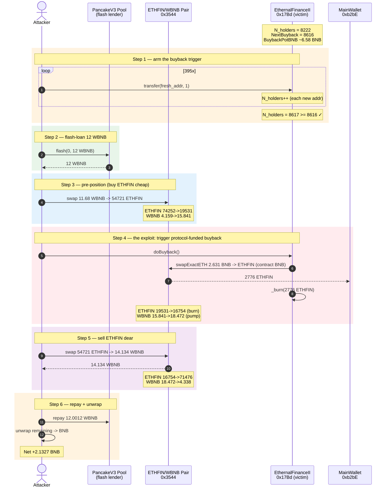
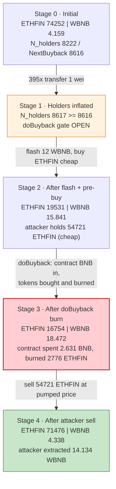
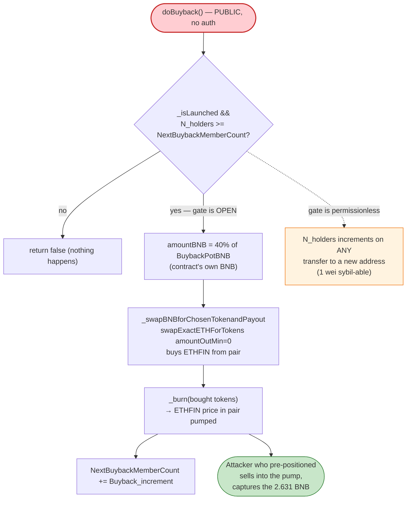

# ETHFIN Exploit — Permissionless `doBuyback()` Buyback-Pot Drain via Holder-Count Manipulation

> **Reproduction:** the PoC compiles & runs in an isolated Foundry project at
> [this project folder](.) (the umbrella DeFiHackLabs repo
> > contains several unrelated PoCs that do not compile, so this one was extracted).
> Full verbose trace: [output.txt](output.txt).
> Verified vulnerable source: [EthernalFinanceII.sol](sources/EthernalFinanceII_17Bd2E/EthernalFinanceII.sol).

---

## Key info

| | |
|---|---|
| **Loss** | ~**2.13 BNB** (~$1.24K) — drained from ETHFIN's on-contract `BuybackPotBNB` reserve |
| **Vulnerable contract** | `EthernalFinanceII` (ETHFIN token) — [`0x17Bd2E09fA4585c15749F40bb32a6e3dB58522bA`](https://bscscan.com/address/0x17bd2e09fa4585c15749f40bb32a6e3db58522ba#code) |
| **Victim pool / pot** | ETHFIN/WBNB PancakeSwap pair `0x3544DA62afB297b5cE9DA14845C89b96D376D98C` + ETHFIN's internal `BuybackPotBNB` (≈6.58 BNB pre-attack) |
| **Attacker EOA** | [`0x52e38d496f8d712394d5ed55e4d4cdd21f1957de`](https://bscscan.com/address/0x52e38d496f8d712394d5ed55e4d4cdd21f1957de) |
| **Attacker contract** | [`0x11bfd986299bb0d5666536e361f312198e882642`](https://bscscan.com/address/0x11bfd986299bb0d5666536e361f312198e882642) |
| **Attack tx** | [`0xfe031685d84f3bae1785f5b2bd0ed480b87815c3f23ce6ced73b8573b7e367c6`](https://bscscan.com/tx/0xfe031685d84f3bae1785f5b2bd0ed480b87815c3f23ce6ced73b8573b7e367c6) |
| **Chain / block / date** | BSC / 37,400,485 / March 29, 2024 |
| **Compiler** | Solidity v0.8.34 (PoC); vulnerable contract `^0.8.6` |
| **Bug class** | Missing access control on a price-moving privileged function (`doBuyback`), combined with a permissionless holder-count gate |

---

## TL;DR

`EthernalFinanceII.doBuyback()` ([EthernalFinanceII.sol:1940-1974](sources/EthernalFinanceII_17Bd2E/EthernalFinanceII.sol#L1940-L1974)) is declared
`public` with **no access control**. It is supposed to be an internal maintenance routine
that the contract calls against its *own* accumulated `BuybackPotBNB` reserve to buy ETHFIN
tokens on PancakeSwap and burn them. Its only gate is
`N_holders >= NextBuybackMemberCount` ([:1942-1943](sources/EthernalFinanceII_17Bd2E/EthernalFinanceII.sol#L1942-L1943)) — and `N_holders` is
incremented by a plain `transfer()` of any amount (even 1 wei) to a fresh address
([:643](sources/EthernalFinanceII_17Bd2E/EthernalFinanceII.sol#L643)).

So an attacker can:

1. **Arm the trigger** by sending 1 wei of ETHFIN to ~395 throwaway addresses, pushing
   `N_holders` from 8222 → 8617, across the `NextBuybackMemberCount = 8616` threshold.
2. **Flash-loan 12 WBNB**, then **pre-position** the ETHFIN/WBNB pair: buy ETHFIN cheaply
   (pushing the WBNB reserve up, ETHFIN reserve down), which sets a favourable entry price.
3. **Call `doBuyback()`** — the contract spends **2.631 BNB of its own `BuybackPotBNB`** to
   buy ETHFIN and **burn** it, pumping the ETHFIN price in the pair.
4. **Sell** the pre-acquired ETHFIN into the now-pumped pool, extracting 14.13 WBNB.

Net profit: **+2.13 BNB** — the contract's own buyback treasury, siphoned by calling a
function that was meant to be internal.

---

## Background — what ETHFIN does

`EthernalFinanceII` ([source](sources/EthernalFinanceII_17Bd2E/EthernalFinanceII.sol)) is a
complex deflationary/reward token ("ETHFIN", 100B supply) with buy/sell taxes routed into
internal "pots" of BNB kept inside the token contract itself:

- `BuybackPotBNB` — accumulates 30% of the buy-tax BNB. Used by `doBuyback()` to market-buy
  ETHFIN and burn it (down to 50% of initial supply), supporting the price.
- `HolderPotBNB`, `MarketingBNB`, `AdminPotBNB`, `ModPotBNB`, `GasPotBNB`, `LQPotBNB` — other
  tax-funded reserves.

The buyback is *gated on holder growth*: a counter `N_holders` is incremented whenever a
transfer hits a brand-new address ([:634-653](sources/EthernalFinanceII_17Bd2E/EthernalFinanceII.sol#L634-L653)),
and `doBuyback()` only fires once `N_holders` crosses `NextBuybackMemberCount`
([:1942](sources/EthernalFinanceII_17Bd2E/EthernalFinanceII.sol#L1942)). After each buyback the
threshold grows by `Buyback_increment` (200 initially, +10% each time).

On-chain parameters at the fork block (block 37,400,484):

| Parameter | Value |
|---|---|
| `N_holders` | 8,222 |
| `NextBuybackMemberCount` | 8,616 |
| `BuybackPotBNB` | ≈ 6.579 BNB (`0x5b4c419aa77d747d`) |
| `_isLaunched` | true |
| ETHFIN/WBNB pair (`0x3544`) reserves | 74,252 ETHFIN / 4.159 WBNB (token0=ETHFIN, token1=WBNB) |
| ETHFIN/EF pair (`0x168FDb`) | the cross-pair used to skim fees |
| ETHFIN `MainWallet` | `0xb2bE75AE48f753B9a3D94D75251679702aE87382` (receiver of buyback tokens) |

The two facts that make the attack work: (a) `doBuyback()` is callable by **anyone**, and (b)
its trigger condition is **cheaply satisfiable** by anyone with 1 wei of ETHFIN and gas.

---

## The vulnerable code

### 1. `doBuyback()` is `public` with no access control

```solidity
// EthernalFinanceII.sol:1940
function doBuyback() public returns (bool) //set to private
{
   if((_isLaunched == true)&&(N_holders >= NextBuybackMemberCount))   // ← the ONLY gate
   {
     uint256 amountBNB = BuybackPotBNB * 40 / 100; //max 40% of pot per transaction  // ← spends CONTRACT's BNB

      uint256 tokens = __balanceOf[MainWallet];
      SingleUntaxedTransfer = true;
      BuybackPotBNB -= amountBNB;
      if(_swapBNBforChosenTokenandPayout(amountBNB,address(this),MainWallet)==false) // ← buys ETHFIN with contract BNB
        BuybackPotBNB += amountBNB; //failed put back into pot
      else
      {
        if(__balanceOf[MainWallet]>tokens)
        {
           tokens = __balanceOf[MainWallet] - tokens;
           _transfer(MainWallet,Contract,tokens);
           if((__totalSupply - tokens > burnUntil))
              _burn(address(this), tokens);                              // ← then BURNS them (price pump)
        }
        emit Buyback_(tokens, N_holders);
        NextBuybackMemberCount = NextBuybackMemberCount + Buyback_increment;
        Buyback_increment = Buyback_increment * 110/100;
        return true;
      }
   }
   return false;
}
```

The comment `//set to private` shows the developer *knew* it should be private — but it is
`public`, and it is invoked directly by the attacker ([ETHFIN_exp.sol:103](test/ETHFIN_exp.sol#L103)).

### 2. The gate is trivially satisfiable

```solidity
// EthernalFinanceII.sol:634
function UpdateRegister(address recipient, bool ExcludedfromTax) private {
    if(_isregistered[recipient] == false) {
        investorList.push(recipient);
        _isregistered[recipient] = true;
        ...
        N_holders++;        // ← any transfer to a new address bumps the counter
        ...
    }
}
```

The attacker loops `transfer(address(n), 1)` to freshly-minted low addresses until
`N_holders >= NextBuybackMemberCount` ([ETHFIN_exp.sol:69-73](test/ETHFIN_exp.sol#L69-L73)).

---

## Root cause — why it was possible

A buyback is, by construction, a **directional market operation that moves price**: it removes
sell-side liquidity (buys tokens) and then permanently deletes supply (burn). Whoever controls
*when* it fires controls a free, protocol-funded price pump. The contract design assumes the
buyback only runs as an internal side-effect of organic holder growth — but that assumption is
violated by two independent flaws that compose into the exploit:

1. **Missing access control.** `doBuyback()` has no `onlyMain()` / `onlyAdmin()` / internal
   visibility. It is a permissionless entry point that spends the contract's own BNB. Compare
   with every other BNB-spending function (`swapTaxTokenForBNB`, `_swapBNBforChosenTokenandPayout`
   callers, `WorkHelper`) — they are all `onlyMain`/`onlyAdmin` or `private`. `doBuyback` is the
   sole exception, and it is also the one that performs an unconditional, slippage-free
   (`amountOutMin = 0`) market buy with protocol funds.

2. **Permissionless trigger condition.** `N_holders` increments on *any* transfer to a new
   address, with no minimum amount, no per-address stake, and no sybil resistance. 1 wei to a
   throwaway address counts as a "new holder." The threshold `NextBuybackMemberCount` is
   therefore not a measure of organic adoption — it is a counter an attacker can inflate for
   the gas cost of `N` transfers.

Because the attacker controls **timing** (when to cross the holder threshold) **and** pool state
(they pre-position the ETHFIN/WBNB reserves with a flash-loaned WBNB buy immediately before),
they capture the buyback's price impact for themselves: buy cheap before, sell dear after. The
contract's 2.63 BNB of buyback spending is converted into the attacker's profit.

---

## Preconditions

- `_isLaunched == true` (✓ — ETHFIN had launched long before March 2024).
- The attacker holds even a tiny amount of ETHFIN to seed the holder-inflation loop
  (the PoC `deal`s itself 1500 wei; 1 wei per new address is enough — [ETHFIN_exp.sol:60](test/ETHFIN_exp.sol#L60)).
- Working capital to pre-position the pair. The attacker flash-loans **12 WBNB** from the
  PancakeV3 USDT/WBNB pool (`0x172fcD...`), repaying 12.0012 WBNB (0.01% fee). The whole
  operation is atomic and self-funding.

---

## Attack walkthrough (with on-chain numbers from the trace)

All figures are taken directly from the `Sync` / `Swap` / `Flash` events and storage writes in
[output.txt](output.txt). The ETHFIN/WBNB pair (`0x3544`) has `token0 = ETHFIN`,
`token1 = WBNB`.

| # | Step | ETHFIN reserve | WBNB reserve | Effect |
|---|------|---------------:|-------------:|--------|
| 0 | **Initial** (`0x3544`) | 74,252 | 4.159 | Resting pool. `N_holders=8222`, `NextBuybackMemberCount=8616`. |
| 1 | **Inflate holders** — 395× `transfer(addr, 1)` to fresh addresses | — | — | `N_holders` 8222 → 8617, arming `doBuyback()`. |
| 2 | **Flash-loan 12 WBNB** from PancakeV3 `0x172fcD…` | — | — | Attacker now holds 12 WBNB; owes 12.0012 WBNB. |
| 3 | **Pre-position (buy ETHFIN cheap)** — `swapExactTokensForTokens`: 11.68 WBNB → 54,721 ETHFIN via `0x3544` | 19,531 | 15.841 | ETHFIN reserve crushed (~74% out), entry price locked low. Attacker holds 54,721 ETHFIN. |
| 4 | **`doBuyback()`** — contract spends **2.631 BNB** of `BuybackPotBNB` → buys 2,776 ETHFIN → sends to `MainWallet` → `_burn`s them | 16,754 | 18.472 | Supply burned, WBNB reserve inflated. ETHFIN price in the pair pumped. |
| 5 | **Sell ETHFIN dear** — attacker dumps 54,721 ETHFIN → **14.134 WBNB** via `0x3544` (`swap(0, 14.134, …)`) | 71,476 | 4.338 | Extracts the buyback's WBNB injection plus the attacker's own capital. |
| 6 | **Repay flash loan** — 12.0012 WBNB back to `0x172fcD…` | — | — | Flash closed. |
| 7 | **Unwrap remaining WBNB → BNB** | — | — | Attacker keeps **2.132 BNB**. |

### Why the buyback is a gift to whoever triggers it

`doBuyback` calls `_swapBNBforChosenTokenandPayout(amountBNB, address(this), MainWallet)`
([:1952](sources/EthernalFinanceII_17Bd2E/EthernalFinanceII.sol#L1952)) which internally does
`swapExactETHForTokensSupportingFeeOnTransferTokens{value: amountBNB}(... amountOutMin: 0 ...)`.
A market buy of 2.631 BNB against a pool that the attacker has just thinned to 19,531 ETHFIN /
15.841 WBNB moves the price steeply: the buy adds 2.631 WBNB to the WBNB side and removes only
2,776 ETHFIN from an already-depleted ETHFIN side, then **burns** those 2,776 ETHFIN. The
attacker, who pre-bought 54,721 ETHFIN at the depressed price, sells them into the now-pumped
pool for 14.134 WBNB — recovering their 11.68 WBNB input **plus** the 2.631 BNB the contract
just injected, minus flash-loan fees and AMM slippage.

### Profit / loss accounting (WBNB, 18 decimals)

| Direction | Amount (BNB) |
|---|---:|
| Flash-loan received | +12.0000 |
| Spent — pre-position ETHFIN buy | −11.6818 |
| Spent — flash-loan repayment | −12.0012 |
| Received — post-buyback ETHFIN sell | +14.1340 |
| **Net profit** | **+2.1327** |

The profit (2.1327 BNB) is essentially the contract's `BuybackPotBNB` spend of 2.631 BNB,
minus flash-loan fee (0.0012) and AMM slippage/fee (~0.497). The attacker walked off with the
protocol's own buyback treasury.

---

## Diagrams

### Sequence of the attack



### State of the ETHFIN/WBNB pair and the trigger



### The flawed gate inside `doBuyback`



---

## Remediation

1. **Make `doBuyback()` non-callable by arbitrary users.** It was clearly intended to be
   `private`/`internal` (the source even carries the comment `//set to private`). Either mark it
   `private` (so it only runs via the internal `doWork` task scheduler) or gate it behind
   `onlyAdmin()`/`onlyMain()`. This single change fully closes the exploit.
2. **Don't gate privileged economic actions on a sybil-able counter.** `N_holders` increments on
   any 1-wei transfer to a new address, so it is attacker-controlled. If holder growth must gate
   the buyback, require a meaningful minimum balance per "holder" and/or a time-weighted measure
   rather than a raw address count.
3. **Never do a protocol-funded market buy with `amountOutMin = 0`.** `_swapBNBforChosenTokenandPayout`
   hard-codes a zero minimum-out, so the buyback accepts any price — including a price an attacker
   just manipulated. Use a slippage tolerance derived from a TWAP, or route the buyback through an
   on-chain TWAP-oracle limit.
4. **Separate "decide to buy back" from "execute buy back."** Even if internally triggered, the
   buyback should check that the current pool price has not diverged abnormally from a recent
   average before spending treasury BNB; a sandwich around an internal call is still possible if
   another tx can move the pool in the same block.

---

## How to reproduce

The PoC was extracted into a standalone Foundry project (the umbrella DeFiHackLabs repo has
several unrelated PoCs that fail to compile under `forge test`'s whole-project build):

```bash
_shared/run_poc.sh 2024-03-ETHFIN_exp --mt testExploit -vvvvv
```

- RPC: a **BSC archive** endpoint is required (fork block 37,400,485 is historical).
  `foundry.toml` uses `https://bsc-mainnet.public.blastapi.io`, which serves state at that block.
- Result: `[PASS] testExploit()` with `Attacker BNB end exploited: 2.132705597170077748`.

Expected tail:

```
Ran 1 test for test/ETHFIN_exp.sol:ETHFIN
[PASS] testExploit() (gas: ...)
  emitted log: "Attacker BNB end exploited: 2.132705597170077748"
Suite result: ok. 1 passed; 0 failed; 0 skipped
```

---

*Reference: DeFiHackLabs PoC — `2024-03/ETHFIN/` (BSC, ~$1.24K). The same `doBuyback()` flaw
exists in the sibling contract `EthernalFinance` (`0xA964a6…`, [source](sources/EthernalFinance_A964a6/EthernalFinance.sol)) which is also `public`.*
