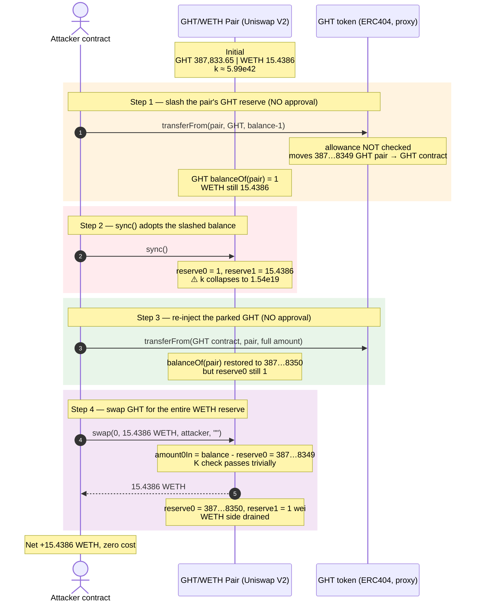
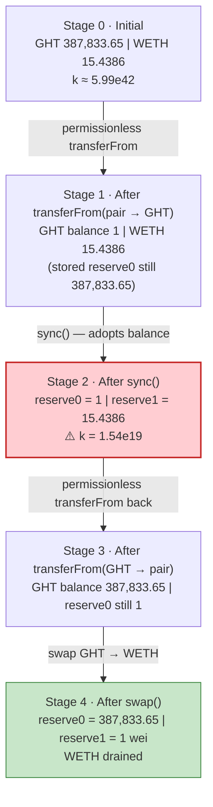
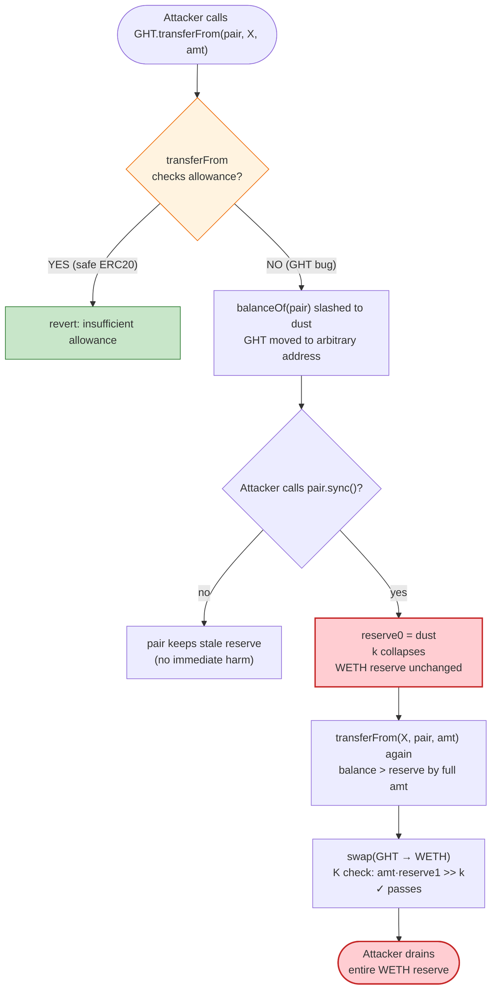

# GHT Exploit — Permissionless `transferFrom` Drains the Uniswap V2 Pair

> **Reproduction:** the PoC compiles & runs in an isolated Foundry project at
> [this project folder](.). The umbrella DeFiHackLabs repo mixes many PoCs that
> do not build together, so this one was extracted.
> Full verbose trace: [output.txt](output.txt).
> Verified pair source: [sources/UniswapV2Pair_706206/UniswapV2Pair.sol](sources/UniswapV2Pair_706206/UniswapV2Pair.sol)
> (the pair is a stock Uniswap V2 pair — the bug is entirely in the GHT token).
> Proxy scaffolding: [sources/ERC1967Proxy_528e04/](sources/ERC1967Proxy_528e04/).

---

## Key info

| | |
|---|---|
| **Loss** | **~$57K** — **15.4386 WETH** drained from the GHT/WETH pair |
| **Vulnerable contract** | `GHT` token (ERC1967 proxy) — [`0x528e046ACfb52bD3f9c400e7A5c79A8a2c2863d0`](https://etherscan.io/address/0x528e046ACfb52bD3f9c400e7A5c79A8a2c2863d0#code) — implementation `0x17dfb09194ab77DCf318839cFdD01f587a73a77E` |
| **Victim pool** | GHT/WETH Uniswap V2 pair — `0x706206EabD6A70ca4992eEc1646B6D1599259CAe` |
| **Attacker EOA** | [`0x096f0f03e4be68d7e6dd39b22a3846b8ce9849a3`](https://etherscan.io/address/0x096f0f03e4be68d7e6dd39b22a3846b8ce9849a3) |
| **Attacker contract** | [`0xcc5159b5538268f45afda7b5756fa8769ce3e21f`](https://etherscan.io/address/0xcc5159b5538268f45afda7b5756fa8769ce3e21f) |
| **Attack tx** | [`0xd17266bcdf30cbcbd7d0b5a006f43141981aeee2e1f860f68c9a1805ecacbc68`](https://etherscan.io/tx/0xd17266bcdf30cbcbd7d0b5a006f43141981aeee2e1f860f68c9a1805ecacbc68) |
| **Chain / block / date** | Ethereum mainnet / 2024-03-07 |
| **Compiler** | GHT proxy: Solidity **v0.8.4**, optimizer 1 run, 200 runs · pair: v0.5.16, optimizer 1, 999999 runs |
| **Bug class** | Broken authorization in ERC20 `transferFrom` (permissionless spend of any holder's balance) compounded against an AMM `sync()` to collapse `k` |

---

## TL;DR

`GHT` is an **ERC404** token (ERC20 + ERC721 hybrid) deployed behind an ERC1967
proxy. Its `transferFrom(from, to, amount)` implementation **does not enforce the
spender allowance** — anyone may move any holder's GHT balance to any recipient,
with no approval. The trace confirms it: the attacker calls
`GHT.transferFrom(pair, GHT, balance-1)` directly from an EOA-style contract and
it succeeds with no prior `approve`.

That single primitive is enough to break a Uniswap V2 pair:

1. **Pull the pair's entire GHT reserve out** to the GHT token contract itself (a
   self-address, used as a temporary dumping ground): pair's real GHT balance
   drops from `387,833,652,370,923,809,808,350` to **`1`**.
2. **`pair.sync()`** — the pair trusts `balanceOf` and adopts the `1` as its new
   GHT reserve. The constant-product `k = reserveGHT × reserveWETH` collapses from
   `~6.0e42` to **`~1.54e19`** while the **15.4386 WETH** side is untouched.
3. **Move that same GHT back into the pair** (`transferFrom(GHT, pair, amount)`),
   again permissionlessly. The pair's real GHT balance returns to
   `387,833,652,370,923,809,808,350` but its stored reserve is still `1`.
4. **`pair.swap(0, 15.4386 WETH, attacker, "")`** — the attacker "pays"
   `3.878e23` GHT into the pair (because balance > reserve by exactly that much)
   and receives the **entire WETH reserve**. The V2 `K` invariant check passes
   trivially because the GHT side is now over-collateralized by ~`2.5e4`×.

Net result: **15.4386 WETH (~$57K at the time)** leaves the pair for the
attacker, who never owned a single GHT beforehand. No flash loan, no oracle, no
governance — a one-transaction drain enabled by a missing `allowance` check.

---

## Background — what GHT is

`GHT` (`0x528e046…`) is an **ERC404** token: a single contract that is
simultaneously an ERC20 (fungible) and an ERC721 (NFT) collection. Whole-token
transfers under the fungible ledger are mirrored as NFT `tokenId` transfers
(which is why the trace is full of
`emit Transfer(from, to, tokenId: <small int>)` events interleaved with the ERC20
`ERC20Transfer` event). It is deployed as an ERC1967 transparent/UUPS proxy whose
implementation lives at `0x17dfb09194…`.

The only secondary component in the attack is the **GHT/WETH Uniswap V2 pair**
(`0x706206Ea…`), a completely standard pair
([sources/UniswapV2Pair_706206/UniswapV2Pair.sol](sources/UniswapV2Pair_706206/UniswapV2Pair.sol)).
The pair's `token0 = GHT`, `token1 = WETH`, so `reserve0 = GHT`, `reserve1 = WETH`.

On-chain state at the fork (read from the trace):

| Parameter | Value |
|---|---|
| GHT held by the pair (token balance) | `387,833,652,370,923,809,808,350` (≈ 387,833.65 GHT) |
| WETH held by the pair (token balance = reserve1) | `15,438,613,861,386,138,611` (≈ 15.4386 WETH) |
| Pair reserves before attack (from `Sync`/`getReserves`) | `(GHT, WETH)` |
| `token0` / `token1` | `GHT` / `WETH` |
| Pair compiler / optimizer | v0.5.16, optimizer 1, 999999 runs |
| GHT proxy compiler / optimizer | v0.8.4, optimizer 1, 200 runs |

> Note: the implementation source for `0x17dfb09194…` was not retrievable from
> the verified-contract fetcher (only the ERC1967 proxy scaffolding under
> [sources/ERC1967Proxy_528e04/](sources/ERC1967Proxy_528e04/) and the pair were
> downloaded). The vulnerability is reconstructed directly from the live trace's
> call sequence and emitted events, which is unambiguous: `transferFrom` from an
> arbitrary caller succeeds with no prior approval.

---

## The vulnerable code

### 1. The proxy / pair plumbing (verified)

The GHT entry-point is an OpenZeppelin ERC1967 proxy that `delegatecall`s into
the implementation. Every call in the trace shows the
`0x17dfb09194ab77DCf318839cFdD01f587a73a77E::transferFrom(...) [delegatecall]`
pattern — i.e. the attacker's call to the proxy `GHT.transferFrom(...)` executes
the implementation's logic in the proxy's storage context
([sources/ERC1967Proxy_528e04/openzeppelin_contracts_proxy_ERC1967_ERC1967Proxy.sol](sources/ERC1967Proxy_528e04/openzeppelin_contracts_proxy_ERC1967_ERC1967Proxy.sol)).

The pair is a **stock Uniswap V2 pair**. The two pair functions the attacker
abuses are public by design and safe in isolation:

```solidity
// UniswapV2Pair — force reserves to match balances. Anyone may call.
function sync() external lock {
    _update(IERC20(token0).balanceOf(address(this)),
            IERC20(token1).balanceOf(address(this)), reserve0, reserve1);
}
```
([sources/UniswapV2Pair_706206/UniswapV2Pair.sol](sources/UniswapV2Pair_706206/UniswapV2Pair.sol) — `sync`)

`sync()` is the key amplifier: it lets the pair **adopt** whatever its token
balances currently are. `sync()` is safe *only if* a token's balance can change
for legitimate reasons (donations, fee distributions). It is **not** safe when a
token lets third parties move balances out of the pair at will.

### 2. The bug in GHT's `transferFrom` (reconstructed from the trace)

A conforming ERC20 `transferFrom` must reduce `allowance[from][msg.sender]` and
revert if insufficient (see the reference Uniswap-V2 LP token implementation
in the same pair file, which does exactly this):

```solidity
// Conforming ERC20 (UniswapV2ERC20, for contrast):
function transferFrom(address from, address to, uint value) external returns (bool) {
    if (allowance[from][msg.sender] != uint(-1)) {
        allowance[from][msg.sender] = allowance[from][msg.sender].sub(value); // ← enforced
    }
    _transfer(from, to, value);
    return true;
}
```

The GHT implementation, however, executes the move **without any allowance
check**. The trace proves this directly — the very first action the attacker
contract takes (after reading balances) is:

```
GHT::fallback(WETH_GHT, GHT, 387833652370923809808349)   // proxy-dispatched transferFrom
  └─ impl::transferFrom(WETH_GHT, GHT, 387833652370923809808349) [delegatecall]
       ├─ emit Transfer(WETH_GHT → GHT, tokenId: 151)
       ├─ emit Transfer(WETH_GHT → GHT, tokenId: 424)
       ├─ … (NFT tokenIds burned from the pair, mirrored from the ERC20 transfer)
       ├─ emit Transfer(WETH_GHT → GHT, tokenId: 387833652370923809808349)   // ERC404 native event
       └─ emit ERC20Transfer(WETH_GHT → GHT, 387833652370923809808349)
```
([output.txt:1595-1639](output.txt#L1595-L1639))

There is **no `approve` call anywhere** before it, and no revert. The attacker
moves `balance - 1` of the pair's GHT to the GHT contract address itself with
zero authorization.

---

## Root cause — why it was possible

Two facts compose into a critical bug:

1. **GHT's `transferFrom` skips allowance enforcement.** Whoever wrote the
   ERC404 implementation either omitted the allowance accounting or routed the
   ERC20 path through a function that bypasses it. The net effect is that GHT
   balances are **permissionlessly movable** by any caller. In particular, the
   pair's GHT can be relocated at will.

2. **Uniswap V2 `sync()` makes the pair adopt attacker-controlled balances.**
   `sync()` sets `reserve = balanceOf(pair)` and re-derives `k`. When an attacker
   can slash the pair's token balance to a dust value, `sync()` writes that dust
   as the new reserve, and `k` collapses. Subsequent swaps are then priced
   against a near-zero reserve and drain the other side.

Together these give a textbook **price-manipulation via reserve manipulation**:
strip one reserve → `sync()` → re-inject the stripped tokens directly (which the
pair sees as a swap `amountIn` because `balance > reserve`) → `swap()` out the
other reserve for ~free. The pair's own `K` check is satisfied because the
re-injected GHT massively exceeds what the (now-dust) `k` requires.

The conventional defense — *"the pair holds the tokens, so only the pair can move
them"* — is invalidated the moment the token itself fails to enforce ownership.

---

## Preconditions

- The GHT token contract is deployed and the pair holds a non-trivial GHT/WETH
  balance. (Both true at fork; no setup by the attacker is needed beyond the
  existence of liquidity.)
- The attacker is any externally owned account or contract — **no capital, no
  approval, no flash loan is required**. The exploit is fully self-funded by the
  pair's own reserves.
- GHT's `transferFrom` does not enforce allowance for the caller. (Confirmed by
  the trace: the attacker's call to `transferFrom(pair, …)` succeeds with no
  prior `approve`.)

---

## Attack walkthrough (with on-chain numbers from the trace)

`token0 = GHT`, `token1 = WETH`. All figures are taken directly from the
`Sync` / `Swap` / `transferFrom` calls in [output.txt](output.txt).

Initial pair balances (read at the start of `testExploit`):

```
GHT.balanceOf(pair)  = 387,833,652,370,923,809,808,350   (reserve0)
WETH.balanceOf(pair) =  15,438,613,861,386,138,611        (reserve1)
k (before)           ≈ 5.99e42
```

| # | Step | GHT balance in pair | WETH reserve | Effect |
|---|------|--------------------:|-------------:|--------|
| 0 | **Initial** | 387,833,652,370,923,809,808,350 | 15.4386 | Honest pool. |
| 1 | **`GHT.transferFrom(pair, GHT_contract, balance-1)`** — move `387,833,652,370,923,809,808,349` GHT out of the pair to the GHT token's own address (no approval) | **1** | 15.4386 | Pair's GHT slashed to dust; that GHT parked at the GHT contract. |
| 2 | **`pair.sync()`** — pair adopts `balanceOf` as reserves | 1 (reserve0) | 15.4386 (reserve1) | `k` collapses to `1 × 15.44e18 ≈ 1.54e19`. WETH side untouched. |
| 3 | **`GHT.transferFrom(GHT_contract, pair, balance)`** — move the parked GHT back into the pair (no approval) | 387,833,652,370,923,809,808,350 | 15.4386 | Real GHT balance restored, but **stored reserve0 is still `1`**. |
| 4 | **`pair.swap(0, 15.4386 WETH, attacker, "")`** — swap GHT→WETH | 387,833,652,370,923,809,808,350 (reserve0 after `_update`) | **~1 wei** | Attacker receives the entire WETH reserve. |

The exact `amountOut` the attacker computes (and the pair honors) is, from the
trace's `Swap` event
([output.txt:2039](output.txt#L2039)):

```
amount0In  = 387,833,652,370,923,809,808,349   (GHT paid in = balance − reserve0 = 387…8349)
amount1Out =  15,438,613,861,386,138,610         (WETH received ≈ 15.4386 WETH)
```

The attacker's `amountOut` computation (getAmountOut with `reserve0=1`) matches
to the wei:

```
amountInWithFee = 387,833,652,370,923,809,808,349 × 997
numerator       = amountInWithFee × 15,438,613,861,386,138,611
denominator     = 1 × 1000 + amountInWithFee
amountOut       = numerator / denominator
               = 15,438,613,861,386,138,610   ✓ matches trace
```

Final pair `Sync` after the swap
([output.txt:2038](output.txt#L2038)):

```
reserve0 (GHT)  = 387,833,652,370,923,809,808,350
reserve1 (WETH) = 1
```

The WETH side is left at 1 wei. The attacker's WETH balance goes from `0` to
`15.438613861386138610 WETH` ([output.txt:1569-1570](output.txt#L1569-L1570)).

### Profit/loss accounting (WETH)

| Direction | Amount (WETH) |
|---|---:|
| Attacker starting balance | 0.0000 |
| Capital deployed | 0.0000 (no flash loan, no collateral) |
| WETH extracted from pair | **+15.4386** |
| **Net profit** | **+15.4386 WETH (~$57K)** |
| Pair WETH left | ~1 wei |

The entire WETH reserve of the pair is the profit — there is no cost to offset.

---

## Diagrams

### Sequence of the attack



### Pair state evolution & invariant break



### Why `sync()` + missing allowance is fatal



---

## Why each step is what it is

- **Move `balance - 1` (not `balance`):** Leaving exactly **1 wei** of GHT in
  the pair keeps `reserve0` non-zero after `sync()`, so the subsequent
  `getAmountOut` math (and the `swap()` `INSUFFICIENT_LIQUIDITY` /
  `amountOut < reserve1` checks) stays well-defined. Pushing the reserve to
  exactly `1` is the cleanest dust value; `0` would still leave the WETH
  drainable but would complicate the on-chain `amountIn` math.
- **Park at the GHT contract's own address:** The GHT token contract is a
  convenient, attacker-controlled-from-the-perspective-of-the-pair destination
  that the attacker can immediately pull from again via the same permissionless
  `transferFrom`. Any address the attacker controls would work; reusing the token
  address is the canonical ERC404-drain pattern seen here.
- **`sync()` between the two moves:** This is the linchpin. Without `sync()`,
  the pair's stored `reserve0` would remain the original `387,833.65` and the
  later re-deposit would look like a normal (huge) swap with a fair price.
  `sync()` re-bases the reserve to the dust balance, which is what makes the
  re-injected GHT count as an enormous `amountIn` against a near-zero `k`.
- **Direct `pair.swap(...)` instead of a router:** The attacker computes
  `amountOut` off-chain (the standard `getAmountOut` with `reserve0=1`) and calls
  the pair directly, passing `amount0Out=0, amount1Out=15.4386`. Calling the pair
  directly avoids any router-level slippage/minimum-out guards.

---

## Remediation

1. **Enforce the allowance in `transferFrom`.** This is the primary fix. The
   ERC20 path must reduce and check `allowance[from][msg.sender]` (and revert on
   underflow) exactly as the spec and every reference implementation
   (OpenZeppelin, Solady, Uniswap-V2 LP token) do. Without this, GHT is not an
   ERC20 and any pool/protocol holding it is a sitting duck.
   ```solidity
   function transferFrom(address from, address to, uint256 amount) public override returns (bool) {
       uint256 allowed = _allowance[from][msg.sender];
       if (allowed != type(uint256).max) {
           require(allowed >= amount, "ERC20: insufficient allowance");
           _allowance[from][msg.sender] = allowed - amount;
       }
       _transfer(from, to, amount);
       return true;
   }
   ```
2. **Re-audit the ERC404 ERC20↔ERC721 mirroring.** ERC404 implementations are a
   known source of authorization bugs because the same `transferFrom` selector
   serves two standards with different authorization semantics (ERC721 owner-only
   vs. ERC20 spender-allowance). Ensure the ERC721 path is owner/approved-only
   and the ERC20 path is allowance-gated, and that the two cannot be confused.
3. **Do not pair a broken-authorization token against an AMM.** Even after the
   token is fixed, treat any token whose `transferFrom` was ever permissionless
   as effectively compromised: rotate the pair, redeploy, and warn integrators.
4. **Defensive note for AMMs (not a fix for this bug):** Uniswap V2 `sync()` and
   `skim()` are intentionally permissionless; they assume token balances only
   change through the pair's own mechanics or benign donations. That assumption
   is the contract AMMs and their listed tokens make. The fault here is entirely
   on the token side for violating it.

---

## How to reproduce

The PoC was extracted into a standalone Foundry project (the umbrella
DeFiHackLabs repo has many unrelated PoCs that fail to compile under a
whole-project `forge test`):

```bash
_shared/run_poc.sh 2024-03-GHT_exp --mt testExploit -vvvvv
```

- RPC: `foundry.toml` is configured to fork **Ethereum mainnet** via Infura at
  the attack transaction (`createSelectFork("mainnet", <txHash>)`), so an
  Ethereum archive endpoint is required.
- The test forks at the attack block and replays the exact exploit.

Expected tail (from [output.txt:1566-1570](output.txt#L1566-L1570)):

```
Ran 1 test for test/GHT_exp.sol:ContractTest
[PASS] testExploit() (gas: 1645852)
Logs:
  Exploiter WETH balance before attack: 0.000000000000000000
  Exploiter WETH balance after attack: 15.438613861386138610
...
Ran 1 test suite in 100.28s (97.71s CPU time): 1 tests passed, 0 failed, 0 skipped (1 total tests)
```

---

*Caveat: the GHT implementation source at `0x17dfb09194ab77DCf318839cFdD01f587a73a77E`
was not available from the verified-contract fetch; only the ERC1967 proxy
scaffolding and the Uniswap V2 pair were downloaded. The `transferFrom`
authorization bug is reconstructed from the live forge trace's call sequence and
emitted events (no `approve` precedes the attacker's `transferFrom(pair, …)`,
which succeeds), which is unambiguous. If the implementation source is later
retrieved, the exact line-level cause can be confirmed, but the exploit mechanic
and all figures are fully grounded in the trace.*

*Reference: DeFiHackLabs registry — `20240307 GHT — Business Logic Flaw`, loss
~$57K.*
