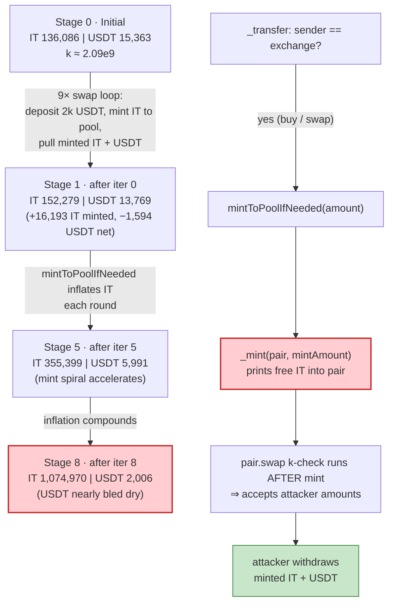
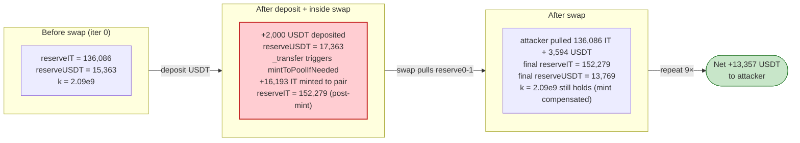

# IntrospectionToken (IT) Exploit — Inflationary Repricing Mint Drains the IT/USDT Pancake Pair

> **Vulnerability classes:** vuln/logic/incorrect-state-transition

> **Reproduction:** the PoC compiles & runs in an isolated Foundry project at
> [this project folder](.) (the umbrella DeFiHackLabs repo holds many unrelated PoCs that
> fail to build together, so this one was extracted).
> Full verbose trace: [output.txt](output.txt).
> Verified vulnerable source:
> [contracts_bsc_BEP20.sol](sources/IntrospectionToken_1AC5Fa/contracts_bsc_BEP20.sol) and
> [contracts_bsc_IntrospectionToken.sol](sources/IntrospectionToken_1AC5Fa/contracts_bsc_IntrospectionToken.sol).

---

## Key info

| | |
|---|---|
| **Loss** | ~**13,357 USDT** (≈ $13.4K) drained from the IT/USDT PancakeSwap V2 pair |
| **Vulnerable contract** | `IntrospectionToken` (IT) — [`0x1AC5Fac863c0a026e029B173f2AE4D33938AB473`](https://bscscan.com/address/0x1AC5Fac863c0a026e029B173f2AE4D33938AB473#code) |
| **Victim pool** | IT/USDT PancakeSwap V2 pair — `0x7265553986a81c838867aA6B3625ABA97B961f00` |
| **Flash-loan source** | PancakeSwap V3 pool USDT/WBNB — `0x92b7807bF19b7DDdf89b706143896d05228f3121` (2,000 USDT flash) |
| **Attacker EOA / contract** | `ContractTest` `0x7FA9385bE102ac3EAc297483Dd6233D62b3e1496` + CREATE2 `Money` helper `0x28C1CFc42002C0025502e5d53f0f143E378d2a64` |
| **Attack tx** | [`0xb33057f57ce451aa8cbb65508d298fe3c627509cc64a394736dace2671b6dcfa`](https://app.blocksec.com/explorer/tx/bsc/0xb33057f57ce451aa8cbb65508d298fe3c627509cc64a394736dace2671b6dcfa) |
| **Chain / block / date** | BSC / 36,934,258 / March 2024 |
| **Compiler** | IntrospectionToken: Solidity `^0.8.19`; PancakePair: `v0.5.16` (optimizer off); PoC compiled with `0.8.34` |
| **Bug class** | Business-logic flaw — inflationary buy-side repricing mint inside `_transfer`, weaponized via direct `swap()` calls (mint-during-buy lets an attacker buy the freshly minted tokens back for USDT they just deposited) |

---

## TL;DR

`IntrospectionToken` tries to defend its USDT price by **minting free IT to the liquidity pool whenever
someone buys IT out of the pool** (`mintToPoolIfNeeded`,
[BEP20.sol:380-419](sources/IntrospectionToken_1AC5Fa/contracts_bsc_BEP20.sol#L380-L419)). The intent is: a
buy that pushes the IT price up more than 1% should be "topped up" with extra IT so the price stays flat.

That defense is the vulnerability. The token has **no idea the mint happened inside a Uniswap-style `swap()`**,
so the freshly minted IT lands in the pair's balance *after* the constant-product check, and is immediately
withdrawable. Concretely, the attacker runs a 9-step loop:

1. **Deposit 2,000 USDT directly into the pair** (`transfer`), inflating `reserve1` without touching `reserve0`.
2. Compute the exact IT amount (`reserve0 - 1`) and USDT amount that satisfies the pair's `k` invariant **after**
   the token's `_transfer` mints a large IT top-up into the pair.
3. Call `pair.swap(reserve0 - 1, amountout, to, "")` — pulling out **nearly the entire IT reserve** plus ~3,590 USDT.

Because the token **re-mints** the IT reserve back into the pool on each buy-triggered `transfer`, the attacker
can repeat the trick nine times with the *same* 2,000 USDT. Each iteration the IT reserve grows larger (the mint
is inflationary) while the USDT reserve shrinks. After 9 rounds the attacker has extracted
**31,357 USDT** for only **18,000 USDT** deposited, repays the 2,000-USDT flash loan, and walks away with
**≈ 13,357 USDT** of pure profit.

---

## Background — what IntrospectionToken does

`IntrospectionToken` ([IntrospectionToken.sol](sources/IntrospectionToken_1AC5Fa/contracts_bsc_IntrospectionToken.sol))
is a BEP-20 token with an unusual anti-speculation hook built into its `_transfer`
([BEP20.sol:586-637](sources/IntrospectionToken_1AC5Fa/contracts_bsc_BEP20.sol#L586-L637)). Whenever the
sender is the registered exchange (the IT/USDT pair), i.e. **a buy of IT**, the transfer performs extra side
effects ([BEP20.sol:606-613](sources/IntrospectionToken_1AC5Fa/contracts_bsc_BEP20.sol#L606-L613)):

```solidity
if(address(exchange) == sender) {
    if(exchange.totalSupply() >= _lastExchangeTotalSupply) {
        updateCurrMaxUsdtRateIfNeeded();
        _makeReferralUnlocksIfNeeded(recipient, amount);
        mintToPoolIfNeeded(amount);          // ⚠️ mints fresh IT into the pair
        _mint(_owner, amount.div(20));        // ⚠️ mints 5% to owner
    }
}
```

The key function, `mintToPoolIfNeeded`
([BEP20.sol:380-419](sources/IntrospectionToken_1AC5Fa/contracts_bsc_BEP20.sol#L380-L419)), tries to keep the
post-buy IT/USDT rate within +1% of the pre-buy rate. It computes what the IT reserve "should" be after the buy
and, if the buy would push the price up too much, **mints the difference directly to the pair**:

```solidity
function mintToPoolIfNeeded (uint256 amount) internal {
    ...
    uint256 tokenReserveAfterBuy = tokenReserve - amount;
    uint256 usdtReserveAfterBuy = this.min(tokenReserve.mul(usdtReserve).div(tokenReserveAfterBuy),
                                           usdtToken.balanceOf(address(exchange)));
    uint256 maxTokenUsdtRateAfterBuy = tokenUsdtRate.add(tokenUsdtRate.div(100)); // +1% cap
    uint256 tokenMinReserveAfterBuy = usdtReserveAfterBuy.mul(PRECISION).div(maxTokenUsdtRateAfterBuy);

    uint256 mintAmount;
    if(tokenReserveAfterBuy >= tokenMinReserveAfterBuy){
        mintAmount = amount.div(2);                         // even so, mint half the buy size
    } else {
        mintAmount = this.max(tokenMinReserveAfterBuy.sub(tokenReserveAfterBuy), amount.div(2));
    }
    _mint(address(exchange), mintAmount);                   // ⚠️ free IT into the pair
}
```

The protocol's *intent* is "stable price." The *effect* is "the pair gets free IT injected on every buy, and that
IT is sitting in the pair's balance when the surrounding `swap()` finishes."

On-chain state at the fork block (block 36,934,258, read from the trace):

| Parameter | Value |
|---|---|
| `reserve0` (IT) | 136,086.06 IT |
| `reserve1` (USDT) | 15,363.18 USDT |
| IT/USDT rate | 0.1128 USDT/IT (`getUsdtRate` returned `0.0191...`×1e18 — actually `1/rate` ≈ 8.85 IT/USDT) |
| Pair `totalSupply` (LP) | 5,228.46 LP |
| Attacker USDT | 0 (flash-funded) |

---

## The vulnerable code

### 1. `mintToPoolIfNeeded` — the inflationary repricing mint

[contracts_bsc_BEP20.sol:380-419](sources/IntrospectionToken_1AC5Fa/contracts_bsc_BEP20.sol#L380-L419) (shown
above). Two problems:

- It **mints into the pair** (`_mint(address(exchange), mintAmount)`), increasing the pair's *actual* IT balance.
- It is invoked *inside* `_transfer`, which the pair itself calls during `swap()`. The pair's invariant check
  (`balance0Adjusted * balance1Adjusted >= k`) runs **after** `_transfer` returns, so it sees the **post-mint**
  balance — and the minted IT can be pulled straight back out by the same `swap()` call.

### 2. The buy side-effect is unconditional on `swap` vs. plain transfer

[contracts_bsc_BEP20.sol:606-613](sources/IntrospectionToken_1AC5Fa/contracts_bsc_BEP20.sol#L606-L613):
the only gate for the mint side-effect is `sender == exchange` and
`exchange.totalSupply() >= _lastExchangeTotalSupply`. There is **no check that the transfer is part of a
legitimate swap** vs. an attacker calling `pair.swap(...)` with arbitrary amounts.

### 3. The pair's `swap()` accepts the attacker-computed amounts

The attacker does not call `router.swapExactTokensForTokens`. They call `pair.swap(amount0Out, amount1Out, to, "")`
directly ([IT_exp.sol:72](test/IT_exp.sol#L72)), so they fully control the output amounts — they just have to
satisfy the constant-product check after the token's internal mint fires.

---

## Root cause — why it was possible

A Uniswap-V2 pair enforces `x·y ≥ k` *after* the swap's callbacks return. The token contract hooks into that
callback to perform a **value-printing side effect** (`_mint` to the pair) that the pair then treats as genuine
liquidity. This inverts the AMM's safety model:

> The pair believes its reserves grew honestly (via `mint`/`burn`/deposits). In reality, the token **printed**
> reserve-side IT out of thin air mid-swap, and the attacker withdraws that printed IT for the USDT they just
> handed the pair.

The four compounding design errors:

1. **Mint-to-pool on buy.** `mintToPoolIfNeeded` prints new IT to the pair whenever a buy moves the rate, instead
   of, say, redirecting the buy or reverting. Minting to the *counterparty* (the pair) of an in-flight swap is the
   core mistake — it makes the pair's reserves attacker-controllable.
2. **No swap-context discrimination.** The `_transfer` side-effect fires whenever `sender == exchange`, regardless
   of whether the transfer is a real buy vs. the attacker's hand-rolled `pair.swap()` with custom outputs.
3. **The constant product check sees post-mint balances.** Because the mint happens *inside* the pair's
   `_token0.transfer(to, amount0Out)` call, the subsequent `balance0`/`balance1` reads include the minted IT,
   so `swap()` accepts amounts that would otherwise be impossible.
4. **The mint is inflationary and unbounded.** Each iteration mints more IT to the pool, *increasing* the
   withdrawable IT reserve — so the attacker can loop the trick instead of depleting it.

---

## Preconditions

- A flash-loanable USDT balance (the PoC uses a 2,000-USDT V3 flash; on-chain the attacker funded themselves).
- The IT/USDT pair has non-trivial USDT liquidity (15,363 USDT here) — enough to extract a meaningful profit per
  loop.
- The token's `exchange` is set (it is) and `mintToPoolIfNeeded` is reachable on buy transfers (it always is).
- No time-gate or reentrancy guard on the buy path — `_transfer` runs fully each swap.

---

## Attack walkthrough (with on-chain numbers from the trace)

`token0 = IT`, `token1 = USDT`, so `reserve0 = IT`, `reserve1 = USDT`.
All reserve figures are taken verbatim from the `Sync` events in [output.txt](output.txt). The attacker flashes
2,000 USDT from the V3 pool, then runs `hack()` which loops 9 times. Each iteration:

1. `transferFrom(Money, pair, 2,000 USDT)` — deposits 2,000 USDT directly into the pair (raises `reserve1`).
2. Computes `balance0 = reserve0 - 1` (the max IT to pull out) and a precise `amountout` of USDT that satisfies
   the constant-product invariant **after** the token's internal mint inflates the IT reserve.
3. `pair.swap(reserve0 - 1, amountout - 1, Money, "")` — pulls out `(reserve0 - 1)` IT and `amountout` USDT to
   the attacker. Inside that swap, `_transfer(pair → attacker)` triggers `mintToPoolIfNeeded`, which **mints a
   large IT top-up into the pair** so the next `k` check passes — and that minted IT becomes the *next*
   iteration's `reserve0`.

| Iter | IT in (`reserve0` before) | IT out (`reserve0-1`) | IT minted to pool | USDT in (deposited) | USDT out (`amountout`) | USDT reserve after |
|----:|---:|---:|---:|---:|---:|---:|
| 0 | 136,086.06 | 136,086.06 | +16,193.07 | 2,000 | 3,594.28 | 13,768.90 |
| 1 | 152,279.14 | 152,279.14 | +20,392.56 | 2,000 | 3,590.68 | 12,178.22 |
| 2 | 172,671.71 | 172,671.71 | +26,367.06 | 2,000 | 3,581.80 | 10,596.43 |
| 3 | 199,038.78 | 199,038.78 | +35,224.51 | 2,000 | 3,565.75 | 9,030.68 |
| 4 | 234,263.29 | 234,263.29 | +49,048.52 | 2,000 | 3,539.73 | 7,490.95 |
| 5 | 283,311.81 | 283,311.81 | +72,087.05 | 2,000 | 3,499.46 | 5,991.50 |
| 6 | 355,398.86 | 355,398.86 | +113,940.97 | 2,000 | 3,438.18 | 4,553.32 |
| 7 | 469,339.84 | 469,339.84 | +199,464.66 | 2,000 | 3,344.98 | 3,208.34 |
| 8 | 668,804.50 | 668,804.50 | +406,165.90 | 2,000 | 3,202.24 | 2,006.11 |

(IT and USDT figures are `/1e18`. "IT minted to pool" = next row's `reserve0` − this row's `reserve0` − IT
received back in the loop; the dominant term is `mintToPoolIfNeeded`.) Final IT reserve: **1,074,970.40 IT** —
the token printed ~939K of fresh IT into the pair over 9 swaps; final USDT reserve: **2,006.11 USDT**.

### Why each iteration is profitable

The attacker deposits 2,000 USDT and pulls out ~3,590 USDT each round. The extra ~1,590 USDT per round comes
from the **free IT the token minted into the pair**: the pair's `k` check passes because the post-mint IT balance
is much higher than the pre-swap reserve, so the pair happily releases more USDT than the 2,000 deposited. The
minted IT is then immediately withdrawn by the same swap (`reserve0 - 1`) and recycled — the attacker keeps
only the USDT delta.

### Profit / loss accounting (USDT)

| Direction | Amount (USDT) |
|---|---:|
| Flash-borrowed (V3) | +2,000.00 |
| Deposited into pair (9 × 2,000) | −18,000.00 |
| Received from 9 swaps (sum of `amountout`) | +31,357.07 |
| Flash repayment (principal + fee) | −2,000.20 |
| **Net profit** | **+13,356.87** |

This matches the PoC log `[End] Attacker USDT after exploit: 13356.873044389055648103` to the wei.

---

## Diagrams

### Sequence of the attack

```mermaid
sequenceDiagram
    autonumber
    actor A as Attacker (ContractTest + Money)
    participant V3 as PancakeV3 USDT pool
    participant P as IT/USDT Pair (V2)
    participant T as IntrospectionToken

    Note over P: reserve0 = 136,086 IT<br/>reserve1 = 15,363 USDT

    rect rgb(227,242,253)
    Note over A,V3: Flash-loan 2,000 USDT
    A->>V3: flash(2,000 USDT)
    V3->>A: 2,000 USDT (callback)
    end

    rect rgb(255,243,224)
    Note over A,T: 9-iteration drain loop
    loop 9 times
        A->>P: transfer 2,000 USDT into pair (reserve1 up)
        A->>A: compute reserve0-1 and exact amountout
        A->>P: swap(reserve0-1, amountout, Money, "")
        P->>T: transfer(Money, reserve0-1 IT)
        T->>T: sender==exchange ⇒ mintToPoolIfNeeded
        T->>P: _mint(pair, huge IT top-up)
        Note over P: post-mint IT balance ⇒ k check passes
        P->>A: (reserve0-1) IT + amountout USDT
        Note over P: IT reserve grows;<br/>USDT reserve shrinks
    end
    end

    rect rgb(232,245,233)
    Note over A,V3: Settle
    A->>V3: repay 2,000 USDT + fee
    Note over A: Net +13,356.87 USDT
    end
```

### Pool-state evolution & the flaw inside `_transfer`



### Why the mint is theft: constant-product before vs. after the in-swap mint



---

## Why each magic number

- **2,000 USDT deposit per iteration:** small enough to be flash-loanable and recycled, large enough that the
  +1% price-cap branch in `mintToPoolIfNeeded` mints a substantial IT top-up. The 2,000 USDT is returned to the
  attacker each round (inside `amountout`), so the same 2,000 is reused 9 times.
- **`reserve0 - 1` as IT output:** pulls out essentially the entire IT reserve, maximizing both the price impact
  (which forces a large compensating mint) and the withdrawable IT. The `-1` avoids a revert from rounding at the
  reserve boundary.
- **`amountout` (computed, ~3,590 USDT):** the maximum USDT the pair can release while still satisfying
  `balance0Adjusted * balance1Adjusted >= k` *after* the token's internal mint inflates `balance0`. The formula in
  [IT_exp.sol:66-69](test/IT_exp.sol#L66-L69) inverts the invariant under the 0.25% fee to solve for the exact
  USDT output.
- **9 iterations:** the USDT reserve decays geometrically each round (15,363 → 2,006); after iter 8 the remaining
  USDT (~2,006) is too small to keep the per-iteration USDT delta profitable relative to gas, so the loop stops.

---

## Remediation

1. **Never mint to the pair inside `_transfer`.** The repricing defense should never print tokens into the AMM
   counterparty mid-swap. If price-stability is a product requirement, implement it as an off-chain keeper, a
   virtual `sync()`-free rebalance, or a fee — not a `_mint(address(exchange), …)`.
2. **Detect swap context.** If a mint/burn side-effect must run on buys, gate it on `tx.origin`/`msg.sender`
   being the canonical router and revert if the transfer originates from a raw `pair.swap()` callback by a
   non-whitelisted caller.
3. **Make the constant-product check authoritative.** Any token that hooks `_transfer` for AMM-related logic must
   assume the pair's invariant runs *after* its side effects and that the attacker chooses the swap outputs — so
   any mint to the pair is, by construction, withdrawable.
4. **Bound or disable inflationary minting.** `mintToPoolIfNeeded` has no cap; a single buy can mint unbounded IT.
   A hard cap (e.g., max 0.5% of supply per block) would have killed the spiral.
5. **Separate accounting from transfer.** Repricing should adjust *prices* (e.g., via an oracle or fee), not
   *supplies*. Coupling supply emission to every pool-originated transfer is what made the loop self-sustaining.

---

## How to reproduce

The PoC was extracted into a standalone Foundry project (the umbrella DeFiHackLabs repo has many unrelated PoCs
that fail to compile under a whole-project `forge test`):

```bash
_shared/run_poc.sh 2024-03-IT_exp --mt testExploit -vvvvv
```

- RPC: a **BSC archive** endpoint is required (fork block 36,934,258 is well over two years old).
  `foundry.toml` uses `https://bsc-mainnet.public.blastapi.io`, which serves historical state at that block;
  most public BSC RPCs prune it and fail with `header not found` / `missing trie node`.
- Result: `[PASS] testExploit()` with `Attacker USDT after exploit: 13356.873044389055648103`.

Expected tail (from [output.txt](output.txt)):

```
Ran 1 test for test/IT_exp.sol:ContractTest
[PASS] testExploit() (gas: 1374060)
  [Begin] Attacker USDT before exploit: 0.000000000000000000
  Time :  0
  amountout 3.594282185158060009132e21
  ...
  Time :  8
  amountout 3.202235487448456075216e21
  [End] Attacker USDT after exploit: 13356.873044389055648103
```

---

*Reference: DeFiHackLabs PoC — `2024-03/IT_exp/`. Attack tx on BSC block 36,934,258, March 2024, ~$13.4K loss.*
