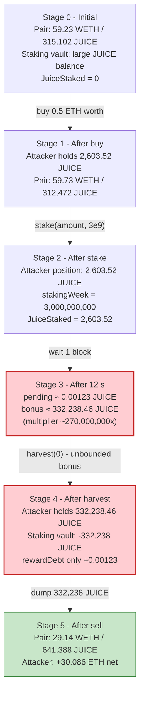
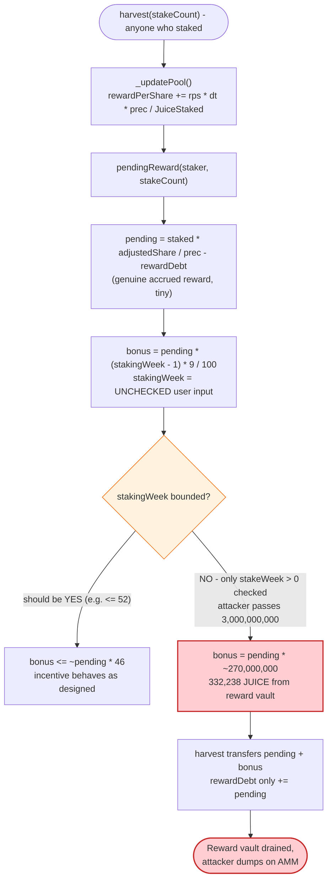

# JuiceStaking Exploit — Uncapped `stakeWeek` Bonus Multiplier Inflation

> **Reproduction:** the PoC compiles & runs in an isolated Foundry project at
> [this project folder](.) (the umbrella DeFiHackLabs repo does not whole-build,
> so this PoC was extracted).
> Full verbose trace: [output.txt](output.txt).
> Verified vulnerable source: [contracts_JuiceStaking.sol](sources/JuiceStaking_8584Dd/contracts_JuiceStaking.sol).

---

## Key info

| | |
|---|---|
| **Loss** | ~**30.086 ETH** (~$54K at the time), minted to the attacker as 332,238 JUICE and dumped into the JUICE/WETH Uniswap-V2 pair |
| **Vulnerable contract** | `JuiceStaking` — [`0x8584DdbD1E28bCA4bc6Fb96baFe39f850301940e`](https://etherscan.io/address/0x8584DdbD1E28bCA4bc6Fb96baFe39f850301940e#code) |
| **Reward / underlying token** | `JUICE` — [`0xdE5d2530A877871F6f0fc240b9fCE117246DaDae`](https://etherscan.io/address/0xdE5d2530A877871F6f0fc240b9fCE117246DaDae) |
| **Victim liquidity** | JUICE/WETH pair — `0xBa8381Ed6122829DaA46B0038d980d1c6e17CD7C` (drained of ~30.6 WETH) |
| **Attacker EOA** | [`0x3fA19214705BC82cE4b898205157472A79D026BE`](https://etherscan.io/address/0x3fA19214705BC82cE4b898205157472A79D026BE) |
| **Attacker contract** | [`0xa8b45dEE8306b520465f1f8da7E11CD8cFD1bBc4`](https://etherscan.io/address/0xa8b45dEE8306b520465f1f8da7E11CD8cFD1bBc4) |
| **Attack tx** | [`0xc9b2cbc1437bbcd8c328b6d7cdbdae33d7d2a9ef07eca18b4922aac0430991e7`](https://etherscan.io/tx/0xc9b2cbc1437bbcd8c328b6d7cdbdae33d7d2a9ef07eca18b4922aac0430991e7) |
| **Chain / block / date** | Ethereum mainnet / 19,395,636 / March 9, 2024 |
| **Compiler** | Solidity `0.8.20` (JuiceStaking), `^0.8.9` (JUICE/ERC20) |
| **Bug class** | Staking-reward inflation via an **uncapped user-controlled multiplier** (`stakeWeek`) |

---

## TL;DR

`JuiceStaking.harvest()` pays a staker `pending + bonus`, where `bonus` is computed as
`pending * (stakingWeek - 1) * 9 / 100` ([contracts_JuiceStaking.sol:140](sources/JuiceStaking_8584Dd/contracts_JuiceStaking.sol#L140)).
The `stakingWeek` value is **passed in verbatim by the user** in `stake(amount, stakeWeek)`
([:43](sources/JuiceStaking_8584Dd/contracts_JuiceStaking.sol#L43)) with only a `> 0` check — there is no
upper bound, no sanity cap, and no link between `stakingWeek` and the actual reward budget.

So an attacker:

1. Buys a small slice of JUICE from the pool (0.5 ETH → 2,603.52 JUICE).
2. Stakes it with `stakeWeek = 3,000,000,000` (3 billion "weeks").
3. Waits one block (~12 s) and calls `harvest(0)`.
4. Receives `pending ≈ 0.00123 JUICE` plus a `bonus` of
   `0.00123 * (3e9 - 1) * 9 / 100 ≈ 332,238 JUICE` — drawn straight from the staking contract's
   reward vault.
5. Sells the 332,238 JUICE back into the JUICE/WETH pair for **30.586 ETH**.

Net profit ≈ **30.086 ETH** (30.586 received − 0.5 spent), confirmed to the wei by the trace.

---

## Background — what JuiceStaking does

`JuiceStaking` ([source](sources/JuiceStaking_8584Dd/contracts_JuiceStaking.sol)) is a standard
MasterChef-style single-pool staker for the JUICE ERC20:

- `startStaking(rewardTokens)` (owner-only, [:156](sources/JuiceStaking_8584Dd/contracts_JuiceStaking.sol#L156))
  seeds a fixed reward pool, sets a 90-day window, and computes
  `rewardPerSecond = rewardTokens / 90 days`.
- `stake(amount, stakeWeek)` ([:43](sources/JuiceStaking_8584Dd/contracts_JuiceStaking.sol#L43))
  transfers JUICE in and records a per-position `StakingInfo` whose `stakingWeek` is **the raw
  `stakeWeek` argument** — used only to compute a lock-period bonus on claims.
- `_updatePool()` ([:98](sources/JuiceStaking_8584Dd/contracts_JuiceStaking.sol#L98)) accrues
  `rewardPerShare` from `rewardPerSecond * elapsed` over the 90-day window.
- `harvest(stakeCount)` ([:85](sources/JuiceStaking_8584Dd/contracts_JuiceStaking.sol#L85)) pays out
  the position's `pending + bonus` and resets the debt.

The "bonus" is meant to reward longer lock-ups:

```solidity
uint256 bonus = ((pending * (mapStakingInfo[...][stakeCount].stakingWeek - 1) * 9) / 100);
```
([:140](sources/JuiceStaking_8584Dd/contracts_JuiceStaking.sol#L140), mirrored at [:146](sources/JuiceStaking_8584Dd/contracts_JuiceStaking.sol#L146))

i.e. `bonus ≈ pending * 9% * (weeks − 1)`. For a 1-week lock the bonus is 0; for a 4-week lock it is
~27% of `pending` — a sensible incentive, **if `stakingWeek` were bounded**. It is not.

Note the unstake path ([:71-82](sources/JuiceStaking_8584Dd/contracts_JuiceStaking.sol#L71-L82)) also
pays `(pending + bonus)` on a matured stake, so the same inflation is reachable there too; `harvest`
is simply faster because it ignores `endTime`.

### On-chain parameters (read from the fork-block trace)

| Parameter | Value |
|---|---|
| `precisionFactor` | 1e18 |
| `stakingStartTime` / `stakingEndTime` | set by owner; window = 90 days |
| `rewardPerSecond` | ~1.025e14 wei/s (~**0.0001025 JUICE/s**) ⇒ ~797 JUICE total reward pool |
| `JuiceStaked` before attack | 0 (attacker is the **first and only** staker) |
| JUICE total supply | 10,000,000 JUICE |
| Pair reserves (`reserve0`=WETH / `reserve1`=JUICE) | **59.23 WETH** / **315,102 JUICE** |

---

## The vulnerable code

### 1. `stake()` accepts an unbounded `stakeWeek`

```solidity
function stake(uint256 amount, uint256 stakeWeek) external {
    require(IERC20(Juice).balanceOf(msg.sender) >= amount, "Balance not available for staking");
    require(stakeWeek > 0, "stakeWeek must be greater than or equal to one");   // ← only check: > 0
    require(stakingStartTime > 0, "Staking is not started yet");
    require(stakingEndTime > block.timestamp, "Staking is closed");

    _updatePool();

    uint256 stakeCount = stakingCount[msg.sender];
    IERC20(Juice).safeTransferFrom(msg.sender, address(this), amount);
    JuiceStaked += amount;
    stakingCount[msg.sender] += 1;

    mapStakingInfo[msg.sender][stakeCount].stakedAmount = amount;
    mapStakingInfo[msg.sender][stakeCount].startTime  = block.timestamp;
    mapStakingInfo[msg.sender][stakeCount].endTime    = block.timestamp + (stakeWeek * 7 days);
    mapStakingInfo[msg.sender][stakeCount].stakingWeek = stakeWeek;          // ⚠️ stored verbatim
    mapStakingInfo[msg.sender][stakeCount].rewardDebt  = (amount * rewardPerShare) / precisionFactor;
    emit Stake(msg.sender, amount);
}
```
[:43-63](sources/JuiceStaking_8584Dd/contracts_JuiceStaking.sol#L43-L63)

There is **no upper bound** on `stakeWeek`. A 3-billion "week" value is accepted, and — because it is
multiplied by `7 days` to compute `endTime` — the resulting `endTime` overflows silently back into a
near-present timestamp inside `uint256`? No: 3e9 * 7 * 86400 = 1.812e18, well within uint256, so
`endTime` is ~year 2.0e10. But `harvest` does **not** check `endTime` at all — it pays immediately.

### 2. `pendingReward()` scales the bonus by `stakingWeek` with no cap

```solidity
uint256 pending = (((stakedAmount * adjustedTokenPerShare) / precisionFactor) - rewardDebt);
uint256 bonus   = ((pending * (stakingWeek - 1) * 9) / 100);   // ⚠️ multiplier ~270,000,000 for stakeWeek=3e9
return (pending, bonus);
```
[:139-141](sources/JuiceStaking_8584Dd/contracts_JuiceStaking.sol#L139-L141)

### 3. `harvest()` pays `pending + bonus` and only books `pending` against the debt

```solidity
function harvest(uint256 stakeCount) external {
    require(mapStakingInfo[msg.sender][stakeCount].stakedAmount > 0, "Staking not found");
    require(mapStakingInfo[msg.sender][stakeCount].unstakeStatus == 0, "Staking already unstake");

    _updatePool();

    (uint256 pending, uint256 bonus) = pendingReward(msg.sender, stakeCount);
    IERC20(Juice).safeTransfer(msg.sender, (pending + bonus));   // ⚠️ bonus funded from the reward vault
    mapStakingInfo[msg.sender][stakeCount].rewardDebt += pending;
    emit Harvest(msg.sender, (pending + bonus));
}
```
[:85-96](sources/JuiceStaking_8584Dd/contracts_JuiceStaking.sol#L85-L96)

The `bonus` is **never** accrued by `_updatePool` — it is fabricated on the fly in `pendingReward` and
paid out of the staking contract's JUICE balance. As long as the contract holds enough JUICE to cover
`pending + bonus`, the transfer succeeds. The attacker's bonus of 332,238 JUICE easily fit inside the
contract's reward vault (which held a large share of the 10M supply).

---

## Root cause — why it was possible

The bonus is a **pure function of an unbounded user input** (`stakingWeek`) multiplied by the genuine
accrued `pending`. Three independent design errors compose into the exploit:

1. **No upper bound on `stakeWeek`.** The only validation is `stakeWeek > 0`. There is no check that
   `stakingWeek * 7 days` fits the 90-day reward window, no check against a maximum lock, and no check
   that `bonus` stays within the reward pool.
2. **The bonus is paid from the same vault as real rewards, but is not accrued.** `_updatePool` only
   increases `rewardPerShare` linearly from `rewardPerSecond`. The multiplier
   `(stakingWeek - 1) * 9 / 100` is applied *at claim time* and can be 8+ orders of magnitude larger
   than `pending`. This decouples the payout from the actual reward budget.
3. **`harvest()` ignores `endTime`.** The lock-up duration (`endTime`) is computed from `stakeWeek`,
   but `harvest` does not enforce it, so the attacker doesn't even have to wait — one block is enough
   to capture the full, inflated bonus.

In short: the contract trusts a user-supplied integer as a *multiplier on value*, which is the classic
"unbounded parameter drives a token amount" pattern.

---

## Preconditions

- Staking is live (`stakingStartTime > 0`, `stakingEndTime > block.timestamp`) — true at the fork block.
- The staking contract holds enough JUICE to cover `pending + bonus` — true, since it holds the reward
  vault (a large fraction of the 10M supply).
- A small amount of working capital to obtain JUICE: the attacker used **0.5 ETH**. This is *not*
  flash-loaned in the PoC; it is the attacker's own ETH.

---

## Attack walkthrough (numbers from the trace)

The JUICE/WETH pair has `token0 = WETH`, `token1 = JUICE` (the WETH→JUICE swap pays out JUICE).
All figures are taken from the `Sync`, `Swap`, `Transfer` and `Harvest` events in
[output.txt](output.txt).

| # | Step | WETH reserve | JUICE reserve | Attacker effect |
|---|------|-------------:|--------------:|-----------------|
| 0 | **Initial** | 59.231 | 315,102.2 | Honest pool; attacker holds 0 JUICE. |
| 1 | **Buy JUICE** — `swapExactETHForTokens` 0.5 ETH → 2,603.52 JUICE (after 1% buy-fee burn to `address(this)`) | 59.731 | 312,472.4 | Attacker holds 2,603.52 JUICE. |
| 2 | **`stake(2,603.52, 3_000_000_000)`** — locks JUICE, sets `stakingWeek = 3e9` | 59.731 | 312,472.4 | Position created; `JuiceStaked = 2,603.52`. |
| 3 | **`vm.roll +1` / `vm.warp +12s`** (one block) | — | — | ~12 s of reward accrues. |
| 4 | **`harvest(0)`** — pays `pending + bonus` | — | — | `pending ≈ 0.00123 JUICE`; `bonus ≈ 332,238.46 JUICE`. **Transfer of 332,238.46 JUICE** to attacker. |
| 5 | **Sell JUICE** — `swapExactTokensForETH` 332,238.46 JUICE → **30.586 ETH** (after 1% sell-fee burn to `address(this)`) | 29.144 | 641,388.5 | Pool's WETH side drained from 59.7 to 29.1 WETH. |
| 6 | **Done** — attacker ETH balance 79228162514.264… → **79228162544.350…** (+30.086 ETH) | — | — | — |

The bonus is mechanically:
`bonus = pending * (3,000,000,000 − 1) * 9 / 100 = pending * 269,999,999.91`.
With `pending = staked * (12 * rewardPerSecond) / staked = 12 * rewardPerSecond ≈ 0.0012305 JUICE`
(since the attacker is the sole staker, `JuiceStaked == stakedAmount` and the share term cancels),
`bonus ≈ 332,238.46 JUICE` — matching the trace's `Harvest(..., 332238461642082793241880)` to the wei.

### Profit / loss accounting (ETH)

| Direction | Amount |
|---|---:|
| Spent — buy JUICE (`swapExactETHForTokens`) | 0.500000 |
| Received — sell JUICE (`swapExactTokensForETH`) | 30.586471 |
| **Net profit** | **+30.086471** |

The attacker walks away with ~30.09 ETH and still holds the staked 2,603.52 JUICE position (irrelevant —
JUICE is now worthless). All profit comes from the staking contract's reward vault being looted and
dumped into the AMM pool.

---

## Diagrams

### Sequence of the attack

```mermaid
sequenceDiagram
    autonumber
    actor A as Attacker
    participant R as UniswapV2Router
    participant P as JUICE/WETH Pair
    participant S as JuiceStaking
    participant J as JUICE token

    Note over P: Initial reserves<br/>59.23 WETH / 315,102 JUICE

    rect rgb(232,245,233)
    Note over A,J: Step 1 — obtain a small JUICE position
    A->>R: swapExactETHForTokens{0.5 ETH} (WETH->JUICE)
    R->>P: swap()
    P-->>A: 2,603.52 JUICE (1% buy-fee burned to token contract)
    end

    rect rgb(227,242,253)
    Note over A,J: Step 2 — stake with stakeWeek = 3,000,000,000
    A->>J: approve(JuiceStaking, max)
    A->>S: stake(2,603.52, 3_000_000_000)
    S->>J: transferFrom(attacker, staking, 2,603.52)
    Note over S: stakingWeek stored verbatim;<br/>JuiceStaked = 2,603.52
    end

    rect rgb(255,243,224)
    Note over A,J: Step 3 — wait one block (~12 s)
    Note over S: _updatePool accrues ~12 s of rewardPerSecond
    end

    rect rgb(255,235,238)
    Note over A,J: Step 4 — the exploit: harvest
    A->>S: harvest(0)
    S->>S: pendingReward(): pending ≈ 0.00123 JUICE
    Note over S: bonus = pending * (3e9 - 1) * 9 / 100<br/>= pending * ~270,000,000<br/>= 332,238.46 JUICE
    S->>J: transfer(attacker, pending + bonus = 332,238.46 JUICE)
    Note over S: rewardDebt only books `pending`;<br/>`bonus` funded from reward vault
    end

    rect rgb(243,229,245)
    Note over A,J: Step 5 — dump into the pool
    A->>R: swapExactTokensForETH(332,238.46 JUICE -> WETH)
    R->>P: swap()
    P-->>A: 30.586 ETH (1% sell-fee burned)
    Note over P: WETH reserve 59.7 -> 29.1 WETH
    end

    Note over A: Net +30.086 ETH (paid 0.5, got 30.586)
```

### Pool & vault state evolution



### The flaw inside `pendingReward` / `harvest`



---

## Why each magic number

- **`0.5 ETH` buy:** just enough to obtain a non-trivial JUICE position. The buy size is irrelevant to
  the exploit — it only sets `pending` (linearly), which then gets multiplied by ~270,000,000. Even a
  dust buy would yield a large bonus; 0.5 ETH simply produces a clean, profitable dump.
- **`stakeWeek = 3,000,000,000`:** the inflator. `bonus = pending * (3e9 - 1) * 9 / 100`. Any large
  value works; this one is sized so `bonus ≈ 332,238 JUICE` — large enough to extract most of the
  pool's WETH, small enough to fit in the staking vault's JUICE balance. `endTime = now + 3e9 * 7 days`
  is a huge but valid `uint256`, so `stake()` never reverts.
- **1-block wait:** `harvest()` does not enforce `endTime`, so the lock duration is cosmetic. The
  attacker only needs `_updatePool` to accrue *some* reward so `pending > 0`. 12 seconds suffices
  (`pending ≈ 12 * rewardPerSecond ≈ 0.00123 JUICE`).
- **`332,238.46 JUICE` harvest:** `pending * 269,999,999.91`, paid from the staking reward vault.
- **`30.586 ETH` received:** the AMM price of 332,238 JUICE against ~59.7 WETH of liquidity (after the
  JUICE token's 1% sell-fee burn to `address(this)`).

---

## Remediation

1. **Cap `stakingWeek`.** Reject values outside a sane lock range, e.g.
   `require(stakeWeek >= 1 && stakeWeek <= 52, "invalid lock");` — the bonus is meant to reward
   longer *real* lock-ups, so cap it at the longest legitimate lock (e.g. 52 weeks for a 90-day
   reward window, the cap should clearly be far smaller than the reward window).
2. **Bound the bonus against the reward pool.** Even with a `stakeWeek` cap, compute the maximum
   payable bonus from the staking contract's actual JUICE balance and `JuiceStaked`, and revert if
   `pending + bonus` would exceed the available reward. A correct design accrues the bonus into
   `rewardPerShare` rather than fabricating it at claim time.
3. **Enforce `endTime` in `harvest()`.** A lock-up bonus that is payable before the lock ends is
   self-defeating. Require `block.timestamp >= endTime` (or treat `harvest` as an early-exit with
   penalty) so the multiplier corresponds to actual time locked.
4. **Decouple the bonus from a raw multiplier on `pending`.** A lock bonus should be a separate,
   pre-funded incentive — e.g. a fixed APR on the staked principal that is accrued and capped — never
   `pending * user_controlled_int`.
5. **Make `pendingReward` accounting match payouts.** `harvest`/`unstake` increase `rewardDebt` by
   `pending` only, while paying `pending + bonus`. If the bonus must exist, it must also be reflected
   in debt accounting and in the global reward budget, otherwise it is value created from nothing.

---

## How to reproduce

The PoC was extracted into a standalone Foundry project (the umbrella DeFiHackLabs repo does not
whole-build cleanly):

```bash
_shared/run_poc.sh 2024-03-Juice_exp --mt testExploit -vvvvv
```

- RPC: an **Ethereum mainnet archive** endpoint is required (fork block 19,395,636). `foundry.toml`
  uses the `mainnet` alias (`https://eth.llamarpc.com` by default in this project's config); if the
  endpoint has pruned that block, supply an archive RPC via `ETH_RPC_URL`.
- The test stakes with `stakeWeek = 3_000_000_000` and harvests one block later.

Expected tail of the trace (see [output.txt](output.txt)):

```
Ran 1 test for test/Juice_exp.sol:Juice
[PASS] testExploit() (gas: 469763)
Logs:
  [Start] Attacker ETH balance before exploit: 79228162514.264337593543950335
  [End] Attacker ETH Balance After exploit: 79228162544.350808320756466659

Suite result: ok. 1 passed; 0 failed; 0 skipped; finished in 11.56s (10.25s CPU time)
```

Balance delta = **+30.086470727212516324 ETH** — the exploit's net profit.

---

*Reference: DeFiHackLabs — JuiceStaking (JUICE), Ethereum mainnet, block 19,395,636, March 9, 2024,
~$54K (≈30.1 ETH).*
