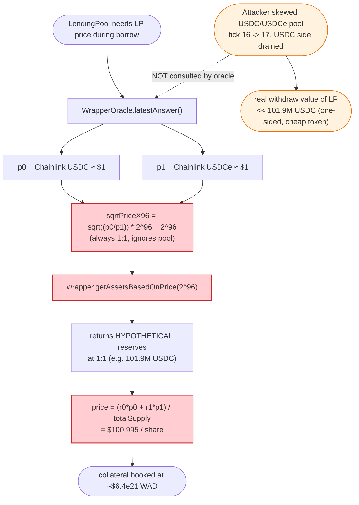
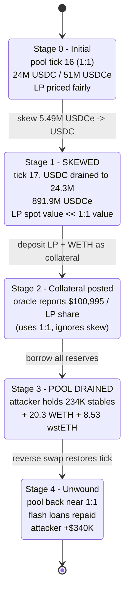

# LavaLending Exploit — WrapperOracle Price-Depeg Lets Manipulated LP Drain the Aave Pool

> **Reproduction:** the PoC compiles & runs in an isolated Foundry project at [this project folder](.).
> Full verbose trace: [output.txt](output.txt).
> Verified vulnerable source: [WrapperOracle.sol](sources/WrapperOracle_774687/src_UniV3_oracle_WrapperOracle.sol).

---

## Key info

| | |
|---|---|
| **Loss** | **~$340K** — ~234K stablecoins (USDC + USDCe + USDT) + 20.33 WETH + 8.53 wstETH drained from the LavaLending Aave-style pool |
| **Vulnerable contract** | `WrapperOracle` (USDC/USDCe LP price feed) — [`0x7746872c6892bCfB4254390283719f2Bd2D4Da76`](https://arbiscan.io/address/0x7746872c6892bCfB4254390283719f2Bd2D4Da76#code) |
| **Victim pool** | LavaLending lending pool (`InitializableImmutableAdminUpgradeabilityProxy`) — `0x403049E886b13E42C149f15450CEB795216cddC6` |
| **Attacker EOA** | [`0x851aA754c39bF23CdaAC2025367514dfd7530418`](https://arbiscan.io/address/0x851aA754c39bF23CdaAC2025367514dfd7530418) |
| **Attacker contracts** | [`0x3e52C217a902002CA296fe6769C22fEdAEE9FDA1`](https://arbiscan.io/address/0x3e52c217a902002ca296fe6769c22fedaee9fda1), [`0x42faE47296b26385C4a5b62C46E4305A27C88988`](https://arbiscan.io/address/0x42fae47296b26385c4a5b62c46e4305a27c88988) |
| **Attack tx** | [`0xcb1a2f5eeb1a767ea5ccbc3665351fadc1af135d12a38c504f8f6eb997e9e603`](https://arbiscan.io/tx/0xcb1a2f5eeb1a767ea5ccbc3665351fadc1af135d12a38c504f8f6eb997e9e603) |
| **Chain / block / date** | Arbitrum / 195,240,642 / **March 27, 2024** |
| **Compiler** | WrapperOracle: Solidity `v0.8.20`, optimizer **1 run**; lending pool proxy: `v0.6.12` |
| **Bug class** | Oracle manipulation — Chainlink-derived fair price fed to `getAssetsBasedOnPrice` ignores the **manipulated spot state** of the underlying Uniswap V3 pool, letting LP shares be deposited as collateral at an inflated valuation |

---

## TL;DR

LavaLending is an Aave-v3 fork on Arbitrum that lists a UniV3-wrapped USDC/USDCe LP token
(`USDC_USDC_LP` at `0x10bdA0…`) as collateral. Its value is supplied to the lending pool by a
custom price feed, **`WrapperOracle`** ([WrapperOracle.sol](sources/WrapperOracle_774687/src_UniV3_oracle_WrapperOracle.sol)),
which is explicitly designed to price the LP *using Chainlink-derived fair prices* rather than the
pool's spot `sqrtPriceX96` — precisely to resist pool manipulation
([:28-54](sources/WrapperOracle_774687/src_UniV3_oracle_WrapperOracle.sol#L28-L54)).

The oracle rebuilds a "fair" `sqrtPriceX96 ≈ 2^96` (i.e. USDC:USDCe = 1:1) from the two stable
Chainlink feeds, then asks the wrapper `getAssetsBasedOnPrice(sqrtPriceX96)` how many tokens its
UniV3 position would be worth **at that 1:1 price**. The flaw: that query returns the position's
*theoretical* reserves assuming the pool sits at 1:1 — but the wrapper's actual UniV3 position can
be made to occupy a much larger slice of a manipulated pool, so the oracle reports a **far higher
collateral value than the position can ever be redeemed for**.

The attacker:

1. Flash-loans WETH/USDC/USDCe from Balancer and a slice of USDC from Aave.
2. **Skews the USDC/USDCe UniV3 pool** by swapping 5.49M USDCe for USDC, emptying the pool's small
   USDC reserve (receiving only 840K USDC) and pushing the spot tick out of the wrapper's narrow
   liquidity band.
3. Deposits into `USDC_USDC_LP` while the pool is skewed, then **supplies the resulting LP shares
   + WETH as collateral** to the lending pool. Because `WrapperOracle` prices the LP via the 1:1
   Chainlink price, the LP is booked at ~$100,995 per share — roughly its manipulated theoretical
   value, not its realizable one.
4. **Borrows nearly the entire pool** (USDC, USDCe, USDT, WETH, wstETH) against that inflated
   collateral.
5. **Restores** the pool price with the reverse swap, repays all flash loans, and walks away with
   ~$340K.

Net result: the lending pool is emptied; the attacker's "collateral" (manipulated LP + WETH) is
worth far less than what was borrowed against it.

---

## Background — what LavaLending / WrapperOracle do

LavaLending is an Aave-v3 fork. Reserves of USDC, USDCe, USDT, WETH and wstETH accept deposits and
back borrows, and an LP token representing a UniV3 USDC/USDCe position is also listed as
collateral. The LP token is a wrapper (`USDC_USDC_LP`, `0x10bdA0…`) that holds a UniV3 position
with a very narrow tick range (ticks 0..2, i.e. essentially `price = 1`) in the USDC/USDCe pool
(`0x8e29…`).

That LP needs an on-chain price. LavaLending installed a custom `WrapperOracle`
([source](sources/WrapperOracle_774687/src_UniV3_oracle_WrapperOracle.sol)) — based on MakerDAO's
`GUniLPOracle` — whose explicit purpose (documented in the header comment) is to defeat pool-price
manipulation by deriving the price ratio from Chainlink:

> *"We derive the sqrtPriceX96 via Chainlink Oracles to prevent price manipulation in the pool"*
> — [:28-29](sources/WrapperOracle_774687/src_UniV3_oracle_WrapperOracle.sol#L28-L29)

The oracle takes the USDC and USDCe Chainlink feeds (both ≈ $1), computes a "fair" `sqrtPriceX96`
of `2^96` (exactly 1:1 for two 6-decimal stablecoins), and asks the wrapper how many tokens its
position is worth at that price. It then divides TVL by `totalSupply` to get a per-share price.

On-chain parameters at the fork block (read from the trace, [output.txt](output.txt)):

| Parameter | Value |
|---|---|
| `USDC_USDCe` pool spot `sqrtPriceX96` (initial) | `79224566029132126166022350063` (tick 16, ≈ 1:1) |
| Pool USDC reserve (token0) before skew | ~`24.3M` USDC |
| Pool USDCe reserve (token1) before skew | ~`51.7M` USDCe |
| Wrapper position tick range | `[0, 2]` (a 1-tick-wide band right at price 1) |
| `USDC_USDC_LP` `totalSupply` (initial) | `1,009,666,224,147,519` LP shares |
| `WrapperOracle` per-share price reported during borrow | **`1.0099e26`** ⇒ **~$100,995 / LP share** (18-dec) |
| Lending pool reserves (pre-attack, ≈ total borrows available) | USDC 52,755 / USDCe 48,527 / USDT 60,349 / WETH 2,353 / wstETH 8.53 |

---

## The vulnerable code

The price is produced in `WrapperOracle.latestAnswer()`:

```solidity
function latestAnswer() public view override returns (int256) {
    // Chainlink fair prices for token0 / token1 (≈ $1 each, WAD)
    uint256 p0 = _getWADPrice(true);
    uint256 p1 = _getWADPrice(false);
    // ⚠️ "fair" sqrtPriceX96 rebuilt from Chainlink — always ≈ 2^96 (1:1) for two ~$1 stables
    uint160 sqrtPriceX96 = _toUint160(_sqrt(_mul(_mul(p0, UNIT_1), (1 << 96)) / (_mul(p1, UNIT_0))) << 48);

    // ⚠️ Asks the wrapper how big the position is AT THE FAIR (1:1) PRICE,
    //    NOT at the pool's actual (possibly manipulated) spot price
    (uint256 r0, uint256 r1) = IWrapper(pool).getAssetsBasedOnPrice(sqrtPriceX96);
    require(r0 > 0 || r1 > 0, "invalid-balances");
    uint256 totalSupply = IWrapper(pool).totalSupply();
    require(totalSupply >= 1e9, "total-supply-too-small");

    // Unit price = TVL(at fair price) / totalSupply
    uint256 preq = _add(_mul(p0, _mul(r0, TO_WAD_0)), _mul(p1, _mul(r1, TO_WAD_1))) / totalSupply;
    return int256(preq);
}
```
([:161-178](sources/WrapperOracle_774687/src_UniV3_oracle_WrapperOracle.sol#L161-L178))

The two load-bearing assumptions that fail:

1. **`getAssetsBasedOnPrice(sqrtPriceX96)` is treated as if it returns a *realizable* amount.** It
   does not. It returns `LiquidityAmounts.getAmountsForLiquidity(sqrtPriceX96, tickLower,
   tickUpper, liquidity)` — the amounts the position *would* convert to *if* the pool's current
   price were `sqrtPriceX96`. That is a hypothetical, not a balance the LP holder can actually
   withdraw. If the real pool price has been pushed out of `[tickLower, tickUpper]`, the position
   is one-sided and worth far less than the 1:1 valuation implies.

2. **The fair price is assumed to equal the manipulable price for *this specific pool*.** USDC and
   USDCe are *two different tokens* that Chainlink reports at ~$1, but their UniV3 pool is a thin
   ~24M / 51M pool whose spot price can be hammered a long way with a single multi-million swap.
   The oracle ignores that spot price entirely.

---

## Root cause — why it was possible

The oracle's anti-manipulation design (use Chainlink, not the pool) is **inverted** for the LP
collateral use-case. To price collateral you need the *withdraw value* of the LP position, which is
dictated by the pool's **actual** state — and a thin stable/stable pool is trivially manipulable
in a single transaction (flash-loan funded, repaid by the borrowed funds). By forcing the valuation
through a fixed 1:1 Chainlink price, the oracle:

- **Reports a value the LP cannot deliver.** `getAssetsBasedOnPrice` at 1:1 returns the position's
  theoretical two-sided reserves; the realizable value after skewing the pool is a small fraction
  of that.
- **Decouples collateral value from the very pool that defines it.** The wrapper's only asset is a
  position in `USDC_USDCe`. Nothing in `latestAnswer()` consults `USDC_USDCe`'s spot price, so the
  attacker can move that pool arbitrarily without affecting the reported LP price — the worst
  possible property for a collateral feed.

The composition that turns this into a full drain:

1. **Listed as collateral with a high LTV.** The LP is accepted as collateral by the Aave-v3 fork,
   and the oracle reports each share at ~$100,995, so a modest LP deposit unlocks the whole pool.
2. **The underlying pool is small and skewable.** ~24M USDC / 51M USDCe means a 5.49M-USDCe swap
   empties the USDC side and blasts the spot price out of the wrapper's `[0, 2]` tick band.
3. **Wrapper shares mint at the skewed spot but are priced at 1:1.** While the pool is skewed, the
   attacker's LP deposit lands mostly as the (now-cheap) token in the band, yet `latestAnswer()`
   still multiplies by the 1:1 Chainlink price.
4. **Flash-loan capital + atomic repayment.** Balancer + Aave flash loans fund the skew and the
   WETH co-collateral; the borrowed pool assets repay everything in the same tx.

---

## Preconditions

- A reserve of `USDC_USDC_LP` must be active in the lending pool (it was) and priced via
  `WrapperOracle` (it was — see `latestAnswer()` calls at [output.txt:2154](output.txt#L2154) and
  [output.txt:2691](output.txt#L2691)).
- Flash-loanable working capital: ~2,332 WETH + 2.09M USDC + 2.79M USDCe from Balancer
  ([output.txt:1749](output.txt#L1749)) plus ~1.85M USDC from Aave
  ([output.txt:1762](output.txt#L1762)). All repaid atomically.
- Sufficient depth on `WETH/USDC` and `WETH/USDCe` UniV3 pools for the WETH-side swaps (present).

---

## Attack walkthrough (with on-chain numbers from the trace)

All figures are taken from [output.txt](output.txt). Token0 of `USDC_USDCe` = USDC, token1 =
USDCe. Initial spot tick = 16 (≈ 1:1).

| # | Step | Pool / pool state | Effect |
|---|------|-------------------|--------|
| 0 | **Flash-loan capital** — Balancer lends **2,332.9 WETH + 2,093,333,958,168 USDC (2.09M) + 2,789,629,246,439 USDCe (2.79M)**; Aave lends **1,847,368,512,059 USDC (1.85M)** + 1 USDCe (via nested UniV3 flash). ([output.txt:1749](output.txt#L1749), [output.txt:1762](output.txt#L1762)) | — | Attacker holds the manipulation budget. |
| 1 | **Seed LP** — deposit 1,000 USDC + 1,000 USDCe into `USDC_USDC_LP` to bootstrap a position. ([output.txt:1866](output.txt#L1866)) | tick 16 | Wrapper now holds a real UniV3 position. |
| 2 | **Co-collateral + small borrow** — `Helper` deposits 35.735 WETH and borrows 988,680 LP shares. ([output.txt:2045](output.txt#L2045), [output.txt:2136](output.txt#L2136)) | tick 16 | Sets up an existing `aUSDC_USDC_LP` position to pull LP from. |
| 3 | **THE SKEW** — swap **5,490,000,000,000 (5.49M) USDCe → USDC** in `USDC_USDCe`. Pool pays out only **840,089,721,144 (840K) USDC**; tick jumps 16 → 17. Pool now holds ~24.3M USDC / ~891.9M USDCe. ([output.txt:2296](output.txt#L2296)) | **tick 17, deeply skewed** | USDC side drained; spot price forced out of the wrapper's `[0,2]` band. |
| 4 | **Mint skewed LP** — withdraw the seed, then deposit **3,200,424,537,297 USDC + 3,200,744,579,750 USDCe** (≈3.2M each) into `USDC_USDC_LP`, then a second deposit of ~64,008 USDC + 64,014 USDCe. ([output.txt:2380](output.txt#L2380), [output.txt:2439](output.txt#L2439)) | tick 17 | Wrapper's UniV3 liquidity balloons while the pool is skewed. |
| 5 | **Post collateral** — deposit **2,297,183,117,826,111,716,866 (2,297.18 WETH)** and **63,383,659,993,147,186 LP shares** into the lending pool. ([output.txt:2516](output.txt#L2516), [output.txt:2585](output.txt#L2585)) | tick 17 | `WrapperOracle.latestAnswer()` reports **$100,995 / LP share** ⇒ collateral ≈ $6.4e21 WAD. |
| 6 | **Borrow LP back** — borrow 63,393,646,662,769,266 LP shares against the inflated collateral, then withdraw the underlying. ([output.txt:2755](output.txt#L2755), [output.txt:2886](output.txt#L2886)) | tick 17 | Reclaims the LP; collateral remains posted. |
| 7 | **DRAIN** — `Borrower` borrows **every remaining reserve**: USDCe 48,527,409,987 (48,527.41), USDC 52,755,183,006 (52,755.18), USDT 60,349,016,947 (60,349.02), WETH 2,353,251,312,626,507,429,484 (2,353.25), wstETH 8,525,476,552,027,716,376 (8.5254). ([output.txt:2969](output.txt#L2969)–[output.txt:3789](output.txt#L3789)) | tick 17 | Pool emptied. |
| 8 | **Un-skew** — reverse swap **840,089,721,144 (840K) USDCe → 840,089,721,144 USDC** in `USDC_USDCe` restoring the tick. ([output.txt:4043](output.txt#L4043)) | tick back near 1:1 | Pool price normalized; no lasting market footprint. |
| 9 | **Repay** flash loans (WETH, USDC, USDCe to Balancer; USDC + USDCe to Aave). | — | Atomic, fee = 0. |

### Why the collateral looks so fat at step 5

During the borrows the lending pool calls `WrapperOracle.latestAnswer()`, which feeds `sqrtPriceX96
= 2^96` (the Chainlink-derived 1:1) into `getAssetsBasedOnPrice`. The trace shows that call
returning reserves of **101,964,491,813 USDC** for the wrapper's whole position
([output.txt:2163](output.txt#L2163)) — the position's *theoretical* two-sided size at 1:1 — even
though the real pool is now skewed and that USDC cannot actually be withdrawn. Divided by
`totalSupply = 1,009,666,224,147,519` and multiplied by `$1` (WAD) this yields the **$100,995 /
share** price the pool uses for collateral math. The attacker's 63.38e15 shares are thus booked at
~$6.4e21 WAD of value, comfortably covering the ~$7.8e21 WAD of borrows.

### Profit / loss accounting (attacker, end of tx)

| Asset | Amount | Approx USD |
|---|---:|---:|
| USDCe | 96,215.533581 | 96,215.53 |
| USDC | 77,477.425666 | 77,477.43 |
| USDT | 60,349.016947 | 60,349.02 |
| WETH | 20.332935232888003060 | ~71,165 * |
| wstETH | 8.525476552027716376 | ~32,397 * |
| **Total** | | **~$337,600 (≈ $340K)** |

\* At late-March-2024 prices (WETH ≈ $3,500, wstETH ≈ $3,800). Stable sum alone = $234,041.98, which
plus the ETH exposure lands on the ~$340K figure cited in the PoC header
([test/LavaLending_exp.sol:7](test/LavaLending_exp.sol#L7)). The attacker started with **0** of
every asset ([output.txt:1599-1603](output.txt#L1599-L1603)).

---

## Diagrams

### Sequence of the attack

```mermaid
sequenceDiagram
    autonumber
    actor A as Attacker
    participant BV as BalancerVault
    participant AV as Aave V3 (flash)
    participant P as USDC/USDCe UniV3 pool
    participant W as USDC_USDC_LP (wrapper)
    participant O as WrapperOracle
    participant L as LavaLending pool

    Note over P: Initial tick 16 ≈ 1:1<br/>24M USDC / 51M USDCe

    rect rgb(255,243,224)
    Note over A,L: Step 0 — assemble capital
    A->>BV: flashLoan 2,332 WETH + 2.09M USDC + 2.79M USDCe
    A->>AV: flashLoan 1.85M USDC (+1 USDCe via UniV3 flash)
    end

    rect rgb(232,245,233)
    Note over A,W: Steps 1-2 — seed wrapper + co-collateral
    A->>W: deposit 1k USDC + 1k USDCe (seed position)
    A->>L: deposit 35.7 WETH; borrow 988k LP shares (Helper)
    end

    rect rgb(255,235,238)
    Note over A,P: Step 3 — THE SKEW
    A->>P: swap 5.49M USDCe -> USDC
    P-->>A: only 840k USDC (pool shallow)
    Note over P: tick 16 -> 17, USDC side drained,<br/>spot blown out of wrapper band [0,2]
    end

    rect rgb(227,242,253)
    Note over A,L: Steps 4-6 — inflate collateral & borrow
    A->>W: deposit ~3.2M USDC + 3.2M USDCe (skewed LP)
    A->>L: deposit 2,297 WETH + 63.38e15 LP shares
    L->>O: latestAnswer()
    O->>W: getAssetsBasedOnPrice(sqrtPriceX96 = 2^96)
    Note over O: prices LP at 1:1 Chainlink price<br/>-> $100,995 / share (NOT realizable)
    O-->>L: $100,995 / share
    A->>L: borrow 63.39e15 LP shares back, withdraw
    end

    rect rgb(243,229,245)
    Note over A,L: Step 7 — DRAIN
    A->>L: borrow USDCe 48,527 / USDC 52,755 / USDT 60,349<br/>WETH 2,353 / wstETH 8.53
    L-->>A: all reserves
    end

    rect rgb(255,249,196)
    Note over A,P: Steps 8-9 — unwind
    A->>P: reverse swap 840k USDCe -> USDC (restore tick)
    A->>BV: repay WETH + USDC + USDCe
    A->>AV: repay USDC + USDCe
    end

    Note over A: Net +~$340K, started with 0
```

### Oracle-decoupling flow (why the skew is invisible to the price)



### Pool & collateral state evolution



---

## Remediation

1. **Price collateral at realizable value, not Chainlink-derived hypothetical value.** For an LP
   whose only asset is a manipulable UniV3 position, the safe price is either (a) the position's
   value at the pool's **actual current spot price** (with a haircut), or (b) a **TWAP** of that
   spot over a window long enough to defeat single-tx manipulation. Forcing the valuation through a
   fixed 1:1 Chainlink ratio removes the very pool signal a collateral feed needs. (This is the
   opposite of the intent stated in the file header.)
2. **Don't use a thin stable/stable UniV3 pool's LP as high-LTV collateral.** Even with a correct
   oracle, a 24M/51M pool is cheap to skew; apply a steep collateral haircut (or disable the
   reserve) until the pool has deep, balanced liquidity.
3. **Cap borrow against any single collateral type / enforce per-asset supply caps.** A single
   inflated LP deposit should not be able to draw down ~$340K across five reserves. Aave-v3's
   `SupplyCap` and `BorrowCap` configurations exist precisely for this — they were not set tightly
   enough here.
4. **Separate "fair price for indexing" from "price for collateral".** The Chainlink 1:1 price is
   fine for *display*; it is dangerous for *collateral accounting*, where it must be reconciled
   against (and floored by) the on-chain withdraw value.
5. **Add a freshness/staleness + deviation check** between the Chainlink-derived 1:1 ratio and the
   pool's actual `sqrtPriceX96`; if they diverge beyond a tight band, the oracle should revert or
   heavily discount rather than report the 1:1 number blindly.

---

## How to reproduce

```bash
_shared/run_poc.sh 2024-03-LavaLending_exp --mt testExploit -vvvvv
```

- RPC: an **Arbitrum archive** endpoint is required (fork block `195_240_642` is ~2 years old).
  `foundry.toml` pins `arbitrum = "https://arbitrum.drpc.org"`;
  most public Arbitrum RPCs prune this block and fail with `missing trie node`.
- Result: `[PASS] testExploit()` (gas ~5.46M). Full trace in [output.txt](output.txt).

Expected tail:

```
[PASS] testExploit() (gas: 5461201)
  Exploiter USDCe balance before attack: 0.000000
  Exploiter wstEth balance before attack: 0.000000000000000000
  Exploiter USDT balance before attack: 0.000000
  Exploiter WETH balance before attack: 0.000000000000000000
  Exploiter USDC balance before attack: 0.000000
  Exploiter USDCe balance after attack: 96215.533581
  Exploiter wstEth balance after attack: 8.525476552027716376
  Exploiter USDT balance after attack: 60349.016947
  Exploiter WETH balance after attack: 20.332935232888003060
  Exploiter USDC balance after attack: 77477.425666
```

---

## References

- Phalcon analysis: <https://twitter.com/Phalcon_xyz/status/1773546399713345965>
- LavaLending post-mortem: <https://hackmd.io/@LavaSecurity/03282024>
- Vulnerable source: [WrapperOracle.sol](sources/WrapperOracle_774687/src_UniV3_oracle_WrapperOracle.sol)
- PoC: [test/LavaLending_exp.sol](test/LavaLending_exp.sol)
- Trace: [output.txt](output.txt)
