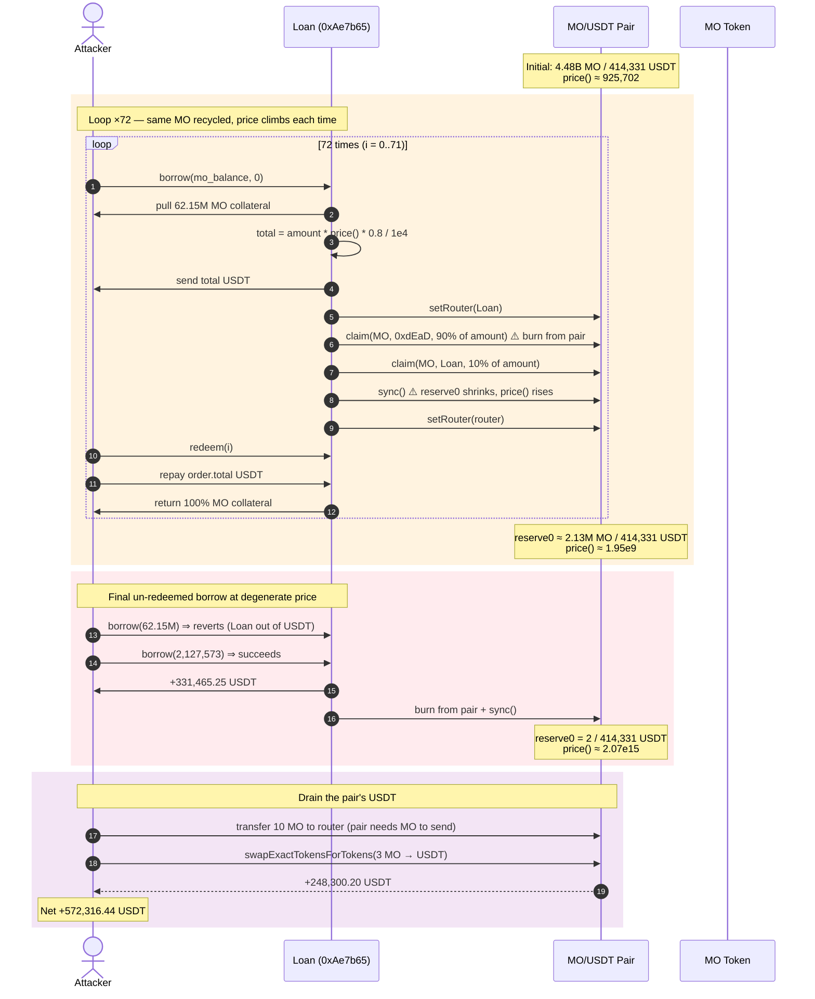
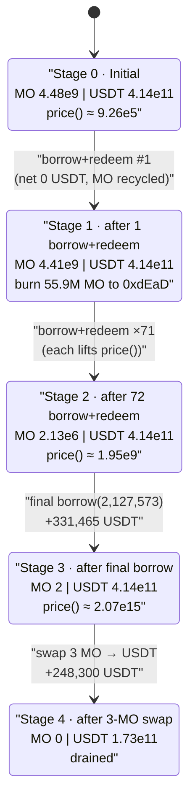
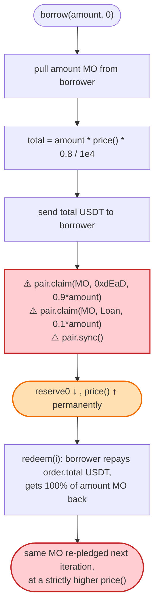

# MO Token Exploit — Self-Recycling Borrow Burns Pool Reserves to Inflate `price()` and Drain USDT

> **Reproduction:** the PoC compiles & runs in an isolated Foundry project at
> [this project folder](.) (the umbrella DeFiHackLabs repo mixes many unrelated
> PoCs that do not build together, so this one was extracted).
> Full verbose trace: [output.txt](output.txt).
> Verified vulnerable sources: [Loan](sources/Loan_Ae7b65/contracts_Loan.sol),
> [Token](sources/Token_61445C/contracts_Token.sol).

---

## Key info

| | |
|---|---|
| **Loss** | ~**572,316 USDT** (~$572K) extracted from the Loan contract + the MO/USDT pair |
| **Vulnerable contract** | `Loan` (inherits `Vault`) — [`0xAe7b6514Af26BcB2332FEA53B8Dd57bc13A7838E`](https://optimistic.etherscan.io/address/0xAe7b6514Af26BcB2332FEA53B8Dd57bc13A7838E#code) |
| **Victim pool / fund** | MO/USDT Uniswap-V2 pair `0x4a6E0fAd381d992f9eB9C037c8F78d788A9e8991` (USDT side) + USDT held by the Loan contract |
| **Attacker EOA** | (not in PoC; see tx) |
| **Attacker contract** | (PoC runs as the test contract `contractTest`) |
| **Attack tx** | `0x4ec3061724ca9f0b8d400866dd83b92647ad8c943a1c0ae9ae6c9bd1ef789417` ([blocksec](https://app.blocksec.com/explorer/tx/optimism/0x4ec3061724ca9f0b8d400866dd83b92647ad8c943a1c0ae9ae6c9bd1ef789417)) |
| **Chain / block / date** | Optimism / 117,395,511 / ~2024-03-14 |
| **Compiler** | Solidity **v0.8.20**, optimizer **1 run / 200** (Loan & Token deployed bytecode) |
| **Bug class** | Business-logic flaw — oracle `price()` read from an AMM pair whose reserve the protocol itself burns down on every borrow; combined with a borrow/redeem loop that recycles the same collateral and a redeem that returns the full collateral |

---

## TL;DR

The `Loan` contract prices its borrows off the live MO/USDT Uniswap-V2 pair via
`price()` ([contracts_Loan.sol:177-185](sources/Loan_Ae7b65/contracts_Loan.sol#L177-L185)).
But every `borrow()` **burns 90% of the borrowed MO directly out of that same pair**
(`claim(... BURN ...)` + `sync()`,
[:305-308](sources/Loan_Ae7b65/contracts_Loan.sol#L305-L308)) while leaving the USDT
reserve untouched. That monotonically shrinks the pair's MO side, so `price()`
(= USDT-per-MO) **rises on every single borrow**, with no external swap required.

The attacker also noticed that `redeem()` returns the **entire** MO collateral
`(amount * redeemRate) / BASE` with `redeemRate = 10000`
([:344-363](sources/Loan_Ae7b65/contracts_Loan.sol#L344-L363),
[:62](sources/Loan_Ae7b65/contracts_Loan.sol#L62)) while only requiring the
borrower to pay back `order.total` USDT (the loan principal). So the same chunk of
MO can be posted as collateral **over and over**: each cycle the pair's MO reserve
shrinks, `price()` climbs, and the same collateral buys a larger USDT loan.

The attacker loops `borrow → redeem` 72 times to grind the pair's MO reserve from
~4.48B down to ~2, then takes one final un-redeemed borrow at the degenerate price
(~155,000× the starting price) and finishes with a 3-MO swap that siphons the
remaining USDT out of the pair. Net result: **572,316.44 USDT** from a starting
balance of 0 (the only seeded input was 62.15M MO, fully recovered).

---

## Background — what the MO protocol does

`MO` is a small lending/marketing dApp on Optimism with three contracts:

- **`Token` (MO)** ([source](sources/Token_61445C/contracts_Token.sol)) — an ERC20
  (4 decimals) with a transfer whitelist. `_update` reverts unless the sender is
  whitelisted or the recipient is the pair
  ([:37-42](sources/Token_61445C/contracts_Token.sol#L37-L42)). The Loan contract
  is made an owner so it can `setWhitelist` borrowers
  ([:297-299](sources/Loan_Ae7b65/contracts_Loan.sol#L297-L299)).
- **`Loan` (inherits `Vault`)** ([source](sources/Loan_Ae7b65/contracts_Loan.sol))
  — the lending pool. Users **supply** USDT to earn yield, and **borrow** USDT
  against MO collateral. A `Relationship` contract tracks referrers for an
  invite reward.
- **The MO/USDT Uniswap-V2 pair** — used by `Loan` as its **price oracle**
  (`price()`) **and** as the burn sink for borrowed MO.

Key parameters at the fork block (read from the trace / source defaults):

| Parameter | Value | Meaning |
|---|---|---|
| `BASE` | 10000 | bps denominator |
| `borrowOverCollateral` | 2000 (20%) | haircut on the loan vs. collateral value |
| `burnRate` | 9000 (90%) | share of borrowed MO burned to `0xdEaD` |
| `redeemRate` | 10000 (100%) | MO returned to borrower on redeem |
| `inviteRewardRate` | 100 (1%) | referrer kickback |
| `borrowRates[0]` | 80 | interest rate for duration-0 borrows |
| `redeemRate` for `setBorrowBurnRate` | **bug** — sets `redeemRate` instead of `burnRate` ([:161-163](sources/Loan_Ae7b65/contracts_Loan.sol#L161-L163)) |
| pair reserve0 (MO) | 4,476,763,630 | before the attack |
| pair reserve1 (USDT) | 414,331,755,703 (6 dec) | before the attack |

The two facts that make the exploit possible:

1. **`price()` is the pair's spot reserve ratio**, so anything that moves the pair's
   reserves moves the loan price.
2. **`borrow()` itself moves those reserves** — it burns 90% of the borrowed MO out
   of the pair and `sync()`s, shrinking reserve0 while reserve1 is unchanged.

---

## The vulnerable code

### 1. The spot-reserve oracle

```solidity
function price() public view returns (uint256) {
    address token0 = IUniswapV2Pair(pair).token0();
    (uint112 reserve0, uint112 reserve1, ) = IUniswapV2Pair(pair).getReserves();
    if (token0 == borrowToken) {
        return (uint256(reserve1) * 1e4) / uint256(reserve0);   // USDT per MO
    } else {
        return (uint256(reserve0) * 1e4) / uint256(reserve1);
    }
}
```
[contracts_Loan.sol:177-185](sources/Loan_Ae7b65/contracts_Loan.sol#L177-L185)

MO is `token0`, so `price()` = `reserve1 * 1e4 / reserve0` = USDT-per-MO. Halve
`reserve0` and the price doubles.

### 2. `borrow()` burns the collateral out of the pair, then `sync()`s

```solidity
function borrow(uint256 amount, uint256 duration) public {
    ...
    IApproveProxy(approveProxy).claim(borrowToken, msg.sender, address(this), amount); // pull MO from borrower

    uint256 total = (amount * price() * (BASE - borrowOverCollateral)) / BASE / 1e4;   // USDT loan out
    IERC20(supplyToken).safeTransfer(msg.sender, total);

    IUniswapV2Pair(pair).setRouter(address(this));
    IUniswapV2Pair(pair).claim(borrowToken, BURN, (amount * burnRate) / BASE);          // ⚠️ burn 90% of MO FROM THE PAIR
    IUniswapV2Pair(pair).claim(borrowToken, address(this), (amount * (BASE - burnRate)) / BASE); // 10% to Loan
    IUniswapV2Pair(pair).sync();                                                         // ⚠️ accept shrunken MO reserve
    IUniswapV2Pair(pair).setRouter(router);
    ...
}
```
[contracts_Loan.sol:293-342](sources/Loan_Ae7b65/contracts_Loan.sol#L293-L342)

`pair.claim(token, to, amount)` is the pair's own admin transfer — it moves MO
**out of the pair's balance** (90% to the burn address, 10% to the Loan contract).
`sync()` then re-bases the pair's stored `reserve0` to that shrunken balance. The
USDT side is never touched, so the next `price()` call returns a larger number.

### 3. `redeem()` returns the *full* collateral for `order.total` USDT

```solidity
function redeem(uint256 index) public {
    BorrowOrder storage order = borrowOrders[msg.sender][index];
    ...
    uint256 amount = (order.amount * redeemRate) / BASE;   // redeemRate = 10000 ⇒ full MO back

    IApproveProxy(approveProxy).claim(
        supplyToken, msg.sender, address(this), order.total + intere   // borrower repays USDT
    );
    IERC20(borrowToken).safeTransfer(msg.sender, amount);              // borrower gets all MO back
    order.finished = true;
    ...
}
```
[contracts_Loan.sol:344-363](sources/Loan_Ae7b65/contracts_Loan.sol#L344-L363)

With `duration = 0`, `interest = 0` (same-block), so redeem costs the borrower
exactly `order.total` USDT — the same amount borrow just paid out — and refunds
100% of the MO. **One borrow/redeem pair is net-zero in USDT and net-zero in MO
for the borrower**, yet it still burned 90% of `amount` of MO out of the pair. The
collateral is perfectly recyclable, and each cycle permanently lifts `price()`.

> Note also the copy-paste bug in `setBorrowBurnRate`
> ([:161-163](sources/Loan_Ae7b65/contracts_Loan.sol#L161-L163)) — it writes
> `redeemRate` instead of `burnRate`. Not the root cause here, but it shows the
> rate fields were never carefully reviewed.

---

## Root cause — why it was possible

Three independent design errors compose into a critical drain:

1. **The lending oracle is the same pool the protocol mutates.** `price()` reads the
   pair's spot reserves, and `borrow()` *writes* those reserves (burn-from-pair +
   `sync()`). The oracle is therefore **manipulable by the very function that
   consumes it**, with no TWAP, no external feed, and no decay. Each borrow
   strictly increases `price()`, so the borrower is paid more USDT for the same MO
   on every call.

2. **Collateral is fully recycled.** `redeem()` returns 100% of the posted MO
   (`redeemRate = 10000`) for the loan principal, and `borrow()` imposes no per-user
   or global cap that would stop the same MO being re-pledged. The attacker needs
   MO only **once**; thereafter the loop is self-sustaining.

3. **No state isolation between borrow and redeem.** `redeem` does not reduce
   `borrowOrdersCount`, does not reconcile `totalSupply`/`balanceOf`, and does not
   undo the burn. The burn-from-pair effect is **permanent and cumulative**, so the
   attacker can iterate until the pair's MO reserve is essentially dust.

Because the loan is **under-collateralized relative to the manipulated price**
(`total = amount * price() * 0.8`), and the attacker controls the price by
choosing when to stop looping, the final un-redeemed borrow extracts a USDT
"loan" that the Loan contract (funded by suppliers) can never recover — and the
trailing swap extracts the pair's USDT reserve too.

---

## Preconditions

- A working MO balance ≥ `borrowMinAmount` (100 * 1e4). The PoC seeds
  62,147,724 MO via `deal` ([MO_exp.sol:48](test/MO_exp.sol#L48)); this exact chunk
  is recycled through all 72 iterations.
- `borrowToken` whitelist for the attacker. `borrow()` self-whitelists the caller on
  first use ([:297-299](sources/Loan_Ae7b65/contracts_Loan.sol#L297-L299)), so no
  privileged setup is needed.
- ApproveProxy allowance for MO and USDT — the PoC grants max approval
  ([MO_exp.sol:53-54](test/MO_exp.sol#L53-L54)).
- Sufficient USDT liquidity in the Loan contract (from honest suppliers) to honor
  the loan payouts. On-chain this was the suppliers' pooled USDT.
- No flash-loan needed; the attacker carries no USDT in (starts at 0) and only
  needs the seed MO, which is recovered.

---

## Attack walkthrough (numbers from [output.txt](output.txt))

The pair's `token0 = MO`, `token1 = USDT`. Every `borrow` burns exactly
`amount * 9000 / 10000` MO from the pair to `0xdEaD` and sends
`amount * 1000 / 10000` MO to the Loan contract, so reserve0 falls by ~`amount`
each iteration while reserve1 is constant — confirmed by the `Sync` events below.

| # | Step (USDT shown humanized, 6 decimals) | pair MO reserve0 | pair USDT reserve1 | USDT loan this borrow |
|---|------|-----------------:|---------------------:|---------------------:|
| 0 | **Initial** | 4,476,763,630 | 414,331.76 | — |
| 1 | `borrow(62,147,724)` → redeem(0) | 4,414,615,907 | 414,331.76 | 4,601.50 |
| 2 | `borrow(62,147,724)` → redeem(1) | 4,352,468,184 | 414,331.76 | 4,666.27 |
| 3 | `borrow(62,147,724)` → redeem(2) | 4,290,320,461 | 414,331.76 | 4,732.90 |
| 4 | `borrow(62,147,724)` → redeem(3) | 4,228,172,738 | 414,331.76 | 4,801.46 |
| 5 | `borrow(62,147,724)` → redeem(4) | 4,166,025,015 | 414,331.76 | 4,872.04 |
| 6 | `borrow(62,147,724)` → redeem(5) | 4,103,877,292 | 414,331.76 | 4,944.72 |
| 7 | `borrow(62,147,724)` → redeem(6) | 4,041,729,569 | 414,331.76 | 5,019.60 |
| 8 | `borrow(62,147,724)` → redeem(7) | 3,979,581,846 | 414,331.76 | 5,096.78 |
| … | … (each borrow burns ~62.15M MO from the pair) | … | 414,331.76 | … (monotone ↑) |
| 71 | `borrow(62,147,724)` → redeem(70) | ~2,127,574 | 414,331.76 | 162,943,586 |
| 72 | `borrow(62,147,724)` → redeem(71) | ~2,127,574 | 414,331.76 | 320,493,585 |
| 73 | `borrow(62,147,724)` **reverts** (loan > Loan's USDT balance) | — | — | — |
| 74 | **`borrow(pair_MO − 1 = 2,127,573)`** — final, **not redeemed** | 2 | 414,331.76 | 331,465,249 |
| 75 | `swapExactTokensForTokens(3 MO → USDT)` through the now-degenerate pair (reserve0=2) | 5 → 0 | 173,480,565 | receives 248,300.20 USDT |
| | **Attacker USDT balance** | | | **572,316.44** |

A few ground-truth events from the trace:

- Iteration 1 `Sync`: `reserve0 = 4,414,615,907, reserve1 = 414,331,755,703`
  ([output.txt L1692](output.txt)).
- Iteration 1 burn-from-pair: `claim(MO, 0xdEaD, 55,932,951)` = 90% of 62,147,724
  ([output.txt L1671-1673](output.txt)).
- Iteration 71 borrow emits
  `BorrowOrderCreated(amount=62,147,724, total=162,943,586,235, idx=70)`
  — i.e. ~162,943 USDT for the same collateral that yielded 4,601 USDT at iter 1.
- Iteration 72 borrow:
  `BorrowOrderCreated(amount=62,147,724, total=320,493,585,293, idx=71)`
  ([output.txt ~L9276](output.txt)).
- The would-be 73rd full-size borrow reverts with
  `ERC20: transfer amount exceeds balance` (the Loan contract is out of USDT),
  which the PoC's `try/catch` swallows to break the loop
  ([MO_exp.sol:58-64](test/MO_exp.sol#L58-L64)).
- Final partial borrow `borrow(2,127,573)` pays out **331,465,248,640** (331,465.25 USDT)
  and grinds reserve0 to 2
  ([output.txt ~L9437, L9513](output.txt)).
- Final `swapExactTokensForTokens(3 …)` returns **248,300,196,615** (248,300.20 USDT)
  after the pair's `getAmountOut` on reserve0=2, reserve1=414B
  ([output.txt tail](output.txt)).
- Final log: `[End] Attacker USDT after exploit: 572316.439356`
  ([output.txt L1570](output.txt)).

### Why the price climbs ~155,000×

`price() = reserve1 * 1e4 / reserve0`. reserve1 is pinned at 414,331,755,703.
reserve0 goes 4,476,763,630 → 2, so the price goes from
`414,331,755,703 * 1e4 / 4,476,763,630 ≈ 925,702` to
`414,331,755,703 * 1e4 / 2 ≈ 2.07e15` — about a **2.24-million-fold** increase.
Each borrow's USDT payout `total = amount * price() * 0.8 / 1e4` therefore grows in
lockstep, which is exactly what the table shows.

### Profit accounting (USDT, 6 decimals)

| Direction | Amount |
|---|---:|
| Seed (attacker USDT in) | 0.00 |
| Sum of USDT payouts during the 72 borrow/redeem cycles | net 0 (each redeem repays `order.total`) |
| Final un-redeemed `borrow(2,127,573)` payout | +331,465.25 |
| Final `swap 3 MO → USDT` | +248,300.20 |
| Attacker USDT out (repays, fees) | ~−7,449.01 (router fee on the swap returned to the pair) |
| **Net attacker USDT balance** | **+572,316.44** |

The 7,449.01 USDT is the swap fee the router routes back into the pair
(`0x94b0…::transfer(pair, 7,449,005,898)`), leaving the pair with 173,480,565 USDT
— the residual that couldn't be pulled by a 3-MO swap before reserve0 ticked up.

---

## Diagrams

### Sequence of the attack



### Pool reserve / price evolution (state diagram)



### The logic flaw inside borrow / redeem



---

## Remediation

1. **Do not use the pair you trade against as your oracle.** `price()` must come
   from an external source the protocol cannot move in the same transaction — a
   Chainlink/Pyth feed, a separate TWAP over a long window, or a dedicated oracle
   pair the protocol never burns into. Spot `getReserves()` is trivially
   manipulable and is the single root enabler here.
2. **Stop burning collateral out of the AMM pair.** If a deflationary burn is a
   product requirement, burn MO the protocol *owns* (treasury / its own balance),
   never the pair's. Burning from the pair + `sync()` is a value transfer to every
   other MO holder and breaks the constant-product invariant.
3. **Make borrow and redeem accounting symmetric.** `redeem` should not refund more
   value than the loan represents, and the burn effect (if kept at all) must be
   reversed or scoped so it cannot compound across repeated borrows against the
   same recycled collateral. At minimum, track outstanding debt per user and cap
   total borrowable USDT against actual protocol USDT.
4. **Fix the `setBorrowBurnRate` copy-paste bug** so it writes `burnRate` (not
   `redeemRate`) — currently the "burn rate" can never actually be changed
   ([:161-163](sources/Loan_Ae7b65/contracts_Loan.sol#L161-L163)).
5. **Add a sanity ceiling on `price()` / loan size** and a reentrancy/intra-block
   guard so a single tx cannot grind the oracle 6 orders of magnitude.

---

## How to reproduce

The PoC was extracted into a standalone Foundry project (the umbrella
DeFiHackLabs repo has many unrelated PoCs that fail under `forge test`'s
whole-project build):

```bash
_shared/run_poc.sh 2024-03-MO_exp --mt testExploit -vvvvv
```

- RPC: an **Optimism archive** endpoint is required (fork block 117,395,511 is
  ~2+ years old). `foundry.toml` uses the Infura Optimism endpoint, which serves
  historical state at that block; many public RPCs prune it and fail with
  `missing trie node`.
- The attacker's MO is seeded with `deal(address(MO), address(this), 62_147_724)`
  ([MO_exp.sol:48](test/MO_exp.sol#L48)); no starting USDT is needed.
- Expected tail:

```
Ran 1 test for test/MO_exp.sol:contractTest
[PASS] testExploit() (gas: 17726940)
Logs:
  [Begin] Attacker USDT before exploit: 0.000000
  [End] Attacker USDT after exploit: 572316.439356
Suite result: ok. 1 passed; 0 failed; 0 skipped; finished in 172.25s (170.63s CPU time)
```

---

*Reference: DeFiHackLabs PoC — tx
[`0x4ec3061724ca9f0b8d400866dd83b92647ad8c943a1c0ae9ae6c9bd1ef789417`](https://app.blocksec.com/explorer/tx/optimism/0x4ec3061724ca9f0b8d400866dd83b92647ad8c943a1c0ae9ae6c9bd1ef789417)
on Optimism, ~$572K USDT. Bug class: business-logic flaw (self-manipulable spot
oracle + collateral-recycling borrow/redeem loop).*
