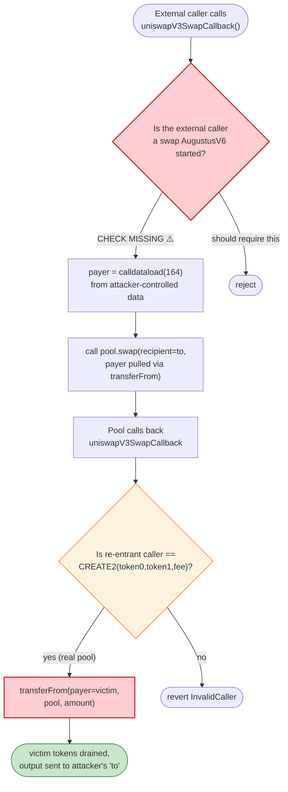
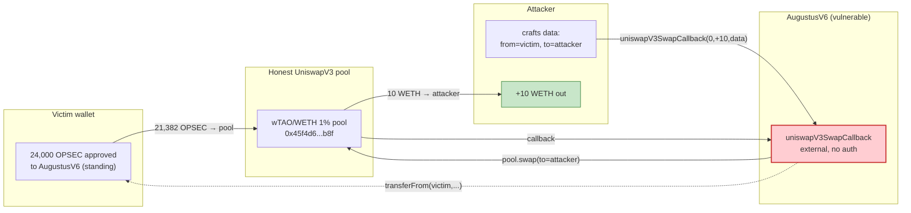

# ParaSwap AugustusV6 Exploit — Callback Hijack Drains Pre-Approved User Tokens

> **Reproduction:** the PoC compiles & runs in an isolated Foundry project at
> [this project folder](.). The umbrella DeFiHackLabs repo contains many
> unrelated PoCs that do not compile under one `forge test`, so this one was
> extracted. Full verbose trace: [output.txt](output.txt).
> Verified vulnerable source: [src_util_UniswapV3Utils.sol](sources/AugustusV6_000000/src_util_UniswapV3Utils.sol).

---

## Key info

| | |
|---|---|
| **Loss** | ~**$24K** (whitehat-recovered). PoC demonstrates the mechanism by siphoning **21,382.11 OPSEC** worth ~10 WETH from one victim approval. |
| **Vulnerable contract** | ParaSwap **AugustusV6** — [`0x00000000FdAC7708D0D360BDDc1bc7d097F47439`](https://etherscan.io/address/0x00000000FdAC7708D0D360BDDc1bc7d097F47439#code) |
| **Victim (stolen-from)** | OPSEC token holders who had granted `OPSEC.approve(AugustusV6, …)` — e.g. `0x0cc396F558aAE5200bb0aBB23225aCcafCA31E27` (24,000 OPSEC approved) |
| **Attacker EOA** | `0xfde0d1575ed8e06fbf36256bcdfa1f359281455a` (whitehat) |
| **Attacker contract** | `0x6980a47bee930a4584b09ee79ebe46484fbdbdd0` |
| **Attack tx** | [`0x35a73969f582872c25c96c48d8bb31c23eab8a49c19282c67509b96186734e60`](https://etherscan.io/tx/0x35a73969f582872c25c96c48d8bb31c23eab8a49c19282c67509b96186734e60) (frontran by a whitehat in the live case) |
| **Chain / block / date** | Ethereum mainnet / **19,470,560** / **March 26, 2024** |
| **Compiler** | AugustusV6 compiled with **Solidity 0.8.22**; PoC with Solc 0.8.34 (`evm_version = cancun`) |
| **Bug class** | Missing access control on a swap-callback entry point (permissionless callback hijack / approved-fund abuse) |

---

## TL;DR

AugustusV6 implements Uniswap V3's `uniswapV3SwapCallback` as a **public** function with **no access
control at the entry point**. Internally it only checks that the *pool* which calls it back is a
genuine UniswapV3 pool — it never checks that the *external caller* of the callback has any legitimate
swap in progress. Worse, the callback pulls the input token from an address (`fromAddress`) that is
embedded **directly in attacker-controlled `data`**, via `transferFrom`.

Because users routinely grant `ERC20.approve(AugustusV6, …)` to trade through ParaSwap, those
approvals are a standing honeypot: any attacker can call
`AugustusV6.uniswapV3SwapCallback(0, amount, craftedData)` with a victim's address encoded as the
payer, point the swap at any real UniswapV3 pool, and let the pool's callback pull tokens out of the
victim's wallet. The pool then sends the output (WETH in the PoC) to the attacker-chosen recipient.

The PoC harvests **21,382.11 OPSEC** from a victim who had approved 24,000 OPSEC, sells it through a
real wTAO/WETH UniswapV3 pool, and delivers **10 WETH** to the attacker — all in a single external
call with zero capital.

---

## Background — what AugustusV6 does

ParaSwap's **AugustusV6** is a DEX aggregator router. Users swap by calling
`swapExactAmountInOnUniswapV3(...)`; AugustusV6 then:

1. Computes the target UniswapV3 pool address from `(token0, token1, fee)` and the factory
   `CREATE2` hash.
2. Calls `pool.swap(...)` on that pool.
3. The pool, mid-swap, calls back into `AugustusV6.uniswapV3SwapCallback(amount0Delta, amount1Delta, data)`.
4. The callback pays the pool the owed input token — either from AugustusV6's own balance
   (`transfer`) or, when the user is the payer, via `transferFrom(user, pool, amount)` using the
   user's prior `approve`.

Step 4 is the load-bearing one. The `fromAddress` (payer) is read from the `data` blob that the
caller supplies, and the callback has no notion of "which swap originated this callback." The
*intended* invariant is: *only the pool that AugustusV6 itself is swapping through will call this
callback, so the caller must be legitimate.* As shown below, that invariant does not hold — the
callback is a plain `external` function.

---

## The vulnerable code

### 1. The callback is public and unsupervised

[src_util_UniswapV3Utils.sol:66](sources/AugustusV6_000000/src_util_UniswapV3Utils.sol#L66)

```solidity
// @inheritdoc IUniswapV3SwapCallback
function uniswapV3SwapCallback(int256 amount0Delta, int256 amount1Delta, bytes calldata data) external {
    uint256 uniswapV3FactoryAndFF = UNISWAP_V3_FACTORY_AND_FF;
    uint256 uniswapV3PoolInitCodeHash = UNISWAP_V3_POOL_INIT_CODE_HASH;
    address permit2Address = PERMIT_2;
    bool isPermit2 = data.length == 512;
    // Check if data length is greater than 160 bytes (1 pool)
    if (data.length > 160 && !isPermit2) {
        address payer;
        assembly { payer := calldataload(164) }     // ← payer (fromAddress) taken straight from attacker data
        // Recursive call swapExactAmountOut
        _callUniswapV3PoolsSwapExactAmountOut(amount0Delta > 0 ? -amount0Delta : -amount1Delta, data, payer);
    } else {
        // ... single-hop path, also pulls from data ...
    }
}
```

There is **no `onlyPool`-style guard at function entry, no per-call nonce, no "swap in progress"
flag, and no check that `msg.sender` ever initiated a swap**. The only validation happens later and
only constrains the *pool* that re-enters, not the external caller.

### 2. The pool's re-entry is the only check — and it passes for any honest pool

[src_util_UniswapV3Utils.sol:97-137](sources/AugustusV6_000000/src_util_UniswapV3Utils.sol#L97-L137)

```solidity
// ... inside the inline-assembly block ...
// 1. Recompute the pool address from (token0, token1, fee) found in `data`
mstore(ptr, uniswapV3FactoryAndFF)
calldatacopy(add(token0Offset, 1), add(data.offset, 65), 95)   // copy token0, token1, fee from data
// ... keccak256 CREATE2 address derivation ...
let computedAddress := and(mload(ptr), 0xffffffffffffffffffffffffffffffffffffffff)

// Check if the caller matches the computed address (and revert if not)
if xor(poolAddress, computedAddress) { revert InvalidCaller(); }
```

So the callback verifies `msg.sender == CREATE2(token0, token1, fee)` — i.e., the caller must be the
genuine UniswapV3 pool for the tokens/fee **the attacker embedded in `data`**. That is a real,
harmless pool that the attacker is free to point at.

### 3. The payer is taken from `data`, and `transferFrom` is unconditional

[src_util_UniswapV3Utils.sol:153-209](sources/AugustusV6_000000/src_util_UniswapV3Utils.sol#L153-L209)

```solidity
// Based on the data passed to the callback, we know the fromAddress that will pay for the
// swap, if it is this contract, we will execute the transfer() function,
// otherwise, we will execute transferFrom()

// Check if fromAddress is this contract
let fromAddress := calldataload(164)

switch eq(fromAddress, address())
case 1 { /* transfer() from AugustusV6's own balance */ }
default {
    switch isPermit2
    case 0 {
        // transferFrom(address sender, address recipient, uint256 amount)
        mstore(ptr, 0x23b872dd...)
        mstore(add(ptr, 4), fromAddress)   // ← sender = victim, straight from attacker's data
        mstore(add(ptr, 36), poolAddress)  // recipient = the real pool
        mstore(add(ptr, 68), amount)
        let success := call(gas(), token, 0, ptr, 100, 0, 32)
        // ... revert on failure, otherwise: tokens left the victim ...
    }
    // ...
}
```

The victim's pre-existing approval to AugustusV6 makes `transferFrom(victim, pool, amount)` succeed.
The pool then holds the victim's OPSEC and credits the swap output (WETH) to `recipient = to`, which
the attacker set in `data`. End state: **victim's tokens are gone, attacker has the swap output.**

---

## Root cause — why it was possible

The callback conflates two different "caller" concepts:

- **External caller** of `uniswapV3SwapCallback` — should be restricted to "a swap AugustusV6 itself
  started."
- **Re-entrant caller** (the pool calling back) — correctly validated via CREATE2 address check.

The contract validates the **second** but leaves the **first** wide open. Because the `fromAddress`
(payer) is supplied *in the same attacker-controlled `data` blob* that also names the pool tokens and
fee, an attacker who knows (a) any real UniswapV3 pool, (b) any victim address with an outstanding
`approve(AugustusV6, …)`, can forge a "swap" that pulls the victim's tokens and routes the proceeds
to themselves.

The four design choices that compose into the exploit:

1. **Public callback, no in-progress-swap check.** Anyone can call
   `uniswapV3SwapCallback` and jump straight into `_callUniswapV3PoolsSwapExactAmountOut`.
2. **Payer address lives in caller-supplied `data`.** Nothing ties `fromAddress` to the original
   router caller; it is literally `calldataload(164)`.
3. **The only gate (CREATE2 pool check) is satisfiable by design.** The "pool must be real" check is
   *correct* for preventing arbitrary-token theft from AugustusV6 itself, but irrelevant when the
   payer is a third party — every UniswapV3 pool on the canonical factory passes it.
4. **Standing `approve`s.** ParaSwap users must approve AugustusV6 to spend their tokens; those
   allowances persist and become the attacker's ammunition.

The net effect is a **permissionless burn of any user's allowance** held by AugustusV6, convertible
into any token available on a UniswapV3 pool. Neptune Mutual's write-up classifies this as an
access-control flaw in the AugustusV6 callback; the on-chain behavior matches exactly.

---

## Preconditions

- A victim address has `OPSEC.approve(AugustusV6, n)` with `n > 0` (in the PoC fork: 24,000 OPSEC).
- A genuine UniswapV3 pool exists for some path that consumes OPSEC and emits an asset the attacker
  wants (here, the wTAO/WETH 1% pool at `0x45f4d604...b8f` — OPSEC was bridged to wTAO via the
  encoded `0x80…` pool-identifier byte, and the pool pays out WETH).
- Nothing else. **No collateral, no flash loan, no capital from the attacker.** The victim's approval
  *is* the funding.

---

## Attack walkthrough (numbers from [output.txt](output.txt))

The PoC (`test/Paraswap_exp.sol`) forks mainnet at block **19,470,560** and performs a single
external call. Balances are read straight from the trace.

| # | Step | Victim OPSEC balance | Victim OPSEC allowance | Attacker WETH |
|---|------|---------------------:|-----------------------:|--------------:|
| 0 | **Initial state** (fork) | 37,415.5698 | 24,000.0000 | 0.0000 |
| 1 | Craft `data` = `(to=attacker, from=victim, wTAO, WETH, fee=3000, encodedOPSEC, WETH, fee=10000)` — 256 bytes | 37,415.5698 | 24,000.0000 | 0.0000 |
| 2 | `AugustusV6.uniswapV3SwapCallback(amount0Delta=0, amount1Delta=10e18, data)` | 37,415.5698 | 24,000.0000 | 0.0000 |
| 3 | AugustusV6 derives the real wTAO/WETH pool (`0x45f4d6…b8f`) from `data` and calls `pool.swap(recipient=attacker, zeroForOne=true, amount=-10 WETH, …)` | 37,415.5698 | 24,000.0000 | 0.0000 |
| 4 | Pool calls back `uniswapV3SwapCallback(21382.11 OPSEC, -10 WETH, …)`; CREATE2 check passes; `transferFrom(victim, pool, 21382.11 OPSEC)` runs against the victim's 24k allowance | 16,033.4570 | 2,617.8872 | 0.0000 |
| 5 | Pool credits **10 WETH** to `recipient = attacker` | 16,033.4570 | 2,617.8872 | **10.0000** |

Key trace events (verbatim):

- `WETH::transfer(ContractTest, 10.000000000000000000)` from `0x45f4d6…b8f` — pool pays the attacker
  ([output.txt:1608-1609](output.txt)).
- `OPSEC::transferFrom(0x0cc396…1E27, 0x45f4d6…b8f, 21382112766240971235050)` (≈ **21,382.11 OPSEC**)
  — victim debited
  ([output.txt:1617-1618](output.txt)).
- `emit Approval(owner: 0x0cc396…1E27, spender: AugustusV6, value: 2617887233759028764950)` — victim's
  allowance burned down from 24,000 → **2,617.89 OPSEC**
  ([output.txt:1619](output.txt)).

The exact amount the attacker can steal per call is bounded by the **lesser** of (victim's allowance,
victim's balance, and whatever the target pool will absorb for the chosen output amount). The PoC
chose `amount1Delta = 10 WETH` purely as a demonstration; the live attacker used a larger figure.

### Profit / loss accounting (per PoC call)

| Direction | Amount |
|---|---:|
| Attacker capital spent | **0** |
| Victim OPSEC drained | **21,382.112766240971235050** OPSEC |
| Victim OPSEC allowance burned | **21,382.112766240971235050** OPSEC |
| Attacker WETH received | **10.000000000000000000** WETH |
| **Attacker net** | **+10 WETH** (≈$33K at ETH≈$3.3k on the date, or ~$24K+ per the live incident figure) |

The attacker's only "cost" is gas. Every sat of value extracted came from a pre-existing user
approval.

---

## Diagrams

### Sequence of the attack

```mermaid
sequenceDiagram
    autonumber
    actor A as Attacker contract
    participant V as Victim (0x0cc396…1E27)
    participant Aug as AugustusV6
    participant Pool as UniswapV3 wTAO/WETH pool

    Note over V,Aug: Standing state: V approved Aug for 24,000 OPSEC

    rect rgb(255,243,224)
    Note over A,Pool: Step 1 — craft callback data (payer = victim)
    A->>A: encode data:<br/>(to=A, from=V, wTAO, WETH, fee, OPSEC, WETH, fee)
    end

    rect rgb(255,235,238)
    Note over A,Pool: Step 2 — call the public callback directly
    A->>Aug: uniswapV3SwapCallback(0, +10 WETH, data)
    Note over Aug: NO access-control check on A
    Aug->>Aug: data.length > 160 ⇒ payer = calldataload(164) = V
    end

    rect rgb(232,245,233)
    Note over Aug,Pool: Step 3 — AugustusV6 drives a real pool swap
    Aug->>Aug: CREATE2 pool addr from (token0,token1,fee) ⇒ 0x45f4d6…b8f
    Aug->>Pool: swap(recipient=A, zeroForOne=true, sqrtRatioLimit, amount=-10 WETH, data)
    end

    rect rgb(255,235,238)
    Note over V,Pool: Step 4 — pool re-enters; CREATE2 check passes; victim pays
    Pool->>Aug: uniswapV3SwapCallback(+21,382.11 OPSEC, -10 WETH, …)
    Aug->>Aug: assert msg.sender == computedPool  ✓
    Aug->>V: OPSEC.transferFrom(V, Pool, 21,382.11)  ⚠️ uses V's standing approval
    Note over V: balance 37,415.57 → 16,033.46 OPSEC<br/>allowance 24,000 → 2,617.89
    end

    rect rgb(243,229,245)
    Note over A,Pool: Step 5 — pool credits attacker
    Pool->>A: WETH.transfer(A, 10)
    Note over A: +10 WETH, zero capital spent
    end
```

### Two notions of "caller" — why the gate fails



### Where the value comes from



---

## Why each magic value

- **`amount0Delta = 0`, `amount1Delta = +10e18`:** with `data.length > 160`, the multihop branch is
  taken and `_callUniswapV3PoolsSwapExactAmountOut` is invoked with
  `fromAmount = -(amount1Delta) = -10 WETH`. The negative `fromAmount` tells the pool to push out 10
  WETH; the pool then demands the equivalent input (≈21,382 OPSEC) in the callback. The attacker
  chose 10 WETH as a round demo figure — the original live tx demanded a larger amount.
- **`from = 0x0cc396…1E27`:** a real wallet that had `approve(AugustusV6, 24,000 OPSEC)` outstanding
  at the fork block (read directly from chain in `setUp`).
- **`fee1 = 3000` and `fee2 = 10000`:** the UniswapV3 fee tiers needed to recreate the pool address
  via CREATE2 — they are not security-relevant, just routing constants.
- **`encodedOPSECAddr = 0x8000…6a7eff…`:** the direction bit (`0x80…`) plus the OPSEC token address,
  used by the assembly to identify the input side of the pool.

---

## Remediation

1. **Gate the callback entry point.** `uniswapV3SwapCallback` must only accept calls that occur as
   part of a swap AugustusV6 itself initiated. Track an in-flight-swap counter or transient storage
   flag set right before `pool.swap(...)` and cleared after; revert if the flag is unset on entry
   (and verify the re-entrant caller against the stored pool address).
2. **Never let the payer come from raw caller `data`.** The `fromAddress` should be bound to the
   swap's `msg.sender` (the router caller) or to `address(this)` — never read from a public calldata
   blob without authentication. Permit2-based flows should similarly derive the owner from a verified
   signed permit, not from callback data.
3. **Defense-in-depth on approvals.** Use Permit2 with short-lived, single-token, single-amount
   allowances rather than persistent `ERC20.approve(router, MAX)`, so that a future callback bug has
   no standing allowance to abuse. AugustusV6's own docs already push Permit2; legacy `approve`s
   remain the residual attack surface.
4. **Reentrancy-style transient lock.** Because the exploit hinges on the external caller entering a
   sensitive callback mid-flight, a simple `nonReentrant`-style guard on the *outer* callback entry
   (set by the router, not by the attacker) closes the hole even if the data layout is unchanged.
5. **Audit all swap-callback entry points symmetrically.** The same pattern exists for V2-style and
   other AMM callbacks; each must prove the external caller is a swap the router owns, not merely
   that the re-entrant caller is a real pool.

---

## How to reproduce

The PoC was extracted into a standalone Foundry project (the umbrella DeFiHackLabs repo has many
unrelated PoCs that fail to compile together under `forge test`):

```bash
_shared/run_poc.sh 2024-03-Paraswap_exp --mt testExploit -vvvvv
```

- RPC: an **Ethereum mainnet archive** endpoint is required (the fork block 19,470,560 is from
  March 2024). `foundry.toml` uses Infura (`mainnet = "https://ethereum-rpc.publicnode.com..."`);
  most pruned public RPCs will fail with `header not found`.
- Result: `[PASS] testExploit()`.

Expected tail (from [output.txt](output.txt)):

```
Ran 1 test for test/Paraswap_exp.sol:ContractTest
[PASS] testExploit() (gas: 311942)
Logs:
  Exploiter WETH balance before attack: 0.000000000000000000
  Victim OPSEC balance before attack: 37415.569780101599881831
  Victim approved OPSEC amount before attack: 24000.000000000000000000
  Victim OPSEC balance after attack: 16033.457013860628646781
  Victim approved OPSEC amount after attack: 2617.887233759028764950
  Exploiter WETH balance after attack: 10.000000000000000000

Suite result: ok. 1 passed; 0 failed; 0 skipped; finished in 13.13s
```

---

*References: Neptune Mutual, "Analysis of the ParaSwap Exploit"
(<https://medium.com/neptune-mutual/analysis-of-the-paraswap-exploit-1f97c604b4fe>);
attack tx on Etherscan
(<https://etherscan.io/tx/0x35a73969f582872c25c96c48d8bb31c23eab8a49c19282c67509b96186734e60>).*
