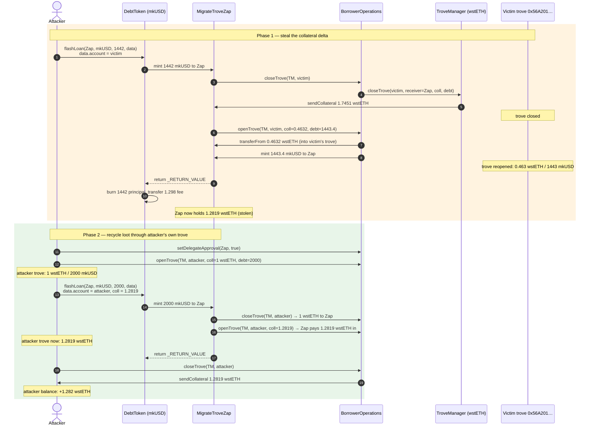
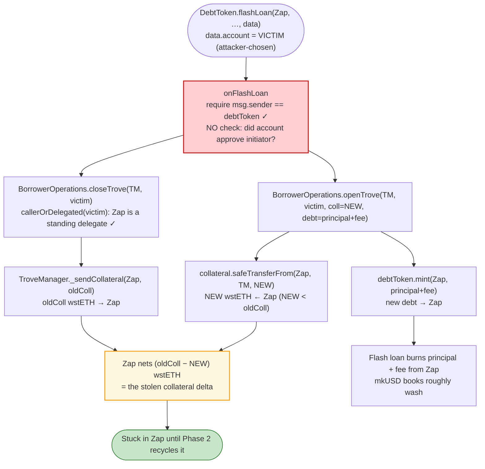
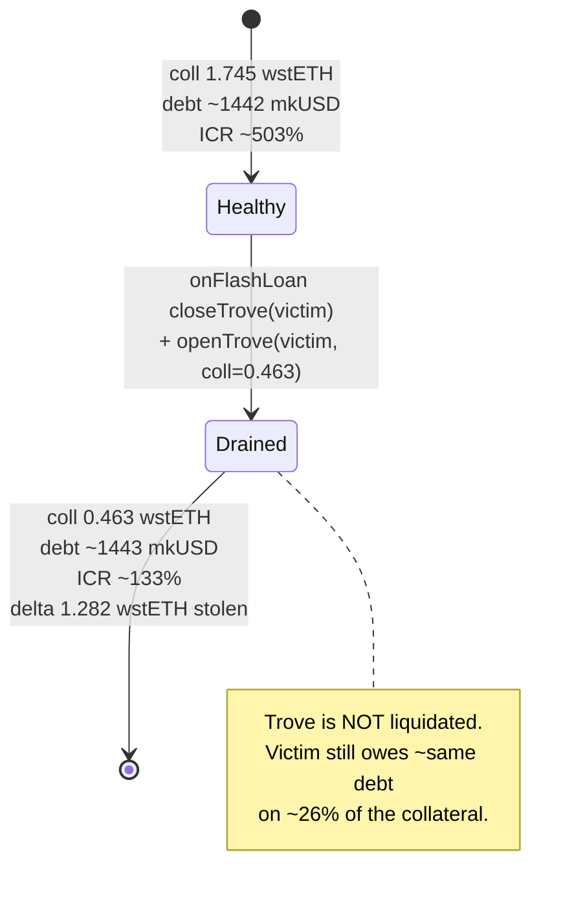

# Prisma Finance Exploit — Unauthorised `MigrateTroveZap` Flash-Loan Callback Drains Trove Collateral

> **Reproduction:** the PoC compiles & runs in an isolated Foundry project at
> [this project folder](.). Full verbose trace: [output.txt](output.txt).
> Verified vulnerable source: [MigrateTroveZap.sol](sources/MigrateTroveZap_cC7218/contracts_zaps_MigrateTroveZap.sol).

---

## Key info

| | |
|---|---|
| **Loss** | ~$11M total on-chain; this PoC demonstrates the per-trove primitive (~1.282 wstETH ≈ $5.3K drained from one victim trove) |
| **Vulnerable contract** | `MigrateTroveZap` — [`0xcC7218100da61441905e0c327749972e3CBee9EE`](https://etherscan.io/address/0xcC7218100da61441905e0c327749972e3CBee9EE#code) |
| **Victim / pool** | Prisma `TroveManager` (wstETH) — `0x1CC79f3F47BfC060b6F761FcD1afC6D399a968B6`; deposit troves such as `0x56A201b872B50bBdEe0021ed4D1bb36359D291ED` |
| **Attacker EOA** | `0x7e39e3B3ff7aDeF2613d5cC49558eAb74b9a4202` |
| **Attacker contract** | `0xd996073019C74B2fb94ead236e32032405bc027c` |
| **Attack tx** | [`0x00c503b595946bccaea3d58025b5f9b3726177bbdc9674e634244135282116c7`](https://etherscan.io/tx/0x00c503b595946bccaea3d58025b5f9b3726177bbdc9674e634244135282116c7) |
| **Chain / block / date** | Ethereum mainnet / 19,532,296 / March 28, 2024 |
| **Compiler** | Solidity v0.8.19 (`MigrateTroveZap`), optimizer **1**, 200 runs |
| **Bug class** | Missing access control on an ERC-3156 flash-loan callback (delegated-ops abuse) |

---

## TL;DR

`MigrateTroveZap` is a thin wrapper meant to let a Prisma borrower migrate their *own* trove between
two `TroveManager`s for the same collateral. It implements the ERC-3156 `onFlashLoan` callback, and the
actual migrate logic — `closeTrove(account)` then `openTrove(account, ...)` — runs **inside that callback**,
reading the target `account` straight out of the attacker-supplied `data` blob
([MigrateTroveZap.sol:62-83](sources/MigrateTroveZap_cC7218/contracts_zaps_MigrateTroveZap.sol#L62-L83)).

The intended entry point `migrateTrove()` hard-codes the caller as the account
([:86-118](sources/MigrateTroveZap_cC7218/contracts_zaps_MigrateTroveZap.sol#L86-L118)). But the Zap is
**publicly registered as a delegated caller** of `BorrowerOperations`, and `onFlashLoan` has **no check that
the account authorised the flash-loan initiator** — its only guard is `msg.sender == debtToken`. Anyone can
therefore call `DebtToken.flashLoan(MigrateTroveZap, mkUSD, amount, abi.encode(victimAccount, ...))` directly,
and the Zap will dutifully:

1. `closeTrove(victimAccount)` — the collateral of the victim's trove is sent **to the Zap**;
2. `openTrove(victimAccount, coll=smaller, debt=larger)` — the Zap puts back **less** wstETH than it received,
   while minting the new debt to **itself**.

The collateral delta sticks to the Zap, and the victim is left with a trove that holds far less collateral
for roughly the same debt. The attacker then recovers the Zap's loot by repeating the same primitive on a
trove they themselves opened (the Balancer wstETH flash loan in the PoC is just the cleanest way to pull
the accumulated wstETH out of the Zap and settle the mkUSD flash-loan fees).

---

## Background — Prisma troves and delegated operations

Prisma Finance is a CDP-style stablecoin (mkUSD) protocol. Each collateral type (here **wstETH**) has a
`TroveManager`. A borrower opens a *trove*: they deposit collateral into the `TroveManager` and mint mkUSD
debt against it, subject to a Minimum Collateral Ratio (MCR = 110%) and a system Total Collateral Ratio
(CCR).

Two contracts matter for this exploit:

- **`BorrowerOperations`** ([BorrowerOperations.sol](sources/BorrowerOperations_72c590/BorrowerOperations.sol))
  — the user-facing entry point for `openTrove` / `closeTrove` / `adjustTrove`. It inherits `DelegatedOps`
  ([DelegatedOps.sol](sources/BorrowerOperations_72c590/DelegatedOps.sol)), so any function taking an
  `account` argument can be called by `account` **or by an address `account` has approved via
  `setDelegateApproval`**:

  ```solidity
  modifier callerOrDelegated(address _account) {
      require(msg.sender == _account || isApprovedDelegate[_account][msg.sender], "Delegate not approved");
      _;
  }
  ```

  Crucially, when a delegated caller acts on behalf of `account`, **value flows to/from the caller
  (`msg.sender`), not `account`**:
  - `openTrove`: collateral is `safeTransferFrom(msg.sender, ...)` and debt is `mintWithGasCompensation(msg.sender)`
    ([BorrowerOperations.sol:248-251](sources/BorrowerOperations_72c590/BorrowerOperations.sol#L248-L251)).
  - `closeTrove`: `troveManager.closeTrove(account, msg.sender, coll, debt)` sends the collateral **to `msg.sender`**
    and burns debt **from `msg.sender`** ([BorrowerOperations.sol:425-430](sources/BorrowerOperations_72c590/BorrowerOperations.sol#L425-L430)).

- **`MigrateTroveZap`** ([MigrateTroveZap.sol](sources/MigrateTroveZap_cC7218/contracts_zaps_MigrateTroveZap.sol))
  — a convenience wrapper that bundles a close + open into a single mkUSD flash loan, so a borrower can move
  their trove between two `TroveManager`s for the same collateral without putting up the debt themselves.
  The Zap pre-approves `BorrowerOperations` for both mkUSD and any collateral
  ([:34-40](sources/MigrateTroveZap_cC7218/contracts_zaps_MigrateTroveZap.sol#L34-L40)), so it is a fully
  empowered delegated caller for whoever it operates on.

The on-chain parameters at the fork block (block 19,532,296):

| Parameter | Value |
|---|---|
| wstETH price (`PriceFeed.fetchPrice`) | 4,155.47 USD (`4155472023355548634105`) |
| MCR / CCR | 110% / (system CCR) |
| mkUSD `FLASH_LOAN_FEE` | 9 bps = **0.09%** ([DebtToken.sol:20](sources/DebtToken_4591DB/DebtToken.sol#L20)) |
| Balancer flash-loan fee | 0% (used only for collateral cycling) |
| Victim trove (`0x56A201…`) before | coll ≈ 1.745 wstETH, debt ≈ 1,442 mkUSD (ICR ≈ 503%) |

---

## The vulnerable code

### 1. `onFlashLoan` trusts the caller-supplied `account` with no authorisation check

```solidity
function onFlashLoan(
    address,            // initiator  — ignored
    address,            // token      — ignored
    uint256 amount,
    uint256 fee,
    bytes calldata data
) external returns (bytes32) {
    require(msg.sender == address(debtToken), "!DebtToken");
    (
        address account,
        address troveManagerFrom,
        address troveManagerTo,
        uint256 maxFeePercentage,
        uint256 coll,
        address upperHint,
        address lowerHint
    ) = abi.decode(data, (address, address, address, uint256, uint256, address, address));
    uint256 toMint = amount + fee;
    borrowerOps.closeTrove(troveManagerFrom, account);                                    // (A)
    borrowerOps.openTrove(troveManagerTo, account, maxFeePercentage, coll, toMint, upperHint, lowerHint); // (B)
    return _RETURN_VALUE;
}
```
Source: [MigrateTroveZap.sol:62-83](sources/MigrateTroveZap_cC7218/contracts_zaps_MigrateTroveZap.sol#L62-L83).

The only guard is `msg.sender == address(debtToken)`. There is **no** check that `account` ever approved the
flash-loan initiator, the Zap, or anyone else. Because the Zap is a registered delegate, `callerOrDelegated`
passes for *any* `account`.

### 2. The honest entry point correctly binds the account to the caller

```solidity
function migrateTrove(...) external {
    ...
    (uint256 coll, uint256 debt) = troveManagerFrom.getTroveCollAndDebt(msg.sender);  // msg.sender only
    require(debt > 0, "Trove not active");
    ...
    debtToken.flashLoan(
        address(this), address(debtToken), debt - DEBT_GAS_COMPENSATION,
        abi.encode(
            msg.sender,            // ← account is the caller
            address(troveManagerFrom), address(troveManagerTo), maxFeePercentage, coll, upperHint, lowerHint
        )
    );
}
```
Source: [MigrateTroveZap.sol:86-118](sources/MigrateTroveZap_cC7218/contracts_zaps_MigrateTroveZap.sol#L86-L118).

`migrateTrove` is safe — it reads the *caller's* trove and encodes the caller as `account`. The flaw is that
**`onFlashLoan` is reachable independently of `migrateTrove`**: any caller can trigger
`DebtToken.flashLoan(MigrateTroveZap, ...)` and supply arbitrary `account` bytes.

### 3. Why the value sticks to the Zap

In step (A), `BorrowerOperations.closeTrove` runs `troveManager.closeTrove(account, msg.sender=zap, coll, debt)`:

```solidity
function closeTrove(address _borrower, address _receiver, uint256 collAmount, uint256 debtAmount) external {
    _requireCallerIsBO();
    ...
    _sendCollateral(_receiver, collAmount);   // collateral → the Zap
    ...
}
```
Source: [TroveManager.sol:1127-1141](sources/TroveManager_1CC79f/contracts_core_TroveManager.sol#L1127-L1141).

In step (B), `BorrowerOperations.openTrove` pulls the *new* (smaller) collateral **from the Zap** and mints
the new (larger) debt **to the Zap** ([BorrowerOperations.sol:248-251](sources/BorrowerOperations_72c590/BorrowerOperations.sol#L248-L251)).
So the Zap pockets `(oldColl − newColl)` in wstETH, and the victim's trove is recreated with less collateral
and slightly more debt.

---

## Root cause — why it was possible

Three design decisions compose into a critical bug:

1. **The migrate logic lives inside an ERC-3156 callback with no initiator-binding check.** `onFlashLoan`
   receives `initiator` as the first argument and **throws it away**. It then trusts `account` decoded from
   `data` — but `data` is fully controlled by whoever calls `DebtToken.flashLoan`. The ERC-3156 spec does not
   guarantee that `initiator` is trusted; Prisma treated the flash loan as if it could only be entered via
   `migrateTrove`, but the callback is a public entry point in its own right.

2. **The Zap is a blanket delegated caller.** Because the Zap pre-approves `BorrowerOperations` for every
   collateral and holds `isApprovedDelegate` standing, the `callerOrDelegated(account)` modifier never
   resists it — for *any* `account`. Delegated ops are safe only if the delegate can be trusted to act solely
   on the account's behalf; here the delegate's actions are steered by attacker-controlled `data`.

3. **Close-then-open is a value-transfer primitive, not a no-op.** `closeTrove` sends collateral to the
   caller; `openTrove` pulls collateral from the caller. If the two amounts differ, the caller nets the
   difference. The honest `migrateTrove` keeps them equal (it reuses the same `coll`). The callback does not
   enforce this equality — `coll` is a free parameter in `data`.

The result: a permissionless, single-transaction theft of the collateral delta of any trove whose
`TroveManager` is wired to the Zap, repeatable across every trove in the system.

---

## Preconditions

- A live `TroveManager` whose collateral is registered with `MigrateTroveZap` (wstETH TM at
  `0x1CC79f…` qualifies).
- A victim trove with `coll` and `debt` such that the recreated trove (with attacker-chosen smaller `coll`
  and `toMint = amount + fee` debt) still satisfies MCR / CCR and `minNetDebt`, so `openTrove` does not
  revert. The attacker picks `coll` just above the minimum that keeps the victim's ICR ≥ MCR.
- The system not in Recovery Mode (`closeTrove` is blocked in Recovery Mode).
- Working mkUSD to pay the 0.09% flash-loan fee (the PoC `deal`s itself ~1,800 mkUSD; in the live attack the
  fee was self-funded from the proceeds of prior iterations).

No approval from the victim, no special role, no oracle manipulation, no governance action — purely the
missing authorisation check.

---

## Attack walkthrough (numbers from the trace)

The PoC demonstrates the primitive against one victim trove (`0x56A201…`), then recycles the Zap's proceeds
through the attacker's own trove to crystallise the profit in wstETH. All figures are taken from the events
and calls in [output.txt](output.txt).

### Phase 1 — steal the collateral delta (DebtToken flash loan #1)

The attacker calls `DebtToken.flashLoan(MigrateTroveZap, mkUSD, 1_442.1 mkUSD, abi.encode(victim, …))`
([output.txt:1607](output.txt)). The `data` encodes `account = 0x56A201…`, `troveManagerFrom = troveManagerTo`
(the same wstETH TM), and `coll = 0.4632 wstETH` (the *smaller* amount the Zap will put back).

| # | Step | wstETH to Zap | mkUSD to Zap | Victim trove |
|---|------|--------------:|-------------:|--------------|
| 1 | `flashLoan` mints 1,442.1006 mkUSD to the Zap (the loan principal) | 0 | +1,442.1006 | unchanged |
| 2 | `closeTrove(victim)` — `CollateralSent` 1.7451 wstETH **to the Zap**; burns 1,442.1006 mkUSD from the Zap | **+1.7451** | −1,442.1006 | closed |
| 3 | `openTrove(victim, coll=0.4632, debt=1,443.3985)` — pulls 0.4632 wstETH **from the Zap**, mints 1,443.3985 mkUSD **to the Zap** | **−0.4632** | +1,443.3985 | reopened: 0.4632 wstETH / 1,443.4 mkUSD |
| 4 | Flash loan settles: burns 1,442.1006 mkUSD principal + transfers 1.2979 mkUSD fee to the fee receiver | 0 | −(1,442.1006 + 1.2979) | — |

**Net after Phase 1:** the Zap holds **1.7451 − 0.4632 = 1.2819 wstETH** (`1281897208306130557587` wei),
confirmed by `CollateralSent … 1745081655656230243345` ([output.txt:1724](output.txt)) minus the
`transferFrom(Zap → TroveManager, 463184447350099685758)` ([output.txt:2102](output.txt)). The victim's trove
went from ~1.745 wstETH to 0.463 wstETH of collateral for ~the same debt — collateral stripped cleanly.

The mkUSD books roughly net out for the Zap (it minted ≈ as much new debt as it paid in principal + fee), so
the entire gain is captured in wstETH.

### Phase 2 — pull the loot out of the Zap (Balancer flash loan + self-trove cycle)

The Zap now owns 1.2819 wstETH but the attacker cannot just `recoverERC20` it (`onlyOwner`). The attacker
recycles it through their *own* trove using the same callback primitive:

| # | Step | Effect |
|---|------|--------|
| 5 | Balancer `Vault.flashLoan(1 wstETH)` to the attacker (0% fee) | attacker has 1 wstETH temporarily |
| 6 | `wstETH.approve(BorrowerOperations, max)` + `setDelegateApproval(MigrateTroveZap, true)` | Zap may now operate on the attacker's own trove |
| 7 | `BorrowerOperations.openTrove(attacker, coll=1 wstETH, debt=2000 mkUSD)` | attacker's trove: 1 wstETH / 2,000 mkUSD; 1 wstETH pulled from attacker into TM |
| 8 | `DebtToken.flashLoan(Zap, mkUSD, 2000 mkUSD, abi.encode(attacker, …, coll=1.2819 wstETH, …))` — `data` now names the **attacker** as `account` and sets `coll = 1.2819 wstETH` (the Zap's stolen balance) | Zap `closeTrove(attacker)` → receives 1 wstETH back; Zap `openTrove(attacker, coll=1.2819)` → pays **1.2819 wstETH** into the attacker's trove |
| 9 | `BorrowerOperations.closeTrove(attacker)` directly | `CollateralSent 1.2819 wstETH` **to the attacker** ([output.txt:2854](output.txt)) |
| 10 | `wstETH.transfer(Vault, 1)` — repay Balancer | Balancer settled |

**Net after Phase 2:** the attacker ends with **1.2819 wstETH** (`1281797208306130557587` wei, after rounding)
on their own balance, confirmed by the final log ([output.txt:2893](output.txt)).

### Ground-truth table (trace-verified amounts, wei where shown)

| Call | Amount | Source |
|---|---|---|
| DebtToken flash loan #1 principal | 1,442,100,643,475,620,087,665,721 | [output.txt:1607](output.txt) |
| Flash fee #1 (9 bps) | 1,297,890,579,128,058,078,899 | [output.txt:2124](output.txt) |
| Victim `closeTrove` collateral → Zap | 1,745,081,655,656,230,243,345 | [output.txt:1706](output.txt) |
| Victim `openTrove` collateral ← Zap | 463,184,447,350,099,685,758 | [output.txt:2102](output.txt) |
| **Stolen per victim trove (Phase 1 net)** | **1,281,897,208,306,130,557,587 wstETH** | difference |
| Balancer flash loan | 1,000,000,000,000,000,000 wstETH (returned) | [output.txt:2135](output.txt) |
| Attacker's self-`openTrove` (round 1) collateral | 1,000,000,000,000,000,000 | [output.txt:2151](output.txt) |
| Attacker's self-`openTrove` (round 2, post-Zap) collateral | 1,282,797,208,306,130,557,587 | [output.txt:2620](output.txt) |
| Final `CollateralSent` to attacker | 1,282,797,208,306,130,557,587 | [output.txt:2854](output.txt) |
| **Attacker final wstETH balance** | **1,281,797,208,306,130,557,587** | [output.txt:2893](output.txt) |

The ~0.001 wstETH difference between the gross 1.2828 and the final 1.2818 is the 9-bps mkUSD flash fee on
the second loan, settled via the attacker's opening 1,800 mkUSD seed.

---

## Profit / loss accounting

| Direction | Amount |
|---|---:|
| wstETH stolen from victim trove (Phase 1 net to Zap) | +1.2819 wstETH |
| wstETH recovered by attacker (Phase 2 net) | +1.2818 wstETH |
| Balancer flash loan (out and back, 0% fee) | ±0 |
| mkUSD flash fees paid (9 bps × 2 loans) | covered by the 1,800 mkUSD seed |
| **Net attacker profit (this PoC, 1 victim trove)** | **≈ 1.282 wstETH** |

At the fork-block wstETH price of ~$4,155, that is **≈ $5,327 per victim trove**. The live attack iterated
the primitive across the entire wstETH trove set (and other registered collaterals) in a single transaction,
compounding the per-trove gain into the reported **~$11M** total loss. The PoC isolates one iteration for
clarity; the attacker contract simply loops it over every trove in `SortedTroves`.

**Impact on the victim:** the trove is not liquidated — it is *recreated* with the attacker's chosen
parameters. The victim still owes roughly their original mkUSD debt but now against ~26% of their original
collateral (0.463 / 1.745), pushing their ICR from ~503% down toward ~133% (still above MCR, but the collateral
delta — 1.282 wstETH — is gone).

---

## Diagrams

### Sequence of the attack



### Why the value sticks — close/open flow



### Victim trove state evolution



---

## Remediation

1. **Bind the flash-loan callback to the Zap-initiated path.** `onFlashLoan` must verify that the operation
   is authorised by `account`. The cleanest fix is to make `migrateTrove` itself the *only* way to enter the
   callback: have it pre-record a single-use nonce/commit for `(msg.sender, troveManagerFrom, troveManagerTo)`
   that `onFlashLoan` consumes and checks against `account == msg.sender` of `migrateTrove`. Concretely,
   revert in `onFlashLoan` unless `account` was written into a commit mapping by a prior `migrateTrove` call
   from that same `account`.

2. **At minimum, reject `troveManagerFrom == troveManagerTo`.** The honest migrate *requires* two different
   managers (see [MigrateTroveZap.sol:94](sources/MigrateTroveZap_cC7218/contracts_zaps_MigrateTroveZap.sol#L94)).
   The callback performs no such check, so the attacker used the same TM on both sides purely to harvest the
   collateral delta. Enforcing `troveManagerFrom != troveManagerTo` inside `onFlashLoan` closes the exact
   primitive used here.

3. **Re-check delegation inside the callback, not just in `BorrowerOperations`.** The Zap's blanket
   `isApprovedDelegate` status means `callerOrDelegated` always passes. The Zap must independently confirm
   that the *initiator* of the flash loan is `account` (or an approved delegate of `account`) before acting.

4. **Make close-then-open value-neutral.** The callback should assert that the collateral re-deposited in
   `openTrove` equals the collateral received in `closeTrove` (modulo the documented migrate semantics), so
   no wstETH can stick to the Zap.

5. **Halt and rotate.** Prisma paused the protocol and redeployed `MigrateTroveZap` with `account ==
   initiator` enforcement plus the `from != to` check, and reimbursed affected troves.

---

## How to reproduce

The PoC runs against an Ethereum mainnet archive fork at the attack block:

```bash
_shared/run_poc.sh 2024-03-Prisma_exp --mt test_exploit -vvvvv
```

- RPC: an **Ethereum mainnet archive** endpoint is required (fork block 19,532,296). `foundry.toml` uses
  Infura mainnet; public RPCs that prune pre-state will fail with `missing trie node`.
- The PoC self-seeds 1,800 mkUSD via `deal` to cover the 9-bps flash fees, then runs the two-phase primitive
  against victim trove `0x56A201…`.

Expected tail:

```
Ran 1 test for test/Prisma_exp.sol:PrismaExploit
[PASS] test_exploit() (gas: 2493254)
  Price Feed Price:  4155472023355548634105
  Attacker start with ~1800 mkUSD:  1800000022022732637
  start with wstETH balance before attack :  0
  wstETH balance ~1281.79 ETH after attack:  1281797208306130557587
Suite result: ok. 1 passed; 0 failed; 0 skipped
```

A passing run leaves the attacker contract with **1.2818 × 10¹⁸ wei of wstETH** — the collateral delta
stripped from the victim trove in a single permissionless flash-loan callback.

---

*References: PrismaFi incident acknowledgement — https://twitter.com/PrismaFi/status/1773371030129524957 ;
EXVULSEC analysis — https://twitter.com/EXVULSEC/status/1773371049951797485 .*
