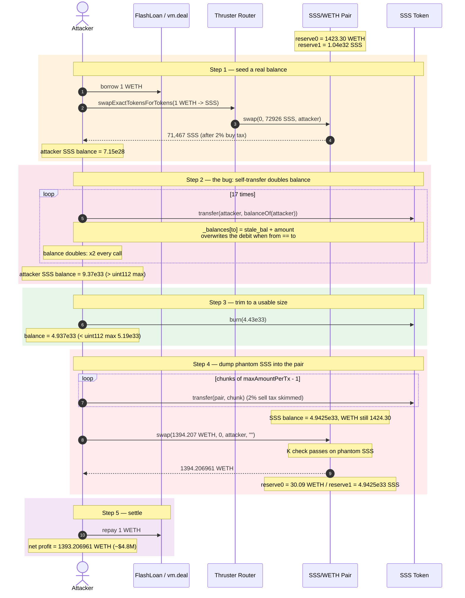
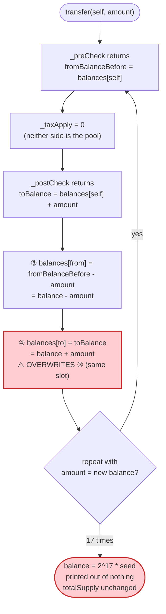
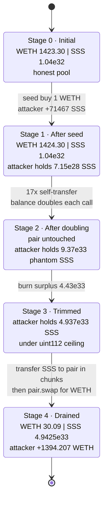
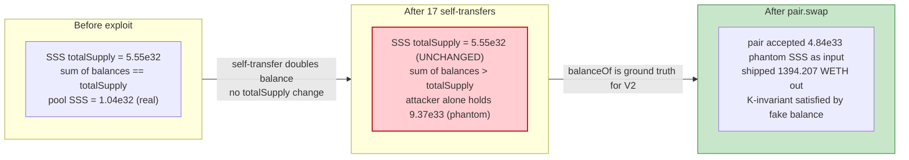

# SSS Exploit — Self-Transfer Balance-Doubling Lets Attacker Mint Phantom SSS and Drain the WETH Pool

> **Vulnerability classes:** vuln/logic/state-update · vuln/arithmetic/overflow

> **Reproduction:** the PoC compiles & runs in an isolated Foundry project at
> [this project folder](.). Full verbose trace: [output.txt](output.txt).
> Verified vulnerable source: [contracts_SSS.sol](sources/SSS_dfDCdb/contracts_SSS.sol).

---

## Key info

| | |
|---|---|
| **Loss** | ~$4.8M — **1,393.21 WETH** drained from the SSS/WETH Thruster pair |
| **Vulnerable contract** | `SSS` token — [`0xdfDCdbC789b56F99B0d0692d14DBC61906D9Deed`](https://blastscan.io/address/0xdfDCdbC789b56F99B0d0692d14DBC61906D9Deed#code) |
| **Victim pool** | SSS/WETH Thruster pair — `0x92F32553cC465583d432846955198F0DDcBcafA1` |
| **Attacker EOA** | `0x6a89a8C67B5066D59BF4D81d59f70C3976faCd0A` |
| **Attacker contract** | `0xDed85d83Bf06069c0bD5AA792234b5015D5410A9` |
| **Attack tx** | [`0x62e6b906bb5aafdc57c72cd13e20a18d2de3a4a757cd2f24fde6003ce5c9f2c6`](https://blastscan.io/tx/0x62e6b906bb5aafdc57c72cd13e20a18d2de3a4a757cd2f24fde6003ce5c9f2c6) |
| **Chain / block / date** | Blast / 1,110,245 / March 21, 2024 |
| **Compiler** | Solidity `v0.8.20+commit.a1b79de6`, optimizer **1 run @ 200** |
| **Bug class** | Broken accounting in `_update` — `from == to` (self-transfer) doubles the balance instead of leaving it unchanged |

---

## TL;DR

The SSS token overrides ERC-20's `_update` so it can apply buy/sell tax, but it
writes the recipient balance from a **stale snapshot** taken *before* the sender
side was debited:

```solidity
uint256 fromBalanceBeforeTransfer = _preCheck(from, to, amount); // balance snapshot
...
_balances[from] = fromBalanceBeforeTransfer - amount;            // debit sender
_balances[to]   = toBalance;                                      // credit recipient (OVERWRITES)
```

When `from == to` (a self-transfer), the second assignment **overwrites** the
first with `balance_before + amount` — so every self-transfer **doubles** the
caller's balance out of thin air. `totalSupply` is untouched, so the printed
balances and the real supply diverge: the attacker's wallet now holds SSS that
does not exist in any accounting sense, yet every external reader (the pair, the
router) trusts `balanceOf()`.

The attacker:
1. Borrows **1 WETH** (flash loan in the live attack, `vm.deal` in the PoC) and
   buys a trivial **71,467 SSS** from the pool.
2. Calls `SSS.transfer(self, balance)` **17 times** — each call doubles the
   balance (71,467 → 9.37×10³³).
3. **Burns** the surplus (4.43×10³³) so the remaining 4.937×10³³ SSS sits just
   below the Thruster pair's `uint112` overflow ceiling (5.19×10³³) and just
   above the amount needed to buy out (almost) the whole WETH reserve.
4. Pushes that phantom SSS straight into the pair in `maxAmountPerTx`-sized
   chunks (direct `transfer`, not through the router), then calls `pair.swap()`
   to pull **1,394.21 WETH** out.
5. Repays the 1 WETH flash loan. Net profit: **1,393.21 WETH ≈ $4.8M**.

---

## Background — what SSS is

`SSS` ([contracts_SSS.sol](sources/SSS_dfDCdb/contracts_SSS.sol)) is a Blast-native
ERC-20 with a `555.555 trillion` supply and a Uniswap-V2-style tax/limit layer bolted
onto OpenZeppelin's ERC-20:

- **Buy/sell tax** — `buyTaxPercent = sellTaxPercent = 200` (2%); on every transfer to
  or from the registered liquidity pool, 2% of the amount is skimmed to the contract
  itself (`_taxApply`, [:203-225](sources/SSS_dfDCdb/contracts_SSS.sol#L203-L225)).
- **Per-tx limit** — `maxAmountPerTx = maxAmountPerAccount = 0.05% of TOTAL_SUPPLY`
  (= `555,555,555,555,555 × 10¹⁸` ≈ 5.56×10³²) while `limitEnabled` is true
  (`_preCheck`/`_postCheck`, [:151-178](sources/SSS_dfDCdb/contracts_SSS.sol#L151-L178)).
- **Bot lock** — buyers in the first `ANTI_BOT_DETECT_DURATION` seconds after pool
  init are frozen for `ANTI_BOT_LOCK_DURATION` (`_botCheck`, [:133-149](sources/SSS_dfDCdb/contracts_SSS.sol#L133-L149)).
- **Custom `_update`** — all of the above is enforced by overriding `_update` instead
  of `_transfer` ([:111-130](sources/SSS_dfDCdb/contracts_SSS.sol#L111-L130)).

The AMM is a Thruster (Uniswap-V2 fork) pair — token0 = WETH, token1 = SSS. As a V2
fork it prices off `balanceOf()` and caps each reserve at `uint112` in `_update`
([contracts_ThrusterPair.sol:107-121](sources/ThrusterPair_92F325/contracts_ThrusterPair.sol#L107-L121)).

On-chain parameters at the fork block (block 1,110,245):

| Parameter | Value |
|---|---|
| `TOTAL_SUPPLY` | 555,555,555,555,555 × 10¹⁸ SSS |
| `maxAmountPerTx` | 555,555,555,555,555 × 10¹⁸ SSS (5.56×10³²) |
| `buyTaxPercent` / `sellTaxPercent` | 200 / 200 (2% / 2%) |
| Pair `reserve0` (WETH) | **1,423.30 WETH** ← the prize |
| Pair `reserve1` (SSS) | 1.0418×10³² SSS |
| `uint112` max (pair ceiling) | 5.1923×10³³ |

---

## The vulnerable code

### 1. `_update` debits then overwrites — a self-transfer doubles the balance

```solidity
function _update(address from, address to, uint256 amount) internal override virtual {
    if (from == address(0) || to == address(0) || to == address(0xdead)) {
        super._update(from, to, amount);
        return;
    }

    _botCheck(from, to);
    uint256 fromBalanceBeforeTransfer = _preCheck(from, to, amount);   // ① snapshot balance

    uint256 amountAfterTax = amount - _taxApply(from, to, amount);
    uint256 toBalance = _postCheck(from, to, amountAfterTax);          // ② _balances[to] + amount

    _balances[from] = fromBalanceBeforeTransfer - amount;              // ③ debit sender
    _balances[to]   = toBalance;                                       // ④ credit recipient — OVERWRITES ③ when from==to
    ...
}
```

When `from == to` (a transfer to self), step ④ sets
`_balances[from] = _balances[from] + amount`, **discarding** the debit written in
step ③. The net effect is `balance_new = balance_old + amount`. Repeating the
call with `amount = balance` therefore **doubles** the balance each iteration:

> `b → 2b → 4b → 8b → … → 2ⁿ·b`.

There is no `from != to` guard, no re-entrancy on a single storage slot, and no
post-condition that `_balances` sum stays consistent with `_totalSupply`.

### 2. The doubling is reachable by anyone

`transfer` is a plain public ERC-20 entry point and is **not** excluded for any
account. The attacker's wallet is a normal (non-unlimited, non-excluded) holder,
so the SSS tax/limit logic treats `self → self` as an ordinary transfer: no tax
(neither side is the pool), and no per-tx limit (limit only applies when one side
is the pool). The only "work" `_update` does for a self-transfer is the broken
balance write.

### 3. The pair accepts the phantom balance

The Thruster pair's `swap()` reads `IERC20(token).balanceOf(address(this))` to
compute `amountIn` and the K check
([contracts_ThrusterPair.sol:193-227](sources/ThrusterPair_92F325/contracts_ThrusterPair.sol#L193-L227)).
Because SSS's `balanceOf` reflects the inflated (corrupted) state, the pair sees a
genuinely large SSS deposit and is happy to ship out ~98% of its WETH reserve.

---

## Root cause — why it was possible

A tax/limit hook was layered onto `_update` by reordering the standard OpenZeppelin
two-line balance update, but the author never reasoned about the `from == to`
degenerate case. Three facts compose into a critical bug:

1. **`toBalance` is computed from a stale read.** `_postCheck` returns
   `_balances[to] + amount` using the balance *as it was before ③ ran*. The
   canonical ERC-20 update (`_balances[from] -= amount; _balances[to] += amount;`)
   is order-independent because both use `+=`/`-=` against live storage. The SSS
   rewrite uses absolute assignment (`_balances[to] = toBalance`), so it silently
   discards the sender debit whenever `from == to`.
2. **No self-transfer guard.** `_update` short-circuits only for `address(0)` and
   `0xdead`; it does not reject (or special-case) `from == to`. A self-transfer is
   therefore the cleanest possible trigger: no tax, no limit, no bot check, just the
   doubling write.
3. **The AMM trusts `balanceOf()`.** Thruster (like all Uniswap-V2 forks) treats the
   token's reported balance as ground truth. Once SSS's balances are corrupted, the
   pair's K-invariant check is satisfied with attacker-printed SSS, so the drain
   looks like a legitimate large sell.

The tax and per-tx limit — the two features the override was built to enforce — do
nothing to stop this: tax is zero outside pool transfers, and the limit only
constrains pool-bound transfers (the attacker respects it by chunking, but it would
not have blocked the doubling itself anyway).

---

## Preconditions

- A non-empty SSS/WETH Thruster pair with positive WETH reserve (✓ — 1,423.30 WETH).
- Attacker holds any non-zero SSS balance. The attacker buys the seed with **1 WETH**
  (flash-loaned in the live tx; `vm.deal` in the PoC), netting **71,467 SSS** after
  the 2% buy tax.
- The attacker must keep its final SSS balance under the pair's `uint112` ceiling
  (`2¹¹² − 1 ≈ 5.19×10³³`), else `pair.swap`'s `_update` reverts with
  `ThrusterPair: OVERFLOW`. The PoC hits that ceiling exactly and burns the surplus.

---

## Attack walkthrough (numbers from [output.txt](output.txt))

Pair ordering: `token0 = WETH`, `token1 = SSS`. All amounts are raw wei.

| # | Step | Attacker SSS balance | Pair reserve (WETH / SSS) | Note |
|---|------|---------------------:|---------------------------|------|
| 0 | **Seed buy** — swap 1 WETH → SSS via router | 71,467,647,611,014,028,815,578,607,679 (7.15×10²⁸) | 1,424.30 WETH / 1.0411×10³² SSS | 2% buy tax kept 71,467 of the 72,926 out |
| 1 | **Self-transfer #1** — `SSS.transfer(self, bal)` | 142,935,295,222,028,057,631,157,215,358 (×2) | — | balance doubles |
| 2 | **Self-transfer #2** | 285,870,590,444,056,115,262,314,430,716 (×2) | — | |
| 3 | … self-transfers #3–#16 … | grows ×2 each call | — | 17 doublings total |
| 4 | **Self-transfer #17** (final) | 9,367,407,507,670,830,784,915,519,265,701,888 (9.37×10³³) | — | **above** `uint112` max |
| 5 | **Burn surplus** — `SSS.burn(4.43×10³³)` | 4,937,159,701,810,249,525,240,596,925,757,150 (4.94×10³³) | — | target = `getAmountsIn(WETHpool − 29.5, [SSS,WETH])[0]`; sits just under `uint112` ceiling |
| 6 | **Transfer SSS to pair** in `maxAmountPerTx − 1` chunks (≈5.56×10³² each), each paying 2% sell tax | → 0 | WETH unchanged / SSS 4.9425×10³³ | `SBalBeforeOnPair` snapshot lets the attacker compute net `amount1In` |
| 7 | **`pair.swap(1394.206960 WETH, 0, self, "")`** | 0 | **30.09 WETH / 4.9425×10³³ SSS** | phantom SSS satisfies the K check |
| 8 | **Repay 1 WETH flash loan** | 0 | — | |

**Final attacker WETH:** 1,393.20696066122859944 (the 1,394.207 swap out − 1 repaid).

**Why 17 doublings?** `2¹⁷ × 7.15×10²⁸ ≈ 9.37×10³³`, which overshoots the 5.19×10³³
`uint112` ceiling. The burn in step 5 trims back to `targetBal` (4.94×10³³), chosen
as exactly the SSS input that `getAmountsIn` reports is required to buy
`WETHpool − 29.5 WETH`. The leftover 30.09 WETH (≈ the 29.5 buffer + rounding + the
pair's 0.3% fee) is what makes the K check pass.

### Why the burn is needed

`maxAmountPerTx` (5.56×10³²) is enforced on **pool-bound** transfers, so the attacker
cannot send the full 4.94×10³³ in one go — it must be chunked. But the bigger
constraint is the pair: if the attacker's SSS balance (and thus what it could push
into the pair) exceeded `2¹¹² − 1`, the pair's `_update` would revert with
`ThrusterPair: OVERFLOW` (the exact error the PoC comment at
[test/SSS_exp.sol:65-66](test/SSS_exp.sol#L65-L66) calls out). The burn keeps the
working balance inside the `uint112` envelope.

### Profit/loss accounting (WETH)

| Direction | Amount (WETH) |
|---|---:|
| Borrowed (flash loan / `vm.deal`) | +1.000000 |
| Spent — seed buy (1 WETH → SSS) | −1.000000 |
| Received — `pair.swap` (phantom SSS → WETH) | +1,394.206961 |
| Repaid — flash loan | −1.000000 |
| **Net profit** | **+1,393.206961** |

The profit equals (pair WETH reserve before − 30.09 WETH left) ≈ 1,423.30 − 30.09.
The attacker simply walked off with ~97.9% of the pool's WETH, collateralised by
SSS that it printed for free.

---

## Diagrams

### Sequence of the attack



### How `_update` breaks on `from == to`



### Pool state evolution



### Why the pair is fooled: balances vs. reality



---

## Remediation

1. **Fix `_update` so a self-transfer is a no-op (or rejected).** Either add
   `if (from == to) return;` at the top, or rewrite the balance update using the
   canonical in-place arithmetic so the debit and credit cannot clobber each other:
   ```solidity
   _balances[from] -= amount;
   _balances[to]   += amountAfterTax;   // tax already routed to address(this)
   ```
   and recompute the limit/tax checks off live storage rather than snapshots.
2. **Add an invariant assertion.** A debug-mode `assert(sumOfBalances == totalSupply)`
   (or a formal spec / invariant fuzzer) would have caught the divergence the first
   time `_update` was exercised with `from == to`.
3. **Don't trust `balanceOf()` inside AMM pricing without a sanity bound.** A V2 pair
   cannot defend against an arbitrary ERC-20 lying about balances, but the project
   *could* have made the SSS token's accounting tamper-evident — e.g., a rebase-style
   `totalSupply` that tracks the sum of balances, so any inflation shows up as a
   supply change the pair would reject via `uint112` overflow far earlier.
4. **Fuzz the override.** A 60-second Foundry invariant test ("for any `from`, `to`,
   `amount`: `totalSupply` and the sum of balances are unchanged by `transfer`")
   fires on the very first self-transfer.
5. **Beware re-implementing `_update` instead of `_transfer`.** Overriding the lower
   `_update` hook means you own the storage writes; the safe pattern is to override
   `_transfer` (debit/credit already done) and only insert tax/limit logic between
   the OZ balance reads and writes.

---

## How to reproduce

The PoC lives in a standalone Foundry project (the umbrella DeFiHackLabs repo has
many unrelated PoCs that do not compile together):

```bash
_shared/run_poc.sh 2024-03-SSS_exp --mt testExploit -vvvvv
```

- RPC: a **Blast archive** endpoint is required (fork block 1,110,245 is old).
  `foundry.toml` uses `https://blast.drpc.org`, which serves historical state at
  that block.
- Result: `[PASS] testExploit()` with final attacker WETH balance
  `1393.206960661228599440`.

Expected tail:

```
Ran 1 test for test/SSS_exp.sol:SSSExploit
[PASS] testExploit() (gas: 907642)
Logs:
  Attacker Before exploit WETH Balance: 0.000000000000000000
  Attacker After exploit WETH Balance: 1393.206960661228599440

Suite result: ok. 1 passed; 0 failed; 0 skipped; finished in 26.11s (20.22s CPU time)
```

---

*References: SSS HQ statement — <https://twitter.com/SSS_HQ/status/1771054306520867242>;
dot_pengun analysis — <https://twitter.com/dot_pengun/status/1770989208125272481>;
SlowMist Hacked — SSS, Blast, ~$4.8M.*
