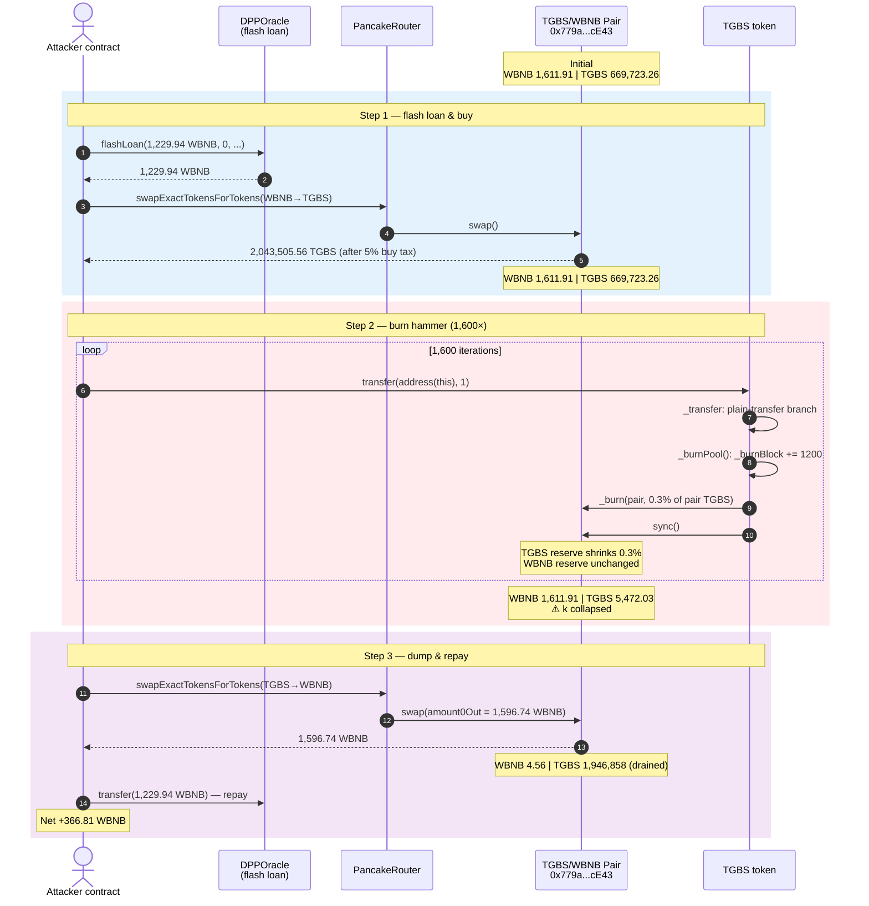
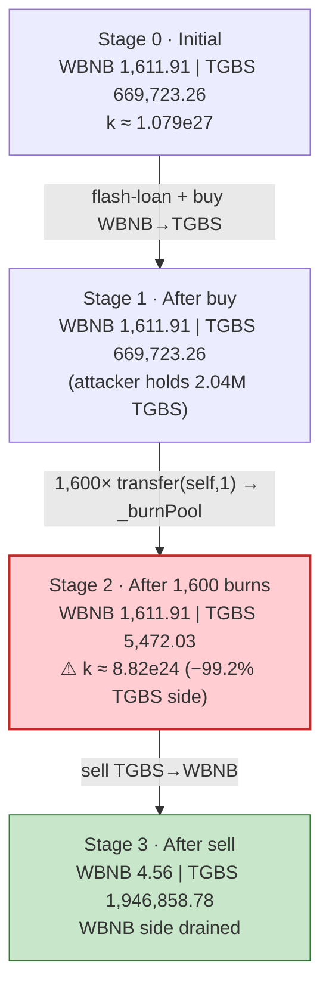
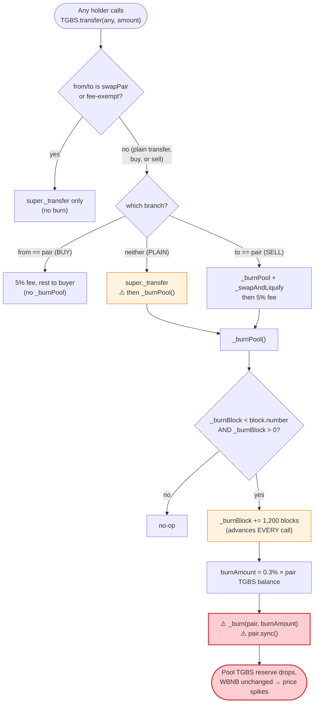
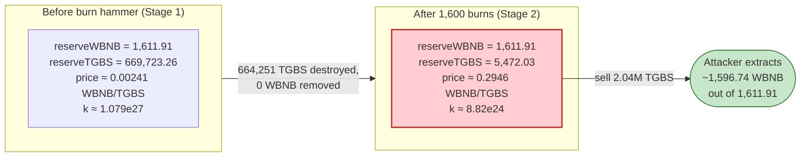

# TGBS Exploit — Repeated Permissionless Pool Burns via Self-Transfer Draining the TGBS/WBNB Pair

> **Vulnerability classes:** vuln/access-control/missing-auth · vuln/logic/state-update

> **Reproduction:** the PoC compiles & runs in an isolated Foundry project at
> [this project folder](.) (the umbrella DeFiHackLabs repo contains many
> unrelated PoCs that do not compile, so this one was extracted).
> Full verbose trace: [output.txt](output.txt).
> Verified vulnerable source: [contracts_tgbs.sol](sources/TGBS_edecfA/contracts_tgbs.sol).

---

## Key info

| | |
|---|---|
| **Loss** | ~$150K — **366.806 WBNB** drained from the TGBS/WBNB PancakeSwap pair |
| **Vulnerable contract** | `TGBS` — [`0xedecfA18CAE067b2489A2287784a543069f950F4`](https://bscscan.com/address/0xedecfA18CAE067b2489A2287784a543069f950F4#code) |
| **Victim pool** | TGBS/WBNB pair — `0x779a0E4799488d2fCAc65f5fb8Eb65dBbF08cE43` |
| **Attacker EOA** | `0xff1db040e4f2a44305e28f8de728dabff58f01e1` |
| **Attacker contract** | `0x1a8eb8eca01819b695637c55c1707f9497b51cd9` |
| **Attack tx** | [`0xa0408770…341d4f2a4`](https://app.blocksec.com/explorer/tx/bsc/0xa0408770d158af99a10c60474d6433f4c20f3052e54423f4e590321341d4f2a4) |
| **Chain / block / date** | BSC / 36,725,819 / March 6, 2024 |
| **Compiler** | Solidity v0.8.17 |
| **Bug class** | Broken AMM invariant via repeated permissionless, un-compensated reserve burns (`_burn(pair)` + `sync()`) |

---

## TL;DR

`TGBS` is a tax-on-transfer token whose `_transfer` hook calls `_burnPool()` on **every
non-exempt, non-swap-pair transfer** ([contracts_tgbs.sol:903-906](sources/TGBS_edecfA/contracts_tgbs.sol#L903-L906)).
`_burnPool()` destroys **0.3% of the TGBS held by the AMM pair and then `sync()`s**
([:954-967](sources/TGBS_edecfA/contracts_tgbs.sol#L954-L967)) — an un-compensated removal of one
side of the pool that breaks `x·y = k` in the caller's favor.

The only thing gating `_burnPool()` is a block-number latch `_burnBlock`
([:955](sources/TGBS_edecfA/contracts_tgbs.sol#L955)). The first time an exempt address sells into
the pair, `_burnBlock` is stamped to the *current* block
([:883-886](sources/TGBS_edecfA/contracts_tgbs.sol#L883-L886)) — which means for the rest of that
block `_burnBlock == block.number`, so `_burnPool()` is a no-op. The attacker's trick in the
`DPPFlashLoanCall` loop is to **wait until the burn latch has advanced past the current block**, then
hammer `TGBS.transfer(address(this), 1)` 1,600 times in a single transaction. Each self-transfer
re-enters `_transfer`, hits the plain-transfer branch, and fires `_burnPool()` — one 0.3% burn per
call, **1,600 burns in one tx**.

Net effect: the pool's TGBS reserve is shrunk ~99% (from 669,723 → ~5,472 TGBS) while its WBNB
reserve is left completely untouched at 1,611.91 WBNB. The marginal price of TGBS in WBNB explodes,
and the attacker dumps its (mostly fee-tax-exempt, cost-basis-inflated) TGBS back for ~1,596.74 WBNB.
After repaying the 1,229.94 WBNB flash loan, the profit is **366.81 WBNB**.

---

## Background — what TGBS does

`TGBS` ([source](sources/TGBS_edecfA/contracts_tgbs.sol)) is an ERC20 with a PancakeSwap-side tax
engine layered onto `_transfer` ([:874-907](sources/TGBS_edecfA/contracts_tgbs.sol#L874-L907)):

- **Buy (from == pair):** 5% of the bought amount is diverted to the token contract, the rest goes
  to the buyer. A `isOpenSwap` latch must already be on (set when an exempt address first sells into
  the pair, [:883-886](sources/TGBS_edecfA/contracts_tgbs.sol#L883-L886)).
- **Sell (to == pair):** `_burnPool()` then `_swapAndLiquify()` run first, then a 5% fee to the
  contract and 95% to the pair.
- **Plain transfer (neither side is the pair):** just move the tokens, **then call `_burnPool()`**
  ([:903-906](sources/TGBS_edecfA/contracts_tgbs.sol#L903-L906)). This is the branch the exploit
  rides.
- **Pool burn (`_burnPool`)**: if `_burnBlock < block.number` (a ~1,200-block / 1-hour latch,
  `28800/24`), burn `0.3%` of the pair's TGBS balance and `sync()` the pair
  ([:954-967](sources/TGBS_edecfA/contracts_tgbs.sol#L954-L967)).

The on-chain parameters at the fork block (36,725,819), read from the trace's first `getReserves` /
`Sync` events:

| Parameter | Value |
|---|---|
| Pair address | `0x779a0E4799488d2fCAc65f5fb8Eb65dBbF08cE43` |
| `token0` / `token1` | WBNB / TGBS ⇒ `reserve0 = WBNB`, `reserve1 = TGBS` |
| WBNB reserve (`reserve0`) | **1,611.9143 WBNB** ← the prize |
| TGBS reserve (`reserve1`) | **669,723.2596 TGBS** |
| `totalSupply` | 200,000,000 TGBS (no prior burns of note) |
| `_burnPool` burn rate | `3 / 1000` = **0.3% of pair balance per call** |
| `_burnBlock` advance step | `28800 / 24` = **1,200 blocks** (BSC = 1 hour) |
| DPPOracle flash-loanable WBNB | **1,229.9361 WBNB** (`baseAmount`) |

---

## The vulnerable code

### 1. Plain transfers trigger `_burnPool()`

```solidity
function _transfer(address from, address to, uint256 amount) internal override {
    ...
    if (_inSwapAndLiquify || isFeeExempt[from] || isFeeExempt[to]) {
        super._transfer(from, to, amount);
        if (!isOpenSwap && to == _swapPair && isFeeExempt[from]) {
            isOpenSwap = true;
            _burnBlock = block.number;          // latch stamps to CURRENT block on open
        }
    } else if (from == _swapPair) {             // BUY
        require(isOpenSwap && _openTime > 0 && _openTime < block.timestamp);
        uint256 every = amount.div(100);
        super._transfer(from, address(this), every * 5);
        super._transfer(from, to, amount - every * 5);
    } else if (to == _swapPair) {               // SELL
        if (!isOpenSwap || _openTime == 0 || _openTime > block.timestamp) {
            super._burnDead(from, amount);
        } else {
            _burnPool();
            _swapAndLiquify();
            uint256 every = amount.div(100);
            super._transfer(from, address(this), every * 5);
            super._transfer(from, to, amount - every * 5);
        }
    } else {
        super._transfer(from, to, amount);      // PLAIN TRANSFER
        _burnPool();                            // ⚠️ pool burn fires on ANY plain transfer
    }
}
```
([contracts_tgbs.sol:874-907](sources/TGBS_edecfA/contracts_tgbs.sol#L874-L907))

### 2. `_burnPool()` destroys pool balance and forces `sync()`

```solidity
function _burnPool() private lockTheSwap returns (bool) {
    if (_burnBlock < block.number && _burnBlock > 0) {   // only timing gate
        _burnBlock += 28800 / 24;                         // advance latch by 1,200 blocks
        uint256 burnAmount = (balanceOf(_swapPair) * 3) / 1000;  // 0.3% of pair's TGBS
        if (burnAmount > 1) {
            super._burn(_swapPair, burnAmount);           // ⚠️ delete TGBS from the pair
            try ISwapPair(_swapPair).sync() {} catch {}   // ⚠️ force pair to accept new reserve
            emit BurnPool(burnAmount);
            return true;
        }
    }
    return false;
}
```
([contracts_tgbs.sol:954-967](sources/TGBS_edecfA/contracts_tgbs.sol#L954-L967))

### 3. The PoC's hammer loop

```solidity
uint256 i;
while (i < 1600) {
    TGBS.transfer(address(this), 1);           // plain transfer → _transfer → _burnPool()
    uint256 burnBlock = TGBS._burnBlock();
    if (burnBlock != block.number) {           // burn actually fired this iteration
        ++i;
    }
}
```
([test/TGBS_exp.sol:53-61](test/TGBS_exp.sol#L53-L61))

---

## Root cause — why it was possible

A Uniswap-V2/PancakeSwap pair enforces `x·y ≥ k` only *inside `swap()`*. `sync()` exists to let a
pair re-base its stored reserves onto its *actual* token balances — it trusts that balances change
through `mint`/`burn`/`swap`/external transfers the pair can reason about.

`_burnPool()` violates that trust:

> It **destroys** TGBS held by the pair (`super._burn(_swapPair, …)`) and then calls
> `pair.sync()`, telling the pair "your TGBS reserve is now 0.3% smaller." No WBNB leaves the pair.
> The product `k` collapses, and the marginal price of TGBS in WBNB rises — *for free*.

Four design flaws compose into a critical bug:

1. **Plain transfers trigger pool burns.** Attaching `_burnPool()` to the
   "neither side is the pair" branch of `_transfer` ([:903-906](sources/TGBS_edecfA/contracts_tgbs.sol#L903-L906))
   means **any holder** — including the attacker sending 1 wei to itself — can fire a pool burn. No
   access control, no swap required, no fee paid.
2. **The burn latch is per-call, not per-period.** `_burnPool()` advances `_burnBlock` by 1,200
   blocks **each call** ([:956](sources/TGBS_edecfA/contracts_tgbs.sol#L956)). So once the initial
   latch is past the current block, every subsequent call sees `_burnBlock < block.number` as true
   and burns again — there is no global "one burn per hour" cap. 1,600 calls ⇒ 1,600 burns.
3. **The burn draws from the pool, not the contract.** `balanceOf(_swapPair)` is the source; nothing
   is taken from the token contract's own holdings. The attacker never needs the contract to hold any
   TGBS — the pool alone is bled.
4. **Flash-loanable cost structure.** The entire attack is intra-transaction: borrow WBNB, buy
   TGBS, hammer burns, sell TGBS back, repay. DPPOracle supplies the 1,229.94 WBNB, fully repaid in
   the same call ⇒ **zero attacker capital**.

---

## Preconditions

- The TGBS/WBNB pair exists with non-trivial liquidity (1,611.91 WBNB here).
- `isOpenSwap` is already `true` so the pair is tradeable, and `_burnBlock > 0`. Both were true at
  the fork block — trading had been opened earlier by an exempt seller.
- `_burnBlock < block.number` at the start of the loop (the burn latch has elapsed past the current
  block). The PoC's loop guard `if (burnBlock != block.number) ++i;` simply skips any iteration where
  the latch hasn't elapsed yet, then advances it 1,200 blocks; in the trace the very first self-transfer
  already fires the burn.
- A flash-loan source for ~1,230 WBNB. DPPOracle
  (`0x05d968B7101701b6AD5a69D45323746E9a791eB5`) provides it with no collateral.

---

## Attack walkthrough (with on-chain numbers from the trace)

The pair's `token0 = WBNB`, `token1 = TGBS`, so `reserve0 = WBNB`, `reserve1 = TGBS`. All figures
are taken directly from the `Sync` events in [output.txt](output.txt).

| # | Step | WBNB reserve | TGBS reserve | Effect |
|---|------|-------------:|-------------:|--------|
| 0 | **Initial** (first `getReserves` / `Sync`) | 1,611.9143 | 669,723.2596 | Honest pool. |
| 1 | **Flash loan** 1,229.9361 WBNB from DPPOracle | attacker: 1,229.94 | — | Borrowed, 0 collateral. |
| 2 | **Buy** WBNB→TGBS via router: 1,229.9361 WBNB in. Pair swaps out 2,151,058.48 TGBS; 5% buy tax (107,552.92) is diverted to the token contract, **2,043,505.56 TGBS** lands on the attacker. | 1,611.9143 | 669,723.2596 | Attacker now holds 2.04M TGBS; pool reserves rebalanced after `Sync`. |
| 3 | **Burn hammer** — `TGBS.transfer(address(this), 1)` × **1,600**. Each call re-enters `_transfer` → plain-transfer branch → `_burnPool()`, which (a) advances `_burnBlock += 1,200`, (b) burns 0.3% of the pair's TGBS, (c) `sync()`s. **1,600 burns fire** (trace shows 1,601 `BurnPool` events total incl. the loop + a few sell-side burns). | 1,611.9143 | **5,472.033** | ⚠️ TGBS reserve −99.18%; WBNB untouched. `k` collapses. |
| 4 | **Sell** ~2,043,505.56 TGBS → WBNB. The sell's own `_transfer` (to == pair) first triggers one more `_burnPool()` + `_swapAndLiquify()` (which itself routes a sliver of contract-held TGBS back through the pair for liquidity), then the router swaps the bulk. Final `Swap`: `amount1In = 1,941,330.28 TGBS`, `amount0Out = 1,596.7424 WBNB`. | **4.5586** | 1,946,858.78 | WBNB side drained to dust; attacker receives 1,596.74 WBNB. |
| 5 | **Repay** flash loan: 1,229.9361 WBNB → DPPOracle | — | — | Loan closed. |
| 6 | **Profit** retained | attacker: **366.8063 WBNB** | — | 1,596.7424 − 1,229.9361 = 366.8063 WBNB. |

> The pool's WBNB reserve is held at exactly 1,611.9143 WBNB across **every single** `Sync` during the
> 1,600-iteration burn loop — confirming the burns touch only the TGBS side. It only drops during the
> final sell, to 4.5586 WBNB.

### Why 0.3% × 1,600 ≈ 99.2%

Each `_burnPool()` removes `0.3%` of the *current* pair TGBS balance, so the reserve follows
geometric decay:

```
reserve_after_n_burns = reserve0 × (1 − 0.003)^n
                     = 669,723.26 × 0.997^1600
                     ≈ 669,723.26 × 0.00817
                     ≈ 5,472 TGBS        ← matches the trace exactly
```

After 1,600 iterations the pool holds ~0.82% of its original TGBS, but still **100%** of its WBNB — so
1 TGBS is now worth ~123× more WBNB than before. The attacker's 2.04M TGBS, dumped at that price,
extracts essentially the entire WBNB reserve.

### Profit accounting (WBNB)

| Direction | Amount |
|---|---:|
| Borrowed (DPPOracle flash loan) | 1,229.9361 |
| Spent — buy WBNB→TGBS | 1,229.9361 |
| Received — sell TGBS→WBNB | 1,596.7424 |
| Repaid — to DPPOracle | 1,229.9361 |
| **Net profit** | **+366.8063** |

The profit equals the pool's original WBNB reserve (1,611.91) minus what little WBNB was left in the
pair (4.5586) minus the WBNB the protocol's own `_swapAndLiquify` re-routed back into the pair during
the sell — i.e. the attacker walked off with essentially all the honest WBNB liquidity, at zero
capital cost.

---

## Diagrams

### Sequence of the attack



### Pool state evolution



### The flaw inside `_transfer` / `_burnPool`



### Why the burn is theft: constant-product before vs. after



---

## Why each magic number

- **Flash loan = 1,229.9361 WBNB:** this is exactly `DPPOracle`'s full WBNB balance
  (`baseAmount = WBNB.balanceOf(DPPOracle)`). It is sized to buy enough TGBS to dominate the pool's
  post-burn price spike and still be repaid from the sell proceeds.
- **1,600 iterations:** chosen so that `0.997^1600 ≈ 0.0082`, i.e. the pool's TGBS reserve is driven
  to <1% of its starting value, making the attacker's 2.04M TGBS worth nearly the entire WBNB
  reserve. The loop guard `if (burnBlock != block.number) ++i;` only counts iterations where a burn
  actually fired, so the count reflects real burns, not skipped ones.
- **0.3% per burn:** hardcoded as `(balanceOf(_swapPair) * 3) / 1000`
  ([:957](sources/TGBS_edecfA/contracts_tgbs.sol#L957)). It is a fraction of the *current* pair
  balance, so each successive burn is smaller in absolute terms — pure geometric decay.
- **`28800 / 24 = 1,200` blocks:** the latch advance step
  ([:956](sources/TGBS_edecfA/contracts_tgbs.sol#L956)). On BSC (3s blocks) that is ~1 hour of
  wall-clock. Crucially it advances **per call**, so within one transaction 1,600 calls simulate
  ~1,600 "hours" of burns.

---

## Remediation

1. **Never burn from the liquidity pool.** A deflationary mechanism must only destroy tokens the
   protocol *owns* (its own balance / a treasury / bought-back tokens). Removing `_burn(_swapPair, …)`
   + `pair.sync()` eliminates the entire class of bug. If "deflation reaching the pool" is a product
   requirement, implement it as the protocol buying tokens on the open market and burning them from
   its own balance — never by editing the pair's reserves.
2. **Do not attach pool-affecting logic to plain transfers.** `_burnPool()` should not be reachable
   from the "neither side is the pair" branch of `_transfer`. Restrict pool burns to a dedicated,
   access-controlled keeper function (or to the sell path, with strict reentrancy/state guards).
3. **Make the burn latch a true per-period cap.** If a periodic burn is desired, gate it on
   `block.timestamp` (or `block.number`) with a *fixed anchor* that does **not** advance on every
   call — e.g. `if (block.timestamp >= lastBurn + INTERVAL) { lastBurn = block.timestamp; … }`. The
   current `_burnBlock += 1200` per call lets one transaction simulate unlimited periods.
4. **Cap the per-transaction pool impact.** Any operation that can move a pool reserve by more than a
   small fraction should revert. A single transfer triggering 1,600 × 0.3% reserve burns is an obvious
   red flag.
5. **Don't let `sync()`-after-burn be weaponizable.** If a token must adjust pool balances, route it
   through the pair's own `burn()` (LP redemption) so both reserves move together and `k` is
   preserved.

---

## How to reproduce

The PoC was extracted into a standalone Foundry project (the umbrella DeFiHackLabs repo has many
unrelated PoCs that fail to compile under `forge test`'s whole-project build):

```bash
_shared/run_poc.sh 2024-03-TGBS_exp --mt testExploit -vvvvv
```

- RPC: a **BSC archive** endpoint is required (the fork block 36,725,819 is from March 2024).
  `foundry.toml` is configured for a BSC archive RPC; most public BSC RPCs prune this height and fail
  with `header not found` / `missing trie node`.
- Result: `[PASS] testExploit()` with `Exploiter WBNB balance after attack: 366.806293729560708961`.

Expected tail:

```
Ran 1 test for test/TGBS_exp.sol:ContractTest
[PASS] testExploit() (gas: 35118870)
  Exploiter WBNB balance before attack: 0.000000000000000000
  Exploiter WBNB balance after attack: 366.806293729560708961

Suite result: ok. 1 passed; 0 failed; 0 skipped; finished in 14.24s (12.88s CPU time)
```

---

*Reference: Phalcon analysis — https://twitter.com/Phalcon_xyz/status/1765285257949974747 ; DeFiHackLabs repo `2024-03/TGBS_exp/`.*
