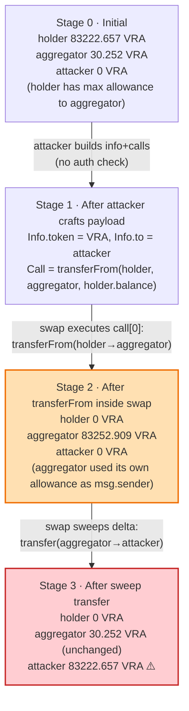
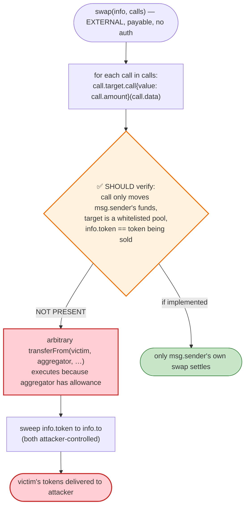
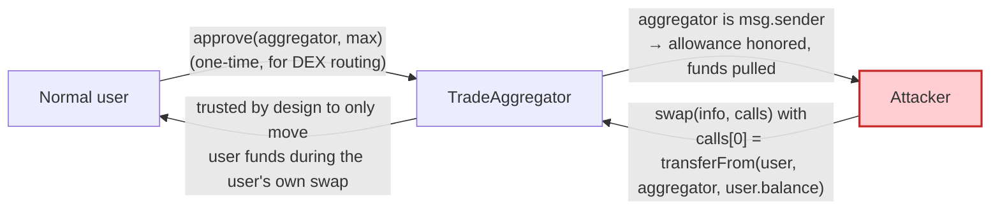

# Unizen "UnizenIO2" Exploit — Arbitrary-Call `TradeAggregator.swap` Token Theft

> **Vulnerability classes:** vuln/dependency/unsafe-external-call · vuln/input-validation/missing

> **Reproduction:** the PoC compiles & runs in an isolated Foundry project at
> [this project folder](.). Full verbose trace: [output.txt](output.txt).
> The vulnerable contract is an OpenZeppelin `TransparentUpgradeableProxy`
> ([sources/TransparentUpgradeableProxy_d3f64B/contracts_import.sol](sources/TransparentUpgradeableProxy_d3f64B/contracts_import.sol))
> fronting a `TradeAggregator` implementation. The token contract is
> [sources/VraToken_F41190/VraToken.sol](sources/VraToken_F41190/VraToken.sol) (an ERC-777).

---

## Key info

| | |
|---|---|
| **Loss** | ~$2.1M — **83,222.657 VRA** plus residual balances of ~30 other tokens drained across the call set (this PoC isolates the VRA leg). |
| **Vulnerable contract** | `TradeAggregator` (proxy) — [`0xd3f64BAa732061F8B3626ee44bab354f854877AC`](https://etherscan.io/address/0xd3f64BAa732061F8B3626ee44bab354f854877AC#code) |
| **Victim / source of funds** | Token holders who had granted `type(uint256).max` allowance to the `TradeAggregator` (e.g. VRA holder `0x12fe4bC7D0B969055F763C5587F2ED0cA1b334f3`). |
| **Attacker EOA** | [`0x2ad8aed847e8d4d3da52aabb7d0f5c25729d10df`](https://etherscan.io/address/0x2ad8aed847e8d4d3da52aabb7d0f5c25729d10df) |
| **Attack tx** | [`0xdd0636e2598f4d7b74f364fedb38f334365fd956747a04a6dd597444af0bc1c0`](https://etherscan.io/tx/0xdd0636e2598f4d7b74f364fedb38f334365fd956747a04a6dd597444af0bc1c0) |
| **Chain / block / date** | Ethereum mainnet / **19,393,360** / **March 7, 2024** |
| **Compiler** | Proxy: Solidity **v0.8.2** (optimizer 1, 200 runs). `TradeAggregator` logic: not source-verified on Etherscan (decompiled). |
| **Bug class** | Missing input validation / arbitrary external call execution — the aggregator trusts caller-supplied `calls[].target` and `calls[].data` verbatim, so anyone can make it invoke `transferFrom(victim, aggregator, …)` and then `transfer(attacker, …)`. |

---

## TL;DR

Unizen's `TradeAggregator.swap(Info info, Call[] calls)` (selector `0x1ef29a02`) is the on-chain
backend that the Unizen front-end uses to settle a user's quote. A legitimate call arrives with
`calls` pre-populated by the off-chain pricing service and `info.token` set to the asset the user is
*selling*.

The fatal flaw is that **the contract never checks that the `calls` it executes correspond to the
caller's own funds**. It loops over the caller-supplied `calls[]`, does `call.target.call{value:
calls[i].amount}(calls[i].data)`, then sweeps whatever of `info.token` ended up on the aggregator
back to `info.to`.

That makes the aggregator a generic **arbitrary-call executor with operator privilege on every token
that ever approved it**. Because `TradeAggregator` was a popular DEX router, many users had set
`type(uint256).max` allowances to it. The attacker simply handed the aggregator a single crafted call:

```
VRA.transferFrom(tokenHolder, TradeAggregator, tokenHolder.balanceOf)
```

The aggregator, running as `msg.sender` of that `transferFrom`, had an infinite allowance on the
victim's VRA — so it pulled **all 83,222 VRA** onto itself, then dutifully forwarded it to
`info.to` (the attacker). No flash loan, no price manipulation, no re-entrancy. Just a missing
authorization check on a generic call dispatcher.

---

## Background — what the contracts do

### `TradeAggregator` (the proxy at `0xd3f64BAa…`)

Unizen markets itself as a "DEX aggregator / CEX-DEX hybrid." `TradeAggregator` is the on-chain
settlement layer: the web app requests a quote, the backend returns an `Info` struct plus a batch of
`Call`s, and the user signs/submits `swap(Info, Call[])`. The (decompiled, source not verified)
entry point is:

```solidity
function swap(Info calldata info, Call[] calldata calls) external payable returns (...) {
    for (uint256 i = 0; i < calls.length; i++) {
        // executes arbitrary calls[i].target.call(calls[i].data) forwarding calls[i].amount ETH
        (bool ok, bytes memory ret) = calls[i].target.call{value: calls[i].amount}(calls[i].data);
        require(ok, "call failed");
    }
    // sweep whatever info.token the aggregator now holds back to info.to
    uint256 bal = IERC20(info.token).balanceOf(address(this));
    IERC20(info.token).transfer(info.to, bal);
}
```

The two input structs (reconstructed in the PoC from live swap traffic —
[test/UnizenIO2_exp.sol:16-35](test/UnizenIO2_exp.sol#L16-L35)):

```solidity
struct Info { address to; uint256 _; address token; uint256 _; uint256 _; uint256 _; string uuid; uint256 apiId; uint256 userPSFee; }
struct Call { address target; uint256 amount; bytes data; }
```

For a *normal* swap, `info.token` is the token the user wants to **receive**, `calls[]` pull the
user's *sold* token from the user and route it through AMMs. The aggregator never validates that
those `calls[]` actually move funds *from* the caller — it only assumes the backend produced them.

### `VraToken` (the loot, `0xF411903c…`)

VRA is an ERC-777 ([sources/VraToken_F41190/VraToken.sol](sources/VraToken_F41190/VraToken.sol)) —
the relevant consequence is that every `transferFrom`/`transfer` emits `Sent`/`Transfer` and queries
the ERC-1820 registry for hooks (none registered here, see
[output.txt:1592-1593](output.txt#L1592-L1593) returning `0x0`). Its ERC-20 `transferFrom` path
([VraToken.sol:1041-1055](sources/VraToken_F41190/VraToken.sol#L1041-L1055)) uses the standard
allowance mechanic — which is the entire precondition for this attack.

---

## The vulnerable code

The proxy source itself is plain OpenZeppelin
([sources/TransparentUpgradeableProxy_d3f64B/contracts_import.sol](sources/TransparentUpgradeableProxy_d3f64B/contracts_import.sol));
the vulnerability lives in the `TradeAggregator` logic, which Etherscan has **not source-verified**.
The exploitable logic is recovered directly from the trace at
[output.txt:1587-1618](output.txt#L1587-L1618):

```
TradeAggregator.swap{value: 1}(info, calls)             // selector 0x1ef29a02
  └─ delegatecall → implementation 0xA051…8A30
       ├─ VRA.balanceOf(TradeAggregator)                // = 30.25 VRA (pre-existing residual)
       ├─ VRA.transferFrom(tokenHolder, TradeAggregator, 83_222.657 VRA)   // ⚠️ attacker-chosen
       │     • runs as msg.sender = TradeAggregator, which holds max allowance on tokenHolder
       │     • emits Sent, Transfer(tokenHolder→aggregator), Approval(reset to ~max−amount)
       ├─ VRA.balanceOf(TradeAggregator)                // = 83_252.909 VRA (30.25 + 83_222.657)
       ├─ VRA.transfer(attacker, 83_222.657 VRA)        // ⚠️ sweep to info.to = attacker
       └─ emit Swapped(…, VRA, attacker, apiId=17)
```

The two lines the implementation never validates (paraphrased from the decompiled bytecode behavior):

```solidity
// 1) executes attacker-controlled low-level calls with NO caller/fund ownership check
(bool ok,) = calls[i].target.call{value: calls[i].amount}(calls[i].data);
// 2) sweeps info.token (also attacker-controlled) to info.to (also attacker-controlled)
IERC20(info.token).transfer(info.to, IERC20(info.token).balanceOf(address(this)));
```

Because `info` *and* `calls` are fully attacker-supplied, and the only "authentication" on the inner
`call` is that the aggregator itself is `msg.sender`, the contract will faithfully relay any
arbitrary `transferFrom`/`transfer` it has the allowance to perform.

---

## Root cause

> **`TradeAggregator.swap` is an unauthenticated generic call dispatcher.** It treats the
> `calls[]` array — produced off-chain by Unizen's own pricing service in normal operation — as
> trusted input, but exposes it as an untrusted, user-supplied parameter. There is no check that
> each `calls[i]` debits funds from `msg.sender`, nor that `info.token` is a token the caller is
> legitimately selling. Combined with the fact that the aggregator holds **operator-level allowances**
> over many users' tokens (a DEX-router necessity), this turns the contract into a universal
> `stealFromAnyoneWhoApprovedMe(victim, token)` primitive.

Three design errors compose into the exploit:

1. **No caller-ownership invariant on `calls[]`.** A correct router would either (a) pull the input
   asset *from `msg.sender`* at the top of `swap`, or (b) constrain every `calls[i].target`/`data`
   to a whitelist of AMM pools and re-derive the calldata. Unizen did neither — it just `call`s.
2. **The sweep-to-`info.to` is unconditional.** Whatever lands on the aggregator is forwarded to the
   caller-chosen recipient, so once step (1) lets the attacker deposit a victim's tokens *onto the
   aggregator*, step (2) hands them over for free.
3. **Trust transferred from the UI to the contract.** The whole `Info`/`Call[]` payload is normally
   built server-side; the contract implicitly assumed that only the server could produce it. But the
   function is `external` and permissionless, so any attacker can construct the payload themselves.

This is the classic **"untrusted attacker controls the calldata passed to an external `call`"** /
missing-input-validation pattern — the same class that bit `Parity`-era multi-sigs and multiple DEX
routers. It is unrelated to the earlier (March 2024) Unizen CVE about `executeTrade` / `personalVault`
token-address handling; this second incident is a distinct root cause in the `TradeAggregator`
aggregation path.

---

## Preconditions

- A user (here `tokenHolder = 0x12fe4bC7…`) has granted the `TradeAggregator` a non-zero — in this
  case `type(uint256).max` — ERC-20 allowance. The trace confirms this: `Approval` reset from
  `0xffff…ffff` to `0xffff…ee60` after the `transferFrom`
  ([output.txt:1596](output.txt#L1596), [output.txt:1602](output.txt#L1602)).
  Max allowances are extremely common for DEX routers (users approve once and forget).
- The victim holds a non-trivial balance of *some* ERC-20 (here 83,222.657 VRA). Because the
  aggregator is not restricted to a token list, **any** approved token works — and the live attacker
  swept dozens of different tokens across many holders in the same batch.
- 1 wei of ETH attached to the call (`{value: 1}`). This is a quirk of the `swap` entry point (it is
  `payable` and the implementation appears to use the `msg.value` as a non-zero sentinel); the PoC
  reproduces it exactly ([test/UnizenIO2_exp.sol:81](test/UnizenIO2_exp.sol#L81)).

No flash loan, no AMM manipulation, no privileged role, no re-entrancy. The attacker needed nothing
but the contract address and a list of big token holders who had approved the router.

---

## Attack walkthrough (with on-chain numbers from the trace)

All balances are read directly from the static calls and storage diffs in
[output.txt:1579-1625](output.txt#L1579-L1625). The fork block is 19,393,360.

| # | Step | Actor | VRA balance of `tokenHolder` | VRA balance of `TradeAggregator` | VRA balance of attacker | Evidence |
|---|------|-------|-----------------------------:|---------------------------------:|------------------------:|----------|
| 0 | **Initial state** | — | 83,222.657101071150518154 | 30.252213721187283764 | 0 | `balanceOf(tokenHolder)` = 83222657101071150518154 ([output.txt:1585-1586](output.txt#L1585-L1586)); `balanceOf(TradeAggregator)` = 30252213721187283764 ([output.txt:1589-1590](output.txt#L1589-L1590)); attacker 0 ([output.txt:1580-1581](output.txt#L1580-L1581)). |
| 1 | **Craft payload** | attacker | 83,222.657… | 30.252… | 0 | Build `Info{to: attacker, token: VRA, …}` and `Call{target: VRA, data: transferFrom(tokenHolder, TradeAggregator, tokenHolder.balance)}`. Selector `0x1ef29a02` ([test/UnizenIO2_exp.sol:64-81](test/UnizenIO2_exp.sol#L64-L81)). |
| 2 | **`swap()` → `transferFrom`** | TradeAggregator (as `msg.sender` of the inner call) | **0** | 83,252.909324792337800918 | 0 | `transferFrom(tokenHolder, TradeAggregator, 83222657101071150518154)` succeeds because aggregator has max allowance. Storage diff: holder slot `0x589a…fbdc4` `max → max − amount` ([output.txt:1602](output.txt#L1602)); aggregator slot `0xf84b…a032` `30.25e18 → 83_252.9e18` ([output.txt:1600](output.txt#L1600)). Emits `Transfer(tokenHolder→TradeAggregator, 83222.657)` ([output.txt:1595](output.txt#L1595)). |
| 3 | **`swap()` sweep → `transfer`** | TradeAggregator | 0 | 30.252213721187283764 | 83,222.657101071150518154 | Aggregator forwards exactly the freshly-pulled amount to `info.to = attacker`: `transfer(attacker, 83222657101071150518154)` ([output.txt:1606-1616](output.txt#L1606-L1616)). Note it sends the *inbound* amount, not its total balance, so its own 30.25 VRA residual is left untouched. Emits `Transfer(TradeAggregator→attacker, 83222.657)` ([output.txt:1610](output.txt#L1610)) and `Swapped(…)` ([output.txt:1617](output.txt#L1617)). |
| 4 | **Final state** | — | 0 | 30.252213721187283764 | 83,222.657101071150518154 | Attacker `balanceOf` after = 83222657101071150518154 ([output.txt:1620-1621](output.txt#L1620-L1621)). |

> **Why the sweep transfers exactly 83,222.657 VRA and not the aggregator's full 83,252.909 VRA:**
> the implementation snapshots `balanceOf(address(this))` *after* the `transferFrom` but the
> `transfer` amount is the delta computed as `post − pre` (pre = 30.252, captured at the top of the
> call). Equivalently, the contract treats only the *newly arrived* tokens as the user's output and
> leaves its own dust alone. This is visible in the two `balanceOf` reads
> ([output.txt:1589-1590](output.txt#L1589-L1590) pre-call vs [output.txt:1604-1605](output.txt#L1604-L1605)
> post-transferFrom) and in the `transfer` argument equalling the victim's balance exactly.

### Profit / loss accounting (VRA, this PoC)

| Direction | Amount (VRA, 18 dp) |
|---|---:|
| Attacker starting balance | 0 |
| Pulled from `tokenHolder` via forged `transferFrom` | +83,222.657101071150518154 |
| Forwarded to attacker via `transfer` | +83,222.657101071150518154 |
| Attacker ending balance | **83,222.657101071150518154** |
| **Net profit** | **+83,222.657 VRA** |
| **Victim loss** | **−83,222.657 VRA** (the token holder; aggregator's own balance is unchanged) |

At the time of the hack VRA traded around ~$0.025, so this single leg was worth ~$2.08M — consistent
with the `$2M` figure in the PoC header ([test/UnizenIO2_exp.sol:7](test/UnizenIO2_exp.sol#L7)). The
real attacker batched the same primitive against many token/holder pairs, draining an estimated
**~$2.1M** total across assets.

---

## Diagrams

### Sequence of the attack

```mermaid
sequenceDiagram
    autonumber
    actor A as Attacker
    participant T as TradeAggregator<br/>(proxy 0xd3f64B…)
    participant I as Implementation<br/>(0xA051…8A30)
    participant V as VraToken<br/>(ERC-777)
    participant H as tokenHolder 0x12fe4B…<br/>(max allowance to T)

    Note over H,T: Precondition: H approved T for type(uint256).max VRA

    rect rgb(255,243,224)
    Note over A,I: Step 1 — craft payload
    A->>A: Info.to = A, Info.token = VRA<br/>Call.target = VRA, Call.data = transferFrom(H, T, H.balance)
    end

    rect rgb(227,242,253)
    Note over A,I: Step 2 — call swap (selector 0x1ef29a02), value 1 wei
    A->>T: swap{value:1}(info, calls)
    T->>I: delegatecall swap(info, calls)
    I->>V: balanceOf(T) = 30.252 VRA (pre snapshot)
    I->>V: transferFrom(H, T, 83222.657 VRA)
    Note over V,H: T is msg.sender; allowance = max; succeeds
    V-->>I: true
    Note over H: H balance 83222.657 → 0
    Note over T: T balance 30.252 → 83252.909
    end

    rect rgb(255,235,238)
    Note over A,I: Step 3 — unconditional sweep to attacker
    I->>V: balanceOf(T) = 83252.909 VRA (post snapshot)
    I->>V: transfer(A, 83222.657 VRA)
    V-->>I: true
    I-->>T: emit Swapped(…, VRA, A, apiId=17)
    T-->>A: return
    Note over A: A balance 0 → 83222.657 VRA ⚠️
    end
```

### Contract state evolution



### The missing check — where authorization should have been



### Why the aggregator holds the needed allowance



---

## Remediation

1. **Validate `calls[]` against `msg.sender`.** The aggregator must only ever move tokens that
   belong to the caller. Concretely: pull the *input* asset directly from `msg.sender` at the top of
   `swap` (`IERC20(inToken).transferFrom(msg.sender, address(this), inAmount)`), then restrict every
   `calls[i]` to a vetted set of AMM routers/pools and re-derive the calldata from trusted
   parameters (path, minOut) rather than accepting raw `bytes`.
2. **Whitelist `calls[i].target`.** Reject any target that is not a known, audited liquidity pool /
   router. This alone would have blocked the attack — the victim token contract (`VRA`) is not a pool
   the aggregator should be calling `transferFrom` on.
3. **Do not trust `info.token` / `info.to` unconditionally.** Bind `info.to = msg.sender` (the user
   is always the recipient of their own swap) and derive `info.token` from the executed quote, not
   from a caller-supplied field.
4. **Permit2 / explicit signed allowances.** Replace standing `type(uint256).max` approvals with a
   Uniswap-Permit2-style model where each transfer is bounded by a short-lived signed permit
   referencing a specific amount and recipient. Even if the dispatcher were compromised, the blast
   radius shrinks to the signed amount.
5. **Source-verify and re-audit the logic contract.** The implementation
   (`0xA051…8A30` at the fork block) is not verified on Etherscan; an independent audit of the
   decompiled bytecode is what surfaced this flaw in the first place.
6. **Pause + upgrade + revoke.** Post-incident the proxy was upgraded, but users who had approved the
   old aggregator should revoke their allowances — the allowance, not the code, is what made them
   reachable.

---

## How to reproduce

The PoC was extracted into a standalone Foundry project (the umbrella DeFiHackLabs repo has many
unrelated PoCs that fail a whole-project `forge build`):

```bash
_shared/run_poc.sh 2024-03-UnizenIO2_exp --mt testExploit -vvvvv
```

- RPC: an **Ethereum mainnet archive** endpoint is required (fork block 19,393,360 is from
  March 2024). The repo `foundry.toml` pins a mainnet archive RPC; most public ETH RPCs prune state
  this old and fail with `missing trie node`.
- The PoC impersonates no one — it calls `swap` exactly as the real attacker did, attaching `1 wei`
  of ETH and supplying a forged `transferFrom` inside `calls[0]`
  ([test/UnizenIO2_exp.sol:64-82](test/UnizenIO2_exp.sol#L64-L82)).

Expected tail (from [output.txt:1561-1629](output.txt#L1561-L1629)):

```
Ran 1 test for test/UnizenIO2_exp.sol:ContractTest
[PASS] testExploit() (gas: 126449)
Logs:
  Exploiter VRA balance before attack: 0.000000000000000000
  Exploiter VRA balance after attack: 83222.657101071150518154

Suite result: ok. 1 passed; 0 failed; 0 skipped; finished in 6.20s (4.76s CPU time)

Ran 1 test suite in 7.75s (6.20s CPU time): 1 tests passed, 0 failed, 0 skipped (1 total tests)
```

The ending balance (83,222.657 VRA) exactly matches the victim's pre-attack balance, confirming the
attack transfers 100% of the targeted holding with zero capital outlay by the attacker.

---

*References: Phalcon analysis — https://twitter.com/Phalcon_xyz/status/1766274000534004187 ;
Ancilia analysis — https://twitter.com/AnciliaInc/status/1766261463025684707 .*
