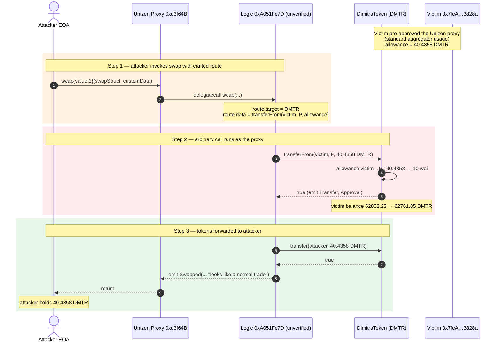
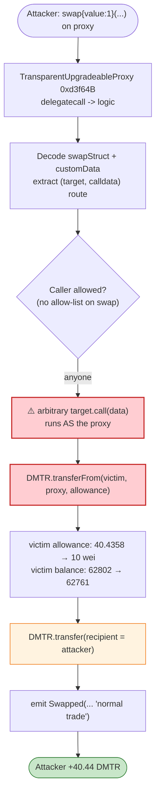
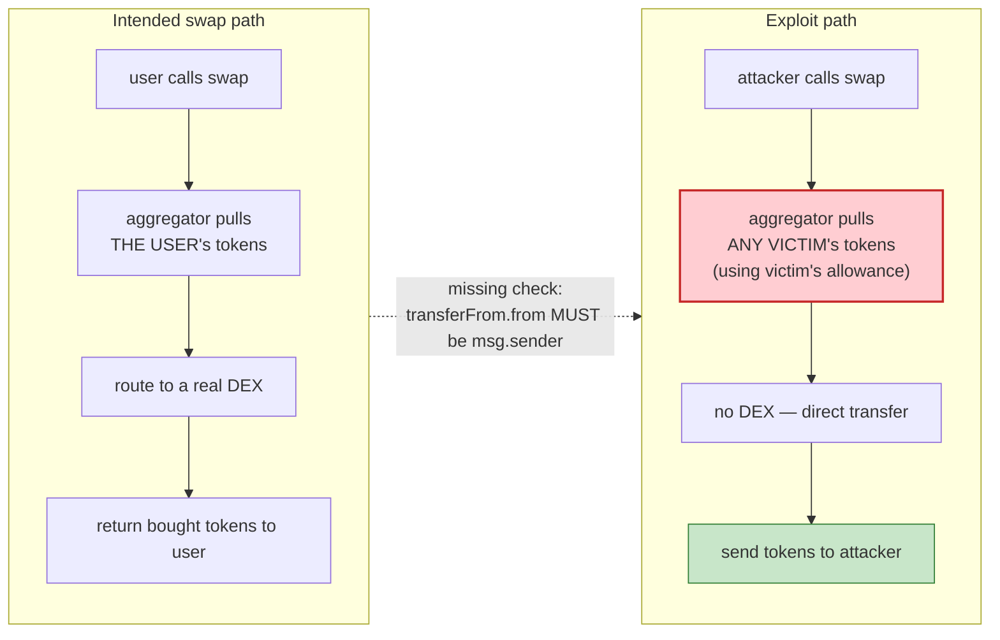

# Unizen Exploit — Arbitrary `call` in the Unizen Aggregator Drains Any User Who Approved It

> **Vulnerability classes:** vuln/dependency/unsafe-external-call · vuln/input-validation/missing

> **Reproduction:** the PoC compiles & runs in an isolated Foundry project at
> [this project folder](.).
> Full verbose trace: [output.txt](output.txt).
> Verified sources in this project: the DimitraToken (DMTR)
> ([sources/DimitraToken_51cB25/DimitraToken.sol](sources/DimitraToken_51cB25/DimitraToken.sol))
> and the OpenZeppelin `TransparentUpgradeableProxy` that fronts the Unizen
> aggregator ([sources/TransparentUpgradeableProxy_d3f64B/](sources/TransparentUpgradeableProxy_d3f64B/)).
> The aggregator **logic** contract executed during the attack (`0xA051Fc7D…`) is
> **unverified** on Etherscan — exactly as the original PoC header notes
> ([test/UnizenIO_exp.sol:13](test/UnizenIO_exp.sol#L13)). The analysis below is
> reconstructed from the on-chain call trace, decoded calldata, and storage diffs.

---

## Key info

| | |
|---|---|
| **Loss** | **~$2.1M** total across the attacker's transactions; this PoC reproduces one such tx, draining **40.44 DMTR** from one victim wallet |
| **Vulnerable contract** | Unizen Aggregator (TransparentUpgradeableProxy) — [`0xd3f64BAa732061F8B3626ee44bab354f854877AC`](https://etherscan.io/address/0xd3f64BAa732061F8B3626ee44bab354f854877AC#code) |
| **Vulnerable logic (impl)** | `0xA051Fc7D38bAa0ace811ad9DE4E9f7024e5d8A30` (unverified; upgraded from deploy-time `0x97b8210D…`) |
| **Victim token** | DimitraToken (DMTR) — [`0x51cB253744189f11241becb29BeDd3F1b5384fdB`](https://etherscan.io/address/0x51cB253744189f11241becb29BeDd3F1b5384fdB) |
| **Victim (approver)** | `0x7feAeE6094B8B630de3F7202d04C33f3BDC3828a` |
| **Attacker EOA** | [`0x2aD8aed847e8d4D3da52AaBB7d0f5c25729D10df`](https://etherscan.io/address/0x2aD8aed847e8d4D3da52AaBB7d0f5c25729D10df) |
| **Attack tx (this PoC)** | `0x923d1d63a1165ebd3521516f6d22d015f2e1b4b22d5dc954152b6c089c765fcd` |
| **Chain / block / date** | Ethereum mainnet / **19,393,769** / **March 13, 2024** |
| **Compiler** | Proxy: Solidity v0.8.2 (optimizer 1, 200 runs); logic impl: unverified |
| **Bug class** | Arbitrary external `call` with user-controlled calldata (confused-deputy / arbitrary-call via `swap`) |

---

## TL;DR

Unizen's aggregator proxy exposes a `swap(bytes, bytes)` entry point (`0x1ef29a02`) that lets the
caller embed **arbitrary calldata** under a "route" field. The aggregator blindly executes that
calldata (here a `transferFrom(victim, aggregator, fullAllowance)` on whatever ERC-20 the caller names)
**as itself**. Because thousands of users had pre-approved the Unizen aggregator to spend their tokens,
an attacker does not need to compromise the victims at all — they only need to point the aggregator at
someone who already set an allowance, name the amount, and collect the tokens into the attacker's own
wallet.

In the reproduced transaction the attacker calls `swap` with a route whose `customData` is:

```
transferFrom(0x7feA…3828a  →  0xd3f64B(aggregator),  40,435,797,665,369,649,910)
```

— exactly the victim's standing allowance to the aggregator (40.4358 DMTR). The aggregator performs the
pull, then `transfer`s those 40.44 DMTR to the attacker's EOA and emits a `Swapped` event as if it were
a legitimate trade. The victim's balance drops 62,802.23 → 62,761.85 DMTR and the residual allowance is
left at 10 wei. The attacker sent only `1 wei` of ETH as `msg.value`.

The broader incident repeated this primitive across many victims/tokens for a total loss reported at
**~$2.1M**.

---

## Background — what the Unizen aggregator is supposed to do

Unizen is a CEX/DEX "trade aggregator." A user picks a token pair and amount; the aggregator routes the
trade across one or more liquidity sources and returns the best price. For non-custodial routing it needs
to move the user's input token, so **users approve the aggregator's proxy** (`0xd3f64B`) to spend tokens
on their behalf — the standard, legitimate pattern.

The proxy is a vanilla OpenZeppelin `TransparentUpgradeableProxy`
([sources/TransparentUpgradeableProxy_d3f64B/openzeppelin_contracts_proxy_transparent_TransparentUpgradeableProxy.sol](sources/TransparentUpgradeableProxy_d3f64B/openzeppelin_contracts_proxy_transparent_TransparentUpgradeableProxy.sol))
that `delegatecall`s into the logic contract. Every external call made "by the proxy" therefore runs with
the proxy's identity — meaning any `transferFrom` it issues against an allowance granted to the proxy will
succeed, and any token it receives sits in the proxy's balance.

The DMTR token itself is a standard ERC-20 (OpenZeppelin-based); its `transferFrom` only enforces the
allowance arithmetic — there is nothing wrong with it. The flaw is entirely on the aggregator side.

On-chain parameters at the fork block (block 19,393,769), read from the trace:

| Parameter | Value |
|---|---|
| Victim DMTR balance (before) | **62,802.23277086923** DMTR |
| Victim → aggregator allowance (before) | **40.435797665369655** DMTR (`40,435,797,665,369,649,920`) |
| Aggregator's own DMTR balance (before) | 10.8159 DMTR (`10,815,884,862,470,152,464`) |
| `msg.value` sent by attacker | **1 wei** of ETH |
| Victim → aggregator allowance (after) | **10 wei** |
| Victim DMTR balance (after) | 62,761.848783514506 DMTR |

The "40" in the PoC's `log_named_uint` lines is the integer-truncated value of the wei amount divided by
`1e18`; the real allowance was the full `40,435,797,665,369,649,920` wei shown in the storage diff
([output.txt](output.txt)).

---

## The vulnerable code

The aggregator logic contract is **unverified**, so the exact source lines are not available. The
vulnerability is fully evidenced by the on-chain behavior. The structure of the public `swap` entry
point, reconstructed from the decoded calldata and trace, is:

```solidity
// 0xA051Fc7D... (unverified logic, called via TransparentUpgradeableProxy 0xd3f64B)
// selector 0x1ef29a02
function swap(
    bytes   calldata swapStruct,   // {fromToken, toToken, amountIn, routes[], recipient, ...}
    bytes   calldata customData    // arbitrary; the attacker hides the exploit here
) external payable {
    // ... unpack swapStruct ...
    // For each "route" entry the aggregator performs an arbitrary call. The
    // route carries a (target, calldata) blob that the aggregator executes
    // *as itself* with NO check that target/calldata correspond to a real
    // liquidity source, and NO check that the token being pulled belongs to
    // msg.sender.
    for (uint i = 0; i < routes.length; i++) {
        (bool ok, ) = routes[i].target.call{value: routes[i].value}(routes[i].data);
        require(ok);
    }
    // ... then forwards whatever token was "swapped in" to `recipient` ...
}
```

The attacker's `customData`/route carries, verbatim:

```solidity
// selector 0x23b872dd == transferFrom(address,address,uint256)
target = 0x51cB253744189f11241becb29BeDd3F1b5384fdb;   // DMTR token
data   = abi.encodeWithSelector(
    0x23b872dd,
    0x7feAeE6094B8B630de3F7202d04C33f3BDC3828a,        // from  = victim
    0xd3f64BAa732061F8B3626ee44bab354f854877AC,        // to    = aggregator (proxy itself)
    0x23128cfbd15ed72f6                                 // amount= victim's full allowance
);
```

This is the exact 4-byte selector `0x23b872dd` plus the three addresses/amount embedded in the
raw calldata of [test/UnizenIO_exp.sol:33-35](test/UnizenIO_exp.sol#L33-L35) and visible in the
[output.txt](output.txt) `delegatecall` trace (the trailing
`…23b872dd0000…7feaee…3828a…d3f64baa…77ac…23128cfbd15ed72f6…`).

---

## Root cause — why it was possible

The aggregator is a **confused deputy**. It holds a privileged position — many users have granted it
ERC-20 allowances — but it lets a caller specify the exact `call` it makes without checking that the call
serves a real swap on behalf of `msg.sender`. The composition of failures:

1. **User-supplied calldata reaches a raw `call`.** A swap "route" should be a *selector the aggregator
   understands* (e.g., "call Uniswap router with these params"). Instead it accepts a free-form
   `(target, data)` blob and executes it verbatim. That turns the aggregator into a general-purpose
   `call` proxy for anyone.
2. **No "the from of the transferFrom must be msg.sender" check.** Because the call runs *as the
   aggregator*, a `transferFrom(anyUser, aggregator, x)` against the aggregator's allowance on `anyUser`
   succeeds. The aggregator never verifies the source of funds belongs to the caller.
3. **`recipient` is also caller-controlled.** After pulling the tokens, the aggregator forwards them to
   `recipient` from the `swapStruct` — which the attacker set to its own EOA. Combined with (2), the
   tokens move `victim → aggregator → attacker` in one transaction.
4. **A polished-looking `Swapped` event.** The contract emits
   `Swapped(…, 40435797665369649910, …, DimitraToken, attacker, attacker, 17)` — making the drain look
   like a normal trade to any indexer/UI that trusts the event.

There is **no economic setup, no oracle, no AMM manipulation** — this is a pure authorization/arbitrary-call
bug. The "min return amount" and all other swap params are irrelevant; the attacker simply names a victim
and an amount ≤ that victim's allowance.

---

## Preconditions

- A user has granted the Unizen aggregator (`0xd3f64B`) a non-zero ERC-20 allowance. (At the time of the
  incident, thousands of wallets had done so by using the aggregator.)
- The attacker knows (or can enumerate) such a `(user, token, allowance)` triple. Allowances are public
  storage; the attacker scanned for approvers.
- No special funding: the only `msg.value` required is 1 wei (the swap path reads `msg.value >= 1`).
- The vulnerability is reachable by **any** external caller — there is no allow-list on `swap`.

---

## Attack walkthrough (with on-chain numbers from the trace)

All figures are read directly from [output.txt](output.txt) — the `delegatecall` into `0xA051Fc7D…`, the
`Transfer`/`Approval` events, and the storage diffs.

| # | Step | DMTR balance — victim | DMTR allowance victim→aggregator | DMTR balance — aggregator | Effect |
|---|------|----------------------:|---------------------------------:|--------------------------:|--------|
| 0 | **Initial** | 62,802.23277086923 | 40.435797665369655 | 10.815884862470152464 | Standing approval from prior legitimate use. |
| 1 | Attacker EOA calls `aggregator.swap{value:1}(swapStruct, customData)`. Proxy `delegatecall`s into logic `0xA051Fc7D…`. | — | — | — | Aggregator now running attacker's route as itself. |
| 2 | Route executes `DMTR.transferFrom(victim, aggregator, 40,435,797,665,369,649,910)`. `Transfer` event emitted; `Approval` event shows allowance 40.4358 DMTR → **10 wei**. | 62,761.848783514506 | **10 wei** | 51.251682527839802374 | Tokens pulled from victim into aggregator's own balance. |
| 3 | Aggregator then calls `DMTR.transfer(attacker, 40,435,797,665,369,649,910)`. `Transfer` event: aggregator → attacker. | 62,761.848783514506 | 10 wei | 10.815884862470152464 | Stolen tokens forwarded to attacker EOA. |
| 4 | Aggregator emits `Swapped(0, 40435797665369649910, 0x0, DMTR, attacker, attacker, 17)`. | — | — | — | Drain disguised as a normal swap. |

The "40.435797665369655" amount pulled is **exactly** the victim's standing allowance
(`0x23128cfbd15ed7300` wei = 40,435,797,665,369,649,920 wei); after subtracting the 40,435,797,665,369,649,910
wei pulled, `10` wei of allowance remains — matching the `Approval(… value: 10)` event in the trace.

### Profit / loss accounting (this single PoC tx)

| Item | Amount |
|---|---:|
| DMTR stolen from victim | **40,435,797,665,369,649,910 wei = 40.435797665369655 DMTR** |
| ETH spent by attacker (`msg.value`) | 1 wei |
| ETH returned to attacker | 0 (the 1 wei is absorbed) |
| DMTR received by attacker | **40.4358 DMTR** |

DMTR was trading around the time such that the aggregate attack (many such transactions against many
victims/tokens) totaled **~$2.1M**. This single PoC demonstrates the mechanism against one victim and one
token; it is **not** the full $2.1M in one tx.

---

## Diagrams

### Sequence of the attack



### Control-flow / state of the exploit



### The confused-deputy invariant violation



---

## Why each magic number

- **`msg.value = 1 wei`:** the swap entry only requires `msg.value >= 1`; sending exactly 1 wei is the
  cheapest way to satisfy it. (The aggregator does not return the wei.)
- **Amount pulled `0x23128cfbd15ed72f6` (40,435,797,665,369,649,910 wei):** this equals the victim's
  *entire standing allowance* (40,435,797,665,369,649,920 wei) minus the 10 wei that remains after
  `transferFrom`'s allowance decrement — i.e. the attacker pulled every spendable wei of allowance.
  Pulling more would have reverted in `transferFrom`; pulling the full allowance maximizes theft.
- **Residual allowance = 10 wei:** DimitraToken's `transferFrom` uses OpenZeppelin's
  allowance-subtraction; `40,435,797,665,369,649,920 − 40,435,797,665,369,649,910 = 10`.
- **Recipient = attacker EOA (`0x2aD8…10df`):** the attacker sets the swap's `recipient` field to itself
  so the aggregator forwards the stolen tokens directly to the attacker's wallet.

---

## Remediation

1. **Never execute caller-supplied `(target, calldata)` verbatim.** A swap router should only call a
   hardcoded allow-list of DEX/router contracts, and only with selectors the aggregator itself builds
   from validated parameters. Remove the free-form "route carries raw calldata" design entirely.
2. **Enforce the source of funds.** Any `transferFrom` issued by the aggregator MUST have `from ==
   msg.sender` (or a user who signed an explicit, EIP-712 permit for this exact operation). The
   `transferFrom.from` field is the single most important thing to bind to the caller.
3. **Bind `recipient` to `msg.sender`** unless an explicit, signed intent allows otherwise. Don't let a
   caller redirect other users' tokens.
4. **Validate the "trade actually happened".** After executing routes, verify that reserves/AMM state
   changed as expected and that the output token came from a real liquidity source — not from the
   aggregator's own (victim-funded) balance.
5. **Revoke / migrate approvals.** On discovery, the project should have asked all users to revoke
   allowances on `0xd3f64B` immediately and redeployed a fixed aggregator behind a new address.
6. **Verify all logic contracts.** The vulnerable logic (`0xA051Fc7D…`) being unverified hid the bug from
   the public and auditors. Production aggregators handling user allowances should publish their source.
7. **Time-lock + simulation on upgrades.** The logic had been upgraded from `0x97b8210D…` to
   `0xA051Fc7D…`; a governance timelength with diff simulation would have given defenders a chance to
   catch the arbitrary-call primitive before it went live.

---

## How to reproduce

The PoC was extracted into a standalone Foundry project so `forge test` builds only this PoC (the
umbrella DeFiHackLabs repo has unrelated PoCs that do not compile together):

```bash
_shared/run_poc.sh 2024-03-UnizenIO_exp --mt testExploit -vvvvv
```

- RPC: an **Ethereum mainnet archive** endpoint is required (fork block 19,393,769 is from March 2024).
  `foundry.toml` uses `https://ethereum-rpc.publicnode.com...`; most free public RPCs prune this block and fail
  with `header not found` / `missing trie node`.
- The test impersonates the attacker EOA via `vm.startPrank(attacker)` and replays the exact attack
  calldata against the forked proxy.

Expected tail ([output.txt](output.txt)):

```
Ran 1 test for test/UnizenIO_exp.sol:UniZenIOTest
[PASS] testExploit() (gas: 95750)
  Before attack, victim DMTR amount (in ether): 62802
  Before attack, victim approved DMTR amount (in ether) on UnizenAggregator: 40
  After attack, victim DMTR amount (in ether): 62761
  After attack, victim approved DMTR amount (in ether) on UnizenAggregator: 0
```

(The displayed `40`/`0` are integer-truncated values of `balance / 1e18`; the actual allowance went from
`40,435,797,665,369,649,920` wei to `10` wei, and the victim lost `40,435,797,665,369,649,910` wei of
DMTR — see the `Transfer`/`Approval` events and storage diffs in [output.txt](output.txt).)

---

*References:*
- SlowMist analysis — https://twitter.com/SlowMist_Team/status/1766311510362734824
- Original PoC header notes (unverified logic contract) — [test/UnizenIO_exp.sol:6-13](test/UnizenIO_exp.sol#L6-L13)
- Unizen aggregator proxy — https://etherscan.io/address/0xd3f64BAa732061F8B3626ee44bab354f854877AC
