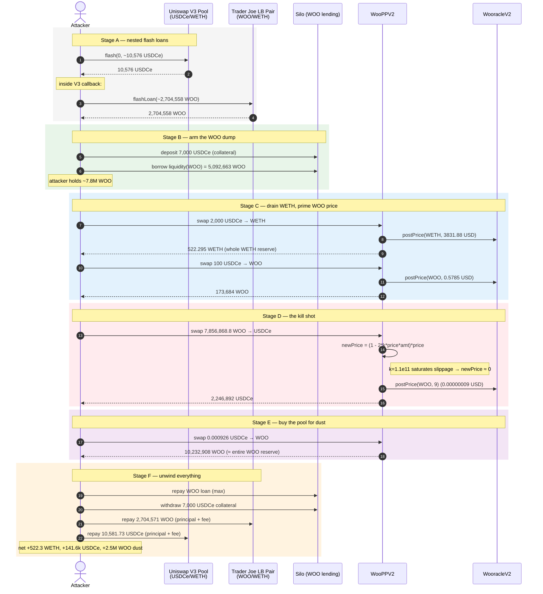
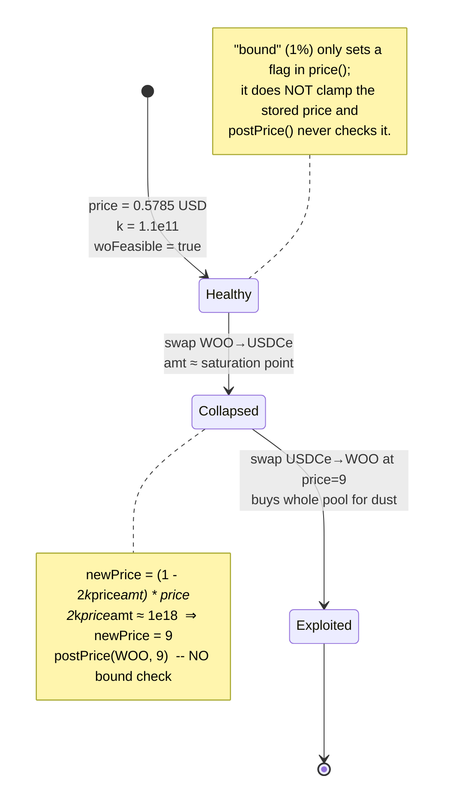
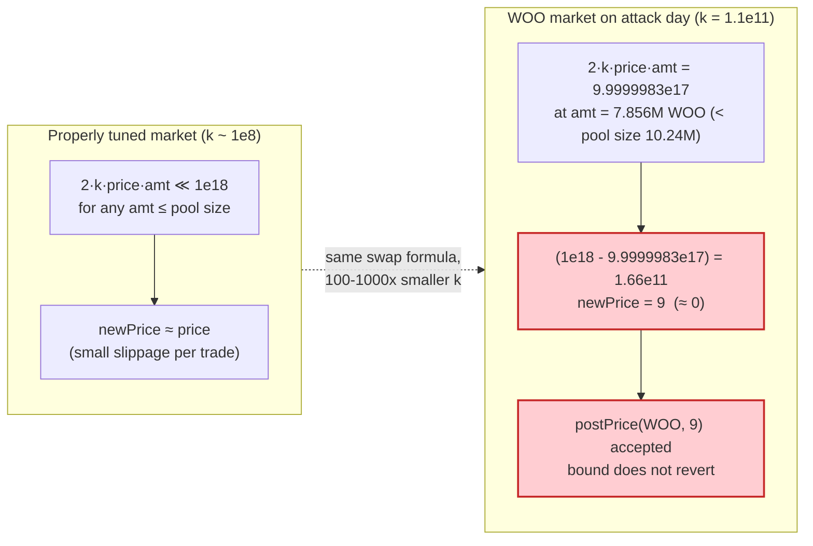

# WooFi (WooPPV2) Exploit — Slippage-Model Price Collapse Drain

> **Vulnerability classes:** vuln/oracle/price-manipulation · vuln/oracle/missing-circuit-breaker

> **Reproduction:** the PoC compiles & runs in an isolated Foundry project at
> [this project folder](.) (the main DeFiHackLabs repo contains many unrelated
> PoCs that do not compile, so this one was extracted).
> Full verbose trace: [output.txt](output.txt).
> Verified vulnerable source:
> [contracts_WooPPV2.sol](sources/WooPPV2_eFF23B/contracts_WooPPV2.sol) and
> [contracts_WooracleV2_1.sol](sources/WooracleV2_1_ZipInherit_73504e/contracts_WooracleV2_1.sol).

---

## Key info

| | |
|---|---|
| **Loss** | **~$8M** (≈ 522.3 WETH + 141,603 USDCe extracted net) |
| **Vulnerable contract** | `WooPPV2` — [`0xeFF23B4bE1091b53205E35f3AfCD9C7182bf3062`](https://arbiscan.io/address/0xeFF23B4bE1091b53205E35f3AfCD9C7182bf3062#code) (Arbitrum) |
| **Oracle contract** | `WooracleV2_1_ZipInherit` — [`0x73504eaCB100c7576146618DC306c97454CB3620`](https://arbiscan.io/address/0x73504eaCB100c7576146618DC306c97454CB3620#code) |
| **Victim pools** | WooPPV2 WETH & USDCe & WOO reserves; WOO lending pool in `Silo` — [`0x5C2B80214c1961dB06f69DD4128BcfFc6423d44F`](https://arbiscan.io/address/0x5C2B80214c1961dB06f69DD4128BcfFc6423d44F) |
| **Attacker EOA** | `0x9961190b258897bca7a12b8f37f415e689d281c4` |
| **Attacker contract** | `0xc3910dca5d3931f4a10261b8f58e1a19a13e0203` (main logic `0x1759f791214168e0292ab6b2180da1c4cf9b764e`) |
| **Attack tx** | [`0x57e555328b7def90e1fc2a0f7aa6df8d601a8f15803800a5aaf0a20382f21fbd`](https://arbiscan.io/tx/0x57e555328b7def90e1fc2a0f7aa6df8d601a8f15803800a5aaf0a20382f21fbd) |
| **Chain / block / date** | Arbitrum / 187,381,784 / **March 5, 2024** |
| **Compiler** | Solidity **v0.8.14**, optimizer **1 run** (`runs = 20000`) |
| **Bug class** | Broken internal price oracle — unbounded slippage-model `postPrice` lets one swap drive the on-chain price to ~0 |

---

## TL;DR

WooFi's `WooPPV2` is a single-pool, oracle-priced swap venue. Every swap **writes the trade's
implied new price back into the `Wooracle`** via `postPrice(base, newPrice)`
([contracts_WooPPV2.sol:378](sources/WooPPV2_eFF23B/contracts_WooPPV2.sol#L378)).
The "new price" comes from a closed-form slippage curve,

`newPrice = (1 − 2·k·price·baseAmount) · price`
([contracts_WooPPV2.sol:552-556](sources/WooPPV2_eFF23B/contracts_WooPPV2.sol#L552-L556)),

and **nothing bounds it**. With the WOO market's slippage coefficient `k`
(`coeff`) set to a very large `110_000_000_000`, a single large WOO→USDCe sell
makes `(1 − 2·k·price·baseAmount)` collapse to ~0, so the posted price falls
from **0.5785 USDC → 9 raw (= 0.00000009 USDC)**. The `bound` circuit breaker in
`Wooracle` ([contracts_WooracleV2_1.sol:247-248](sources/WooracleV2_1_ZipInherit_73504e/contracts_WooracleV2_1.sol#L247-L248))
only flips a *feasibility flag* — it does **not** clamp the price, and the swap
math still consumes the broken `price` field.

Once WOO is priced at ~0, the attacker buys back the entire ~10.24M-WOO pool for
**0.000926 USDC**, repays the WOO it borrowed from Silo, and walks away with the
pool's WETH and USDCe. Flash-loaned USDCe (Uniswap V3) and WOO (Trader Joe LB)
fund the whole thing; both are repaid inside the same tx.

---

## Background — how WooFi prices a swap

`WooPPV2` ([source](sources/WooPPV2_eFF23B/contracts_WooPPV2.sol)) is a private
market-maker pool. One token is the **quote** (here USDCe); every other token is
a **base** (WOO, WETH). For a base→quote sell it computes the quote output and a
**new oracle price** from an AMM-like slippage model, then it (a) pays the user,
(b) updates its internal reserves, and (c) **posts the new price to the
Wooracle** so the next swap starts from it.

The slippage model
([:535-557](sources/WooPPV2_eFF23B/contracts_WooPPV2.sol#L535-L557)):

```solidity
function _calcQuoteAmountSellBase(address baseToken, uint256 baseAmount, State memory state)
    private view returns (uint256 quoteAmount, uint256 newPrice)
{
    require(state.woFeasible, "WooPPV2: !ORACLE_FEASIBLE");
    DecimalInfo memory decs = decimalInfo(baseToken);

    // quoteAmount = baseAmount * price * (1 - k * baseAmount * price - spread)
    uint256 coef = uint256(1e18)
        - ((uint256(state.coeff) * baseAmount * state.price) / decs.baseDec / decs.priceDec)
        - state.spread;
    quoteAmount = (((baseAmount * decs.quoteDec * state.price) / decs.priceDec) * coef) / 1e18 / decs.baseDec;

    // newPrice = (1 - 2 * k * price * baseAmount) * price
    newPrice =
        ((uint256(1e18) - (uint256(2) * state.coeff * state.price * baseAmount) / decs.priceDec / decs.baseDec)
            * state.price) / 1e18;
}
```

The WOO market at the fork block (read from the trace's first `state(WOO)` call):

| Parameter | Value | Meaning |
|---|---|---|
| `price` | 56,608,180 (0.566 USD, 8 dp) | WOO/USD |
| `spread` | 5.56e15 (0.556%) | flat fee |
| **`coeff` (k)** | **110,000,000,000 (1.1e11)** | slippage coefficient — **abnormally large** |
| `woFeasible` | true | oracle considered live |
| WOO reserve (poolSize) | ≈ 10,235,471 WOO (1.0235e25) | pool's WOO inventory |
| USDCe reserve | ≈ 4,049,168 USDCe (4.049e12) | pool's quote inventory |
| WETH reserve | ≈ 522.3 WETH | pool's WETH inventory |

`k = 1.1e11` is the smoking gun. In a well-tuned Woo market `k` is on the order
of `1e8–1e9`; here it is ~100–1000× larger, which makes the linear slippage term
`2·k·price·baseAmount` saturate at `1e18` for a baseAmount of only a few million
WOO. From that point on, *any* additional sell drives `newPrice` to ~0 in one
shot. (Equivalently: the pool's effective depth is a fraction of its advertised
size.)

---

## The vulnerable code

### 1. The swap posts its own computed price back, with no bound

`_sellBase` (base→quote)
([:361-406](sources/WooPPV2_eFF23B/contracts_WooPPV2.sol#L361-L406)):

```solidity
function _sellBase(address baseToken, uint256 baseAmount, uint256 minQuoteAmount, address to, address rebateTo)
    private nonReentrant whenNotPaused returns (uint256 quoteAmount)
{
    require(balance(baseToken) - tokenInfos[baseToken].reserve >= baseAmount, "WooPPV2: BASE_BALANCE_NOT_ENOUGH");
    {
        uint256 newPrice;
        IWooracleV2.State memory state = IWooracleV2(wooracle).state(baseToken);
        (quoteAmount, newPrice) = _calcQuoteAmountSellBase(baseToken, baseAmount, state);
        IWooracleV2(wooracle).postPrice(baseToken, uint128(newPrice));   // ⚠️ unbounded write
    }
    uint256 swapFee = (quoteAmount * tokenInfos[baseToken].feeRate) / 1e5;
    quoteAmount = quoteAmount - swapFee;
    ...
    tokenInfos[baseToken].reserve     = uint192(tokenInfos[baseToken].reserve + baseAmount);
    tokenInfos[quoteToken].reserve    = uint192(tokenInfos[quoteToken].reserve - quoteAmount - swapFee);
    ...
}
```

The same pattern (`postPrice(base, newPrice)` after computing it from the curve)
is in `_sellQuote` ([:432](sources/WooPPV2_eFF23B/contracts_WooPPV2.sol#L432))
and `_swapBaseToBase` ([:485](sources/WooPPV2_eFF23B/contracts_WooPPV2.sol#L485),
[:500](sources/WooPPV2_eFF23B/contracts_WooPPV2.sol#L500)).

### 2. The Wooracle's `bound` does not protect internal price writes

`postPrice` ([contracts_WooracleV2_1.sol:135-140](sources/WooracleV2_1_ZipInherit_73504e/contracts_WooracleV2_1.sol#L135-L140))
just overwrites the stored price, and crucially **skips the freshness timestamp
when called by WooPP**:

```solidity
function postPrice(address base, uint128 newPrice) external onlyAdmin {
    infos[base].price = newPrice;
    if (msg.sender != wooPP) {     // WooPP writes do NOT refresh the timestamp…
        timestamp = block.timestamp;
    }
}                                  // …and there is NO bound check here at all
```

The `bound` (1%, [:247-248](sources/WooracleV2_1_ZipInherit_73504e/contracts_WooracleV2_1.sol#L247-L248))
is only consulted in `price()` / `state()`:

```solidity
bool woPriceInBound = cloPrice_ == 0 ||
    ((cloPrice_ * (1e18 - bound)) / 1e18 <= woPrice_ &&
      woPrice_ <= (cloPrice_ * (1e18 + bound)) / 1e18);
if (woFeasible) {
    priceOut  = woPrice_;          // ← the broken price is still returned
    feasible  = woPriceInBound;    // ← only the FLAG is downgraded
}
```

`state()` returns this `priceOut` as `price` and `feasible` as `woFeasible`
([:298-302](sources/WooracleV2_1_ZipInherit_73504e/contracts_WooracleV2_1.sol#L298-L302)).
The swap math only checks `require(state.woFeasible, …)`. When Chainlink
(`cloPrice`) is unavailable or also reads stale, `woPriceInBound` can stay `true`
even with a broken woPrice — and in any case the broken `price` is what feeds the
curve. So the "circuit breaker" never actually rejects the trade.

---

## Root cause — why it was possible

Three design flaws compose into the drain:

1. **The swap function is its own price oracle.** `WooPPV2` computes a trade's
   marginal price from a slippage curve and then *commits* that price to
   `Wooracle.postPrice`. There is no clamp, no sanity floor, no comparison to the
   Chainlink reference inside the write path. Whatever the curve spits out
   becomes the next swap's starting price.

2. **The slippage coefficient `k` was set ~100–1000× too large for the pool's
   real depth.** With `coeff = 1.1e11`, the linear term `2·k·price·baseAmount`
   reaches `1e18` (i.e. 100% slippage) at a `baseAmount` of only ≈ 7.8M WOO — far
   less than the pool's 10.24M WOO inventory. So a single sell that is *smaller
   than the pool* can push the curve past its linear range and pin `newPrice` at
   ~0. The pool advertises a depth it mathematically cannot honor.

3. **The `bound` circuit breaker is cosmetic.** It flips a boolean; it does not
   reject the trade, does not revert the swap, and does not clamp `price` for the
   next call. `postPrice` bypasses it entirely. The feasibility flag the swap
   actually reads can even stay `true`.

Net effect: **one permissionless swap lets an attacker reprice an asset to near
zero**, after which buying the whole pool costs dust. Because the WOO to sell was
itself borrowed from the Silo lending pool against flash-loaned USDCe, the
attacker needed almost no starting capital.

---

## Preconditions

- A Woo market whose `coeff` (k) is large enough that `2·k·price·baseAmount` can
  saturate at `1e18` for a `baseAmount` smaller than the pool's reserve. (True
  for WOO here: k=1.1e11, pool 10.24M WOO.)
- Permissionless `swap()` — no allow-list, no per-user cap. (True.)
- A source of WOO to dump that is large relative to the saturation point. The
  attacker borrowed it from the Silo WOO lending pool, using flash-loaned USDCe
  as collateral. (7,000 USDCe collateral → 5,092,663 WOO borrowed.)
- Flash loans for the seed capital: Uniswap V3 (USDCe) and Trader Joe LB (WOO).
  Both repaid in-transaction, so the attack is effectively **zero-capital**.

---

## Attack walkthrough (numbers from [output.txt](output.txt))

Token decimals: USDCe = 6, WETH = 18, WOO = 18. All figures are taken from the
forge trace's calls, returns, and `state()` reads.

### Two-stage flash loan

| # | Action | Amount |
|---|--------|-------|
| FL-1 | Borrow USDCe from Uniswap V3 pool `0xC31E…a443` (callback) | **10,576,446,576,012** (≈ 10,576.45 USDCe) |
| FL-2 | Inside the V3 callback, borrow WOO from Trader Joe LB pair `0xB874…28BD` | **2,704,558,014,737,261,187,877,737** (≈ 2,704,558 WOO) |

### Inside the LB flash-loan callback

| # | Step | Concrete value | Effect |
|---|------|---------------:|--------|
| 1 | Deposit USDCe collateral into Silo | **7,000,000,000,000** (7,000 USDCe) | Collateral for WOO borrow. |
| 2 | Read `Silo.liquidity(WOO)` and borrow | **5,092,663,209,802,375,827,262,435** (5,092,663 WOO) | Attacker now holds ~7.797M WOO total (LBT flash + borrow). |
| 3 | **swap USDCe → WETH** (send 2,000 USDCe to WooPP, `swap`) | in **2,000,000,000,000** → out **522,295,261,244,159,469,020** (≈ 522.295 WETH) | Drains the pool's **entire WETH reserve**. `postPrice(WETH, 383188263412)` (3831.88 USD). |
| 4 | **swap USDCe → WOO** (send 100 USDCe, `swap`) | in **100,000,000,000** → out **173,684,596,344,998,196,373,739** (≈ 173,684 WOO) | Small buy at price 0.566; `postPrice(WOO, 57853248)` (0.5785 USD). *Probes the pool and nudges the WOO price.* |
| 5 | **swap WOO → USDCe** — the kill shot (send 7,856,868.8 WOO, `swap`) | in **7,856,868,800,000,000,000,000,000** → out **2,246,892,686,007** (≈ 2,246,892.69 USDCe) | Sells a WOO amount near the saturation point. `newPrice = (1 − 0.999999834)·price →` **`postPrice(WOO, 9)`** (9 raw = **0.00000009 USD**). Pool's WOO reserve ≈ 10,235,471 WOO unchanged in size, but now mispriced ~6.4M× too cheap. |
| 6 | **swap USDCe → WOO** — the buyback (send 0.000926 USDCe, `swap`) | in **926,342** (0.000926 USDCe) → out **10,232,908,094,389,174,718,777,777** (≈ 10,232,908 WOO) | At price=9, dust USDCe buys back ~the entire WOO pool. |
| 7 | Repay Silo WOO debt (`repay(WOO, maxUint256)`) | repays **5,083,902,323,623,058,456,015,968** (5,083,902 WOO), leftover WOO returned to balance | Loan cleared; tiny interest accrued (5,220,006,534,884,979,612,820,252 debt share). |
| 8 | Withdraw USDCe collateral from Silo (`withdraw(USDCe, maxUint256, true)`) | out **7,000,000,000,000** (7,000 USDCe) | Collateral recovered. |
| 9 | Repay LB flash loan | transfer **2,704,571,537,527,334,874,193,677** (2,704,571 WOO, principal + 0.0899% fee + 1e4 dust) | LB pair made whole. |

### Repay the Uniswap V3 flash

| # | Step | Amount |
|---|------|-------|
| 10 | `USDCe.transfer(Univ3pool, 10,581,734,799,301)` (principal + 0.05% fee) | repays the 10,576.45 USDCe flash + **5.28 USDCe** fee |

### Why the price collapsed to 9

Plugging the swap-5 numbers into `_calcQuoteAmountSellBase`'s newPrice term
(coeff = 110_000_000_000, price = 57_853_248, baseAmount = 7.8568688e24,
priceDec = 1e8, baseDec = 1e18):

```
2 · coeff · price · baseAmount / (priceDec · baseDec)
 = 2 · 1.1e11 · 5.7853248e7 · 7.8568688e24 / 1e26
 = 999,999,834,217,697,280            ≈ 9.9999983e17  (i.e. ≈ 1e18)

newPrice = (1e18 − 9.9999983e17) · 57_853_248 / 1e18
         = 165,782,302,720 · 57_853_248 / 1e18
         = 9                                  ← 0.00000009 USD
```

The slippage term saturates at ~100%, so the marginal price after the trade is
essentially zero — and that zero is what gets written to the oracle.

### Profit / loss accounting (per token)

| Token | In (spent / borrowed & repaid) | Out (gained) | Net to attacker |
|---|---:|---:|---:|
| **WETH** | 0 | +522.295 WETH | **+522.295 WETH** (~$1.89M at the time) |
| **USDCe** | flash 10,576.45 + fee 5.28 + Silo deposit 7,000 (all returned) | pool drained of quote during swaps | **+141,603.5 USDCe** (~$141.6k) |
| **WOO** | LBT flash 2,704,558 + Silo borrow 5,092,663 (all returned) | — | **+2,549,710 WOO** (near-worthless post-crash, kept as dust) |
| LB WOO fee | 2,704,571 − 2,704,558 | — | −113 WOO (covered from bought-back WOO) |

**Total extractable value ≈ 522.3 WETH + 141.6k USDCe ≈ $8M.** Every flash loan
and every Silo position is closed inside the transaction; the only things that
actually leave the WooPPV2/Silo system and stay with the attacker are the WETH,
the net USDCe, and leftover WOO dust.

---

## Diagrams

### Sequence of the attack



### WooPPV2 price-write state machine



### Why k = 1.1e11 is fatal (the saturation curve)



---

## Why each magic number

- **Uniswap V3 flash ≈ 10,576 USDCe** (`pool.balance - 10,000`): the largest
  USDCe amount borrowable from the V3 pool minus a dust reserve, used to fund the
  Silo collateral and the seed swaps. Fully repaid with a 0.05% V3 fee.
- **Trader Joe LB flash ≈ 2,704,558 WOO** (`pool WOO balance − 100`): seeds the
  attacker with WOO to combine with the borrowed WOO so the kill-shot sell
  (7.856M WOO) reaches the saturation point. Repaid with a 0.0899% LB fee.
- **Silo deposit 7,000 USDCe → borrow 5,092,663 WOO**: the WOO lending pool's
  full liquidity. This is the dump ammunition — the attacker never owned it.
- **swap-3 input 7,856,868.8 WOO**: chosen so `2·k·price·amt / (priceDec·baseDec)`
  lands at ≈ `1e18` (computed above), pinning `newPrice` to 9 without overflowing
  the `(1e18 − term)` subtraction (which would revert in Solidity 0.8.x). The
  PoC comment marks it as "adjusted value, otherwise overflow in price
  calculation" ([test/Woofi_exp.sol:165](test/Woofi_exp.sol#L165)).
- **swap-4 input 926,342 raw (0.000926 USDCe)**: a dust amount that, at price=9,
  is just enough to pull the entire remaining WOO reserve. Also marked "adjusted
  value to reflect the pool size" ([test/Woofi_exp.sol:172](test/Woofi_exp.sol#L172)).

---

## Remediation

1. **Never let a swap write an unbounded price into the oracle.** The single most
   important fix is to clamp `newPrice` against the Chainlink reference inside
   `_calcQuoteAmountSellBase` / `_calcBaseAmountSellQuote` (or in `postPrice`
   when called by WooPP). Reject (revert) any `newPrice` that deviates more than
   `bound` from `cloPrice`. The `bound` field already exists — it just isn't
   enforced on the write path.
2. **Cap the slippage term.** `2·k·price·baseAmount` must never reach `1e18` for
   a `baseAmount` up to the pool reserve. Either (a) drastically lower `k` to
   match real pool depth, or (b) bound `coef`/`newPrice` so the marginal price
   cannot fall below a sane floor (e.g. `max(newPrice, price * (1 - maxDrop))`).
3. **Validate `k` at config time.** `postState`/`postSpread` should reject a
   `coeff` that makes the saturation point smaller than the current reserve —
   that is exactly the misconfiguration (`k = 1.1e11`) that enabled this.
4. **Make `bound` actually bind.** In `state()`/`price()`, when `!woPriceInBound`
   and Chainlink is available, return `cloPrice` (clamped) as `price` instead of
   the broken `woPrice_`, and/or mark `woFeasible = false` so swaps revert until
   an admin reposts a sane price.
5. **Refresh the timestamp on WooPP writes** (remove the `if (msg.sender != wooPP)`
   skip in `postPrice`), so a manipulated price goes stale quickly and the
   `woFeasible` gate can reject it on the next call.
6. **Add a per-swap max-price-impact check**, independent of `k`: revert if the
   trade would move the posted price by more than X% in one step.

---

## How to reproduce

The PoC was extracted into a standalone Foundry project (the umbrella
DeFiHackLabs repo does not compile as a whole):

```bash
_shared/run_poc.sh 2024-03-Woofi_exp --mt testExploit -vvvvv
```

- RPC: an **Arbitrum archive** endpoint is required (fork block 187,381,784,
  March 5 2024, is over a year old). `foundry.toml` pins an Arbitrum archive RPC;
  most public RPCs prune this block and fail with `missing trie node`.
- The nested-flash-loan structure (Uniswap V3 callback → Trader Joe LB callback)
  is reproduced verbatim in
  [test/Woofi_exp.sol](test/Woofi_exp.sol) (`uniswapV3FlashCallback` →
  `LBFlashLoanCallback`).

Expected tail of [output.txt](output.txt):

```
├─ [0] console::log("USDCe after hack: %s", 141603536376 [1.416e11])
├─ [0] console::log("WOO after hack: %s", 2549710367944099228835575 [2.549e24])
├─ [0] console::log("WETH after hack: %s", 522295261244159469020 [5.222e20])
Suite result: ok. 1 passed; 0 failed; 0 skipped

Ran 1 test suite in 61.02s: 1 tests passed, 0 failed, 0 skipped (1 total tests)
```

i.e. attacker ends with **≈ 522.295 WETH**, **141,603.5 USDCe**, and 2,549,710
leftover WOO — matching the ~$8M loss.

---

*References: [arbiscan attack tx](https://arbiscan.io/tx/0x57e555328b7def90e1fc2a0f7aa6df8d601a8f15803800a5aaf0a20382f21fbd);
PeckShield alert ([twitter](https://twitter.com/PeckShieldAlert/status/1765054155478175943));
spreekaway ([twitter](https://twitter.com/spreekaway/status/1765046559832764886)).*
