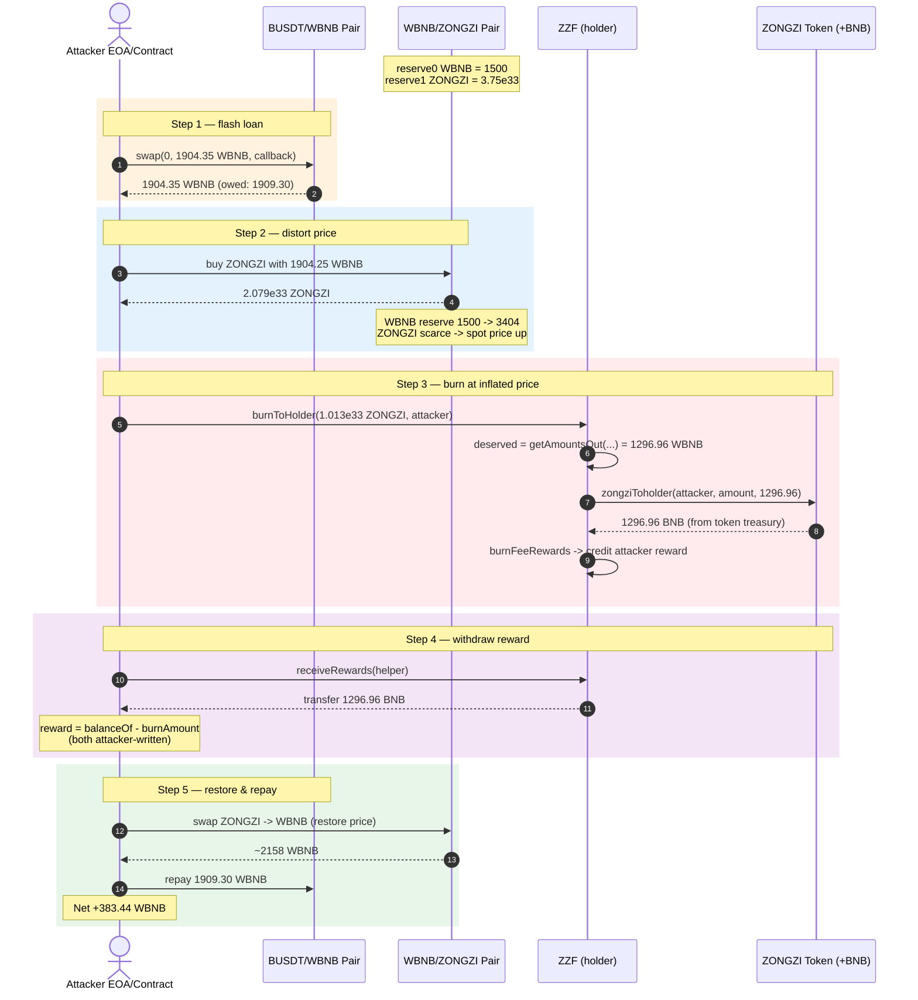
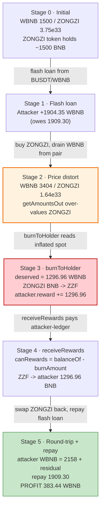
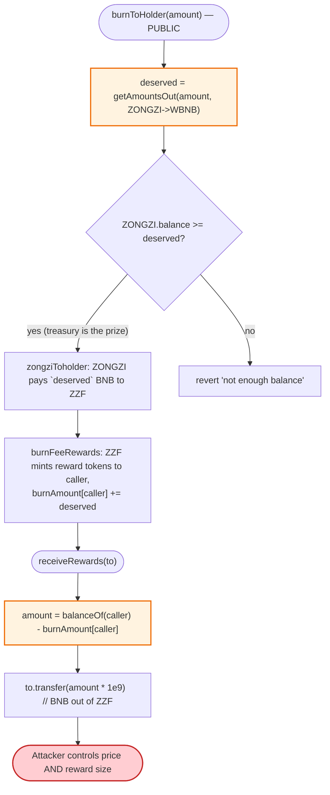

# ZongZi / ZZF Exploit — Manipulated-Price Reward Drain via `burnToHolder` + `receiveRewards`

> **Reproduction:** the PoC compiles & runs in an isolated Foundry project in
> [this folder](.). The umbrella DeFiHackLabs repo contains many unrelated PoCs that
> do not whole-compile, so this one was extracted. Full verbose trace: [output.txt](output.txt).
> Verified vulnerable source: [ZZF.sol](sources/ZZF_B7a254/ZZF.sol) (reward/burn logic),
> [ZONGZI.sol](sources/ZONGZI_BB652D/ZONGZI.sol) (token + `zongziToholder`).

---

## Key info

| | |
|---|---|
| **Loss** | **~$223K** — **383.44 WBNB** stolen from the ZONGZI token contract's BNB reserve |
| **Vulnerable contract** | `ZZF` (ZongZiFa reward/burn manager) — [`0xB7a254237E05cccA0a756f75FB78Ab2Df222911b`](https://bscscan.com/address/0xB7a254237E05cccA0a756f75FB78Ab2Df222911b#code) (composed with the `ZONGZI` token at [`0xBB652D0f1EbBc2C16632076B1592d45Db61a7a68`](https://bscscan.com/address/0xBB652D0f1EbBc2C16632076B1592d45Db61a7a68)) |
| **Victim** | `ZONGZI` token contract — its **BNB balance** held against the "burn-ZongZi-get-BNB" promise |
| **Attacker EOA** | [`0x2c42824eF89d6Efa7847d3997266B62599560A26`](https://bscscan.com/address/0x2c42824ef89d6efa7847d3997266b62599560a26) |
| **Attacker contract** | [`0x0bd0D9BA4f52dB225B265c3Cffa7bc4a418D22A9`](https://bscscan.com/address/0x0bd0d9ba4f52db225b265c3cffa7bc4a418d22a9) |
| **Attack tx** | [`0x247f4b3dbde9d8ab95c9766588d80f8dae835129225775ebd05a6dd2c69cd79f`](https://app.blocksec.com/explorer/tx/bsc/0x247f4b3dbde9d8ab95c9766588d80f8dae835129225775ebd05a6dd2c69cd79f) |
| **Chain / block / date** | BSC / block at the fork tx / **March 25, 2024** |
| **Compiler** | Solidity **v0.8.0+commit.c7dfd78e**, optimizer **1 run** (both contracts) |
| **Bug class** | Price-manipulation via flash loan + reward accounting that trusts a manipulable AMM spot price (`getAmountsOut`) without an oracle / slippage guard; attacker-printed reward magnitude |

---

## TL;DR

`ZZF` is a "burn ZONGZI tokens, receive BNB" reward contract. Its `burnToHolder(amount)`
converts the burn size into BNB by calling the router's `getAmountsOut(amount, [ZongZi, WBNB])`
**at the current spot reserves of the WBNB/ZONGZI pair**
([ZZF.sol:1342-1346](sources/ZZF_B7a254/ZZF.sol#L1342-L1346)). The BNB is paid out of the
**ZONGZI token contract's own BNB balance** via `ZongZi.zongziToholder`
([ZONGZI.sol:1204-1213](sources/ZONGZI_BB652D/ZONGZI.sol#L1204-L1213)), and the caller is then
credited ZZF-side reward tokens equal to that BNB amount
([ZZF.sol:1352-1365](sources/ZZF_B7a254/ZZF.sol#L1352-L1365)).

Both sides of that conversion are attacker-controlled:

1. The **price** is read from an AMM pair the attacker can move with a flash-loaned amount.
2. The **reward** (`canRewards`) is `balanceOf(addr) - burnAmount[addr]`
   ([ZZF.sol:1307-1310](sources/ZZF_B7a254/ZZF.sol#L1307-L1310)), and `burnAmount` is set by the very
   `burnToHolder` call the attacker just made — so the attacker literally sets their own reward.

The attack:

1. Flash-loan **1,904.35 WBNB** from the BUSDT/WBNB pair.
2. Use a `Helper` contract to **crash the ZONGZI price** in the WBNB/ZONGZI pair (sell ZONGZI cheap,
   buy WBNB out → pool now holds far more WBNB per ZONGZI), so `getAmountsOut` over-values ZONGZI in BNB.
3. Call `ZZF.burnToHolder` with the attacker's ZONGZI — the inflated `getAmountsOut` makes the BNB
   "deserved" amount enormous, and the ZONGZI contract hands that BNB to `ZZF`, which credits the
   attacker with a giant reward.
4. Call `ZZF.receiveRewards` to pull the BNB out.
5. Swap the BNB back to WBNB, repay the flash loan + 0.26% fee, keep **383.44 WBNB** of profit.

Net result: the ZONGZI token's BNB treasury is drained; the AMM pair is left with a depressed
ZONGZI price.

---

## Background — the ZongZi / ZZF "burn-for-BNB" scheme

Two contracts cooperate:

- **`ZONGZI`** ([source](sources/ZONGZI_BB652D/ZONGZI.sol)) — a fee-on-transfer ERC20 that holds BNB
  (accumulated from its sell-tax swapping) and exposes a privileged `zongziToholder(to, amount, balance)`
  ([:1204-1213](sources/ZONGZI_BB652D/ZONGZI.sol#L1204-L1213)). That function **burns `amount` of
  ZONGZI from `to` into the holder contract and transfers `balance` BNB from the token to the holder**.
  It is gated only by `msg.sender == zongziHolder`.

- **`ZZF` (ZongZiFa)** ([source](sources/ZZF_B7a254/ZZF.sol)) — the designated `zongziHolder`. It is a
  reflect-token (tax/liquidity-fee) that also manages a reward ledger. Its `burnToHolder(amount, _invitation)`
  ([:1331-1351](sources/ZZF_B7a254/ZZF.sol#L1331-L1351)) lets **any user** burn ZONGZI and receive the
  BNB-equivalent reward:

```solidity
function burnToHolder(uint256 amount, address _invitation) external {
    require(amount >= 0, "TeaFactory: insufficient funds");
    address sender = _msgSender();
    ...
    address[] memory path = new address[](2);
    path[0] = address(_burnToken);                 // ZONGZI
    path[1] = uniswapRouter.WETH();                // WBNB
    uint256 deserved = 0;
    deserved = uniswapRouter.getAmountsOut(amount, path)[path.length - 1];   // ⚠️ spot price
    require(payable(address(_burnToken)).balance >= deserved, 'not enough balance');
    _burnToken.zongziToholder(sender, amount, deserved);   // ZONGZI pays `deserved` BNB to ZZF
    _BurnTokenToDead(sender, amount);                      // burn handling / inviter share
    burnFeeRewards(sender, deserved);                      // credit sender's reward ledger
}
```

The reward is then claimable via `receiveRewards`:

```solidity
function receiveRewards(address payable to) external {
    address addr = msg.sender;
    uint256 balance = balanceOf(addr);
    uint256 amount = balance.sub(burnAmount[addr]);        // ⚠️ "reward" = balance − burned
    require(amount > 0);
    Rewards[addr] = Rewards[addr].add(amount);
    historyRewards[addr] = historyRewards[addr].add(amount);
    to.transfer(amount.mul(10**9));                        // pay BNB to `to`
    _transfer(addr, address(this), balance);
    burnAmount[addr] = 0;
    ...
}
```

Two facts make this exploitable:

1. **`deserved` is priced from the AMM spot reserves** (`getAmountsOut`), which the attacker can move
   with a flash-loaned swap. Move the pair so that ZONGZI is "cheap" against WBNB and each ZONGZI
   burned is over-credited in BNB.
2. **`canRewards(addr) = balanceOf(addr) − burnAmount[addr]`** ([:1307-1310](sources/ZZF_B7a254/ZZF.sol#L1307-L1310)).
   `burnAmount[addr]` is *raised* inside `burnToHolder → burnFeeRewards` by exactly the `deserved` BNB
   amount converted to ZZF units (`increase.div(10**9)`), and the caller is simultaneously transferred
   that many ZZF tokens from the contract ([:1353-1356](sources/ZZF_B7a254/ZZF.sol#L1353-L1356)). The
   two write each other in lock-step, so the caller dictates the size of their own reward by dictating
   the spot price.

### On-chain state at the fork block

| Parameter | Value |
|---|---|
| WBNB held by the WBNB/ZONGZI pair | **1,500 WBNB** |
| ZONGZI held by the WBNB/ZONGZI pair | 3.75e33 (9-dec) |
| BNB held by the **ZONGZI token** contract | the prize (~1,500+ BNB before the attack) |
| `ZZF.decimals` | 9 |
| `ZONGZI.decimals` | 18 |

---

## The vulnerable code

### 1. Spot-price reward sizing (`ZZF.burnToHolder`)

```solidity
// ZZF.sol:1342-1351
address[] memory path = new address[](2);
path[0] = address(_burnToken);
path[1] = uniswapRouter.WETH();
uint256 deserved = 0;
deserved = uniswapRouter.getAmountsOut(amount, path)[path.length - 1];  // reads AMM reserves
require(payable(address(_burnToken)).balance >= deserved, 'not enough balance');
_burnToken.zongziToholder(sender, amount, deserved);
_BurnTokenToDead(sender, amount);
burnFeeRewards(sender, deserved);
```

### 2. Self-set reward ledger (`ZZF.receiveRewards` + `canRewards`)

```solidity
// ZZF.sol:1307-1322
function canRewards(address addr) public view returns (uint256) {
    uint256 amount = balanceOf(addr).sub(burnAmount[addr]);
    return amount;
}
function receiveRewards(address payable to) external {
    address addr = msg.sender;
    uint256 balance = balanceOf(addr);
    uint256 amount = balance.sub(burnAmount[addr]);
    require(amount > 0);
    ...
    to.transfer(amount.mul(10**9));   // BNB payout scaled back to 18 decimals
    _transfer(addr, address(this), balance);
    burnAmount[addr] = 0;
}
```

### 3. ZONGZI pays BNB on demand (`ZongZi.zongziToholder`)

```solidity
// ZONGZI.sol:1204-1213
function zongziToholder(address to, uint256 amount, uint256 balance) external {
    require(msg.sender == address(zongziHolder), 'only zongzis');
    require(launch, 'unlaunch');
    uint256 _amount = balanceOf(to);
    require(_amount >= amount, 'not enough');
    super._transfer(to, address(zongziHolder), amount);   // move ZONGZI to holder
    uint256 _balance = payable(address(this)).balance;
    require(_balance >= balance, "Droped out");
    payable(address(zongziHolder)).transfer(balance);     // pay `balance` BNB to holder (ZZF)
}
```

---

## Root cause — why it was possible

The contract converts a **token-quantity obligation** (burn N ZONGZI → get BNB) into a BNB amount
using the **instantaneous AMM spot price**, with no slippage bound, no TWAP, and no flash-loan-aware
re-entrancy guard across the swap step. Because the pair is the only price source and is manipulable
within the same transaction by a flash-loaned trade, the attacker controls the conversion rate.

Worse, the reward is then sized *again* off-chain-of-custody accounting (`balanceOf − burnAmount`)
that the same `burnToHolder` call writes. There is no independent "how much BNB did this burn actually
entitle you to" cap — `canRewards` trusts whatever `balanceOf` the caller engineered. The two design
choices compose into a self-serve BNB printer:

- **Price source is manipulable.** `getAmountsOut` reads live reserves. Crash ZONGZI's price first
  and the same burn yields a much larger `deserved` BNB figure.
- **No slippage / freshness check.** The `require(payable(...).balance >= deserved)` only checks the
  treasury has *enough* BNB — it does not bound how much is fair.
- **Reward accounting trusts attacker-set state.** `burnFeeRewards` mints ZZF to the caller and bumps
  `burnAmount` by the same inflated figure, so `receiveRewards` pays out the full inflated amount.
- **Anyone may call `burnToHolder`.** No allow-list, no per-user cap, no cooldown.

The deflationary/reflect machinery of ZZF (tax fee, liquidity fee) does not help: the attacker's calls
route through the fee-excluded contract-self transfers inside `burnFeeRewards`/`receiveRewards`
(`_transfer(address(this), ...)`), so no tax is taken on the reward minting.

---

## Preconditions

- `ZONGZI.launch == true` (the token is live — `zongziToholder` requires it). It was.
- Sufficient BNB in the ZONGZI token contract to cover the inflated `deserved` (the treasury was the
  prize; the attacker sized the burn to extract up to its balance).
- A flash-loanable liquid pair on the same chain — **BUSDT/WBNB** (`0x16b9…0daE`) supplied 1,904.35
  WBNB via PancakeSwap's `swap` callback (`pancakeCall`). No upfront capital required.
- The WBNB/ZONGZI pair reserves small enough that a ~1,900-WBNB move materially distorts the spot
  price (initial WBNB reserve was only 1,500 WBNB).

---

## Attack walkthrough (numbers from the trace)

All values are taken from the `Sync` / `Swap` / `Transfer` events in [output.txt](output.txt). The
WBNB/ZONGZI pair has `token0 = WBNB`, `token1 = ZONGZI`, so `reserve0` = WBNB, `reserve1` = ZONGZI.

Flash loan: `BUSDT_WBNB.swap(0, 1904.3478 WBNB, this, 0x01)` → PancakeSwap callback delivers
**1,904.347826 WBNB** to the attacker. Repayment due at the end: **1,909.299130 WBNB** (1,904.3478 × 1.0026).

| # | Step | WBNB reserve | ZONGZI reserve | Effect |
|---|------|-------------:|---------------:|--------|
| 0 | **Initial** | 1,500.00 | 3.75e33 | Calm pool. |
| 1 | Helper: probe swap 0.1 WBNB → ZONGZI, then ZONGZI → WBNB; price baseline established | 1,500.10 | ~3.75e33 | Helper now holds ZONGZI dust + a sliver of WBNB. |
| 2 | Helper: buy ZONGZI with the bulk WBNB (**1,904.2478 WBNB → 2.079e33 ZONGZI**) | 3,404.25 | 1.642e33 | **Pool's WBNB reserve doubled**; ZONGZI now scarce → each ZONGZI is "worth more" WBNB at the new spot. |
| 3 | Helper computes `getAmountsIn` for 1,296.96 ZONGZI-equivalent and calls **`ZZF.burnToHolder(1.013e33 ZONGZI, attacker)`** | 3,404.25 | 1.642e33 | `deserved = getAmountsOut(1.013e33) = 1,296.96 WBNB`. ZONGZI pays **1,296.96 BNB** to ZZF; attacker credited 1,296.96 (÷1e9) reward units. |
| 4 | Helper calls **`ZZF.receiveRewards(helper)`** → helper receives **1,296.96 BNB** | — | — | Reward ledger drained for this address; BNB moved from ZZF to Helper. |
| 5 | Helper swaps remaining ZONGZI back through the pair to recover WBNB | 2,163.57 | 2.708e33 | Price partially restored; Helper nets WBNB. |
| 6 | Helper wraps BNB → WBNB, returns **2,158.21 WBNB** to the attacker contract | — | — | Attacker contract now holds ~2,158.21 WBNB (+ leftover). |
| 7 | Attacker swaps leftover ZONGZI → WBNB via the pair | 2,017.80 | 2.911e33 | Extra 134.53 WBNB out. |
| 8 | Attacker repays flash loan: transfers **1,909.2991 WBNB** to BUSDT/WBNB | — | — | Flash loan closed. |
| 9 | **Final attacker WBNB balance** | — | — | **383.438939 WBNB** = profit. |

> The 383.44 WBNB equals (WBNB pulled out of the ZONGZI treasury + slippage gains on the manipulated
> pair) minus the 0.26% flash-loan fee on 1,904.35 WBNB. The mechanical chain is: ZONGZI's BNB
> → ZZF (via `zongziToholder`) → Helper (via `receiveRewards`) → attacker → flash-loan repayment → net.

### Profit / loss accounting (WBNB)

| Direction | Amount |
|---|---:|
| Flash-loaned in (from BUSDT/WBNB) | +1,904.3478 |
| BNB drained from ZONGZI via `receiveRewards` | +1,296.9613 (≈) |
| AMM round-trip slippage / residual WBNB swaps | +small |
| Repaid to BUSDT/WBNB (principal + 0.26% fee) | −1,909.2991 |
| **Net profit (final attacker WBNB balance)** | **+383.4389** |

At the time (~$580/BNB, March 2024) this is **~$222K**, matching the PoC header `Total Lost : ~$223K`.

---

## Diagrams

### Attack sequence



### Pool-state + reward-ledger flow



### Where the logic breaks (control-flow)



---

## Remediation

1. **Do not price protocol obligations from an AMM spot price.** Use a TWAP (Uniswap V2 `price*CumulativeLast`
   over a window) or a dedicated oracle (Chainlink) for the ZONGZI/BNB rate. At minimum, enforce a
   maximum-acceptable `deserved` (slippage bound) passed by a trusted setter, not the caller.
2. **Cap and reset the reward ledger independently of the burn.** `canRewards` should reflect a
   protocol-computed entitlement (e.g., a per-block accrual), not `balanceOf − burnAmount` where both
   terms are attacker-influenceable in the same call.
3. **Add re-entrancy / same-transaction price-integrity guards.** Either (a) disallow `burnToHolder` in
   the same block as a large swap on the WBNB/ZONGZI pair, or (b) snapshot reserves before the swap and
   verify they haven't moved more than X% within the call.
4. **Access-control `burnToHolder`.** If it is a reward mechanism for a known set of burners, gate it.
   Leaving it open to anyone with a flash-loaned manipulable price is the root enabler.
5. **Separate custody from pricing.** The ZONGZI token holding BNB and honoring a price quoted from an
   external pair conflates treasury with market — the treasury should only ever pay out of an audited
   reward pool sized in BNB, not a live-conversion of burned tokens.

---

## How to reproduce

The PoC was extracted into a standalone Foundry project (the umbrella repo does not whole-compile):

```bash
_shared/run_poc.sh 2024-03-ZongZi_exp --mt testExploit -vvvvv
```

- **RPC:** a **BSC archive** endpoint is required (the fork is at the March-2024 attack block).
  `foundry.toml` uses `https://bsc-mainnet.public.blastapi.io`, which serves historical state; most
  public BSC RPCs prune old state and fail with `header not found` / `missing trie node`.
- **Mechanism:** the test forks at the attack tx, flash-borrows 1,904.35 WBNB from BUSDT/WBNB via
  `pancakeCall`, drives the WBNB/ZONGZI price, burns through `ZZF.burnToHolder`, claims via
  `ZZF.receiveRewards`, restores, and repays.

Expected tail:

```
Ran 1 test for test/ZongZi_exp.sol:ContractTest
[PASS] testExploit() (gas: 2687359)
Logs:
  Exploiter WBNB balance before attack: 0.000000000000000000
  Exploiter WBNB balance after attack: 383.438938729511271045
```

Profit: **383.4389 WBNB** (≈ $223K at the time), matching the PoC header.

---

*Reference: DeFiHackLabs PoC — ZongZi/ZZF, BSC, ~$223K, attack tx
`0x247f4b3dbde9d8ab95c9766588d80f8dae835129225775ebd05a6dd2c69cd79f`.*
