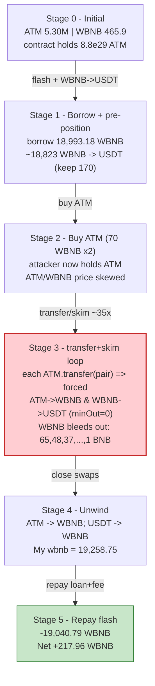
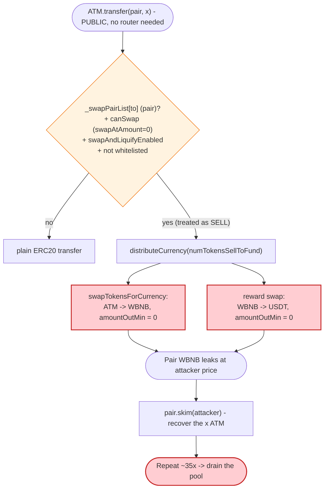

# ATM Token Exploit — Forced Zero-Slippage Auto-Swaps Drained via `transfer` + `skim`

> One-liner: ATM's tax/"auto-distribute" logic dumps the contract's own tokens into the AMM pair with **`amountOutMin = 0`** on every *sell*; treating a direct ERC20 `transfer` to the pair as a "sell" lets anyone trigger that dump repeatedly and `skim()` the tokens back, draining the pool's WBNB for ~218 BNB profit.

> **Reproduction:** the PoC compiles & runs in an isolated Foundry project at
> [this project folder](.) (the umbrella DeFiHackLabs repo does not whole-compile, so this PoC was extracted).
> Full verbose trace: [output.txt](output.txt).
> Verified vulnerable source: [sources/Token_a5957E/Token.sol](sources/Token_a5957E/Token.sol).

---

## Key info

| | |
|---|---|
| **Loss / profit** | **+217.96 WBNB** net to the attacker (≈ **$120K–$182K** at the time). Drained from the ATM/WBNB PancakeSwap pair. |
| **Vulnerable contract** | `ATM` (ERC20 with tax/auto-swap) — [`0xa5957E0E2565dc93880da7be32AbCBdF55788888`](https://bscscan.com/address/0xa5957E0E2565dc93880da7be32AbCBdF55788888#code) |
| **Victim pool** | ATM/WBNB PancakeSwap V2 pair — [`0x1F5b26DCC6721c21b9c156Bf6eF68f51c0D075b7`](https://bscscan.com/address/0x1F5b26DCC6721c21b9c156Bf6eF68f51c0D075b7) |
| **Flash-loan source** | PancakeSwap V3 WBNB pool — `0x36696169C63e42cd08ce11f5deeBbCeBae652050` |
| **Reward/sandwich token** | USDT — `0x55d398326f99059fF775485246999027B3197955` |
| **Attack tx** | `0xee10553c26742bec9a4761fd717642d19012bab1704cbced048425070ee21a8a` ([blocksec](https://app.blocksec.com/explorer/tx/bsc/0xee10553c26742bec9a4761fd717642d19012bab1704cbced048425070ee21a8a)) |
| **Chain / block / date** | BSC / fork at **37,483,300** / Apr 2024 |
| **Compiler** | Solidity **v0.8.17**, optimizer **1 run** (token); PoC `^0.8.10` |
| **Bug class** | Business-logic flaw — forced un-slipped AMM swaps + treating direct transfers as "sells" |

---

## TL;DR

`ATM` is a "tax token" that, on every *sell*, takes a 3% fee in ATM into its own balance and then runs
`distributeCurrency()` ([Token.sol:1102](sources/Token_a5957E/Token.sol#L1102)). That routine sells the
contract's accumulated ATM into the **same pair** via
`swapExactTokensForTokensSupportingFeeOnTransferTokens(amount, 0, …)` — i.e. with **zero minimum
output** ([Token.sol:1196-1208](sources/Token_a5957E/Token.sol#L1196-L1208)) — and then swaps the
WBNB "rewards" share into USDT, again with **`amountOutMin = 0`**
([Token.sol:1144-1157](sources/Token_a5957E/Token.sol#L1144-L1157)).

Two design mistakes combine into a drain:

1. **A direct ERC20 `transfer` to the pair counts as a "sell."** The auto-swap gate in `_transfer`
   keys off `_swapPairList[to]` ([Token.sol:966-981](sources/Token_a5957E/Token.sol#L966-L981)) — it
   does not require the call to come *through* the router. So `ATM.transfer(pair, x)` triggers the
   forced dump, and then `pair.skim(attacker)` returns the `x` ATM that was just parked there.
   The attacker can repeat this cheaply, forcing the contract to keep selling.
2. **The forced swaps are un-slipped (`amountOutMin = 0`).** The attacker first skews the pool with a
   flash loan, so each forced swap executes at a manipulated price. The attacker brackets the
   contract's WBNB→USDT reward swaps (a classic sandwich, the PoC's `WBNB→USDT` / `USDT→WBNB`
   round-trip) and pockets the price impact of the contract's own forced selling.

The attacker funds the whole thing with a **~18,993 WBNB flash loan** from a Pancake V3 pool, runs the
transfer/skim loop ~35 times to bleed WBNB out of the pair, repays the loan + 0.25% fee, and walks away
with **217.96 WBNB**.

---

## Background — what ATM does

`ATM` ([source](sources/Token_a5957E/Token.sol)) is a 1-decimal BSC meme/tax token with a dividend
tracker bolted on. Its on-chain configuration at the fork block (read with `cast`):

| Parameter | Value | Meaning |
|---|---|---|
| `decimals()` | **1** | ATM uses a single decimal place. |
| `isLaunch` | `true` | Trading is open; fees apply. |
| `swapAtAmount` | **0** | `canSwap = contractBalance >= 0` ⇒ **always true** when the contract holds ATM. |
| `numTokensSellRate` | **100** | Up to 100% of a transfer's size is force-sold (capped at the contract balance). |
| `swapAndLiquifyEnabled` | `true` | Auto-distribute is on. |
| `buy_totalFees` / `sell_totalFees` | **300 / 300** (3%) | Fee taken in ATM into the contract on each trade. |
| `buy_ETHRewardsFee` | **260** | 2.6% of fees are designated for the USDT "reward" swap. |
| `currency` | **WBNB** | The fee-swap output token / pair quote asset. |
| `ETH` (reward token) | **USDT** | The dividend/reward asset; fees are partly swapped WBNB→USDT. |
| **ATM held by the contract itself** | **8.8e30 raw (≈ 8.8e29 ATM)** | Huge pre-accumulated fee balance — fuel for the forced selling. |
| Pair reserve — ATM (`reserve0`) | **52,983,672 raw (≈ 5,298,367 ATM)** | The pair's ATM side. |
| Pair reserve — WBNB (`reserve1`) | **465.91 WBNB** | The pair's WBNB side. |
| WBNB in the V3 flash pool | **≈ 18,994 WBNB** | The flash-loanable amount. |

The pair has `token0 = ATM`, `token1 = WBNB`, so `getReserves()` returns `(ATM, WBNB, …)` — exactly
what the PoC reads at [ATM_exp.sol:49](test/ATM_exp.sol#L49).

---

## The vulnerable code

### 1. The auto-swap gate treats `_swapPairList[to]` as a sell — no router required

```solidity
// Token.sol  _transfer(...)
uint256 contractTokenBalance = balanceOf(address(this));
bool canSwap = contractTokenBalance >= swapAtAmount;          // swapAtAmount == 0 ⇒ always true

uint256 numTokensSellToFund = (amount * numTokensSellRate) / 100;   // 100% of `amount`
if (numTokensSellToFund > contractTokenBalance) numTokensSellToFund = contractTokenBalance;

if (
    canSwap &&
    !swapping &&
    _swapPairList[to] &&            // ⚠️ ANY transfer whose recipient is the pair = "sell"
    !_feeWhiteList[from] &&
    !_feeWhiteList[to] &&
    swapAndLiquifyEnabled &&
    (buy_totalFees + sell_totalFees) > 0
) {
    swapping = true;
    distributeCurrency(numTokensSellToFund);     // ⚠️ forced dump of contract ATM
    swapping = false;
}
```

[Token.sol:957-981](sources/Token_a5957E/Token.sol#L957-L981). A *raw* `transfer(pair, x)` (no router,
no `swap()`) satisfies `_swapPairList[to]`, so it fires `distributeCurrency`.

### 2. `distributeCurrency` sells the contract's ATM and swaps WBNB→USDT, both with `amountOutMin = 0`

```solidity
function distributeCurrency(uint256 tokenAmount) private {
    ...
    swapTokensForCurrency(tokenAmount - lpTokenAmount);   // ATM -> WBNB, see below
    ...
    // dividend portion: WBNB -> USDT, amountOutMin = 0
    _swapRouter.swapExactTokensForTokensSupportingFeeOnTransferTokens(
        dividendsAmount, 0, buyRewardTokenPath /* [WBNB, USDT] */, address(this), block.timestamp
    );
    ...
}

function swapTokensForCurrency(uint256 tokenAmount) private {
    address[] memory path = [address(this), currency /* WBNB */];
    _approve(address(this), address(_swapRouter), tokenAmount);
    _swapRouter.swapExactTokensForTokensSupportingFeeOnTransferTokens(
        tokenAmount,
        0,                       // ⚠️ amountOutMin = 0  — no slippage protection
        path,
        address(_tokenDistributor),
        block.timestamp
    );
    ...
}
```

[Token.sol:1102-1182](sources/Token_a5957E/Token.sol#L1102-L1182) and
[Token.sol:1188-1220](sources/Token_a5957E/Token.sol#L1188-L1220). Both legs trade into pools the
attacker has pre-skewed, at any price the AMM will give.

---

## Root cause — why it was possible

A Uniswap-V2/PancakeSwap pair pays out `swap()` amounts purely from its reserves, with **no price
floor unless the caller passes one** via `amountOutMin`. ATM's auto-distribute logic passes `0`. That
turns the contract into a forced, price-insensitive seller of its own token.

Three decisions compose into the bug:

1. **"Sell" detection by recipient, not by call path.** The auto-swap condition only checks
   `_swapPairList[to]`. A direct ERC20 `transfer` to the pair therefore *is* a "sell" as far as the
   token is concerned, even though no AMM swap happened. The attacker uses `transfer(pair, x)` purely
   to *trigger* the contract's forced selling, then `skim()`s the `x` ATM back out — so the trigger is
   essentially free and infinitely repeatable.
2. **`amountOutMin = 0` on every protocol-initiated swap.** Both the ATM→WBNB fee swap and the
   WBNB→USDT reward swap accept any output. Sandwiched by a flash-loan-skewed pool, they execute at
   attacker-chosen prices, leaking value on each call.
3. **`swapAtAmount = 0` + 8.8e29 ATM pre-loaded in the contract.** With the threshold at zero and a
   massive fee balance already sitting in the contract, `canSwap` is always true and there is plenty of
   inventory to force-sell. The attacker only needs to repeatedly nudge `_transfer` to keep the
   pump-and-dump cycle going.

The PoC's `WBNB→USDT` (start) and `USDT→WBNB` (end) bracket exactly the contract's reward-swap leg —
the attacker pre-positions in USDT, lets the contract's forced WBNB→USDT swaps move the USDT/WBNB price,
and unwinds — while the transfer/skim loop simultaneously bleeds WBNB out of the ATM/WBNB pair via the
forced ATM→WBNB selling.

---

## Preconditions

- `isLaunch == true` and `swapAndLiquifyEnabled == true` (both held at the fork block).
- `swapAtAmount == 0` and the contract holds a large ATM fee balance (8.8e29 ATM) — guarantees the
  forced-sell path always fires with inventory to spend.
- A flash-loan source for WBNB (Pancake V3 pool with ~18,994 WBNB) to skew the pool and bankroll the
  sandwich. The whole position is repaid intra-transaction, so the attack is **flash-loanable** and
  needs no attacker capital.
- The ATM/WBNB pair must hold enough WBNB to make the drain worthwhile (465.9 WBNB at fork; the loop
  bleeds it down over ~35 iterations).

---

## Attack walkthrough (with on-chain numbers from the trace)

All figures are from the run log in [output.txt](output.txt) / [the captured quick log](output_quick.txt).
WBNB amounts are in 18-decimal units; "Pair lost" prints the WBNB the pair lost that iteration in whole BNB.

| # | Step | Concrete numbers | Effect |
|---|------|------------------|--------|
| 0 | **Flash-borrow WBNB** from the V3 pool (`pool.flash`) | `borrow = poolWBNB − 1e18 = 18,993.18 WBNB` | Attacker is funded; must repay `18,993.18 × 10000/9975 + 1e-15 ≈ 19,040.79 WBNB`. |
| 1 | **WBNB → USDT** for all but 170 WBNB (`swap_token_to_token(WBNB, USDT, bal − 170)`) | ≈ 18,823 WBNB → USDT | Pre-positions in USDT to sandwich the contract's reward (WBNB→USDT) swaps. |
| 2 | **Buy ATM with 70 WBNB** (`swap_token_to_token(WBNB, ATM, 70)`), ×2 outer loop | 70 WBNB → ATM each pass | Gives the attacker ATM to feed the transfer/skim loop and skews the ATM/WBNB price. |
| 3 | **transfer→skim loop** (inner `while i<100`, broken when `pair_lost == 7`) | per-iter WBNB drained: **65, 48, 37, 29, 23, 19, 16, 13, 11, 10, 8, 7** BNB (pass 1); **73, 42, 28, 19, 14, 11, 9, 7** BNB (pass 2) | Each `ATM.transfer(pair, bal)` triggers the contract's forced ATM→WBNB + WBNB→USDT swaps; `skim` returns the ATM. WBNB bleeds out of the pair into the contract's swap path, captured by the attacker's sandwich. |
| 4 | **Cleanup loop** (`while i<15`, broken when `pair_lost == 0`) | per-iter: **6, 5, 4, 3, 3, 2, 2, 2, 1, 1, 1, 1, 1, 1, 1** BNB | Wrings out the last of the pair's WBNB once the per-call yield drops below 1 BNB. |
| 5 | **ATM → WBNB** — dump remaining ATM (`swap_token_to_token(ATM, WBNB, ATM.balanceOf)`) | all attacker ATM → WBNB | Converts leftover ATM back to WBNB. |
| 6 | **USDT → WBNB** — unwind the sandwich (`swap_token_to_token(USDT, WBNB, USDT.balanceOf)`) | all USDT → WBNB | Closes the WBNB/USDT round-trip at the improved price. |
| 7 | **Repay flash** | sends `19,040.79 WBNB` back to the V3 pool | Holdings before repay: **`My wbnb = 19,258.75 WBNB`**. |
| — | **Net** | **19,258.75 − 19,040.79 = +217.96 WBNB** | Attacker profit. |

### Profit accounting (WBNB)

| Item | Amount (WBNB) |
|---|---:|
| Flash loan received | 18,993.18 |
| Holdings after all swaps (`My wbnb`) | 19,258.75 |
| Gross gain over principal | +265.56 |
| Flash fee (0.25% of 18,993.18) | −47.60 |
| **Net profit** | **+217.96** |

The PoC's final `log` is labelled `"Attacker USDT after exploit"` but actually prints
`WBNB.balanceOf(this)` ([ATM_exp.sol:35](test/ATM_exp.sol#L35)) — i.e. the **217.96 WBNB** the attacker
keeps after repaying the loan.

---

## Diagrams

### Sequence of the attack

```mermaid
sequenceDiagram
    autonumber
    actor A as "Attacker contract"
    participant V3 as "Pancake V3 pool (flash)"
    participant R as "Pancake Router"
    participant P as "ATM/WBNB pair"
    participant T as "ATM token"

    Note over P: "Initial: 5.30M ATM / 465.9 WBNB"

    A->>V3: "flash(borrow = 18,993.18 WBNB)"
    V3-->>A: "WBNB delivered (callback)"

    rect rgb(232,245,233)
    Note over A,T: "Pre-position the sandwich"
    A->>R: "swap ~18,823 WBNB -> USDT (keep 170 WBNB)"
    end

    loop "outer x2"
        A->>R: "buy ATM with 70 WBNB"
        rect rgb(255,243,224)
        Note over A,T: "transfer -> skim drain loop"
        loop "until pair_lost == 7"
            A->>T: "ATM.transfer(pair, balance)"
            T->>T: "_transfer: _swapPairList[to] => forced sell"
            T->>R: "swapTokensForCurrency: ATM -> WBNB (amountOutMin = 0)"
            T->>R: "reward swap: WBNB -> USDT (amountOutMin = 0)"
            A->>P: "pair.skim(attacker)  -> recover the ATM"
            P-->>A: "ATM back; WBNB drained this round"
        end
        end
    end

    rect rgb(255,235,238)
    Note over A,T: "Cleanup loop (until pair_lost == 0)"
    A->>T: "ATM.transfer(pair, balance); skim"
    end

    rect rgb(227,242,253)
    Note over A,T: "Unwind"
    A->>R: "ATM -> WBNB (remaining ATM)"
    A->>R: "USDT -> WBNB (close sandwich)"
    end

    A->>V3: "repay 19,040.79 WBNB (loan + 0.25%)"
    Note over A: "Net +217.96 WBNB"
```

### Pool / state evolution



### The flaw inside `_transfer` / `distributeCurrency`



---

## Remediation

1. **Never swap with `amountOutMin = 0`.** Protocol-initiated swaps must enforce a sane minimum output
   (e.g. derived from a TWAP/oracle) or revert. A zero floor delegates pricing to whoever skewed the
   pool that block.
2. **Do not treat raw transfers to the pair as sells.** The auto-swap trigger should require the trade
   to actually flow through the router/`swap()` (or be gated by `swapping`/reentrancy guards that the
   AMM sets), not merely `_swapPairList[to]`. Better: process fees on `swap`-path transfers only, or
   accumulate fees and convert them outside of user-controllable trigger points (keeper/cron).
3. **Rate-limit or guard the forced-sell path.** With `swapAtAmount = 0` and 8.8e29 ATM in the
   contract, the dump fires on the tiniest poke. Set a meaningful `swapAtAmount`, cap per-call swap
   size relative to pair reserves, and add a cooldown so the path cannot be hammered in a loop.
4. **Make `skim()` un-weaponizable.** Because the token re-enters its own pair during a transfer, any
   `skim`/`sync` interplay must be reentrancy-safe and must not let an external caller recover tokens it
   used solely to trigger contract logic.
5. **Validate the sandwich surface.** Both the ATM→WBNB and WBNB→USDT swaps are bracketable; routing
   them through a single atomic, slippage-bounded operation (or an aggregator with MEV protection)
   removes the free value the attacker extracts.

---

## How to reproduce

The PoC was extracted into a standalone Foundry project (the umbrella DeFiHackLabs repo has several
unrelated PoCs that fail to compile under a whole-project `forge test`):

```bash
_shared/run_poc.sh 2024-04-ATM_exp -vvvvv
```

- RPC: a **BSC archive** endpoint is required (fork block 37,483,300). `foundry.toml` uses
  `https://bsc-mainnet.public.blastapi.io`, which serves historical state; most public BSC RPCs prune
  it (`header not found` / `missing trie node`) or rate-limit (HTTP 429). The run is slow (~7 min)
  because each transfer iterates the dividend-holder list, producing thousands of fork state reads.
- Result: `[PASS] testExploit()` with a final attacker balance of **217.96 WBNB**.

Expected tail (from [output.txt](output.txt) / [output_quick.txt](output_quick.txt)):

```
[PASS] testExploit() (gas: 33258616)
  [Begin] Attacker USDT before exploit: 0.000000000000000000
  ...
  Pair lost: 1 BNB
  My wbnb 19258747262425929662223
  [End] Attacker USDT after exploit: 217.960655985687603963
Suite result: ok. 1 passed; 0 failed; 0 skipped
```

(The `"USDT"` labels in the PoC log are a copy-paste artifact; the value measured is
`WBNB.balanceOf(attacker)`.)

---

*Reference: BlockSec / SlowMist incident records — ATM, BSC, Apr 2024, ~$120K–$182K.*
