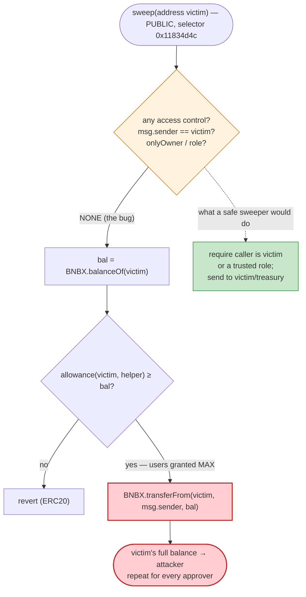
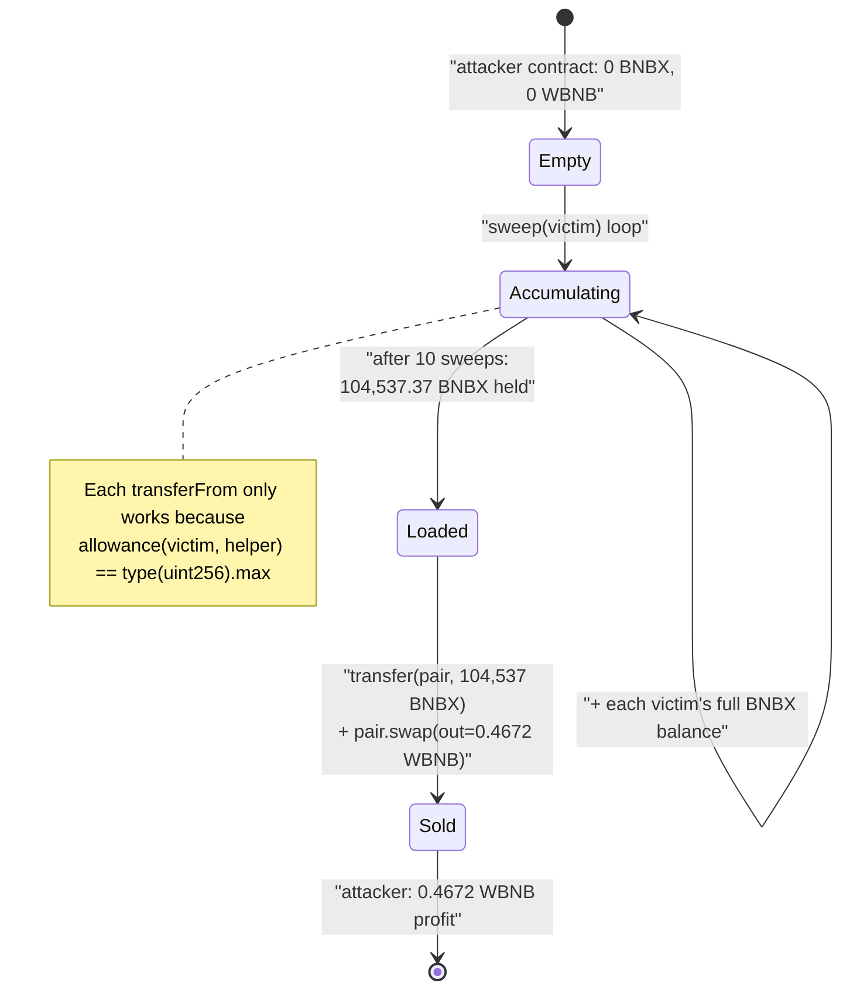

# BNBX Exploit — Unprotected Public `transferFrom` Drains Every Approver

> **Vulnerability classes:** vuln/access-control/missing-auth

> **Reproduction:** the PoC compiles & runs in an isolated Foundry project at
> [this project folder](.) (the umbrella DeFiHackLabs repo
> contains many unrelated PoCs that do not whole-compile, so this one was extracted).
> Full verbose trace: [output.txt](output.txt).
> Vulnerable contract is **unverified** on BscScan; its logic was recovered by EVM disassembly
> (see [Root cause](#root-cause--why-it-was-possible)). The BNBX token source is in
> [sources/BNBX_F66245/BNBX.sol](sources/BNBX_F66245/BNBX.sol).

---

## Key info

| | |
|---|---|
| **Loss** | ~**5 BNB** (~$2.8K at the time) — BNBX siphoned from every wallet that had approved the helper contract, then dumped for WBNB. The PoC reproduces a **10-victim subset** worth **104,537 BNBX → 0.4672 WBNB**. |
| **Vulnerable contract** | `BNBX helper` (unverified) — [`0x389A9AE29fbE53cca7bC8B7a4d9D0a04078e1C24`](https://bscscan.com/address/0x389A9AE29fbE53cca7bC8B7a4d9D0a04078e1C24) |
| **Token / victim asset** | `BNBX` — [`0xF662457774bb0729028EA681BB2C001790999999`](https://bscscan.com/address/0xF662457774bb0729028EA681BB2C001790999999#code) |
| **Drain pool** | BNBX/WBNB PancakeSwap pair — [`0xAa3f145f854e12F1566548c01e74c1b9d98c634d`](https://bscscan.com/address/0xAa3f145f854e12F1566548c01e74c1b9d98c634d) |
| **Attacker EOA** | [`0x123fa25c574bb3158ecf6515595932a92a1da510`](https://bscscan.com/address/0x123fa25c574bb3158ecf6515595932a92a1da510) |
| **Attacker contract** | [`0xe6e06030b33593d140f224fc1cdd1b8ffe99e50a`](https://bscscan.com/address/0xe6e06030b33593d140f224fc1cdd1b8ffe99e50a) |
| **Attack tx** | [`0xea88dc6dbd81d09c572b5849e0d4508598edcf8f11c9a995cd8fe7e6c194f39e`](https://bscscan.com/tx/0xea88dc6dbd81d09c572b5849e0d4508598edcf8f11c9a995cd8fe7e6c194f39e) |
| **Chain / block / date** | BSC / 38,230,509 / **2024-04-27** |
| **Compiler** | PoC `^0.8.10`; BNBX token `v0.8.23`; helper unverified |
| **Bug class** | Missing access control — public function performs `token.transferFrom(arbitraryAddress, msg.sender, …)` |

---

## TL;DR

Helper contract `0x389A…1C24` exposes a **public, unauthenticated function** (selector `0x11834d4c`,
one `address` argument) whose entire body is:

```text
addr = calldata[0]                                  // attacker-supplied victim
bal  = BNBX.balanceOf(addr)                          // SLOAD slot 0x0b == BNBX token
BNBX.transferFrom(addr, msg.sender, bal)             // ⚠️ pull victim's full balance to the CALLER
```

The contract was presumably meant to be a privileged collector/sweeper that moves BNBX on behalf of
users who granted it an (unlimited) ERC20 allowance. But the function has **no access control** — it
trusts whatever address is passed in calldata and sends the pulled tokens to **`msg.sender`**. Any
external account can therefore call it with a victim's address and walk away with that victim's BNBX,
as long as the victim still holds an approval to the helper.

In this incident dozens of users had granted the helper a `type(uint256).max` allowance. The attacker
simply iterated over those approvers, calling the function once per victim to harvest each one's full
BNBX balance into the attacker contract, then sold the loot into the BNBX/WBNB pool for ~5 BNB total.

The PoC demonstrates the mechanism against 10 sample victims and recovers **0.467 WBNB**; the on-chain
incident applied the same loop to the full approver set for the ~5 BNB headline figure.

---

## Background — what the contracts do

**BNBX token** ([sources/BNBX_F66245/BNBX.sol](sources/BNBX_F66245/BNBX.sol)) is a standard-looking
PancakeSwap meme/utility token with a 3% buy/sell fee and an auto-swap-to-funding mechanism in
`_transfer` ([:822-883](sources/BNBX_F66245/BNBX.sol#L822-L883)): on a sell into the main pair it
takes 3% to the contract and may `swapTokenForFund` accumulated tokens to BNB for `_fundAddress`. The
token itself is **not** the vulnerable component — it behaves as a normal taxed ERC20.

**The helper at `0x389A…1C24`** is an *unverified* satellite contract. Storage slot `0x0b` holds the
BNBX token address (`0xF662…9999`, confirmed in the trace), and the contract's purpose is to move BNBX
on a user's behalf via the user's pre-granted ERC20 allowance. dApps frequently deploy such
"collector" / "sweeper" / "auto-compounder" helpers and ask users to `approve(helper, max)`. The
security of that pattern rests entirely on the helper restricting *who* can move *whose* funds — which
this helper failed to do.

The whole incident is therefore an **allowance-abuse / arbitrary-`transferFrom`** bug: the danger lives
in the gap between "users approved a contract" and "that contract lets anyone exercise the approval."

---

## The vulnerable code

The helper is unverified, so the exact Solidity is unavailable. The function body was recovered by
disassembling the deployed bytecode (`cast disassemble`). Selector `0x11834d4c` dispatches to code
offset `0x0c48`:

```text
; selector table — 0x11834d4c is a real, reachable entry point
000001e7: PUSH4 0x11834d4c
000001ec: EQ
000001ed: PUSH2 0x0262        ; jump to handler -> 0x0c48

; handler body @ 0x0c48
00000c49: PUSH1 0x0b
00000c4b: SLOAD               ; load BNBX token address from storage slot 0x0b
00000c4f: PUSH4 0x70a08231    ; balanceOf(address) selector
   ...
00000c81: STATICCALL          ; bal = BNBX.balanceOf(victimFromCalldata)
   ...
00000cc4: PUSH4 0x23b872dd    ; transferFrom(address,address,uint256) selector
00000cc9: DUP4
00000cca: CALLER              ; recipient = msg.sender  ⚠️
   ...                        ; BNBX.transferFrom(victim, msg.sender, bal)
```

Decompiled to readable Solidity, the function is equivalent to:

```solidity
// selector 0x11834d4c — NO access control
function sweep(address victim) external {
    IERC20 token = IERC20(/* storage slot 0x0b */ BNBX);
    uint256 bal = token.balanceOf(victim);
    token.transferFrom(victim, msg.sender, bal);   // pull victim's full balance to caller
}
```

Two facts from the live trace nail this down:

- Slot `0x0b` resolves to the BNBX token — every call routes through `BNBX::balanceOf` then
  `BNBX::transferFrom`.
- The `Transfer` events are `from: <victim>, to: ContractTest (msg.sender)` — confirming the recipient
  is the **caller**, not a protocol treasury.

```text
BNBX_0x389a::11834d4c(…e71f1d71…)
 ├─ BNBX::balanceOf(0xE71F…7146) → 12,777.7192e18
 └─ BNBX::transferFrom(0xE71F…7146, ContractTest, 12,777.7192e18)
        emit Transfer(from: 0xE71F…7146, to: ContractTest, value: 12,777.7192e18)
```
([output.txt](output.txt) lines 29-36)

For comparison, the victims' approvals are unlimited — the `allowance` static-call in the PoC returns
`115792089237316195423570985008687907853269984665640564039457584007913129639935`
(`type(uint256).max`) for each victim ([output.txt](output.txt) line 47), so `transferFrom` of the full
balance always succeeds.

---

## Root cause — why it was possible

The helper combines three ingredients that together make theft trivial:

1. **No authorization on a fund-moving function.** `sweep(address)` (selector `0x11834d4c`) is callable
   by anyone. There is no `onlyOwner`, no signed-intent check, no `msg.sender == victim` requirement,
   no allow-list. The very first byte of trust — "who may invoke a `transferFrom` on someone else's
   tokens" — is missing.

2. **The victim is fully attacker-controlled and the recipient is `msg.sender`.** The function takes
   the source address from calldata and hard-codes the destination to the caller. So an attacker names
   *any* address as the source and *themselves* as the sink. The function is, in effect, a public
   "drain this approver into my wallet" primitive.

3. **Users had granted the helper an unlimited allowance.** ERC20 `transferFrom` only succeeds up to
   `allowance(victim, helper)`. Because users approved `type(uint256).max` (a common dApp UX shortcut),
   the helper can pull each victim's *entire* current balance — and would keep doing so for any future
   balance until the approval is revoked.

The conceptual error is treating an ERC20 *approval* as if it were *consent for the helper to act for
anyone*. An allowance authorizes the spender contract to move the approver's tokens; it does **not**
authorize arbitrary third parties to direct where those tokens go. A correct sweeper must bind the
mover and the beneficiary to the approver — e.g. `require(msg.sender == victim)` (self-service), or
`transferFrom(victim, victim_or_protocol_destination, …)` under an authenticated/role-gated caller.
This helper instead let the caller both choose the victim and pocket the proceeds.

This is the canonical **"arbitrary `transferFrom` / missing access control on an approved spender"**
class — the same root cause behind many "infinite-approval" drains.

---

## Preconditions

- **Victim has a live ERC20 approval** to the helper `0x389A…1C24` for the BNBX token (in practice an
  unlimited approval), and a **non-zero BNBX balance**. The PoC pre-filters for this:
  `available = min(balance, allowance); if (available > 0) { … }`
  ([BNBX_exp.sol:44-50](test/BNBX_exp.sol#L44-L50)).
- **No special timing or capital.** The attack needs no flash loan and no upfront funds — it pulls
  victim tokens for free, then sells them. The only "cost" is gas. (The PoC starts the attacker with
  0 WBNB and ends with 0.467 WBNB — pure profit.)
- The drain pool (BNBX/WBNB pair) merely needs liquidity to convert the looted BNBX into WBNB; this is
  not part of the bug, just the cash-out leg.

---

## Attack walkthrough (with on-chain numbers from the trace)

The PoC runs against block `38,230,508` (one before the real attack tx) and uses 10 known approvers as
a representative sample. All figures are taken directly from
[output.txt](output.txt).

| # | Step | Source | Amount | Effect |
|---|------|--------|-------:|--------|
| 1 | `sweep(0xE71F…7146)` | victim 0 | 12,777.7192 BNBX | `transferFrom(v0 → attacker)` |
| 2 | `sweep(0xe497…cF7e)` | victim 1 | 2,001.1525 BNBX | pulled to attacker |
| 3 | `sweep(0xD161…797c)` | victim 2 | 16,858.2149 BNBX | pulled to attacker |
| 4 | `sweep(0xcc07…d4aC)` | victim 3 | 1,368.6307 BNBX | pulled to attacker |
| 5 | `sweep(0xB91a…b85C)` | victim 4 | 24,680.3084 BNBX | pulled to attacker |
| 6 | `sweep(0xb539…E0F1)` | victim 5 | 4,745.5160 BNBX | pulled to attacker |
| 7 | `sweep(0xAfA2…442D)` | victim 6 | 4,168.6173 BNBX | pulled to attacker |
| 8 | `sweep(0x98C9…15E4)` | victim 7 | 3,000.2199 BNBX | pulled to attacker |
| 9 | `sweep(0x830a…DF56)` | victim 8 | 13,035.2247 BNBX | pulled to attacker |
| 10 | `sweep(0x741b…484d)` | victim 9 | 21,901.7688 BNBX | pulled to attacker |
| 11 | **Attacker holds** | — | **104,537.3723 BNBX** | sum of all sweeps |
| 12 | `BNBX.transfer(pair, 104,537.37 BNBX)` | attacker → pair | — | "sell" path: 3% fee + token's own auto-swap fires (see below) |
| 13 | `pair.getReserves()` post-deposit | — | 207.30 WBNB / 1,391,399.62 BNBX | reserves after the deposit + token-internal swap |
| 14 | `pair.swap(0.4672 WBNB, 0, attacker, "")` | pair → attacker | **0.467231 WBNB** | attacker's manual swap-out of the BNBX it just sent in |

**Note on the token's self-swap (step 12).** Because the recipient is the main pair, BNBX's `_transfer`
treats the inbound 104,537 BNBX as a "sell": it takes 3% to the token contract and then calls
`swapTokenForFund(min(2.3×amount, contractBalance))`, dumping ~3,136 BNBX out of the *token contract's*
own accumulated balance to BNB for `_fundAddress`
([BNBX.sol:861-883](sources/BNBX_F66245/BNBX.sol#L861-L883)). In the trace this appears as the
PancakeRouter (mislabeled `Recovery`) executing `swapExactTokensForETH(3,136.78 BNBX → 0.4672 BNB)`
to the funding address ([output.txt](output.txt) lines 178-219). This is incidental token behavior; the
attacker's profit is the separate manual `pair.swap` in step 14.

Pre-deposit reserves were **207.77 WBNB / 1,388,262.84 BNBX**
([output.txt](output.txt) line 166), confirming a deep pool — so dumping ~104K BNBX only moved a small
fraction of the WBNB reserve, yielding the modest 0.467 WBNB for this 10-victim subset.

### Profit / loss accounting (PoC subset)

| | BNBX | WBNB |
|---|---:|---:|
| Looted from 10 victims | 104,537.3723 | — |
| Attacker WBNB before | — | 0.000000 |
| Sold into pool (step 14) | (104,537.3723) | +0.467231 |
| **Attacker WBNB after** | 0 | **0.467231** |

The on-chain incident applied the identical `sweep` loop to the **entire** approver set (far more than
10 wallets), summing to the headline **~5 BNB** loss. Per-victim loss = each victim's full BNBX
balance.

---

## Diagrams

### Sequence of the attack

```mermaid
sequenceDiagram
    autonumber
    actor A as "Attacker (0x123f…a510)"
    participant H as "Helper 0x389A…1C24 (unverified)"
    participant T as "BNBX token"
    participant P as "BNBX/WBNB Pair"

    Note over T: Dozens of users earlier did<br/>BNBX.approve(Helper, type(uint256).max)

    loop For each approver (10 shown in PoC)
        A->>H: sweep(victim)  [selector 0x11834d4c, NO auth]
        H->>T: balanceOf(victim)
        T-->>H: full balance
        H->>T: transferFrom(victim, msg.sender, balance)
        T-->>A: victim's BNBX → attacker
    end

    Note over A: Attacker now holds 104,537 BNBX (subset)

    rect rgb(255,235,238)
    Note over A,P: Cash-out leg
    A->>T: transfer(pair, 104,537 BNBX)
    Note over T: "sell" path: 3% fee +<br/>swapTokenForFund() self-swap fires
    A->>P: swap(0.4672 WBNB, 0, attacker, "")
    P-->>A: 0.4672 WBNB
    end

    Note over A: Net +0.4672 WBNB (subset);<br/>~5 BNB across the full approver set
```

### How the missing check turns an approval into theft



### Attacker BNBX accumulation and cash-out



---

## Remediation

1. **Add access control to the fund-moving function.** A sweeper that exercises a user's allowance
   must verify the caller is entitled to do so. Either:
   - **self-service:** `require(msg.sender == victim)` (a user sweeps only their own funds); or
   - **role-gated keeper:** `onlyRole(KEEPER)` / `onlyOwner`, with the destination fixed to a protocol
     address — never `msg.sender`.
2. **Never let the caller choose both the source and the recipient.** The destination of a
   `transferFrom` against someone else's allowance must be a protocol-controlled or victim-owned
   address, not an arbitrary caller. Hard-coding `to = msg.sender` is the core defect here.
3. **Bind allowances to intent.** Prefer EIP-2612 `permit` / signed orders so that moving a user's
   tokens requires the user's signature for that specific action, rather than a standing unlimited
   approval that any contract path can abuse.
4. **Minimize approvals on the client side.** dApps should request the *exact* amount needed, not
   `type(uint256).max`, and prompt users to revoke approvals to deprecated helper contracts.
5. **Verify and audit satellite/helper contracts.** This contract was deployed unverified; an
   unverified, unaudited contract holding standing approvals from many users is a high-value target.
   Publish source, restrict privileged functions, and consider a 2-step / time-locked design for any
   contract that can move user funds.

---

## How to reproduce

The PoC was extracted into a standalone Foundry project (the umbrella DeFiHackLabs repo does not
whole-compile under `forge test`):

```bash
_shared/run_poc.sh 2024-04-BNBX_exp -vvvvv
```

- RPC: a **BSC archive** endpoint is required (fork block `38,230,508`). `foundry.toml` is configured
  with `https://bsc-mainnet.public.blastapi.io`, which serves historical state at that block; the
  default `onfinality` public endpoint rate-limits (HTTP 429) and was swapped out.
- Result: `[PASS] testExploit()` with `Attacker WBNB balance after attack: 0.467231121465031107`.

Expected tail:

```
Ran 1 test for test/BNBX_exp.sol:ContractTest
[PASS] testExploit() (gas: 354246)
  Attacker WBNB balance before attack: 0
  Attacker WBNB balance after attack: 0.467231121465031107

Suite result: ok. 1 passed; 0 failed; 0 skipped
```

---

*Vulnerable contract `0x389A…1C24` is unverified; its `sweep(address)`/`0x11834d4c` logic was
recovered from on-chain bytecode disassembly and corroborated by the verbose execution trace in
[output.txt](output.txt).*
