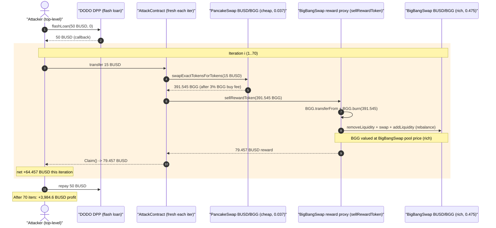
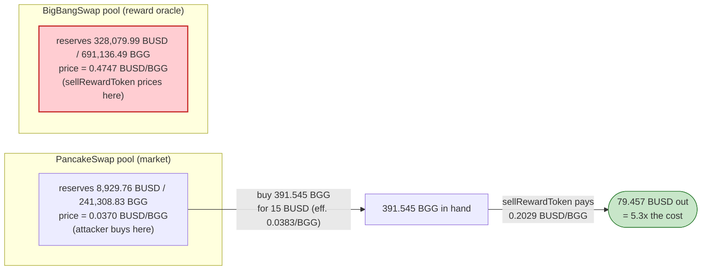
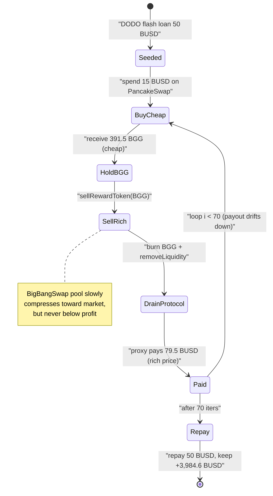

# BigBangSwap Exploit — `sellRewardToken` Pays Out Against a Richer Pool Than the Seller Bought From

> **Vulnerability classes:** vuln/oracle/price-manipulation · vuln/logic/price-calculation

> One-line summary: BigBangSwap's `sellRewardToken()` rewards a seller in BUSD based on the
> value of BGG in BigBangSwap's **own** (expensive) AMM pool, while BGG can be bought ~13x cheaper
> on the parallel PancakeSwap pool — a cross-pool arbitrage that lets anyone mint BUSD out of the
> protocol's liquidity, one cheap-BGG-batch at a time.

> **Reproduction:** the PoC compiles & runs in this isolated Foundry project at
> [this project folder](.) (the umbrella DeFiHackLabs repo does not whole-compile, so this PoC was
> extracted). Full verbose trace: [output.txt](output.txt).
> The vulnerable logic lives in an **unverified** implementation
> (`0x6Ef66FD568903c072a9654e2C8Db9520686932cF`), so the `sellRewardToken` snippet below is
> reconstructed faithfully from the on-chain execution trace; the supporting verified sources
> ([BBG token](sources/BBG_aC4d2F/contracts_BBG.sol),
> [SwapRouter](sources/SwapRouter_B0B284/contracts_SwapRouter.sol),
> [SwapPair](sources/SwapPair_68E465/contracts_SwapPair.sol),
> [SwapFactory](sources/SwapFactory_b792C6/contracts_SwapFactory.sol)) are included.

---

## Key info

| | |
|---|---|
| **Loss** | **~5,085 BUSD** extracted from the protocol (≈ **$5,085**); attacker net profit **≈ 3,984.6 BUSD** after buy costs |
| **Vulnerable contract** | BigBangSwap reward proxy — [`0xa45D4359246DBD523Ab690Bef01Da06B07450030`](https://bscscan.com/address/0xa45D4359246DBD523Ab690Bef01Da06B07450030) (impl `0x6Ef66FD568903c072a9654e2C8Db9520686932cF`, **unverified**) |
| **Victim pools** | BigBangSwap BUSD/BGG pair (rich) `0x68E465A8E65521631f36404D9fB0A6FaD62A3B37`; reward funds drained from proxy + its LP |
| **Cheap source pool** | PancakeSwap BUSD/BGG pair `0x218674fc1df16B5d4F0227A59a2796f13FEbC5f2` |
| **Token** | BGG ("BBG Token") — [`0xaC4d2F229A3499F7E4E90A5932758A6829d69CFF`](https://bscscan.com/address/0xaC4d2F229A3499F7E4E90A5932758A6829d69CFF#code) |
| **Attacker EOA** | [`0xc1b6f9898576d722dbf604aaa452cfea3a639c59`](https://bscscan.com/address/0xc1b6f9898576d722dbf604aaa452cfea3a639c59) |
| **Attacker contract** | `0xb22cf0e1672344f23f3126fbd35f856e961fd780` |
| **Attack tx** | [`0x94055664287a565d4867a97ba6d5d2e28c55d10846e3f83355ba84bd1b9280fc`](https://app.blocksec.com/explorer/tx/bsc/0x94055664287a565d4867a97ba6d5d2e28c55d10846e3f83355ba84bd1b9280fc) |
| **Chain / block / date** | BSC / 37,740,105 (forked at 37,740,104) / April 2024 |
| **Compiler** | PoC: Solidity ^0.8.10 (project `evm_version = cancun`); BGG token: `>=0.8.4` |
| **Bug class** | Economic / pricing-oracle mismatch — reward priced on a self-contained, divergent AMM pool that is cheaper to acquire elsewhere |

---

## TL;DR

BigBangSwap lets BGG holders "sell" their BGG to the protocol via `sellRewardToken(amount)` on the
proxy `0xa45D43…`. Internally the function:

1. pulls `amount` BGG from the caller and **burns** it,
2. **removes a slice of the protocol's own BUSD/BGG liquidity** from BigBangSwap's pair
   `0x68E465…` (which trades BGG at ≈ **0.475 BUSD/BGG**),
3. rebalances (swap + re-add liquidity), and
4. **pays the caller a BUSD "reward"** sized to the value of the burned BGG **as priced by that rich
   pool** — ≈ **0.203 BUSD per BGG**.

The problem: **BGG can be bought on the parallel PancakeSwap pool `0x218674…` for only ≈
0.037 BUSD/BGG** (over **12x cheaper**). So an attacker buys BGG cheap on PancakeSwap, feeds it into
`sellRewardToken`, and is paid back **≈ 5.3x** what the BGG cost. Each `Attack()` iteration spends
**15 BUSD** on a PancakeSwap buy and receives **≈ 79.5 BUSD** out of the protocol. Repeated **70
times** inside one DODO flash-loan-funded transaction, this drained **≈ 5,085 BUSD** from
BigBangSwap, for a net profit of **≈ 3,985 BUSD**.

There is no flash loan of the *attack capital* needed — the 50 BUSD DODO flash loan is only seed
working capital that is immediately recycled and repaid; the exploit is self-financing because every
batch returns more than it costs.

---

## Background — what BigBangSwap does

BigBangSwap is a BSC DEX/yield product built around its own Uniswap-V2-style AMM
([SwapFactory](sources/SwapFactory_b792C6/contracts_SwapFactory.sol),
[SwapRouter](sources/SwapRouter_B0B284/contracts_SwapRouter.sol),
[SwapPair](sources/SwapPair_68E465/contracts_SwapPair.sol)) and the **BGG** reward token.

- **BGG token** ([contracts_BBG.sol](sources/BBG_aC4d2F/contracts_BBG.sol)) is a fee-on-transfer
  ERC20: a **3% buy fee** and **6% sell fee** are charged, but **only when one side of the transfer
  is a registered swap pair** (the PancakeSwap BUSD/BGG and BGG/WBNB pairs, plus any
  `isOtherSwapPair`) — see `__transfer`
  ([contracts_BBG.sol:82-103](sources/BBG_aC4d2F/contracts_BBG.sol#L82-L103)) and `isSwapPair`
  ([:123-131](sources/BBG_aC4d2F/contracts_BBG.sol#L123-L131)). BGG also exposes a public
  `burn(amount)` ([:133-136](sources/BBG_aC4d2F/contracts_BBG.sol#L133-L136)).
- **Two BUSD/BGG pools coexist** with very different prices:
  - the **PancakeSwap** pair `0x218674…` (the "market"), and
  - BigBangSwap's **own** pair `0x68E465…` (used for the reward valuation).
- **The reward proxy** `0xa45D43…` (impl `0x6Ef66…`, unverified) exposes
  `sellRewardToken(amount)`. It is the contract that holds BUSD reward funds and BigBangSwap LP, and
  it pays sellers in BUSD.

The on-chain state at the fork block (read from the trace's `getReserves`/`balanceOf`):

| Quantity | Value | Source |
|---|---:|---|
| PancakeSwap pair reserves | **8,929.76 BUSD / 241,308.83 BGG** | [output.txt:101](output.txt) |
| → PancakeSwap BGG price | **≈ 0.0370 BUSD/BGG** | derived |
| BigBangSwap pair reserves | **328,079.99 BUSD / 691,136.49 BGG** | [output.txt:245](output.txt) |
| → BigBangSwap BGG price | **≈ 0.4747 BUSD/BGG** | derived |
| BGG balance held by reward proxy | **6,106,817.94 BGG** | [output.txt:138](output.txt) |
| BigBangSwap buy/sell BGG fee | 3% / 6% | [contracts_BBG.sol:19-20](sources/BBG_aC4d2F/contracts_BBG.sol#L19-L20) |

The ~12.8x price gap between the two pools is the entire game.

---

## The vulnerable code

### 1. `sellRewardToken` — reconstructed from the trace

The implementation is unverified, but every step of `sellRewardToken(amount)` is visible in the
trace ([output.txt:135-394](output.txt)). Reconstructed:

```solidity
// proxy 0xa45D43… → delegatecall impl 0x6Ef66… (UNVERIFIED) — reconstructed from trace
function sellRewardToken(uint256 amount) external {
    // 1. pull the seller's BGG and BURN it
    BGG.transferFrom(msg.sender, address(this), amount);   // output.txt:139
    BGG.burn(amount);                                       // output.txt:155

    // 2. read BigBangSwap's OWN pool to value the BGG (the rich pool)
    uint256 lpTotal   = SwapPair(0x68E465…).totalSupply(); // output.txt:161
    uint256 poolBgg   = BGG.balanceOf(0x68E465…);          // output.txt:163

    // 3. remove a slice of the protocol's own liquidity (gets BUSD + BGG)
    swapRouter.removeLiquidity(BGG, BUSD, lpSlice, 1, 1, address(this), deadline); // output.txt:165

    // 4. rebalance: swap part of the BUSD back to BGG and re-add liquidity
    swapRouter.swapExactTokensForTokensSupportingFeeOnTransferTokens(...);         // output.txt:225
    swapRouter.addLiquidity(BUSD, BGG, ..., address(this), deadline);              // output.txt:285

    // 5. pay the seller a BUSD "reward" priced off the rich BigBangSwap pool
    BUSD.transfer(msg.sender, rewardBusd);                  // output.txt:345  (= 79.457 BUSD)
    // …plus protocol/treasury BUSD + BGG splits, and a final BGG.burn()      // output.txt:351-390
    emit RewardSold(msg.sender, amount, rewardBusd, …);     // output.txt:391
}
```

The `RewardSold` event for iteration 1 ([output.txt:391](output.txt)):

```
RewardSold(
  seller   = AttackContract,
  bggSold  = 391.545481787372777271 BGG,
  busdPaid = 79.457383466018918814 BUSD,   // ← reward paid to seller
  …,        102.225873465053579762,
  ts       = 1712759634
)
```

So the protocol pays **79.457 BUSD for 391.545 BGG → 0.20293 BUSD/BGG**, i.e. it values the seller's
BGG at roughly *half* the BigBangSwap pool price (≈ 0.475) — but still **5.3x** what the attacker
paid for that BGG on PancakeSwap (≈ 0.0383 BUSD/BGG effective).

### 2. BGG fee is pool-scoped, so the PancakeSwap buy is the *only* tax the attacker pays

```solidity
// contracts_BBG.sol:82-103
function __transfer(address sender, address recipient, uint256 amount) internal {
    uint recipientAmount = amount;
    bool isBuy  = isSwapPair(sender);     // PancakeSwap pair = registered ⇒ 3% buy fee
    bool isSell = isSwapPair(recipient);
    if (recipient != address(0) && (isBuy || isSell)) {
        uint feeRate   = isBuy ? buyFeeRate : sellFeeRate;   // 300 / 600 bps
        uint feeAmount = amount * feeRate / RATE_PERCISION;
        recipientAmount -= feeAmount;
        _takeFee(sender, feeTo, feeAmount);
    }
    _transfer(sender, recipient, recipientAmount);
}
```

The attacker's BGG buy on PancakeSwap pays the 3% buy fee (403.655 BGG bought → 12.11 BGG to `feeTo`,
**391.545 BGG to the attacker** — [output.txt:112-113](output.txt)). Crucially, the subsequent
`transferFrom` into the reward proxy is **not** a "sell" in BGG's eyes (the proxy is not a registered
swap pair), so **no 6% sell fee is taken** on the way into `sellRewardToken` — the BGG is simply
burned. The protocol's reward valuation therefore competes directly with the cheap PancakeSwap price,
with only one 3% fee standing in the way.

---

## Root cause — why it was possible

`sellRewardToken` uses **BigBangSwap's own AMM pool as the price oracle** for the BUSD it pays out,
while the *same* token (BGG) is freely available **far cheaper on a different, more liquid pool**
(PancakeSwap). The reward function never checks at what price the seller actually obtained the BGG,
nor does it reconcile against an external/market price. This is a classic **isolated-pool pricing**
flaw:

> The protocol promises "BGG is worth ~0.2 BUSD" (per its own pool), but the open market sells BGG
> for ~0.037 BUSD. Anyone can buy low on PancakeSwap and "sell high" to the protocol, and the
> protocol funds the difference out of its own BUSD reserves and liquidity.

Four design decisions compose into the bug:

1. **Self-referential valuation.** The reward is computed from BigBangSwap's own pool reserves, which
   are *more expensive and less liquid* than the canonical PancakeSwap market. There is no external
   price check, no slippage/TWAP guard, no per-account or per-block cap.
2. **Permissionless, repeatable entry point.** `sellRewardToken` can be called by anyone, any number
   of times. Each call shifts the pool a little (the payout slowly declines from 79.457 → 65.100
   BUSD over 70 iterations), but never enough to close the gap, so the attacker simply loops.
3. **Pool-scoped token fee.** BGG's 3%/6% fees only fire against *registered* swap pairs. Buying on
   PancakeSwap costs one 3% fee; feeding the proxy costs none. The fee mechanism that might have
   throttled this never applies to the profitable leg.
4. **The protocol pre-funds rewards with real BUSD + its own LP.** `sellRewardToken` removes the
   protocol's own liquidity and pays out genuine BUSD, so the value the attacker extracts is real
   protocol/LP value, not phantom token inflation.

---

## Preconditions

- A meaningful **price divergence** between the PancakeSwap BUSD/BGG pool and BigBangSwap's own
  BUSD/BGG pool (here ≈ 12.8x), such that `sellRewardToken`'s payout-per-BGG exceeds the
  PancakeSwap acquisition cost-per-BGG net of the 3% buy fee (here 0.203 vs 0.038 → 5.3x).
- The reward proxy holding enough BUSD / removable LP to fund the payouts (it held ≈ 6.1M BGG and
  ample BUSD-side liquidity).
- Working capital in BUSD to seed the loop. This is trivially flash-loanable — the PoC borrows
  **50 BUSD** from DODO (`DPP` `0x1B525b…`, **0 fee**) and recycles it; the loop is self-financing
  because each batch returns more BUSD than it consumes.

---

## Attack walkthrough (with on-chain numbers from the trace)

The transaction is one DODO flash loan whose callback runs a **70-iteration loop**. Each iteration
spins up a fresh `AttackContract`, funds it with **15 BUSD**, buys BGG cheaply on PancakeSwap, and
dumps it into `sellRewardToken`. Numbers below are for **iteration 1** (the most profitable; payouts
decline slightly as the BigBangSwap pool drains).

| # | Step | Trace | Amount |
|---|------|-------|-------:|
| 0 | DODO `flashLoan(50 BUSD, 0, attacker, …)` (0 fee, repaid at end) | [output.txt:50-51](output.txt) | 50 BUSD in / 50 BUSD repaid |
| 1 | Loop body: deploy `AttackContract`, transfer **15 BUSD** to it | [output.txt:58-85](output.txt) | 15 BUSD |
| 2 | Buy BGG on **PancakeSwap** with 15 BUSD: pool returns 403.655 BGG, −3% BGG fee | [output.txt:89-124](output.txt) | → **391.545 BGG** to attacker |
| 3 | `sellRewardToken(391.545 BGG)`: `transferFrom` + `BGG.burn` | [output.txt:135-160](output.txt) | 391.545 BGG burned |
| 4 | Inside: `removeLiquidity` from BigBangSwap pair (gets 185.865 BUSD + 391.545 BGG) | [output.txt:165-217](output.txt) | LP slice removed |
| 5 | Inside: swap 51.113 BUSD → 107.120 BGG, then `addLiquidity` back (re-balances pool) | [output.txt:225-342](output.txt) | rebalance |
| 6 | Inside: **pay seller 79.457 BUSD reward** (+ protocol/treasury BUSD & BGG splits, final BGG burns) | [output.txt:345-390](output.txt) | → **79.457 BUSD** to attacker |
| 7 | `Claim()` forwards the 79.457 BUSD up to the top-level attacker | [output.txt:397-405](output.txt) | 79.457 BUSD |
| … | Repeat steps 1-7 for iterations 2…70 (payout drifts 79.457 → 65.100 BUSD) | [output.txt:407+](output.txt) | |
| N | Repay flash loan: transfer 50 BUSD back to DODO | [output.txt:~24210](output.txt) | −50 BUSD |

**Per-iteration economics (iter 1):** spend 15 BUSD → receive 79.457 BUSD ⇒ **net +64.457 BUSD**.

### Profit / loss accounting (BUSD)

| Item | Amount |
|---|---:|
| Flash loan borrowed (DODO, 0 fee) | 50.00 |
| Flash loan repaid | −50.00 |
| BUSD spent on PancakeSwap buys (70 × 15) | −1,050.00 |
| **BUSD received via `sellRewardToken` rewards (70 batches)** | **+5,084.65** |
| **Net attacker profit (final BUSD balance, started at 0)** | **+3,984.65** |

- Reward payout per batch declined from **79.457 BUSD** (iter 1) to **65.100 BUSD** (iter 70) as the
  BigBangSwap pool's price slowly compressed toward the market — but never below profitability.
- Final attacker BUSD balance read in the test:
  **3,984.646179317914226599 BUSD** ([output.txt:24234](output.txt)).
- The protocol's gross outflow (sum of rewards) ≈ **5,085 BUSD**, matching the PoC header's
  "~5k $BUSD" loss figure.

---

## Diagrams

### Sequence of one iteration (×70)



### Why it pays: the cross-pool price gap



### Pool / value-flow state evolution across the loop



---

## Why each magic number

- **50 BUSD DODO flash loan:** mere seed capital. It funds the first 15-BUSD buy; from then on the
  loop is self-financing (each batch returns ≈ 79 BUSD). DODO's `DPP.flashLoan` charges **0 fee**, so
  the loan is free; it is repaid in full at the end ([output.txt:69](output.txt)).
- **15 BUSD per iteration:** sized so the PancakeSwap buy stays in the favorable part of the curve
  (small enough that the cheap pool's price barely moves per batch) while still buying ~391 BGG —
  enough that the reward payout (~79 BUSD) dwarfs the 15-BUSD cost. Larger buys would move the cheap
  pool and erode the edge; smaller buys waste gas.
- **70 iterations:** the loop count that drains the spread before each batch's marginal payout
  (declining 79.457 → 65.100 BUSD) approaches the point of diminishing returns; 70 fresh
  `AttackContract`s keep per-call accounting clean and isolate the BGG approvals.

---

## Remediation

1. **Do not price rewards off a self-contained, manipulable/divergent pool.** Value BGG against a
   robust external reference (a Chainlink feed, or a TWAP of the *deepest* market — here PancakeSwap),
   not BigBangSwap's own thin pool. If the protocol's pool is the intended price, it must be the
   *only* venue where BGG trades, or arbitrage like this is inevitable.
2. **Reconcile reward payout against acquisition cost / market price.** `sellRewardToken` should cap
   the BUSD paid per BGG to the prevailing market price (minus a margin), so buying cheap elsewhere
   and "selling" to the protocol yields no riskless profit.
3. **Add rate limits and slippage/oracle-deviation guards.** Per-block / per-account caps on
   `sellRewardToken`, plus a check that the protocol pool price has not diverged from the market
   reference beyond a threshold, would have blocked the 70-iteration loop.
4. **Charge the BGG sell fee on the protocol-sell leg too** (or otherwise tax the round trip). BGG's
   6% sell fee never fired because the reward proxy is not a registered swap pair; taxing inflows to
   `sellRewardToken` would shrink the arbitrage margin (though pricing is the real fix).
5. **Verify and audit the upgradeable implementation.** The exploited logic sits behind an
   **unverified** implementation (`0x6Ef66…`). Reward-pricing logic of this kind should be public,
   reviewed, and covered by invariant tests asserting "payout-per-token ≤ market-price-per-token."

---

## How to reproduce

The PoC was extracted into a standalone Foundry project (the umbrella DeFiHackLabs repo fails to
whole-compile under `forge test`):

```bash
_shared/run_poc.sh 2024-04-BigBangSwap_exp -vvvvv
```

- RPC: a **BSC archive** endpoint is required (fork block 37,740,104). `foundry.toml` uses
  `https://bsc-mainnet.public.blastapi.io`, which serves historical state at that block; many public
  BSC RPCs prune it (`header not found` / `missing trie node`) or rate-limit (HTTP 429).
- Result: `[PASS] testExploit()` with the attacker's BUSD balance going **0 → 3,984.6 BUSD**.

Expected tail:

```
Ran 1 test for test/BigBangSwap_exp.sol:ContractTest
[PASS] testExploit() (gas: 81053957)
  Attacker BUSD balance before attack: 0
  Attacker BUSD balance before attack: 3984646179317914226599
Suite result: ok. 1 passed; 0 failed; 0 skipped
```

(The PoC reuses the same `log_named_uint` label "before attack" for both the pre- and post-attack
reads; the second value — 3,984.6 BUSD — is the post-attack balance, i.e. the profit.)

---

*Reference: Decurity analysis — https://x.com/DecurityHQ/status/1778075039293727143 (BigBangSwap, BSC, ~5K BUSD).*
