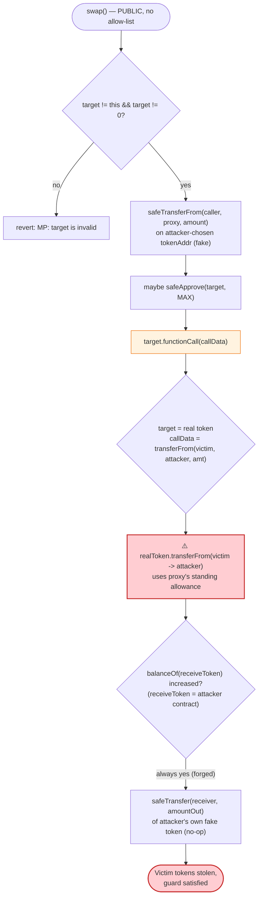
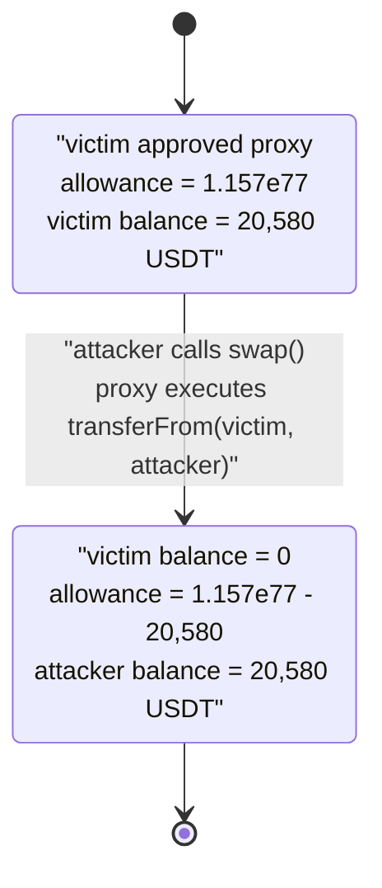

# Chainge Finance Exploit — Arbitrary External Call in `MinterProxyV2.swap()` Drains Approvals

> **Vulnerability classes:** vuln/dependency/unsafe-external-call · vuln/access-control/missing-validation

> **Reproduction:** the PoC compiles & runs in an isolated Foundry project at
> [this project folder](.) (the umbrella DeFiHackLabs repo does not whole-compile,
> so this PoC was extracted standalone).
> Full verbose trace: [output.txt](output.txt).
> Verified vulnerable source: [contracts_MinterProxyV2.sol](sources/MinterProxyV2_80a0D7/contracts_MinterProxyV2.sol).

---

## Key info

| | |
|---|---|
| **Loss** | ~$200K across 12 tokens (USDT, SOL, AVAX, BabyDoge, FLOKI, ATOM, TLOS, IOTX, 1INCH, LINK, BTCB, ETH) drained from a single approving user |
| **Vulnerable contract** | `MinterProxyV2` — [`0x80a0D7A6FD2A22982Ce282933b384568E5c852bF`](https://bscscan.com/address/0x80a0d7a6fd2a22982ce282933b384568e5c852bf#code) |
| **Victim (the approver)** | `0x8A4AA176007196D48d39C89402d3753c39AE64c1` (held unlimited approvals to the proxy) |
| **Attacker EOA** | `0x6eec0F4c017AfE3dfADF32B51339C37e9Fd59dfb` |
| **Attacker contract** | `0x791C6542bC52efe4f20DF0eE672b88579Ae3fd9A` |
| **Attack tx (one of three)** | [`0x051276afa96f2a2bd2ac224339793d82f6076f76ffa8d1b9e6febd49a4ec11b2`](https://bscscan.com/tx/0x051276afa96f2a2bd2ac224339793d82f6076f76ffa8d1b9e6febd49a4ec11b2) |
| **Chain / block / date** | BSC / 37,880,387 / April 15, 2024 |
| **Compiler** | Solidity v0.8.17, optimizer **1000 runs** |
| **Bug class** | Arbitrary external call with attacker-controlled target + calldata (`CALL` injection), abusing the proxy's standing token allowances |

---

## TL;DR

`MinterProxyV2` is the cross-chain bridge "minter/vault" contract for Chainge Finance. Its `swap()`
function is meant to take a user's input token, route it through an aggregator/DEX `target` chosen by
the relayer, and forward the proceeds to a `receiver`. To do this it makes a **fully attacker-controlled
external call**: `target.functionCall(callData)`
([contracts_MinterProxyV2.sol:720](sources/MinterProxyV2_80a0D7/contracts_MinterProxyV2.sol#L720)),
where both `target` and `callData` come straight from the caller's arguments with no allow-list.

Because the contract is a long-lived bridge, many users had granted it **unlimited ERC20 approvals**.
The attacker simply pointed `swap()` at a real token contract and passed
`callData = transferFrom(victim, attacker, amount)`. The proxy — which *is* the approved spender —
dutifully executed `realToken.transferFrom(victim, attacker, amount)`, pulling the victim's tokens
straight to the attacker.

The "did I actually receive output?" sanity check (`new_balance > old_balance`) was trivially defeated:
the attacker passed their **own attack contract as both `tokenAddr` and `receiveToken`**, so the proxy
queried `balanceOf` on a contract the attacker controls, which returns whatever the attacker wants.

In the reproduced transaction the attacker looped this over **12 different tokens** the victim had
approved, draining each one for a combined ≈ $200K.

---

## Background — what Chainge / MinterProxyV2 does

Chainge Finance is a cross-chain DEX/bridge. `MinterProxyV2`
([source](sources/MinterProxyV2_80a0D7/contracts_MinterProxyV2.sol)) is the on-chain vault that
holds and routes funds for the bridge:

- **`vaultOut` / `vaultIn`** — the canonical bridge in/out paths. `vaultIn` is `onlyController`
  ([:756](sources/MinterProxyV2_80a0D7/contracts_MinterProxyV2.sol#L756)) (relayer-gated), and pulls
  from / pushes to the liquidity pool.
- **`swap`** — a *public, permissionless* helper
  ([:683-748](sources/MinterProxyV2_80a0D7/contracts_MinterProxyV2.sol#L683-L748)) intended to let a
  user atomically convert `tokenAddr` → `receiveToken` by calling an external DEX/aggregator `target`
  with relayer-supplied `callData`, then receive the difference.
- **`vaultInAndCall` / `_callAndTransfer`** — the controller-only equivalent that also makes an
  arbitrary call ([:805-961](sources/MinterProxyV2_80a0D7/contracts_MinterProxyV2.sol#L805-L961)),
  but is gated behind `onlyController`.

Because it is a bridge vault, the design assumes users approve the proxy so that `swap()`/`vaultOut`
can pull their tokens. At the fork block, the victim
`0x8A4AA176...64c1` had granted **`type(uint256).max`** allowances to the proxy on at least 12 tokens
(every `allowance(victim, proxy)` in the trace returns `1.157e77`). That standing approval is the
entire prize.

---

## The vulnerable code

### `swap()` — arbitrary `target` + `callData`, permissionless

```solidity
function swap(
    address tokenAddr,
    uint256 amount,
    address target,        // ← attacker-controlled
    address receiveToken,  // ← attacker-controlled
    address receiver,      // ← attacker-controlled
    uint256 minAmount,
    bytes calldata callData,// ← attacker-controlled
    bytes calldata order
) external payable nonReentrant whenNotPaused {
    _checkVaultOut(tokenAddr, amount, order);
    require(
        target != address(this) && target != address(0),
        "MP: target is invalid"
    );
    require(callData.length > 0, "MP: calldata is empty");
    require(receiveToken != address(0), "MP: receiveToken is empty");
    require(receiver != address(0), "MP: receiver is empty");
    require(minAmount > 0, "MP: minAmount is empty");

    uint256 old_balance = _balanceOfSelf(receiveToken);
    if (tokenAddr == NATIVE) {
        ...
    } else {
        IERC20(tokenAddr).safeTransferFrom(_msgSender(), address(this), amount);
        if (IERC20(tokenAddr).allowance(address(this), target) < amount) {
            IERC20(tokenAddr).safeApprove(target, MAX_UINT256);
        }
        target.functionCall(callData, "MP: FunctionCall failed");   // ⚠️ ARBITRARY CALL
    }

    uint256 new_balance = _balanceOfSelf(receiveToken);
    require(new_balance > old_balance, "MP: receive amount should above zero"); // ⚠️ on attacker token
    uint256 _amountOut = new_balance - old_balance;
    require(_amountOut >= minAmount, "MP: receive amount not enough");
    IERC20(receiveToken).safeTransfer(receiver, _amountOut);   // harmless: sends attacker's own token
    ...
}
```
[contracts_MinterProxyV2.sol:683-748](sources/MinterProxyV2_80a0D7/contracts_MinterProxyV2.sol#L683-L748)

The only validation on `target` is `target != address(this) && target != address(0)`
([:694-697](sources/MinterProxyV2_80a0D7/contracts_MinterProxyV2.sol#L694-L697)). There is **no
allow-list of routers/aggregators**, and `callData` is forwarded verbatim. `MinterProxyV2` *is* the
spender users approved, so a call of the form `realToken.transferFrom(victim, attacker, amount)`
executed *by the proxy* succeeds against the victim's allowance.

### The output check is on an attacker-chosen token

`_balanceOfSelf(receiveToken)` reads `IERC20(receiveToken).balanceOf(address(this))`
([:614-624](sources/MinterProxyV2_80a0D7/contracts_MinterProxyV2.sol#L614-L624)). The attacker sets
`receiveToken = address(attackContract)`, whose `balanceOf` simply returns an attacker-controlled
counter that increments on every `transferFrom`. So `new_balance > old_balance` always holds and the
final `safeTransfer(receiver, _amountOut)` just moves the attacker's own fake token to the attacker —
a no-op for value, but it satisfies the contract's bookkeeping.

---

## Root cause — why it was possible

A contract that holds standing token allowances must treat the ability to call `transferFrom` on those
tokens as a privileged capability. `MinterProxyV2.swap()` hands that capability to **anyone**:

> It performs `target.call(callData)` with `target` and `callData` taken directly from the caller, and
> the proxy is the approved spender for every user. Setting `target = USDT`,
> `callData = transferFrom(victim, attacker, victimBalance)` turns the proxy into a confused deputy
> that steals from anyone who ever approved it.

Three independent failures compose into the critical:

1. **Unrestricted call target.** No allow-list / registry of permitted aggregators. The only check is
   `target != this && target != 0`, which does nothing to stop `target` being a token contract.
2. **Unrestricted calldata.** `callData` is forwarded byte-for-byte, so any function on `target` can be
   invoked — including `transferFrom` against another user's approval.
3. **Forgeable output accounting.** The `new_balance > old_balance` guard is evaluated on
   `receiveToken`, which the caller also chooses; pointing it at a self-controlled contract makes the
   guard vacuous. (Even a real guard would not help — the value was already stolen by the time it runs.)

The `swap()` path being **permissionless** (no `onlyController`) is what makes this exploitable by an
external attacker; the controller-only `vaultInAndCall`/`_callAndTransfer` make the same arbitrary call
but are gated behind a trusted relayer.

---

## Preconditions

- A victim has an outstanding ERC20 allowance to `MinterProxyV2` (here: `type(uint256).max` on 12
  tokens). This is the natural state for bridge users.
- The proxy is not paused (`whenNotPaused`).
- The attacker passes a self-controlled contract as `tokenAddr`/`receiveToken` so the incidental
  `safeTransferFrom(attacker, proxy, amount)` and the output-balance check both succeed harmlessly.
- No capital required — the attack consumes only the *victim's* approval; the attacker spends only gas.
  (Flash loans are irrelevant here; nothing is borrowed.)

---

## Attack walkthrough (with on-chain numbers from the trace)

The PoC ([test/ChaingeFinance_exp.sol](test/ChaingeFinance_exp.sol)) iterates 12 tokens. For each
token it computes `amount = min(victimBalance, victimAllowance)`, builds
`transferFrom(victim, attacker, amount)`, and calls
`swap(attackContract, 1, realToken, attackContract, attackContract, 1, callData, hex"00")`.

The proxy then, per call ([output.txt](output.txt)):

| # | Sub-step (inside `swap`) | What happens |
|---|--------------------------|--------------|
| 1 | `safeTransferFrom(attacker, proxy, 1)` on `tokenAddr = attackContract` | No-op; attacker's fake token bumps an internal counter `0 → 1`. |
| 2 | `allowance(proxy, target)` check, then `safeApprove(target, MAX)` if low | Proxy approves the *real* token to itself as needed (irrelevant to theft). |
| 3 | `target.functionCall(callData)` = `realToken.transferFrom(victim, attacker, amount)` | ⚠️ **The theft.** Proxy uses the victim's standing approval; tokens move victim → attacker. |
| 4 | `_balanceOfSelf(receiveToken)` on `receiveToken = attackContract` | Reads attacker's fake `balanceOf` (now `> old`) — guard passes. |
| 5 | `safeTransfer(receiver = attacker, _amountOut)` of the fake token | Harmless self-transfer; emits `LogVaultOut`. |

### Per-token drain (ground truth from the trace)

Amounts are the attacker contract's post-attack `balanceOf` for each token (the `profit` logs):

| # | Token | Address | Drained (token units) |
|---|-------|---------|----------------------:|
| 1 | Tether USD (USDT) | `0x55d398...7955` | 20,606.73 |
| 2 | SOLANA (SOL) | `0x570A5D...43dF` | 621.10 |
| 3 | Avalanche (AVAX) | `0x1CE0c2...4041` | 395.59 |
| 4 | Baby Doge Coin | `0xc74867...e8de` | 131,364,626,198,991.17 |
| 5 | FLOKI | `0xfb5B83...D37E` | 21,952,469.54 |
| 6 | Cosmos Token (ATOM) | `0x0Eb3a7...F335` | 389.54 |
| 7 | pTokens TLOS | `0xb6C534...717c` | 10,763.84 |
| 8 | IoTeX Network (IOTX) | `0x9678E4...64E5` | 34,350.38 |
| 9 | 1INCH Token | `0x111111...C302` | 3,114.42 |
| 10 | ChainLink Token (LINK) | `0xF8A0BF...51bD` | 1,600.18 |
| 11 | BTCB Token | `0x7130d2...ad9c` | 0.7612 |
| 12 | Ethereum Token (ETH) | `0x2170Ed...933F8` | 44.6952 |

The first `transferFrom` (USDT) moved `20,580.187820908676022964` USDT directly from the victim to the
attacker (trace [output.txt](output.txt), `Transfer(from: 0x8A4A…64c1, to: attacker, value: 2.058e22)`).
By dollar value at the time, USDT (~$20.6K), BTCB (~$48K), ETH (~$140), LINK, AVAX, SOL, ATOM and the
others combine to the reported **~$200K** total loss.

### Profit / loss accounting

| Party | Effect |
|-------|--------|
| Victim `0x8A4A…64c1` | Lost the full approved balance of all 12 tokens (≈ $200K). |
| Attacker | Gained those tokens for the cost of gas; **0 capital risked**. |
| `MinterProxyV2` | No funds of its own lost — it was used as a confused deputy against its approvers. |

---

## Diagrams

### Sequence of one token drain (USDT)

```mermaid
sequenceDiagram
    autonumber
    actor A as "Attacker contract"
    participant P as "MinterProxyV2 (proxy)"
    participant T as "USDT (real token)"
    actor V as "Victim (approver)"

    Note over P,V: Precondition<br/>allowance(victim, proxy) = type(uint256).max

    A->>P: swap(attackToken, 1, USDT, attackToken, attacker, 1, callData, 0x00)
    Note over A,P: callData = transferFrom(victim, attacker, 20,580 USDT)

    P->>A: safeTransferFrom(attacker, proxy, 1) on attackToken
    A-->>P: true (fake counter 0 to 1)

    P->>T: functionCall(callData)
    Note over P,T: i.e. USDT.transferFrom(victim, attacker, 20,580)
    T->>V: pull 20,580 USDT (uses proxy's allowance)
    T-->>A: Transfer(victim -> attacker, 20,580 USDT)
    Note over A: ATTACKER NOW HOLDS THE USDT

    P->>A: balanceOf(proxy) on attackToken (receiveToken)
    A-->>P: returns inflated counter (> old)
    Note over P: new_balance > old_balance passes

    P->>A: safeTransfer(attacker, amountOut) of attackToken
    Note over P: harmless self-transfer; emit LogVaultOut

    Note over A,V: loop repeats for SOL, AVAX, BabyDoge, FLOKI,<br/>ATOM, TLOS, IOTX, 1INCH, LINK, BTCB, ETH
```

### Confused-deputy data flow



### Allowance state evolution (per token, e.g. USDT)



---

## Remediation

1. **Allow-list call targets.** `swap()` (and any function that does `target.call(callData)`) must
   restrict `target` to a vetted registry of routers/aggregators. An arbitrary `target` that can be a
   token contract is the whole bug.
2. **Never let user calldata invoke `transferFrom` on the vault's own approvals.** If the contract
   holds standing allowances, it must guard the `transferFrom` capability. Decode/validate the selector
   and arguments of `callData`, or use a dedicated routing interface instead of raw `call`.
3. **Pull funds from `msg.sender` only via the canonical path.** The proxy should only ever pull tokens
   that the *caller* is moving (their own deposit), not act on a third party's approval inside a
   user-controlled call.
4. **Don't trust caller-chosen `receiveToken` for accounting.** The pre/post balance check must be on
   the real input/output token through a trusted code path; reading `balanceOf` on a caller-supplied
   address makes the check forgeable. (Even so, the value is already gone by the time the check runs —
   the fix is preventing the arbitrary call, not improving the guard.)
5. **Mitigation for users:** revoke approvals to the vulnerable proxy
   (`0x80a0D7A6FD2A22982Ce282933b384568E5c852bF`) immediately.

---

## How to reproduce

The PoC was extracted into a standalone Foundry project (the umbrella DeFiHackLabs repo has several
unrelated PoCs that fail `forge test`'s whole-project build):

```bash
_shared/run_poc.sh 2024-04-ChaingeFinance_exp -vvvvv
```

- RPC: a **BSC archive** endpoint is required (fork block 37,880,387 is from April 2024).
  `foundry.toml` uses `https://bsc-mainnet.public.blastapi.io`, which serves historical state at that
  block; most public BSC RPCs prune it and fail with `header not found` / `missing trie node`.
- Result: `[PASS] testExploit()` — all 12 tokens are drained and logged with their `profit` amounts.

Expected tail:

```
  targetToken: BTCB Token
  profit: 0.761239692987924742
  targetToken: Ethereum Token
  profit: 44.695214852737827402

Suite result: ok. 1 passed; 0 failed; 0 skipped
Ran 1 test suite: 1 tests passed, 0 failed, 0 skipped (1 total tests)
```

---

*References:*
*CertiK — https://x.com/CertiKAlert/status/1779863821122691519 ·*
*ChainAegis — https://x.com/ChainAegis/status/1780064080512143429 ·*
*Autosaida analysis — https://github.com/Autosaida/DeFiHackAnalysis/blob/master/analysis/240415_ChaingeFinance.md*
