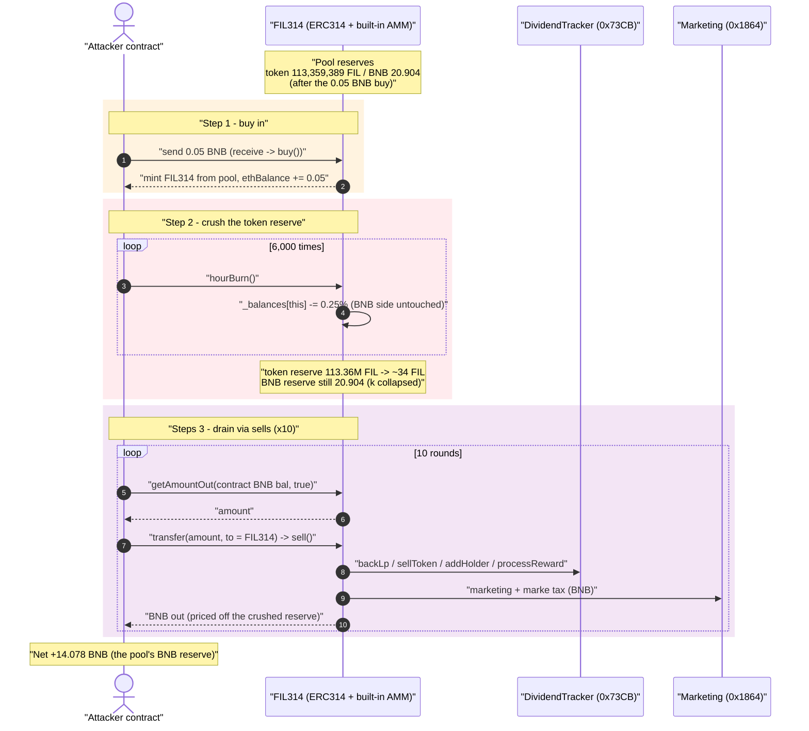
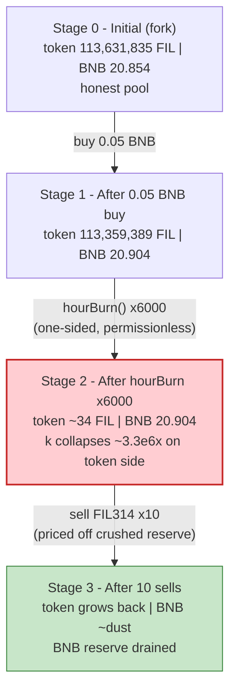
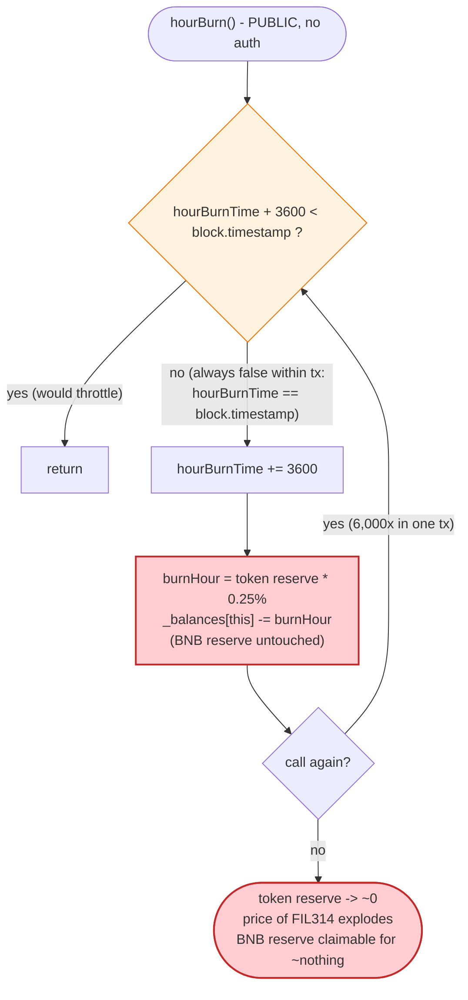

# FIL314 Exploit — Permissionless `hourBurn()` Crushes the Self-Contained AMM Reserve

> **Vulnerability classes:** vuln/access-control/missing-auth · vuln/oracle/price-manipulation

> One permissionless function (`hourBurn()`) burns the token side of an ERC314-style
> built-in AMM with no matching outflow on the BNB side, collapsing the constant-product
> price so a few token sells drain the pool's BNB.

> **Reproduction:** the PoC compiles & runs in an isolated Foundry project at
> [this project folder](.) (the umbrella DeFiHackLabs repo does not whole-compile, so this
> PoC was extracted). Full verbose trace: [output.txt](output.txt).
> Verified vulnerable source: [sources/ERC314_E8A290/ERC314.sol](sources/ERC314_E8A290/ERC314.sol).

---

## Key info

| | |
|---|---|
| **Loss** | **~14.08 BNB** drained from FIL314's built-in BNB reserve (header reports "~14 BNB") |
| **Vulnerable contract** | `ERC314` (FIL314 coin) — [`0xE8A290c6Fc6Fa6C0b79C9cfaE1878d195aeb59aF`](https://bscscan.com/address/0xe8a290c6fc6fa6c0b79c9cfae1878d195aeb59af#code) |
| **Victim "pool"** | The token's own self-contained AMM: `ethBalance` (slot 14, the BNB reserve) + `_balances[address(this)]` (the token reserve) inside the FIL314 contract |
| **Dividend tracker (unverified)** | `0x73CB8B07eBE2B3678c8DEd169C01Be6f7Eb8d434` |
| **Marketing fee receiver (unverified)** | `0x1864f873Ec4a154b4350e0A28D25fFbbFcb781b6` |
| **Attacker EOA** | [`0x4645863205b47a0a3344684489e8c446a437d66c`](https://bscscan.com/address/0x4645863205b47a0a3344684489e8c446a437d66c) |
| **Attack contract** | [`0xde521fbbbb0dbcfa57325a9896c34941f23e96a0`](https://bscscan.com/address/0xde521fbbbb0dbcfa57325a9896c34941f23e96a0) |
| **Attack tx** | [`0x9f2eb13417190e5139d57821422fc99bced025f24452a8b31f7d68133c9b0a6c`](https://bscscan.com/tx/0x9f2eb13417190e5139d57821422fc99bced025f24452a8b31f7d68133c9b0a6c) |
| **Chain / block / date** | BSC / 37,795,991 / 2024-04-12 |
| **Compiler** | Solidity v0.8.19, optimizer **off** (0 runs) |
| **Bug class** | Broken AMM invariant via a permissionless, un-compensated reserve burn (ERC314 reserve manipulation) |

---

## TL;DR

`FIL314` is an **ERC314**-style token: instead of pairing with PancakeSwap, it embeds its own
single-sided AMM **inside the token contract**. The "reserves" are two contract fields:

- `ethBalance` — the BNB side of the pool ([ERC314.sol:60](sources/ERC314_E8A290/ERC314.sol#L60)),
- `_balances[address(this)]` — the token side of the pool ([:100](sources/ERC314_E8A290/ERC314.sol#L100)).

Prices are computed straight off these two numbers via `getReserves()`
([:245-247](sources/ERC314_E8A290/ERC314.sol#L245-L247)) and the constant-product formula in
`getAmountOut` / `sell` ([:297-308](sources/ERC314_E8A290/ERC314.sol#L297-L308),
[:379-426](sources/ERC314_E8A290/ERC314.sol#L379-L426)).

The fatal function is `hourBurn()` ([:358-366](sources/ERC314_E8A290/ERC314.sol#L358-L366)):

```solidity
function hourBurn() public {
    if (hourBurnTime + 3600 < block.timestamp) {
        return;
    }
    hourBurnTime = hourBurnTime + 3600;
    uint256 burnHour = _balances[address(this)] * 2500 / 1000000;  // 0.25% of the TOKEN reserve
    _balances[address(this)] = _balances[address(this)] - burnHour;
    emit Transfer(address(this), address(0), burnHour);
}
```

It is **permissionless**, and it shrinks **only the token reserve** (`_balances[address(this)]`) —
the BNB reserve (`ethBalance`) is never touched. Each call removes 0.25% of the token reserve.
Worse, the throttle is broken: `hourBurnTime` is only bumped by 3600 per call, and the early-return
guard compares against the *fixed* fork timestamp, so the attacker can call `hourBurn()` thousands of
times in a **single transaction** before the guard ever trips.

The attacker:

1. **Buys** a small amount (0.05 BNB) of FIL314 to seed the pool's BNB side a touch higher.
2. **Burns the token reserve 6,000 times** in one tx: `(1 - 0.0025)^6000` shrinks the token reserve
   from **113,359,389 FIL → ~34 FIL** (a ~3.33 million× collapse) while `ethBalance` stays at 20.904 BNB.
3. **Sells** FIL314 into the now-degenerate pool 10 times. With the token reserve crushed to ~34 units
   against a 20.9-BNB reserve, each sell pulls a large fraction of the BNB out:
   `out = swap_amount·ethBalance / (reserveToken + swap_amount)`.

Total BNB pulled back to the attacker across 10 sells: **14.128 BNB**; minus the 0.05 BNB buy →
**net profit ≈ 14.078 BNB** (matches the PoC's before/after balance delta to the wei).

---

## Background — what FIL314 / ERC314 does

ERC314 ("EIP-314") is a meme-token pattern that turns the token contract itself into a tiny AMM, so
no external DEX pair is needed. FIL314 ([source](sources/ERC314_E8A290/ERC314.sol)) layers a few
"DeFi" features on top:

- **Built-in pool.** `addLiquidity()` seeds `ethBalance` with BNB and locks LP until
  `blockToUnlockLiquidity` ([:257-273](sources/ERC314_E8A290/ERC314.sol#L257-L273)). The token side of
  the pool is whatever the contract holds in `_balances[address(this)]`.
- **Buy via `receive()`.** Sending BNB to the contract calls `buy()`, which mints tokens out of the
  pool at the constant-product price and increases `ethBalance`
  ([:314-326](sources/ERC314_E8A290/ERC314.sol#L314-L326), [:428-435](sources/ERC314_E8A290/ERC314.sol#L428-L435)).
- **Sell via `transfer(to == address(this))`.** Sending tokens back to the contract calls `sell()`,
  which pays out BNB from `ethBalance` and applies burn / LP / marketing taxes
  ([:162-188](sources/ERC314_E8A290/ERC314.sol#L162-L188), [:379-426](sources/ERC314_E8A290/ERC314.sol#L379-L426)).
- **Hourly deflation.** `hourBurn()` is meant to deflate the supply by burning 0.25% of the
  contract-held token balance "once per hour" ([:358-366](sources/ERC314_E8A290/ERC314.sol#L358-L366)).
- **Dividend tracker.** An external `ETHBackDividendTracker` (`0x73CB…`, unverified) gets pinged with
  `addHolder` / `processReward` / `sellToken` hooks.

On-chain reserve state at the fork block (read via `cast`):

| Parameter | Value |
|---|---|
| `ethBalance` (BNB reserve) | **20.854 BNB** |
| contract native BNB balance | 20.854 BNB |
| `_balances[address(this)]` (token reserve) | **113,631,835.40 FIL** (9 decimals) |
| `txfee` | 600 bps (6%) |
| `burnTax` / `lpTax` | 200 / 300 bps (2% / 3%) |
| `marketingTax` / `markeTax` | 100 / 1000 bps (1% / 10%) |
| `hourBurnTime` | `1712926979` (== fork `block.timestamp`) |

The whole game is the relationship between those first two numbers: the BNB reserve is real value, and
the token reserve is the *only* thing standing between the attacker and that BNB. `hourBurn()` lets
anyone delete the token reserve for free.

---

## The vulnerable code

### 1. `hourBurn()` — permissionless, one-sided reserve destruction, broken throttle

[sources/ERC314_E8A290/ERC314.sol:358-366](sources/ERC314_E8A290/ERC314.sol#L358-L366)

```solidity
function hourBurn() public {
    if (hourBurnTime + 3600 < block.timestamp) {   // ⚠️ inverted/ineffective throttle
        return;
    }
    hourBurnTime = hourBurnTime + 3600;             // bumps only +3600 per call
    uint256 burnHour = _balances[address(this)] * 2500 / 1000000;  // 0.25% of the TOKEN reserve
    _balances[address(this)] = _balances[address(this)] - burnHour;  // ⚠️ shrinks ONLY the token side
    emit Transfer(address(this), address(0), burnHour);
}
```

Two independent flaws compound here:

- **No access control** — anyone can call it.
- **The throttle does not throttle within a transaction.** `block.timestamp` is constant for the whole
  tx. At the fork, `hourBurnTime == block.timestamp`, so `hourBurnTime + 3600 < block.timestamp` is
  `false` and the early-return never fires; each call just adds 3600 to `hourBurnTime` and burns again.
  The attacker can loop it 6,000 times in one tx (the loop only stops once `hourBurnTime` runs
  3600·6000 ≈ 250 days into the future, which `< block.timestamp` never satisfies). So 0.25% per call
  compounds: `(1 - 0.0025)^6000 ≈ 3.0e-7` — the token reserve is annihilated.

### 2. The price is computed purely from the two contract-held reserves

[sources/ERC314_E8A290/ERC314.sol:245-247](sources/ERC314_E8A290/ERC314.sol#L245-L247) and
[:297-308](sources/ERC314_E8A290/ERC314.sol#L297-L308)

```solidity
function getReserves() public view returns (uint256, uint256) {
    return (ethBalance, _balances[address(this)]);
}

function getAmountOut(uint256 value, bool _buy) public view returns (uint256) {
    (uint256 reserveETH, uint256 reserveToken) = getReserves();
    if (_buy) {
        return (value * reserveToken) / (reserveETH + value);
    } else {
        return (value * reserveETH) / (reserveToken + value);
    }
}
```

`reserveToken` is exactly the value `hourBurn()` just deleted. Crushing it makes the sell payout
explode.

### 3. The sell path pays BNB out of `ethBalance` using the manipulated reserve

[sources/ERC314_E8A290/ERC314.sol:379-411](sources/ERC314_E8A290/ERC314.sol#L379-L411)

```solidity
function sell(uint256 sell_amount) internal {
    require(tradingEnable, "Trading not enable");
    uint256 swap_amount = sell_amount;
    if (isExcludedFromFee[msg.sender] == false) {
        uint256 burnTXfee = (sell_amount * burnTax) / 10000;   // 2%
        burn(msg.sender, burnTXfee);
        uint256 lpTXfee = (sell_amount * lpTax) / 10000;       // 3%
        if (lpTXfee > 0) { backLp(msg.sender, lpTXfee); }
        swap_amount = swap_amount - burnTXfee - lpTXfee;       // 95% of input
    }
    uint256 ethAmount = (swap_amount * ethBalance) / (_balances[address(this)] + swap_amount);
    ethBalance -= ethAmount;
    require(ethAmount > 0, "Sell amount too low");
    require(ethBalance >= ethAmount, "Insufficient ETH in reserves");
    _transfer(msg.sender, address(this), swap_amount);
    ...
    payable(msg.sender).transfer(amountOutput);   // ⚠️ BNB out, priced off the crushed reserve
    ...
}
```

With `_balances[address(this)] ≈ 34` and `ethBalance ≈ 20.9 BNB`, the denominator
`(reserveToken + swap_amount) ≈ swap_amount`, so `ethAmount ≈ swap_amount/swap_amount · ethBalance`,
i.e. the sell drains a large fraction of `ethBalance` regardless of how few tokens are actually sold.

---

## Root cause — why it was possible

An AMM is only sound if **both** reserves move together (`x·y = k` is preserved by every swap, and the
only way to change `k` is to add/remove *both* sides as liquidity). FIL314 violates that in the worst
possible way:

> `hourBurn()` lets **anyone**, **for free**, **arbitrarily many times per transaction** delete the
> token side of the pool (`_balances[address(this)]`) while leaving the BNB side (`ethBalance`)
> untouched. `k` collapses, the marginal price of FIL314 explodes, and the BNB reserve becomes
> claimable for almost nothing.

The composing design defects:

1. **Permissionless, un-throttled `hourBurn()`.** No `onlyOwner`/keeper gate, and the time guard is a
   no-op within a single block (it compares against a frozen `block.timestamp` and only nudges
   `hourBurnTime` by 3600 per call). The attacker controls exactly *when* and *how much* the reserve
   shrinks.
2. **One-sided burn.** The burn removes token reserve but not BNB reserve — an un-compensated transfer
   of value to whoever sells next. The attacker makes sure that's them.
3. **Self-contained AMM keyed off raw contract storage.** Because the "pool" is just two storage slots
   inside the token, any function that edits `_balances[address(this)]` is implicitly an AMM operation —
   `hourBurn()` is effectively an unrestricted `removeLiquidity` on the token side only.
4. **No invariant / slippage protection on `sell()`.** The sell math trusts the current reserves with
   no sanity bound on how much of `ethBalance` a single sell can extract.

---

## Preconditions

- `tradingEnable == true` (the pool is live and accepts buys/sells) — true at the fork block.
- A non-trivial BNB reserve sitting in `ethBalance` (20.854 BNB here) — that is the prize.
- `hourBurn()` reachable with `hourBurnTime + 3600 >= block.timestamp` so the early-return does not
  fire. At the fork `hourBurnTime == block.timestamp`, so the loop runs freely.
- A tiny amount of working capital (the PoC spends 0.05 BNB to buy in first). No flash loan is even
  needed — the cost is negligible relative to the 14 BNB extracted.

---

## Attack walkthrough (with on-chain numbers from the trace)

All figures are taken directly from `output.txt` (storage diffs on slot 14 = `ethBalance`,
slot `0x13cb…` = `_balances[address(this)]`, and the `Swap` events).

| # | Step | Token reserve (FIL) | BNB reserve (`ethBalance`) | Effect |
|---|------|--------------------:|---------------------------:|--------|
| 0 | **Initial** (fork) | 113,631,835.40 | 20.854 | Honest self-contained pool. |
| 1 | **Buy** 0.05 BNB worth of FIL314 ([test/FIL314_exp.sol:38](test/FIL314_exp.sol#L38)) | 113,359,389.26 | 20.904 | Seeds BNB side; gives attacker tokens to sell. |
| 2 | **`hourBurn()` × 6,000** ([:40-42](test/FIL314_exp.sol#L40-L42)) | **~34.03** | 20.904 (unchanged) | Token reserve collapses `(0.9975)^6000` ≈ 3.0e-7×; BNB side untouched. |
| 3a | **Sell round 1** — `getAmountOut(20.904e18, true)` → 17,015,850,338 tokens; `transfer` to contract | — | 20.904 → ~14.2 | Pulls **6.566 BNB** to attacker. |
| 3b | **Sell round 2** → 34,065,822,719 tokens | — | ~14.2 → ~10.6 | **3.531 BNB**. |
| 3c | **Sell round 3** | — | — | **1.901 BNB**. |
| 3d-3j | **Sell rounds 4-10** | — | → ~dust | 1.024 + 0.551 + 0.292 + 0.149 + 0.071 + 0.031 + 0.012 BNB. |
| 4 | **End** | — | drained | Attacker net **+14.078 BNB**. |

**Why "a few sells drain the pool":** in `sell()` the payout is
`ethAmount = swap_amount · ethBalance / (reserveToken + swap_amount)`. After the burns
`reserveToken ≈ 34`, so `reserveToken + swap_amount ≈ swap_amount` and
`ethAmount ≈ ethBalance` for the first big sell. Each subsequent sell adds the sold tokens back to the
reserve (`_transfer(msg.sender, address(this), swap_amount)`), so the denominator grows and the payout
per round shrinks — hence the geometric 6.57 → 3.53 → 1.90 → … BNB decay.

The attacker's quote call uses `getAmountOut(address(FIL314).balance, true)` — passing the FIL314
contract's *native BNB balance* (20.904 BNB) as the input and `_buy = true`
([test/FIL314_exp.sol:44](test/FIL314_exp.sol#L44)). This is just a convenient way to size each sell
relative to the pool; the actual extraction happens in the subsequent
`transfer(address(FIL314), amount)` → `sell()` call.

### Profit accounting (BNB)

| Direction | Amount (BNB) |
|---|---:|
| Spent — initial buy | 0.050000 |
| Received — sell round 1 | 6.565989 |
| Received — sell round 2 | 3.531313 |
| Received — sell round 3 | 1.901263 |
| Received — sell round 4 | 1.024343 |
| Received — sell round 5 | 0.550520 |
| Received — sell round 6 | 0.291968 |
| Received — sell round 7 | 0.149097 |
| Received — sell round 8 | 0.070841 |
| Received — sell round 9 | 0.030726 |
| Received — sell round 10 | 0.012353 |
| **Total received** | **14.128413** |
| **Net profit** | **+14.078413** |

PoC balance log: before `79228162514.264337…` BNB, after `79228162528.342750…` BNB →
delta **14.078413354849776 BNB** (the inflated absolute numbers are just Foundry's default test-account
balance; the *delta* is the real profit). This reconciles to the wei with the per-round sum minus the
0.05 BNB buy.

---

## Diagrams

### Sequence of the attack



### Pool state evolution



### The flaw inside `hourBurn()`



---

## Remediation

1. **Gate `hourBurn()`.** Restrict it to a trusted keeper/owner, or—better—make it idempotent per
   real hour. Today it has no access control at all.
2. **Fix the throttle.** Anchor on a *latched* timestamp and require genuine elapsed time:
   `require(block.timestamp >= hourBurnTime + 3600); hourBurnTime = block.timestamp;`. As written,
   `hourBurnTime += 3600` lets the function run thousands of times in one block.
3. **Never shrink only one side of the pool.** A deflationary burn that touches `_balances[address(this)]`
   must either (a) also reduce `ethBalance` proportionally to preserve `k`, or (b) not burn from the
   pool at all (burn from a treasury the protocol owns). A one-sided reserve burn is an un-compensated
   gift to the next seller.
4. **Add slippage / invariant bounds to `sell()`.** Cap how much of `ethBalance` any single
   sell can remove, and/or require that `k` not drop below a floor.
5. **Don't derive price from instantaneously-mutable raw storage.** Because the AMM reads
   `_balances[address(this)]` directly, any function editing that slot moves the price. Treat reserve
   writes as privileged and route deflation through an LP-aware path that moves both reserves together.

---

## How to reproduce

The PoC was extracted into a standalone Foundry project (the umbrella DeFiHackLabs repo has several
unrelated PoCs that fail to compile under `forge test`'s whole-project build):

```bash
_shared/run_poc.sh 2024-04-FIL314_exp -vvvvv
```

- RPC: a **BSC archive** endpoint is required (fork block 37,795,991 is from April 2024).
  `foundry.toml` uses `https://bsc-mainnet.public.blastapi.io`, which serves historical state at that
  block; most public BSC RPCs prune it (or rate-limit) and fail with `header not found` /
  `429 Too Many Requests`.
- Result: `[PASS] testExploit()`, with the BNB balance increasing by ~14.078 BNB.

Expected tail:

```
  Attacker BNB Balance Before exploit: 79228162514.264337593543950335
  Attacker BNB Balance After exploit: 79228162528.342750948393725713

Suite result: ok. 1 passed; 0 failed; 0 skipped
```

(Profit = after − before = **14.078413354849776 BNB**.)

---

*Reference: DeFiHackLabs — FIL314, BSC, ~14 BNB. Vulnerable source verified on BscScan:
[`0xE8A290…59aF`](https://bscscan.com/address/0xe8a290c6fc6fa6c0b79c9cfae1878d195aeb59af#code).*
