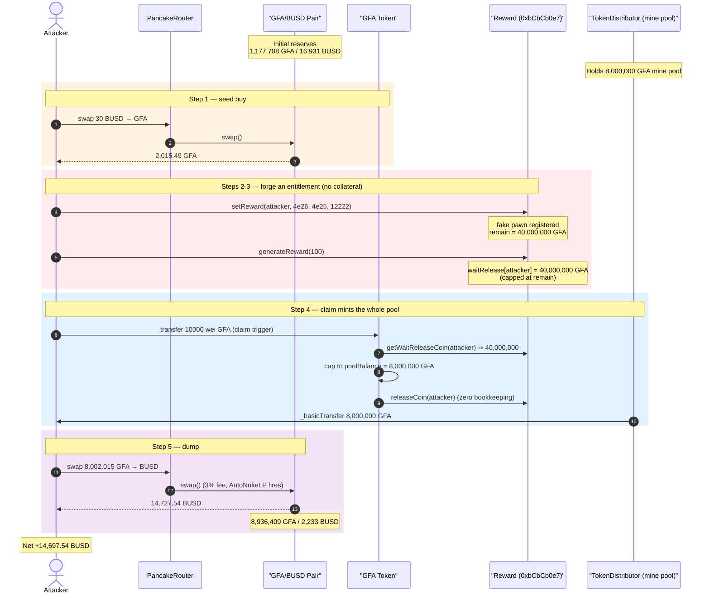
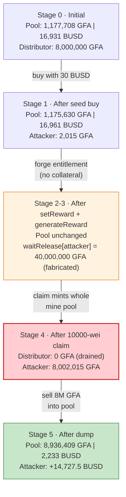
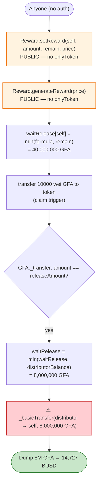

# GFA (Generation Finance Academy) Exploit — Permissionless `setReward` / `generateReward` Self-Mint

> **Reproduction:** the PoC compiles & runs in an isolated Foundry project at
> [this project folder](.) (the umbrella DeFiHackLabs repo contains many unrelated PoCs that do not
> all compile, so this one was extracted into a standalone project).
> Full verbose trace: [output.txt](output.txt).
> Verified vulnerable sources: [contracts_Reward.sol](sources/Reward_bCbCb0/contracts_Reward.sol)
> and [BEP20Token.sol](sources/BEP20Token_278ce7/BEP20Token.sol).

---

## Key info

| | |
|---|---|
| **Loss** | ~$14,697 — net **14,697.5 BUSD** drained from the GFA/BUSD PancakeSwap pair |
| **Vulnerable contract** | `Reward` — [`0xbCbCb0e7E28414e084c4a40C1cCC30B75629a7DE`](https://bscscan.com/address/0xbCbCb0e7E28414e084c4a40C1cCC30B75629a7DE#code) (the reward bookkeeper created by the GFA token) |
| **Coupled token** | `GFA` BEP20 — [`0x278ce7151Bfd1b035e8Bc99e15b4d9773969D4eD`](https://bscscan.com/address/0x278ce7151Bfd1b035e8Bc99e15b4d9773969D4eD#code) |
| **Victim pool** | GFA/BUSD pair — `0x875AC38Bc56E2c6FBEDa4354Ac085CB94d0D2D2F` |
| **Mine pool (drained tokens' source)** | `TokenDistributor` — `0xE83d8a3C45b77d95C850C00aca53A57cE9D49314` |
| **Attacker contract (PoC `Exploit`)** | `0x7FA9385bE102ac3EAc297483Dd6233D62b3e1496` (Foundry default) |
| **Attack tx** | `0xe15d6f7fa891c2626819209edf2d5ded6948310eaada067b400062aa022ce718` |
| **Chain / block / date** | BSC / 37,857,763 / ~April 14, 2024 |
| **Compiler** | Solidity `^0.8.18` (token sources `^0.8.18`) |
| **Bug class** | Missing access control (permissionless reward registration + minting) |
| **Reference** | ChainAegis — https://x.com/ChainAegis/status/1779809931962827055 |

---

## TL;DR

The GFA token has a "pawn-to-mine" reward system. Real users lock ("pawn") GFA via `_toPawn`, and
the token's *internal* `Reward` bookkeeper records a future payout for them
([BEP20Token.sol:972-987](sources/BEP20Token_278ce7/BEP20Token.sol#L972-L987)). A daily `generateReward`
pass converts pending pawns into a `waitRelease` balance, and when the user later sends exactly
`releaseAmount = 10000` wei of GFA to the token contract, the token mints them their owed coins out of
the 8,000,000-GFA `minePool` held by the `TokenDistributor`
([BEP20Token.sol:865-878](sources/BEP20Token_278ce7/BEP20Token.sol#L865-L878)).

The fatal flaw: **the entire `Reward` accounting contract has no access control.** `setReward`,
`generateReward`, and `releaseCoin` are all `public` with no `onlyOwner`/`onlyToken` guard
([contracts_Reward.sol:124-212](sources/Reward_bCbCb0/contracts_Reward.sol#L124-L212)). Anyone can call
`Reward.setReward(...)` directly to fabricate an arbitrarily large pending reward for themselves, then
call `Reward.generateReward(...)` to convert it into a giant `waitRelease` balance — completely
bypassing the legitimate "pawn GFA first" requirement.

The attacker:

1. Buys ~2,015 GFA with 30 BUSD (just enough GFA to perform the 10000-wei trigger transfer later).
2. Calls the `Reward` contract directly: `setReward(attacker, 4e8 GFA, 4e7 GFA, 12222)` — registers a
   fabricated pawn of `remain = 40,000,000 GFA` priced at `12222`.
3. Calls `generateReward(100)` directly — the math yields `release` capped at `remain`, so
   `waitRelease[attacker] = 40,000,000 GFA`.
4. Transfers `10000` wei of GFA to the token contract. The token's `_transfer` sees this as the reward
   claim, reads `waitRelease = 40,000,000`, caps it to the distributor's balance
   (`poolBalance = 8,000,000 GFA`), and **mints the entire 8,000,000-GFA mine pool to the attacker.**
5. Dumps all ~8,002,015 GFA into the GFA/BUSD pool for **14,727.5 BUSD**, netting **+14,697.5 BUSD**.

---

## Background — what GFA does

`GFA` ([source](sources/BEP20Token_278ce7/BEP20Token.sol)) is a BEP20 "DeFi" token with a built-in
yield/mining program:

- **`totalSupply` = 9,980,000 GFA.** At construction
  ([BEP20Token.sol:490-531](sources/BEP20Token_278ce7/BEP20Token.sol#L490-L531)) the token carves out
  `minePool = 8,000,000 GFA` and parks it in a freshly-deployed `TokenDistributor`
  (`0xE83d8a3C…`). The remaining `1,980,000 GFA` go to the deployer. The mine pool is the reservoir
  that pays out all "mining" rewards.
- **Pawn-to-mine.** When a user sends GFA to the token contract in an amount that is *not* the magic
  `releaseAmount = 10000`, `_transfer` routes it into `_toPawn`
  ([BEP20Token.sol:865-878](sources/BEP20Token_278ce7/BEP20Token.sol#L865-L878),
  [:972-987](sources/BEP20Token_278ce7/BEP20Token.sol#L972-L987)). `_toPawn` burns most of the locked
  amount and calls `reward.setReward(sender, amount, mineCoinCnt, price)` to record the user's pawn.
- **Daily reward generation.** `_mineCoin` (gated to once per `mineFrequency = 86400 s`) calls
  `reward.generateReward(_getPrice())`
  ([BEP20Token.sol:584-591](sources/BEP20Token_278ce7/BEP20Token.sol#L584-L591)), which walks every
  registered pawn and accrues a `waitRelease` balance per address.
- **Claiming.** When a user finally sends exactly `releaseAmount = 10000` wei GFA to the token, the
  token reads their `waitRelease`, caps it to the distributor's balance, calls `reward.releaseCoin` to
  zero the bookkeeping, and `_basicTransfer`s the owed GFA from the distributor to the user
  ([BEP20Token.sol:865-878](sources/BEP20Token_278ce7/BEP20Token.sol#L865-L878)).

On-chain parameters at the fork block:

| Parameter | Value |
|---|---|
| `totalSupply` | 9,980,000 GFA |
| `minePool` (in `TokenDistributor`) | **8,000,000 GFA** ← the prize |
| `releaseAmount` (claim trigger) | **10000 wei** |
| `_mineDaliyRatio` (in `Reward`) | **2** |
| `_fixMineCoinRatio` (in `Reward`) | 30 |
| `_decimals` (in `Reward`) | 18 |
| GFA reserve in pair | ~1,177,708 GFA |
| BUSD reserve in pair | ~16,931 BUSD |

The whole game is that the 8,000,000-GFA mine pool pays out whatever the `Reward` bookkeeper *claims*
a user is owed — and the `Reward` bookkeeper trusts anyone.

---

## The vulnerable code

The `Reward` contract instance is created by the token in its constructor
([BEP20Token.sol:526-527](sources/BEP20Token_278ce7/BEP20Token.sol#L526-L527)) and is the standalone
verified contract at `0xbCbCb0e7…`. Every state-mutating entry point is `public` with **no caller
check whatsoever**:

### 1. `setReward` — anyone can fabricate a pending reward

```solidity
// contracts_Reward.sol:124-138
function setReward(
    address rewardSender,
    uint256 amount,
    uint256 remain,
    uint256 price
) public {                                   // ⚠️ no onlyToken / onlyOwner
    if (reward[rewardSender].length == 0) {
        rewardKeys.push(rewardSender);
    }
    reward[rewardSender].push(
        RewardData(rewardSender, amount, remain, price, block.timestamp)
    );
    _totalRemainCnt += remain;
}
```

The intended caller is the token's `_toPawn`, which only registers a reward *after* the user has
actually locked & burned GFA. Called directly, it lets the attacker pick `amount`, `remain`, and
`price` arbitrarily with zero collateral.

### 2. `generateReward` — anyone can convert it into a giant `waitRelease`

```solidity
// contracts_Reward.sol:148-205 (excerpt)
function generateReward(uint256 coinPrice) public {       // ⚠️ no auth
    coinPrice = coinPrice == 0 ? 1 * 10**_decimals : coinPrice;
    for (uint256 i = 0; i < rewardKeys.length; i++) {
        for (uint256 j = 0; j < reward[rewardKeys[i]].length; j++) {
            if (reward[rewardKeys[i]][j].remain == 0) { continue; }
            uint256 pawnPrice    = reward[rewardKeys[i]][j].price;
            uint256 targetRelease = reward[rewardKeys[i]][j].amount.mul(_mineDaliyRatio) / 100;
            uint256 fixMineCoin   = targetRelease.mul(_fixMineCoinRatio).div(100);
            uint256 sameCoinValue = (((targetRelease - fixMineCoin) * pawnPrice).div(coinPrice));
            uint256 release       = sameCoinValue + fixMineCoin;
            if (reward[rewardKeys[i]][j].remain < release) {   // ← cap at remain
                release = reward[rewardKeys[i]][j].remain;
            }
            ...
            waitRelease[rewardKeys[i]] += release;   // attacker's claimable balance
            ...
        }
    }
}
```

With the attacker's fabricated `amount = 4e26` and `_mineDaliyRatio = 2`,
`targetRelease = 4e26·2/100 = 8e24`, `fixMineCoin = 8e24·30/100 = 2.4e24`,
`sameCoinValue = (8e24−2.4e24)·12222/100 ≈ 6.84e26`, `release = 6.87e26` — which exceeds the
fabricated `remain = 4e25`, so it is **capped to `remain = 40,000,000 GFA`**. Result:
`waitRelease[attacker] = 40,000,000 GFA` (verified in the trace storage write at
[output.txt:1676](output.txt#L1676), `0x2116545850052128000000 = 40,000,000e18`).

### 3. `releaseCoin` — anyone can zero the bookkeeping (and the token mints against it)

```solidity
// contracts_Reward.sol:207-212
function releaseCoin(address sender) public returns (uint256) {  // ⚠️ no auth
    uint256 release = waitRelease[sender];
    waitRelease[sender] = 0;
    _totalRemainCnt -= release;
    return release;
}
```

The actual minting happens in the token's `_transfer` claim branch:

```solidity
// BEP20Token.sol:865-878
} else if (recipient == contractAddress) {
    if (amount == releaseAmount) {                         // amount == 10000 wei
        uint256 waitRelease = reward.getWaitReleaseCoin(sender);   // = 40,000,000 GFA
        uint256 poolBalance =  _balances[address(_tokenDistributor)]; // = 8,000,000 GFA
        if (poolBalance < waitRelease) {
            waitRelease = poolBalance;                     // capped to 8,000,000 GFA
        }
        reward.releaseCoin(sender);                        // zero bookkeeping
        _basicTransfer(address(_tokenDistributor), sender, waitRelease);  // ⚠️ mint pool → attacker
        _basicTransfer(sender, recipient, amount);
    } else { _toPawn(amount); }
}
```

The token honors the `Reward` bookkeeper's `waitRelease` figure without re-validating that the user
ever pawned anything — so a self-set `waitRelease` drains the distributor up to its full balance.

---

## Root cause — why it was possible

A multi-contract reward system is only as trustworthy as its least-protected write path. GFA split its
logic across a token contract (which holds/mints the 8M mine pool) and a `Reward` contract (which
decides *who is owed how much*). The token blindly trusts the `Reward` contract's `waitRelease`
output, but the `Reward` contract trusts **everyone**:

> The `Reward` contract's `setReward`, `generateReward`, and `releaseCoin` are `public` with no
> `msg.sender == token` check. Anyone can register a fake pawn, mature it into a `waitRelease`
> balance, and then trigger the token's claim path — which mints real GFA out of the mine pool against
> that fabricated entitlement.

Three composing defects:

1. **No access control on `Reward`.** The bookkeeper must only ever be writable by the token contract
   (its creator). Without an `onlyToken` modifier, the "pawn GFA first" gate enforced in `_toPawn` is
   trivially skipped by calling `setReward` directly.
2. **Unbacked entitlement → real mint.** `waitRelease` is a pure accounting number, but the token mints
   real, fungible, sellable GFA against it from the distributor. There is no check that the claimant
   actually deposited collateral equal to (or exceeding) what they are minting.
3. **Cap is only the distributor balance, not the user's contribution.** The only ceiling on the mint
   is `poolBalance = 8,000,000 GFA` (the entire mine pool). So a single attacker can take 100% of the
   reservoir in one claim.

Because the minted GFA is freely sellable into the GFA/BUSD pool, the attacker converts the inflated
token supply directly into BUSD.

---

## Preconditions

- The token's coupled `Reward` contract address is publicly known / discoverable (it is the contract
  emitting reward events; verified on BscScan). The attacker calls it directly.
- The `TokenDistributor` still holds a non-trivial mine-pool balance (here the full 8,000,000 GFA — no
  prior mining had drained it).
- The attacker holds at least `releaseAmount = 10000` wei of GFA to send the magic claim transfer
  (bought here with 30 BUSD; ~2,015 GFA, far more than needed).
- A GFA/BUSD pool with enough BUSD liquidity to absorb the dump (~16,961 BUSD present). The attack is
  bounded by pool depth, not by any protocol limit — the full 8M-GFA dump realized ~14,727 BUSD.

No flash loan is required: the attacker's only outlay is the 30 BUSD seed buy.

---

## Attack walkthrough (with on-chain numbers from the trace)

The pair's `token0 = GFA`, `token1 = BUSD`, so `reserve0 = GFA`, `reserve1 = BUSD`. Figures are taken
directly from the `Sync` events and storage writes in [output.txt](output.txt).

| # | Step | Trace ref | GFA reserve | BUSD reserve | Effect |
|---|------|-----------|------------:|-------------:|--------|
| 0 | **Initial** pool | [:1633](output.txt#L1633) | 1,177,708 | 16,931 | Honest pool. |
| 1 | **Seed buy** — swap 30 BUSD → 2,015.49 GFA (net of 3% fee) to attacker | [:1621-1652](output.txt#L1621) | 1,175,630 | 16,961 | Attacker now holds ~2,015 GFA. |
| 2 | **Fabricate reward** — `Reward.setReward(attacker, 4e26, 4e25, 12222)` | [:1661](output.txt#L1661) | 1,175,630 | 16,961 | Fake pawn registered: `remain = 40,000,000 GFA`. |
| 3 | **Mature it** — `Reward.generateReward(100)` | [:1673-1674](output.txt#L1673) | 1,175,630 | 16,961 | `waitRelease[attacker] = 40,000,000 GFA` (capped at `remain`). |
| 4 | **Claim** — transfer `10000` wei GFA to token ⇒ `releaseCoin` + mint | [:1687-1701](output.txt#L1687) | — | — | Distributor mints **8,000,000 GFA** to attacker (capped to pool balance). |
| 5 | **Dump** — swap 8,002,015.49 GFA → 14,727.5 BUSD to attacker (3% fee → 7.76M GFA reaches pool; AutoNukeLP fires) | [:1709-1751](output.txt#L1709) | 8,936,409 | 2,233 | Attacker pulls 14,727.5 BUSD out of the pool. |

The mint in step 4 is visible as the transfer of `8000000000000000000000000` (8e24 = 8,000,000 GFA)
from the `TokenDistributor` `0xE83d8a3C…` to the attacker at [output.txt:1695](output.txt#L1695),
leaving the attacker with `8,002,015.49 GFA` total ([output.txt:1702-1703](output.txt#L1702)).

### Why `setReward(4e26, 4e25, …)`?

The attacker over-sizes `amount` (4e8 GFA) so that `targetRelease`/`sameCoinValue` blow past the cap,
guaranteeing `release` collapses to `remain`. By choosing `remain = 4e7 GFA` (= 40,000,000 GFA, *five
times* the 8,000,000-GFA mine pool), the resulting `waitRelease` is far larger than the distributor's
balance, so the token's `poolBalance < waitRelease` cap mints the **entire** pool. Any
`remain ≥ 8,000,000 GFA` would have sufficed.

### Profit / loss accounting (BUSD)

| Direction | Amount (BUSD) |
|---|---:|
| Spent — seed buy (start balance) | 30.00 |
| Received — final GFA dump | 14,727.54 |
| **Net profit** | **+14,697.54** |

| Token-side accounting (GFA) | Amount |
|---|---:|
| Bought with seed (net) | 2,015.49 |
| Minted from mine pool (stolen) | 8,000,000.00 |
| **Total dumped** | 8,002,015.49 (minus 10000 wei claim trigger) |

The 8,000,000-GFA mine pool — meant to pay every honest miner for the life of the protocol — was
extracted in a single transaction and sold for ~14.7K BUSD (sale price limited only by the pool's BUSD
depth).

---

## Diagrams

### Sequence of the attack



### Pool & mine-pool state evolution



### The flaw — trust boundary between token and `Reward`



---

## Remediation

1. **Add access control to `Reward`.** `setReward`, `generateReward`, and `releaseCoin` must be
   callable only by the token contract that created the `Reward` instance. The simplest fix:
   ```solidity
   address private immutable token;
   modifier onlyToken() { require(msg.sender == token, "auth"); _; }
   // in init/constructor: token = msg.sender;
   function setReward(...) public onlyToken { ... }
   function generateReward(...) public onlyToken { ... }
   function releaseCoin(...) public onlyToken returns (uint256) { ... }
   ```
   This alone closes the exploit: the only path to register a reward becomes the token's `_toPawn`,
   which requires the user to actually lock & burn GFA first.
2. **Back entitlements with collateral.** The token should never mint more than a user has demonstrably
   contributed. Track each address's net pawned principal and require
   `mintedReward ≤ pawnedPrincipal` (or whatever the documented yield curve allows), independent of any
   externally-influenced `waitRelease` figure.
3. **Don't trust a sibling contract's accounting blindly.** Before minting from the distributor, the
   token should re-derive (or at least sanity-bound) the claim against on-chain pawn records, not just
   echo `reward.getWaitReleaseCoin(sender)`.
4. **Bound single-claim impact.** Capping the mint to the *entire* distributor balance means one caller
   can take everything. Cap per-claim payouts to a small fraction of the pool and/or per-user limits.
5. **Lock `init`.** `Reward.init` ([contracts_Reward.sol:114-122](sources/Reward_bCbCb0/contracts_Reward.sol#L114-L122))
   is also unguarded; restrict it to a one-time, owner-only initializer to prevent reconfiguration of
   `_mineDaliyRatio`/`_mainPair` by third parties.

---

## How to reproduce

The PoC was extracted into a standalone Foundry project (the umbrella DeFiHackLabs repo has many
unrelated PoCs that fail to compile under `forge test`'s whole-project build):

```bash
_shared/run_poc.sh 2024-04-GFA_exp -vvvvv
```

- RPC: a **BSC archive** endpoint is required (fork block 37,857,763). `foundry.toml` uses
  `https://bsc-mainnet.public.blastapi.io`, which serves historical state at that block; most public
  BSC RPCs prune it and fail with `header not found` / `missing trie node`.
- Result: `[PASS] testExploit()`. The attacker's BUSD balance goes from 30 → **14,727.54 BUSD**.

Expected tail:

```
  attacker balance BUSD before attack:: 30.000000000000000000
  attacker balance BUSD after attack:: 14727.536063502076013262

Suite result: ok. 1 passed; 0 failed; 0 skipped; finished in 19.33s
```

---

*Reference: ChainAegis — https://x.com/ChainAegis/status/1779809931962827055 (GFA, BSC, ~$14K).
Attack tx: `0xe15d6f7fa891c2626819209edf2d5ded6948310eaada067b400062aa022ce718`.*
