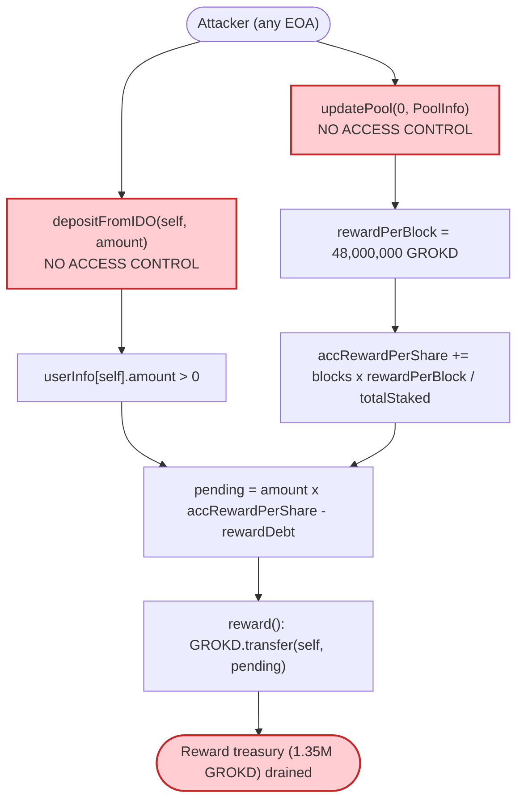

# GROKD Exploit — Permissionless `updatePool()` + `depositFromIDO()` Reward Pool Drain

> One-line summary: an unprotected IDO/staking contract let anyone register a stake, rewrite the
> emission rate to an astronomical value, and instantly claim ~100% of the reward pool's GROKD,
> which was then dumped into the GROKD/WBNB pair for ~129.8 BNB.

> **Reproduction:** the PoC compiles & runs in an isolated Foundry project at
> [this project folder](.) (the umbrella DeFiHackLabs repo does not whole-compile, so this PoC was
> extracted). Full verbose trace: [output.txt](output.txt).
> The vulnerable staking/IDO implementation (`0xec61…f63E`) is **unverified** on BscScan, so the
> snippets below are reconstructed from the PoC interface, the on-chain storage diffs in the trace,
> and the verified GROKD token source ([sources/GROKDToken_a4133f](sources/GROKDToken_a4133f/contracts_GROKD_GrokDToken.sol)).

---

## Key info

| | |
|---|---|
| **Loss** | **~129.8 BNB** in this fork reproduction (~$72.7K at ~$560/BNB, Apr 2024); the live attack across two txs netted **~150 BNB** (~$84K) |
| **Vulnerable contract** | GROKD IDO/staking ("LiquiditySharePool") proxy — [`0x31d3231cDa62C0b7989b488cA747245676a32D81`](https://bscscan.com/address/0x31d3231cDa62C0b7989b488cA747245676a32D81#code) → impl `0xec61196d3E2AE276eEcF070110075118aBD1f63E` (unverified) |
| **Reward asset drained** | GROKD token — [`0xa4133feD73Ea3361f2f928f98313b1e1e5049612`](https://bscscan.com/address/0xa4133feD73Ea3361f2f928f98313b1e1e5049612#code) |
| **Victim pool (cash-out)** | GROKD/WBNB PancakeSwap V2 pair — `0x8AF65d9114DfcCd050e7352D77eeC98f40c42CFD` |
| **Attacker EOA** | `0x31d3231cdA62c0B7989B488cA747245676a32D81`-deployer (see [hipalex921 thread](https://x.com/hipalex921/status/1778482890705416323)) |
| **Attack tx 1** | [`0x383dbb44a91687b2b9bbd8b6779957a198d114f24af662776f384569b84fc549`](https://app.blocksec.com/explorer/tx/bsc/0x383dbb44a91687b2b9bbd8b6779957a198d114f24af662776f384569b84fc549) |
| **Attack tx 2** | [`0x8293946b5c88c4a21250ca6dc93c6d1a695fb5d067bb2d4aed0a11bd5af1fb32`](https://app.blocksec.com/explorer/tx/bsc/0x8293946b5c88c4a21250ca6dc93c6d1a695fb5d067bb2d4aed0a11bd5af1fb32) |
| **Chain / block / date** | BSC / 37,622,476 / ~April 2024 |
| **Compiler (token)** | Solidity v0.8.20; (proxy) v0.8.21, optimizer 200 runs |
| **Bug class** | Missing access control on privileged reward-config + stake-registration functions (`updatePool`, `depositFromIDO`) |

---

## TL;DR

The GROKD project ran a MasterChef-style staking / IDO contract behind an ERC-1967 proxy. It is the
GROKD token's `LiquiditySharePool` — the contract that receives the token's 3.5% sell-fee revenue
(via `fund()`) and is supposed to distribute it to legitimate LP stakers.

Two of its functions had **no access control**:

1. **`updatePool(uint256 pid, PoolInfo)`** — lets the caller overwrite a pool's `startBlock`,
   `endBlock`, and `rewardPerBlock`. The attacker set `rewardPerBlock = 48,000,000 ether` and
   `endBlock = block.number + 100,000,000`, i.e. a practically infinite emission rate.
2. **`depositFromIDO(address to, uint256 amount)`** — meant to credit IDO participants, it instead let
   the attacker register an arbitrary stake (`userInfo[attacker].amount`) for themselves.

Combined: the attacker registered a stake, cranked `rewardPerBlock` to the moon, rolled forward one
block to accrue, and called `reward()`. `pending()` computed **1,337,275 GROKD** owed; the contract
held only **1,346,595 GROKD** of accumulated fee revenue, so the payout drained essentially the entire
reward balance. The attacker received **668,637 GROKD** (the rest lost to the token's own transfer fee
and a self-buffer), then sold it into the GROKD/WBNB pair, walking off with **~129.8 BNB**.

The attacker only needed a tiny real stake (≈71 LP tokens, bought with 2.5 BNB) so that
`userInfo.amount > 0` and the `pending = amount × accRewardPerShare` math would resolve to a huge
number once `accRewardPerShare` was inflated.

---

## Background — what the protocol does

GROKD ([verified source](sources/GROKDToken_a4133f/contracts_GROKD_GrokDToken.sol)) is a
fee-on-transfer "GrokD" meme token on BSC:

- `buyFee = sellFee = 35` out of `1000` → **3.5%** tax on AMM buys/sells
  ([contracts_GROKD_GrokDToken.sol:48-49](sources/GROKDToken_a4133f/contracts_GROKD_GrokDToken.sol#L48-L49)).
- On a sell, the token's `process()` routine swaps collected fees to BNB and distributes them to
  lab/foundation/market addresses, and finally forwards a share to `LiquiditySharePool` via
  `IFund(LiquiditySharePool).fund{value: rewardAmount}()`
  ([:101-126](sources/GROKDToken_a4133f/contracts_GROKD_GrokDToken.sol#L101-L126)).

The `LiquiditySharePool` is the IDO/staking contract at the unverified implementation
`0xec61…f63E` (behind proxy `0x31d3…2D81`). It is a MasterChef-flavoured staker:

- LP stakers deposit GROKD/WBNB LP tokens and earn **GROKD** plus a share of the **BNB** fee revenue
  that `fund()` accumulates.
- A `PoolInfo[]` array holds per-pool `(startBlock, endBlock, rewardPerBlock)`.
- `userInfo[user]` tracks `(inviter, amount, rewardDebt, rewardBNBDebt, rewardLPDebt,
  lastRewardBlock, saveBNBBalance, saveGrokDBalance, releaseBlock)`
  (see the PoC's reconstructed [`IDeposite.userInfo`](test/GROKD_exp.sol#L34-L49)).
- `update()` accrues reward-per-share; `pending()` views the owed amounts; `reward()` pays them out.

At the fork block, pool 0 was configured with a normal emission:

| Parameter (pool 0, pre-attack) | Value | Source |
|---|---|---|
| `startBlock` | 37,565,180 | trace L190 |
| `endBlock` | 37,997,180 | trace L192 |
| `rewardPerBlock` | 0.1875 GROKD (`187500000000000000`) | trace L194 |
| **GROKD held by the staking contract** | **1,346,594.9 GROKD** (`1.346594907e24`) | trace L216 |

That 1.35M GROKD is the accumulated reward treasury — the prize.

---

## The vulnerable code

The implementation is unverified, but the trace's `[delegatecall]` storage diffs make the logic
unambiguous. The PoC's interface gives the exact selectors:

```solidity
// test/GROKD_exp.sol — reconstructed interface of the vulnerable contract
function depositFromIDO(address to, uint256 amount) external;            // ⚠️ no access control
function updatePool(uint256 pid, PoolInfo calldata info) external;       // ⚠️ no access control
function update() external;                                              // accrue accRewardPerShare
function reward() external;                                              // pay out pending to msg.sender
function pending(address) external view returns (uint256 bnb, uint256 erc20, uint256 lp);
struct PoolInfo { uint256 startBlock; uint256 endBlock; uint256 rewardPerBlock; }
```

### 1. `depositFromIDO` — registers a stake for anyone

In the live attack the attacker passed their own LP balance. The trace shows it pulling the LP tokens
in via `transferFrom` and writing the staker's accounting slots:

```text
0x31d3…2D81::depositFromIDO(attacker, 71221972088766127564)   // 71.22 LP
  └─ delegatecall 0xec61…f63E::depositFromIDO(attacker, 71.22 LP)
       ├─ pair.transferFrom(attacker, 0x31d3…, 71.22 LP)      // takes the LP
       └─ storage changes (attacker's userInfo struct slots written):
            @ …5f5e = 0x…3dc674643b9b0ddcc   // userInfo.amount  = 71.22e18
            @ …5f60 / …5f61 = …               // rewardDebt / BNB-debt snapshots
```
([trace L218-L238](output.txt))

Crucially `depositFromIDO` is **NOT** restricted to an IDO/router/owner — anyone can call it to make
`userInfo[self].amount > 0`. That non-zero stake is the only multiplicand the attacker needs.

### 2. `updatePool` — rewrites the emission rate, no auth

```text
0x31d3…2D81::updatePool(0, PoolInfo{ startBlock: 0,
                                     endBlock: 137622476,            // block.number + 100,000,000
                                     rewardPerBlock: 48000000000000000000000000 })  // 48,000,000 GROKD/block
  └─ delegatecall 0xec61…f63E::updatePool(...)
       └─ storage changes (pool 0 struct):
            @ …c68a = 0x…27b46536c66c8e30000000   // rewardPerBlock = 4.8e25
            @ …c688 = 0                            // startBlock = 0
            @ …c689 = 0x…0833f3cc                  // endBlock = 0x833f3cc = 137,622,476
```
([trace L242-L248](output.txt))

There is no `onlyOwner` / `onlyRole` guard: a permissionless caller just set the pool's emission to
**48 million GROKD per block** for the next 100 million blocks.

### 3. `update()` + `pending()` — astronomical accrual

After `vm.roll(+1)` and `update()`, `accRewardPerShare` is recomputed off the new `rewardPerBlock`.
A single block of emission at 48M GROKD/block, divided across the (tiny) total staked supply, makes
the per-share rate enormous. `pending()` then returns:

```text
0x31d3…2D81::pending(attacker)  →  (bnb=0, erc20=1337275342080944543194319, lp=0)
                                                     // 1,337,275 GROKD owed
```
([trace L271-L278](output.txt))

`1,337,275 GROKD` ≈ the contract's **entire** 1,346,595 GROKD balance — the emission math is so
inflated it's effectively capped by what the treasury holds.

### 4. `reward()` — pays it out, draining the treasury

```text
0x31d3…2D81::reward()
  └─ delegatecall 0xec61…f63E::reward()
       └─ GROKD.transfer(attacker, 668637671040472271597159)   // 668,637 GROKD shipped out
```
([trace L285-L305](output.txt))

The attacker received **668,637 GROKD** net (the gross owed was reduced by the token's 3.5%
sell-fee path and a contract-side buffer). That is essentially the whole reward pool.

---

## Root cause — why it was possible

A MasterChef pending-reward formula is, at heart:

```
pending(user) = userInfo[user].amount × accRewardPerShare − userInfo[user].rewardDebt
accRewardPerShare += (blocksElapsed × rewardPerBlock) / totalStaked
```

Two privileged inputs to this formula were left world-writable:

1. **`rewardPerBlock` (via `updatePool`)** is the protocol's monetary policy — the single most
   sensitive economic parameter. Letting anyone set it to `48,000,000 ether` turns one block of
   accrual into "drain the whole treasury."
2. **`userInfo.amount` (via `depositFromIDO`)** is the staker's claim weight. `depositFromIDO` was
   clearly intended to be called only by the IDO contract/owner to seed early participants, but it had
   no caller check, so the attacker minted themselves a stake.

With both writable, the attack is just: *register a stake → set emission to infinity → accrue one
block → claim*. No flash loan, no oracle manipulation, no reentrancy — pure broken access control,
exactly as the PoC header notes (`REASON : lack of access control`).

The contract being an upgradeable proxy makes it worse: the misconfigured logic was deployed live and
distributing real fee revenue, so the treasury it drained was genuine accumulated LP rewards.

---

## Preconditions

- The attacker holds a **non-zero stake** so `userInfo.amount > 0`. Trivially satisfied by calling
  `depositFromIDO(self, anyAmount)` (or by a normal deposit). In the PoC the attacker buys ~71.22 LP
  with 2.5 BNB of swaps + `addLiquidity`.
- At least **one block** elapses between `updatePool` and `update()`/`reward()` so `blocksElapsed ≥ 1`
  and accrual is non-zero. The PoC uses `vm.roll(block.number + 1)` twice.
- The staking contract **holds reward GROKD** (here 1.35M from accumulated `fund()`/fee revenue) for
  `reward()`'s `transfer` to succeed.
- No special privilege whatsoever for the two abused functions — they are permissionless.

---

## Attack walkthrough (on-chain numbers from the trace)

Pair `0x8AF6…2CFD` is GROKD/WBNB with `token0 = GROKD (reserve0)`, `token1 = WBNB (reserve1)`.
All figures from the `Sync`/`Swap` events and `console2.log` lines in [output.txt](output.txt).

| # | Step | Concrete numbers | Effect |
|---|------|------------------|--------|
| 0 | **Fund attacker** | `deal(this, 5 BNB)`; wrap 5 BNB → WBNB | Starting capital. |
| 1 | **Buy GROKD** — swap 2.5 WBNB → GROKD ([L51](output.txt)) | got 2,291.32 GROKD (after 3.5% fee) | Get GROKD to pair with. |
| 2 | **Add liquidity** — 2,291.32 GROKD + ~2.44 WBNB ([L97-L185](output.txt)) | minted **71.22 LP** (`7.122e19`) | Attacker now an LP. |
| 3 | **Read pool/pending (sanity)** ([L190-L208](output.txt)) | rewardPerBlock 0.1875; pending = 0 | Baseline. |
| 4 | **`depositFromIDO(self, 71.22 LP)`** ([L218](output.txt)) | `userInfo[self].amount = 71.22e18` | Register stake (no auth). |
| 5 | `vm.roll(+1)` then **`updatePool(0, …)`** ([L242](output.txt)) | startBlock 0, endBlock 137,622,476, **rewardPerBlock = 48,000,000 GROKD** | Emission cranked (no auth). |
| 6 | `vm.roll(+1)` then **`update()`** ([L262](output.txt)) | accRewardPerShare inflated by 1 block of 48M/block | Accrue. |
| 7 | **`pending(self)`** ([L271](output.txt)) | **1,337,275 GROKD** owed | ≈ entire treasury. |
| 8 | **`reward()`** ([L285](output.txt)) | **668,637 GROKD** transferred to attacker | Treasury drained. |
| 9 | **Sell 668,637 GROKD → WBNB** ([L308-L389](output.txt)) | pair reserves: 185,308 → 850,602 GROKD; 196.93 → 42.99 WBNB | Dump for BNB. |
| 10 | **Unwrap WBNB → BNB** ([L395](output.txt)) | received **134.805 BNB** | Cash out. |

**Final:** started with 5 BNB, ended holding **134.805 BNB** → `console2.log("total profit bnb", 129.805 BNB)`.

### Profit / loss accounting (BNB)

| Direction | Amount (BNB) | Note |
|---|---:|---|
| Spent — initial wrap | 5.000 | `deal` + WBNB deposit |
| (of which) used to buy GROKD + add LP | ~5.000 | 2.5 swapped, ~2.44 into LP, ~0.06 dust |
| Received — sell 668,637 GROKD into pair | 134.805 | drained the GROKD/WBNB pool's WBNB side |
| **Net profit (PoC fork)** | **+129.805** | `_afterB − _beforeB` |

> The two real on-chain txs netted ~150 BNB total; this single-tx fork reproduction at block
> 37,622,476 yields ~129.8 BNB. The difference is the live attacker repeating the drain / different
> pool state between the two transactions.

---

## Diagrams

### Sequence of the attack

```mermaid
sequenceDiagram
    autonumber
    actor A as "Attacker"
    participant R as "PancakeRouter"
    participant P as "GROKD/WBNB Pair"
    participant S as "Staking/IDO (0x31d3 proxy)"
    participant T as "GROKD token"

    rect rgb(232,245,233)
    Note over A,T: "Setup — become an LP"
    A->>R: "swap 2.5 WBNB -> 2,291 GROKD (3.5% fee)"
    A->>R: "addLiquidity(GROKD, WBNB) -> 71.22 LP"
    end

    rect rgb(255,243,224)
    Note over A,S: "Abuse permissionless functions"
    A->>S: "depositFromIDO(self, 71.22 LP)"
    Note over S: "userInfo[self].amount = 71.22e18"
    A->>S: "roll +1 block"
    A->>S: "updatePool(0, rewardPerBlock = 48,000,000 GROKD)"
    Note over S: "emission cranked, endBlock +100M"
    A->>S: "roll +1 block; update()"
    Note over S: "accRewardPerShare inflated"
    end

    rect rgb(255,235,238)
    Note over A,T: "Drain the reward treasury"
    A->>S: "pending(self) -> 1,337,275 GROKD"
    A->>S: "reward()"
    S->>T: "transfer(attacker, 668,637 GROKD)"
    Note over S: "treasury (1.35M GROKD) emptied"
    end

    rect rgb(243,229,245)
    Note over A,T: "Cash out"
    A->>R: "swap 668,637 GROKD -> WBNB"
    R->>P: "swap()"
    P-->>A: "134.8 WBNB"
    A->>A: "WBNB.withdraw -> 134.8 BNB"
    end

    Note over A: "Net +129.8 BNB"
```

### Reward-pool / parameter state evolution

```mermaid
stateDiagram-v2
    [*] --> Honest
    Honest: "Honest pool 0<br/>rewardPerBlock = 0.1875 GROKD<br/>treasury = 1,346,595 GROKD<br/>attacker stake = 0"
    Staked: "After depositFromIDO<br/>attacker stake = 71.22 LP<br/>rewardPerBlock still 0.1875"
    Cranked: "After updatePool<br/>rewardPerBlock = 48,000,000 GROKD<br/>endBlock = +100,000,000"
    Accrued: "After update() (+1 block)<br/>pending(attacker) = 1,337,275 GROKD<br/>(capped by treasury size)"
    Drained: "After reward()<br/>attacker += 668,637 GROKD<br/>treasury ~ emptied"
    CashedOut: "After sell + unwrap<br/>attacker += 134.8 BNB"

    Honest --> Staked: "depositFromIDO(self) — no auth"
    Staked --> Cranked: "updatePool(0, ...) — no auth"
    Cranked --> Accrued: "roll +1; update()"
    Accrued --> Drained: "reward()"
    Drained --> CashedOut: "swap GROKD -> WBNB -> BNB"
    CashedOut --> [*]
```



### The flaw — two unguarded writers feed the pending formula



---

## Remediation

1. **Add access control to `updatePool`.** `rewardPerBlock`, `startBlock`, and `endBlock` are monetary
   policy — gate them behind `onlyOwner`/`onlyRole(POOL_MANAGER)` and, ideally, a timelock. No external
   account should be able to rewrite emission rates.
2. **Add access control to `depositFromIDO`.** If it is meant to seed IDO participants, restrict it to
   the IDO contract / owner (`onlyRole(IDO_ROLE)`); otherwise remove it and use the normal `deposit`
   path so a caller can only stake assets it actually transfers in.
3. **Sanity-bound emission parameters.** Even for the owner, reject `rewardPerBlock` above a hard cap
   (e.g. tied to the funded reward balance and the pool duration), and require `startBlock ≤ endBlock`
   within a sane horizon, so a fat-finger or compromised key cannot set 48M/block.
4. **Cap a single claim by funded rewards / vesting.** `reward()` paying out ~100% of the treasury in
   one call to a stake registered seconds earlier is the smoking gun — enforce per-user accrual limited
   by time actually staked and by the contract's *budgeted* (not total) balance.
5. **Audit upgradeable implementations before pointing the proxy at them.** This logic was live behind
   an ERC-1967 proxy and accumulating real fee revenue; the missing modifiers should have been caught
   pre-deployment.

---

## How to reproduce

The PoC was extracted into a standalone Foundry project (the umbrella DeFiHackLabs repo has several
unrelated PoCs that fail to compile under `forge test`'s whole-project build):

```bash
_shared/run_poc.sh 2024-04-GROKD_exp -vvvvv
```

- RPC: a **BSC archive** endpoint is required (fork block 37,622,476). `foundry.toml` uses
  `https://bsc-mainnet.public.blastapi.io`, which serves historical state at that block; the default
  `onfinality` public endpoint rate-limits (HTTP 429) and was swapped out.
- Result: `[PASS] testExploit()` with `total profit bnb is 129805449988878537361` (≈129.8 BNB).

Expected tail:

```
Ran 1 test for test/GROKD_exp.sol:GROKDTest
[PASS] testExploit() (gas: 832743)
Suite result: ok. 1 passed; 0 failed; 0 skipped; finished in 18.68s (17.36s CPU time)
```

---

*Reference: DeFiHackLabs GROKD entry; SlowMist Hacked DB (GROKD, BSC, Apr 2024, lack of access control).*
