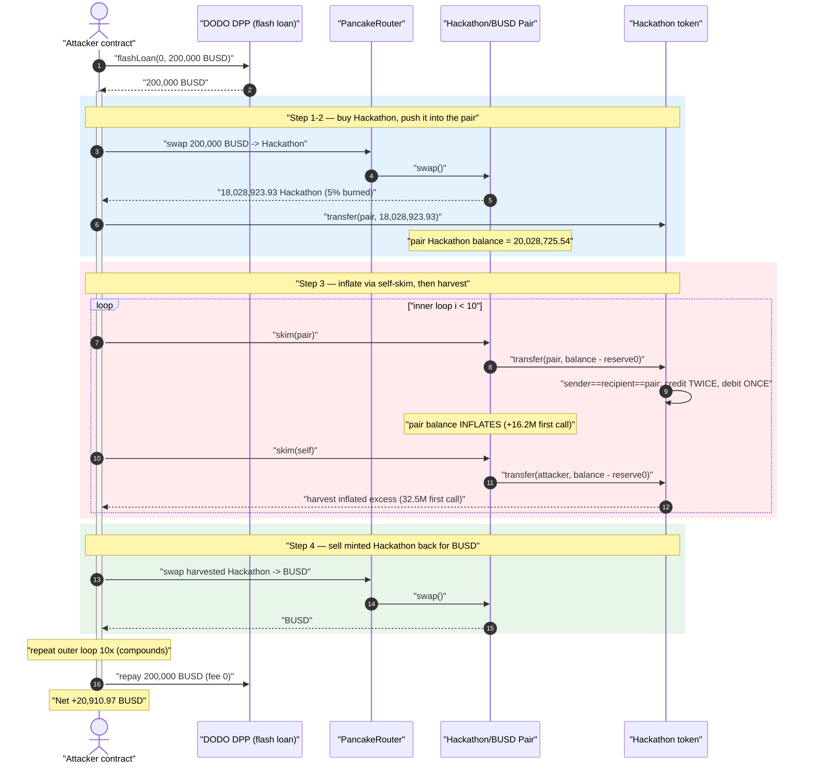
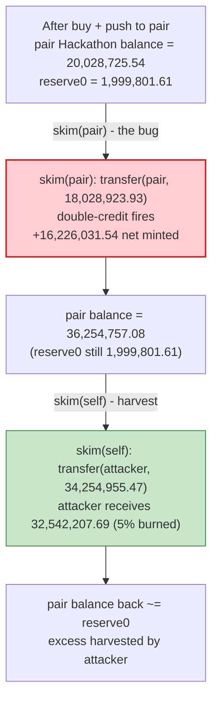
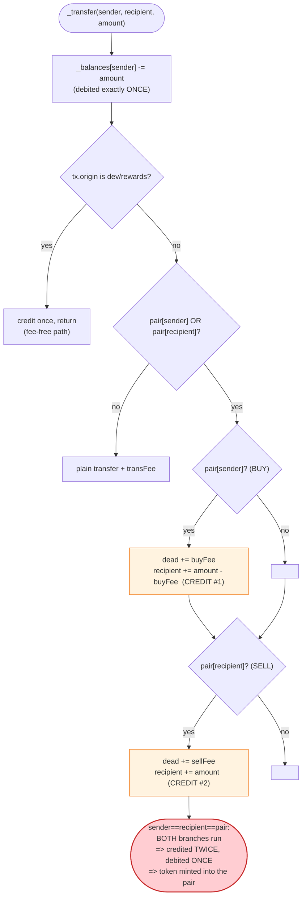

# Hackathon Token Exploit — `sender == recipient == pair` Double-Credit Balance Inflation via `skim()`

> **Reproduction:** the PoC compiles & runs in an isolated Foundry project at
> [this project folder](.) (the umbrella DeFiHackLabs repo contains many unrelated
> PoCs that do not compile together, so this one was extracted).
> Full verbose trace: [output.txt](output.txt).
> Verified vulnerable source: [Hackathon.sol](sources/Hackathon_11cee7/Hackathon.sol) ·
> [PancakePair.sol](sources/PancakePair_d46f4a/PancakePair.sol).

---

## Key info

| | |
|---|---|
| **Loss** | ~**$20,911** — 20,910.97 BUSD net profit (drained from the Hackathon/BUSD pair's BUSD reserve) |
| **Vulnerable contract** | `Hackathon` (BEP20) — [`0x11cee747Faaf0C0801075253ac28aB503C888888`](https://bscscan.com/address/0x11cee747Faaf0C0801075253ac28aB503C888888#code) |
| **Victim pool** | Hackathon / BUSD PancakePair — [`0xd46f4a4B57D8EC355fe83F9AE75d4cC04DE371ED`](https://bscscan.com/address/0xd46f4a4B57D8EC355fe83F9AE75d4cC04DE371ED) |
| **Flash-loan source** | DODO DPP — `0x6098A5638d8D7e9Ed2f952d35B2b67c34EC6B476` (0-fee BUSD flash loan) |
| **Attacker contract** | the PoC `Exploit` contract (`0x7FA9385bE102ac3EAc297483Dd6233D62b3e1496` in fork) |
| **Attack tx** | [`0xea181f730886ece947e255ab508f5af1d0f569fee3368b651d5dbb28549087b5`](https://app.blocksec.com/explorer/tx/bsc/0xea181f730886ece947e255ab508f5af1d0f569fee3368b651d5dbb28549087b5) |
| **Chain / block / date** | BSC / 37,854,043 / April 2024 |
| **Compiler** | Solidity **v0.5.16**, optimizer enabled, 200 runs |
| **Bug class** | Token accounting bug — non-mutually-exclusive `if` branches in `_transfer` mint balance when `sender == recipient` is an AMM pair |
| **Credit** | [@EXVULSEC](https://x.com/EXVULSEC/status/1779519508375613827) |

---

## TL;DR

The `Hackathon` BEP20 token has a fee-on-transfer `_transfer` that splits behaviour into a **BUY**
branch and a **SELL** branch — but it uses **two independent `if` statements instead of `if / else`**
([Hackathon.sol:583-605](sources/Hackathon_11cee7/Hackathon.sol#L583-L605)):

```solidity
if (pair[sender] || pair[recipient]) {
    if (pair[sender])    { ... _balances[recipient] = _balances[recipient].add(amount); }   // BUY
    if (pair[recipient]) { ... _balances[recipient] = _balances[recipient].add(amount); }   // SELL
}
```

When a single transfer has **`sender == recipient == the pair`** (so `pair[sender]` *and*
`pair[recipient]` are both true), **both** branches run and the pair's balance is credited **twice**,
while it was debited only once. Net effect: each such transfer **mints ≈ one `amount` of Hackathon
out of thin air directly into the pair's own balance.**

A PancakeSwap pair has a function that performs exactly that kind of self-transfer:
`skim(to)` ([PancakePair.sol:483-488](sources/PancakePair_d46f4a/PancakePair.sol#L483-L488)) calls
`token.transfer(to, balanceOf(pair) - reserve0)`. Calling **`skim(pair)`** makes the pair transfer
to *itself* — and because the pair is registered as an AMM `pair[]` in the Hackathon token, that
self-transfer hits the double-credit bug and **inflates the pair's Hackathon balance** instead of
being a no-op.

The attacker simply:

1. Flash-borrows 200,000 BUSD from DODO DPP (0 fee).
2. Buys Hackathon, sends it to the pair, then calls `skim(pair)` repeatedly to **inflate** the pair's
   Hackathon balance, and `skim(self)` to **harvest** the inflated excess back to itself.
3. Sells the harvested Hackathon back into the pool for BUSD.
4. Repeats the whole cycle 10× (each cycle compounds), then repays the 200,000 BUSD loan.

Net profit: **20,910.97 BUSD**, paid out of the pair's real BUSD reserves.

---

## Background — what the Hackathon token does

`Hackathon` ([source](sources/Hackathon_11cee7/Hackathon.sol)) is a small Solidity-0.5.16 BEP20 token
("Hackathon" / 21,000,000 supply) with a custom fee-on-transfer `_transfer` and a `pair[]` registry:

- `mapping(address=>bool) public pair;` marks which addresses are AMM pairs
  ([Hackathon.sol:374](sources/Hackathon_11cee7/Hackathon.sol#L374)). The Hackathon/BUSD PancakePair
  is registered here so that buys/sells are taxed.
- Three fee rates: `_buyFee`, `_sellFee`, `_transFee` (in bps, denominator 10000)
  ([:370-372](sources/Hackathon_11cee7/Hackathon.sol#L370-L372)). At the fork block the **sell fee is
  5%** (each sell burns 5% to `dead`).
- A `dead` sink (`0x…dEaD`) receiving the fee on every taxed transfer
  ([:377](sources/Hackathon_11cee7/Hackathon.sol#L377)).
- A privileged dev fast-path: if `tx.origin == devs || rewards[tx.origin]`, the transfer is fee-free
  ([:578-582](sources/Hackathon_11cee7/Hackathon.sol#L578-L582)). The attacker is *not* in this set,
  so it always goes through the taxed branches — which is exactly where the bug lives.

The pair is a stock PancakeSwap V2 pair
([PancakePair.sol](sources/PancakePair_d46f4a/PancakePair.sol)). `token0 = Hackathon`,
`token1 = BUSD` (from the first `getReserves()` in the trace:
`reserve0 = 2.097e25` Hackathon, `reserve1 = 2.102e22` BUSD,
[output.txt:84](output.txt#L84)).

On-chain state at the fork block (read from the trace):

| Parameter | Value |
|---|---|
| `_sellFee` / `_buyFee` | **500 bps = 5%** (derived: 5% of every swap goes to `dead`) |
| pair token0 | Hackathon `0x11cee747…888888` |
| pair token1 | BUSD `0x55d3…7955` |
| pair Hackathon reserve (post-first-swap `Sync`) | 1,999,801.61 Hackathon |
| pair BUSD reserve | 221,022.46 BUSD (with ~200k of attacker BUSD added to it) |

---

## The vulnerable code

### 1. Two independent `if` branches — the double credit

[Hackathon.sol:570-607](sources/Hackathon_11cee7/Hackathon.sol#L570-L607):

```solidity
function _transfer(address sender, address recipient, uint256 amount) internal {
    require(sender != address(0), "BEP20: transfer from the zero address");
    require(recipient != address(0), "BEP20: transfer to the zero address");
    _balances[sender] = _balances[sender].sub(amount, "...exceeds balance");   // ← debited ONCE
    uint256 buyFeeAmount  = amount * _buyFee  / 10000;
    uint256 sellFeeAmount = amount * _sellFee / 10000;
    uint256 transFeeAmount = amount * _transFee / 10000;
    address txOrg = tx.origin;
    if (txOrg == devs || rewards[txOrg]) {           // dev fast-path (not the attacker)
        _balances[recipient] = _balances[recipient].add(amount);
        emit Transfer(sender, recipient, amount);
        return;
    }
    if (pair[sender] || pair[recipient]) {
        if (pair[sender]) {                          // BUY branch
            amount = amount.sub(buyFeeAmount);
            _balances[dead]      = _balances[dead].add(buyFeeAmount);
            emit Transfer(sender, dead, buyFeeAmount);
            _balances[recipient] = _balances[recipient].add(amount);     // ← credit #1
            emit Transfer(sender, recipient, amount);
        }
        if (pair[recipient]) {                       // SELL branch — NOTE: not `else if`
            _balances[dead]      = _balances[dead].add(sellFeeAmount);
            emit Transfer(sender, dead, sellFeeAmount);
            _balances[recipient] = _balances[recipient].add(amount);     // ← credit #2
            emit Transfer(sender, recipient, amount);
        }
    } else {
        // plain transfer ...
    }
}
```

If `sender` and `recipient` are **both** the pair, both `pair[sender]` and `pair[recipient]` are
`true`, so **both** the BUY and the SELL block execute. The recipient (= the pair = the sender) is
credited twice (`amount - buyFee` in BUY, then `amount - buyFee` again in SELL — note the BUY branch
already shrank `amount`) but debited once. The token mints ≈ one `amount` of supply into the pair.

### 2. `skim()` produces the malicious self-transfer

[PancakePair.sol:483-488](sources/PancakePair_d46f4a/PancakePair.sol#L483-L488):

```solidity
// force balances to match reserves
function skim(address to) external lock {
    address _token0 = token0;
    address _token1 = token1;
    _safeTransfer(_token0, to, IERC20(_token0).balanceOf(address(this)).sub(reserve0));
    _safeTransfer(_token1, to, IERC20(_token1).balanceOf(address(this)).sub(reserve1));
}
```

`skim` is **permissionless** and lets the caller choose `to`. With `to == pair`, the first line
becomes `Hackathon.transfer(pair, balanceOf(pair) - reserve0)` — a transfer **from the pair to the
pair**. That is precisely the `sender == recipient == pair` condition that triggers the double-credit
bug. So `skim(pair)`, instead of forcing the balance *down* to the reserve (its intended purpose),
**increases** the pair's Hackathon balance by ≈ the skimmed delta.

`skim(attacker)` is then a normal pair→attacker transfer of `balanceOf(pair) - reserve0`, paying the
inflated excess out to the attacker.

---

## Root cause — why it was possible

Two design decisions compose into a critical mint:

1. **Non-mutually-exclusive branches.** A buy and a sell are conceptually exclusive (a transfer is
   either *from* the pair or *to* the pair), so the code should use `if (pair[sender]) { … } else if
   (pair[recipient]) { … }`. Using two separate `if`s means the degenerate case where `sender ==
   recipient == pair` falls into **both**, and the single debit is paired with a double credit. This
   is a free mint of the token into any pair-to-pair transfer.

2. **A reachable pair→pair transfer primitive.** Normally nobody transfers a pair's tokens to itself.
   But Uniswap-V2/PancakeSwap pairs expose `skim(to)` with an attacker-chosen `to`, and `skim(pair)`
   creates exactly that self-transfer. Because `skim` reads `balanceOf(pair) - reserve0` as the
   amount, and the prior swap left a gap between balance and reserve, each `skim(pair)` mints a large
   chunk; balances grow further, so subsequent skims mint even more.

The fee logic actually *amplifies* the exploit visibility but does not stop it: each self-skim burns
5% twice to `dead` yet still credits the pair twice, so the pair nets a large positive balance per
call. The attacker harvests that net via `skim(self)`.

> In short: a one-character class of bug (`if` vs `else if`) turns the pair's own `skim()` into a
> token-printing press, and the printed tokens are sold back into the pool for its real BUSD.

---

## Preconditions

- The PancakePair is registered as `pair[pairAddress] == true` in the Hackathon token (it is — the
  token taxes swaps through this pair).
- The attacker is **not** in the `devs`/`rewards` fast-path (true for any external attacker), so its
  transfers route through the taxed BUY/SELL branches where the bug lives.
- `skim(address)` is permissionless on the pair (stock Uniswap-V2 behaviour).
- A small amount of working capital to seed the inflation — supplied here as a **0-fee 200,000 BUSD
  flash loan** from DODO DPP, repaid in the same transaction, so the attack is effectively
  capital-free.

---

## Attack walkthrough (with on-chain numbers from the trace)

The attack borrows 200,000 BUSD and runs an **outer loop of 10 iterations** (`while (j < 10)`), each
of which contains an **inner loop of 10 skim cycles** (`while (i < 10)`). Numbers below are from the
**first** outer iteration (the mechanism is identical each time; the harvested amount grows because
inflation compounds across iterations). Hackathon = token0, BUSD = token1.

| # | Step | Trace ref | Concrete numbers |
|---|------|-----------|------------------|
| 0 | **Flash loan** 200,000 BUSD from DODO DPP (fee 0) | [output.txt:48-51](output.txt#L48) | +200,000 BUSD to attacker |
| 1 | **Buy** Hackathon with 200,000 BUSD via Pancake router | [output.txt:72-101](output.txt#L72) | 200,000 BUSD in → pair sends 18,977,814.66 Hackathon, **burns 5% (948,890.73) to dead**, attacker nets **18,028,923.93** Hackathon. New `Sync`: reserve0 = 1,999,801.61 Hackathon, reserve1 = 221,022.46 BUSD |
| 2 | **Send** all 18,028,923.93 Hackathon to the pair (a sell-side transfer; 5% burned) | [output.txt:112-114](output.txt#L112) | pair Hackathon balance → 20,028,725.54 (= 1,999,801.61 reserve + 18,028,923.93 minus dust burn) |
| 3a | **`skim(pair)`** — pair transfers `balance − reserve0` to **itself**; the double-credit bug fires | [output.txt:120-131](output.txt#L120) | skim amount = 20,028,725.54 − 1,999,801.61 = **18,028,923.93**. Transfer credits pair **twice** with 17,127,477.73 each (lines [125](output.txt#L125),[127](output.txt#L127)), burns 5%×2 to dead, debits once → pair balance jumps to **36,254,757.08** Hackathon |
| 3b | **`skim(self)`** — harvest the inflated excess to the attacker | [output.txt:138-148](output.txt#L138) | skim amount = 36,254,757.08 − 1,999,801.61 = **34,254,955.47**; attacker receives 32,542,207.69 (after 5% burn) |
| 3c | repeat `skim(pair)` / `skim(self)` for the rest of the inner loop (`i < 10`) | [output.txt:155-...](output.txt#L155) | after the first profitable pair the balance−reserve gap is mostly exhausted, so later skims in the inner loop transfer 0 (no-ops) |
| 4 | **Sell** all harvested Hackathon back to BUSD via the router | [output.txt:795](output.txt#L795) | iter-1 sell: **55,652,875.91 Hackathon → BUSD** |
| 5 | **Next outer iterations** repeat steps 1-4; harvested-Hackathon-per-sell compounds | sells at [output.txt:1176](output.txt#L1176),[1557](output.txt#L1557),[1938](output.txt#L1938),[2319](output.txt#L2319),[2700](output.txt#L2700),[3081](output.txt#L3081),[3462](output.txt#L3462),[3843](output.txt#L3843) | 95.3M → 163.4M → 280.1M → 480.3M → 823.5M → 1.412B → 2.421B → **4.152B** Hackathon sold in the last iteration |
| 6 | **Repay** the flash loan: transfer exactly 200,000 BUSD back to DODO DPP | [output.txt:3879-3880](output.txt#L3879) | −200,000 BUSD |
| 7 | **Profit** read out | [output.txt:3897-3901](output.txt#L3897) | attacker BUSD balance = **20,910.97** |

### The double-credit, numerically (step 3a, first self-skim)

```
amount transferred (skim delta)         = 18,028,923.93 Hackathon
_balances[pair].sub(amount)             = −18,028,923.93           (debited ONCE)
BUY  branch: dead += 5%·amount = 901,446.20 ; pair += amount−fee = 17,127,477.73   (credit #1)
SELL branch: dead += 5%·amount = 901,446.20 ; pair += amount(now reduced) = 17,127,477.73 (credit #2)
─────────────────────────────────────────────────────────────────────────────────────────
net change to pair balance              = −18,028,923.93 + 2×17,127,477.73 = +16,226,031.54
tokens minted from nothing              ≈ +18,028,923.93  (≈ one full `amount`)
```

The pair's Hackathon balance grows by ~16.2M per self-skim, all of which the attacker then harvests
with `skim(self)` and sells for the pool's BUSD.

### Profit accounting (BUSD)

| Direction | Amount (BUSD) |
|---|---:|
| Flash-loan in (DODO DPP) | +200,000.00 |
| Flash-loan repayment (fee 0) | −200,000.00 |
| **Net BUSD extracted from the pair over 10 iterations** | **+20,910.97** |
| **Attacker net profit** | **+20,910.97** |

The pool's BUSD reserve is the source of the profit: every iteration buys Hackathon with BUSD and
sells *more* Hackathon (the minted excess) back for BUSD, so each round nets the attacker BUSD at the
pool's expense, finally summing to **20,910.97 BUSD ≈ $20,911**.

---

## Diagrams

### Sequence of the attack (one outer iteration)



### Pair Hackathon-balance evolution (first inner skim cycle)



### The flaw inside `_transfer`



---

## Why each magic number

- **200,000 BUSD flash loan:** seed capital large enough that the first buy yields ~18M Hackathon,
  whose subsequent self-skim mints a meaningful excess. DODO DPP charges **0 fee**, so the loan is
  free and makes the attack zero-capital.
- **`skim(pair)` before `skim(self)`:** `skim(pair)` is the *mint* (self-transfer that double-credits
  the pair); `skim(self)` is the *harvest* (pays the inflated excess to the attacker). Order matters:
  inflate first, then harvest.
- **Inner loop `i < 10`:** repeats the inflate/harvest pair; in practice only the first one or two
  skims per cycle are productive (the balance−reserve gap is consumed), so most inner iterations are
  no-ops that simply cost gas.
- **Outer loop `j < 10`:** each full buy→inflate→harvest→sell cycle compounds — the Hackathon sold
  per iteration grows from 55.7M to 4.15B — squeezing progressively more BUSD out of the pool.
- **5% sell fee:** burns to `dead` on every taxed leg; it taxes both credits in the self-skim but
  the double credit still leaves a large net mint, so the fee only modestly reduces the take.

---

## Remediation

1. **Make the buy/sell branches mutually exclusive.** Replace the two independent `if`s with
   `if (pair[sender]) { … } else if (pair[recipient]) { … }`, and explicitly handle / reject the
   `sender == recipient` degenerate case. A transfer cannot simultaneously be a buy and a sell.
2. **Guard against self-transfers.** Add `require(sender != recipient)` (or treat `sender ==
   recipient` as a no-op after the debit) so a balance can never be credited more times than it is
   debited.
3. **Conserve supply per transfer.** Assert the invariant `credited + burned == debited` at the end
   of `_transfer`; any path that adds to `_balances[recipient]` more than once is a supply bug.
4. **Do not trust pair-controlled callbacks/primitives.** Token logic that special-cases AMM pairs
   must remain correct when the pair calls the token in unusual ways (e.g., `skim`, `sync`, donations,
   pair→pair transfers). Test the token against `skim(pairAddress)` explicitly.
5. **Prefer audited standard token bases.** This bug would not exist on a standard OpenZeppelin ERC20
   with a single, well-tested `_transfer`; bespoke fee-on-transfer rewrites should be minimal and
   reviewed for branch exclusivity.

---

## How to reproduce

The PoC was extracted into a standalone Foundry project (the umbrella DeFiHackLabs repo has many
unrelated PoCs that fail to compile together under a whole-project `forge test`):

```bash
_shared/run_poc.sh 2024-04-Hackathon_exp -vvvvv
```

- RPC: a **BSC archive** endpoint is required (fork block 37,854,043). `foundry.toml` uses
  `https://bsc-mainnet.public.blastapi.io`, which serves historical state at that block; the default
  public endpoint (`bnb.api.onfinality.io`) rate-limits (HTTP 429) on the heavy 10×10-loop trace and
  was swapped out.
- Result: `[PASS] testExploit()` with the attacker BUSD balance rising from 0 to **20,910.97**.

Expected tail:

```
Ran 1 test for test/Hackathon_exp.sol:Exploit
[PASS] testExploit() (gas: 5286908)
  attacker balance BUSD before attack:: 0.000000000000000000
  attacker balance BUSD after attack:: 20910.970496548372314469
Suite result: ok. 1 passed; 0 failed; 0 skipped; finished in 10.34s
```

---

*Reference: EXVULSEC — https://x.com/EXVULSEC/status/1779519508375613827 (Hackathon token, BSC, ~$20.9K, April 2024).*
