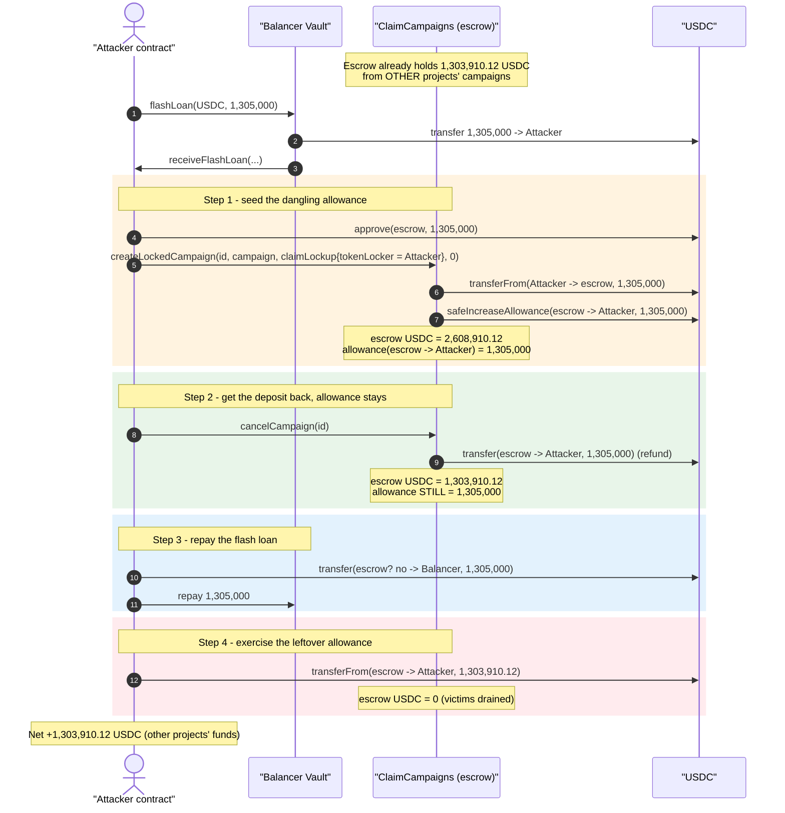
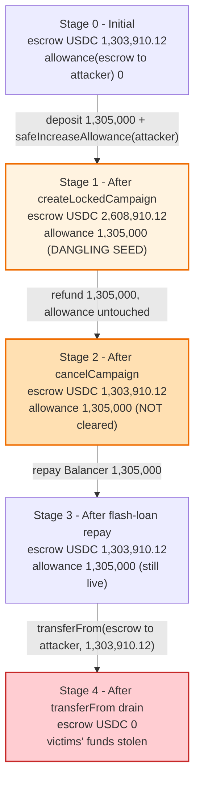
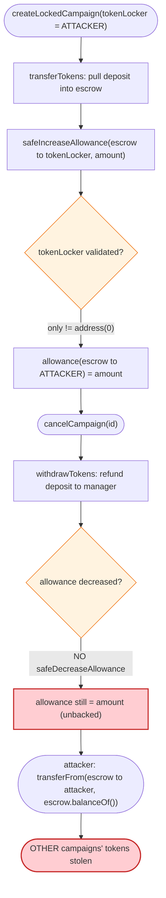

# Hedgey Finance Exploit — Dangling Approval to Attacker-Controlled `tokenLocker`

> One-liner: `createLockedCampaign` grants an ERC20 allowance to a **caller-supplied, unvalidated** `claimLockup.tokenLocker` address; `cancelCampaign` refunds the deposit but never revokes that allowance, so the attacker keeps a live `transferFrom` allowance and drains *other* campaigns' tokens still sitting in the contract.

> **Reproduction:** the PoC compiles & runs in an isolated Foundry project at
> [this project folder](.) (the umbrella DeFiHackLabs repo does not whole-compile,
> so this PoC was extracted). Full verbose trace: [output.txt](output.txt).
> Verified vulnerable source: [contracts_Periphery_ClaimCampaigns.sol](sources/ClaimCampaigns_Bc452f/contracts_Periphery_ClaimCampaigns.sol).

---

## Key info

| | |
|---|---|
| **Loss (this contract / PoC)** | **1,303,910.12 USDC** drained from the `ClaimCampaigns` contract in a single tx. Total Hedgey incident across all affected campaigns/tokens ≈ **$48M** (per PoC header / public reports). |
| **Vulnerable contract** | `ClaimCampaigns` — [`0xBc452fdC8F851d7c5B72e1Fe74DFB63bb793D511`](https://etherscan.io/address/0xBc452fdC8F851d7c5B72e1Fe74DFB63bb793D511#code) |
| **Victim** | Token projects that created locked/vesting claim campaigns; their deposited tokens pooled in the shared `ClaimCampaigns` contract |
| **Attacker EOA** | [`0xDed2b1a426E1b7d415A40Bcad44e98F47181dda2`](https://etherscan.io/address/0xDed2b1a426E1b7d415A40Bcad44e98F47181dda2) |
| **Attacker contract** | [`0xC793113F1548B97E37c409f39244EE44241bF2b3`](https://etherscan.io/address/0xC793113F1548B97E37c409f39244EE44241bF2b3) |
| **Attack tx** | [`0x2606d459a50ca4920722a111745c2eeced1d8a01ff25ee762e22d5d4b1595739`](https://etherscan.io/tx/0x2606d459a50ca4920722a111745c2eeced1d8a01ff25ee762e22d5d4b1595739) |
| **Chain / block / date** | Ethereum mainnet / 19,687,890 (PoC forks 19,687,889) / **April 19, 2024** |
| **Compiler** | Solidity v0.8.19, optimizer 200 runs |
| **Bug class** | Dangling ERC20 approval to an unvalidated, attacker-controlled address (missing allowance revocation on cancel) |

---

## TL;DR

`ClaimCampaigns` is a shared, multi-tenant escrow: many token projects deposit tokens into the
**same** contract to fund their airdrop "claim campaigns." For *locked/vesting* campaigns,
`createLockedCampaign` deposits the campaign's tokens and then approves the **lockup-plans contract**
to pull those tokens later when claimants claim:

```solidity
SafeERC20.safeIncreaseAllowance(IERC20(campaign.token), claimLockup.tokenLocker, campaign.amount);
```

The fatal flaw: **`claimLockup.tokenLocker` is whatever address the caller passes in.** It is never
checked against a real Hedgey lockup-plans contract. So an attacker sets
`tokenLocker = attackerContract` and the escrow hands the attacker a `transferFrom` allowance equal to
the campaign amount.

The attacker then **cancels** the campaign. `cancelCampaign` deletes the campaign and refunds the
attacker's own deposit — but **it never reduces the allowance** that `createLockedCampaign` granted. The
allowance is now a free-floating right to pull tokens from the escrow that the attacker no longer has any
funds backing.

Because the escrow holds **all** projects' tokens in one balance, the attacker exercises the leftover
allowance with `USDC.transferFrom(ClaimCampaigns, attacker, ClaimCampaigns.balanceOf())` and walks off
with **everyone else's** deposited tokens. A Balancer flash loan supplies the throwaway deposit so the
attack costs nothing but gas.

Net for this PoC: **+1,303,910.12 USDC**, exactly the foreign deposits the contract held at the fork
block. (The real incident hit multiple campaigns/tokens for ~$48M total.)

---

## Background — what Hedgey `ClaimCampaigns` does

`ClaimCampaigns` ([source](sources/ClaimCampaigns_Bc452f/contracts_Periphery_ClaimCampaigns.sol)) lets a
project distribute tokens to its community via Merkle-tree claims. Three campaign shapes exist
(`TokenLockup.Unlocked / Locked / Vesting`). For Locked/Vesting:

1. The creator calls `createLockedCampaign(id, campaign, claimLockup, donation)`.
2. The contract **pulls** `campaign.amount` of `campaign.token` from the creator into itself
   ([`:173`](sources/ClaimCampaigns_Bc452f/contracts_Periphery_ClaimCampaigns.sol#L173)).
3. The contract **approves** `claimLockup.tokenLocker` (meant to be Hedgey's `TokenLockupPlans` /
   `TokenVestingPlans` NFT contract) for `campaign.amount`, so that later, when a user claims, the lockup
   contract can `transferFrom` the escrow to mint a locked-token NFT
   ([`:192`](sources/ClaimCampaigns_Bc452f/contracts_Periphery_ClaimCampaigns.sol#L192)).
4. Users later call `claimTokens` with a Merkle proof; the lockup contract pulls their slice.
5. The manager can `cancelCampaign` at any time to get unclaimed tokens back
   ([`:251`](sources/ClaimCampaigns_Bc452f/contracts_Periphery_ClaimCampaigns.sol#L251)).

Critically, **every** project's tokens live in the *same* `ClaimCampaigns` contract balance. There is no
per-campaign segregation of funds — only per-campaign bookkeeping in the `campaigns` mapping. So a single
loose allowance lets an attacker reach into all projects' funds of the same token.

On-chain facts at the fork block (read from the trace):

| Fact | Value |
|---|---|
| USDC already escrowed by *other* campaigns | **1,303,910.12 USDC** |
| Attacker's own USDC | 0 (flash-loaned) |
| Balancer flash-loan fee | 0 |
| USDC the attacker walked away with | **1,303,910.12 USDC** |

---

## The vulnerable code

### 1. Approval to a caller-controlled `tokenLocker` (the seed of the bug)

[`contracts_Periphery_ClaimCampaigns.sol:159-196`](sources/ClaimCampaigns_Bc452f/contracts_Periphery_ClaimCampaigns.sol#L159-L196):

```solidity
function createLockedCampaign(
    bytes16 id,
    Campaign memory campaign,
    ClaimLockup memory claimLockup,
    Donation memory donation
) external nonReentrant {
    require(!usedIds[id], 'in use');
    usedIds[id] = true;
    require(campaign.token != address(0), '0_address');
    require(campaign.manager != address(0), '0_manager');
    require(campaign.amount > 0, '0_amount');
    require(campaign.end > block.timestamp, 'end error');
    require(campaign.tokenLockup != TokenLockup.Unlocked, '!locked');
    require(claimLockup.tokenLocker != address(0), 'invalide locker');   // ← only a zero-check!
    TransferHelper.transferTokens(campaign.token, msg.sender, address(this), campaign.amount + donation.amount);
    ...
    claimLockups[id] = claimLockup;
    // ⚠️ tokenLocker is fully attacker-controlled; no whitelist / no code check
    SafeERC20.safeIncreaseAllowance(IERC20(campaign.token), claimLockup.tokenLocker, campaign.amount);
    campaigns[id] = campaign;
    emit ClaimLockupCreated(id, claimLockup);
    emit CampaignStarted(id, campaign);
}
```

The only validation on `claimLockup.tokenLocker` is `!= address(0)`. Setting it to the attacker's own
address makes line 192 grant the **attacker** an allowance of `campaign.amount` over the escrow's tokens.

### 2. Cancel refunds the deposit but never revokes the allowance

[`contracts_Periphery_ClaimCampaigns.sol:251-258`](sources/ClaimCampaigns_Bc452f/contracts_Periphery_ClaimCampaigns.sol#L251-L258):

```solidity
function cancelCampaign(bytes16 campaignId) external nonReentrant {
    Campaign memory campaign = campaigns[campaignId];
    require(campaign.manager == msg.sender, '!manager');
    delete campaigns[campaignId];
    delete claimLockups[campaignId];
    TransferHelper.withdrawTokens(campaign.token, msg.sender, campaign.amount); // refunds the deposit
    emit CampaignCancelled(campaignId);
    // ⚠️ NO SafeERC20.safeDecreaseAllowance(...) — the allowance from createLockedCampaign survives
}
```

The deposit (`campaign.amount`) is returned to the manager, but the matching
`safeIncreaseAllowance(tokenLocker, campaign.amount)` from creation is never undone. The attacker is
refunded *and* keeps a live allowance over the escrow.

### 3. The escrow is a shared pool — one allowance reaches everyone's tokens

Funds are pooled (the `campaigns` mapping is only bookkeeping; the actual ERC20 balance is one bucket).
After cancel, the attacker simply exercises the dangling allowance directly against the token:

```solidity
// in the attacker contract, after the flash loan is repaid
uint256 bal = USDC.balanceOf(address(HedgeyFinance));     // 1,303,910.12 — OTHER campaigns' money
USDC.transferFrom(address(HedgeyFinance), address(this), bal);
```

---

## Root cause — why it was possible

Four design facts compose into a one-transaction theft:

1. **Untrusted approval target.** `createLockedCampaign` approves `claimLockup.tokenLocker` — an
   arbitrary caller-supplied address — instead of a whitelisted/known Hedgey lockup contract. This hands
   the attacker an allowance over the escrow's tokens.
2. **No allowance cleanup on cancel.** `cancelCampaign` `delete`s the campaign and refunds the deposit
   but performs **no** `safeDecreaseAllowance`. The grant from step 1 outlives the campaign. (Even
   `claimTokens` reduces the campaign bookkeeping but the same allowance-vs-balance asymmetry is the
   structural defect; cancel is just the cleanest exploit path.)
3. **Pooled, non-segregated balances.** All projects' tokens of a given ERC20 share one contract balance.
   An allowance "for my campaign's amount" is, in practice, an allowance over **everyone's** tokens of
   that token — the contract has no notion of "only your share."
4. **Zero-cost capital via flash loan.** The attacker needs a throwaway `campaign.amount` only long
   enough to (a) be granted the allowance and (b) get it refunded by cancel. A Balancer flash loan
   (0 fee) supplies it; it is returned within the same transaction. The deposit's only purpose is to mint
   the allowance.

In short: the contract grants `allowance(escrow → attacker) = X`, refunds the `X` the attacker put in,
and forgets to clear the allowance — leaving the attacker an unbacked right to pull `X` (or up to the
escrow's whole balance) of *other people's* tokens.

---

## Preconditions

- The escrow holds tokens of the chosen `campaign.token` from **other** campaigns (so there is something
  to steal). USDC was the richest pool here: 1,303,910.12 USDC.
- The attacker can choose any `claimLockup.tokenLocker` (true — only a `!= address(0)` check).
- The attacker can fund a throwaway deposit equal to `campaign.amount`; this can be flash-loaned because
  it is fully refunded by `cancelCampaign` in the same tx (no fee on Balancer).
- `campaign.amount` is sized ≥ the escrow's holdings of that token so the dangling allowance covers the
  full balance to drain (PoC uses 1,305,000 ≥ 1,303,910.12).

No special privileges, no timing windows, permissionless.

---

## Attack walkthrough (with on-chain numbers from the trace)

All figures are pulled directly from [output.txt](output.txt) (USDC has 6 decimals).

| # | Step | USDC at escrow | Attacker allowance over escrow | Attacker USDC |
|---|------|---------------:|-------------------------------:|--------------:|
| 0 | **Initial** (fork block 19,687,889) | 1,303,910.12 | 0 | 0 |
| 1 | **Flash-loan 1,305,000 USDC** from Balancer (fee 0) → attacker | 1,303,910.12 | 0 | 1,305,000.00 |
| 2 | `USDC.approve(escrow, 1,305,000)` (attacker → escrow, so escrow can pull the deposit) | 1,303,910.12 | 0 | 1,305,000.00 |
| 3 | **`createLockedCampaign`** with `tokenLocker = attacker`: escrow pulls 1,305,000 in **and** `safeIncreaseAllowance(escrow → attacker, 1,305,000)` | **2,608,910.12** | **1,305,000.00** | 0 |
| 4 | **`cancelCampaign`**: escrow refunds `campaign.amount = 1,305,000` to attacker; **allowance NOT cleared** | 1,303,910.12 | **1,305,000.00** | 1,305,000.00 |
| 5 | **Repay flash loan**: attacker transfers 1,305,000 → Balancer | 1,303,910.12 | **1,305,000.00** | 0 |
| 6 | **`USDC.transferFrom(escrow, attacker, 1,303,910.12)`** using the dangling allowance | **0** | 1,094.88 (residual) | **1,303,910.12** |

Notes anchored to the trace:
- Step 3 escrow inflow to 2,608,910.12 USDC: [output.txt:1634](output.txt#L1634).
- Step 3 dangling allowance granted (`escrow.approve(attacker, 1,305,000)`): [output.txt:1641-1644](output.txt#L1641-L1644).
- Step 4 refund of 1,305,000 to attacker: [output.txt:1664-1668](output.txt#L1664-L1668).
- Step 5 flash-loan repayment 1,305,000 → Balancer: [output.txt:1685-1690](output.txt#L1685-L1690).
- Step 6 drain via leftover allowance (1,303,910.12 USDC out, allowance 1,305,000 → 40,963.96... residual): [output.txt:1703-1710](output.txt#L1703-L1710).
- Final attacker balance log: [output.txt:1574-1575](output.txt#L1574-L1575).

### Profit / loss accounting (USDC)

| Direction | Amount |
|---|---:|
| Flash-loan borrowed | 1,305,000.000000 |
| Flash-loan repaid | 1,305,000.000000 |
| Deposit into campaign | 1,305,000.000000 |
| Refund from cancel | 1,305,000.000000 |
| **Drained via dangling allowance (victims' funds)** | **1,303,910.120000** |
| Flash-loan fee | 0 |
| **Net profit** | **+1,303,910.120000 USDC (≈ $1.3M)** |

The profit equals, to the cent, the foreign USDC the escrow held at the fork block — the attacker simply
walked off with everyone else's deposits via one unrevoked approval.

---

## Diagrams

### Sequence of the attack



### Escrow state evolution



### The flaw: allowance lifecycle vs deposit lifecycle



---

## Why each number

- **Flash loan = 1,305,000 USDC:** must be ≥ the escrow's USDC holdings (1,303,910.12) so that the
  resulting dangling allowance is large enough to cover the entire balance in one `transferFrom`. It is
  fully refunded by `cancelCampaign`, so it is free (Balancer fee = 0).
- **`tokenLocker = attacker address:`** the whole exploit. The escrow's `safeIncreaseAllowance` then
  targets the attacker. Any non-zero address passes the `'invalide locker'` check.
- **`donation.amount = 0`, `tokenLockup = Locked`, `end = 3133666800` (far future):** minimal valid
  campaign that passes all `require`s and reaches the `safeIncreaseAllowance` line without side effects.
- **Drain = 1,303,910.12 USDC:** `escrow.balanceOf()` at the moment of `transferFrom`, i.e. precisely the
  foreign deposits — bounded only by the (larger) dangling allowance.

---

## Remediation

1. **Never approve an unvalidated address.** `claimLockup.tokenLocker` must be a known, whitelisted
   Hedgey lockup-plans / vesting-plans contract (immutable references or an allowlist), not a
   caller-supplied address. Replace the `!= address(0)` check with a strict whitelist membership check.
2. **Revoke allowances on cancel (and on full claim).** `cancelCampaign` must
   `SafeERC20.safeDecreaseAllowance(token, claimLockup.tokenLocker, remainingAllowanceForThisCampaign)`
   so the allowance lifecycle exactly mirrors the deposit lifecycle. Track the per-campaign granted
   allowance and unwind it precisely.
3. **Don't grant escrow-wide allowances at all.** Prefer a pull pattern where the lockup contract is
   funded *per claim* (the escrow `safeTransfer`s the exact claim amount at claim time) instead of a
   standing allowance over the pooled balance. This removes the "allowance over everyone's tokens"
   class entirely.
4. **Segregate or cap per-campaign exposure.** If a standing allowance is unavoidable, ensure no single
   campaign's allowance/withdrawal can ever touch another campaign's tokens (e.g., per-token, per-campaign
   accounting that bounds outflow to the campaign's remaining balance, with invariant checks that the sum
   of campaign balances == contract balance).
5. **Reset stale approvals to zero before reuse** and avoid `safeIncreaseAllowance` accumulating across a
   reused/duplicated id (the `usedIds` guard helps here but does not address the lingering grant).

---

## How to reproduce

The PoC was extracted into a standalone Foundry project (the umbrella DeFiHackLabs repo does not
whole-compile under `forge test`):

```bash
_shared/run_poc.sh 2024-04-HedgeyFinance_exp -vvvvv
```

- RPC: an **Ethereum mainnet archive** endpoint is required (the fork block 19,687,889 is from April 19,
  2024). `foundry.toml` uses an Infura archive endpoint; pruned public RPCs will fail with
  `header not found` / `missing trie node`.
- Result: `[PASS] testExploit()` with the attacker's USDC balance going `0 -> 1,303,910.12`.

Expected tail:

```
Ran 1 test for test/HedgeyFinance_exp.sol:HedgeyFinance
[PASS] testExploit() (gas: 336291)
Logs:
  Attacker USDC balance before exploit: 0.000000000000000000
  Attacker USDC balance after exploit: 1303910.120000

Suite result: ok. 1 passed; 0 failed; 0 skipped
```

---

*Vulnerable source verified on Etherscan and stored under
[sources/ClaimCampaigns_Bc452f/](sources/ClaimCampaigns_Bc452f/). PoC: [test/HedgeyFinance_exp.sol](test/HedgeyFinance_exp.sol).
References: CUBE3 / SlowMist post-mortems of the April 2024 Hedgey Finance incident (~$48M aggregate).*
