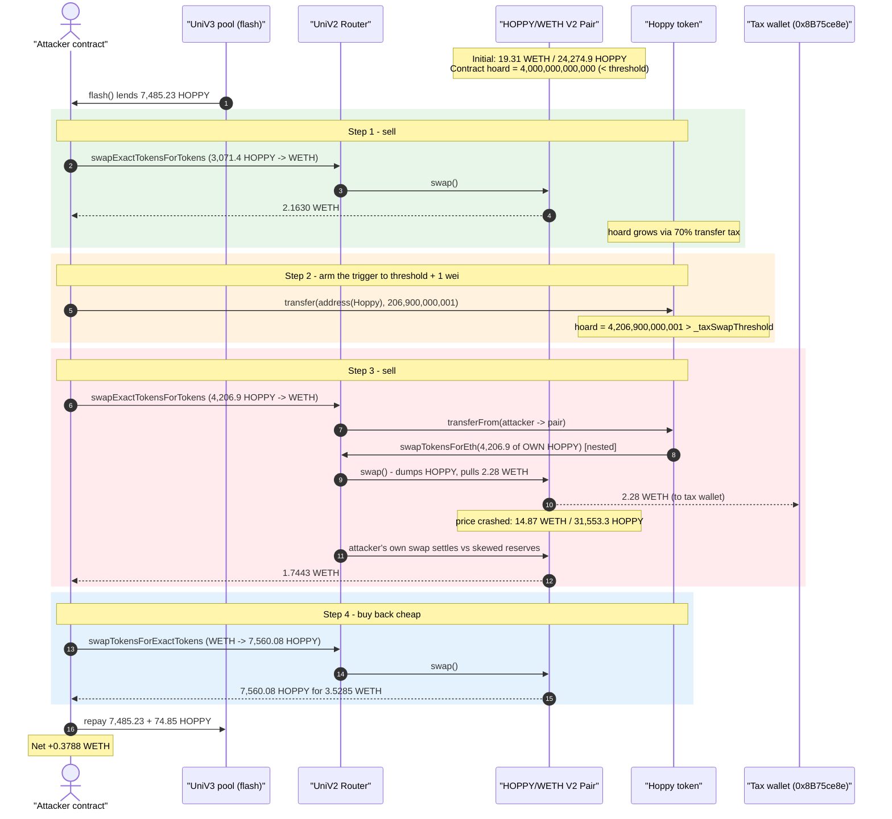
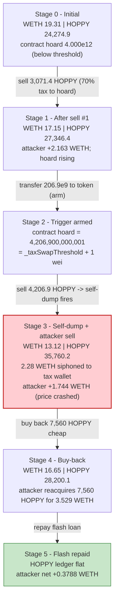
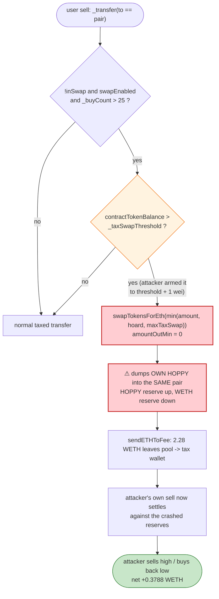

# Hoppy The Frog Exploit — Tax-Token Auto-Swap Reserve Manipulation

> **Vulnerability classes:** vuln/oracle/price-manipulation · vuln/defi/sandwich-attack

> One-line: A meme tax-token whose `_transfer` force-dumps the contract's own
> accumulated tax tokens into the Uniswap-V2 pool *in the middle of a user's sell*
> lets an attacker pre-position, trigger the dump at a chosen moment, and harvest
> the resulting price dislocation for a risk-free ~0.38 WETH.

> **Reproduction:** the PoC compiles & runs in an isolated Foundry project at
> [this project folder](.) (the umbrella DeFiHackLabs repo does not whole-compile,
> so this PoC was extracted). Full verbose trace:
> [output.txt](output.txt). Verified vulnerable source:
> [Hoppy.sol](sources/Hoppy_E5c6F5/Hoppy.sol).

---

## Key info

| | |
|---|---|
| **Loss** | ~**0.38 WETH** profit to the attacker (PoC: `0` → `0.378824808020857200` WETH); the victim pool additionally bled ~2.28 WETH to the token's tax wallet during the same tx. KeyInfo header rounds the headline to ~0.3 ETH. |
| **Vulnerable contract** | `Hoppy` ("Hoppy The Frog", HOPPY) — [`0xE5c6F5fEF89B64f36BfcCb063962820136bAc42F`](https://etherscan.io/address/0xE5c6F5fEF89B64f36BfcCb063962820136bAc42F#code) |
| **Victim pool** | HOPPY/WETH UniswapV2 pair — [`0x53EeF67F96ccb71fB1750Df973fB9e8C82096759`](https://etherscan.io/address/0x53EeF67F96ccb71fB1750Df973fB9e8C82096759) |
| **Flash-loan source** | UniswapV3 pool `0xaA6f337f16E6658d9c9599c967D3126051b6c726` (lent the attacker 7,485.23 HOPPY via `flash()`) |
| **Attacker EOA** | [`0x676c3262e8f0fba0031a93ea74ff801b99ac177b`](https://etherscan.io/address/0x676c3262e8f0fba0031a93ea74ff801b99ac177b) |
| **Attacker contract** | [`0xc976ed4b25e1e7019ff34fb54f4e63b1550b70c3`](https://etherscan.io/address/0xc976ed4b25e1e7019ff34fb54f4e63b1550b70c3) |
| **Attack tx** | [`0x6fb7f8e9eb09d6ae17dbe82b2b42f46f64fb9c3197438b68ecf03e832d5fc791`](https://app.blocksec.com/explorer/tx/eth/0x6fb7f8e9eb09d6ae17dbe82b2b42f46f64fb9c3197438b68ecf03e832d5fc791) |
| **Chain / block / date** | Ethereum mainnet / 19,570,744 / April 2024 |
| **Compiler** | Solidity v0.8.23, optimizer **1 run** |
| **Bug class** | Tax-token internal auto-swap manipulation (self-sandwich of the contract's own `swapTokensForEth`) on a fee-on-transfer AMM path |
| **Reference** | ChainAegis — https://x.com/ChainAegis/status/1775351437410918420 |

---

## TL;DR

`Hoppy` is a copy-paste "OpenZeppelin-style" meme tax token. On every taxed transfer it
skims a fee into its own balance, and whenever a **sell into the pair** arrives while the
contract's hoard exceeds `_taxSwapThreshold`, the `_transfer` function *itself* calls
`swapTokensForEth(...)` — dumping the contract's accumulated HOPPY into the **same**
HOPPY/WETH pair, mid-transaction, and forwarding the ETH proceeds to the tax wallet
([Hoppy.sol:245-258](sources/Hoppy_E5c6F5/Hoppy.sol#L245-L258)).

The attacker turns that forced, contract-initiated sell into a sandwich they control:

1. **Flash-borrow** 7,485.23 HOPPY from a UniswapV3 pool.
2. **Sell #1** 3,071.4 HOPPY into the V2 pair for 2.163 WETH (this also pays a 70% transfer
   tax, topping up the contract's HOPPY hoard toward the threshold).
3. **Top up to the threshold by 1 wei.** `transfer(address(Hoppy), 206,900,000,001)` brings the
   contract's own balance from `4,206,900,000,000` to **exactly `4,206,900,000,001`** — one wei
   above `_taxSwapThreshold = 4,206,900,000,000`.
4. **Sell #2** 4,206.9 HOPPY. Inside the router's `transferFrom(attacker → pair)`, the token's
   `_transfer` detects `contractBalance > threshold` and **auto-swaps its own 4,206.9 HOPPY**
   into the same pair first — crashing HOPPY's price (more HOPPY, ~2.28 WETH pulled out to the
   tax wallet) — *and then* the attacker's own sell executes against the now-skewed reserves,
   returning 1.744 WETH.
5. **Buy-back #3** at the crashed price: the attacker spends 3.529 WETH to buy back exactly
   7,560.08 HOPPY and repays the flash loan (7,485.23 + ~74.85 fee).

Net of the flash repayment, the attacker walks away with **+0.3788 WETH**, extracted from the
pool's honest liquidity providers.

---

## Background — what Hoppy does

`Hoppy` ([source](sources/Hoppy_E5c6F5/Hoppy.sol)) is a standard "stealth-launch tax token"
template: 9 decimals, fixed supply `420,690,000,000,000` HOPPY, an `Ownable` owner who has
renounced (`owner()` returns `0x0` at the fork block), and a `_taxWallet`
(`0x8B75ce8e330bA0EE5fB3a2B47b9e9b4260C08438`) that collects fees.

The relevant configuration read on-chain at block 19,570,744:

| Parameter | Raw value | In tokens (9 dec) |
|---|---:|---:|
| `_transferTax` | 70 | **70 %** on ordinary transfers (once `_buyCount > 0`) |
| `_finalSellTax` / `_finalBuyTax` | 0 | 0 % |
| `_taxSwapThreshold` | `4206900000000000000000` | **4,206,900,000,000 HOPPY** |
| `_maxTaxSwap` | `8413800000000000000000` | 8,413,800,000,000 HOPPY |
| `_preventSwapBefore` | 25 | needs `_buyCount > 25` |
| HOPPY held by the **contract itself** (pre-attack) | `4000000000000000000000` | **4,000,000,000,000 HOPPY** (just under threshold) |
| HOPPY held by the pair (pool reserve) | — | ~24,275 → 27,346 GHOPPY across the tx |

The two facts that make this exploitable: the contract was already sitting at
**4,000,000,000,000 HOPPY** — *just shy* of the 4,206,900,000,000 threshold — and the
auto-swap dumps into the **same** pair the attacker is trading against.

---

## The vulnerable code

### 1. Mid-transfer auto-swap into the same pool

```solidity
function _transfer(address from, address to, uint256 amount) private {
    ...
    uint256 contractTokenBalance = balanceOf(address(this));
    if (!inSwap && to == uniswapV2Pair && swapEnabled
        && contractTokenBalance > _taxSwapThreshold      // ⚠ attacker tops this to threshold+1
        && _buyCount > _preventSwapBefore) {
        if (block.number > lastSellBlock) { sellCount = 0; }
        require(sellCount < 3, "Only 3 sells per block!");
        swapTokensForEth(min(amount, min(contractTokenBalance, _maxTaxSwap))); // ⚠ dumps OWN HOPPY into the pair
        uint256 contractETHBalance = address(this).balance;
        if (contractETHBalance > 0) {
            sendETHToFee(address(this).balance);          // ⚠ proceeds leave the pool → tax wallet
        }
        sellCount++;
        lastSellBlock = block.number;
    }
    ...
}
```
[Hoppy.sol:245-258](sources/Hoppy_E5c6F5/Hoppy.sol#L245-L258)

```solidity
function swapTokensForEth(uint256 tokenAmount) private lockTheSwap {
    address[] memory path = new address[](2);
    path[0] = address(this);
    path[1] = uniswapV2Router.WETH();
    _approve(address(this), address(uniswapV2Router), tokenAmount);
    uniswapV2Router.swapExactTokensForETHSupportingFeeOnTransferTokens(
        tokenAmount, 0, path, address(this), block.timestamp   // ⚠ amountOutMin = 0, no slippage guard
    );
}
```
[Hoppy.sol:275-287](sources/Hoppy_E5c6F5/Hoppy.sol#L275-L287)

### 2. The 70% transfer tax that feeds the hoard

```solidity
if(_buyCount>0){
    taxAmount = amount.mul(_transferTax).div(100);   // 70% of a plain transfer is skimmed to the contract
}
...
if(taxAmount>0){
  _balances[address(this)]=_balances[address(this)].add(taxAmount);   // contract balance grows toward threshold
  emit Transfer(from, address(this),taxAmount);
}
```
[Hoppy.sol:230-264](sources/Hoppy_E5c6F5/Hoppy.sol#L230-L264)

---

## Root cause — why it was possible

A Uniswap-V2 pool prices assets from its reserves and enforces `x·y ≥ k` *only inside its own
`swap()`*. The Hoppy token couples a **second, contract-initiated swap into that same pool**
to *every user sell* — and the attacker fully controls the trigger condition and the timing.

The composing flaws:

1. **The auto-swap dumps into the very pool being traded.** When the attacker's sell arrives,
   the token first sells *its own* 4,206.9 HOPPY into the HOPPY/WETH pair before the attacker's
   trade settles. This is a forced, self-inflicted price crash that any observer can monetize —
   essentially the contract sandwiches its own users, and the attacker stands on the profitable
   side of that sandwich.

2. **The trigger is attacker-controllable to the wei.** The fire condition is
   `contractTokenBalance > _taxSwapThreshold`. Because the contract held `4,000,000,000,000`
   HOPPY (below threshold) and anyone can `transfer(address(Hoppy), x)`, the attacker simply
   topped the contract's balance up to **threshold + 1 wei**
   ([Hoppy.sol:265-267](sources/Hoppy_E5c6F5/Hoppy.sol#L265-L267) credits the recipient
   `address(this)` directly). This guarantees the dump fires on the *next* sell, of a size the
   attacker chose.

3. **`amountOutMin = 0` on the auto-swap.** `swapTokensForEth` accepts any output
   ([Hoppy.sol:280-286](sources/Hoppy_E5c6F5/Hoppy.sol#L280-L286)), so the contract sells its
   hoard into a thin, attacker-skewed pool with zero slippage protection — the proceeds (2.28
   WETH) are simply siphoned out of the pool to the tax wallet, deepening the dislocation.

4. **Fee-on-transfer output accounting amplifies it.** The attacker sells via
   `swapExactTokensForTokensSupportingFeeOnTransferTokens`, whose output is computed from the
   pair's *actual balance minus cached reserveInput*. Because the contract's nested swap has
   already shoved an extra 4,206.9 HOPPY into the pair and pulled WETH out, the attacker's own
   output is computed against the post-crash reserves — handing them the dislocation.

The classic, well-documented "tax token auto-liquidation can be sandwiched / self-rekt" bug —
here driven to a clean profit by precisely arming the threshold and trading around the
contract's forced dump.

---

## Preconditions

- `swapEnabled == true` and `_buyCount > _preventSwapBefore (25)` — the token had been live and
  traded long enough; both held at the fork block.
- The contract's own HOPPY balance is *near but below* `_taxSwapThreshold`. Here it sat at
  `4,000,000,000,000` (≈95% of the 4,206,900,000,000 threshold) from accrued 70% transfer
  taxes, so the attacker only had to add `206,900,000,001` HOPPY to arm it.
- A source of HOPPY to trade with. The attacker flash-borrowed 7,485.23 HOPPY from a UniswapV3
  pool, making the whole operation **zero-capital** (repaid in the same tx with a ~1% flash
  fee).
- `sellCount < 3` for the block (the contract's own "Only 3 sells per block!" guard, which the
  attack respects with a single triggered dump).

---

## Attack walkthrough (with on-chain numbers from the trace)

V2 pair ordering is `token0 = WETH`, `token1 = HOPPY` (WETH address < HOPPY address), so
`getReserves()` returns `(reserveWETH, reserveHOPPY)`. HOPPY figures are in token units
(9 decimals); WETH in 18 decimals. All numbers are pulled directly from
[output.txt](output.txt).

| # | Step (trace line) | Pool WETH | Pool HOPPY (balanceOf) | Attacker WETH | Effect |
|---|---|---:|---:|---:|---|
| 0 | **Flash-borrow** 7,485.23 HOPPY from V3 pool ([:1578](output.txt#L1578)) | 19.31 | 24,274.9 (resv) | 0 | Zero-capital start. |
| 1 | **Sell #1**: 3,071.4 HOPPY → WETH ([:1600-1635](output.txt#L1600)) | 19.31 → 17.15 | 24,274.9 → 27,346.4 | 0 → **2.1630** | 70% transfer tax during transferFrom feeds contract hoard; attacker gets 2.163 WETH. |
| 2 | **Arm trigger**: `transfer(address(Hoppy), 206,900,000,001)` ([:1636-1641](output.txt#L1636)) | 17.15 | 27,346.4 | 2.1630 | Contract self-balance `4,000,000,000,000 → 4,206,900,000,001` = **threshold + 1 wei**. |
| 3a | **Sell #2** starts: router `transferFrom(attacker → pair, 4,206.9)` ([:1648](output.txt#L1648)) | — | — | 2.1630 | Inside it, the token fires `swapTokensForEth`… |
| 3b | …token **auto-dumps its own 4,206.9 HOPPY** → 2.28 WETH to tax wallet ([:1652-1692](output.txt#L1652)) | 17.15 → 14.87 | 27,346.4 → 31,553.3 (resv) | 2.1630 | Pool HOPPY ↑, WETH ↓ to **0x8B75ce8e** (tax wallet). Price of HOPPY crashes. |
| 3c | …attacker's own sell settles vs skewed reserves ([:1710-1727](output.txt#L1710)) | 14.87 → 13.12 | 31,553.3 → 35,760.2 | → **3.9074** | Output computed from balance−reserve on crashed pool: +1.7443 WETH. |
| 4 | **Buy-back #3**: `swapTokensForExactTokens` for 7,560.08 HOPPY, max-in 3.907 ([:1734-1761](output.txt#L1734)) | 13.12 → 16.65 | 35,760.2 → 28,200.1 | 3.9074 → **0.3788** | Spends 3.5285 WETH to reacquire HOPPY cheaply post-crash. |
| 5 | **Repay flash** 7,485.23 + 74.85 fee HOPPY to V3 pool ([:1762-1776](output.txt#L1762)) | — | — | 0.3788 | Flash settled; HOPPY ledger flat. |
| 6 | **End** ([:1777-1779](output.txt#L1777)) | — | — | **0.378824808020857200** | Net profit in WETH. |

### Why step 3 is the whole game

In `swapExactTokensForTokensSupportingFeeOnTransferTokens`, the router computes the attacker's
output as `getAmountOut(balanceOf(pair) − reserveInput, reserveInput, reserveOutput)` using the
**cached** reserves. After the contract's nested auto-dump, the cached reserves are
`reserveHOPPY = 31,553,262,295,521` and `reserveWETH = 14.8667`, while the pair's actual HOPPY
balance is `35,760,162,295,521`:

```
amountInput = 35,760,162,295,521 − 31,553,262,295,521 = 4,206,900,000,000   (the attacker's 4,206.9)
out = (amountInput·997·reserveWETH) / (reserveHOPPY·1000 + amountInput·997)
    = 1.7443217007411806 WETH                                              ✓ matches trace
```

The attacker did not need the contract's dump proceeds directly; they needed the **price
dislocation** the dump created. They sold high (steps 1–3, before/into the crash) and bought
back low (step 4, after the crash), pocketing the spread the token forced upon its own pool.

### Profit accounting (WETH)

| Direction | Amount |
|---|---:|
| Received — sell #1 (3,071.4 HOPPY) | +2.1630 |
| Received — sell #2 (4,206.9 HOPPY, post-dump) | +1.7443 |
| Spent — buy-back #3 (7,560.08 HOPPY) | −3.5285 |
| Flash-loan principal/fee (settled in HOPPY, not WETH) | 0 |
| **Net profit** | **+0.3788 WETH** |

Independently, the pool's LPs also lost the **2.28 WETH** that the contract's forced auto-swap
siphoned to the tax wallet `0x8B75ce8e` during the same transaction — collateral damage from
the same `_transfer` design.

---

## Diagrams

### Sequence of the attack



### Pool state evolution



### The flaw inside `_transfer`



---

## Why each magic number

- **`flash(0, 7,485.23 HOPPY)`** — the entire HOPPY held by the V3 pool at the block, borrowed
  to fund the round-trip with no upfront capital (repaid + ~1% fee in the same tx).
- **Sell #1 = 3,071.4 HOPPY** — sized so the 70% transfer tax + subsequent state lands the
  attack at the right pool reserves and tops the contract hoard close to threshold.
- **`transfer(address(Hoppy), 206,900,000,001)`** — exactly the gap from the contract's
  pre-existing hoard `4,000,000,000,000` to `_taxSwapThreshold + 1 = 4,206,900,000,001`. This is
  the precision arming step: any less and the dump never fires; this lands it at threshold + 1
  wei.
- **Sell #2 = 4,206.9 HOPPY** — equals `_taxSwapThreshold`, so the token's
  `min(amount, min(contractBalance, _maxTaxSwap))` dumps a full 4,206.9 HOPPY, maximizing the
  forced price crash the attacker then trades against.
- **Buy-back #3 = 7,560.08 HOPPY (exact-out)** — enough to repay the 7,485.23 HOPPY flash
  principal plus the ~74.85 HOPPY fee, bought at the post-crash discount.

---

## Remediation

1. **Never auto-swap into the pool the user is actively trading.** Tax tokens that liquidate
   their hoard via the AMM should do so in a *separate*, non-reentrant context (e.g. an
   admin/keeper `manualSwap`, or only on **buys**, never on the very sell that arms it), never
   synchronously inside the user's `to == pair` sell. Synchronous in-path liquidation lets any
   trader sandwich the contract's own dump.
2. **Set a real `amountOutMin` on `swapTokensForEth`.** `0` slippage means the contract sells
   its hoard into whatever (attacker-skewed) pool exists, guaranteeing value leaks to the pool
   manipulator. Use an oracle/TWAP-derived minimum or a max-slippage bound.
3. **Don't let the swap trigger be cheaply armed.** Keying the dump off `balanceOf(this) >
   threshold` while *anyone* can `transfer(address(this), x)` makes the trigger externally
   controllable to the wei. Track tax accrual in a dedicated accumulator that only the tax logic
   can increment, rather than re-deriving it from the raw token balance.
4. **Throttle/limit per-swap reserve impact.** A single forced dump of 4,206.9 HOPPY into a
   ~24,000 HOPPY pool is a >15% reserve swing — operations that can move a pool reserve by a
   large fraction in one call should be gated or bounded.
5. **Prefer audited, well-understood token mechanics.** This is a known foot-gun in the popular
   "tax token" boilerplate; reuse of that template without removing the in-path auto-swap keeps
   reproducing the same exploit class.

---

## How to reproduce

The PoC was extracted into a standalone Foundry project (the umbrella DeFiHackLabs repo has
unrelated PoCs that fail to compile under a whole-project `forge build`):

```bash
_shared/run_poc.sh 2024-04-HoppyFrogERC_exp -vvvvv
```

- RPC: an **Ethereum mainnet archive** endpoint is required (fork block 19,570,744).
  `foundry.toml`'s `mainnet` alias uses an Infura archive endpoint that serves historical state
  at that block.
- Result: `[PASS] testExploit()` — attacker WETH goes from `0` to `0.378824808020857200`.

Expected tail:

```
[PASS] testExploit() (gas: 432114)
Logs:
  [Begin] Attacker WETH before exploit: 0.000000000000000000
  [End] Attacker WETH after exploit: 0.378824808020857200

Suite result: ok. 1 passed; 0 failed; 0 skipped
```

---

*Source files:* vulnerable token [sources/Hoppy_E5c6F5/Hoppy.sol](sources/Hoppy_E5c6F5/Hoppy.sol),
PoC [test/HoppyFrogERC_exp.sol](test/HoppyFrogERC_exp.sol), full trace [output.txt](output.txt).
*Reference: ChainAegis — https://x.com/ChainAegis/status/1775351437410918420.*
