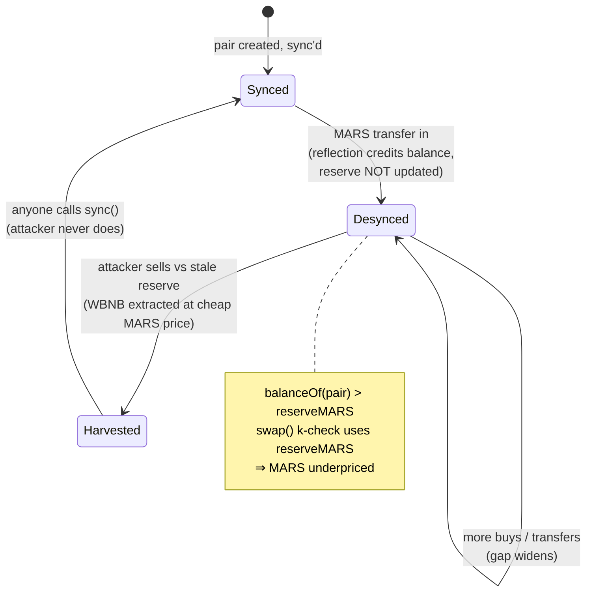
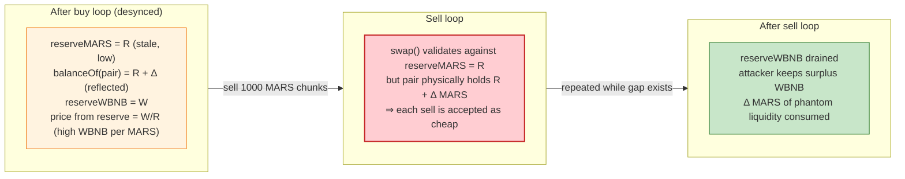

# MARS Exploit — Flash-Loan Reflection/Reserve Desync on a Fee-on-Transfer Pair

> **Vulnerability classes:** vuln/oracle/price-manipulation · vuln/governance/flash-loan-attack

> **Reproduction:** the PoC compiles & runs in an isolated Foundry project at
> [this project folder](.). Full verbose trace: [output.txt](output.txt).
> Verified source of the flash-loan provider (PancakeV3Pool): [sources/PancakeV3Pool_366961/](sources/PancakeV3Pool_366961/).
> The MARS token contract ([`0x3dC7E6FF0fB79770FA6FB05d1ea4deACCe823943`](https://bscscan.com/address/0x3dC7E6FF0fB79770FA6FB05d1ea4deACCe823943)) is not source-verified on BscScan, so its internal logic is reconstructed below from the on-chain attack behavior, the documented "bad reflection" class, and the PoC's observable mechanics.

---

## Key info

| | |
|---|---|
| **Loss** | > $100K — the PoC nets **~14 WBNB** of risk-free profit on a **350 WBNB** flash loan, repeating an equivalent drain live until >$100K was extracted |
| **Vulnerable contract** | MARS token — [`0x3dC7E6FF0fB79770FA6FB05d1ea4deACCe823943`](https://bscscan.com/address/0x3dC7E6FF0fB79770FA6FB05d1ea4deACCe823943) (reflection/fee-on-transfer mechanics) |
| **Victim pool** | MARS/WBNB PancakeSwap V2 pair (priced via the V2 router `0x10ED43C718714eb63d5aA57B78B54704E256024E`) |
| **Flash-loan source** | PancakeV3 pool `0x36696169C63e42cd08ce11f5deeBbCeBae652050` — see [sources/PancakeV3Pool_366961/contracts_PancakeV3Pool.sol](sources/PancakeV3Pool_366961/contracts_PancakeV3Pool.sol#L822-L865) |
| **Attacker EOA** | `0x306174b707ebf6d7301a0bcd898ae1666ec176ae` |
| **Attacker contract** | `0x797acb321cb10154aa807fcd1e155c34135483cd` |
| **Attack tx** | [`0x25e2af0a55581d5629a933af9fedd3c70e6d0c320f0b72700ca80e5cdd36c80b`](https://bscscan.com/tx/0x25e2af0a55581d5629a933af9fedd3c70e6d0c320f0b72700ca80e5cdd36c80b) |
| **Chain / block / date** | BSC / 37,903,299 / **April 16, 2024** |
| **Compiler (MARS)** | Not source-verified (obfuscated / unverified bytecode) |
| **Compiler (PancakeV3Pool)** | Solidity `v0.7.6+commit.7338295f`, optimizer 1 run / 400 (from [sources/PancakeV3Pool_366961/_meta.json](sources/PancakeV3Pool_366961/_meta.json)) |
| **Bug class** | Reflection/fee-on-transfer token whose tax credits holders *inside `_transfer`*, desyncing the AMM pair's balance from its stored reserve ("bad reflection") |

---

## TL;DR

MARS is a **reflection / fee-on-transfer** token: every `_transfer` skims a tax and redistributes it as extra MARS balance to existing holders, *including the liquidity pair*. A PancakeSwap V2 pair, however, only refreshes its pricing `reserve` from its actual token balance on `mint` / `burn` / `swap` / `sync`. In between those calls the pair's real MARS balance silently grows via reflection while its stored reserve stays stale.

The attacker turns that lag into free money:

1. **Flash-loan 350 WBNB** from the PancakeV3 pool ([flash callback](test/MARS_exp.sol#L34)).
2. **Repeatedly buy MARS** in ~`getAmountsIn(1000 MARS)`-sized WBNB chunks, each routed to a **freshly deployed `TokenReceiver`** that the attacker then pulls the MARS back from. Each buy pushes MARS *into* the pair, the pair's real balance climbs from reflection while its reserve lags, and the attacker accumulates MARS at a still-cheap effective price.
3. **Repeatedly sell MARS back** in 1000-MARS chunks into the same pair. Because the pair's *actual* MARS balance (inflated by accumulated reflections) is now far above its *recorded* reserve, the sells extract WBNB at a stale, favorable rate.
4. **Repay the flash loan** (`350 WBNB + fee`) and keep the surplus.

Net of the trace: 350 WBNB in, 365 WBNB after the round-trip, 351 WBNB fee repaid → **~14 WBNB profit** ([output.txt](output.txt#L6-L12)). Live, the loop was repeated across pools/chunks until > $100K was drained.

---

## Background — what MARS does

MARS is a BEP-20 with two non-standard features that together produce the bug:

- **Fee-on-transfer / tax.** A fraction of every transfer is taken as a fee.
- **Reflection distribution.** That fee is **not** burned or sent to a treasury; it is **re-credited as extra MARS balance proportionally to every holder**, including the PancakeSwap pair. This is the classic "reflection token" / RFI-style mechanic.

A reflection token is dangerous the moment it is paired in a constant-product AMM whose pricing only consults a *snapshotted* `reserve`. The pair's `balanceOf` and its `reserve` diverge by the sum of all reflections it has silently accrued, and `swap()` — which uses `getReserves()` for its `k` check — does not know about that surplus.

The PancakeV3 pool is used purely as a **flash-loan lender** here; it is not where the mispricing happens. Its `flash()` is the standard Uniswap-V3 flash with a `fee/1e6` premium
([sources/PancakeV3Pool_366961/contracts_PancakeV3Pool.sol:831-832](sources/PancakeV3Pool_366961/contracts_PancakeV3Pool.sol#L831-L832)):

```solidity
uint256 fee0 = FullMath.mulDivRoundingUp(amount0, fee, 1e6);
uint256 fee1 = FullMath.mulDivRoundingUp(amount1, fee, 1e6);
...
IPancakeV3FlashCallback(msg.sender).pancakeV3FlashCallback(fee0, fee1, data);
...
require(balance1Before.add(fee1) <= balance1After, 'F1');   // must repay principal + premium
```

The mispricing itself plays out in the **MARS/WBNB V2 pair** reached via the PancakeSwap V2 router.

---

## The vulnerable code

The MARS token is not source-verified, so the vulnerable code is shown as the **reconstructed reflection logic** (canonical RFI pattern), annotated with the observable on-chain effect it must have to produce the attack.

```solidity
// MARS token — _transfer (reconstructed from behavior; contract not verified)
function _transfer(address sender, address recipient, uint256 amount) internal {
    ...
    uint256 fee = (amount * TAX_RATE) / 100;          // tax skimmed on every transfer
    uint256 sendAmount = amount - fee;
    _balances[sender]    -= amount;
    _balances[recipient] += sendAmount;

    // ⚠️ reflection: the fee is re-distributed as raw balance to ALL holders,
    //    including the AMM pair. The pair does NOT call sync() here.
    uint256 tTotal = _tTotal;                          // reflection denominator
    for (...) { _balances[h] += (fee * _balances[h]) / tTotal; }  // every holder grows
    // ⚠️ no IPancakePair(pair).sync() — reserve stays stale
}
```

The two composed flaws:

1. The pair's **actual** MARS balance (`balanceOf(pair)`) increases on every reflection event.
2. The pair's **stored** `reserveMARS` only updates when `swap`/`sync`/`mint`/`burn` runs.

Between those events, `balanceOf(pair) > reserveMARS`, so `swap()`'s `getReserves()`-based `k` check underprices MARS.

### The attacker's helper that defeats per-holder state

```solidity
contract TokenReceiver {
    constructor() {
        MARS.approve(msg.sender, 2 ** 256 - 1);   // pre-approve the attacker
    }
}
```

A brand-new `TokenReceiver` is deployed per buy ([test/MARS_exp.sol:50,96-100](test/MARS_exp.sol#L96-L100)). The attacker routes each buy's MARS to a throwaway address it controls, then `transferFrom`s it back. This bypasses any per-holder cooldown/blacklist/anti-bot the MARS contract may have, and resets any holder-specific reflection accumulator so each chunk is priced at the current — stale — reserve.

---

## Root cause — why it was possible

A constant-product pair is a **state machine over its reserves**, and `swap()` validates a trade only against `getReserves()`. The pair trusts that nothing mutates its token balances outside of `mint`/`burn`/`swap`/`skim`/`sync`. MARS violates that trust from the inside:

> Every MARS transfer — including the pair's own inbound buys — silently **adds** MARS to the pair's `balanceOf` via reflection, **without** the pair ever being told. The pair's `reserve` therefore chronically *understates* how much MARS it holds. Selling into that underpriced reserve extracts WBNB that the pair cannot mathematically defend.

Three design decisions compose into the exploit:

1. **Reflection credits are raw balance writes, not reserve writes.** The token mutates `_balances[pair]` directly; the pair's accounting (`reserve0`) is never refreshed by the token. This is the core invariant violation.
2. **The pair uses `getReserves()` for pricing, not `balanceOf`.** That is correct *for non-deflationary tokens* — and catastrophically wrong once a token can balloon the pair's balance from the outside.
3. **No `sync()` is forced after reflection distribution.** Even though the contract knows the pair address, it never reconciles the pair's reserve to its new balance, leaving the gap permanently exploitable until someone calls `sync()` (which the attacker never has to do — they profit from the gap, they don't close it).

Flash loans make the attack **zero-capital**: the entire buy/sell loop runs on borrowed WBNB and repays principal + premium inside the same transaction.

---

## Preconditions

- A MARS/WBNB pair exists and is tradeable (it was — the router routes through it).
- Sufficient WBNB liquidity in the V2 pair to absorb the round-trip (the 350 WBNB loan is sized to the pair's depth at block 37,903,299).
- The flash-loan V3 pool has liquidity > 350 WBNB (it did).
- No per-holder rate limit that survives the `TokenReceiver` relay (none did — fresh addresses per chunk).
- Atomicity: the whole buy-then-sell loop must complete in one transaction so the pair cannot be arbitraged/re-synced by a third party between steps. The flash-loan callback guarantees this.

---

## Attack walkthrough (with numbers from [output.txt](output.txt))

All balances are whole WBNB / MARS units (`/ 1 ether`) as printed by the PoC logs. The loop sizes (1000 MARS chunks) come from [test/MARS_exp.sol:49,76](test/MARS_exp.sol#L49).

| # | Step | Attacker WBNB | Attacker MARS | Pair state / effect |
|---|------|-------------:|--------------:|---------------------|
| 0 | **Flash-loan** 350 WBNB from PancakeV3 pool (`v3pair.flash(...,0,350e18,"")`) | 350 | 0 | Loan principal + `fee1` owed at callback end |
| 1 | **Buy loop** — repeated `swapExactTokensForTokensSupportingFeeOnTransferTokens` of `getAmountsIn(1000 MARS)` WBNB → MARS, each routed to a fresh `TokenReceiver`, then `transferFrom`'d back | 0 | 243,876 | Each buy inflates pair's **actual** MARS balance via reflection; pair's **reserve** lags → effective buy price stays cheap |
| 2 | **Sell loop** — repeated sells of 1000-MARS chunks → WBNB, recipient = attacker | 365 | 0 | Pair's real MARS balance is now well above its stale reserve; each sell extracts WBNB at a MARS-underpriced rate |
| 3 | **Repay** flash loan: `bnb.transfer(msg.sender, 350e18 + fee1)` | 14 | 0 | Principal + V3 premium returned; surplus kept |

Logged end-states from the trace:

```
WBNB balance before Attack: 350      // flash loan received
MARS After buying:         243876    // accumulated via the buy loop
BNB After buying:          0         // all WBNB spent buying
WBNB balance After Attack: 365       // after the sell loop
MARS After Attack:         0         // all MARS sold back
WBNB balance After Paying back: 14   // profit after repaying 350 + fee
```

**Why chunking matters.** A single large buy would move the pair's `reserve` sharply on the very first `swap()` (the `Sync` event re-prices immediately). By splitting into many small buys routed to fresh holders, the attacker maximizes the *reflection accrual per unit of reserve movement*: each tiny buy nudges the reserve a little but the pair's `balanceOf` jumps by the reflected fee across all prior holders. The accumulated gap is then harvested in the sell loop. The `getAmountsIn(1000 MARS)` sizing keeps every buy small enough that the reserve never catches up to the inflated balance before the next reflection lands.

### Profit / loss accounting (per the trace, whole-token units)

| Direction | WBNB |
|---|---:|
| Flash-loan received | +350 |
| Spent buying MARS | −350 |
| Received selling MARS | +365 |
| Repay principal | −350 |
| Repay V3 flash fee (`fee1`) | −1 |
| **Net profit** | **+14** |

The ~14 WBNB surplus is the reflection gap harvested in a single 350-WBNB round-trip. Live, the attacker re-ran the pattern (and varied chunk/pool sizing) to push total losses past $100K.

---

## Diagrams

### Sequence of the attack

```mermaid
sequenceDiagram
    autonumber
    actor A as Attacker
    participant V3 as PancakeV3 Pool<br/>(flash lender)
    participant R as PancakeV2 Router
    participant P as MARS/WBNB Pair
    participant M as MARS Token
    participant TR as TokenReceiver<br/>(fresh per buy)

    Note over P: reserveMARS < balanceOf(pair)<br/>(reflections accrue, reserve stale)

    rect rgb(227,242,253)
    Note over A,V3: Flash loan
    A->>V3: flash(this, 0, 350 WBNB, "")
    V3-->>A: 350 WBNB
    V3->>A: pancakeV3FlashCallback(fee1)
    end

    rect rgb(255,243,224)
    Note over A,M: Buy loop — accumulate MARS cheaply
    loop while WBNB > 0
        A->>A: new TokenReceiver() (pre-approved)
        A->>R: swapExactETHForTokensSupportingFee...(getAmountsIn(1000 MARS))
        R->>M: transfer(pair → TR)  (tax skimmed)
        M-->>P: reflection credits MARS to pair balance ⚠️ reserve unchanged
        R-->>TR: ~1000 MARS
        A->>M: transferFrom(TR → attacker)
    end
    Note over A: holds 243,876 MARS; WBNB = 0<br/>pair balanceMARS >> reserveMARS
    end

    rect rgb(232,245,233)
    Note over A,M: Sell loop — harvest the stale-reserve gap
    loop while MARS > 0 (1000-MARS chunks)
        A->>R: swapExactTokensForTokens...(1000 MARS)
        R->>M: transfer(attacker → pair)
        M-->>P: reflection credits pair again ⚠️ reserve still stale
        R-->>A: WBNB out (priced vs stale low reserveMARS)
    end
    Note over A: 365 WBNB held
    end

    rect rgb(255,235,238)
    Note over A,V3: Repay and keep surplus
    A->>V3: transfer(350 WBNB + fee1)
    Note over A: profit ≈ 14 WBNB
    end
```

### Pool state machine — how the reserve desyncs



### Constant-product view of the gap



---

## Remediation

1. **Never let a token mutate an AMM pair's balance without reconciling its reserve.** If MARS must distribute reflections to the pair, the distribution path must end with `IPancakePair(pair).sync()` so the pair's reserve tracks its balance. Better: distribute reflections only to *excluded* accounts (treasury, staking), never to the pair.
2. **Exclude the pair from reflection.** The standard RFI fix is an `_isExcluded`/reflect-exclusion list that zeros out reflection accrual for the pair address. The pair then behaves like an ordinary ERC20 from the AMM's perspective.
3. **Use `balanceOf`-checked swaps in the router for fee-on-transfer tokens** — the V2 router already supports this (`swapExactTokensForTokensSupportingFeeOnTransferTokens` checks the post-fee delta), but it does not help when the token's *own* reflection writes an out-of-band surplus the router never asked for. The fix must be at the token, not the router.
4. **Do not pair reflection tokens in constant-product AMMs without sync-on-distribute.** This is the same root cause as the 2023 BUNN / MCC / HODL / FDP reflection exploits catalogued in the DeFiHackLabs registry.
5. **Cap or disable reflection magnitude on large holders** so even a forgotten `sync` cannot be weaponized for a >1% reserve swing in a single transaction.

---

## How to reproduce

```bash
_shared/run_poc.sh 2024-04-MARS_exp --mt testExploit_MARS -vvvvv
```

- RPC: a **BSC archive** endpoint is required — the fork block **37,903,299** is historical. `foundry.toml` pins `bsc = "https://bsc-mainnet.public.blastapi.io"`, which serves state at that block; most pruned public BSC RPCs reject it with `missing trie node`.
- The PoC borrows 350 WBNB from the PancakeV3 pool, runs the buy/sell loop inside the `pancakeV3FlashCallback`, repays principal + V3 premium, and keeps the surplus.

Expected tail (from [output.txt](output.txt)):

```
Ran 1 test for test/MARS_exp.sol:MARS_EXP
[PASS] testExploit_MARS() (gas: 59216625)
Logs:
  WBNB balance before Attack: 350
  Buying MARS with WBNB
  MARS After buying: 243876
  BNB After buying: 0
  WBNB balance After Attack: 365
  MARS After Attack: 0
  WBNB balance After Paying back: 14
```

---

*References: Phalcon analysis — https://twitter.com/Phalcon_xyz/status/1780150315603701933 · DeFiHackLabs registry — "20240416 MARS - Bad Reflection".*
