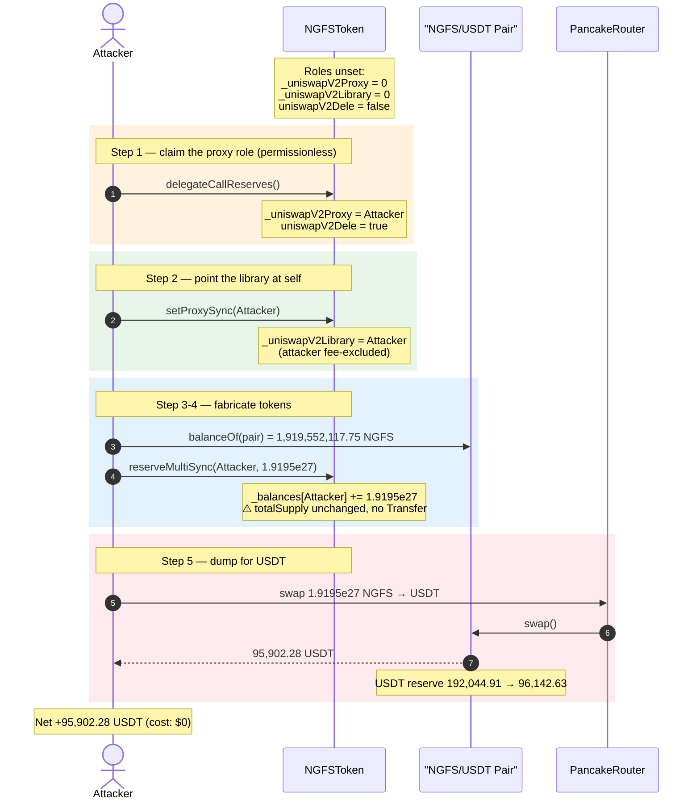
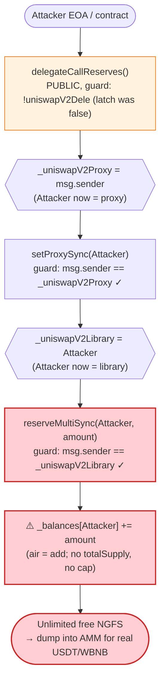
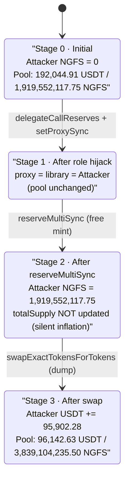

# NGFS (FENGSHOU) Exploit — Permissionless Privilege-Escalation Chain → Unlimited Mint

> **Vulnerability classes:** vuln/access-control/missing-auth · vuln/arithmetic/overflow

> **One-line summary:** Three un-protected "uniswap proxy" helper functions chain into a free
> privilege escalation that lets *anyone* mint arbitrary NGFS tokens to themselves, which the
> attacker then dumped into the PancakeSwap USDT pool for ~$95.9K (≈$190K total across both pools).

> **Reproduction:** the PoC compiles & runs in this isolated Foundry project
> ([this folder](.)). Full verbose trace:
> [output.txt](output.txt). Verified vulnerable source:
> [sources/NGFSToken_a60898/NGFSToken.sol](sources/NGFSToken_a60898/NGFSToken.sol).

---

## Key info

| | |
|---|---|
| **Loss** | ~$95,902 reproduced in this PoC (one USDT-pool drain); ~**$190K total** across the USDT + WBNB pools in the live incident |
| **Vulnerable contract** | `NGFSToken` (FENGSHOU / NGFS) — [`0xa608985f5b40CDf6862bEC775207f84280a91E3A`](https://bscscan.com/address/0xa608985f5b40cdf6862bec775207f84280a91e3a#code) |
| **Victim pool** | NGFS/USDT PancakeSwap pair — `0x687756C50f6B3172E29DF21C2537c37086b679A5` |
| **Attacker EOA** | [`0xd03d360dfc1dac7935e114d564a088077e6754a0`](https://bscscan.com/address/0xd03d360dfc1dac7935e114d564a088077e6754a0) |
| **Attacker contract** | [`0xc73781107d086754314f7720ca14ab8c5ad035e4`](https://bscscan.com/address/0xc73781107d086754314f7720ca14ab8c5ad035e4) |
| **Attack tx** | [`0x8ff764dde572928c353716358e271638fa05af54be69f043df72ad9ad054de25`](https://bscscan.com/tx/0x8ff764dde572928c353716358e271638fa05af54be69f043df72ad9ad054de25) |
| **Chain / block / date** | BSC / 38,167,372 / **2024-04-25** (~09:51 UTC) |
| **Compiler** | Solidity **v0.8.24**, optimizer enabled (200 runs) |
| **Bug class** | Broken access control / privilege escalation → un-collateralized arbitrary mint (`_balances[x] += amount` with no `totalSupply` accounting and an attacker-controllable auth check) |

---

## TL;DR

`NGFSToken` ships three "uniswap proxy" helper functions whose access checks form a **bootstrap
chain that any unprivileged caller can walk**:

1. **`delegateCallReserves()`** ([NGFSToken.sol:485-490](sources/NGFSToken_a60898/NGFSToken.sol#L485-L490))
   is fully permissionless. Its only guard is a one-time latch `uniswapV2Dele`, which was still
   `false`. It sets `_uniswapV2Proxy = msg.sender` — so the attacker becomes the "proxy".
2. **`setProxySync(address)`** ([:413-420](sources/NGFSToken_a60898/NGFSToken.sol#L413-L420)) only
   requires `msg.sender == _uniswapV2Proxy` — now the attacker. It sets
   `_uniswapV2Library = <attacker>`.
3. **`reserveMultiSync(addr, amount)`** ([:521-527](sources/NGFSToken_a60898/NGFSToken.sol#L521-L527))
   only requires `msg.sender == _uniswapV2Library` — now the attacker. It executes
   `_balances[addr] = _balances[addr].air(amount)` where `air(a,b) = a + b`
   ([SafeMath.sol:65-70](sources/NGFSToken_a60898/SafeMath.sol#L65-L70)) — i.e. a **direct credit of
   `amount` tokens with no `totalSupply` increment and no `Transfer` event**.

The attacker minted itself **1,919,552,117.75 NGFS** (exactly equal to the NGFS reserve held by the
USDT pair), then sold the entire bag into the pool via PancakeSwap, walking off with
**95,902.28 USDT** out of the pool's ~192,045 USDT reserve. Starting NGFS cost to the attacker: **0**.

---

## Background — what NGFSToken does

`NGFSToken` ([source](sources/NGFSToken_a60898/NGFSToken.sol)) is a fairly standard
BEP20/`Ownable` fee-on-transfer token (name `FENGSHOU`, symbol `NGFS`, 18 decimals, initial supply
96,000,000,000) with PancakeSwap buy/sell fees and an anti-bot mechanism. Its declared totalSupply
at the time was multiplied by trillions of decimals — the key state is the standard ERC20 ledger:

```solidity
mapping (address => uint256) private _balances;     // NGFSToken.sol:24
uint256 private _totalSupply = 96000000000 * 10 ** 18;  // NGFSToken.sol:30
```

Bolted onto the normal token are a set of *"uniswap proxy / reserve sync"* functions that were
evidently intended to let some off-chain keeper / library contract rebalance reserves. These are the
vulnerable surface. The relevant private state:

```solidity
address private _uniswapV2Proxy;          // NGFSToken.sol:38
IPancakeLibrary private _uniswapV2Library; // NGFSToken.sol:40
bool private uniswapV2Dele = false;        // NGFSToken.sol:65  (one-time latch)
```

None of `_uniswapV2Proxy` / `_uniswapV2Library` / `uniswapV2Dele` is ever initialized in the
constructor or by an `onlyOwner` setter — they default to `address(0)` / `false`, which is precisely
what lets an attacker claim them.

---

## The vulnerable code

### 1. `delegateCallReserves()` — permissionless "become the proxy"

```solidity
function delegateCallReserves() public {
    require(!uniswapV2Dele, "ERC20: delegateCall launch");   // ← only guard: a one-time latch

    _uniswapV2Proxy = _msgSender();   // ⚠️ caller becomes the privileged "proxy"
    uniswapV2Dele = !uniswapV2Dele;   // flips latch to true (single use)
}
```
[NGFSToken.sol:485-490](sources/NGFSToken_a60898/NGFSToken.sol#L485-L490)

There is **no `onlyOwner`, no whitelist, no value check** — anyone who calls this *first* (the latch
was still `false` on-chain) permanently captures the `_uniswapV2Proxy` role.

### 2. `setProxySync(address)` — proxy points the "library" at itself

```solidity
function setProxySync(address _addr) external {
    require(_addr != ZERO, "ERC20: library to the zero address");
    require(_addr != DEAD, "ERC20: library to the dead address");
    require(msg.sender == _uniswapV2Proxy, "ERC20: uniswapPrivileges"); // ← attacker is proxy now

    _uniswapV2Library = IPancakeLibrary(_addr);   // ⚠️ attacker sets library = attacker
    _isExcludedFromFee[_addr] = true;             // bonus: fee exemption
}
```
[NGFSToken.sol:413-420](sources/NGFSToken_a60898/NGFSToken.sol#L413-L420)

### 3. `reserveMultiSync(addr, amount)` — the actual mint

```solidity
function reserveMultiSync(address syncAddr, uint256 syncAmount) public {
    require(_msgSender() == address(_uniswapV2Library), "ERC20: uniswapPrivileges"); // ← attacker = library
    require(syncAddr != address(0), "ERC20: multiSync address is zero");
    require(syncAmount > 0, "ERC20: multiSync amount equal to zero");
    _balances[syncAddr] = _balances[syncAddr].air(syncAmount);   // ⚠️ balance += amount, UNGATED amount
    _isExcludedFromFee[syncAddr] = true;
}
```
[NGFSToken.sol:521-527](sources/NGFSToken_a60898/NGFSToken.sol#L521-L527)

`air()` is just addition under an obfuscated name:

```solidity
function air(uint256 a, uint256 b) internal pure returns (uint256) {
    uint256 c = a + b;
    require(c >= a, "SafeMath: addition overflow");
    return c;
}
```
[SafeMath.sol:65-70](sources/NGFSToken_a60898/SafeMath.sol#L65-L70)

Compare with the *legitimate* mint, which correctly increments `_totalSupply` and emits the canonical
`Transfer(address(0), …)`:

```solidity
function _mint(address account, uint256 amount) internal virtual {
    _beforeTokenTransfer(address(0), account, amount);
    _totalSupply += amount;            // ← supply accounting (missing in reserveMultiSync)
    _balances[account] += amount;
    emit Transfer(address(0), account, amount);
}
```
[NGFSToken.sol:136-141](sources/NGFSToken_a60898/NGFSToken.sol#L136-L141)

`reserveMultiSync` is effectively an **anonymous, unaccounted `_mint` reachable by any caller** via
the two-step proxy hijack above.

---

## Root cause — why it was possible

The protocol tried to build a privileged "reserve sync" subsystem but wired its trust roots to
**uninitialized, attacker-claimable state**:

1. **`delegateCallReserves()` is a permissionless role grant.** It hands the `_uniswapV2Proxy` role to
   whoever calls it first. The one-time `uniswapV2Dele` latch is *not* security — it just means the
   first caller (here, the attacker) wins the race forever. There is no `onlyOwner`, so the intended
   keeper never even got the chance to claim it before the attacker did.
2. **Roles bootstrap each other with no ground-truth check.** `proxy → library → mint`: each link only
   verifies the *previous* attacker-set value, never an owner/governance anchor. Once you own the first
   link you own them all.
3. **The mint primitive has no supply accounting and no cap.** `reserveMultiSync` does
   `_balances[x] += amount` with an arbitrary `amount` and never touches `_totalSupply`. It is an
   unbounded balance fabricator — the only constraint is `amount > 0`.
4. **Fabricated balance is immediately fungible against real liquidity.** The freshly-minted NGFS is a
   normal balance; PancakeSwap prices it from reserves, so the attacker converts $0-cost tokens into the
   pool's USDT 1:1 along the constant-product curve.

The attacker chose `amount = balanceOf(pair)` so that the swap input roughly equaled the pool's NGFS
reserve — that pulls ~50% of the USDT side in a single swap (the standard "input ≈ reserve ⇒ ~half the
opposite reserve out" property of `x·y=k`).

---

## Preconditions

- `delegateCallReserves()` had **never been called** before, so the `uniswapV2Dele` latch was still
  `false` and the `_uniswapV2Proxy` role was unclaimed. (Confirmed on-chain: the trace shows the latch
  flip `uniswapV2Dele: 0 → 1` and `_uniswapV2Proxy` slot going `0 → attacker` during the attack —
  see [output.txt:1554-1558](output.txt#L1554).)
- A live PancakeSwap pool holding real USDT (and WBNB) liquidity against NGFS — ~192,045 USDT in the
  USDT pair at the fork block.
- **No capital required.** The mint costs nothing; the only "input" is the fabricated NGFS. This is not
  even flash-loanable-dependent — it is free.

---

## Attack walkthrough (with on-chain numbers from the trace)

All figures are pulled directly from [output.txt](output.txt) (verbose Foundry trace).
For the NGFS/USDT pair, `token0 = USDT`, `token1 = NGFS`, so `reserve0 = USDT`, `reserve1 = NGFS`.

| # | Step | Call / effect | Concrete numbers |
|---|------|---------------|------------------|
| 0 | **Initial pool state** | `getReserves()` on the pair | USDT reserve **192,044.91**, NGFS reserve **1,919,552,117.75** ([output.txt:1586-1587](output.txt#L1586)) |
| 1 | **Claim proxy role** | `delegateCallReserves()` | `_uniswapV2Proxy = attacker`, latch `0→1` ([output.txt:1554-1558](output.txt#L1554)) |
| 2 | **Point library at self** | `setProxySync(attacker)` | `_uniswapV2Library = attacker`, attacker fee-excluded ([output.txt:1559-1563](output.txt#L1559)) |
| 3 | **Read pool's NGFS balance** | `balanceOf(pair)` | **1,919,552,117.75 NGFS** ([output.txt:1564-1565](output.txt#L1565)) |
| 4 | **Fabricate that exact amount to self** | `reserveMultiSync(attacker, 1.9195e27)` | attacker NGFS balance `0 → 1,919,552,117.75`, **no `totalSupply` change, no Transfer event** ([output.txt:1566-1569](output.txt#L1566)) |
| 5 | **Approve router (max) & dump** | `swapExactTokensForTokensSupportingFeeOnTransferTokens(1.9195e27 NGFS → USDT)` | NGFS in: 1,919,552,117.75; USDT out: **95,902.28** ([output.txt:1602](output.txt#L1602)) |
| 6 | **Result** | attacker USDT balance | before: **26.54 USDT** → delta logged: **+95,902.28 USDT** ([output.txt:1539-1540](output.txt#L1540)) |

**Why one swap pulls ~half the USDT:** PancakeSwap's `getAmountOut` with the 0.25% fee (factor 9975)
gives `out = (in·9975·reserveUSDT) / (reserveNGFS·10000 + in·9975)`. With `in ≈ reserveNGFS`, the
fee-scaled input (`in·9975`) is comparable to the entire scaled NGFS reserve, so `out ≈ 0.4994 ·
reserveUSDT`. The recomputed `getAmountOut` matches the trace to the wei: **95,902,277,184,099,168,468,661
wei** = 95,902.28 USDT.

> In the *live* incident the attacker repeated the same mint-and-dump against **both** the NGFS/USDT
> and the NGFS/WBNB pools, which is how the reported total reached ~$190K. This PoC reproduces the
> USDT-pool leg (~$95.9K) exactly; the WBNB leg is identical in mechanism.

### Profit / loss accounting (this PoC, USDT pool)

| Item | Amount |
|---|---:|
| Attacker NGFS minted (cost) | 1,919,552,117.75 NGFS — **fabricated, $0 cost** |
| USDT extracted from pool | **+95,902.28 USDT** |
| USDT spent | 0 |
| **Net profit (this leg)** | **+95,902.28 USDT** |
| Pool USDT reserve drained | ~50% (192,044.91 → ~96,142.63 remaining, see [output.txt:1597-1598](output.txt#L1598)) |

The drained USDT is real liquidity provided by honest LPs; the attacker paid nothing for the NGFS
that bought it.

---

## Diagrams

### Sequence of the attack



### Privilege-escalation chain inside NGFSToken



### Pool / balance state evolution



---

## Why each magic number

- **`amount = balanceOf(pair) = 1,919,552,117.75 NGFS`** — the attacker mints itself an amount equal
  to the pool's *existing* NGFS reserve. Feeding an input ≈ the existing reserve into a constant-product
  pool extracts ≈ half of the opposite (USDT) reserve in one shot, which is the most a single swap can
  realistically take without absurd slippage. (Bigger inputs hit diminishing returns; this size is the
  efficient choice.)
- **`approve(router, type(uint256).max)`** — standard unlimited approval so the router can pull the
  freshly-minted NGFS.
- **`amountOutMin = 0`** — the attacker doesn't care about slippage protection; there is no front-run
  risk for a single-block, self-contained exploit.

---

## Remediation

1. **Delete the unguarded "proxy/reserve sync" subsystem entirely.** `delegateCallReserves`,
   `setProxySync`, `proxyReserves`, and `reserveMultiSync` are a bespoke privileged surface with no
   legitimate need to be reachable by arbitrary callers. If a keeper truly needs them, they must all be
   `onlyOwner` (or `onlyRole(KEEPER)`), not bootstrapped from uninitialized state.
2. **Never grant a role via a permissionless "claim" function.** `delegateCallReserves()` assigning
   `_uniswapV2Proxy = msg.sender` to the first caller is the root of the chain. Roles must be set by
   governance/owner, ideally behind a timelock — not via a one-time latch that the public can win.
3. **A token must never expose an unaccounted balance writer.** Any function that changes `_balances`
   must go through `_mint`/`_burn`/`_transfer` so that `_totalSupply` stays consistent and `Transfer`
   events are emitted. `reserveMultiSync`'s `_balances[x] += amount` with no supply update is, by
   itself, a critical accounting break even if it were correctly access-controlled.
4. **Cap and audit any "sync"/rebalance primitive.** If reserve adjustments are a real product feature,
   bound the per-call delta, require the source of the tokens to actually hold them, and emit events so
   monitoring can catch anomalies.
5. **Remove obfuscated math aliases.** Hiding `add` behind `air()` (and similar renamed SafeMath
   helpers) serves no purpose except to obscure a mint from a casual reader/reviewer; use the canonical
   library functions.

---

## How to reproduce

The PoC was extracted into a standalone Foundry project (the umbrella DeFiHackLabs repo has many
unrelated PoCs that do not compile together under one `forge build`):

```bash
_shared/run_poc.sh 2024-04-NGFS_exp -vvvvv
```

- RPC: a **BSC archive** endpoint is required (fork block 38,167,372 is historical). `foundry.toml`
  uses `https://bsc-mainnet.public.blastapi.io`, which serves state at that block; most pruned public
  RPCs fail with `header not found` / `missing trie node`.
- Result: `[PASS] testExploit()` with the attacker's USDT balance jumping from 26.54 → +95,902.28.

Expected tail:

```
Ran 1 test for test/NGFS_exp.sol:NGFS
[PASS] testExploit() (gas: 211651)
Logs:
  Attacker USDT Balance Before exploit: 26.542161622221038197
  Attacker USDT Balance After exploit: 95902.277184099168468661

Suite result: ok. 1 passed; 0 failed; 0 skipped
```

---

*References:*
- *Post-mortem: https://louistsai.vercel.app/p/2024-04-25-ngfs-exploit/*
- *CertiK Alert: https://twitter.com/CertiKAlert/status/1783476515331616847*
- *PoC source: [test/NGFS_exp.sol](test/NGFS_exp.sol)*
