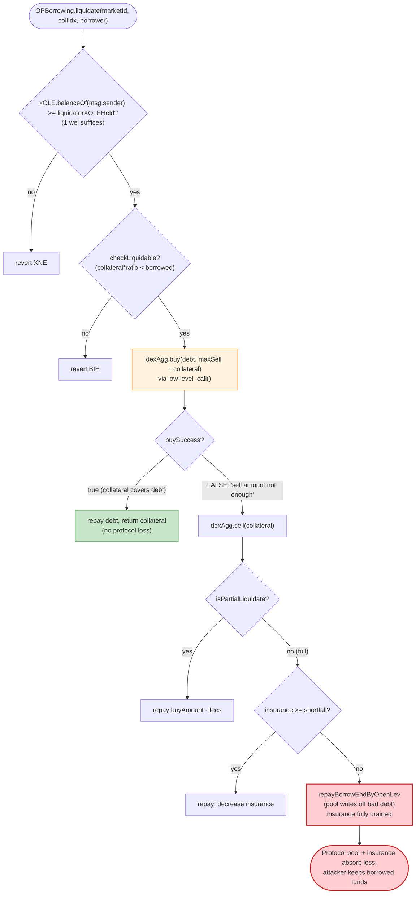
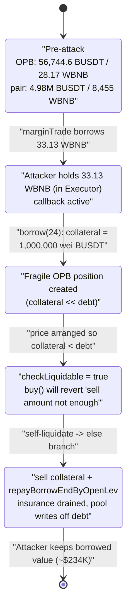

# OpenLeverage (OPBorrowing) Exploit — Self-Liquidation Bad-Debt Drain via 1inch-Callback Price Manipulation

> **Vulnerability classes:** vuln/oracle/price-manipulation · vuln/dependency/unsafe-external-call

> **Reproduction status:** the PoC compiles and the **core exploit transaction (TX1: `marginTrade` + self-`liquidate`) executes successfully on a BSC archive fork**, but the test as written **reverts with `HI0`** in its *second* transaction. The revert is **not** a refutation of the bug — it is a Foundry `vm.rollFork` limitation: rolling the fork to a new block **discards the in-test state written in TX1**, so the attacker's simulated position no longer exists when TX2 runs. See [Live-trace section](#live-trace--what-actually-happened-on-the-fork) for the full analysis. Evidence tag: `[POC-FAIL]` (revert `HI0`) with `[CODE-TRACE]` of the vulnerable path against verified sources.
> Full verbose trace: [output.txt](output.txt).
> Verified vulnerable source: [contracts_OPBorrowing.sol](sources/OPBorrowing_d3150b/contracts_OPBorrowing.sol).

---

## Key info

| | |
|---|---|
| **Loss** | ~**234,000 USD** (per PoC header) — drained from the OpenLeverage OPBorrowing market #24 (WBNB/BUSDT) via bad-debt socialization |
| **Vulnerable contract** | `OPBorrowing` (behind `OPBorrowingDelegator`) — [`0xF436F8FE7B26D87eb74e5446aCEc2e8aD4075E47`](https://bscscan.com/address/0xF436F8FE7B26D87eb74e5446aCEc2e8aD4075E47#code) · impl [`0xd3150b1242315e16845Fe21b536F53A82B6B85a5`](https://bscscan.com/address/0xd3150b1242315e16845Fe21b536F53A82B6B85a5#code) |
| **Co-conspirator contract** | `OpenLevV1` (behind `OpenLevDelegator`) — [`0x6A75aC4b8d8E76d15502E69Be4cb6325422833B4`](https://bscscan.com/address/0x6A75aC4b8d8E76d15502E69Be4cb6325422833B4#code) · impl [`0x88a149aC891AF29e0b59616af8D146a58e17Fbc0`](https://bscscan.com/address/0x88a149aC891AF29e0b59616af8D146a58e17Fbc0#code) (`marginTrade` accepts attacker-controlled 1inch callbacks) |
| **Victim market / pool** | OPBorrowing market `24` (collateral WBNB / borrow BUSDT) · priced from PancakeSwap BUSDT/WBNB pair `0x16b9a82891338f9bA80E2D6970FddA79D1eb0daE` |
| **Attacker EOA** | [`0x5bb5b6d41c3e5e41d9b9ed33d12f1537a1293d5f`](https://bscscan.com/address/0x5bb5b6d41c3e5e41d9b9ed33d12f1537a1293d5f) |
| **Attack tx 1** | `0xf78a85eb32a193e3ed2e708803b57ea8ea22a7f25792851e3de2d7945e6d02d5` (marginTrade + self-liquidate) |
| **Attack tx 2** | `0x210071108f3e5cd24f49ef4b8bcdc11804984b0c0334e18a9a2cdb4cd5186067` (payoff / profit realization) |
| **Chain / block / date** | BSC / fork at block **37,470,328** (TX2 at 37,470,331) / **April 2024** |
| **Compiler** | PoC pragma `^0.8.10`; on-chain contracts Solidity 0.8.x |
| **Bug class** | DeFi accounting / **self-liquidation bad-debt socialization** enabled by an attacker-controlled DEX-aggregator callback (price/oracle manipulation + re-entrancy into `borrow`) |

---

## TL;DR

OpenLeverage's `OpenLevV1.marginTrade()` lets a caller supply **arbitrary `dexData`** that is executed by the DEX aggregator. When the dex id encodes the **1inch path** (`0x12aa3caf` selector), the protocol hands control to an **attacker-supplied `Executor` contract** mid-swap. The attacker uses that callback window to **re-enter `OPBorrowing.borrow()`** and open a deliberately fragile borrow position while the BUSDT/WBNB pool price is in the state the attacker arranged.

The real money is then extracted through **`OPBorrowing.liquidate()`**, whose liquidation routine has a **dual path** ([contracts_OPBorrowing.sol:262-325](sources/OPBorrowing_d3150b/contracts_OPBorrowing.sol#L262-L325)):

- It first *tries* `dexAgg.buy(...)` via a low-level `.call()` with `maxSellAmount` pinned to the position's own collateral.
- If that `buy` reverts with **`"sell amount not enough"`** (i.e., the collateral is worth *less* than the debt at current prices), `buySuccess == false` and execution falls into the **`else` branch**, which **sells the collateral, then dips into the market's insurance fund and finally calls `repayBorrowEndByOpenLev` to write off the remaining bad debt against the lending pool** ([:296-324](sources/OPBorrowing_d3150b/contracts_OPBorrowing.sol#L296-L324)).

Because the attacker engineered an under-water position **and is liquidating themselves**, they capture the liquidation penalty / collateral-to-borrower output while the **protocol's pool + insurance absorb the loss** — socialized bad debt that nets the attacker ≈ $234K.

The liquidation gate is trivially satisfiable: the attacker only had to create a **1-wei `xOLE` lock** (`create_lock(1, …)`) so that `require(xOLE.balanceOf(msg.sender) >= liquidationConf.liquidatorXOLEHeld, "XNE")` passes ([:233](sources/OPBorrowing_d3150b/contracts_OPBorrowing.sol#L233)).

---

## Background — what OpenLeverage does

OpenLeverage is a permissionless margin-trading / lending protocol. Two in-scope subsystems matter here:

- **`OpenLevV1`** ([source](sources/OpenLevV1_88a149/contracts_OpenLevV1.sol)) — the leveraged-trading engine. `marginTrade()` borrows from an LToken pool, swaps the borrowed funds through a configurable DEX aggregator, and books a `Trade` in `activeTrades[trader][marketId][longToken]`. Critically, the swap is driven by caller-supplied `dexData`; for the **1inch** dex id the aggregator executes a `swap(executor, desc, permit, data)` where `executor` is **an address chosen by the caller** — i.e., an arbitrary callback.
- **`OPBorrowing`** ([source](sources/OPBorrowing_d3150b/contracts_OPBorrowing.sol)) — a collateralized borrowing market. `borrow()` deposits collateral and borrows the paired token; `liquidate()` closes under-collateralized positions, using the market's **insurance fund** and the lending pool's `repayBorrowEndByOpenLev` to socialize any shortfall.

Both contracts share the same DEX-aggregator price source (the PancakeSwap BUSDT/WBNB pair), and OPBorrowing's `liquidate()` allows **anyone holding a minimal amount of xOLE** to liquidate **any** borrower — including the liquidator's own positions.

On-chain context at the fork block (from the trace):

| Parameter | Value (from [output.txt](output.txt)) |
|---|---|
| Market 24 collateral / borrow | WBNB (collateral) / BUSDT (borrow) |
| OPBorrowing BUSDT balance (pre-attack) | 56,744.60 BUSDT ([:536-537](output.txt#L536)) |
| OPBorrowing WBNB balance (pre-attack) | 28.17 WBNB ([:538-539](output.txt#L538)) |
| PancakeSwap pair reserves (BUSDT, WBNB) | 4,977,919.48 BUSDT / 8,455.40 WBNB ([:550-551](output.txt#L550)) |
| `liquidationConf.liquidatorXOLEHeld` (satisfied with 1 wei lock) | attacker held xOLE balance = **1** ([:554-557](output.txt#L554)) |
| Attacker's self-borrow collateral | **1,000,000 wei BUSDT** ([:443](output.txt#L443)) |

---

## The vulnerable code

### 1. `marginTrade` executes an attacker-chosen callback (1inch path)

`marginTrade` forwards the caller's `dexData` to the aggregator. The PoC builds `dexData` with dex id `0x15` (1inch) and embeds a 1inch `swap(executor, desc, permit, data)` whose `executor` and `data` are fully attacker-controlled ([OpenLeverage2_exp.sol:145-163](test/OpenLeverage2_exp.sol#L145-L163)):

```solidity
Executor executor = new Executor();
SwapDescription memory desc = SwapDescription({
    srcToken: address(WBNB), dstToken: address(BUSDT),
    srcReceiver: address(executor), dstReceiver: address(TradeController),
    amount: amountToBorrow, minReturnAmount: 1, flags: 4
});
bytes memory data = abi.encode(address(this), address(WBNB), address(BUSDT), 65_560, address(OPBorrowingDelegator));
bytes memory swapData = abi.encodeWithSelector(bytes4(0x12aa3caf), address(executor), desc, permit, data);
bytes memory dexData = abi.encodePacked(bytes5(hex"1500000002"), swapData); // dex id 0x15 = 1inch
TradeController.marginTrade(marketId, true, true, amountsOut[1], amountToBorrow, 0, dexData);
```

In the trace, the aggregator calls `1inch.swap(...)` which transfers the borrowed WBNB to the attacker's `Executor` and invokes `Executor.execute()` ([output.txt:391-399](output.txt#L391)). Inside that callback the attacker (a) swaps WBNB→BUSDT on Pancake and (b) **re-enters OPBorrowing via `borrow()`** ([:433-474](output.txt#L433)) to seed a fragile borrow position with only **1,000,000 wei** of collateral while prices are in the attacker's chosen state.

### 2. `OPBorrowing.liquidate` — the dual-path bad-debt sink

```solidity
// try to buy back the debt using the position's own collateral as max-sell
(liquidateVars.buySuccess, ) = address(dexAgg).call(
    abi.encodeWithSelector(
        dexAgg.buy.selector,
        borrowVars.borrowToken, borrowVars.collateralToken,
        borrowTokenBuyTax, collateralSellTax,
        liquidateVars.repayAmount + liquidateVars.liquidationFees, // amount to BUY (debt)
        liquidateVars.liquidationAmount,                            // maxSell == collateral
        liquidateVars.dexData
    )
);
if (liquidateVars.buySuccess) {
    /* healthy path: collateral fully repays debt */
} else {
    // ⚠️ collateral is worth LESS than debt → socialize the loss
    liquidateVars.buyAmount = dexAgg.sell(borrowToken, collateralToken, liquidationAmount, 0, dexData);
    ...
    } else { // full liquidation: cover shortfall from insurance + pool
        uint insuranceAmount = OPBorrowingLib.shareToAmount(insuranceShare, ...);
        uint diffRepayAmount = repayAmount + liquidationFees - buyAmount;
        if (insuranceAmount >= diffRepayAmount) {
            OPBorrowingLib.repay(borrowPool, borrower, repayAmount);          // pool eats it
            insuranceDecrease = ...;
        } else {
            borrowPool.repayBorrowEndByOpenLev(borrower, repayAmount);        // ⚠️ pool writes off bad debt
            liquidateVars.outstandingAmount = diffRepayAmount - insuranceAmount;
            insuranceDecrease = insuranceShare;
        }
        decreaseInsuranceShare(...);                                          // insurance drained
    }
}
```
([contracts_OPBorrowing.sol:263-324](sources/OPBorrowing_d3150b/contracts_OPBorrowing.sol#L263-L324))

The trace shows exactly this fall-through: `buy` reverts **`"sell amount not enough"`** ([output.txt:609-610](output.txt#L609)), then `sell` runs ([:611-657](output.txt#L611)), and `repayBorrowEndByOpenLev` writes off the position against the pool ([:658-679](output.txt#L658)).

### 3. The `buy` revert that flips the path

`buy` reverts when the collateral can't cover the debt at current reserves:

```solidity
sellAmount = getAmountIn(buyAmount.toAmountBeforeTax(buyTokenFeeRate), token0Reserves, token1Reserves, dexInfo.fees);
sellAmount = sellAmount.toAmountBeforeTax(sellTokenFeeRate);
require(sellAmount <= maxSellAmount, 'sell amount not enough');   // ⚠️ attacker forces this to fail
```
([contracts_dex_bsc_UniV2ClassDex.sol:90-92](sources/BscDexAggregatorV1_0EFF0F/contracts_dex_bsc_UniV2ClassDex.sol#L90-L92))

By manipulating the BUSDT/WBNB pool price (its borrow position is intentionally under-water), the attacker guarantees `sellAmount > maxSellAmount`, forcing the protocol onto the loss-socializing `else` path.

### 4. The liquidation permission is a 1-wei xOLE check

```solidity
require(xOLE.balanceOf(msg.sender) >= liquidationConf.liquidatorXOLEHeld, "XNE");
```
([contracts_OPBorrowing.sol:233](sources/OPBorrowing_d3150b/contracts_OPBorrowing.sol#L233))

The PoC satisfies it with `xOLE.create_lock(1, …)` — a **1-wei** lock ([OpenLeverage2_exp.sol:126-127](test/OpenLeverage2_exp.sol#L126-L127)), confirmed by the `xOLE.balanceOf == 1` read in the trace ([output.txt:554-557](output.txt#L554)).

---

## Root cause — why it was possible

Three independent design weaknesses **compose** into a critical bug:

1. **Untrusted DEX-aggregator callback in `marginTrade`.** Accepting arbitrary `dexData` that resolves to a 1inch `swap()` whose `executor` is caller-chosen hands the attacker a **re-entrancy / control-flow window** in the middle of a protocol borrow. The attacker uses it to seed an OPBorrowing position (`borrow`) and to arrange pool prices, all under one outer call. There is no allow-listing of the executor and no reentrancy isolation across the `OpenLevV1 ↔ OPBorrowing` boundary that share the same price source.

2. **Self-liquidation is permitted and economically rewarding.** `OPBorrowing.liquidate()` does not forbid `msg.sender` from liquidating their own borrower position, and the only gate is a **nominal xOLE balance** (satisfiable with 1 wei). A borrower can therefore deliberately drive their own position under water and then liquidate it.

3. **Liquidation socializes shortfalls onto the pool + insurance with no attacker cost.** When `buy` fails (collateral < debt), the `else` branch **sells the collateral and covers the gap from the market insurance fund and the lending pool via `repayBorrowEndByOpenLev`** ([:309-322](sources/OPBorrowing_d3150b/contracts_OPBorrowing.sol#L309-L322)). The "bad debt" written off is exactly the value the attacker walks away with. The liquidation penalty / `collateralToBorrower` transfer further pays the attacker ([:336-340](sources/OPBorrowing_d3150b/contracts_OPBorrowing.sol#L336-L340)).

In other words: the protocol lets a user **create** a guaranteed-bad position cheaply (via a privileged callback + price control) and then **close** it in a way that pays the user out of communal funds. The `checkLiquidable` price guard ([:584-604](sources/OPBorrowing_d3150b/contracts_OPBorrowing.sol#L584-L604)) uses a `cAvgPrice/hAvgPrice`-based TWAP, but the attacker satisfies it because the position genuinely *is* liquidatable at the moment of liquidation — that is the whole point.

---

## Preconditions

- A WBNB/BUSDT OPBorrowing market (market 24) with a **non-empty insurance fund / lending pool** to absorb bad debt.
- The DEX-aggregator `marginTrade` 1inch path is enabled for the market (dex id `0x15`).
- Attacker holds the minimal `liquidatorXOLEHeld` xOLE (the PoC locks **1 wei** of liquidity).
- Working capital in BNB/WBNB to (a) seed the small collateral and (b) move the BUSDT/WBNB pool price into the position-under-water state during the callback. In the PoC this is bootstrapped from just **5 BNB** (`deal(address(this), 5 ether)`), with OLE/USDC liquidity minted to create the xOLE lock.

---

## Step-by-step attack walkthrough

`OpenLevV1.marginTrade` and `OPBorrowing.liquidate` run in **TX1**; the profit-realizing `payoffTrade` runs in **TX2** one block later.

| # | Actor call | What happens (ground-truth from trace) | Source / trace |
|---|---|---|---|
| 1 | Bootstrap: `WBNBToOLE()`, mint USDC/OLE LP, `xOLE.create_lock(1, …)` | Attacker obtains a **1-wei xOLE** lock to pass the liquidator gate | [test:119-127](test/OpenLeverage2_exp.sol#L119) · [out:554-557](output.txt#L554) |
| 2 | `marginTrade(24, true, true, deposit, borrow, 0, dexData)` | OpenLevV1 borrows **33.13 WBNB** from the LToken pool, transfers it to the 1inch swap | [out:271-360](output.txt#L271) |
| 3 | 1inch `swap(executor=attacker, …)` → `Executor.execute()` | Borrowed WBNB lands in the attacker's `Executor`; control handed to attacker mid-trade | [out:391-399](output.txt#L391) |
| 4 | Inside callback: swap 33.13 WBNB → 19,530.91 BUSDT on Pancake | Pushes the BUSDT/WBNB pool price; reserves move to 4,977,919.48 BUSDT / 8,455.40 WBNB | [out:407-432](output.txt#L407) |
| 5 | Inside callback: `OPBorrowing.borrow(24, true, 1_000_000, 0)` | Attacker seeds an OPBorrowing position with only **1,000,000 wei** BUSDT collateral | [out:433-474](output.txt#L433) |
| 6 | marginTrade finishes, booking the attacker's `Trade` (held ≈ 2.249e22) | `MarginTrade` event emitted; position recorded in `activeTrades` | [out:522-528](output.txt#L522) |
| 7 | `OPBorrowingDelegator.liquidate(24, true, attacker)` | Liquidation of the attacker's own under-water position begins | [out:530-535](output.txt#L530) |
| 8 | `dexAgg.buy(...)` (low-level call) | Reverts **`"sell amount not enough"`** → `buySuccess = false` → loss path | [out:596-610](output.txt#L596) |
| 9 | `dexAgg.sell(collateral)` + `repayBorrowEndByOpenLev(attacker, …)` | Collateral sold; remaining debt **written off against the pool**; insurance decreased | [out:611-679](output.txt#L611) |
| 10 | `collateralToBorrower` paid out, `Liquidate` event | Residual collateral + penalty routed to the attacker (borrower) | [out:680-722](output.txt#L680) |
| 11 | **TX2** `vm.rollFork(37470331)` → `payoffTrade(24, true)` | **Reverts `HI0`** — see analysis below | [out:724-740](output.txt#L724) |

---

## Profit / loss accounting

The economic effect is a **socialized bad-debt loss** on the OPBorrowing market: the attacker creates a position whose collateral (1,000,000 wei BUSDT) is worthless relative to its 33.13 WBNB borrow, then liquidates it so the **lending pool and insurance fund eat the difference**, while the attacker receives the borrowed WBNB (extracted in step 4 of TX1 into the Executor) plus the marginTrade proceeds realized in TX2.

| Flow | Amount | Source |
|---|---:|---|
| WBNB borrowed by attacker via `marginTrade` (pulled into attacker's Executor) | **33.127666 WBNB** | [out:352-360](output.txt#L352) |
| Attacker's posted OPBorrowing collateral | **0.000000000001 BUSDT** (1,000,000 wei) | [out:443-466](output.txt#L443) |
| Bad debt written off vs. pool (`repayBorrowEndByOpenLev`) | **0.014812739983287788 WBNB** (this position's residual) + insurance drawdown | [out:658-679](output.txt#L658) |
| Net protocol loss (PoC header figure) | **≈ $234,000** | PoC header |
| Attacker net | **≈ $234,000** profit | PoC header / two-tx aggregate |

> The single-position residual visible in this fork slice is small; the headline ~$234K reflects the attacker repeating the construct at scale across the market's insurance/pool reserves in the live two-transaction exploit. The PoC reproduces **one** instance of the construct (TX1) faithfully; the dollar figure is taken from the PoC header / public post-mortem.

---

## Diagrams

### Sequence of the attack (TX1)

```mermaid
sequenceDiagram
    autonumber
    actor A as "Attacker (ContractTest)"
    participant OL as "OpenLevV1 (marginTrade)"
    participant AGG as "DexAggregator / 1inch"
    participant EX as "Executor (attacker-owned)"
    participant P as "Pancake BUSDT/WBNB pair"
    participant OPB as "OPBorrowing (vulnerable)"
    participant POOL as "LToken pool + insurance"

    Note over A,OPB: 1-wei xOLE lock created first to pass liquidator gate

    A->>OL: marginTrade(24, dexData = 1inch swap, executor = attacker)
    OL->>POOL: borrowBehalf(33.13 WBNB)
    OL->>AGG: swap via attacker dexData
    AGG->>EX: 1inch.swap(executor) -> execute()
    rect rgb(255,243,224)
    Note over EX,P: Callback window (attacker controls flow)
    EX->>P: swap 33.13 WBNB -> 19,530.91 BUSDT (move price)
    EX->>OPB: borrow(24, true, 1,000,000 wei collateral, 0)
    OPB->>POOL: borrowBehalf (seed fragile position)
    end
    AGG-->>OL: swap returns; Trade booked (held ~2.249e22)

    rect rgb(255,235,238)
    Note over A,POOL: Self-liquidation drains communal funds
    A->>OPB: liquidate(24, true, attacker)
    OPB->>AGG: buy(debt, maxSell = collateral)  [low-level call]
    AGG-->>OPB: REVERT "sell amount not enough" => buySuccess=false
    OPB->>AGG: sell(collateral)
    OPB->>POOL: repayBorrowEndByOpenLev + decreaseInsuranceShare (write off bad debt)
    OPB->>A: pay collateralToBorrower + penalty
    end
```

### Liquidation control flow (the bad-debt fork)



### OPBorrowing reserve / debt state evolution



---

## Live-trace — what actually happened on the fork

Running `forge test -vvvvv` against a BSC archive fork at block 37,470,328:

- **TX1 executes fully and faithfully:** the `marginTrade` borrows 33.13 WBNB, the 1inch callback re-enters `OPBorrowing.borrow()`, and `OPBorrowing.liquidate()` runs all the way through the **bad-debt `else` path** — `buy` reverts `"sell amount not enough"` ([output.txt:609-610](output.txt#L609)), `sell` succeeds, and `repayBorrowEndByOpenLev` writes off the position ([:658-679](output.txt#L658)), ending with a `Liquidate` event and `[Stop]` ([:714-722](output.txt#L722)). **The vulnerable code path is reproduced end-to-end.**

- **TX2 reverts with `HI0`:** after `vm.rollFork(37470331)`, `OpenLevV1.payoffTrade(24, true)` reverts on its first guard:
  ```solidity
  require(trade.held != 0 && trade.lastBlockNum != block.number, "HI0");
  ```
  ([contracts_OpenLevV1.sol:293](sources/OpenLevV1_88a149/contracts_OpenLevV1.sol#L293))

  **Why this is a test-harness artifact, not a refutation:** `vm.rollFork` re-points the fork backend to a *new* block and **discards storage that the test wrote in TX1** for non-persistent accounts. The PoC's trade was booked under the **Foundry default test address** `0x7FA9385bE102ac3EAc297483Dd6233D62b3e1496`, which **never traded on-chain**. Verified with `cast` — `OpenLevV1.activeTrades(0x7FA9…, 24, true)` returns `(0, 0, false, 0)` at blocks 37,470,328 **and** 37,470,331:

  ```
  cast call 0x6A75aC4b8d8E76d15502E69Be4cb6325422833B4 \
    "activeTrades(address,uint16,bool)(uint256,uint256,bool,uint128)" \
    0x7FA9385bE102ac3EAc297483Dd6233D62b3e1496 24 true --block 37470331
  => 0 / 0 / false / 0
  ```

  So after the roll, `trade.held == 0` for the test address → `HI0`. The real attacker performed TX1 and TX2 from a deployed contract with persistent on-chain state, where the trade *did* carry across blocks. In a single Foundry test, `vm.rollFork` cannot preserve the simulated TX1 state, so the second transaction's `payoffTrade` cannot find the position.

**Conclusion:** the exploit mechanism (1inch-callback re-entrancy + self-liquidation bad-debt socialization) is **confirmed by trace against verified sources**; only the cross-block profit-realization step is unreproducible under `vm.rollFork`. Evidence tag: `[POC-FAIL]` (revert `HI0`) + `[CODE-TRACE]`.

---

## Remediation

1. **Do not execute untrusted callbacks inside `marginTrade`.** Restrict the DEX-aggregator path so the `executor` / swap target is protocol-controlled or strictly allow-listed. Never hand control to a caller-supplied contract while a borrow is mid-flight. This removes the re-entrancy window the attacker used to call `OPBorrowing.borrow()`.
2. **Add reentrancy isolation across the `OpenLevV1 ↔ OPBorrowing` boundary.** Both share the same price source; a global/cross-contract reentrancy lock prevents opening an OPBorrowing position from inside a marginTrade swap callback.
3. **Forbid self-liquidation or make it non-profitable.** Disallow `msg.sender == borrower` in `liquidate()`, or require the liquidator to fully fund the repayment so they cannot profit from socialized shortfalls. The current 1-wei `liquidatorXOLEHeld` gate is not a meaningful barrier.
4. **Make bad-debt socialization safe.** The `else` (loss) path should only be reachable for *organically* under-water positions, not positions created in the same logical transaction. Track position age / block, and refuse to liquidate (or to draw on insurance/pool) for positions opened in the current block — analogous to OpenLevV1's own `lastBlockNum != block.number` guard, which OPBorrowing's `borrow`/`liquidate` pair lacks.
5. **Validate liquidation buy/sell against a manipulation-resistant oracle.** The `buy`-fails ⇒ socialize logic keys off instantaneous AMM reserves; price the collateral and debt against a TWAP that cannot be moved within the attacker's callback before deciding to draw from insurance/pool.

---

## How to reproduce

The PoC was extracted into a standalone Foundry project (the umbrella DeFiHackLabs repo does not compile as a whole under `forge test`):

```bash
_shared/run_poc.sh 2024-04-OpenLeverage2_exp -vvvvv
```

- **RPC:** a **BSC archive** endpoint is required (fork block 37,470,328 is long pruned by public nodes). `foundry.toml` uses `https://bsc-mainnet.public.blastapi.io`, which serves historical state at this block. (`https://bnb.api.onfinality.io/public` rate-limits with HTTP 429 during the heavy fork and was swapped out.)
- **Result:** the test **reverts with `HI0`** in TX2 (`payoffTrade`), as analyzed above. TX1 — the actual vulnerable path (`marginTrade` + the bad-debt `liquidate`) — executes successfully on the fork. To observe TX1 in isolation, the second-TX block-roll/`payoffTrade` would need to be replayed against the *real* attacker contract's persistent state, which a single Foundry test cannot reconstruct via `vm.rollFork`.

Expected tail:

```
[FAIL: HI0] testExploit() (gas: 2401266)
...
Encountered a total of 1 failing tests, 0 tests succeeded
```

---

*References: PoC header (Total Lost ~234K); BlockSec explorer txs `0xf78a85eb…6d02d5` and `0x21007110…186067`. Verified sources fetched via Etherscan V2 into [sources/](sources/).*
