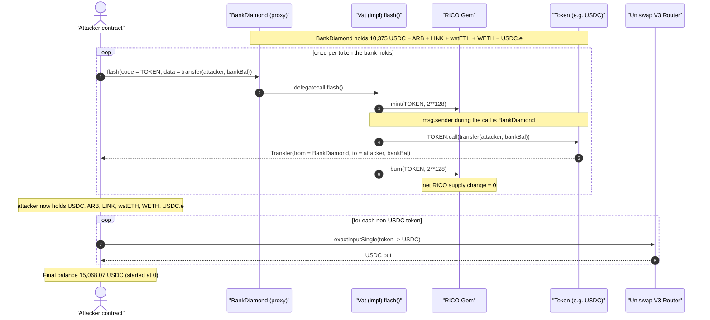
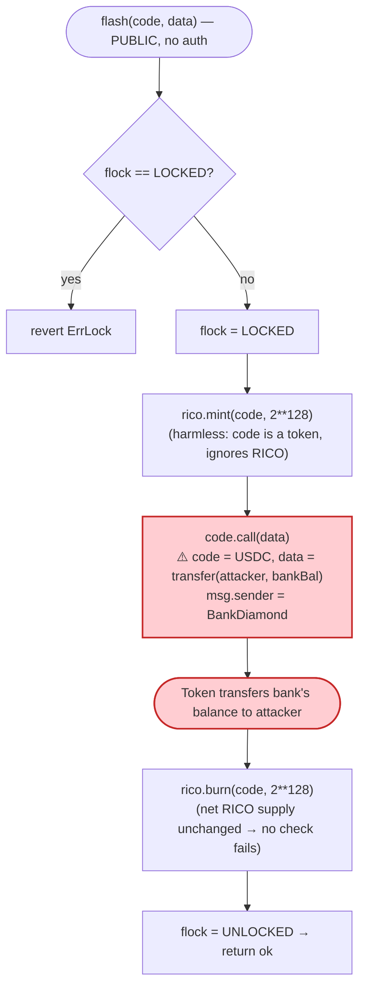

# Rico / Ricobank Exploit — Arbitrary-Target `flash()` Drains the Bank's Reserves

> **Reproduction:** the PoC compiles & runs in an isolated Foundry project at
> [this project folder](.) (the umbrella DeFiHackLabs repo contains many unrelated
> PoCs that do not compile under a whole-project build, so this one was extracted).
> Full verbose trace: [output.txt](output.txt).
> Verified vulnerable source: [src_vat.sol](sources/Vat_c6D7b3/src_vat.sol).

---

## Key info

| | |
|---|---|
| **Loss** | ~$36K — every token the `BankDiamond` held was drained (10,375.58 USDC + 2,478.24 ARB + 69.67 LINK + 0.2666 wstETH + 0.2872 WETH + 300 USDC.e), netting the attacker **15,068.07 USDC** after swapping everything to USDC |
| **Vulnerable contract** | `Vat` implementation — [`0xc6D7b37FE18A3Dd007F9b1C3b339B8c6043b3ccf`](https://arbiscan.io/address/0xc6D7b37FE18A3Dd007F9b1C3b339B8c6043b3ccf#code), reached through the `BankDiamond` proxy [`0x598C6c1cd9459F882530FC9D7dA438CB74C6CB3b`](https://arbiscan.io/address/0x598C6c1cd9459F882530FC9D7dA438CB74C6CB3b#code) |
| **Victim** | The Ricobank `BankDiamond` (`0x598C…CB3b`) and its token reserves |
| **Attacker EOA** | [`0xc91cb089084f0126458a1938b794aa73b9f9189d`](https://arbiscan.io/address/0xc91cb089084f0126458a1938b794aa73b9f9189d) |
| **Attacker contract** | [`0x68d843d31de072390d41bff30b0076bef0482d8f`](https://arbiscan.io/address/0x68d843d31de072390d41bff30b0076bef0482d8f) |
| **Attack tx** | [`0x5d2a94785d95a740ec5f778e79ff014c880bcefec70d1a7c2440e611f84713d6`](https://arbiscan.io/tx/0x5d2a94785d95a740ec5f778e79ff014c880bcefec70d1a7c2440e611f84713d6) |
| **Chain / fork block / date** | Arbitrum One / 202,973,712 / April 2024 |
| **Compiler** | Solidity v0.8.19+commit.7dd6d404, optimizer **10,000 runs** |
| **Bug class** | Arbitrary external call (confused-deputy) — flash-mint callback uses the borrower address as the *call target* with attacker-controlled calldata |

---

## TL;DR

Ricobank's flash-loan entry point, `Vat.flash(address code, bytes calldata data)`
([src_vat.sol:286-300](sources/Vat_c6D7b3/src_vat.sol#L286-L300)), does:

```solidity
getBankStorage().rico.mint(code, _MINT);   // mint 2**128 RICO to `code`
(ok, result) = code.call(data);            // ⚠️ call `code` with attacker's `data`
getBankStorage().rico.burn(code, _MINT);   // burn it back
```

The borrower address `code` is **both** the recipient of the flash-minted RICO
**and the address that gets `.call`-ed with arbitrary `data`**. Because the
function runs inside the `BankDiamond` proxy, that low-level call is made with
`msg.sender == BankDiamond`. So an attacker simply sets:

- `code = USDC` (any token the bank holds), and
- `data = abi.encode(transfer(attacker, bankBalance))`.

The token contract sees a `transfer` from the bank itself and dutifully hands the
bank's entire balance to the attacker. The mint/burn of `2**128` RICO to the token
address is irrelevant — tokens don't react to receiving RICO, and the burn at the
end leaves the RICO supply unchanged, so the only validity check the function makes
(`flash` doesn't even check solvency) is satisfied trivially.

The attacker repeated this once per token the bank held (USDC, ARB, LINK, wstETH,
WETH, USDC.e), swept everything into its own wallet, then swapped each token to
USDC on Uniswap V3, walking away with **15,068.07 USDC**.

---

## Background — what Ricobank is

Ricobank is an over-collateralized CDP stablecoin protocol (RICO is the stable, RISK
the governance/backstop token). Its on-chain logic is deployed behind a
SolidState **Diamond** proxy named `BankDiamond`
([_meta.json](sources/BankDiamond_598C6c/_meta.json) →
`implementation: 0xc6d7b37f…3ccf`), which routes calls to facet/implementation
contracts. The relevant facet here is `Vat`
([src_vat.sol](sources/Vat_c6D7b3/src_vat.sol)), the CDP database, which inherits
`Bank` ([src_bank.sol](sources/Vat_c6D7b3/src_bank.sol)).

`Vat` exposes a `flash()` function intended to let integrators borrow up to
`_MINT = 2**128` RICO within a single transaction, do something with it, and repay
by transaction end. The pattern — *lock → mint → call borrower → burn → unlock* —
is a normal flash-mint design. The bug is purely in **who** gets called and **with
what**.

On-chain facts at the fork block (read directly in the trace via
`balanceOf(BankDiamond)`):

| Token | BankDiamond balance | Source line |
|---|---:|---|
| USDC (native, `0xaf88…5831`) | 10,375.584869 | [output.txt:23](output.txt#L23) |
| ARB (`0x912C…6548`) | 2,478.235540754361715555 | [output.txt:53](output.txt#L53) |
| LINK (`0xf97f…9FB4`) | 69.669705859926416088 | [output.txt:83](output.txt#L83) |
| wstETH (`0x5979…0529`) | 0.266618989782460718 | [output.txt:113](output.txt#L113) |
| WETH (`0x82aF…Bab1`) | 0.287173939050505854 | [output.txt:141](output.txt#L141) |
| USDC.e (`0xFF97…5CC8`) | 300.000000 | [output.txt:169](output.txt#L169) |

These were protocol fees / surplus reserves the bank had accumulated. They were not
RICO and not collateral locked in CDPs — but `flash()` doesn't care what token it is
told to call.

---

## The vulnerable code

### `Vat.flash` — borrower address is used as the call target

[src_vat.sol:284-300](sources/Vat_c6D7b3/src_vat.sol#L284-L300):

```solidity
// flash borrow
// locked with itself to avoid flashing more than MINT
function flash(address code, bytes calldata data)
  external payable returns (bytes memory result) {
    // lock->mint->call->burn->unlock
    VatStorage storage vs = getVatStorage();
    if (vs.flock == LOCKED) revert ErrLock();
    vs.flock = LOCKED;

    getBankStorage().rico.mint(code, _MINT);   // (1) mint 2**128 RICO to `code`
    bool ok;
    (ok, result) = code.call(data);            // (2) ⚠️ CALL `code` WITH `data`
    if (!ok) bubble(result);
    getBankStorage().rico.burn(code, _MINT);   // (3) burn 2**128 RICO back from `code`

    vs.flock = UNLOCKED;
}
```

`_MINT` is `2 ** 128` ([src_vat.sol:49](sources/Vat_c6D7b3/src_vat.sol#L49)).

The intended use is: `code` is the *borrower's callback contract*, and `data` is the
callback selector. The minted RICO lands in the callback, the callback does its
business, and the RICO is burned back at the end. The `flock` re-entrancy guard
([src_vat.sol:290-291](sources/Vat_c6D7b3/src_vat.sol#L290-L299)) only prevents
nested `flash()` calls — it does nothing to constrain *what* is called.

The flaw is that **`code` is attacker-chosen and is the call target**. Nothing
checks that `code` is a registered/trusted callback, and the call carries
`msg.sender == BankDiamond`. So if `code` is a real ERC-20 and `data` is a
`transfer`/`transferFrom`, the bank becomes the unwitting authorizer.

### Why no solvency check stops it

Other CDP-manipulation functions are wrapped in `_lock_` and re-check urn safety
([frob](sources/Vat_c6D7b3/src_vat.sol#L126-L196),
[bail](sources/Vat_c6D7b3/src_vat.sol#L201-L243)). `flash()` deliberately has *no*
post-call accounting check — it relies entirely on the `mint(_MINT)` /
`burn(_MINT)` round-trip netting to zero. Since the attacker's `data` never touches
RICO, the burn always succeeds, and the function returns cleanly with the bank's
*other* tokens already gone.

---

## Root cause — why it was possible

This is a textbook **confused-deputy / arbitrary external call**:

> A privileged contract (the bank) makes a low-level `call` to an
> **attacker-supplied address** with **attacker-supplied calldata**, using the
> bank's own authority (`msg.sender = bank`).

The design intended `code` to be the borrower's *own* contract, so that any tokens
moved by the callback would be moving the *borrower's* assets (the freshly minted
RICO). The implementation never enforces that `code` is the borrower or any trusted
party. Concretely, three decisions compose into a critical bug:

1. **No allow-list / type restriction on `code`.** Any address — including a token
   contract — can be the call target. A flash-loan callback target should be a
   contract the *caller* controls, verified e.g. by passing `msg.sender` separately
   and requiring the callback to a known interface; here it is unconstrained.
2. **Arbitrary `data`.** The bank forwards opaque calldata, so the attacker can
   encode `transfer(attacker, …)` / `transferFrom(victim, attacker, …)`.
3. **The call inherits the bank's authority.** `msg.sender` during `code.call(data)`
   is the `BankDiamond`, so every token the bank holds — and every allowance other
   users granted *to the bank* — is spendable by the attacker.

Point 3 also enabled a second drain vector the PoC includes: stealing tokens via
**existing allowances to the bank**. `_getTransferFromData`
([Rico_exp.sol:80-86](test/Rico_exp.sol#L80-L86)) checks
`allowance(user, BankDiamond)` and, if a user had approved the bank, encodes a
`transferFrom(user, attacker, …)`. In the live block only the bank's own balances
were drainable (the allowance holders had 0 spare balance — see the
`balanceOf(BankDiamond)==0` reads at [output.txt:195-218](output.txt#L195-L218)),
so the `transferFrom` paths were skipped, but the capability is real and far more
dangerous in general: anyone who ever approved the bank could have been drained.

---

## Preconditions

- The bank holds (or has spendable allowances to) any ERC-20 — true for any live
  protocol that accrues fees/surplus.
- `flash()` is publicly callable with no access control — true
  ([src_vat.sol:286](sources/Vat_c6D7b3/src_vat.sol#L286)).
- No capital required: the attack moves the *bank's* tokens, not the attacker's.
  The flash-minted RICO is incidental and burned back. The whole exploit is a single
  atomic transaction.

---

## Attack walkthrough (with on-chain numbers from the trace)

The attacker calls `BankDiamond.flash(token, data)` once per token, where
`data = transfer(attacker, bankBalanceOf(token))`. Each call delegates into the
`Vat` implementation ([output.txt:25-26](output.txt#L25-L26)), mints `2**128` RICO to
the *token contract*, calls `token.transfer(attacker, balance)` as the bank, then
burns the RICO back.

| # | Step | Token | Amount drained | Trace |
|---|------|-------|---------------:|-------|
| 0 | `flash(USDC, transfer(attacker, 10375584869))` — mint 2¹²⁸ RICO to USDC, `USDC.transfer(attacker, …)` as bank, burn 2¹²⁸ RICO | USDC | 10,375.584869 | [L25-L50](output.txt#L25-L50) |
| 1 | `flash(ARB, …)` | ARB | 2,478.235540754361715555 | [L55-L78](output.txt#L55-L78) |
| 2 | `flash(LINK, …)` | LINK | 69.669705859926416088 | [L85-L110](output.txt#L85-L110) |
| 3 | `flash(wstETH, …)` | wstETH | 0.266618989782460718 | [L115-L138](output.txt#L115-L138) |
| 4 | `flash(WETH, …)` | WETH | 0.287173939050505854 | [L143-L166](output.txt#L143-L166) |
| 5 | `flash(USDC.e, …)` | USDC.e | 300.000000 | [L171-L194](output.txt#L171-L194) |
| 6 | `transferFromOwner(...)` allowance-drain attempts — bank's spare balances were 0, so skipped | — | 0 | [L195-L218](output.txt#L195-L218) |
| 7 | Swap ARB → USDC on UniV3 (3000 fee) | ARB→USDC | +2,792.982688 | [L230-L270](output.txt#L230-L270) |
| 8 | Swap LINK → USDC | LINK→USDC | +974.896474 | [L286-L332](output.txt#L286-L332) |
| 9 | Swap wstETH → USDC | wstETH→USDC | +1.604543 | [L344-L380](output.txt#L344-L380) |
| 10 | Swap WETH → USDC | WETH→USDC | +872.150727 | [L392-L428](output.txt#L392-L428) |
| 11 | Swap USDC.e → USDC | USDC.e→USDC | +50.848707 | [L440-L495](output.txt#L440-L495) |
| 12 | **Final attacker USDC balance** | — | **15,068.068008** | [L496-L500](output.txt#L496-L500) |

The single mechanical proof that the bug works is the `Transfer` event inside each
flash: e.g. [output.txt:35](output.txt#L35) —
`Transfer(from: 0x598C…CB3b (BankDiamond), to: Rico (attacker), value: 10,375.584869 USDC)`
— a transfer **from the bank** that the attacker never had any prior right to.

### Profit accounting (everything converted to USDC)

| Asset drained | Native amount | USDC realized |
|---|---:|---:|
| USDC (native) | 10,375.584869 | 10,375.584869 |
| ARB | 2,478.235541 | 2,792.982688 |
| LINK | 69.669706 | 974.896474 |
| wstETH | 0.266619 | 1.604543 |
| WETH | 0.287174 | 872.150727 |
| USDC.e | 300.000000 | 50.848707 |
| **Total** | — | **15,068.068008** |

(The wstETH and USDC.e legs realized far less than their face value because the
attacker dumped them through thin Uniswap V3 pools at heavy slippage — but the
tokens were stolen for free, so any recovery is pure profit.) Attacker USDC went
from **0** ([output.txt:7](output.txt#L7)) to **15,068.068008**
([output.txt:7](output.txt#L7) / [output.txt:498](output.txt#L498)).

---

## Diagrams

### Sequence of the attack



### How `flash()` is weaponized



### Intended vs. actual control flow

```mermaid
stateDiagram-v2
    direction LR
    [*] --> Intended
    [*] --> Actual

    state Intended {
        I1: "code = borrower's own contract"
        I2: "RICO minted to borrower"
        I3: "callback moves borrower's RICO"
        I4: "RICO burned back"
        I1 --> I2 --> I3 --> I4
    }

    state Actual {
        A1: "code = victim TOKEN address"
        A2: "RICO minted to token (ignored)"
        A3: "bank calls token.transfer(attacker, bankBal)"
        A4: "RICO burned back (net zero)"
        A1 --> A2 --> A3 --> A4
        note right of A3
            msg.sender = BankDiamond
            so the bank authorizes
            theft of its own reserves
        end note
    }
```

---

## Remediation

1. **Never let the caller choose the call target.** A flash-mint callback must call a
   contract the *caller* designates as its own callback and that is verified — e.g.
   require the borrower implement a known interface (`onFlashLoan(...)`/EIP-3156) and
   call `msg.sender`, not an arbitrary `code` argument. The borrower can then do its
   own internal routing without the bank ever holding the steering wheel.
2. **If an arbitrary target must be supported, sandbox the authority.** Route the
   borrowed RICO and the callback through a throwaway, allowance-less executor so the
   call can never spend the bank's reserves or third-party allowances granted to the
   bank.
3. **Block calls to token contracts / known infrastructure.** At minimum, reject
   `code` values equal to the bank, the RICO gem, registered collateral tokens, or
   any address the bank holds a balance in.
4. **Add a post-call invariant.** `flash()` performs no solvency/balance check after
   the call. Snapshot the bank's token balances (and critical accounting) before the
   call and assert they are unchanged (modulo the RICO round-trip) afterward; revert
   otherwise.
5. **Minimize standing reserves & allowances.** Do not let the bank passively hold
   fee tokens or accept open-ended approvals; sweep surplus to a separate treasury
   that the flash path cannot reach.

---

## How to reproduce

The PoC was extracted into a standalone Foundry project (the umbrella DeFiHackLabs
repo has many unrelated PoCs that fail to compile under `forge test`'s whole-project
build):

```bash
_shared/run_poc.sh 2024-04-Rico_exp --mt testExploit -vvvvv
```

- RPC: an **Arbitrum archive** endpoint is required (fork block 202,973,712). The
  project's `foundry.toml` defines the `arbitrum` alias used by
  `vm.createSelectFork("arbitrum", 202973712)` ([Rico_exp.sol:39](test/Rico_exp.sol#L39)).
  Most pruned public RPCs will fail with `header not found` / `missing trie node`.
- Result: `[PASS] testExploit()`; attacker USDC balance goes from **0** to
  **15,068.068008**.

Expected tail ([output.txt:3-7](output.txt#L3-L7), [output.txt:498-505](output.txt#L498-L505)):

```
Ran 1 test for test/Rico_exp.sol:Rico
[PASS] testExploit() (gas: 1269595)
Logs:
  Attacker USDC Balance Before exploit: 0.000000
  Attacker USDC Balance After exploit: 15068.068008

Suite result: ok. 1 passed; 0 failed; 0 skipped; finished in 40.89s
```

---

*Reference: DeFiHackLabs — Rico (Ricobank), Arbitrum, ~$36K. Post-mortem thread:
https://twitter.com/0xlouistsai/status/1781845191047164016*
