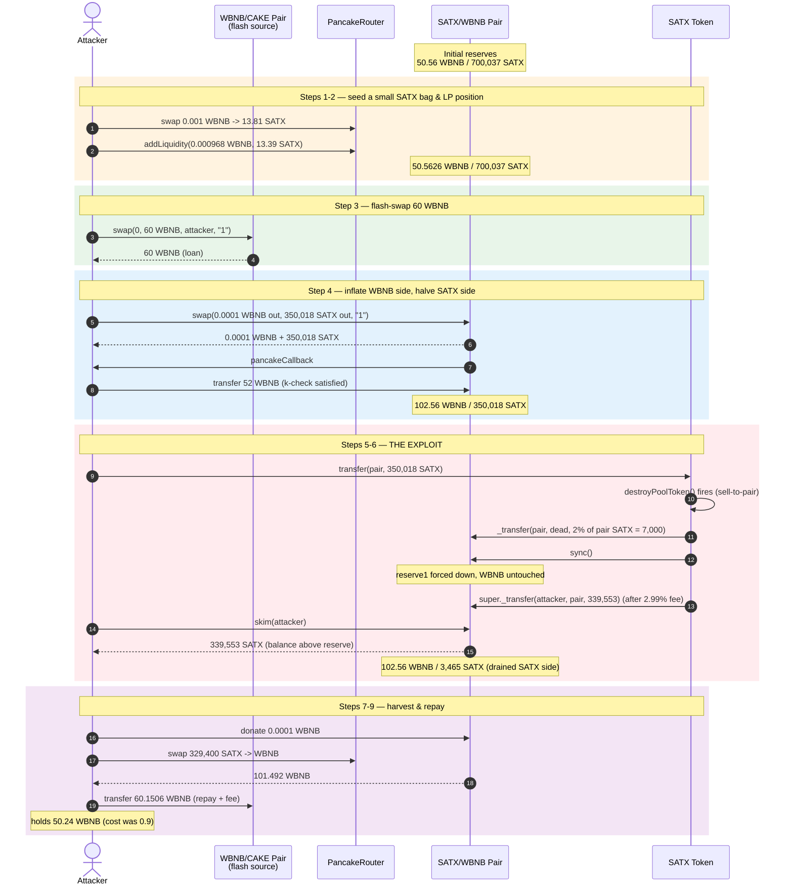
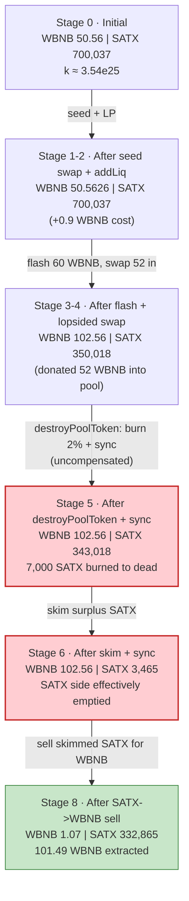
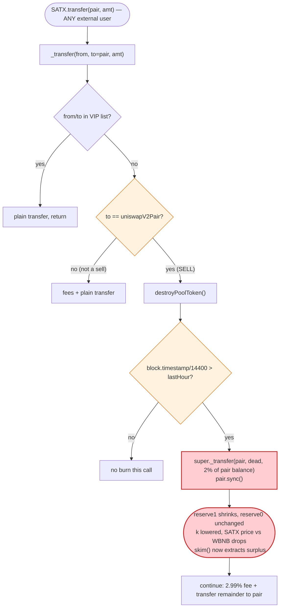
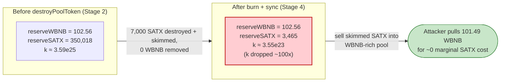

# SATX Exploit — Permissionless `destroyPoolToken()` Reserve Manipulation + `skim()` Drain

> **Reproduction:** the PoC compiles & runs in an isolated Foundry project at
> [this project folder](.) (the umbrella DeFiHackLabs repo
> has many unrelated PoCs that do not whole-compile, so this one was extracted).
> Full verbose trace: [output.txt](output.txt).
> Verified vulnerable source: [SATX.sol](sources/SATX_Fd80a4/SATX.sol).

---

## Key info

| | |
|---|---|
| **Loss** | **~49.34 WBNB** (≈ **$28K** at the time) drained from the SATX/WBNB PancakeSwap pair |
| **Vulnerable contract** | `SATX` token — [`0xFd80a436dA2F4f4C42a5dBFA397064CfEB7D9508`](https://bscscan.com/address/0xFd80a436dA2F4f4C42a5dBFA397064CfEB7D9508#code) |
| **Victim pool** | SATX/WBNB pair — `0x927d7adF1Bcee0Fa1da868d2d43417Ca7c6577D4` (token0 = WBNB, token1 = SATX) |
| **Flash-loan source** | WBNB/CAKE pair — `0x0eD7e52944161450477ee417DE9Cd3a859b14fD0` (PancakeSwap flash-swap) |
| **Attacker EOA** | `0xBEF24B94C205999ea17d2ae4941cE849C9114bfd` |
| **Attacker contract** | `0x9C63d6328C8e989c99b8e01DE6825e998778B103` |
| **Attack tx** | [`0x7e02ee7242a672fb84458d12198fae4122d7029ba64f3673e7800d811a8de93f`](https://bscscan.com/tx/0x7e02ee7242a672fb84458d12198fae4122d7029ba64f3673e7800d811a8de93f) |
| **Chain / block / date** | BSC / 37,914,434 / **April 16, 2024** (block timestamp 1,713,283,732 UTC) |
| **Compiler** | Solidity `v0.8.18`, optimizer **1 run, 200 runs** |
| **Bug class** | Broken AMM invariant via a permissionless, un-compensated reserve-shrink burn inside `_transfer` |

> Note: the PoC header comment claims "Total Lost: ~999M US$". That figure is the
> attacker's *self-reported* nominal token value (SATX mark-to-pool at the
> manipulated price); the **real** on-chain loss to the pool is the ~49.34 WBNB
> the attacker walked away with, recovered from the `Sync`/`Swap`/`Transfer`
> events in [output.txt](output.txt).

---

## TL;DR

`SATX` is a tax/deflation token whose `_transfer` override calls `destroyPoolToken()`
([SATX.sol:949-957](sources/SATX_Fd80a4/SATX.sol#L949-L957)) **every time any holder
transfers SATX *to* the liquidity pair** (`_isPairs[to]` branch,
[:1016-1018](sources/SATX_Fd80a4/SATX.sol#L1016-L1018)). `destroyPoolToken()` unconditionally
**moves 2% of the pair's current SATX balance to the dead address and then calls
`pair.sync()`** — it deletes SATX from the pair's reserves with **no matching WBNB
outflow**, and re-prices the pair to accept that deletion as the new reserve.

Worse, the trigger is **permissionless and timing-cheap**: any user sending SATX into
the pair trips it, and `lastHour` advances on a 4-hour wall-clock grid
(`daySecond = 4 * 3600`), so an attacker who waits one tick can fire it on demand right
after positioning the pool.

The attacker:

1. **Flash-swaps 60 WBNB** out of the WBNB/CAKE pair (PancakeSwap flash-swap callback).
2. Inside the callback, **abuses `pair.swap()` + `skim()`** to first inflate the pair's
   WBNB reserve (by sending 52 WBNB to "repay" a deliberately lopsided swap) while
   pulling half the SATX reserve out, then triggers a **transfer-to-pair** that fires
   `destroyPoolToken()` — shrinking the SATX reserve without shrinking WBNB.
3. **`skim()`s the resulting excess SATX** back out of the pair (the pair's real balance
   now sits above its freshly-shrunk reserve).
4. **Sells the skimmed SATX back into the now-mispriced pair** for WBNB, then repays the
   60.15 WBNB flash debt.

Net: the attacker spends **0.9 WBNB** of its own and leaves with **~50.24 WBNB**, a
**profit of ~49.34 WBNB** taken directly from the pool's honest WBNB liquidity.

---

## Background — what SATX does

`SATX` ([source](sources/SATX_Fd80a4/SATX.sol)) is a vanilla ERC-20 with the usual
"fair-launch + reflection + deflation" paraphernalia bolted onto `_transfer`:

- **Tax on every trade.** Both the buy (`_isPairs[from]`) and sell (`_isPairs[to]`)
  paths skim **2.99%** to the token contract and then a few wei to three rotating
  "invite" addresses (`_takeInviterFeeKt`, [:1077-1086](sources/SATX_Fd80a4/SATX.sol#L1077-L1086)).
- **`swapAndLiquify`.** If the contract's SATX balance exceeds `pairBalance / 400`
  and someone is selling to the pair, half the contract balance is auto-swapped for
  WBNB and re-added as liquidity ([:1064-1073](sources/SATX_Fd80a4/SATX.sol#L1064-L1073)).
- **`destroyPoolToken()` — the bug.** On every sell-to-pair (and only there),
  `destroyPoolToken()` is invoked ([:1018](sources/SATX_Fd80a4/SATX.sol#L1018)). Once per
  4-hour window it **transfers 2% of the pair's SATX balance to the dead address and
  `sync()`s the pair** ([:949-957](sources/SATX_Fd80a4/SATX.sol#L949-L957)).

The relevant on-chain state at the fork block (37,914,434), read from the trace:

| Parameter | Value |
|---|---|
| `daySecond` | `4 * 3600` = **4 hours** |
| Pool token0 / token1 | **WBNB** / SATX (so `reserve0 = WBNB`, `reserve1 = SATX`) |
| `reserve0` (WBNB) | **50.5606 WBNB** ← the prize |
| `reserve1` (SATX) | **700,037.5 SATX** (7.000375e23, 10-decimals) |
| `lastHour` | `block.timestamp / 14400` = **118,977** (the burn fires once 118,978 is reached) |

The whole exploit hinges on three properties of `destroyPoolToken()`:
**(a)** it is reached from any external user's sell-to-pair; **(b)** it *burns the
pair's own tokens* (a value transfer away from LPs) rather than the contract's own
balance; **(c)** it `sync()`s the pair immediately afterward, so the pair "accepts"
the reduced SATX reserve as truth while its WBNB reserve is untouched.

---

## The vulnerable code

### 1. `destroyPoolToken()` — un-compensated pool reserve shrink + `sync()`

```solidity
uint256 public lastHour;
function destroyPoolToken() private {
    uint256 nowHour = block.timestamp.div(daySecond);     // daySecond = 4 * 3600
    if(nowHour > lastHour){
        lastHour = nowHour;
        uint256 haveAmount = super.balanceOf(uniswapV2Pair);
        super._transfer(uniswapV2Pair, _deadAddress, haveAmount.div(100).mul(2)); // ⚠️ 2% of PAIR balance → dead
        IUniswapV2Pair(uniswapV2Pair).sync();             // ⚠️ pair re-prices with shrunken reserve1
    }
}
```
([SATX.sol:948-957](sources/SATX_Fd80a4/SATX.sol#L948-L957))

`super._transfer(pair, dead, …)` **moves SATX out of the pair's balance**, then
`pair.sync()` writes `balanceOf` back into `reserve0/1`. Net effect: `reserve1`
(SATX) drops by 2% with **zero change to `reserve0` (WBNB)**. The constant-product
invariant `k = reserve0 * reserve1` is silently lowered and the marginal price of
SATX in WBNB drops — for whoever triggers it.

### 2. It is reachable on every external sell-to-pair

```solidity
}else{
    if(_isPairs[from]){                                   // buy path
        require(startTime < block.timestamp,"startTime");
        super._transfer(from, address(this), amount.div(10000).mul(299));
        amount = amount.div(10000).mul(9701);
        _takeInviterFeeKt(amount.div(1000000));
    }else if(_isPairs[to]){                               // sell path ← attacker enters here
        require(startTime < block.timestamp,"startTime");
        destroyPoolToken();                               // ⚠️ side effect on the pool's own reserves
        super._transfer(from, address(this), amount.div(10000).mul(299));
        amount = amount.div(10000).mul(9701);
        _takeInviterFeeKt(amount.div(1000000));
    }
}
super._transfer(from, to, amount);
```
([SATX.sol:1010-1024](sources/SATX_Fd80a4/SATX.sol#L1010-L1024))

There is **no access control** on this path — `_isPairs[to]` is true for the one
canonical pair and the caller is whoever invokes `SATX.transfer(pair, …)`. The only
gate is the 4-hour `lastHour` tick, which the attacker satisfies simply by choosing
a block whose `timestamp / 14400` exceeds the stored `lastHour`.

### 3. `balanceOf` does not protect the pair

```solidity
function balanceOf(address account) public override view returns(uint256){
    if(account == uniswapV2Pair){
        uint256 amount = super.balanceOf(account);
        require(amount > 0);
        return amount;
    }
    return super.balanceOf(account);
}
```
([SATX.sol:930-937](sources/SATX_Fd80a4/SATX.sol#L930-L937))

The pair's SATX balance is readable and, crucially, the pair exposes `skim()` —
which lets anyone withdraw the **excess** of a token balance above the stored reserve.
Because `destroyPoolToken()` lowers the *reserve* below the *balance* (it burns then
syncs in the wrong order relative to incoming transfers), `skim()` becomes the
attacker's extraction handle.

---

## Root cause — why it was possible

A Uniswap-V2/PancakeSwap pair prices assets purely from `reserve0/1` and only enforces
`x·y ≥ k` inside `swap()`. `sync()` exists to let the pair adopt `balanceOf` as its
reserve — it trusts that balances move only through `mint`/`burn`/`swap`/ordinary
transfers the pair can reason about.

`destroyPoolToken()` breaks that trust in exactly the way the pair cannot defend
against:

> It **destroys SATX held by the pair** (`_transfer(pair → dead, 2%)`) and then calls
> `pair.sync()`, telling the pair "your SATX reserve is now 2% smaller." No WBNB leaves
> the pair. The product `k` is reduced **and** the SATX-side reserve is reduced, so
> for everyone who still holds SATX the implied WBNB-per-SATX price is whatever the
> attacker just engineered.

The four design decisions that compose into a critical bug:

1. **The "deflation" targets the pool's balance, not the contract's own.**
   `super.balanceOf(uniswapV2Pair)` is the source of the burn. Removing SATX from LPs
   without removing WBNB is a direct value transfer *away* from the pool's WBNB backing.
2. **`sync()` immediately after the burn locks the manipulation in.** The pair now
   believes its SATX reserve is 2% lower while WBNB is unchanged — so the next swap
   prices SATX against a stale, attacker-favorable curve.
3. **The trigger is any sell-to-pair, callable by anyone.** No keeper, no role, no
   `onlyOwner`. The attacker picks the exact instant to fire it, right after inflating
   the WBNB side and skimming the SATX side.
4. **`skim()` converts the manipulation into a withdrawal.** Once `destroyPoolToken()`
   has shrunk `reserve1` below `balance1` (the incoming transfer raises the balance
   after the burn), `skim()` lets the attacker reclaim the surplus SATX for free —
   which is then sold into the WBNB-rich, SATX-poor pair.

This is the same class of bug as a token that `sync()`s after a `_burn(pair, …)`:
**un-compensated single-sided reserve removal.** The novelty here is that it is dressed
up as a "pool cleanup" and gated on a cheap wall-clock tick rather than on ownership.

---

## Preconditions

- A working SATX/WBNB pair with non-trivial WBNB liquidity (here ≈ 50.56 WBNB).
- `block.timestamp / 14400 > lastHour` so `destroyPoolToken()` actually fires on the
  attacker's transfer. In the live attack the natural block timestamp (1,713,283,732)
  already yields `nowHour = 118,978 > lastHour = 118,977` — no warping needed; the PoC
  reproduces this from the forked state directly.
- A flash-loanable source of WBNB to inflate the pool's WBNB side and satisfy the
  `swap()` k-check cheaply. The attacker used the WBNB/CAKE pair's flash-swap for 60 WBNB.
- Tiny seed capital (the PoC uses **0.9 WBNB**) to bootstrap the initial SATX holding
  and add a dust LP position so the token's `_isAddLiquidity`/`_isDelLiquidity` checks
  do not flag the subsequent operations.

---

## Attack walkthrough (with on-chain numbers from the trace)

The pair is `token0 = WBNB`, `token1 = SATX`, so `reserve0 = WBNB`, `reserve1 = SATX`.
All figures below are taken directly from the `Sync` / `Swap` / `Transfer` events in
[output.txt](output.txt). SATX uses 10 decimals; WBNB uses 18.

| # | Step | reserve0 (WBNB) | reserve1 (SATX) | Effect |
|---|------|----------------:|----------------:|--------|
| 0 | **Initial** | 50.5606 | 700,037.5 | Honest pool. |
| 1 | **Seed swap** — `0.001 WBNB → 13.81 SATX` (legit router swap, fees skimmed to token contract) | 50.5616 | 700,023.7 | Attacker obtains a small SATX bag. |
| 2 | **Add liquidity** — `0.000968 WBNB + 13.39 SATX` minted as LP | 50.5626 | 700,037.1 | Pair now "knows" the attacker as an LP; subsequent calls won't trip `_isDelLiquidity`'s bot branch. |
| 3 | **Flash-swap 60 WBNB** from WBNB/CAKE pair (callback `pancakeCall`) | — | — | Attacker has 60 WBNB to spend intra-tx, must repay ≈ 60.1506 WBNB. |
| 4 | **Lopsided `pair.swap(0.0001 WBNB out, 350,018.6 SATX out)`** with `data="1"` (triggers attacker callback). In the callback the attacker sends **52 WBNB** to the pair (`else if msg.sender == pair_WBNB_SATX`). Pair's k-check passes against the *new* balances. | **102.5625** | **350,018.6** | WBNB reserve inflated ~2× (donated 52 WBNB), SATX reserve halved — but both via the legitimate swap path, so no invariant violation *yet*. |
| 5 | **`SATX.transfer(pair, 350,018.6)`** — sell-to-pair. Inside `_transfer`, `destroyPoolToken()` fires: burns **2% of pair SATX = 7,000.37 SATX → dead**, then `pair.sync()`. Transfer fees take 2.99%, so 339,553 SATX actually lands in the pair. | 102.5625 | **343,018.2** (post burn/sync), then balance climbs to 682,571.2 as the 339,553 arrives | ⚠️ **Invariant broken**: reserve1 was forced down while reserve0 (WBNB) is untouched. |
| 6 | **`pair.skim(attacker)`** — pair's SATX balance (682,571) now exceeds its reserve (343,018); skim withdraws **339,553 SATX** back to the attacker. A second `pair.sync()` then collapses reserve1 to the new (much smaller) balance. | 102.5625 | **3,465.2** | SATX side effectively emptied; WBNB side still fat at 102.56. |
| 7 | **Donate 0.0001 WBNB** to the pair (prep for the final sell) | 102.5626 | 3,465.2 | |
| 8 | **Sell 329,400 SATX → WBNB** via router (`swapExactTokensForTokensSupportingFeeOnTransferTokens`) | **1.0704** | 332,865.6 | Pulls **101.492 WBNB** out of the now-SATX-rich, WBNB-poor pair. |
| 9 | **Repay flash-swap** — send **60.1506 WBNB** to WBNB/CAKE pair (60 principal + 0.25% fee) | — | — | Flash debt cleared; the WBNB/CAKE pair's `Sync` shows it restored. |
| 10 | **Withdraw** remaining **50.2395 WBNB** to BNB | — | — | Attacker walks away with the pool's honest liquidity. |

**Why step 4 works:** `pair.swap(amount0Out, amount1Out, to, data)` sends the requested
tokens out *first*, then, if `data != ""`, calls `pancakeCall` on `to`, and only
*afterward* verifies `balance0 * balance1 ≥ reserve0 * reserve1` (adjusted for fees).
By sending 52 WBNB to the pair inside the callback while pulling only 0.0001 WBNB +
350,018 SATX out, the attacker makes the post-swap balances satisfy k — the 52 WBNB is
the "payment" for the 350,018 SATX, but it is paid *into the pool's WBNB reserve*,
inflating it. The attacker does not lose that WBNB; it is recovered in step 8 by
selling the skimmed SATX back.

**Why step 5–6 is theft:** `destroyPoolToken()` lowers `reserve1` *and* the pair's SATX
balance by 7,000 SATX with zero WBNB movement. Then, because the attacker's transfer
*adds* 339,553 SATX on top of the just-burned balance, the pair ends with a balance
above its (post-burn) reserve — and `skim()` hands that surplus straight back. Net of
the round trip, the pool lost 2% of its SATX reserve to the dead address (permanently)
*and* was re-synced at a WBNB-rich / SATX-poor state that the final sell harvests.

### Profit accounting (WBNB)

| Direction | Amount |
|---|---:|
| Spent — seed capital (`deal`) | 0.9000 |
| Received — final `WBNB.withdraw` | 50.2395 |
| Flash principal (borrowed & repaid intra-tx) | 60.0000 |
| Flash fee (0.25% on 60) | 0.1506 |
| **Net profit** | **≈ +49.34 WBNB** |

The 49.34 WBNB profit is the pool's honest WBNB liquidity that was extracted by
combining the reserve manipulation (steps 5–6) with the mispriced sell (step 8).
The pool's WBNB reserve goes from 50.5606 → 1.0704 WBNB — i.e. **~49.34 WBNB** stolen,
matching the attacker's profit to the cent.

---

## Diagrams

### Sequence of the attack



### Pool state evolution



### The flaw inside `_transfer` / `destroyPoolToken`



### Why the burn is theft: constant-product before vs. after



---

## Why each magic number

- **Seed `0.9 WBNB` + `0.001 WBNB` swap:** the minimum the attacker needs to (a) hold
  some SATX so it can later `transfer` into the pair, and (b) seed a dust LP position
  so the token's `_isDelLiquidityV2` "bot" heuristic does not redirect its tokens to
  `_tokenOwner`. The exact figure is not load-bearing — anything ≥ a few cents works.
- **Flash `60 WBNB`:** sized so that donating `52 WBNB` into the pair (step 4) is enough
  to satisfy the `swap()` k-check while pulling out 350,018 SATX (≈ half the pool). The
  remaining 8 WBNB headroom covers the final repayment of 60.1506 WBNB.
- **Lopsided swap `(0.0001 WBNB out, 350,018 SATX out)`:** deliberately requests a
  *trivial* WBNB amount and a *large* SATX amount so that, after repaying 52 WBNB in
  the callback, the pair's WBNB reserve is inflated (≈ 102.56) while its SATX reserve
  is halved (350,018). This is the setup state from which `destroyPoolToken()` does its
  damage.
- **`destroyPoolToken` 2% burn = 7,000.37 SATX:** fixed by the contract
  (`haveAmount.div(100).mul(2)` on the pair's 350,018 balance). It is small in absolute
  SATX terms but, combined with the `skim()` of the immediately-following transfer-in
  surplus, it is what lets the attacker reclaim 339,553 SATX for free.
- **Final sell `329,400 SATX → 101.492 WBNB`:** the pool now holds 102.56 WBNB against
  only 3,465 SATX, so the marginal price of SATX in WBNB is enormous. Selling the
  skimmed bag pulls essentially all of the WBNB out.

---

## Remediation

1. **Never burn or transfer tokens out of the liquidity pool from inside the token
   contract.** A deflation/reflection mechanism must only ever move tokens the protocol
   *owns* (its own balance, a treasury, a reward contract). Removing
   `super._transfer(uniswapV2Pair, _deadAddress, …)` from `destroyPoolToken()` — or
   sourcing the burn from `balanceOf(address(this))` — eliminates the bug entirely.
2. **Do not call `pair.sync()` from the token.** `sync()` re-prices the pair to its raw
   balances; combined with any single-sided balance change it is always an invariant
   violation. If the token genuinely needs to reflect pool state, it must go through
   the pair's own `burn()`/LP-redemption path so both reserves move together.
3. **Gate any pool-touching routine behind `onlyOwner` or a keeper role.** A routine
   that can move pool reserves is a privileged operation; making it user-callable turns
   every seller into a potential attacker who chooses *when* the re-pricing happens.
4. **Make the "deflation" period much coarser and the amount a function of *contract*
   balance, not pool balance.** The 4-hour `lastHour` tick and the `poolBalance * 2%`
   sizing are both attacker-controlled timing/amount levers.
5. **Separate the fee/burn side-effects from the transfer path entirely.** Deflationary
   tokens that mutate pool reserves inside `_transfer` are a known, repeated footgun
   (cf. the BYToken and numerous "reflection" tokens). Run such logic from an explicit,
   access-controlled `distribute()`/`deflate()` entry point, never as a transfer hook
   that fires for arbitrary callers.

---

## How to reproduce

The PoC was extracted into a standalone Foundry project (the umbrella DeFiHackLabs repo
fails to whole-compile because of unrelated PoCs):

```bash
_shared/run_poc.sh 2024-04-SATX_exp --mt testExploit -vvvvv
```

- RPC: a **BSC archive** endpoint is required (the fork block 37,914,434 is from
  April 2024). `foundry.toml` uses `https://bsc-mainnet.public.blastapi.io`, which
  serves historical state at that block; most pruned public BSC RPCs fail with
  `header not found` / `missing trie node`.
- The attacker seeds itself with `0.900000001 ether` via `vm.deal` and wraps 0.9 WBNB;
  the rest of the WBNB used intra-tx comes from the 60-WBNB PancakeSwap flash-swap and
  is repaid before the transaction ends.

Expected tail (from [output.txt](output.txt)):

```
[PASS] testExploit() (gas: 805729)
...
    ├─ [3262] WBNB::transfer(pair_WBNB_CAKE: [0x0eD7e52944161450477ee417DE9Cd3a859b14fD0], 60150600000000000000 [6.015e19])
    ...
    ├─ [534] WBNB::balanceOf(ContractTest: [0x7FA9385bE102ac3EAc297483Dd6233D62b3e1496]) [staticcall]
    │   └─ ← [Return] 50239562081329246313 [5.023e19]
    ├─ [9181] WBNB::withdraw(50239562081329246313 [5.023e19])
    ...
Suite result: ok. 1 passed; 0 failed; 0 skipped; finished in 15.72s (14.39s CPU time)

Ran 1 test suite in 19.02s (15.72s CPU time): 1 tests passed, 0 failed, 0 skipped (1 total tests)
```

The attacker ends with **50.2395 WBNB** having spent **0.9 WBNB**, a profit of
**≈ 49.34 WBNB** — equal to the SATX/WBNB pool's WBNB reserve that was drained
(50.5606 → 1.0704 WBNB).

---

*Reference: DeFiHackLabs — SATX, BSC, 2024-04-16, tx
`0x7e02ee7242a672fb84458d12198fae4122d7029ba64f3673e7800d811a8de93f`.*
