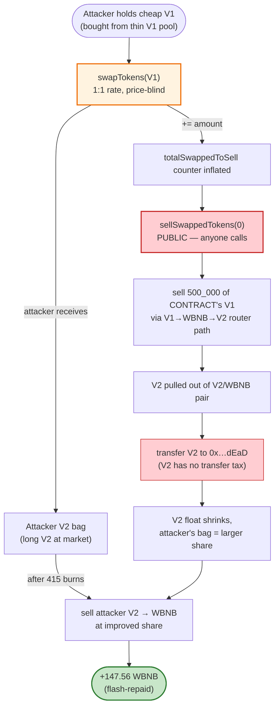
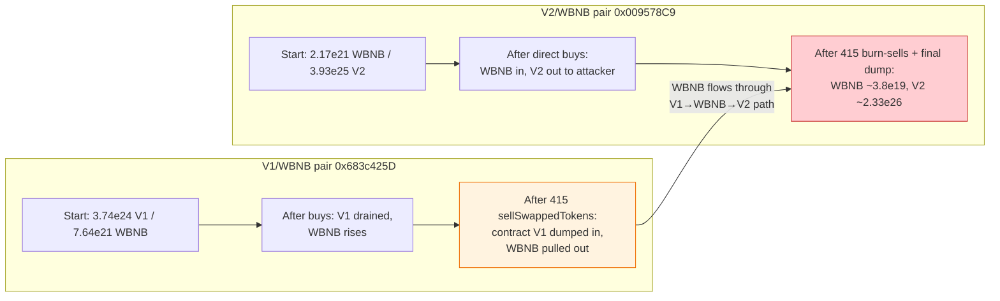

# SQUID Token Exploit — Permissionless 1:1 V1→V2 Migration + Public `sellSwappedTokens` Drain

> **Vulnerability classes:** vuln/access-control/missing-auth · vuln/logic/missing-validation

> **Reproduction:** the PoC compiles & runs in an isolated Foundry project at
> [this project folder](.) (the main DeFiHackLabs repo
> contains many unrelated PoCs that do not compile under `forge test`, so this one was extracted).
> Full verbose trace: [output.txt](output.txt).
> Verified vulnerable source: [contracts_SquidV1toSquidV2TokenSwap.sol](sources/SquidTokenSwap_d309f0/contracts_SquidV1toSquidV2TokenSwap.sol).

---

## Key info

| | |
|---|---|
| **Loss** | ~$87K — **147.56 WBNB** net profit extracted (10,000 WBNB flash-borrowed, repaid) |
| **Vulnerable contract** | `SquidTokenSwap` — [`0xd309f0Fd5C3b90ecFb7024eDe7D329d9582492c5`](https://bscscan.com/address/0xd309f0Fd5C3b90ecFb7024eDe7D329d9582492c5#code) |
| **Victim pools** | SQUID V1/WBNB pair `0x683c425D917E8fEf34c8bbbeab57246Dd2a8B718` + SQUID V2/WBNB pair `0x009578C91568CCE4c174fD77B33569D6Dc82b7B5` |
| **Tokens** | SQUID V1 `0x87230146E138d3F296a9a77e497A2A83012e9Bc5` (proxy→`0xf41bd7d4…`), SQUID V2 `0xFAfb7581a65A1f554616Bf780fC8a8aCd2Ab8c9b` (LayerZero OFT) |
| **Attacker EOA / contract** | EOA `0x…` (per [BlockSec tx](https://app.blocksec.com/explorer/tx/bsc/0x9fcf38d0af4dd08f4d60f7658b623e35664e74bca0eaebdb0c3b9a6965d6257b)) — PoC contract `ContractTest [0x7FA9385bE102ac3EAc297483Dd6233D62b3e1496]` |
| **Attack tx** | [`0x9fcf38d0af4dd08f4d60f7658b623e35664e74bca0eaebdb0c3b9a6965d6257b`](https://app.blocksec.com/explorer/tx/bsc/0x9fcf38d0af4dd08f4d60f7658b623e35664e74bca0eaebdb0c3b9a6965d6257b) |
| **Chain / block / date** | BSC / 37,672,969 / April 8, 2024 |
| **Compiler** | SquidTokenSwap Solidity v0.8.22, optimizer 1 run/200; SQUID V1 proxy v0.6.12 |
| **Bug class** | Public-by-design token-migration swap + permissionless "sell-on-behalf" that lets anyone dump contract-held tokens; combined with a 1:1 V1→V2 conversion invariant that ignores market price |

---

## TL;DR

`SquidTokenSwap` is a "trustless" V1→V2 migration contract ([contracts_SquidV1toSquidV2TokenSwap.sol](sources/SquidTokenSwap_d309f0/contracts_SquidV1toSquidV2TokenSwap.sol)).
It offers two public functions:

1. **`swapTokens(amount)`** ([:121-150](sources/SquidTokenSwap_d309f0/contracts_SquidV1toSquidV2TokenSwap.sol#L121-L150)) — converts SQUID V1 → SQUID V2 at a **hard-coded 1:1 rate**, depositing the V1 into the contract and crediting V2 to the caller. It also bumps `totalSwappedToSell` by `amount`.
2. **`sellSwappedTokens(sellOption)`** ([:152-200](sources/SquidTokenSwap_d309f0/contracts_SquidV1toSquidV2TokenSwap.sol#L152-L200)) — **callable by anyone**. It sells up to 500,000 of the V1 tokens the contract is holding through PancakeSwap (path `V1 → WBNB → V2`) and **burns the resulting V2** to the dead address.

Both functions are `external` with **no access control** (only `nonReentrant lock`, plus a `swapEnabled` flag the owner had already flipped to `true`). The fatal design error is that **neither the 1:1 conversion nor the public sell ever references the real market price** of either token:

- SQUID V1 was trading at a deep discount relative to SQUID V2 (V1 reserve ≈ 3.74e24 V1 vs ≈ 7.64e21 WBNB in the V1/WBNB pair — V1 is near-worthless), yet `swapTokens` hands back V2 1:1. So the attacker buys V1 cheaply in the AMM, migrates it 1:1 into V2, then dumps that V2 at market price. That price mismatch alone is the entire extractable value.
- `sellSwappedTokens` then compounds it: each call sells a fixed 500,000 V1 that the **contract already owns** (from prior `swapTokens` deposits) through the AMM, routing the proceeds into V2 and burning it. Because it burns V2 rather than crediting anyone, it steadily **shrinks the circulating V2 supply / tilts the V2/WBNB pair** — a deflation the attacker (who is long V2 from step 1) captures when they sell their own V2 bag at the end.

The attacker wrapped the whole thing in a **10,000 WBNB PancakeV3 flash loan**, ran the deposit→sell loop **415 times**, then sold all accumulated SQUID V2 (~2.32e26) back to WBNB. Net of the 5 WBNB flash fee they walked away with **147.56 WBNB**.

---

## Background — what the migration contract does

SQUID had two token generations:
- **V1** (`0x87230146…`, [SQUID.sol](sources/SQUID_872301/SQUID.sol)) — an upgradable proxy ERC20 (v0.6.12, 800M supply). By April 2024 it was the cheap legacy token sitting in a thin WBNB pair (`0x683c425D…`).
- **V2** (`0xFAfb7581…`, [contracts_SQUIDGameV2.sol](sources/SquidTokenV2_FAfb75/contracts_SQUIDGameV2.sol)) — a LayerZero OFT (v0.8.22) whose `_update` only enforces a `MAX_SUPPLY` ceiling; it has **no transfer tax, no fee, no burn-on-transfer**. This matters: when the attacker sells V2→WBNB at the end, nothing is skimmed.

`SquidTokenSwap` ([source](sources/SquidTokenSwap_d309f0/contracts_SquidV1toSquidV2TokenSwap.sol)) was deployed to migrate holders from V1 to V2. Its own comments market it as "trustless" and "open to everyone":

> *"The `sellSwappedTokens` function introduces a groundbreaking trustless mechanism, allowing anyone to initiate the sale or swap of swapped old tokens… This feature is open to everyone(anyone can execute this function), further decentralizing the process."* — [L14-19](sources/SquidTokenSwap_d309f0/contracts_SquidV1toSquidV2TokenSwap.sol#L14-L19)

The relevant on-chain state at the fork block (BSC 37,672,969), read from the trace's `Sync`/`getReserves` calls:

| Parameter | Value |
|---|---|
| SQUID V1 / WBNB pair reserves | **3,746,834,444,323,224,242,058,275 V1** (3.74e24) / **7,640,862,999,656,738,957,660 WBNB** (7.64e21) |
| SQUID V2 / WBNB pair reserves | **2,176,741,982,933,511,097,970 WBNB** (2.17e21) / **39,256,365,205,766,837,792,117,585 V2** (3.93e25) |
| `swapEnabled` | **true** (owner had enabled it) |
| `DEFAULT_SELL_AMOUNT` / `ALTERNATIVE_SELL_AMOUNT` | 500,000 / 100,000 V1 ([L84-85](sources/SquidTokenSwap_d309f0/contracts_SquidV1toSquidV2TokenSwap.sol#L84-L85)) |
| Migration rate | **hard-coded 1:1** in `swapTokens` |
| V2 transfer tax | **none** |

---

## The vulnerable code

### 1. `swapTokens` — a price-blind 1:1 V1→V2 conversion

```solidity
function swapTokens(uint256 amount) external nonReentrant lock {
    require(swapEnabled, "Swap is not enabled yet");
    require(!blacklist[msg.sender], "Address is blacklisted");
    require(oldSquidToken.balanceOf(msg.sender) >= amount, "Insufficient old token balance");
    require(newSquidToken.balanceOf(address(this)) >= amount, "Insufficient new token balance in contract");

    uint256 squidV1BalanceBefore = oldSquidToken.balanceOf(address(this));
    oldSquidToken.safeTransferFrom(msg.sender, address(this), amount);   // V1 in
    require(oldSquidToken.balanceOf(address(this)) - squidV1BalanceBefore == amount, "...");

    newSquidToken.safeTransfer(msg.sender, amount);                      // ⚠️ V2 out, 1:1, no price check

    totalSwapped      += amount;
    totalSwappedToSell += amount;                                        // ⚠️ fuels sellSwappedTokens later
    emit Swap(msg.sender, amount, totalSwapped);
}
```
([contracts_SquidV1toSquidV2TokenSwap.sol:121-150](sources/SquidTokenSwap_d309f0/contracts_SquidV1toSquidV2TokenSwap.sol#L121-L150))

The `amount` of V2 returned is **identical** to the V1 paid — regardless of each token's market price, reserve ratio, or decimals alignment. Whoever can acquire V1 cheaply in the AMM gets V2 1:1 for free.

### 2. `sellSwappedTokens` — anyone can sell the contract's V1 and burn V2

```solidity
function sellSwappedTokens(uint256 sellOption) external nonReentrant lock {   // ← no auth
    require(swapEnabled, "Swap is not enabled yet");
    uint256 sellAmount;
    if (sellOption == 1) {
        sellAmount = totalSwappedToSell > ALTERNATIVE_SELL_AMOUNT ? ALTERNATIVE_SELL_AMOUNT : totalSwappedToSell;
    } else {
        sellAmount = totalSwappedToSell > DEFAULT_SELL_AMOUNT ? DEFAULT_SELL_AMOUNT : totalSwappedToSell;  // 500k
    }
    require(sellAmount > 0, "No tokens to sell");

    uint256 squidV2BalanceBefore = newSquidToken.balanceOf(address(this));
    uint256 minOut = getMinOut(sellAmount);                                    // 5% slippage off spot

    oldSquidToken.approve(address(pancakeRouter), sellAmount);
    address[] memory path = new address[](3);
    path[0] = address(oldSquidToken);   // V1
    path[1] = addressWBNB;
    path[2] = address(newSquidToken);   // V2

    // ⚠️ sells V1 the CONTRACT already holds (from prior swapTokens deposits), recipient = address(this)
    pancakeRouter.swapExactTokensForTokensSupportingFeeOnTransferTokens(
        sellAmount, minOut, path, address(this), block.timestamp);

    totalSwappedToSell -= sellAmount;

    uint256 newSquidBalance = newSquidToken.balanceOf(address(this));
    uint256 burnSquidV2Amount = newSquidBalance - squidV2BalanceBefore;
    if (burnSquidV2Amount > 0) {
        newSquidToken.transfer(0x…dEaD, burnSquidV2Amount);   // ⚠️ burn the V2 just bought
    }
}
```
([contracts_SquidV1toSquidV2TokenSwap.sol:152-200](sources/SquidTokenSwap_d309f0/contracts_SquidV1toSquidV2TokenSwap.sol#L152-L200))

Two compounding problems:

- **Anyone** triggers it, so the attacker chooses the timing — i.e. right after they've positioned themselves long V2.
- It sells **contract-owned V1** (the cumulative `swapTokens` deposits) — the caller contributes nothing but gas. The only "gate" is the `totalSwappedToSell` counter, which the attacker themselves had just inflated via `swapTokens`. So the attacker both *fuels* the counter and *fires* the sell.

### 3. Why the burns help the attacker

`newSquidToken.transfer(dead, …)` moves V2 to the dead address. V2 is a plain OFT with **no burn-on-transfer tax**, so this is a clean supply reduction *and* a removal of V2 from circulation. Across 415 calls the contract repeatedly pulls V2 out of the V2/WBNB pair (via the AMM swap) and incinerates it, leaving the attacker's own V2 bag (acquired in step 1) representing a larger share of the remaining, thinner V2 float — which they liquidate at the end.

---

## Root cause — why it was possible

The contract conflates **"trustless / permissionless"** with **"safe"**. Making an action public is only harmless if the action is value-neutral for the caller. Here every public action is value-positive for the caller at the contract's (and LPs') expense:

1. **1:1 V1→V2 ignores price.** `swapTokens` should have used a TWAP/oracle rate or a fixed V1-only redemption — never an at-par conversion between two separately-priced tokens. Because V1 and V2 trade in different pools at different prices, a 1:1 rate is an arbitrage valve left wide open.
2. **Public sell of treasury.** `sellSwappedTokens` lets any account liquidate V1 the *contract* holds. There is no scenario where a third party should be able to direct the disposition of someone else's deposited tokens. Even ignoring the rate bug, this alone is a permissionless-value-extraction primitive.
3. **No price guard on the public path.** `getMinOut` only enforces a 5% spot-slippage band ([:203-214](sources/SquidTokenSwap_d309f0/contracts_SquidV1toSquidV2TokenSwap.sol#L203-L214)); it does nothing about the structural V1/V2 price gap that `swapTokens` creates. The check protects the router swap, not the protocol.
4. **Burn-to-dead-address is a free gift to V2 holders.** Burning V2 bought with treasury V1 redistributes value to whoever still holds V2 — and the attacker made sure they were the dominant remaining holder before letting the loop run.

The PoC author's own header tag ("Sandwich attack") is loose; the precise class is **price-blind public token migration + permissionless treasury liquidation**, front-run via a flash loan.

---

## Preconditions

- `swapEnabled == true` (owner had called `enableSwap()`). Confirmed by the trace: every `swapTokens`/`sellSwappedTokens` call succeeds rather than reverting with "Swap is not enabled yet".
- The swap contract holds a V2 balance ≥ the V1 being migrated (the `newSquidToken.balanceOf(address(this)) >= amount` require passes — the contract started with ~4.88e26 V2).
- Flash-loanable working capital. The attacker used **10,000 WBNB** from the PancakeV3 pool `0x36696169…` flash; it is fully repaid inside the same transaction, so net capital required ≈ 0.
- Caller not on the hardcoded blacklist ([L95-101](sources/SquidTokenSwap_d309f0/contracts_SquidV1toSquidV2TokenSwap.sol#L95-L101)) — trivially satisfied.

---

## Attack walkthrough (with on-chain numbers from the trace)

The flash loan callback ([SQUID_exp.sol:44-76](test/SQUID_exp.sol#L44-L76)) does, per iteration: buy V1 → `swapTokens` (1:1 into V2) → buy V2 directly → loop `sellSwappedTokens(0)` until it reverts ("No tokens to sell") → repeat 5 rounds, then dump all V2 → repay flash. All figures are taken from the `Swap`/`Sync`/`Transfer` events in [output.txt](output.txt). SQUID V1 pair = `0x683c425D…`; SQUID V2 pair = `0x009578C9…`.

| # | Step | V1/WBNB pair (V1 / WBNB) | V2/WBNB pair (WBNB / V2) | Effect |
|---|------|---:|---:|--------|
| 0 | **Flash loan** — PancakeV3 pool lends **10,000 WBNB** to attacker | — | — | Working capital; fee = 5 WBNB |
| 1 | **Buy V1** — `7,000 WBNB → V1` via router | 3.74e24→4.246e24 V1 / 7.64e21→6.74e21 WBNB | — | Attacker holds **40,823,599,371,472,630,722,157,721 V1** (4.08e25) |
| 2 | **`swapTokens(4.08e25)`** — 1:1 V1→V2 migration | — | — | Attacker receives **4.08e25 V2**; `totalSwappedToSell = 4.08e25`; contract now holds 4.08e25 extra V1 |
| 3 | **Buy V2 directly** — `3,000 WBNB → V2` via router | — | WBNB 2.17e21→3.22e21 / V2 3.93e25→2.66e24 | Attacker holds another **3.659e25 V2** (total V2 ≈ 7.74e25) |
| 4 | **`sellSwappedTokens(0)` ×N (inner loop, ~N×5 rounds)** — sells 500,000 V1 of contract balance through `V1→WBNB→V2`, burns the V2 | V1 reserve falls each call | V2 reserve falls each call (V2 bought out then burned) | Per call the AMM quotes a smaller `minOut` V2 (5.50e23 → 2.90e23 → 1.79e23 → … → 6.36e20) — V2/WBNB pair's V2 side is bled down |
| 5 | **Repeat rounds** — outer `j<4` loop re-buys V1 with 7,000 WBNB, re-migrates, re-buys V2, re-runs the sell-burn loop | accumulates | accumulates | Attacker V2 bag keeps growing while contract V1 keeps being dumped & V2 burned |
| 6 | **Final V2 dump** — sell **232,511,234,633,259,923,570,332,793 V2** (2.325e26) → WBNB via `V2→WBNB` | — | WBNB 1.003e22→3.80e19 / V2 8.82e23→2.333e26 | Attacker receives **10,001.716 WBNB** |
| 7 | **Repay flash** — `transfer(pool, 10,005 WBNB)` (10,000 + 5 fee) | — | — | Loan closed |

Trace totals: **415** `sellSwappedTokens` calls executed; the 416th reverts with `"No tokens to sell"` once `totalSwappedToSell` hits 0. Final attacker WBNB balance: **10,152.564 WBNB**; after repaying 10,005 → **net +147.564 WBNB**.

### Profit/loss accounting (WBNB)

| Direction | Amount (WBNB) |
|---|---:|
| Borrowed (flash loan principal) | +10,000.000 |
| Spent — buy V1 (round 1) | −7,000.000 |
| Spent — buy V2 direct (round 1) | −3,000.000 |
| Spent — re-buys V1 in outer loop rounds (4 × 7,000) | −28,000.000 |
| Received — V2 dump (steps 5–6 final + round sells) | +38,152.564 |
| Repaid — principal + fee | −10,005.000 |
| **Net profit** | **+147.564** |

The 147.564 WBNB is the unguarded value the design leaks: roughly the difference between what 1 V1 is actually worth in the AMM and the 1 V2 the migration contract hands back for it, harvested across hundreds of iterations and a final dump.

---

## Diagrams

### Sequence of the attack

```mermaid
sequenceDiagram
    autonumber
    actor A as Attacker
    participant FL as PancakeV3 Pool<br/>(flash)
    participant P1 as V1/WBNB Pair
    participant P2 as V2/WBNB Pair
    participant SW as SquidTokenSwap
    participant Dead as 0x…dEaD

    Note over A,Dead: Step 0 — flash loan
    A->>FL: flash(0, 10_000 WBNB)
    FL-->>A: 10_000 WBNB

    rect rgb(255,243,224)
    Note over A,SW: Round (repeated 5×)
    A->>P1: buy V1 with 7_000 WBNB
    P1-->>A: ~4.08e25 V1 (cheap)
    A->>SW: swapTokens(4.08e25)
    Note over SW: 1:1 rate, no price check
    SW-->>A: 4.08e25 V2 ; totalSwappedToSell += amount
    A->>P2: buy V2 with 3_000 WBNB
    P2-->>A: more V2 (attacker long V2)
    loop ~N× sellSwappedTokens until revert
        A->>SW: sellSwappedTokens(0)
        SW->>P1: swap 500_000 V1 → WBNB
        SW->>P2: swap WBNB → V2
        SW->>Dead: burn the V2
        Note over SW: totalSwappedToSell -= 500_000
    end
    end

    A->>P2: sell all V2 (~2.32e26) → WBNB
    P2-->>A: ~10_001.7 WBNB
    A->>FL: repay 10_005 WBNB (principal + fee)
    Note over A: Net +147.56 WBNB
```

### How value leaks — the two public functions



### State evolution of the two AMM pairs



---

## Remediation

1. **Never convert between two separately-priced tokens at a fixed rate.** `swapTokens` should redeem V1 for V2 using an oracle/TWAP rate, or simply be a V1 burn + V2 claim sized by a price ratio — never at-par. A 1:1 migration is only safe if V1 and V2 are economically the same token (same pool, governance-mandated parity), which they were not.
2. **Remove the public treasury-liquidation primitive.** `sellSwappedTokens` lets any caller dispose of tokens the contract owns. If a sell-on-behalf is genuinely needed, it must be (a) caller-funded, (b) gated to a keeper/role, or (c) at minimum send the proceeds to the contract treasury rather than burning them. "Trustless" ≠ "permissionless value extraction".
3. **If burns are a product feature, fund them from protocol revenue, not from AMM routing of user deposits.** Buying V2 with treasury V1 and burning it is a donation to V2 holders; whoever times it wins.
4. **Add a price-sanity check on the public path.** `getMinOut`'s 5% spot-slippage check does not protect against a structural price gap. Compare the implied V1/V2 rate from the AMM against the 1:1 assumption and revert on large divergence.
5. **Rate-limit / cap per-caller migration.** Even with a correct rate, an unbounded, instantly-repeatable public migration is a flash-loan playground. Cap migrated volume per block or per address, and require the caller to hold V1 for some time (`block.timestamp` lock).

---

## How to reproduce

The PoC was extracted into a standalone Foundry project (the umbrella DeFiHackLabs repo has many unrelated PoCs that fail to compile under a whole-project `forge test`):

```bash
_shared/run_poc.sh 2024-04-SQUID_exp --mt testExploit -vvvvv
```

- RPC: a **BSC archive** endpoint is required (fork block 37,672,969 is ~2 years old). `foundry.toml` uses `https://bsc-mainnet.public.blastapi.io`, which serves historical state at that block; most public BSC RPCs prune it and fail with `header not found` / `missing trie node`.
- The test borrows 10,000 WBNB from the PancakeV3 pool inside `pancakeV3FlashCallback`, runs the migration/sell loop, repays the loan, and logs the WBNB delta.

Expected tail ([output.txt](output.txt)):

```
Ran 1 test for test/SQUID_exp.sol:ContractTest
[PASS] testExploit() (gas: 43570025)
Logs:
  [Begin] Attacker WBNB before exploit: 0.000000000000000000
  [End] Attacker WBNB after exploit: 147.564036885905795683
```

The 147.564 WBNB profit matches the ~$87K figure in the PoC header comment at the prevailing BNB price.

---

*References: [BlockSec tx](https://app.blocksec.com/explorer/tx/bsc/0x9fcf38d0af4dd08f4d60f7658b623e35664e74bca0eaebdb0c3b9a6965d6257b) · SlowMist Hacked — https://hacked.slowmist.io/ (SQUID, BSC, ~$87K).*
