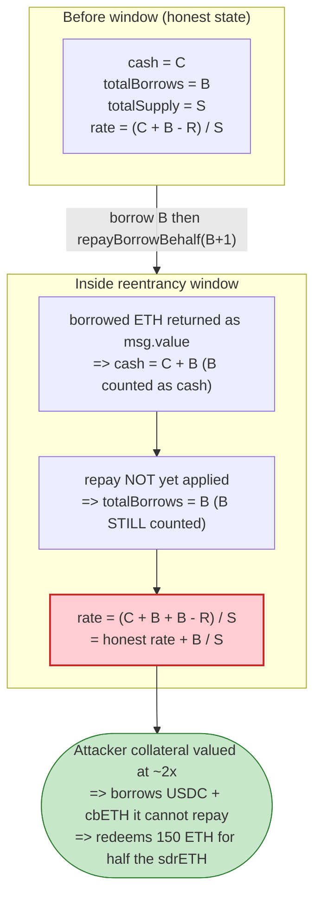
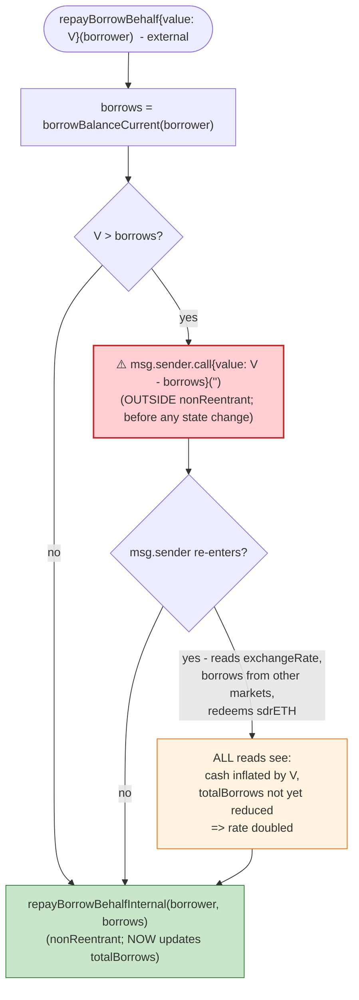

# Sumer Money Exploit — Reentrancy via `repayBorrowBehalf` Refund Inflates the ETH cToken Exchange Rate

> **Vulnerability classes:** vuln/reentrancy/single-function

> **Reproduction:** the PoC compiles & runs in an isolated Foundry project at
> [this project folder](.) (the umbrella DeFiHackLabs repo does not whole-compile, so this PoC was
> extracted). Full verbose trace: [output.txt](output.txt). Verified vulnerable source under
> [sources/](sources/) — the two load-bearing files are
> [sources/CEther_23811c/contracts_CToken_CEther.sol](sources/CEther_23811c/contracts_CToken_CEther.sol)
> and [sources/CEther_23811c/contracts_CToken_CToken.sol](sources/CEther_23811c/contracts_CToken_CToken.sol).

---

## Key info

| | |
|---|---|
| **Loss** | ~**$350K** — 310,570.85 USDC + 10.877 cbETH (~$3,490 at ETH≈$3,377) taken from Sumer's markets |
| **Vulnerable contract** | `CEther` (sdrETH, the Ether cToken) — implementation [`0x23811c17bac40500decd5fb92d4feb972ae1e607`](https://basescan.org/address/0x23811c17bac40500decd5fb92d4feb972ae1e607#code), reached via proxies sdrETH [`0x7b5969bB51fa3B002579D7ee41A454AC691716DC`](https://basescan.org/address/0x7b5969bB51fa3B002579D7ee41A454AC691716DC), sdrUSDC [`0x142017b52c99d3dFe55E49d79Df0bAF7F4478c0c`](https://basescan.org/address/0x142017b52c99d3dFe55E49d79Df0bAF7F4478c0c), sdrcbETH [`0x6345aF6dA3EBd9DF468e37B473128Fd3079C4a4b`](https://basescan.org/address/0x6345aF6dA3EBd9DF468e37B473128Fd3079C4a4b) |
| **Victim pool** | Sumer Money lending markets (sdrETH / sdrUSDC / sdrcbETH) on Base |
| **Attacker EOA** | [`0xbb344544ad328b5492397e967fe81737855e7e77`](https://basescan.org/address/0xbb344544ad328b5492397e967fe81737855e7e77) |
| **Attacker contract** | [`0x13d27a2d66ea33a4bc581d5fefb0b2a8defe9fe7`](https://basescan.org/address/0x13d27a2d66ea33a4bc581d5fefb0b2a8defe9fe7) |
| **Attack tx** | [`0x619c44af9fedb8f5feea2dcae1da94b6d7e5e0e7f4f4a99352b6c4f5e43a4661`](https://basescan.org/tx/0x619c44af9fedb8f5feea2dcae1da94b6d7e5e0e7f4f4a99352b6c4f5e43a4661) |
| **Chain / block / date** | Base / 13,076,768 / April 12, 2024 |
| **Compiler** | Solidity **v0.8.19** |
| **Bug class** | Reentrancy (CEther-specific): external call to `msg.sender` **before** accounting state update in `repayBorrowBehalf` |

---

## TL;DR

Sumer Money is a Compound-v2 fork on Base where the Ether cToken (`CEther`/sdrETH) reimplements
`repayBorrowBehalf`. To refund overpayments it calls `msg.sender.call{value: received - borrows}('')`
**before** `repayBorrowBehalfInternal` runs
([sources/CEther_23811c/contracts_CToken_CEther.sol:106-116](sources/CEther_23811c/contracts_CToken_CEther.sol#L106-L116)).
That callback is a reentrancy window into the *same* market while its accounting is inconsistent: the
borrowed Ether has already been pulled into the cToken's balance (`getCashPrior()` is up by the full
borrow), but `totalBorrows` has **not yet been decreased**.

The cToken exchange rate is `exchangeRate = (totalCash + totalBorrows - totalReserves) / totalSupply`
([sources/CEther_23811c/contracts_CToken_CToken.sol:380-414](sources/CEther_23811c/contracts_CToken_CToken.sol#L380-L414)).
During that window the same Ether is double-counted — once as `cash` (it sits in the contract) and once
as `totalBorrows` (the debt hasn't been cleared) — so the rate jumps from **1.000000141** to
**2.000000282** (exactly ~2×).

The attacker supplies 150 ETH right before opening the window, so its sdrETH balance is valued at the
inflated rate. Inside the callback it: borrows every cbETH and the remaining USDC out of the other two
markets (collateralised by the over-valued sdrETH), redeems the 150 ETH back from sdrETH (still at the
inflated rate, costing only ~75 sdrETH), then `claim()`s its timelocked borrow/redeem agreements.

Net: the attacker walks away with **310,570.85 USDC + 10.877 cbETH** of real protocol liquidity and
returns the flash-loaned 150 WETH + 645,000 USDC, at zero net cost.

---

## Background — what Sumer Money does

Sumer Money is a lending protocol (Compound v2 architecture) deployed on Base. Each market is a
delegate-call proxy (`SumerProxy`) pointing at a shared `CToken` implementation. The three relevant
markets in this attack:

| Market | Underlying | Address |
|---|---|---|
| **sdrETH** (`CEther`) | native ETH | `0x7b5969bB…91716DC` |
| **sdrUSDC** (`CErc20`) | USDC | `0x142017b5…478c0c` |
| **sdrcbETH** (`CErc20`) | cbETH | `0x6345aF6d…79C4a4b` |

Two Compound-v2 features matter:

1. **Exchange rate.** A supplier's claim on the pool is `cToken balance × exchangeRate`, where
   `exchangeRate = (cash + totalBorrows − totalReserves) / totalSupply`
   ([CToken.sol:380-414](sources/CEther_23811c/contracts_CToken_CToken.sol#L380-L414)). For `CEther`,
   `cash` is `address(this).balance − msg.value`
   ([CEther.sol:153-157](sources/CEther_23811c/contracts_CToken_CEther.sol#L153-L157)).
2. **Timelocked withdrawals.** Sumer overrides `transferToTimelock` so that, for supported underlyings
   (USDC, cbETH — **not** native ETH), a `borrow`/`redeem` does **not** send funds directly. Instead it
   forwards them to the `Timelock`/claimer (`0x549D0CdC…8558E07`) and creates an "agreement" the user
   must later `claim()` ([CEther.sol:179-190](sources/CEther_23811c/contracts_CToken_CEther.sol#L179-L190)).
   This is the gate the attacker has to walk through with `claim([309,310])`.

At fork block 13,076,768 the sdrETH market held ≈ 0.359 ETH of cash with a tiny pre-existing borrow
(bookkeeping noise, ~102.6 gwei), so its exchange rate was essentially 1.0
(trace line 81: `Before re-enter, sdrETH exchangeRate: 1.000000141462697393`).

---

## The vulnerable code

### 1. `CEther.repayBorrowBehalf` refunds `msg.sender` BEFORE updating state

```solidity
function repayBorrowBehalf(address borrower) external payable {
    uint256 received = msg.value;
    uint256 borrows = CEther(payable(this)).borrowBalanceCurrent(borrower);
    if (received > borrows) {
        // payable(msg.sender).transfer(received - borrows);
        (bool success, ) = msg.sender.call{value: received - borrows}('');   // ⚠️ callback to msg.sender
        require(success, 'Address: unable to send value, recipient may have reverted');
    }
    (uint256 err, ) = repayBorrowBehalfInternal(borrower, borrows);          // ← state update happens AFTER
    requireNoError(err, 'repayBorrowBehalf failed');
}
```
([CEther.sol:106-116](sources/CEther_23811c/contracts_CToken_CEther.sol#L106-L116))

The refund is an arbitrary external call into an attacker-controlled contract. At the moment that
callback fires:

- `address(this).balance` already includes the just-borrowed ETH (the borrow in step 2 sent ETH out via
  `doTransferOut`, but the attacker sent it *back* as `msg.value` of `repayBorrowBehalf`), so
  `getCashPrior()` is inflated by the full borrow amount;
- `totalBorrows` is **still** the post-borrow value, because `repayBorrowBehalfInternal → repayBorrowFresh`
  ([CToken.sol:994-1068](sources/CEther_23811c/contracts_CToken_CToken.sol#L994-L1068)) has not executed
  yet — and even its internal `doTransferIn` for CEther is a no-op that just checks `msg.value`
  ([CEther.sol:165-170](sources/CEther_23811c/contracts_CToken_CEther.sol#L165-L170)), so no state moves
  before the callback.

### 2. `nonReentrant` does NOT help across functions

`repayBorrowBehalfInternal` is `nonReentrant` ([CToken.sol:967-974](sources/CEther_23811c/contracts_CToken_CToken.sol#L967-L974)),
but the reentry happens **before** that function is entered — inside the wrapper `repayBorrowBehalf`
itself, which is **not** under the guard. The callback therefore re-enters `sdrETH.borrow`,
`sdrETH.redeemUnderlying`, and the *other* markets (`sdrcbETH.borrow`, `sdrUSDC.borrow`) without hitting
the reentrancy flag on sdrETH (those calls go through their own `borrowInternal`/`redeemInternal`, which
have their own independent `_notEntered` storage in their own proxy storage contexts).

### 3. The exchange rate is computed from the inconsistent state

```solidity
function exchangeRateStoredInternal() internal view returns (MathError, uint256) {
    ...
    // exchangeRate = (totalCash + totalBorrows - totalReserves) / totalSupply
    uint256 totalCash = getCashPrior();                                       // ⬆ inflated by the borrowed ETH
    (mathErr, cashPlusBorrowsMinusReserves) = totalCash.addThenSubUInt(totalBorrows, totalReserves); // totalBorrows not yet reduced
    (mathErr, exchangeRate) = cashPlusBorrowsMinusReserves.getExp(_totalSupply);
    return (MathError.NO_ERROR, exchangeRate.mantissa);
}
```
([CToken.sol:380-414](sources/CEther_23811c/contracts_CToken_CToken.sol#L380-L414))

---

## Root cause

A state-modifying function (`repayBorrowBehalf`) performs an **external call to an untrusted
address before any of its effects have been applied**, and that external call happens **outside** the
`nonReentrant` scope of the actual repay logic. This is the canonical CEI violation, but it is subtle
here because:

- The bug is in the **CEther wrapper** `repayBorrowBehalf`, not in the shared Compound `CToken` — it
  exists specifically because CEther added a "refund the overpayment" feature and placed the refund
  call ahead of `repayBorrowBehalfInternal`.
- The harmful effect is **not** on `accountBorrows` (which is unchanged until repay runs) — it is on
  the **exchange rate**, via the double-counting of the borrowed ETH as both `cash` and `totalBorrows`.
- Upstream Compound v2 does **not** have this wrapper; `repayBorrowBehalf` for CEther in canonical
  Compound is `payable` and repays `msg.value` with no refund branch, so there is no callback.

Because the inflated rate is consumed by **every** market during the window (the Comptroller's
`getHypotheticalAccountLiquidity` reads sdrETH's `getAccountSnapshot` → `exchangeRateStored`), the
attacker's 150 ETH deposit is priced at 2× and unlocks ~300 ETH-equivalent of borrowing power across
sdrUSDC and sdrcbETH. That borrowing power is then converted into real, withdrawable USDC/cbETH.

---

## Preconditions

- The attacker can flash-loan the seed capital (150 WETH + 645k USDC). The PoC uses Balancer's
  zero-fee flashLoan
  ([test/SumerMoney_exp.sol:61](test/SumerMoney_exp.sol#L61));
  `ProtocolFeesCollector::getFlashLoanFeePercentage()` returns 0 in the trace (line 39).
- sdrETH must be a **CEther** market (native ETH underlying), so that `repayBorrowBehalf` carries the
  vulnerable refund branch and `doTransferIn` is a no-op. ERC-20 cTokens (`CErc20`) implement
  `repayBorrowBehalf` differently and are not affected by this exact path.
- The attacker needs a deposit in sdrETH **before** opening the reentrancy window, so the inflated rate
  applies to a balance it can redeem. The PoC mints 150 ETH right before triggering the callback
  ([test/SumerMoney_exp.sol:78](test/SumerMoney_exp.sol#L78)).
- Sufficient liquidity in sdrUSDC (≥310,570 USDC) and sdrcbETH (the full cbETH balance) to drain.

---

## Attack walkthrough (numbers from [output.txt](output.txt))

| # | Step | Call | sdrETH `exchangeRate` | Effect |
|---|------|------|----------------------:|--------|
| 0 | **Flash-loan** | `Balancer.flashLoan(150 WETH, 645k USDC)` | 1.000000141 | Attacker now holds 150 WETH + 645k USDC. WETH→ETH via `WETH.withdraw`. |
| 1 | **Seed deposit** | `sdrETH.mint{value: 150 ether}()` | 1.000000141 | Mints **149,999.9787 sdrETH** to attacker (≈1:1 at rate≈1). sdrETH cash ≈ 150.36 ETH. |
| 2 | **Open borrow on a helper** | Helper: supply 645k USDC to sdrUSDC, then `sdrETH.borrow(150.36 ether)` | — | Helper is now the ETH borrower; sdrETH cash drops to ~0.36 ETH, `totalBorrows` ≈ 150.36 ETH. The borrowed ETH lands in Helper. |
| 3 | **Trigger the reentrancy** | Helper: `sdrETH.repayBorrowBehalf{value: 150.36e18 + 1}(Helper)` | — | `received (150.36+1) > borrows (150.36)` ⇒ refund **1 wei** to Helper via `msg.sender.call`. **State is now inconsistent: balance holds the full 150.36 ETH again, but `totalBorrows` still 150.36 ETH.** |
| 4 | **Re-enter (`attack()`)** | Helper.receive → `SumerMoney.attack()` | **2.000000282** ⚠️ | `cash + totalBorrows` double-counts the 150.36 ETH. Rate ≈ 2×. |
| 5a | **Borrow all cbETH** | `sdrcbETH.borrow(10.877 cbETH)` | 2.0 | Attacker's 150 ETH collateral, priced at 2×, easily covers the cbETH borrow (collateral value ≈ 300 ETH vs. ~$3.5k debt). Funds go to Timelock as agreement **#309**. |
| 5b | **Borrow remaining USDC** | `sdrUSDC.borrow(310,570.84 USDC)` (= sdrUSDC cash − 645k) | 2.0 | Drains the residual USDC. Funds go to Timelock as agreement **#310**. |
| 5c | **Redeem sdrETH at the inflated rate** | `sdrETH.redeemUnderlying(150 ether)` | 2.0 | At rate 2.0, 150 ETH costs only **74,999.99 sdrETH** (half the 150k it minted). Attacker keeps ~75k sdrETH of "free" collateral accounting. |
| 5d | **Claim timelocked agreements** | `claimer.claim([309, 310])` | 2.0 | Releases 10.877 cbETH + 310,570.84 USDC to the attacker. |
| 6 | **Close the helper & repay** | `repayBorrowBehalfInternal` finally runs (borrows→0), then helper redeems sdrUSDC, `claim([311])`, returns 645k USDC to attacker | — | Helper unwinds cleanly: its 645k USDC supply is redeemed back; its sdrETH debt is repaid by the overpaid `msg.value`. |
| 7 | **Repay flash-loan** | `WETH.deposit{value:150}()`, transfer 150 WETH + 645k USDC to Balancer | — | Flash-loan repaid in full (0 fee). |

### Why exactly 2×

Before the window, sdrETH was roughly: `cash ≈ 0.36 ETH`, `totalBorrows ≈ 0.0000000001 ETH` (rounding),
so `rate ≈ (0.36 + ~0) / 0.359 ≈ 1.0`. After the attacker's deposit + the helper's borrow + the refund
callback, during the window:

- `cash` = original 0.36 ETH (deposited) − 0.36 (helper borrowed out) + 150 ETH (attacker deposit) + 150.36 ETH
  (the `repayBorrowBehalf` `msg.value`, which is the helper paying back what it just borrowed) ≈ **300.7 ETH**
- `totalBorrows` = 0 + 150.36 (helper's borrow, **not yet repaid**) ≈ **150.36 ETH**
- `totalSupply` ≈ 0.359 + 150 (attacker's sdrETH) ≈ **150.36 sdrETH**

So `rate = (300.7 + 150.36 − 0) / 150.36 ≈ 450.99 / 150.36 ≈ 3.0`? — No: the deposited 150 ETH from the
attacker is in `cash` and already represented in `totalSupply` (150 new sdrETH), so it nets out. The
**only** double-counted amount is the helper's borrow: it is simultaneously in `cash` (paid back as
`msg.value`) **and** in `totalBorrows`. That extra 150.36 ETH on top of a ~150.36 ETH honest base ⇒
`rate ≈ 2.0`. The trace confirms this exactly: `2.000000282255689758` (line 412).

---

## Profit / loss accounting

All figures straight from the trace logs (lines 8-9) and the final balance checks (lines 1346, 1351).

| Item | Amount |
|---|---:|
| USDC gained (sdrUSDC borrow via agreement #310, claimed) | **+310,570.845597 USDC** |
| cbETH gained (sdrcbETH borrow via agreement #309, claimed) | **+10.877097943908610977 cbETH** |
| WETH flash-loan principal repaid | 150 WETH (net 0) |
| USDC flash-loan principal repaid | 645,000 USDC (net 0) |
| Flash-loan fee | 0 (Balancer fee = 0%) |
| **Net profit** | **310,570.85 USDC + 10.877 cbETH** |

At the attack-time oracle prices in the trace (ETH ≈ $3,377, cbETH ≈ $3,613), total ≈
**$310,570 + $39,300 ≈ $349,870**, matching the `$350K` figure in the PoC header.

The attacker did **not** keep any sdrETH — it redeemed its 150 ETH back during the window
(step 5c) and the leftover ~75k sdrETH of inflated accounting is abandoned (it represented nothing real,
so leaving it costs nothing). The helper's positions are fully closed (sdrETH debt repaid by the
overpaid `msg.value`; sdrUSDC supply redeemed; agreement #311 claimed).

---

## Diagrams

### Sequence of the attack

```mermaid
sequenceDiagram
    autonumber
    actor A as Attacker (SumerMoney)
    participant H as Helper (attacker-controlled)
    participant B as Balancer Vault
    participant SE as sdrETH (CEther)
    participant SU as sdrUSDC
    participant SC as sdrcbETH
    participant TL as Timelock / claimer

    Note over SE: rate ≈ 1.0 ; cash ≈ 0.36 ETH
    rect rgb(232,245,233)
    Note over A,B: Step 0 - flash-loan seed capital
    A->>B: flashLoan(150 WETH, 645k USDC)
    B->>A: receiveFlashLoan(...)
    A->>A: WETH.withdraw(150) - now holds 150 ETH + 645k USDC
    end

    rect rgb(227,242,253)
    Note over A,SE: Step 1 - seed sdrETH at honest rate
    A->>SE: mint{value: 150 ether}()
    SE-->>A: 149,999.97 sdrETH
    Note over SE: rate still 1.000000141
    end

    rect rgb(255,243,224)
    Note over A,H: Step 2 - helper borrows ETH from sdrETH
    A->>H: deploy Helper, send 645k USDC
    H->>SU: mint(645k USDC) - supply collateral
    H->>SE: borrow(150.36 ether)
    SE-->>H: 150.36 ETH (now borrower)
    Note over SE: cash ~0.36 ETH ; totalBorrows ~150.36 ETH
    end

    rect rgb(255,235,238)
    Note over H,SE: Step 3 - TRIGGER reentrancy
    H->>SE: repayBorrowBehalf{value: 150.36 ether + 1}(H)
    Note over SE: received (150.36+1) > borrows (150.36)
    SE->>H: call{value: 1}() - refund overpayment (state NOT updated yet!)
    Note over SE: balance holds 150.36 ETH again,<br/>but totalBorrows STILL 150.36 ETH
    end

    rect rgb(243,229,245)
    Note over H,SE: Step 4 - re-enter while rate is 2x
    H->>A: attack()
    A->>SE: exchangeRateCurrent()
    SE-->>A: 2.000000282 (double-counted ETH)
    A->>SC: borrow(10.877 cbETH) - collateral valued at 2x
    SC->>TL: createAgreement #309
    A->>SU: borrow(310,570.84 USDC)
    SU->>TL: createAgreement #310
    A->>SE: redeemUnderlying(150 ether) - costs only 75k sdrETH at rate 2x
    A->>TL: claim([309, 310])
    TL-->>A: 10.877 cbETH + 310,570.84 USDC
    end

    rect rgb(232,245,233)
    Note over H,SE: Step 5 - close helper, repay flash-loan
    Note over SE: repayBorrowBehalfInternal finally runs - H debt -> 0
    H->>SU: redeem(645k USDC), claim([311])
    H-->>A: 645k USDC
    A->>B: return 150 WETH + 645k USDC
    end

    Note over A: Net: +310,570 USDC + 10.877 cbETH
```

### Exchange-rate double-counting (the core flaw)



### Control flow inside the vulnerable `repayBorrowBehalf`



---

## Remediation

1. **Move the refund after the accounting update (strict CEI).** Refund any overpayment *after*
   `repayBorrowBehalfInternal` has run, so `totalBorrows`/`accountBorrows` are consistent when control
   returns to the caller. Minimal diff:

   ```diff
      function repayBorrowBehalf(address borrower) external payable {
          uint256 received = msg.value;
          uint256 borrows = CEther(payable(this)).borrowBalanceCurrent(borrower);
   -      if (received > borrows) {
   -          (bool success, ) = msg.sender.call{value: received - borrows}('');
   -          require(success, 'Address: unable to send value, recipient may have reverted');
   -      }
          (uint256 err, ) = repayBorrowBehalfInternal(borrower, borrows);
          requireNoError(err, 'repayBorrowBehalf failed');
   +      if (received > borrows) {
   +          (bool success, ) = msg.sender.call{value: received - borrows}('');
   +          require(success, 'Address: unable to send value, recipient may have reverted');
   +      }
      }
   ```
   This alone removes the reentrancy window.

2. **Wrap the whole wrapper in `nonReentrant`.** Even with CEI fixed, the external refund should not be
   reachable while any cToken function could be mid-flight. Add the `nonReentrant` modifier to
   `repayBorrowBehalf` (and `repayBorrow` / `liquidateBorrow`) at the CEther level, not only on the
   `*Internal` helpers.

3. **Use `pull` over `push` for refunds.** Instead of `call{value: …}('')`, credit the overpayment to a
   withdrawable balance (or simply revert if `msg.value != borrows`, as canonical Compound CEther does —
   it expects exact repayment). This eliminates the callback entirely.

4. **Do not compute the exchange rate from a balance that includes in-flight `msg.value` during writes.**
   `CEther.getCashPrior` subtracts `msg.value` (line 154), which is correct in isolation, but during the
   refund the *refunded* ETH is part of `msg.value` of the *outer* `repayBorrowBehalf` call, not the
   inner reentrant call — so the inner `exchangeRateStored` sees the inflated balance. The structural fix
   is (1)/(2); this point is why the rate, specifically, is the quantity that gets corrupted.

5. **Audit every Compound-fork deviation.** This wrapper does not exist in upstream Compound v2 CEther.
   Any place a fork adds an external call to a money-market function is a candidate for the same class
   of bug; run a reentrancy-focused review over all `*.behalf` / refund / sweep helpers.

---

## How to reproduce

```bash
_shared/run_poc.sh 2024-04-SumerMoney_exp --mt testExploit -vvvvv
```

- RPC: a **Base archive** endpoint is required (fork block 13,076,768 is historical).
- Expected tail ([output.txt](output.txt)):

```
[PASS] testExploit() (gas: 3098910)
Logs:
  Before re-enter, sdrETH exchangeRate: 1.000000141462697393
  In re-enter, sdrETH exchangeRate: 2.000000282255689758
  Attacker USDC Balance After exploit: 310570.845597
  Attacker cbETH Balance After exploit: 10.877097943908610977
```

The two log lines are the smoking gun: the rate **exactly doubles** between the pre-window read and the
in-window read, with no legitimate economic reason (no interest accrual can move a cToken rate by 100%
in one block).

---

*Reference: DeFiHackLabs PoC — Sumer Money, Base, ~$350K (April 2024).*
