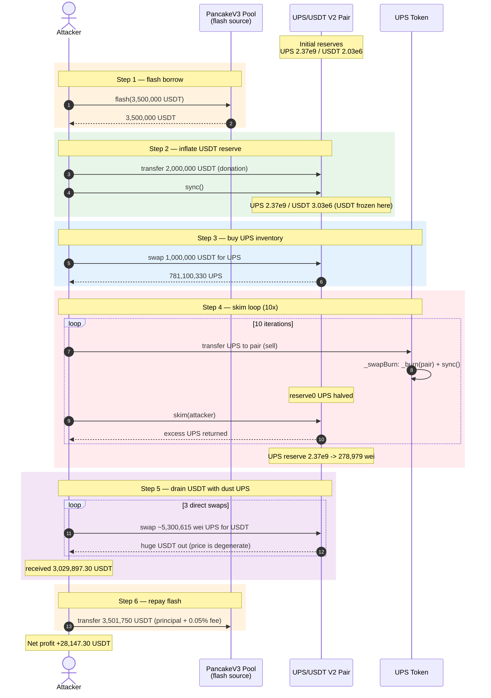
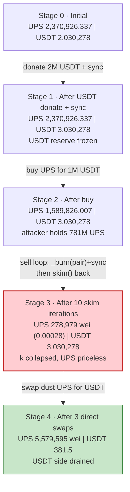
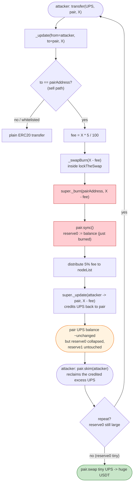
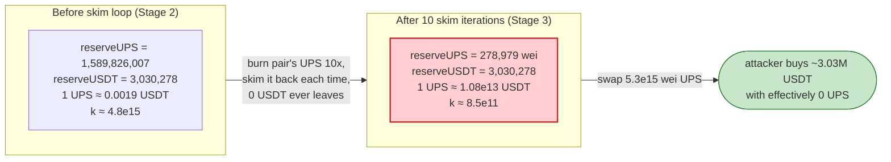

# UPS (UtopiaSphere) Exploit — Sell-Side `_swapBurn` Drains the LP Pair via `skim`

> **Vulnerability classes:** vuln/access-control/missing-auth · vuln/oracle/price-manipulation

> **Reproduction:** the PoC compiles & runs in an isolated Foundry project at
> [this project folder](.) (the umbrella DeFiHackLabs repo mixes many unrelated
> PoCs that do not build together, so this one was extracted).
> Full verbose trace: [output.txt](output.txt).
> Verified vulnerable source: [UPS.sol](sources/UPS_3dA482/UPS.sol).

---

## Key info

| | |
|---|---|
| **Loss** | **~$28,147 USDT** drained from the UPS/USDT PancakeSwap V2 pair (the PoC comment reports ~$28K) |
| **Vulnerable contract** | `UPS` (UtopiaSphere) — [`0x3dA4828640aD831F3301A4597821Cc3461B06678`](https://bscscan.com/address/0x3dA4828640aD831F3301A4597821Cc3461B06678#code) |
| **Victim pool** | UPS/USDT PancakeSwap V2 pair — `0xA2633ca9Eb7465E7dB54be30f62F577f039a2984` |
| **Flash source** | PancakeSwap V3 USDT/WBNB pool — `0x4f31Fa980a675570939B737Ebdde0471a4Be40Eb` |
| **Attacker contract** | `0x7FA9385bE102ac3EAc297483Dd6233D62b3e1496` (the PoC `ContractTest`) |
| **Attack tx** | [`0xd03702e17171a32464ce748b8797008d59e2dbcecd3b3847d5138414566c886d`](https://app.blocksec.com/explorer/tx/bsc/0xd03702e17171a32464ce748b8797008d59e2dbcecd3b3847d5138414566c886d) |
| **Chain / block / date** | BSC / 37,680,754 / April 2024 |
| **Compiler** | UPS: Solidity **v0.8.25**, optimizer on, **200 runs** |
| **Bug class** | Broken AMM invariant — protocol `_burn`s tokens directly out of the LP pair on every sell, then `sync()`s; combinable with `skim()` to extract value |

---

## TL;DR

`UPS._update` overrides ERC20 so that **every sell into the pair** (i.e. any `transfer`
where `to == pairAddress`) silently calls `_swapBurn(amount - fee)`, which does:

```solidity
super._burn(pairAddress, amount);   // destroy UPS the LP owns
ISwapPair(pairAddress).sync();       // force the pair to adopt the new (smaller) reserve
```

([UPS.sol:842-845](sources/UPS_3dA482/UPS.sol#L842-L845), sell branch at
[:893-907](sources/UPS_3dA482/UPS.sol#L893-L907)).

That is an **uncompensated removal of the pair's UPS reserve** — the LP loses UPS but
no USDT leaves, so the constant product `k` collapses and UPS becomes extremely
expensive in USDT terms. Worse, because the burn-and-sync is a *side-effect of the
transfer itself*, an attacker can sell into the pair and then immediately `skim()`
the freshly-credited UPS back, repeating the cycle. Each iteration destroys ~half of
the pair's remaining UPS reserve without giving up any real value, driving `reserveUPS`
toward zero while `reserveUSDT` stays fixed.

The attacker:

1. **Flash-borrows 3,500,000 USDT** from a PancakeSwap V3 pool.
2. **Donates 2,000,000 USDT** directly to the V2 pair + `sync()` — inflating the USDT
   reserve to 3,030,278.80 USDT.
3. **Buys** ~781,100,330 UPS for 1,000,000 USDT (a normal swap, the only "honest" leg).
4. **Runs a 10-iteration `transfer UPS → pair; pair.skim(attacker)` loop.** Each sell
   triggers `_swapBurn`, halving the pair's UPS reserve; `skim()` returns the deposited
   UPS to the attacker, so the loop is almost free. UPS reserve collapses
   **2,370,926,337 → 278,979 (≈ 0.00028 UPS)** while USDT stays at 3,030,278.80.
5. **Performs 3 direct `pair.swap()` calls**, feeding ≈ 5,579,595 wei (≈ 0.00558 UPS)
   into a pool whose UPS reserve is now 278,979 wei — pulling out
   **3,029,897.30 USDT** total because each wei of UPS is now worth millions of USDT.
6. **Repays** the flash loan (3,500,000 + 1,750 fee = 3,501,750 USDT) and keeps
   **+28,147.30 USDT**.

Net result: the attacker walks off with ~28K USDT of genuine LP liquidity, having used
the borrowed 3.5M only as flash collateral.

---

## Background — what UPS does

`UPS` ([source](sources/UPS_3dA482/UPS.sol)) is an ERC20Burnable/Ownable token
deployed on BSC with a custom `_update` hook that implements a **buy/sell tax + deflationary
burn** model on top of its own PancakeSwap V2 pair:

- **Pair is created at construction**
  ([:837](sources/UPS_3dA482/UPS.sol#L837)): `pairAddress = factory.createPair(USDT, UPS)`.
  Token0 = UPS, token1 = USDT (confirmed by the `Sync` events — `reserve0` is the huge
  UPS number, `reserve1` is the smaller USDT number).
- **Buy gate** — buys from the pair are blocked until `canBuy` is true or the oracle
  price exceeds `5e14` (0.0005 USDT per UPS), `getPrice()` reads the pair reserves
  ([:861-871](sources/UPS_3dA482/UPS.sol#L861-L871), [:887-892](sources/UPS_3dA482/UPS.sol#L887-L892)).
- **Sell-side fee + burn** — when a user sells UPS into the pair (`to == pairAddress`),
  5% is sent to a `nodeList`, and the **remaining 95% is burned out of the pair** via
  `_swapBurn` before the user's tokens are forwarded
  ([:893-907](sources/UPS_3dA482/UPS.sol#L893-L907)).

On-chain state at the fork block (37,680,754), read from the trace:

| Parameter | Value |
|---|---|
| `totalSupply` | 420 × 1e8 × 1e18 = **4.2e28** (42 billion × 8-decimals; here shown at 18) |
| Pool UPS reserve (`reserve0`) | **2,370,926,337.66 UPS** |
| Pool USDT reserve (`reserve1`) | **2,030,278.80 USDT** ← the prize, pre-donation |
| `nodeList` | non-empty (transfers to ~40 node addresses appear on each sell) |
| `canBuy` | false initially (price gate active) |

The decisive design fault: the burn is taken **from the LP pair's own balance**, not from
the seller or the protocol treasury.

---

## The vulnerable code

### 1. The `_swapBurn` primitive — burn-from-pair + `sync()`

```solidity
function _swapBurn(uint amount) private lockTheSwap {
    super._burn(pairAddress, amount);     // ⚠️ destroy UPS owned by the LP
    ISwapPair(pairAddress).sync();         // ⚠️ force pair to accept the reduced balance as its reserve
}
```
([UPS.sol:842-845](sources/UPS_3dA482/UPS.sol#L842-L845))

### 2. It fires on every sell into the pair

```solidity
function _update(address from, address to, uint256 amount) internal virtual override {
    if (inSwapAndLiquify || whiteMap[from] || whiteMap[to] || !(from == pairAddress || to == pairAddress)) {
        super._update(from, to, amount);
    } else if (from == pairAddress) {                 // buy
        require(canBuy || getPrice() > 5e14, "can not trade");
        if (!canBuy) { canBuy = true; }
        super._update(from, to, amount);
    } else if (to == pairAddress) {                   // ⚠️ sell
        uint256 fee = amount * 5 / 100;
        if (!inSwapAndLiquify) {
            _swapBurn(amount - fee);                  // ⚠️ burns (95% of sale) FROM THE PAIR
        }
        if (nodeList.length > 0) {
            uint256 every = fee / nodeList.length;
            for (uint256 i = 0; i < nodeList.length; i++) {
                super._update(from, nodeList[i], every);   // 5% distributed to nodes
            }
        } else {
            _burn(from, fee);
        }
        super._update(from, to, amount - fee);        // seller's net UPS forwarded to pair
    }
}
```
([UPS.sol:883-908](sources/UPS_3dA482/UPS.sol#L883-L908))

`_swapBurn` is protected by `lockTheSwap` against naive re-entrancy, but it is **not**
protected against being value-extractive: every sell destroys `amount - fee` of the
pair's UPS and then `sync()`s. The subsequent `super._update(from, to, amount - fee)`
credits the same `amount - fee` back to the pair, so the pair's UPS *balance* is roughly
unchanged — but its **`reserve0` was just shrunk by the burn** while `reserve1` (USDT)
is untouched. The net effect of a single sell is therefore a **huge leftward shift in
the AMM price curve**: the same USDT now buys far less UPS, or equivalently, a tiny UPS
amount now buys a huge USDT amount.

---

## Root cause — why it was possible

A Uniswap-V2-style pair only enforces `x·y ≥ k` *inside `swap()`*. `sync()` exists so a
pair can re-baseline its reserves to its actual token balances after legitimate
`mint`/`burn`/transfer activity it can reason about. `_swapBurn` abuses this trust:

> It **destroys** UPS that the pair holds (`_burn(pairAddress, …)`) and then tells the
> pair, via `sync()`, "your UPS reserve is now this much smaller." No USDT leaves the
> pair. The product `k` collapses and the marginal price of UPS skyrockets — **for free,
> as a side-effect of an ordinary sell transfer.**

Three compounding mistakes turn this into a drain:

1. **Burn source is the LP pair, not the seller or treasury.** A deflationary sell-tax
   should remove tokens from the *seller's* notional (or buy & burn from protocol
   revenue). Burning the pair's own balance is a direct confiscation of LP value.
2. **`sync()` immediately commits the manipulated reserve.** Because the burn is
   followed by `sync()` within the same transfer, the next call sees the degenerate
   reserves — there is no window where honest arbitrage can restore the price before the
   attacker re-enters.
3. **Combinable with `skim()`.** After the attacker sells UPS into the pair, the
   `super._update(from → pair, amount-fee)` leg credits that UPS to the pair *on top of*
   the post-burn balance, leaving the pair over-funded versus its (just-synced) reserve.
   The attacker calls `pair.skim(attacker)` to withdraw the excess UPS straight back —
   so the entire destructive loop costs the attacker essentially nothing but fees, while
   each pass burns another large chunk of the pair's reserve.

---

## Preconditions

- A working UPS/USDT V2 pair with non-zero USDT liquidity (✓: 2,030,278.80 USDT).
- Flash capital to inflate the USDT reserve and buy the initial UPS inventory. The PoC
  borrows **3,500,000 USDT** from a V3 pool (0.05% fee → 1,750 USDT) — fully repaid
  intra-transaction, so the attack is **flash-loanable and capital-free** for the
  attacker.
- The `transfer(to == pair)` sell path must be reachable by the attacker. The `canBuy`
  gate only restricts the buy direction; sells are unrestricted
  ([:893](sources/UPS_3dA482/UPS.sol#L893)). The attacker's first legitimate buy also
  flips `canBuy = true`, clearing the gate for any later reads.

---

## Attack walkthrough (with on-chain numbers from the trace)

Pair ordering: `reserve0 = UPS`, `reserve1 = USDT`. All figures are pulled directly
from the `Sync` / `Swap` / `Flash` events in [output.txt](output.txt). The `>>>>` lines
in the trace print `attacker's UPS balance, pair's UPS balance` at the start of each
loop iteration.

| # | Step | UPS reserve | USDT reserve | Effect |
|---|------|------------:|-------------:|--------|
| 0 | **Flash borrow** 3,500,000 USDT from V3 pool | 2,370,926,337.66 | 2,030,278.80 | Attacker holds 3.5M USDT. |
| 1 | **Donate** 2,000,000 USDT to V2 pair + `sync()` | 2,370,926,337.66 | **3,030,278.80** | USDT reserve inflated; USDT side stays fixed from here on. |
| 2 | **Buy** UPS with 1,000,000 USDT via router | 1,589,826,007.35 | 3,030,278.80 | Attacker receives 781,100,330.30 UPS. |
| 3 | **skim-loop iter 1** — `transfer 742,045,313.79 UPS → pair`, sell fires `_swapBurn`, then `skim()` | 847,780,693.56 | 3,030,278.80 | UPS reserve nearly halved; attacker reclaims the deposited UPS via `skim`. |
| 4 | **skim-loop iter 2** | 142,837,645.47 | 3,030,278.80 | |
| 5 | **iter 3** | 7,141,882.27 | 3,030,278.80 | |
| 6 | **iter 4** | 357,094.11 | 3,030,278.80 | |
| 7 | **iter 5** | 17,854.71 | 3,030,278.80 | |
| 8 | **iter 6** | 892.74 | 3,030,278.80 | |
| 9 | **iter 7** | 44.64 | 3,030,278.80 | |
| 10 | **iter 8** | 2.23 | 3,030,278.80 | |
| 11 | **iter 9** | 0.112 | 3,030,278.80 | |
| 12 | **iter 10** | 0.00558 (5,579,595 wei) | 3,030,278.80 | UPS reserve now microscopic. |
| 13 | **`getReserves()`** shows `r0 = 278,979 wei`, `r1 = 3,030,278.80 USDT` | 0.000279 | 3,030,278.80 | Used as pricing base for the next 3 swaps. |
| 14 | **Direct `pair.swap(0, 2,878,404.16, attacker, "")`** — send 5,300,615,749 wei UPS in | 5,579,595 wei | 151,874.64 | `getAmountOut(5.3e15 − 2.789e14, 2.789e14, 3.03e24)` = **2,878,404.16 USDT** out. |
| 15 | **Direct swap #2** — same 5,300,615,749 wei UPS in | 5,579,595 wei | 7,611.81 | pulls **144,262.83 USDT**. |
| 16 | **Direct swap #3** — same 5,300,615,749 wei UPS in | 5,579,595 wei | 381.50 | pulls **7,230.31 USDT**. |
| 17 | **Repay** flash: 3,500,000 + 1,750 fee = **3,501,750 USDT** | — | — | V3 pool restored + fee. |

**Why each burn roughly halves the UPS reserve:** the sell sends `X = min(attacker,
pair)` UPS into the pair. `_swapBurn` burns `X − fee ≈ 0.95·X` from the pair, and
`super._update` then credits `0.95·X` back — so the pair's UPS balance ends ~unchanged,
but its `reserve0` was just `sync()`ed down by the burn. Because the attacker sizes `X`
to the current pair balance, each pass burns a large fraction of the standing reserve,
geometrically driving `reserve0` toward zero while `reserve1` is frozen.

### Profit accounting (USDT)

The 3 direct swaps pull **3,029,897.30 USDT** out of the pair (which held
3,030,278.80 USDT after the donation — i.e. the attacker drains essentially the
*entire* USDT side). Of that, **2,000,000 USDT was the attacker's own donation**
and **1,000,000 USDT** was spent on the initial buy (the resulting UPS is what gets
recycled through the skim loop and the 3 dust swaps). Reconciling the attacker's hand:

| Direction | Amount (USDT) |
|---|---:|
| Flash-borrowed from V3 | +3,500,000.00 |
| Donated to V2 pair (inflates USDT reserve; recovered only via the swaps below) | −2,000,000.00 |
| Bought UPS via router (the UPS is dumped back in steps 3–5) | −1,000,000.00 |
| Received — direct swap #1 | +2,878,404.16 |
| Received — direct swap #2 | +144,262.83 |
| Received — direct swap #3 | +7,230.31 |
| Repay flash principal | −3,500,000.00 |
| Repay V3 flash fee (0.05%) | −1,750.00 |
| **Net profit** | **+28,147.30** |

Equivalently: the attacker injected 3,000,000 USDT (donate + buy) and pulled
3,029,897.30 USDT back, minus the 1,750 flash fee → **+28,147.30 USDT**, which is the
honest LP's USDT (2,030,278.80) minus the 2,000,000 donation plus the recycled buy
value. The PoC log confirms to the wei:
`[End] Attacker USDT after exploit: 28147.304776769921957768`.

---

## Diagrams

### Sequence of the attack



### Pool state evolution



### The flaw inside `_update` / `_swapBurn`



### Why the burn is theft: price before vs. after



---

## Remediation

1. **Never burn from the liquidity pool.** A sell-side deflation must destroy tokens the
   *seller* or the *protocol* owns — never the pair's balance. Removing
   `super._burn(pairAddress, …)` from `_swapBurn` (or removing `_swapBurn` from the sell
   path entirely) eliminates the invariant break. If "burn-on-sell reaching the pool" is
   a product requirement, implement it as the protocol buying back and burning from its
   own treasury, funded by real revenue.
2. **Do not `sync()` as a side-effect of a transfer.** Even if a burn must touch the pair,
   never let user-driven `transfer` calls mutate the pair's recorded reserves. Reserve
   updates belong to `swap`/`mint`/`burn` only.
3. **Make the deflation mechanics `onlyRole`/keeper-gated.** Any operation that can move
   a pool reserve should not be triggerable by an arbitrary holder via a plain transfer.
4. **Add a reentrancy/value-extraction guard around the sell path.** A `lockTheSwap`
   boolean that only blocks re-entrant *calls* does not block the value-extraction
   pattern (transfer → external `skim` → repeat). The contract should detect and reject
   sell sequences that would burn more than a tiny fraction of the reserve in one
   transaction.
5. **Don't let reserves be donation-inflated.** The attacker pre-inflated the USDT
   reserve by a direct transfer + `sync()`; any logic that reads `getReserves()` for
   trust decisions (the `getPrice() > 5e14` gate here) should use a TWAP/oracle rather
   than the manipulable instantaneous reserve.

---

## How to reproduce

The PoC was extracted into a standalone Foundry project (the umbrella DeFiHackLabs repo
has many unrelated PoCs that fail to compile together):

```bash
_shared/run_poc.sh 2024-04-UPS_exp --mt testExploit -vvvvv
```

- RPC: a **BSC archive** endpoint is required (fork block 37,680,754 is well over a year
  old). `foundry.toml` is configured for a BSC archive RPC; most public BSC endpoints
  prune this block and fail with `header not found` / `missing trie node`.
- Result: `[PASS] testExploit()` with final balance `28147.304776769921957768` USDT.

Expected tail:

```
[Begin] Attacker USDT before exploit: 0.000000000000000000
>>>> 781100330303169117310636451 1589826007352123383157266307 <<<<
... (10 skim-loop balance prints, UPS reserve collapsing) ...
>>>> 697425277290509566119197531 111591910519923901 <<<<
[End] Attacker USDT after exploit: 28147.304776769921957768
Suite result: ok. 1 passed; 0 failed; 0 skipped; finished in 28.41s
```

---

*Reference: attack tx
[0xd037…886d](https://app.blocksec.com/explorer/tx/bsc/0xd03702e17171a32464ce748b8797008d59e2dbcecd3b3847d5138414566c886d)
on BSC, April 2024 — ~$28K USDT loss. Bug class: protocol-initiated burn-from-pair +
`sync()` breaking the AMM invariant, drained via a `transfer → skim` loop and dust-UPS
swaps.*
